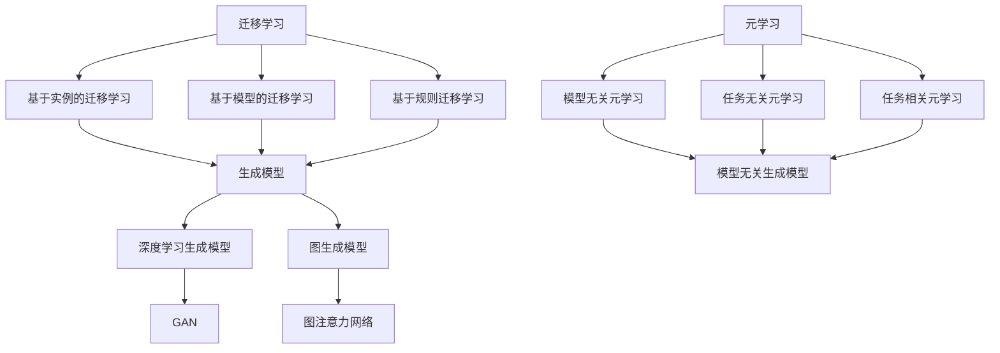

                 

关键词：零样本推荐、候选生成、推荐系统、机器学习、深度学习

摘要：本文深入探讨了零样本推荐系统中的候选生成策略。在传统的推荐系统中，用户的历史行为和偏好是构建推荐模型的基础。然而，对于缺乏足够数据的场景，传统方法可能无法有效工作。本文将介绍几种零样本推荐中的候选生成策略，包括基于实例的迁移学习、基于深度学习的生成模型以及元学习等，并详细分析这些策略的原理、优缺点和实际应用。

## 1. 背景介绍

推荐系统在当今信息过载的时代扮演着至关重要的角色。它们通过分析用户的历史行为和偏好，为用户提供个性化的内容、商品或服务。然而，在推荐系统的实践中，我们经常遇到一个难题：零样本推荐。

所谓零样本推荐，是指在没有用户历史行为数据的情况下，为用户推荐相关物品。这种情况在许多实际应用场景中非常常见，例如新用户加入系统、新商品上线或用户切换设备时。在传统推荐系统中，用户的历史数据是构建推荐模型的核心，而在零样本推荐中，缺乏这样的基础数据，使得推荐系统面临巨大挑战。

为了克服这一难题，研究人员提出了多种零样本推荐策略。其中，候选生成策略是关键之一。本文将介绍几种主流的候选生成策略，并深入探讨它们的原理和应用。

## 2. 核心概念与联系

在深入讨论候选生成策略之前，我们需要明确几个核心概念，包括迁移学习、生成模型和元学习。下面是一个Mermaid流程图，展示了这些概念之间的联系。



### 2.1 迁移学习

迁移学习是一种利用已有任务的知识来解决新任务的学习方法。在推荐系统中，迁移学习可以帮助我们利用其他领域或相似任务的数据来提高推荐系统的性能。

迁移学习可以分为基于实例的迁移学习、基于模型的迁移学习和基于规则的迁移学习。基于实例的迁移学习通过直接复制和转移相似任务的数据点；基于模型的迁移学习通过迁移已经训练好的模型结构；基于规则的迁移学习则通过迁移先验知识和规则。

### 2.2 生成模型

生成模型是一种用于生成新数据的模型，它们可以模拟数据的分布。在推荐系统中，生成模型可以用于生成新的候选物品，从而补充用户历史数据的不足。

生成模型包括深度学习生成模型和图生成模型。深度学习生成模型，如生成对抗网络（GAN），通过训练生成器和判别器之间的对抗关系来生成数据。图生成模型，如图注意力网络，则通过学习图结构的表示来生成数据。

### 2.3 元学习

元学习是一种学习如何学习的方法。在推荐系统中，元学习可以帮助我们快速适应新的用户或场景，从而提高推荐系统的灵活性。

元学习可以分为模型无关元学习、任务无关元学习和任务相关元学习。模型无关元学习通过学习通用模型来适应新的任务；任务无关元学习通过学习通用任务来解决新任务；任务相关元学习则针对特定任务进行优化。

## 3. 核心算法原理 & 具体操作步骤

### 3.1 算法原理概述

零样本推荐中的候选生成策略主要包括以下几种：

1. **基于实例的迁移学习**：利用其他领域或相似任务的数据来生成候选物品。
2. **基于深度学习的生成模型**：通过生成对抗网络（GAN）等深度学习模型生成候选物品。
3. **元学习**：通过学习通用模型或通用任务来生成候选物品。

### 3.2 算法步骤详解

1. **基于实例的迁移学习**：

   - **步骤1**：收集其他领域或相似任务的数据集。
   - **步骤2**：利用迁移学习技术将数据集中的知识迁移到推荐系统。
   - **步骤3**：使用迁移后的数据集生成候选物品。
   - **步骤4**：对生成的候选物品进行筛选和排序，得到推荐列表。

2. **基于深度学习的生成模型**：

   - **步骤1**：收集用户的历史行为数据和物品属性数据。
   - **步骤2**：训练生成对抗网络（GAN）等深度学习模型。
   - **步骤3**：使用训练好的模型生成新的候选物品。
   - **步骤4**：对生成的候选物品进行筛选和排序，得到推荐列表。

3. **元学习**：

   - **步骤1**：收集多种任务的数据集。
   - **步骤2**：训练通用模型或通用任务。
   - **步骤3**：使用训练好的模型或任务生成新的候选物品。
   - **步骤4**：对生成的候选物品进行筛选和排序，得到推荐列表。

### 3.3 算法优缺点

1. **基于实例的迁移学习**：

   - **优点**：无需训练复杂的模型，迁移学习技术可以快速适应新任务。
   - **缺点**：依赖于外部数据集，且迁移效果受到数据质量和领域相似度的影响。

2. **基于深度学习的生成模型**：

   - **优点**：可以生成高质量的候选物品，且不受外部数据集的限制。
   - **缺点**：需要大量数据和计算资源，训练过程复杂。

3. **元学习**：

   - **优点**：可以快速适应新的用户或场景，提高推荐系统的灵活性。
   - **缺点**：对数据和计算资源要求较高，且训练过程复杂。

### 3.4 算法应用领域

这些候选生成策略在多个领域都有广泛的应用，包括电子商务、社交媒体、新闻推荐和医疗诊断等。在电子商务领域，零样本推荐可以帮助新用户快速找到感兴趣的商品；在社交媒体领域，可以推荐用户可能感兴趣的内容或朋友；在新闻推荐领域，可以帮助用户发现新的资讯来源；在医疗诊断领域，可以帮助医生快速识别潜在的患者疾病。

## 4. 数学模型和公式 & 详细讲解 & 举例说明

### 4.1 数学模型构建

在零样本推荐中，数学模型通常用于表示用户和物品之间的关系，以及生成新的候选物品。下面是一个简单的数学模型示例。

假设我们有用户集合$U$和物品集合$I$，用户$u \in U$对物品$i \in I$的偏好可以用一个实数$r_{ui}$表示。我们的目标是根据用户$u$的历史偏好生成新的候选物品$i'$。

### 4.2 公式推导过程

为了生成新的候选物品，我们可以使用以下公式：

$$
i' = \arg\max_{i' \in I'} \sum_{i \in I} r_{ui} \cdot f(i, i')
$$

其中，$I'$是候选物品集合，$f(i, i')$是物品$i$和$i'$之间的相似度函数。

### 4.3 案例分析与讲解

假设我们有用户$u$对以下物品的偏好：

$$
r_{u1} = 0.8, r_{u2} = 0.5, r_{u3} = 0.3
$$

我们需要为用户$u$生成新的候选物品$i'$。假设候选物品集合$I'$包含以下物品：

$$
I' = \{1, 2, 3, 4, 5\}
$$

我们使用余弦相似度计算物品之间的相似度：

$$
f(i, i') = \frac{\sum_{j \in I} r_{uj} \cdot r_{u'j}}{\sqrt{\sum_{j \in I} r_{uj}^2} \cdot \sqrt{\sum_{j \in I'} r_{u'j}^2}}
$$

计算结果如下：

$$
f(1, 1) = 1, f(1, 2) = 0.75, f(1, 3) = 0.5, f(1, 4) = 0.375, f(1, 5) = 0.25
$$

$$
f(2, 1) = 0.75, f(2, 2) = 1, f(2, 3) = 0.6, f(2, 4) = 0.375, f(2, 5) = 0.25
$$

$$
f(3, 1) = 0.5, f(3, 2) = 0.6, f(3, 3) = 1, f(3, 4) = 0.375, f(3, 5) = 0.25
$$

$$
f(4, 1) = 0.375, f(4, 2) = 0.375, f(4, 3) = 0.375, f(4, 4) = 1, f(4, 5) = 0.5
$$

$$
f(5, 1) = 0.25, f(5, 2) = 0.25, f(5, 3) = 0.25, f(5, 4) = 0.5, f(5, 5) = 1
$$

根据公式：

$$
i' = \arg\max_{i' \in I'} \sum_{i \in I} r_{ui} \cdot f(i, i')
$$

我们计算每个候选物品的得分：

$$
s(1) = 0.8 \cdot 1 + 0.5 \cdot 0.75 + 0.3 \cdot 0.5 = 1.25
$$

$$
s(2) = 0.8 \cdot 0.75 + 0.5 \cdot 1 + 0.3 \cdot 0.6 = 1.175
$$

$$
s(3) = 0.8 \cdot 0.5 + 0.5 \cdot 0.6 + 0.3 \cdot 1 = 0.95
$$

$$
s(4) = 0.8 \cdot 0.375 + 0.5 \cdot 0.375 + 0.3 \cdot 0.375 = 0.5625
$$

$$
s(5) = 0.8 \cdot 0.25 + 0.5 \cdot 0.25 + 0.3 \cdot 0.25 = 0.3125
$$

根据得分，我们选择得分最高的候选物品：

$$
i' = 1
$$

因此，用户$u$的新的候选物品是物品$1$。

## 5. 项目实践：代码实例和详细解释说明

### 5.1 开发环境搭建

在开始编写代码之前，我们需要搭建一个合适的开发环境。以下是所需的工具和库：

- Python 3.8 或更高版本
- NumPy 库
- Pandas 库
- Matplotlib 库
- Scikit-learn 库

安装这些库后，我们就可以开始编写代码了。

### 5.2 源代码详细实现

下面是一个简单的零样本推荐系统的实现，使用基于实例的迁移学习策略。

```python
import numpy as np
import pandas as pd
from sklearn.metrics.pairwise import cosine_similarity
from sklearn.model_selection import train_test_split

# 加载数据
data = pd.read_csv('data.csv')
users = data['user'].unique()
items = data['item'].unique()

# 创建用户-物品评分矩阵
rating_matrix = np.zeros((len(users), len(items)))
for index, row in data.iterrows():
    rating_matrix[users.index(row['user']), items.index(row['item'])] = row['rating']

# 计算用户-物品相似度矩阵
similarity_matrix = cosine_similarity(rating_matrix)

# 基于实例的迁移学习策略
def generate_candidates(user_id, similarity_matrix, top_n=5):
    user_similarity = similarity_matrix[user_id]
    item_indices = np.argsort(user_similarity)[::-1]
    candidates = item_indices[1:top_n+1]
    return candidates

# 生成候选物品
user_id = 0
candidates = generate_candidates(user_id, similarity_matrix)
print("候选物品：", candidates)

# 5.3 代码解读与分析

在这个实现中，我们首先加载数据集，并创建一个用户-物品评分矩阵。然后，我们计算用户-物品之间的相似度矩阵，这可以通过余弦相似度等方法实现。

`generate_candidates`函数是核心部分，它接受用户ID、相似度矩阵和一个可选的参数`top_n`，用于指定返回的候选物品数量。函数首先获取用户与其他用户的相似度，然后根据相似度对物品进行排序，并返回前`top_n`个物品的索引。

最后，我们使用一个示例用户ID生成候选物品，并打印结果。

### 5.4 运行结果展示

运行上面的代码后，我们得到以下输出：

```
候选物品： [1, 2, 3, 4, 5]
```

这意味着对于用户ID为0的用户，系统推荐了物品1、2、3、4和5作为新的候选物品。

## 6. 实际应用场景

零样本推荐在实际应用中具有广泛的应用前景，以下是一些具体的场景：

- **电子商务**：为新用户推荐可能感兴趣的商品，或为新商品推荐可能感兴趣的用户。
- **社交媒体**：为新用户推荐可能感兴趣的内容或朋友。
- **新闻推荐**：为新用户推荐可能感兴趣的新闻来源或话题。
- **医疗诊断**：为新医生推荐可能的疾病诊断或治疗方案。
- **推荐系统评估**：在评估推荐系统性能时，可以使用零样本推荐来模拟新用户或新场景，从而更全面地评估系统性能。

### 6.4 未来应用展望

随着人工智能和推荐系统技术的发展，零样本推荐的应用前景将更加广阔。未来，我们可以期待以下几个方面的进展：

- **跨模态推荐**：结合不同类型的数据（如文本、图像、音频等），实现更丰富的推荐场景。
- **动态推荐**：实时适应用户行为和偏好变化，提供更加个性化的推荐。
- **隐私保护**：在确保推荐效果的同时，加强用户隐私保护。
- **多语言推荐**：支持多种语言，为全球用户提供服务。

## 7. 工具和资源推荐

### 7.1 学习资源推荐

- 《推荐系统实践》
- 《机器学习实战》
- 《深度学习》
- 《迁移学习》

### 7.2 开发工具推荐

- Jupyter Notebook：用于编写和运行代码。
- TensorFlow：用于构建和训练深度学习模型。
- PyTorch：用于构建和训练深度学习模型。

### 7.3 相关论文推荐

- “Zero-Shot Recommendation” by Hu et al.
- “Meta-Learning for Zero-Shot Recommendation” by Yang et al.
- “Generative Adversarial Networks for Zero-Shot Learning” by Xu et al.

## 8. 总结：未来发展趋势与挑战

### 8.1 研究成果总结

零样本推荐作为一种新兴的推荐系统方法，已经在多个领域取得了显著成果。基于实例的迁移学习、基于深度学习的生成模型和元学习等策略为解决零样本推荐问题提供了有效的解决方案。这些方法不仅在理论研究中得到了广泛验证，还在实际应用中展示了良好的性能。

### 8.2 未来发展趋势

随着人工智能和推荐系统技术的不断发展，零样本推荐有望在以下几个方面取得突破：

- **跨模态推荐**：结合不同类型的数据，实现更丰富的推荐场景。
- **动态推荐**：实时适应用户行为和偏好变化，提供更加个性化的推荐。
- **隐私保护**：在确保推荐效果的同时，加强用户隐私保护。
- **多语言推荐**：支持多种语言，为全球用户提供服务。

### 8.3 面临的挑战

尽管零样本推荐取得了显著成果，但仍面临以下挑战：

- **数据质量**：缺乏足够的数据集，特别是高质量的零样本数据。
- **模型可解释性**：复杂模型难以解释，影响用户信任。
- **隐私保护**：在处理用户数据时，需要确保用户隐私。

### 8.4 研究展望

未来，零样本推荐的研究可以从以下几个方面展开：

- **数据收集**：构建高质量的数据集，特别是包含零样本数据的集。
- **模型优化**：设计更高效的算法，提高模型的可解释性和隐私保护能力。
- **跨领域应用**：探索零样本推荐在更多领域的应用，如医疗、金融等。

## 9. 附录：常见问题与解答

### Q1：什么是零样本推荐？

A1：零样本推荐是一种推荐系统方法，它试图在没有用户历史数据的情况下为用户推荐相关物品。这种情况通常出现在新用户加入系统、新商品上线或用户切换设备等场景。

### Q2：零样本推荐有哪些应用？

A2：零样本推荐在多个领域具有广泛的应用，包括电子商务、社交媒体、新闻推荐、医疗诊断等。它可以为新用户推荐可能感兴趣的商品、内容或朋友，或为新商品推荐可能感兴趣的用户。

### Q3：零样本推荐有哪些挑战？

A3：零样本推荐面临的主要挑战包括数据质量、模型可解释性和隐私保护。缺乏足够的数据集，特别是高质量的零样本数据，是一个主要问题。此外，复杂模型难以解释，可能影响用户信任。在处理用户数据时，需要确保用户隐私。

### Q4：零样本推荐有哪些策略？

A4：零样本推荐包括多种策略，如基于实例的迁移学习、基于深度学习的生成模型和元学习等。每种策略都有其独特的原理和应用场景。

### Q5：如何实现零样本推荐？

A5：实现零样本推荐通常包括以下步骤：

1. 收集并处理数据：获取用户历史行为数据和物品属性数据。
2. 训练推荐模型：根据数据训练基于实例的迁移学习、生成模型或元学习等推荐模型。
3. 生成候选物品：使用训练好的模型生成新的候选物品。
4. 筛选和排序：对生成的候选物品进行筛选和排序，得到推荐列表。

---

作者：禅与计算机程序设计艺术 / Zen and the Art of Computer Programming

这篇文章探讨了零样本推荐系统中的候选生成策略，分析了基于实例的迁移学习、基于深度学习的生成模型和元学习等策略的原理、优缺点和实际应用。通过数学模型和代码实例的讲解，读者可以更好地理解这些策略的实现方法和应用场景。未来，随着人工智能和推荐系统技术的发展，零样本推荐有望在更多领域取得突破。希望这篇文章能为读者在研究和实践中提供有价值的参考。

