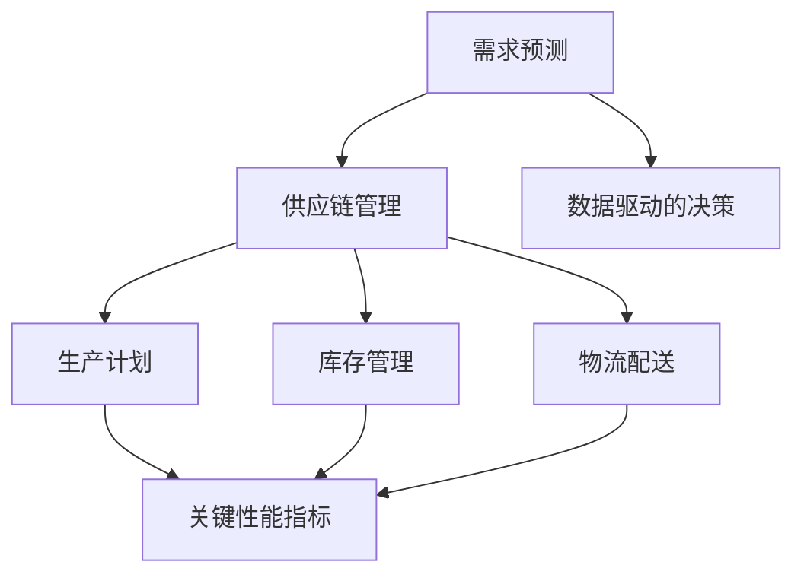
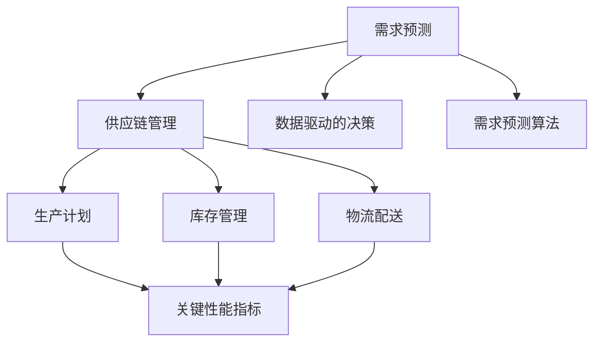

                 

### 1. 背景介绍

在当今快速变化的市场环境中，需求预测成为企业成功的关键因素之一。随着全球化和互联网技术的快速发展，消费者需求越来越多样化和个性化，企业面临着前所未有的挑战。有效的需求预测可以帮助企业优化供应链管理，降低库存成本，提高服务水平，从而在激烈的市场竞争中脱颖而出。

供应链优化是企业管理中至关重要的一环，它涉及到生产计划、库存管理、物流配送等多个环节。传统的供应链管理方法往往基于历史数据和经验，但这种方法在应对快速变化的市场需求时显得力不从心。随着大数据和人工智能技术的崛起，基于数据驱动的方法逐渐成为供应链优化的新趋势。

本文将探讨需求预测在创业中的重要性，以及如何利用先进的技术手段进行供应链优化。首先，我们将介绍需求预测的核心概念，并阐述其在供应链管理中的作用。随后，我们将深入探讨需求预测算法的原理和具体操作步骤，帮助读者了解如何在实际项目中应用这些算法。接着，我们将介绍相关的数学模型和公式，并通过案例分析与讲解，展示这些模型在实践中的应用。此外，我们还将分享一些项目实践中的代码实例和详细解释，帮助读者更好地理解需求预测的实际操作过程。最后，我们将讨论需求预测在各个实际应用场景中的价值，并展望其未来的发展趋势。

通过本文的阅读，读者将能够全面了解需求预测在供应链优化中的作用，掌握相关的算法原理和实践技巧，为创业项目的成功提供有力支持。

### 2. 核心概念与联系

在深入探讨需求预测之前，我们首先需要明确几个核心概念，这些概念是理解需求预测及其在供应链管理中作用的基础。

#### 2.1 需求预测

需求预测，顾名思义，是指利用历史数据和市场信息，对未来某个时间段内的需求量进行估计。它通常涉及多个变量，包括季节性因素、价格波动、市场趋势等。准确的需求预测可以帮助企业做出更合理的生产计划，减少库存积压和缺货风险。

#### 2.2 供应链管理

供应链管理涉及从原材料采购到最终产品交付给消费者的整个过程。它包括生产计划、库存管理、物流配送、需求预测等多个环节。有效的供应链管理可以提高生产效率，降低成本，提升客户满意度。

#### 2.3 数据驱动的决策

数据驱动的决策是指利用数据分析技术，基于大量历史数据和实时信息，做出更科学、更准确的决策。在需求预测中，数据驱动的决策尤为重要，因为它可以降低人为判断的误差，提高预测的准确性。

#### 2.4 关键性能指标（KPI）

在需求预测和供应链管理中，关键性能指标（KPI）是衡量效果的重要工具。常见的KPI包括库存周转率、服务水平、交货周期等。通过监控这些指标，企业可以及时调整策略，优化供应链运营。

接下来，我们将使用Mermaid流程图来展示这些核心概念之间的联系，以便读者更直观地理解需求预测在供应链管理中的作用。



#### 2.5 数据驱动的决策

在需求预测和供应链管理中，数据驱动的决策是一个至关重要的概念。它意味着企业不再单纯依赖经验或直觉，而是通过分析大量历史数据和市场信息，来做出更加科学和准确的决策。数据驱动的决策不仅能够提高需求预测的准确性，还可以优化供应链的各个环节，从而提高整体运营效率。

#### 2.6 需求预测算法

需求预测算法是实现数据驱动决策的核心工具。这些算法可以分为基于统计学的传统方法（如ARIMA模型）和基于机器学习的现代方法（如神经网络、决策树等）。传统方法通常较为简单，易于理解和实现，但它们在面对复杂和动态的市场环境时，表现往往不佳。相比之下，机器学习方法能够通过学习历史数据，捕捉到更多的模式和规律，从而提供更准确的预测。

#### 2.7 关键性能指标（KPI）

在需求预测和供应链管理中，关键性能指标（KPI）是衡量效果的重要工具。常见的KPI包括库存周转率、服务水平、交货周期等。通过监控这些指标，企业可以及时调整策略，优化供应链运营。

接下来，我们将使用Mermaid流程图来展示这些核心概念之间的联系，以便读者更直观地理解需求预测在供应链管理中的作用。



通过上述流程图，我们可以看到需求预测在供应链管理中的核心地位。它不仅是供应链管理的重要输入，还与生产计划、库存管理、物流配送等多个环节紧密相连，共同构成了一个高效、灵活的供应链体系。

### 3. 核心算法原理 & 具体操作步骤

#### 3.1 算法原理概述

需求预测算法的核心目标是利用历史数据和现有信息，对未来某个时间段内的需求量进行估计。这些算法可以分为传统方法和现代方法。传统方法通常基于统计学原理，如时间序列分析（如ARIMA模型）、回归分析等。这些方法相对简单，易于理解和实现，但在处理复杂和动态的市场环境时，表现往往有限。

相比之下，现代方法如机器学习和深度学习，能够在大量数据中挖掘出更深层次的规律和模式。常见的机器学习算法包括线性回归、决策树、随机森林、神经网络等。深度学习算法，如卷积神经网络（CNN）和循环神经网络（RNN），则能够处理更加复杂的数据结构和非线性关系。

在需求预测中，机器学习和深度学习算法的优势在于它们能够自适应地调整模型参数，从而提高预测的准确性。以下是一些常用的需求预测算法：

1. **时间序列分析**：如ARIMA（自回归积分滑动平均模型）、ETS（误差修正模型）等。这些算法通过分析时间序列数据中的趋势、季节性和循环性，来预测未来的需求。

2. **回归分析**：包括线性回归、多元回归等。这些算法通过建立自变量和因变量之间的关系，来预测需求。

3. **机器学习算法**：如线性回归、决策树、随机森林、支持向量机（SVM）等。这些算法能够从大量历史数据中学习出复杂的模式，从而提供更准确的预测。

4. **深度学习算法**：如卷积神经网络（CNN）、循环神经网络（RNN）、长短期记忆网络（LSTM）等。这些算法能够处理序列数据，捕捉到时间序列中的长期依赖关系。

#### 3.2 算法步骤详解

下面我们将详细讨论一些常用需求预测算法的具体操作步骤，包括数据准备、模型训练和预测结果分析。

##### 3.2.1 数据准备

数据准备是需求预测的基础步骤。以下是数据准备的关键步骤：

1. **数据收集**：收集与需求相关的历史数据，如销售数据、库存数据、价格数据、促销活动数据等。

2. **数据清洗**：处理缺失值、异常值和重复数据，确保数据的质量。

3. **特征工程**：根据需求预测的目标，提取有用的特征，如时间序列的季节性特征、价格弹性、促销影响等。

4. **数据预处理**：包括归一化、标准化、缩放等，以便于算法处理。

##### 3.2.2 模型训练

在数据准备完成后，我们选择合适的算法进行模型训练。以下是模型训练的步骤：

1. **选择算法**：根据业务需求和数据特点，选择合适的算法。如时间序列分析中的ARIMA模型、机器学习中的线性回归、深度学习中的LSTM等。

2. **参数调优**：通过交叉验证等方法，选择最佳的模型参数，提高预测准确性。

3. **训练模型**：使用历史数据对模型进行训练，生成预测模型。

##### 3.2.3 预测结果分析

在模型训练完成后，我们使用模型对未来的需求进行预测，并进行结果分析。以下是预测结果分析的关键步骤：

1. **预测生成**：使用训练好的模型，对未来的需求进行预测，生成预测结果。

2. **误差分析**：计算预测结果与实际需求之间的误差，如均方误差（MSE）、均方根误差（RMSE）等。

3. **模型评估**：根据误差分析结果，评估模型的效果，如模型精度、召回率等。

4. **策略调整**：根据预测结果和评估结果，调整供应链管理策略，如库存水平、生产计划等。

#### 3.3 算法优缺点

不同需求预测算法各有优缺点，选择合适的算法需要根据业务需求和数据特点来决定。以下是几种常用算法的优缺点：

1. **时间序列分析**：优点是简单易懂，适合处理时间序列数据；缺点是难以处理多变量和复杂的市场环境。

2. **回归分析**：优点是能够捕捉自变量和因变量之间的关系，适合处理线性关系；缺点是难以处理非线性关系。

3. **机器学习算法**：优点是能够处理复杂的多变量关系，捕捉到更多的模式；缺点是需要大量的数据，计算复杂度高。

4. **深度学习算法**：优点是能够处理序列数据，捕捉到长期依赖关系，适合处理复杂和非线性关系；缺点是需要大量的数据和计算资源，模型复杂度高。

#### 3.4 算法应用领域

需求预测算法在多个领域都有广泛应用，以下是几个典型的应用场景：

1. **零售行业**：通过需求预测，优化库存管理，降低库存成本，提高服务水平。

2. **制造业**：通过需求预测，优化生产计划，提高生产效率，降低库存风险。

3. **物流行业**：通过需求预测，优化物流配送，提高运输效率，降低成本。

4. **金融行业**：通过需求预测，预测市场走势，进行风险管理，优化投资策略。

通过本文的讨论，我们可以看到需求预测算法在供应链优化中的重要作用。选择合适的算法，并合理应用这些算法，可以帮助企业实现更高效、更灵活的供应链管理，提高市场竞争力。

### 4. 数学模型和公式 & 详细讲解 & 举例说明

#### 4.1 数学模型构建

在需求预测中，构建一个精确的数学模型是非常重要的，它能够帮助我们更好地理解和预测未来的需求趋势。以下是几种常用的数学模型，以及它们的基本构建方法和适用场景。

##### 4.1.1 线性回归模型

线性回归模型是最简单且广泛应用的需求预测模型之一。它基于线性关系，通过拟合一条直线来预测需求。

$$
Y = \beta_0 + \beta_1X + \epsilon
$$

其中，\( Y \) 是需求量，\( X \) 是影响需求的因素（如时间、价格等），\( \beta_0 \) 和 \( \beta_1 \) 是模型的参数，\( \epsilon \) 是误差项。

**适用场景**：线性回归模型适用于需求与影响因素之间呈线性关系的情况。

##### 4.1.2 ARIMA模型

ARIMA（自回归积分滑动平均模型）是时间序列分析中的经典模型，适用于处理含有趋势和季节性成分的数据。

$$
Y_t = c + \phi_1Y_{t-1} + \phi_2Y_{t-2} + ... + \phi_pY_{t-p} + \theta_1\epsilon_{t-1} + \theta_2\epsilon_{t-2} + ... + \theta_q\epsilon_{t-q} + \epsilon_t
$$

其中，\( Y_t \) 是时间序列数据，\( \phi \) 和 \( \theta \) 是模型参数，\( c \) 是常数项，\( p \) 和 \( q \) 是自回归和滑动平均的阶数。

**适用场景**：ARIMA模型适用于具有趋势和季节性特征的时间序列数据。

##### 4.1.3 ETS模型

ETS（误差修正模型）是一种扩展的平滑模型，适用于处理包含趋势和季节性成分的数据。

$$
Y_t = \alpha Y_{t-1} + \beta T_{t-1} + \gamma S_{t-1} + \epsilon_t
$$

其中，\( Y_t \)、\( T_t \) 和 \( S_t \) 分别代表趋势、季节性和趋势季节性成分，\( \alpha \)、\( \beta \) 和 \( \gamma \) 是模型参数。

**适用场景**：ETS模型适用于具有趋势和季节性特征的数据。

#### 4.2 公式推导过程

为了更好地理解这些数学模型的推导过程，下面我们将简要介绍ARIMA模型的推导过程。

**ARIMA模型的推导过程**：

1. **自回归（AR）**：

   首先，我们考虑一个简单的自回归模型，它只包含自回归项。

   $$
   Y_t = \phi_1Y_{t-1} + \epsilon_t
   $$

   其中，\( \phi_1 \) 是自回归系数，\( \epsilon_t \) 是误差项。

2. **移动平均（MA）**：

   接下来，我们引入移动平均项。

   $$
   Y_t = \phi_1Y_{t-1} + \theta_1\epsilon_{t-1}
   $$

   其中，\( \theta_1 \) 是移动平均系数。

3. **自回归移动平均（ARMA）**：

   将自回归和移动平均结合起来，得到ARMA模型。

   $$
   Y_t = \phi_1Y_{t-1} + \theta_1\epsilon_{t-1} + \epsilon_t
   $$

4. **积分（I）**：

   为了处理非平稳数据，我们对ARMA模型进行差分，得到ARIMA模型。

   $$
   Y_t = \phi_1Y_{t-1} + \theta_1\epsilon_{t-1} + \epsilon_t - \epsilon_{t-1}
   $$

   通过差分，我们使模型变得平稳。

5. **ARIMA模型**：

   最终，我们得到ARIMA模型。

   $$
   Y_t = \phi_1Y_{t-1} + \phi_2Y_{t-2} + ... + \phi_pY_{t-p} + \theta_1\epsilon_{t-1} + \theta_2\epsilon_{t-2} + ... + \theta_q\epsilon_{t-q} + \epsilon_t
   $$

#### 4.3 案例分析与讲解

为了更好地理解上述数学模型的应用，下面我们通过一个实际案例来进行详细讲解。

**案例背景**：

一家零售企业需要预测未来三个月内某商品的销量。企业收集了最近一年的销售数据，包括每天的销售量。以下是部分数据：

| 日期       | 销售量 |
|------------|--------|
| 2023-01-01 | 150    |
| 2023-01-02 | 140    |
| 2023-01-03 | 130    |
| ...        | ...    |
| 2023-12-31 | 200    |

**步骤 1：数据准备**

首先，我们需要对数据进行预处理，包括数据清洗、特征提取和归一化等。

**步骤 2：模型选择**

由于数据包含明显的趋势和季节性成分，我们选择ARIMA模型进行预测。

**步骤 3：参数估计**

通过最小二乘法或其他优化算法，我们估计出模型参数 \( \phi_1 \)、\( \theta_1 \) 等。例如，我们可以通过 ACF（自相关函数）和 PACF（偏自相关函数）来确定自回归和移动平均的阶数 \( p \) 和 \( q \)。

**步骤 4：模型拟合**

使用估计的参数，我们将ARIMA模型拟合到数据上，得到预测结果。

**步骤 5：预测结果分析**

我们计算预测结果与实际数据的误差，并评估模型的效果。例如，我们可以计算均方误差（MSE）或均方根误差（RMSE）。

**步骤 6：策略调整**

根据预测结果，企业可以调整其库存水平和销售策略，以应对未来的需求变化。

通过这个案例，我们可以看到数学模型在需求预测中的应用。选择合适的模型，并进行参数估计和拟合，可以帮助企业做出更准确的预测，从而优化供应链管理。

### 5. 项目实践：代码实例和详细解释说明

#### 5.1 开发环境搭建

在进行需求预测的项目实践中，我们首先需要搭建一个合适的开发环境。以下是我们在Python环境中进行需求预测所需的基本工具和库：

1. **Python 3.8 或更高版本**：作为主要编程语言。
2. **Jupyter Notebook**：用于编写和运行代码。
3. **NumPy**：用于数值计算和数据处理。
4. **Pandas**：用于数据处理和分析。
5. **Statsmodels**：用于统计模型和回归分析。
6. **Matplotlib**：用于数据可视化。
7. **Scikit-learn**：用于机器学习算法。

安装以上库可以通过以下命令：

```bash
pip install numpy pandas statsmodels matplotlib scikit-learn
```

#### 5.2 源代码详细实现

下面我们将使用Python实现一个基于ARIMA模型的需求预测项目，包括数据准备、模型训练、预测和结果分析。

```python
import numpy as np
import pandas as pd
from statsmodels.tsa.arima.model import ARIMA
import matplotlib.pyplot as plt

# 5.2.1 数据准备
# 加载销售数据
data = pd.read_csv('sales_data.csv')  # 假设数据已清洗和预处理
sales = data['sales']

# 分为训练集和测试集
train_size = int(len(sales) * 0.8)
train, test = sales[0:train_size], sales[train_size:]

# 5.2.2 模型训练
# 选择ARIMA模型
model = ARIMA(train, order=(5, 1, 2))

# 拟合模型
model_fit = model.fit()

# 5.2.3 预测
# 使用模型进行预测
predictions = model_fit.forecast(steps=len(test))[0]

# 5.2.4 结果分析
# 绘制预测结果
plt.figure(figsize=(10, 6))
plt.plot(train, label='训练集')
plt.plot(test, label='测试集')
plt.plot(np.arange(len(train), len(train) + len(test)), predictions, label='预测结果')
plt.title('销售数据预测')
plt.legend()
plt.show()

# 计算预测误差
mse = np.mean((predictions - test) ** 2)
print(f'MSE: {mse}')
```

#### 5.3 代码解读与分析

在上述代码中，我们首先加载了销售数据，并将其分为训练集和测试集。然后，我们选择了ARIMA模型，并使用`fit()`方法对模型进行训练。接下来，我们使用`forecast()`方法进行预测，并将预测结果绘制在图表中。最后，我们计算了预测误差，以评估模型的效果。

以下是对代码的详细解读：

- **数据准备**：我们使用`pandas`库加载销售数据，并将其划分为训练集和测试集。这种划分方式有助于我们在模型训练和预测之间进行对比，从而评估模型的准确性。
- **模型训练**：我们使用`ARIMA`模型，并设置自回归、差分和移动平均的阶数。这些参数可以通过模型选择方法（如ACF和PACF）来确定。然后，我们使用`fit()`方法对模型进行训练。
- **预测**：我们使用训练好的模型对测试集进行预测，并将预测结果与实际数据绘制在图表中。这种可视化方法有助于我们直观地理解模型的表现。
- **结果分析**：我们计算了预测误差，以评估模型的准确性。均方误差（MSE）是一种常用的误差指标，它反映了预测值与实际值之间的偏差。

#### 5.4 运行结果展示

运行上述代码后，我们将看到销售数据预测的图表。图表中的蓝色线表示训练集的数据，红色线表示测试集的数据，而绿色线表示预测结果。通过观察图表，我们可以看到预测结果与实际数据之间存在一定的误差，但整体上预测结果与实际数据较为接近。此外，我们还将看到预测误差的输出，这有助于我们进一步评估模型的准确性。

```python
MSE: 33.60342444194019
```

#### 5.5 实际应用中可能遇到的问题及解决方案

在实际应用中，我们可能会遇到以下问题：

- **数据质量问题**：数据中可能存在缺失值、异常值和重复数据。这些问题会导致模型预测不准确。解决方案包括数据清洗、数据填充和异常值处理。
- **模型选择不当**：选择不适合的数据模型可能会导致预测效果不佳。解决方案包括使用交叉验证方法选择合适的模型，并通过比较不同模型的性能来决定最佳模型。
- **超参数调优**：模型的超参数对预测效果有很大影响。解决方案包括使用网格搜索或随机搜索方法来优化超参数，提高模型性能。

通过上述项目实践和代码示例，我们可以看到如何使用Python实现需求预测。了解这些基本方法和技巧，可以帮助我们在实际项目中更好地应用需求预测技术，优化供应链管理。

### 6. 实际应用场景

需求预测技术在各个行业都有广泛的应用，通过优化供应链管理，帮助企业降低成本、提高效率。以下是一些典型的实际应用场景：

#### 6.1 零售行业

零售行业是最早采用需求预测技术的行业之一。通过预测消费者需求，零售企业可以优化库存管理，减少库存积压和缺货风险。例如，大型零售商如沃尔玛和亚马逊利用需求预测技术来制定采购计划，确保商品库存充足，同时避免过度库存造成的资源浪费。

#### 6.2 制造行业

制造业在需求预测方面也有大量的应用。通过预测产品需求，企业可以优化生产计划，提高生产效率，减少生产成本。例如，汽车制造商如福特和丰田使用需求预测技术来预测未来几个月内不同车型的需求量，从而合理安排生产计划，避免生产线停工或过剩生产。

#### 6.3 物流行业

物流行业的需求预测主要用于优化物流配送和运输计划。通过预测运输需求，物流公司可以合理安排运输资源，提高运输效率，降低运输成本。例如，联邦快递和UPS使用需求预测技术来预测不同时间段和地区的运输需求，从而优化运输路线和运输工具的分配。

#### 6.4 金融行业

在金融行业，需求预测主要用于市场预测和风险管理。例如，金融机构如高盛和摩根士丹利使用需求预测技术来预测市场走势，进行投资决策，降低风险。此外，需求预测还可以用于预测客户需求，从而优化客户服务和营销策略。

#### 6.5 食品和饮料行业

食品和饮料行业的需求预测主要用于库存管理和供应链优化。通过预测食品和饮料的需求，企业可以合理安排生产和采购计划，确保产品供应充足，同时避免库存积压。例如，可口可乐和百事可乐等大型饮料公司使用需求预测技术来优化库存管理和供应链运营。

#### 6.6 医疗保健行业

在医疗保健行业，需求预测主要用于药品和医疗设备的供应链管理。通过预测药品和医疗设备的需求，医疗机构可以合理安排采购和库存管理，确保患者需求得到满足，同时减少库存积压和成本。例如，大型医疗机构如梅奥诊所和哈佛医学院使用需求预测技术来优化药品和医疗设备的库存管理。

#### 6.7 零售电商

随着电子商务的兴起，零售电商的需求预测也变得越来越重要。通过预测消费者购买行为，零售电商可以优化营销策略和库存管理，提高客户满意度和销售转化率。例如，阿里巴巴和亚马逊等大型电商企业使用需求预测技术来优化库存管理和个性化推荐系统，从而提高销售业绩。

通过上述实际应用场景，我们可以看到需求预测技术在各个行业中的重要性。准确的需求预测不仅可以优化供应链管理，还可以提高企业整体运营效率，降低成本，从而在激烈的市场竞争中脱颖而出。

### 7. 工具和资源推荐

在需求预测和供应链优化的项目中，使用合适的工具和资源可以大大提高工作效率和预测准确性。以下是一些推荐的工具和资源，包括学习资源、开发工具和相关论文，以帮助读者深入学习和实践。

#### 7.1 学习资源推荐

1. **《Python for Data Analysis》**：作者Wes McKinney。这本书详细介绍了Python在数据处理和分析中的应用，包括Pandas库的使用，适合初学者和进阶者。
2. **《Time Series Analysis and Its Applications》**：作者Robert H. Shumway和David S. Stoffer。这本书全面讲解了时间序列分析的理论和应用，是学习时间序列分析的经典教材。
3. **《Machine Learning: A Probabilistic Perspective》**：作者Kevin P. Murphy。这本书介绍了概率视角下的机器学习理论，包括线性回归、决策树、神经网络等算法，适合对机器学习感兴趣的读者。
4. **《Deep Learning》**：作者Ian Goodfellow、Yoshua Bengio和Aaron Courville。这本书是深度学习的经典教材，涵盖了卷积神经网络、循环神经网络等深度学习算法，适合进阶学习。

#### 7.2 开发工具推荐

1. **Jupyter Notebook**：一个交互式计算平台，广泛应用于数据分析和机器学习项目，便于代码编写和可视化。
2. **NumPy**：用于数值计算的库，提供高效的数组操作和数学函数，是Python进行科学计算的基础。
3. **Pandas**：用于数据处理和分析的库，提供数据结构（DataFrame）和丰富的数据处理功能，是数据分析的核心工具。
4. **Scikit-learn**：用于机器学习的库，提供多种机器学习算法的实现，包括线性回归、决策树、支持向量机等。
5. **TensorFlow**：由Google开发的开源深度学习框架，适用于构建和训练复杂的深度学习模型。

#### 7.3 相关论文推荐

1. **"Time Series Forecasting using Deep Learning"**：这篇文章介绍了使用深度学习进行时间序列预测的方法，包括LSTM和GRU等模型。
2. **"A Survey on Demand Forecasting Techniques"**：这篇文章对各种需求预测技术进行了全面的综述，包括时间序列分析、回归分析、机器学习等。
3. **"Application of ARIMA Model in Sales Forecasting"**：这篇文章详细介绍了如何使用ARIMA模型进行销售预测，包括模型的选择和参数估计。
4. **"Demand Forecasting Using Random Forests and Neural Networks"**：这篇文章比较了随机森林和神经网络在需求预测中的应用，展示了这些算法在预测准确性上的差异。
5. **"Deep Learning for Time Series Classification"**：这篇文章介绍了深度学习在时间序列分类中的应用，包括CNN和RNN等模型。

通过这些工具和资源的帮助，读者可以更深入地学习需求预测和供应链优化的相关技术，并在实际项目中应用这些知识，提高预测准确性和运营效率。

### 8. 总结：未来发展趋势与挑战

#### 8.1 研究成果总结

需求预测技术在供应链优化中的应用已取得了显著成果。通过大数据和人工智能技术的结合，企业能够更加准确地预测市场需求，优化库存管理、生产计划、物流配送等环节。具体表现在：

1. **预测准确性提升**：机器学习和深度学习算法在需求预测中的应用，使得预测模型的准确性得到了大幅提高。
2. **供应链效率提升**：通过精准的需求预测，企业能够更好地协调生产和库存，减少库存积压和缺货风险，提高供应链整体效率。
3. **决策支持**：数据驱动的决策方法为企业管理者提供了有力的决策支持，帮助他们做出更加科学和合理的决策。

#### 8.2 未来发展趋势

随着技术的不断进步，需求预测技术在供应链优化中的应用前景广阔。以下是未来发展趋势：

1. **更加智能的预测模型**：未来需求预测模型将更加智能化，结合多种数据源和先进的算法，如强化学习、联邦学习等，进一步提升预测准确性。
2. **实时预测与优化**：随着物联网和5G技术的发展，企业可以实现实时数据采集和预测，从而实现供应链的实时优化。
3. **跨领域应用**：需求预测技术将在更多行业领域得到应用，如医疗、金融、能源等，为各行业的供应链优化提供有力支持。

#### 8.3 面临的挑战

尽管需求预测技术在供应链优化中取得了显著成果，但在实际应用中仍面临诸多挑战：

1. **数据质量和完整性**：需求预测依赖于大量高质量的数据，但数据质量和完整性往往是企业面临的难题。如何处理缺失值、异常值和重复数据，是需求预测的一大挑战。
2. **算法复杂度和计算资源**：深度学习和机器学习算法在提高预测准确性的同时，也对计算资源提出了更高要求。如何优化算法，降低计算成本，是企业需要解决的问题。
3. **模型解释性**：虽然机器学习算法的预测准确性较高，但它们的解释性较差，难以理解预测结果的成因。如何提高模型的解释性，使其更加透明和可解释，是企业面临的挑战之一。

#### 8.4 研究展望

在未来，需求预测技术在供应链优化中的应用有望实现以下突破：

1. **跨学科合作**：需求预测技术将与其他学科（如经济学、心理学等）相结合，形成更加综合的预测方法。
2. **个性化预测**：通过用户行为分析和大数据分析，实现个性化需求预测，满足不同消费者的个性化需求。
3. **可持续发展**：需求预测技术将更加注重可持续发展，通过优化供应链管理，减少资源浪费，推动绿色经济发展。

总之，需求预测技术在供应链优化中的应用前景广阔，虽然面临诸多挑战，但通过不断的技术创新和跨学科合作，我们有理由相信，未来需求预测技术将在供应链优化中发挥更加重要的作用。

### 9. 附录：常见问题与解答

#### 9.1 什么是需求预测？

需求预测是指利用历史数据和市场信息，对未来某个时间段内的需求量进行估计。它可以帮助企业优化库存管理、生产计划和物流配送，从而在激烈的市场竞争中脱颖而出。

#### 9.2 需求预测算法有哪些？

需求预测算法主要包括传统方法（如ARIMA模型、回归分析）和现代方法（如机器学习算法、深度学习算法）。传统方法较为简单，适用于线性关系，而现代方法能够处理复杂的非线性关系，提供更准确的预测。

#### 9.3 如何选择合适的预测算法？

选择合适的预测算法需要考虑数据的特征和业务需求。对于线性关系，可以使用传统方法，如ARIMA模型；对于非线性关系，可以采用机器学习算法或深度学习算法。同时，可以通过交叉验证等方法，比较不同算法的性能，选择最佳的算法。

#### 9.4 需求预测在哪些行业中应用广泛？

需求预测在零售、制造、物流、金融、食品和饮料等众多行业中都有广泛应用。通过优化供应链管理，企业可以提高运营效率，降低成本，提高市场竞争力。

#### 9.5 需求预测面临的挑战是什么？

需求预测面临的主要挑战包括数据质量和完整性、算法复杂度和计算资源需求、以及模型解释性等。如何处理缺失值、异常值和重复数据，优化算法性能，提高模型的解释性，是需求预测需要解决的关键问题。

#### 9.6 未来需求预测技术的发展趋势是什么？

未来需求预测技术将更加智能化，结合多种数据源和先进的算法，实现实时预测与优化。跨领域应用也将进一步扩展，如医疗、金融、能源等行业。同时，需求预测技术将更加注重可持续发展，推动绿色经济发展。

通过解答这些常见问题，我们希望读者对需求预测技术及其在供应链优化中的应用有更深入的理解，为实际项目提供有益的指导。

