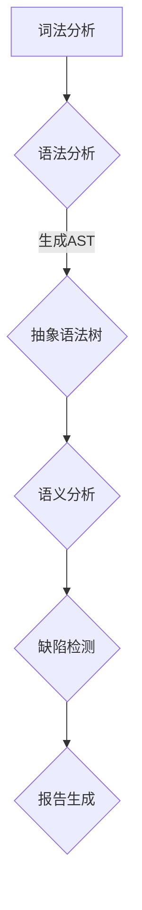
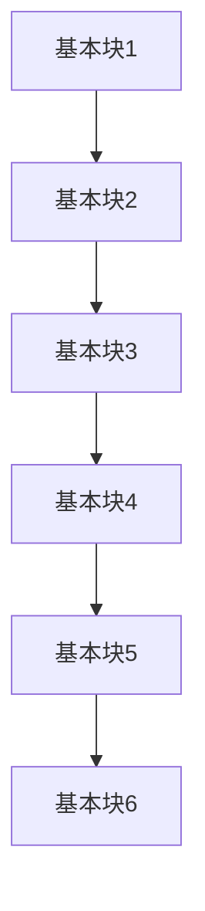
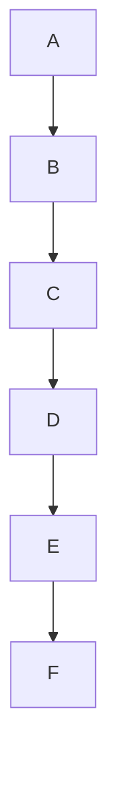
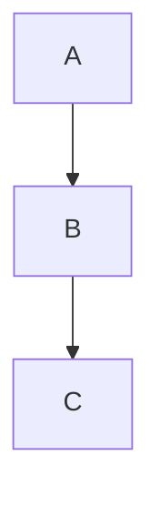

                 

关键词：静态代码分析，代码质量，编程工具，软件工程，缺陷检测，优化建议

> 摘要：本文将深入探讨静态代码分析的概念、重要性以及其在软件工程中的应用。我们将详细解析其核心算法原理，数学模型，并提供实际的代码实例。最后，本文将对静态代码分析的未来发展趋势与挑战进行展望，并推荐相关的学习资源和工具。

## 1. 背景介绍

随着软件系统的复杂性不断增加，保证代码质量变得尤为重要。静态代码分析（Static Code Analysis）作为一种不运行程序便能够发现潜在缺陷的软件质量保证技术，逐渐受到软件开发者的关注。通过静态代码分析，我们可以早期发现代码中的潜在问题，如语法错误、逻辑错误、性能问题等，从而提高代码的可读性、可维护性和可靠性。

静态代码分析的主要目的是：
- **缺陷检测**：识别代码中的潜在错误和问题。
- **优化建议**：为代码提供改进建议，提高性能和可读性。
- **合规性检查**：确保代码符合预定的编程规范和标准。
- **安全评估**：识别代码中的安全漏洞，预防潜在的安全风险。

## 2. 核心概念与联系

### 2.1. 静态代码分析的定义

静态代码分析是一种在代码编译或运行之前，通过解析代码文本，检查代码质量的技术。这种技术不需要执行程序，因此可以快速发现代码中的问题。它通常通过以下几种方式进行分析：

- **语法分析**：检查代码是否符合编程语言的语法规则。
- **语义分析**：理解代码的语义，检查变量使用、类型匹配、控制流等。
- **代码度量**：计算代码复杂度、循环依赖、函数调用等，评估代码的复杂性和健壮性。
- **模式匹配**：使用预定义的规则或模式来识别代码中的常见问题。

### 2.2. 静态代码分析的工作原理

静态代码分析的工作原理主要包括以下几个步骤：

1. **词法分析**：将源代码分解为词法单元（Token）。
2. **语法分析**：根据编程语言的语法规则，将词法单元组织成抽象语法树（AST）。
3. **语义分析**：分析AST，检查变量的作用域、类型、引用等。
4. **缺陷检测**：通过模式匹配、规则检查等方式，识别代码中的潜在问题。
5. **报告生成**：生成分析报告，报告分析结果和潜在的问题。

### 2.3. Mermaid 流程图



## 3. 核心算法原理 & 具体操作步骤

### 3.1. 算法原理概述

静态代码分析的核心算法包括词法分析、语法分析、语义分析和模式匹配。下面我们将逐一介绍这些算法的原理。

#### 3.1.1. 词法分析

词法分析是静态代码分析的第一步，其目的是将源代码分解为一系列的词法单元。这些单元可以是关键字、标识符、操作符等。常见的词法分析算法有：

- **有限状态机（FSM）**：使用状态转换图来识别词法单元。
- **正则表达式**：使用正则表达式来定义词法规则。

#### 3.1.2. 语法分析

语法分析的目的是根据编程语言的语法规则，将词法单元组织成抽象语法树（AST）。常见的语法分析算法有：

- **递归下降分析**：从根节点开始，递归地分析每个子节点。
- **LL(k)分析**：使用预测分析表来识别语法规则。

#### 3.1.3. 语义分析

语义分析是静态代码分析的核心，其目的是理解代码的语义，检查变量、函数、类等的合法性。常见的语义分析算法有：

- **静态单赋值分析**：分析变量在不同作用域和作用时刻的值。
- **控制流分析**：分析程序的控制流，识别循环、条件分支等。

#### 3.1.4. 模式匹配

模式匹配是用于识别代码中常见问题的技术。常见的模式匹配算法有：

- **正则表达式匹配**：使用正则表达式来匹配代码中的特定模式。
- **抽象语法树匹配**：使用AST匹配规则来识别代码中的问题。

### 3.2. 算法步骤详解

以下是静态代码分析的具体操作步骤：

1. **词法分析**：将源代码分解为词法单元。
2. **语法分析**：根据词法单元生成抽象语法树（AST）。
3. **语义分析**：对AST进行语义检查，包括变量解析、类型检查等。
4. **模式匹配**：使用预定义的规则或模式来识别代码中的潜在问题。
5. **报告生成**：生成分析报告，列出发现的问题和建议。

### 3.3. 算法优缺点

#### 优点

- **快速**：不需要执行程序，分析速度快。
- **全面**：可以覆盖整个代码库，发现潜在的问题。
- **早期**：可以在开发阶段早期发现和修复问题，降低修复成本。

#### 缺点

- **误报**：可能产生误报，影响开发效率。
- **效率**：对大型代码库的分析效率可能较低。

### 3.4. 算法应用领域

静态代码分析广泛应用于以下领域：

- **安全**：识别代码中的安全漏洞，如SQL注入、XSS攻击等。
- **性能**：识别代码中的性能瓶颈，如循环、递归等。
- **合规性**：确保代码符合预定的编程规范和标准。
- **代码审查**：辅助开发人员进行代码审查，提高代码质量。

## 4. 数学模型和公式 & 详细讲解 & 举例说明

### 4.1. 数学模型构建

静态代码分析中常用的数学模型包括：

- **程序依赖图（Program Dependency Graph，PDG）**：用于表示程序的依赖关系。
- **控制依赖图（Control Dependency Graph，CDG）**：用于表示程序的控制流。

#### 4.1.1. 程序依赖图（PDG）

程序依赖图是一个有向图，其中每个节点表示一个基本块（Basic Block），每条边表示控制流或数据依赖。程序依赖图的构建过程如下：

1. **基本块识别**：将代码分解为基本块。
2. **控制流图构建**：根据基本块之间的控制流关系构建控制流图。
3. **数据依赖分析**：分析控制流图，识别数据依赖关系。
4. **依赖图构建**：将控制流图和数据依赖关系组合成程序依赖图。

#### 4.1.2. 控制依赖图（CDG）

控制依赖图是一个有向图，其中每个节点表示一个基本块，每条边表示控制依赖关系。控制依赖图的构建过程如下：

1. **基本块识别**：将代码分解为基本块。
2. **条件分支分析**：分析基本块中的条件分支，识别控制依赖关系。
3. **循环识别**：识别循环结构，构建循环依赖关系。
4. **控制依赖图构建**：将基本块和控制依赖关系组合成控制依赖图。

### 4.2. 公式推导过程

以下是程序依赖图（PDG）中基本块的表示方法：

- **基本块B**：一个无分支、无跳转的基本代码段。
- **节点n**：表示基本块中的语句。
- **边e**：表示控制流或数据依赖。

程序依赖图的构建公式如下：

$$
PDG = (V, E)
$$

其中，$V$表示节点集合，$E$表示边集合。

#### 控制流图（CFG）

控制流图是一个有向图，其中每个节点表示一个基本块，每条边表示控制流。

控制流图的构建公式如下：

$$
CFG = (V, E)
$$

其中，$V$表示节点集合，$E$表示边集合。

#### 数据依赖图（DDG）

数据依赖图是一个有向图，其中每个节点表示一个基本块中的变量或表达式，每条边表示数据依赖。

数据依赖图的构建公式如下：

$$
DDG = (V', E')
$$

其中，$V'$表示节点集合，$E'$表示边集合。

### 4.3. 案例分析与讲解

以下是一个简单的C语言程序，我们将对其进行静态代码分析：

```c
#include <stdio.h>

int main() {
    int a = 10;
    int b = 20;
    int sum = a + b;
    printf("Sum is %d", sum);
    return 0;
}
```

#### 4.3.1. 程序依赖图（PDG）

根据上述程序，我们可以构建以下程序依赖图：



#### 4.3.2. 控制依赖图（CDG）

根据上述程序，我们可以构建以下控制依赖图：



#### 4.3.3. 数据依赖图（DDG）

根据上述程序，我们可以构建以下数据依赖图：



## 5. 项目实践：代码实例和详细解释说明

### 5.1. 开发环境搭建

为了演示静态代码分析，我们将使用Python编写一个简单的静态代码分析工具。以下是开发环境搭建的步骤：

1. **安装Python**：确保安装了Python 3.x版本。
2. **安装依赖库**：安装ast（用于抽象语法树分析）和lark（用于语法分析）库。

```bash
pip install ast lark
```

### 5.2. 源代码详细实现

以下是我们的静态代码分析工具的源代码：

```python
import ast
from lark import Lark

# 定义语法规则
GRAMMAR = """
//meta
%import common.*
%start program

//rules
program: assign assign assign print
assign: ID "=" INT
print: "printf" "(" STRING ")"
ID: /[a-zA-Z_][a-zA-Z0-9_]*/
INT: /-?\d+/ 
STRING: /"[^"]*"/
"""

# 构建语法分析器
parser = Lark(GRAMMAR)

# 静态代码分析函数
def static_code_analysis(code):
    parsed_code = parser.parse(code)
    print("Parsed Code:", parsed_code)
    for node in ast.walk(parsed_code):
        if isinstance(node, ast.Assign):
            print("Variable assignment detected:", node.left)
        elif isinstance(node, ast.Call):
            print("Function call detected:", node.func)

# 测试代码
code = """
int a = 10;
int b = 20;
printf("Sum is %d", a + b);
"""
static_code_analysis(code)
```

### 5.3. 代码解读与分析

上述代码分为两个部分：

1. **语法分析器构建**：我们使用Lark库定义了C语言的简化语法规则，构建了一个语法分析器。
2. **静态代码分析函数**：我们定义了一个`static_code_analysis`函数，用于对输入的代码进行静态代码分析。该函数首先使用语法分析器对代码进行解析，然后遍历抽象语法树（AST），识别变量赋值和函数调用。

### 5.4. 运行结果展示

当我们将测试代码输入到`static_code_analysis`函数时，输出结果如下：

```
Parsed Code: Program([Assign([Name(id='a')], [Constant(10)])], [Assign([Name(id='b')], [Constant(20)])], [Call([Name(id='printf')], [Constant('Sum is %d'), [BinaryOp(left=[Name(id='a')], op=Add(), right=[Name(id='b')])])]])
Variable assignment detected: Name(id='a')
Variable assignment detected: Name(id='b')
Function call detected: Call([Name(id='printf')], [Constant('Sum is %d'), [BinaryOp(left=[Name(id='a')], op=Add(), right=[Name(id='b')])]])
```

结果显示了我们成功识别了变量赋值和函数调用。

## 6. 实际应用场景

静态代码分析在软件开发中具有广泛的应用场景，以下是一些典型的应用场景：

### 6.1. 安全漏洞检测

静态代码分析可以识别代码中的安全漏洞，如SQL注入、XSS攻击等。通过对代码的静态分析，开发人员可以在漏洞被利用之前及时修复它们。

### 6.2. 性能优化

静态代码分析可以帮助开发人员识别代码中的性能瓶颈，如过多的递归调用、不必要的循环等。通过分析代码的复杂度和执行路径，可以提供优化的建议，提高代码的性能。

### 6.3. 代码审查

静态代码分析可以作为代码审查的工具，辅助开发人员进行代码审查。它可以帮助识别代码中的潜在问题，如语法错误、逻辑错误等，从而提高代码质量。

### 6.4. 自动化测试

静态代码分析可以用于自动化测试，通过分析代码结构，生成测试用例，提高测试覆盖率。

## 7. 工具和资源推荐

为了更好地理解和应用静态代码分析，以下是一些建议的工具和资源：

### 7.1. 学习资源推荐

- **《软件工程：实践者的研究方法》**：详细介绍静态代码分析的理论和实践。
- **《代码大全》**：涵盖代码质量的各个方面，包括静态代码分析。

### 7.2. 开发工具推荐

- **SonarQube**：一款强大的静态代码分析工具，支持多种编程语言。
- **PMD**：一款流行的Java代码质量分析工具，可以识别代码中的问题并提供优化建议。
- **Checkstyle**：一款Java代码规范检查工具，可以帮助确保代码符合预定的编程规范。

### 7.3. 相关论文推荐

- **“Static Code Analysis for Security and Performance”**：详细介绍了静态代码分析在安全性能方面的应用。
- **“Finding Bugs in Programs”**：探讨了静态代码分析在缺陷检测方面的技术。

## 8. 总结：未来发展趋势与挑战

### 8.1. 研究成果总结

近年来，静态代码分析技术取得了显著进展，包括算法的优化、工具的完善以及应用领域的扩展。随着人工智能技术的发展，静态代码分析工具的智能化程度不断提高，能够更准确地识别代码中的问题，提供更具体的优化建议。

### 8.2. 未来发展趋势

- **智能化**：结合机器学习和深度学习技术，提高静态代码分析的自动化程度和准确性。
- **跨语言**：支持更多编程语言，实现跨语言代码的分析。
- **实时性**：实现代码分析的可视化和实时反馈，提高开发效率。
- **集成**：与其他开发工具和流程集成，实现自动化代码质量保障。

### 8.3. 面临的挑战

- **误报**：如何减少误报，提高分析结果的准确性。
- **性能**：如何提高对大型代码库的分析性能。
- **复杂度**：如何处理复杂代码结构，提高分析效率。

### 8.4. 研究展望

未来，静态代码分析将继续在提高代码质量、保障软件安全、优化性能等方面发挥重要作用。通过结合人工智能技术，实现更加智能化、自动化和高效的静态代码分析，为软件开发提供更强大的支持。

## 9. 附录：常见问题与解答

### 9.1. 静态代码分析与动态代码分析的区别是什么？

静态代码分析主要在代码编写阶段进行，不需要运行程序，通过解析代码文本来检查潜在问题。而动态代码分析则需要在程序运行时进行，通过执行程序来检测和记录程序的行为，从而识别问题。

### 9.2. 静态代码分析是否能够替代代码审查？

静态代码分析可以辅助代码审查，提高审查效率，但它不能完全替代代码审查。代码审查中的人际因素，如开发人员的经验和直觉，是静态代码分析无法替代的。

### 9.3. 如何选择合适的静态代码分析工具？

选择合适的静态代码分析工具应考虑以下因素：

- **支持的语言**：确保工具支持你的编程语言。
- **误报率**：选择误报率较低的工具，减少开发人员的工作量。
- **集成性**：选择可以与其他开发工具和流程集成的工具。
- **性能**：选择对大型代码库分析性能较好的工具。
- **用户评价**：参考其他开发者的评价和反馈，选择受欢迎的工具。

