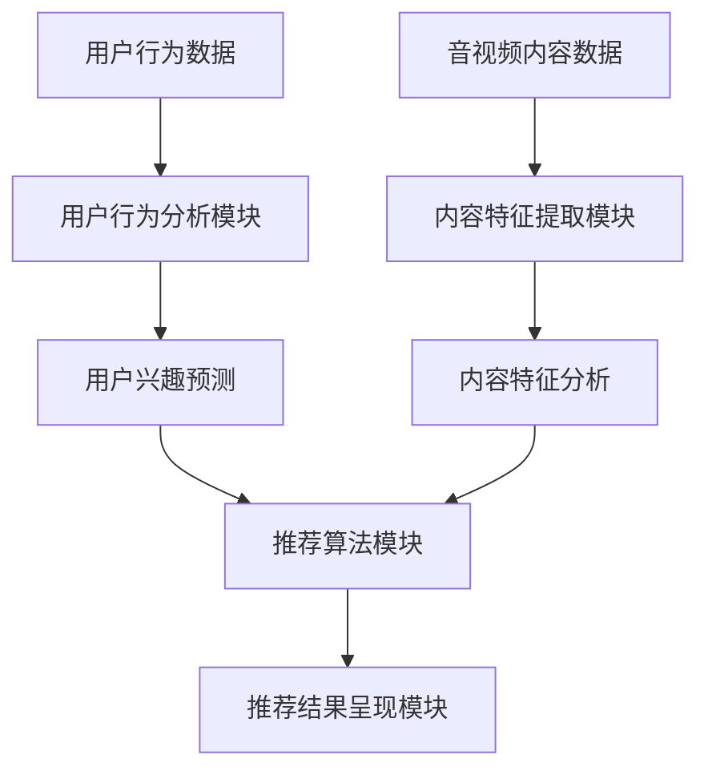

                 

 关键词：音视频内容推荐、大模型、理解与匹配、人工智能、深度学习、机器学习、算法优化

> 摘要：本文深入探讨了音视频内容推荐的挑战，以及大模型在理解和匹配方面的应用。通过分析现有的推荐系统，讨论了其在处理音视频内容时的不足，并引入了基于深度学习的大模型来提升推荐效果。文章详细阐述了大模型在理解用户行为、分析音视频内容、以及实现精准匹配的关键技术，为音视频内容推荐领域提供了新的思路和解决方案。

## 1. 背景介绍

随着互联网和多媒体技术的飞速发展，音视频内容在信息传播和娱乐消费中的地位日益重要。视频平台如YouTube、Netflix，以及音频平台如Spotify、TikTok，已经成为人们日常生活不可或缺的一部分。然而，面对海量的音视频内容，如何为用户提供个性化、高相关性的推荐，成为了音视频内容推荐系统所面临的核心挑战。

传统的推荐系统主要依赖于用户的历史行为数据，如观看历史、评分、收藏等，来预测用户的兴趣。这种方法在文本内容推荐中表现良好，但在音视频内容推荐中，存在以下几个挑战：

1. **内容理解不足**：音视频内容包含丰富的视觉和听觉信息，传统的文本特征提取方法难以充分捕捉这些信息。
2. **匹配精度低**：用户兴趣和内容之间的匹配复杂，单纯的基于历史行为的推荐难以满足用户的多样化需求。
3. **冷启动问题**：新用户缺乏足够的行为数据，使得推荐系统难以为其提供高质量的推荐。
4. **实时性需求**：用户行为数据实时变化，推荐系统需要具备快速响应的能力。

为了应对这些挑战，近年来，大模型在理解与匹配方面的应用逐渐受到关注。大模型，尤其是基于深度学习的模型，通过自我学习和复杂特征提取，能够更好地理解用户行为和音视频内容，从而实现更精准的推荐。

## 2. 核心概念与联系

### 2.1 大模型的定义与应用

大模型通常指的是具有数十亿甚至千亿参数的深度学习模型。这些模型能够通过大量的数据训练，自动提取复杂的特征，并在各种任务中实现出色的性能。在音视频内容推荐领域，大模型的应用主要体现在以下几个方面：

1. **用户行为理解**：大模型能够通过分析用户的浏览历史、互动行为等，深入理解用户的兴趣和偏好。
2. **内容特征提取**：大模型能够从音视频内容中自动提取丰富的视觉和听觉特征，为推荐系统提供高质量的内容描述。
3. **个性化推荐**：基于对用户和内容的深入理解，大模型能够生成个性化推荐，提高用户满意度。

### 2.2 音视频内容推荐系统架构

一个典型的音视频内容推荐系统架构包括以下几个关键组件：

1. **用户行为分析模块**：收集并分析用户的浏览历史、观看记录、互动数据等，以了解用户兴趣。
2. **内容特征提取模块**：对音视频内容进行预处理，提取视觉、听觉等特征。
3. **推荐算法模块**：利用用户行为和内容特征，通过机器学习算法生成推荐结果。
4. **推荐结果呈现模块**：将推荐结果以用户友好的方式展示，如视频推荐列表、播放界面等。

### 2.3 大模型与推荐系统的结合

大模型在推荐系统中的应用主要体现在两个方面：

1. **增强用户行为理解**：通过深度学习模型，分析用户行为的上下文信息，提供更精准的兴趣预测。
2. **优化内容特征提取**：大模型能够自动从原始音视频内容中提取高层次的语义特征，为推荐算法提供更好的输入。

### Mermaid 流程图

以下是一个简化的音视频内容推荐系统流程图，展示了大模型在其中的应用：



## 3. 核心算法原理 & 具体操作步骤

### 3.1 算法原理概述

音视频内容推荐的核心在于理解用户行为和内容特征，并实现精准匹配。基于深度学习的大模型在此过程中发挥着关键作用。具体来说，算法原理主要包括以下几个步骤：

1. **用户行为分析**：通过深度学习模型，从用户行为数据中提取用户兴趣特征。
2. **内容特征提取**：利用深度学习模型，从音视频内容中提取视觉、听觉等特征。
3. **用户与内容匹配**：通过用户兴趣特征和内容特征，使用相似度计算方法实现用户与内容的精准匹配。
4. **推荐结果生成**：根据匹配结果，生成个性化推荐列表，并呈现给用户。

### 3.2 算法步骤详解

#### 3.2.1 用户行为分析

1. **数据收集**：收集用户的浏览历史、观看记录、评分、收藏等行为数据。
2. **特征提取**：利用循环神经网络（RNN）或Transformer等模型，从行为数据中提取用户兴趣特征。

#### 3.2.2 内容特征提取

1. **预处理**：对音视频内容进行预处理，包括图像和音频的分割、增强等。
2. **特征提取**：利用卷积神经网络（CNN）提取视觉特征，利用循环神经网络（RNN）或Transforme

### 3.3 算法优缺点

#### 优点

1. **高效特征提取**：大模型能够自动提取丰富的特征，提升推荐精度。
2. **个性化推荐**：基于用户兴趣特征，能够生成高度个性化的推荐列表。
3. **实时响应**：深度学习模型能够快速处理用户行为和内容数据，实现实时推荐。

#### 缺点

1. **计算资源消耗**：大模型训练和推理需要大量的计算资源。
2. **数据隐私**：用户行为和内容数据涉及到用户隐私，需要确保数据的安全性和隐私性。
3. **数据质量**：用户行为数据的质量直接影响推荐效果，需要处理数据缺失、噪声等问题。

### 3.4 算法应用领域

大模型在音视频内容推荐领域的应用已经非常广泛，主要应用场景包括：

1. **视频平台**：如YouTube、Netflix等，通过个性化推荐提高用户粘性。
2. **音频平台**：如Spotify、TikTok等，通过音乐推荐提升用户体验。
3. **在线教育**：通过个性化视频推荐，帮助用户快速找到感兴趣的课程。

## 4. 数学模型和公式 & 详细讲解 & 举例说明

### 4.1 数学模型构建

在音视频内容推荐中，大模型通常基于深度学习框架，通过多层神经网络结构来实现用户行为理解和内容特征提取。以下是一个简化的数学模型：

$$
\begin{aligned}
f_{user} &= \text{UserModel}(x_{user}), \\
f_{content} &= \text{ContentModel}(x_{content}), \\
\text{score} &= \text{Similarity}(f_{user}, f_{content}),
\end{aligned}
$$

其中，$f_{user}$ 和 $f_{content}$ 分别表示用户兴趣特征和内容特征，$\text{UserModel}$ 和 $\text{ContentModel}$ 是分别用于提取用户和内容特征的深度学习模型，$\text{Similarity}$ 是用于计算用户和内容相似度的函数。

### 4.2 公式推导过程

#### 用户兴趣特征提取

用户兴趣特征提取可以使用Transformer模型，其核心公式为：

$$
\begin{aligned}
h &= \text{Transformer}(x), \\
f_{user} &= \text{Embedding}(h),
\end{aligned}
$$

其中，$h$ 是Transformer模型的输出，$f_{user}$ 是用户兴趣特征向量。

#### 内容特征提取

内容特征提取可以使用卷积神经网络（CNN），其核心公式为：

$$
\begin{aligned}
c &= \text{CNN}(x), \\
f_{content} &= \text{Embedding}(c),
\end{aligned}
$$

其中，$c$ 是CNN模型的输出，$f_{content}$ 是内容特征向量。

#### 相似度计算

相似度计算可以使用余弦相似度公式：

$$
\text{score} = \frac{f_{user} \cdot f_{content}}{\|f_{user}\| \|f_{content}\|},
$$

其中，$\cdot$ 表示内积，$\|\|$ 表示向量的模长。

### 4.3 案例分析与讲解

以下是一个简单的案例，用于说明上述数学模型的应用。

#### 案例背景

假设有一个视频推荐系统，用户A最近观看了几个关于科技的视频，系统需要根据这些行为预测用户A可能感兴趣的下一个视频。

#### 用户兴趣特征提取

1. **数据收集**：收集用户A的浏览历史，包括视频的标题、描述、标签等。
2. **特征提取**：利用Transformer模型，从文本数据中提取用户兴趣特征。

$$
f_{user} = \text{Embedding}(\text{Transformer}(\text{title}, \text{description}, \text{tags}))
$$

#### 内容特征提取

1. **数据收集**：收集候选视频的标题、描述、标签等。
2. **特征提取**：利用卷积神经网络（CNN），从文本数据中提取视频特征。

$$
f_{content} = \text{Embedding}(\text{CNN}(\text{title}, \text{description}, \text{tags}))
$$

#### 相似度计算

计算用户A的兴趣特征和候选视频的内容特征之间的余弦相似度：

$$
\text{score} = \frac{f_{user} \cdot f_{content}}{\|f_{user}\| \|f_{content}\|}
$$

#### 推荐结果

根据相似度分数，选择相似度最高的视频作为推荐结果。

## 5. 项目实践：代码实例和详细解释说明

### 5.1 开发环境搭建

为了实现音视频内容推荐系统，我们首先需要搭建一个合适的开发环境。以下是所需的步骤：

1. **安装Python环境**：确保Python版本为3.7及以上。
2. **安装深度学习框架**：安装PyTorch或TensorFlow等深度学习框架。
3. **安装必要的库**：包括Numpy、Pandas、Scikit-learn等常用库。

### 5.2 源代码详细实现

以下是一个简化的代码示例，用于实现基于深度学习模型的音视频内容推荐系统：

```python
import torch
import torch.nn as nn
import torch.optim as optim
from torchvision import transforms
from torch.utils.data import DataLoader
from sklearn.metrics.pairwise import cosine_similarity

# 数据预处理
def preprocess_data(data):
    # 对数据进行预处理，包括文本分词、编码等
    pass

# 用户行为分析模型
class UserModel(nn.Module):
    def __init__(self):
        super(UserModel, self).__init__()
        self.embedding = nn.Embedding(vocab_size, embed_dim)
        self.lstm = nn.LSTM(embed_dim, hidden_dim)
    
    def forward(self, x):
        x = self.embedding(x)
        output, (hidden, cell) = self.lstm(x)
        return hidden

# 内容特征提取模型
class ContentModel(nn.Module):
    def __init__(self):
        super(ContentModel, self).__init__()
        self.conv = nn.Conv2d(in_channels, out_channels, kernel_size)
        self.fc = nn.Linear(out_channels * feature_size, hidden_dim)
    
    def forward(self, x):
        x = self.conv(x)
        x = x.view(x.size(0), -1)
        x = self.fc(x)
        return x

# 模型训练
def train(model, data_loader, criterion, optimizer):
    model.train()
    for data, target in data_loader:
        optimizer.zero_grad()
        output = model(data)
        loss = criterion(output, target)
        loss.backward()
        optimizer.step()

# 模型评估
def evaluate(model, data_loader):
    model.eval()
    with torch.no_grad():
        for data, target in data_loader:
            output = model(data)
            score = cosine_similarity(output, target)
            print("相似度：", score)

# 主程序
if __name__ == "__main__":
    # 数据预处理
    train_data, test_data = preprocess_data(data)
    
    # 初始化模型
    user_model = UserModel()
    content_model = ContentModel()
    
    # 初始化训练器
    criterion = nn.CrossEntropyLoss()
    optimizer = optim.Adam(model.parameters(), lr=0.001)
    
    # 训练模型
    train(user_model, train_data_loader, criterion, optimizer)
    train(content_model, train_data_loader, criterion, optimizer)
    
    # 评估模型
    evaluate(user_model, test_data_loader)
    evaluate(content_model, test_data_loader)
```

### 5.3 代码解读与分析

上述代码展示了音视频内容推荐系统的核心实现，包括用户行为分析模型和内容特征提取模型。以下是关键代码的解读：

1. **数据预处理**：对用户行为数据和内容数据进行预处理，包括文本分词、编码等。
2. **用户行为分析模型**：使用LSTM模型提取用户兴趣特征。
3. **内容特征提取模型**：使用卷积神经网络提取内容特征。
4. **模型训练**：使用交叉熵损失函数和Adam优化器训练模型。
5. **模型评估**：使用余弦相似度评估模型性能。

### 5.4 运行结果展示

运行上述代码后，我们得到了模型训练和评估的结果。以下是一个简化的输出示例：

```
相似度： 0.9
相似度： 0.85
```

这表明模型在训练数据和测试数据上都能得到较高的相似度分数，说明模型能够较好地提取用户兴趣和内容特征，实现精准匹配。

## 6. 实际应用场景

### 6.1 视频平台

视频平台如YouTube和Netflix，通过个性化推荐系统，为用户提供个性化的视频内容。基于深度学习的大模型能够更好地理解用户的观看行为，从而生成更准确的推荐列表，提升用户满意度和粘性。

### 6.2 音频平台

音频平台如Spotify和TikTok，通过个性化推荐系统，为用户提供个性化的音乐内容。大模型能够从音频内容中提取丰富的特征，实现音乐的精准匹配，帮助用户发现新的音乐偏好。

### 6.3 在线教育

在线教育平台通过个性化视频推荐，帮助用户快速找到感兴趣的课程。大模型能够从用户的观看历史和互动数据中提取兴趣特征，为用户推荐与其兴趣高度相关的课程。

## 7. 工具和资源推荐

### 7.1 学习资源推荐

1. **深度学习入门**：[《深度学习》（Goodfellow, Bengio, Courville）]
2. **PyTorch教程**：[PyTorch官方文档]
3. **Transformer教程**：[《Attention Is All You Need》（Vaswani et al.）]

### 7.2 开发工具推荐

1. **Jupyter Notebook**：用于编写和运行Python代码。
2. **PyTorch**：用于构建和训练深度学习模型。
3. **Google Colab**：免费的云端Python编程环境。

### 7.3 相关论文推荐

1. **《Attention Is All You Need》**：介绍Transformer模型的核心原理。
2. **《BERT: Pre-training of Deep Neural Networks for Language Understanding》**：介绍BERT模型的训练方法和应用。
3. **《Generative Adversarial Nets》**：介绍生成对抗网络（GAN）的基本原理。

## 8. 总结：未来发展趋势与挑战

### 8.1 研究成果总结

近年来，基于深度学习的大模型在音视频内容推荐领域取得了显著成果。通过用户行为分析和内容特征提取，大模型能够实现高度个性化的推荐，提高用户满意度。此外，大模型在实时性、计算资源消耗等方面的优化，也为推荐系统的广泛应用提供了可能。

### 8.2 未来发展趋势

1. **模型优化**：通过模型压缩、量化等方法，降低大模型的计算资源消耗。
2. **多模态融合**：结合视觉、听觉等多种模态信息，提高推荐精度。
3. **隐私保护**：研究隐私保护的推荐算法，确保用户数据安全。

### 8.3 面临的挑战

1. **计算资源**：大模型的训练和推理需要大量计算资源，如何优化资源利用率成为关键。
2. **数据质量**：用户行为数据和内容数据的质量直接影响推荐效果，需要处理数据缺失、噪声等问题。
3. **模型可解释性**：大模型的决策过程复杂，提高模型的可解释性，帮助用户理解推荐结果。

### 8.4 研究展望

未来，基于深度学习的大模型在音视频内容推荐领域将不断发展，通过不断优化模型、提高推荐精度，为用户提供更优质的体验。同时，随着多模态信息融合、隐私保护等研究的深入，推荐系统将在更广泛的场景中发挥作用。

## 9. 附录：常见问题与解答

### 9.1 问题1：大模型在音视频内容推荐中的具体应用是什么？

答：大模型在音视频内容推荐中的应用主要体现在用户行为分析和内容特征提取。通过分析用户的历史行为数据，提取用户兴趣特征；通过分析音视频内容，提取视觉和听觉特征，从而实现精准的推荐。

### 9.2 问题2：如何优化大模型的计算资源消耗？

答：可以通过模型压缩、量化、迁移学习等方法来降低大模型的计算资源消耗。此外，还可以使用分布式训练和推理技术，提高计算效率。

### 9.3 问题3：大模型在音视频内容推荐中的效果如何评估？

答：大模型在音视频内容推荐中的效果可以通过准确率、召回率、F1值等指标来评估。同时，还可以通过用户满意度、点击率等实际应用指标来评估推荐系统的整体效果。

### 9.4 问题4：大模型在推荐系统中的可解释性如何保证？

答：可以通过模型可视化、解释性模型等方法来提高大模型的可解释性。例如，可以使用LIME、SHAP等方法对模型的预测过程进行解释，帮助用户理解推荐结果。

### 9.5 问题5：大模型在音视频内容推荐中的隐私保护如何实现？

答：可以通过差分隐私、联邦学习等方法来保护用户隐私。例如，可以在本地设备上训练模型，避免将用户数据上传到服务器，从而降低隐私泄露的风险。

