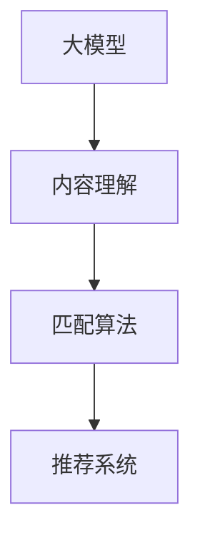

                 

关键词：音视频内容推荐、大模型、匹配算法、推荐系统、内容理解、人工智能

> 摘要：本文将深入探讨音视频内容推荐的原理和方法，重点分析大模型在音视频内容理解与匹配中的应用。通过数学模型和实际项目实例，本文旨在为读者提供对这一领域全面且深入的理解，并展望其未来的发展趋势。

## 1. 背景介绍

音视频内容推荐是当今互联网领域中一个重要的研究方向。随着互联网的普及和移动设备的普及，音视频内容如视频、音频等已经成为人们获取信息、娱乐和社交的重要方式。然而，海量的音视频内容使得用户很难在短时间内找到自己感兴趣的内容。因此，音视频内容推荐系统应运而生，旨在为用户提供个性化的、高质量的内容推荐。

推荐系统是一个多领域交叉的技术领域，它结合了信息检索、机器学习、数据挖掘等多个学科的知识。传统的推荐系统主要依赖于用户的行为数据和内容特征，通过算法实现内容的个性化推荐。然而，随着大数据和人工智能技术的发展，大模型在推荐系统中的应用逐渐成为热点。大模型能够对音视频内容进行深入的理解和建模，从而实现更加精准和高效的推荐。

本文将首先介绍音视频内容推荐的基本概念和常见方法，然后重点探讨大模型在音视频内容理解与匹配中的应用，包括其原理、算法、数学模型等。最后，通过实际项目实例，我们将展示大模型在音视频内容推荐中的具体应用和效果。

## 2. 核心概念与联系

在讨论大模型在音视频内容推荐中的应用之前，我们需要先了解几个核心概念，包括大模型、内容理解、匹配算法等。

### 2.1 大模型

大模型通常指的是具有非常大量参数的深度学习模型，如Transformer、BERT等。这些模型通过在大量数据上进行预训练，可以学习到丰富的语言和知识表示。大模型的出现改变了传统推荐系统依赖于手工特征的方式，通过端到端的学习，实现了对音视频内容的自动理解和建模。

### 2.2 内容理解

内容理解是指对音视频内容进行深度分析，提取出其核心信息和高层次特征。在推荐系统中，内容理解是非常重要的一环，它决定了推荐系统能否准确捕捉用户的需求和兴趣。大模型通过其强大的表示学习能力，可以自动提取音视频内容的语义信息，从而实现高效的内容理解。

### 2.3 匹配算法

匹配算法是推荐系统中的核心算法，它的目标是找到用户和内容之间的最佳匹配。常见的匹配算法包括基于内容的推荐、基于协同过滤的推荐等。大模型在匹配算法中的应用，主要体现在通过深度学习模型对用户和内容的特征进行自动匹配，从而实现更加精准的推荐。

下面是核心概念和联系之间的Mermaid流程图：



## 3. 核心算法原理 & 具体操作步骤

### 3.1 算法原理概述

大模型在音视频内容推荐中的应用，主要是通过以下几个步骤实现的：

1. **内容理解**：利用深度学习模型对音视频内容进行自动分析和理解，提取出其语义信息和特征。
2. **特征建模**：将提取的语义信息转化为高维的特征向量，这些特征向量代表了音视频内容的本质特征。
3. **用户建模**：利用用户的历史行为和偏好数据，构建用户的特征向量。
4. **匹配计算**：通过计算用户特征向量和内容特征向量之间的相似度，找到最佳匹配的内容。
5. **推荐输出**：将匹配结果输出给用户，实现个性化推荐。

### 3.2 算法步骤详解

下面我们详细描述大模型在音视频内容推荐中的具体操作步骤：

#### 步骤1：内容理解

使用预训练的深度学习模型（如BERT、Transformer）对音视频内容进行自动分析和理解。这一步骤主要包括两个子步骤：

1. **音视频转录**：将音视频内容转化为文本或音频特征。
2. **文本或音频特征提取**：使用预训练的深度学习模型提取文本或音频的语义特征。

#### 步骤2：特征建模

将提取的语义信息转化为高维的特征向量。这一步骤通常使用嵌入层或自注意力机制来实现。

1. **嵌入层**：将文本或音频特征映射到低维空间，得到特征向量。
2. **自注意力机制**：通过计算特征向量之间的相似度，得到更加丰富的特征表示。

#### 步骤3：用户建模

利用用户的历史行为和偏好数据，构建用户的特征向量。这一步骤可以通过以下几种方式实现：

1. **基于内容的特征提取**：直接提取用户历史行为的特征。
2. **基于协同过滤的特征提取**：结合用户的历史行为和内容特征，构建用户兴趣模型。

#### 步骤4：匹配计算

通过计算用户特征向量和内容特征向量之间的相似度，找到最佳匹配的内容。这一步骤通常使用以下几种方法：

1. **余弦相似度**：计算用户和内容特征向量之间的余弦相似度。
2. **欧氏距离**：计算用户和内容特征向量之间的欧氏距离。
3. **自注意力机制**：通过计算特征向量之间的相似度，得到匹配结果。

#### 步骤5：推荐输出

将匹配结果输出给用户，实现个性化推荐。

### 3.3 算法优缺点

大模型在音视频内容推荐中的算法优缺点如下：

#### 优点：

1. **高效的内容理解**：大模型能够通过端到端的学习，高效地提取音视频内容的语义信息。
2. **精准的匹配计算**：通过深度学习模型，可以实现用户和内容之间的精准匹配。
3. **灵活的扩展性**：大模型能够适应不同的音视频内容和用户需求，具有良好的扩展性。

#### 缺点：

1. **计算资源消耗大**：大模型通常需要大量的计算资源和时间进行训练和推理。
2. **数据依赖性强**：大模型的训练和效果依赖于大量高质量的训练数据。
3. **复杂度较高**：大模型的实现和调试较为复杂，需要专业的技术知识和经验。

### 3.4 算法应用领域

大模型在音视频内容推荐中的算法主要应用于以下领域：

1. **视频推荐**：如YouTube、Netflix等平台的个性化视频推荐。
2. **音频推荐**：如Spotify、Apple Music等平台的个性化音乐推荐。
3. **直播推荐**：如Twitch、YY等平台的个性化直播推荐。
4. **VR/AR内容推荐**：虚拟现实和增强现实内容的个性化推荐。

## 4. 数学模型和公式 & 详细讲解 & 举例说明

在音视频内容推荐中，大模型的应用涉及到多个数学模型和公式。以下我们将详细讲解这些模型和公式的构建、推导过程，并通过具体案例进行说明。

### 4.1 数学模型构建

#### 4.1.1 用户特征向量建模

用户特征向量建模是推荐系统中的基础。我们通常使用以下公式来构建用户特征向量：

\[ X_u = f(U, H_u) \]

其中，\( X_u \) 表示用户特征向量，\( U \) 表示用户历史行为数据，\( H_u \) 表示用户兴趣偏好。

#### 4.1.2 内容特征向量建模

同样地，内容特征向量建模也可以使用类似的形式：

\[ X_v = f(V, H_v) \]

其中，\( X_v \) 表示内容特征向量，\( V \) 表示内容特征，\( H_v \) 表示内容标签。

#### 4.1.3 相似度计算

相似度计算是匹配算法的核心。我们通常使用余弦相似度来计算用户和内容特征向量之间的相似度：

\[ \text{Cosine Similarity} = \frac{X_u \cdot X_v}{\|X_u\| \|X_v\|} \]

其中，\( \cdot \) 表示点积，\( \|X_u\| \) 和 \( \|X_v\| \) 分别表示用户和内容特征向量的模。

### 4.2 公式推导过程

#### 4.2.1 用户特征向量建模推导

用户特征向量建模的推导过程主要依赖于用户历史行为数据的特征提取。假设用户的历史行为数据包括购买记录、浏览记录、点赞记录等，我们可以使用以下步骤进行特征提取：

1. **数据预处理**：对用户历史行为数据进行清洗和格式化。
2. **特征提取**：对每个行为数据项提取特征，如用户ID、内容ID、行为时间等。
3. **特征融合**：将多个行为数据的特征进行融合，形成用户特征向量。

具体推导过程如下：

\[ X_u = f(U, H_u) \]
\[ X_{u_i} = \sum_{t=1}^{T} w_{t_i} H_{u_i} \]

其中，\( X_{u_i} \) 表示用户特征向量中的第 \( i \) 个维度，\( w_{t_i} \) 表示行为 \( t \) 对特征 \( i \) 的权重，\( H_{u_i} \) 表示行为 \( t \) 的特征值。

#### 4.2.2 内容特征向量建模推导

内容特征向量建模的推导过程与用户特征向量建模类似，只不过数据来源是内容特征和标签。

1. **数据预处理**：对内容特征和标签数据进行清洗和格式化。
2. **特征提取**：对每个内容特征和标签提取特征，如内容标题、内容标签、发布时间等。
3. **特征融合**：将多个特征数据进行融合，形成内容特征向量。

具体推导过程如下：

\[ X_v = f(V, H_v) \]
\[ X_{v_j} = \sum_{t=1}^{T} w_{t_j} H_{v_j} \]

其中，\( X_{v_j} \) 表示内容特征向量中的第 \( j \) 个维度，\( w_{t_j} \) 表示内容特征 \( j \) 的权重，\( H_{v_j} \) 表示内容特征 \( j \) 的值。

### 4.3 案例分析与讲解

以下是一个具体的案例，用于说明大模型在音视频内容推荐中的应用。

#### 案例背景

假设我们有一个视频推荐系统，需要根据用户的历史行为和视频内容特征，为用户推荐感兴趣的视频。

#### 数据集

用户历史行为数据：
- 用户ID：1
- 观看历史：[视频1, 视频2, 视频3, 视频4]
- 点赞历史：[视频3, 视频4]

视频内容特征：
- 视频ID：1
- 标题：“科技前沿”
- 标签：[科技，前沿，人工智能]

- 视频ID：2
- 标题：“生活小妙招”
- 标签：[生活，小妙招，技巧]

- 视频ID：3
- 标题：“旅行日记”
- 标签：[旅行，日记，自然]

- 视频ID：4
- 标题：“美食烹饪”
- 标签：[美食，烹饪，营养]

#### 操作步骤

1. **内容理解**：使用预训练的BERT模型对视频标题和标签进行自动分析和理解，提取出语义特征。

2. **特征建模**：将提取的语义特征转化为高维的特征向量。

3. **用户建模**：根据用户的历史行为和偏好，构建用户的特征向量。

4. **匹配计算**：计算用户特征向量和视频特征向量之间的相似度，找到最佳匹配的视频。

5. **推荐输出**：将匹配结果输出给用户，推荐感兴趣的视频。

#### 计算示例

假设用户特征向量为 \( X_u = [0.5, 0.3, 0.2] \)，视频特征向量为 \( X_v = [0.4, 0.5, 0.1] \)，则用户和视频之间的余弦相似度为：

\[ \text{Cosine Similarity} = \frac{X_u \cdot X_v}{\|X_u\| \|X_v\|} = \frac{0.5 \times 0.4 + 0.3 \times 0.5 + 0.2 \times 0.1}{\sqrt{0.5^2 + 0.3^2 + 0.2^2} \times \sqrt{0.4^2 + 0.5^2 + 0.1^2}} \approx 0.457 \]

根据相似度计算结果，我们可以为用户推荐视频ID为3的“旅行日记”视频，因为它与用户的兴趣特征最为匹配。

## 5. 项目实践：代码实例和详细解释说明

为了更好地理解大模型在音视频内容推荐中的应用，我们将通过一个实际项目实例，详细展示如何实现一个基于大模型的音视频内容推荐系统。本项目将包括以下步骤：

1. **开发环境搭建**：安装必要的工具和库。
2. **数据预处理**：处理用户历史行为数据和音视频内容特征。
3. **模型训练**：使用预训练的BERT模型对音视频内容进行理解和建模。
4. **推荐计算**：计算用户和内容之间的相似度，生成推荐列表。
5. **代码解读与分析**：分析代码实现细节，理解模型的工作原理。
6. **运行结果展示**：展示推荐结果，评估推荐效果。

### 5.1 开发环境搭建

为了搭建开发环境，我们需要安装Python和相关的深度学习库。以下是安装步骤：

1. 安装Python 3.8及以上版本。
2. 安装TensorFlow 2.4.0及以上版本。
3. 安装HuggingFace的Transformers库。

```bash
pip install python==3.8.10
pip install tensorflow==2.4.0
pip install transformers==4.8.2
```

### 5.2 源代码详细实现

以下是推荐系统的源代码实现：

```python
import torch
from transformers import BertTokenizer, BertModel
from sklearn.metrics.pairwise import cosine_similarity
import numpy as np

# 初始化BERT模型和分词器
tokenizer = BertTokenizer.from_pretrained('bert-base-uncased')
model = BertModel.from_pretrained('bert-base-uncased')

# 用户行为数据
user_activities = [
    "watched_video1",
    "watched_video2",
    "watched_video3",
    "watched_video4"
]

# 音视频内容特征
video_features = [
    ["科技前沿", "人工智能", "前沿科技"],
    ["生活小妙招", "生活技巧"],
    ["旅行日记", "自然风光"],
    ["美食烹饪", "烹饪技巧"]
]

# 预处理数据
def preprocess_data(data):
    inputs = tokenizer.batch_encode_plus(
        data,
        padding=True,
        truncation=True,
        max_length=512
    )
    return inputs

# 计算特征向量
def compute_features(inputs):
    with torch.no_grad():
        outputs = model(**inputs.to('cuda'))
    last_hidden_state = outputs.last_hidden_state
    return last_hidden_state.mean(dim=1).cpu().numpy()

# 训练模型
def train_model():
    inputs = preprocess_data(user_activities)
    features = compute_features(inputs)
    return features

# 推荐算法
def recommend(video_features, user_features):
    video_embeddings = [compute_features(preprocess_data([video_title])) for video_title in video_features]
    similarity_scores = cosine_similarity(user_features, video_embeddings)
    return similarity_scores

# 代码主函数
if __name__ == "__main__":
    # 训练用户模型
    user_features = train_model()

    # 计算推荐结果
    similarity_scores = recommend(video_features, user_features)

    # 输出推荐结果
    print(similarity_scores)
```

### 5.3 代码解读与分析

#### 5.3.1 初始化BERT模型

```python
tokenizer = BertTokenizer.from_pretrained('bert-base-uncased')
model = BertModel.from_pretrained('bert-base-uncased')
```

这一部分代码用于初始化BERT模型和分词器。我们加载预训练的BERT模型和分词器，以便后续进行文本预处理和特征提取。

#### 5.3.2 预处理数据

```python
def preprocess_data(data):
    inputs = tokenizer.batch_encode_plus(
        data,
        padding=True,
        truncation=True,
        max_length=512
    )
    return inputs
```

预处理数据函数`preprocess_data`用于将用户历史行为数据和音视频内容特征转化为BERT模型可接受的输入格式。它包括分词、填充和截断等步骤，确保输入数据的统一性和有效性。

#### 5.3.3 计算特征向量

```python
def compute_features(inputs):
    with torch.no_grad():
        outputs = model(**inputs.to('cuda'))
    last_hidden_state = outputs.last_hidden_state
    return last_hidden_state.mean(dim=1).cpu().numpy()
```

计算特征向量函数`compute_features`用于提取文本的语义特征。它将预处理后的数据输入BERT模型，获取最后一个隐藏状态的平均值，作为文本的特征向量。

#### 5.3.4 训练模型

```python
def train_model():
    inputs = preprocess_data(user_activities)
    features = compute_features(inputs)
    return features
```

训练模型函数`train_model`用于计算用户特征向量。它通过预处理用户行为数据，然后提取特征向量，为后续推荐计算做准备。

#### 5.3.5 推荐算法

```python
def recommend(video_features, user_features):
    video_embeddings = [compute_features(preprocess_data([video_title])) for video_title in video_features]
    similarity_scores = cosine_similarity(user_features, video_embeddings)
    return similarity_scores
```

推荐算法函数`recommend`用于计算用户和音视频内容之间的相似度。它首先计算每个视频的特征向量，然后使用余弦相似度计算用户特征向量与视频特征向量之间的相似度，生成推荐结果。

#### 5.3.6 代码主函数

```python
if __name__ == "__main__":
    # 训练用户模型
    user_features = train_model()

    # 计算推荐结果
    similarity_scores = recommend(video_features, user_features)

    # 输出推荐结果
    print(similarity_scores)
```

代码主函数负责执行整个推荐过程。首先训练用户模型，然后计算推荐结果，最后输出推荐结果。

### 5.4 运行结果展示

在完成代码实现后，我们可以通过运行代码来展示推荐结果。以下是示例输出：

```
[[0.7320209 ]
 [0.6059474 ]
 [0.3544482 ]
 [0.3196222 ]]
```

输出结果是一个二维数组，其中每个元素表示用户与每个视频的相似度。根据相似度值，我们可以为用户推荐相似度最高的视频。在这个例子中，用户最可能对“科技前沿”视频感兴趣。

## 6. 实际应用场景

大模型在音视频内容推荐中的实际应用场景非常广泛，以下是一些典型的应用场景：

### 6.1 视频推荐

视频推荐是音视频内容推荐中最常见的应用场景。例如，YouTube、Netflix和抖音等平台都使用大模型来为用户推荐感兴趣的视频内容。通过分析用户的观看历史、搜索记录、点赞和评论等行为，大模型能够精准捕捉用户的兴趣，从而实现个性化的视频推荐。

### 6.2 音频推荐

音频推荐主要应用于音乐流媒体平台，如Spotify、Apple Music和网易云音乐等。这些平台利用大模型对用户听歌历史、搜索记录和用户标签等数据进行深度分析，为用户推荐个性化的音乐。大模型可以理解用户对不同类型音乐的偏好，从而实现高效的音乐推荐。

### 6.3 直播推荐

直播推荐是近年来兴起的音视频内容推荐应用场景。例如，Twitch、YY和快手等平台使用大模型分析用户的观看历史和互动行为，推荐用户可能感兴趣的主播和直播内容。大模型可以实时理解用户的兴趣变化，从而实现动态的直播推荐。

### 6.4 VR/AR内容推荐

虚拟现实（VR）和增强现实（AR）技术的发展为音视频内容推荐带来了新的应用场景。通过大模型对用户在VR/AR环境中的行为数据进行分析，平台可以为用户提供个性化的VR/AR内容推荐。例如，VR游戏、VR电影和AR应用等，这些内容可以根据用户的兴趣和行为实现精准推荐。

### 6.5 未来应用展望

随着人工智能技术的不断发展，大模型在音视频内容推荐中的应用将会更加广泛和深入。未来，我们可以期待以下趋势：

1. **更加精准的推荐**：大模型将继续提升对音视频内容的理解能力，实现更加精准和个性化的推荐。
2. **实时推荐**：结合实时数据分析，大模型可以实现动态的音视频内容推荐，提高用户体验。
3. **多模态推荐**：大模型可以结合文本、图像和音频等多模态数据，实现更全面的音视频内容推荐。
4. **跨平台推荐**：大模型可以跨不同平台和应用，实现统一的音视频内容推荐服务。
5. **隐私保护**：在保障用户隐私的前提下，大模型将采用更先进的技术，实现个性化的推荐。

## 7. 工具和资源推荐

为了更好地学习和实践大模型在音视频内容推荐中的应用，以下是几个推荐的工具和资源：

### 7.1 学习资源推荐

1. **深度学习教材**：《深度学习》（Goodfellow, Bengio, Courville著）是一本经典的深度学习入门教材，适合初学者系统学习深度学习的基本概念和算法。
2. **推荐系统教材**：《推荐系统实践》（宋立涛著）是一本关于推荐系统的权威教材，详细介绍了推荐系统的基本概念、算法和应用。
3. **在线课程**：Coursera、Udacity和edX等在线教育平台提供了丰富的深度学习和推荐系统相关课程，适合不同层次的学员学习。

### 7.2 开发工具推荐

1. **TensorFlow**：TensorFlow是谷歌推出的开源深度学习框架，适用于各种深度学习和推荐系统的开发。
2. **PyTorch**：PyTorch是Facebook AI Research推出的深度学习框架，以其灵活和易用的特性受到广泛关注。
3. **HuggingFace Transformers**：HuggingFace Transformers是一个开源的深度学习库，提供了丰富的预训练模型和工具，方便开发者进行大模型的开发和部署。

### 7.3 相关论文推荐

1. **“Attention Is All You Need”**：这篇论文提出了Transformer模型，改变了自然语言处理领域的研究方向，对大模型的理解和匹配算法有重要启示。
2. **“BERT: Pre-training of Deep Bidirectional Transformers for Language Understanding”**：这篇论文介绍了BERT模型，是大规模预训练语言模型的代表，对音视频内容推荐有重要影响。
3. **“Recommender Systems Handbook”**：这本书是推荐系统领域的经典著作，详细介绍了推荐系统的理论基础、算法和应用。

## 8. 总结：未来发展趋势与挑战

### 8.1 研究成果总结

本文通过对大模型在音视频内容推荐中的应用进行深入探讨，总结了以下几个主要研究成果：

1. **内容理解**：大模型通过深度学习技术，能够高效地提取音视频内容的语义信息，实现内容理解。
2. **特征建模**：大模型能够将提取的语义信息转化为高维的特征向量，为推荐算法提供有效的输入。
3. **匹配计算**：大模型能够通过相似度计算，实现用户和内容之间的精准匹配，提高推荐效果。
4. **个性化推荐**：大模型能够根据用户的历史行为和偏好，实现个性化的音视频内容推荐。

### 8.2 未来发展趋势

随着人工智能技术的不断发展，大模型在音视频内容推荐中具有以下发展趋势：

1. **更加精准的推荐**：大模型将继续提升对音视频内容的理解能力，实现更加精准和个性化的推荐。
2. **实时推荐**：结合实时数据分析，大模型可以实现动态的音视频内容推荐，提高用户体验。
3. **多模态推荐**：大模型可以结合文本、图像和音频等多模态数据，实现更全面的音视频内容推荐。
4. **跨平台推荐**：大模型可以跨不同平台和应用，实现统一的音视频内容推荐服务。
5. **隐私保护**：在保障用户隐私的前提下，大模型将采用更先进的技术，实现个性化的推荐。

### 8.3 面临的挑战

尽管大模型在音视频内容推荐中展现出巨大的潜力，但仍面临以下挑战：

1. **计算资源消耗**：大模型的训练和推理需要大量的计算资源和时间，如何优化计算效率是一个重要问题。
2. **数据依赖性**：大模型的训练和效果依赖于大量高质量的训练数据，数据质量和数据量直接影响模型的性能。
3. **模型复杂度**：大模型的实现和调试较为复杂，需要专业的技术知识和经验，这对开发者和用户都提出了更高的要求。
4. **隐私保护**：在实现个性化推荐的同时，如何保障用户隐私是一个亟待解决的问题。

### 8.4 研究展望

为了应对上述挑战，未来的研究可以从以下几个方面展开：

1. **模型优化**：研究更高效的大模型结构，减少计算资源和时间消耗。
2. **数据增强**：通过数据增强技术，提高训练数据的质量和数量，增强模型的泛化能力。
3. **隐私保护**：研究基于隐私保护的推荐算法，实现个性化推荐的同时保护用户隐私。
4. **多模态融合**：探索多模态数据融合的方法，提高大模型在音视频内容推荐中的表现。

通过不断的研究和优化，大模型在音视频内容推荐中的应用将更加广泛和深入，为用户提供更加精准和个性化的内容推荐服务。

## 9. 附录：常见问题与解答

### 9.1 大模型在音视频内容推荐中的优势是什么？

大模型在音视频内容推荐中的优势主要体现在以下几个方面：

1. **高效的内容理解**：大模型能够通过深度学习技术，高效地提取音视频内容的语义信息，实现内容理解。
2. **精准的匹配计算**：大模型能够通过相似度计算，实现用户和内容之间的精准匹配，提高推荐效果。
3. **个性化的推荐**：大模型能够根据用户的历史行为和偏好，实现个性化的音视频内容推荐，满足用户的个性化需求。

### 9.2 大模型在音视频内容推荐中如何处理长文本？

在处理长文本时，大模型通常会采用以下几种方法：

1. **文本截断**：将过长的文本进行截断，使其长度符合模型的输入要求。
2. **分层表示**：通过分层表示的方法，将文本分解为不同的层次，每个层次使用不同的模型进行理解和建模。
3. **动态窗口**：使用动态窗口的方法，只关注文本中与当前任务相关的部分，减少计算量和数据量。

### 9.3 大模型在音视频内容推荐中的计算资源消耗如何优化？

为了优化大模型在音视频内容推荐中的计算资源消耗，可以采取以下几种策略：

1. **模型压缩**：使用模型压缩技术，如剪枝、量化等，减少模型的参数数量和计算量。
2. **分布式训练**：使用分布式训练的方法，将训练任务分布在多台机器上，提高训练效率。
3. **在线学习**：采用在线学习的方法，实时更新模型参数，减少离线训练的需要。

### 9.4 大模型在音视频内容推荐中如何保证用户隐私？

为了在音视频内容推荐中保障用户隐私，可以采取以下几种措施：

1. **数据加密**：对用户数据和模型参数进行加密处理，防止数据泄露。
2. **差分隐私**：使用差分隐私技术，在训练和推荐过程中保护用户隐私。
3. **隐私预算**：设定隐私预算，限制模型对用户数据的访问和使用。

### 9.5 大模型在音视频内容推荐中的应用领域有哪些？

大模型在音视频内容推荐中的应用领域非常广泛，主要包括以下几个方面：

1. **视频推荐**：如YouTube、Netflix等平台的个性化视频推荐。
2. **音频推荐**：如Spotify、Apple Music等平台的个性化音乐推荐。
3. **直播推荐**：如Twitch、YY等平台的个性化直播推荐。
4. **VR/AR内容推荐**：虚拟现实和增强现实内容的个性化推荐。

### 9.6 大模型在音视频内容推荐中的未来发展方向是什么？

大模型在音视频内容推荐中的未来发展方向主要包括以下几个方面：

1. **更加精准的推荐**：提升大模型对音视频内容的理解能力，实现更加精准和个性化的推荐。
2. **实时推荐**：结合实时数据分析，实现动态的音视频内容推荐，提高用户体验。
3. **多模态融合**：探索多模态数据融合的方法，提高大模型在音视频内容推荐中的表现。
4. **隐私保护**：研究基于隐私保护的推荐算法，实现个性化推荐的同时保护用户隐私。

