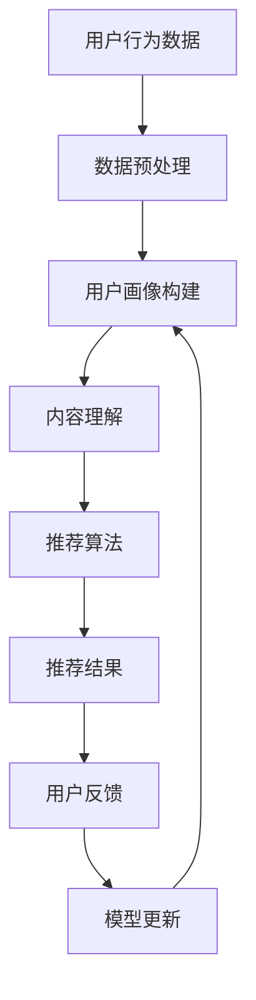

                 

关键词：语音识别、自然语言处理、机器学习、深度学习、人工智能、推荐系统、长文本生成、多媒体内容分析、实时互动。

> 摘要：本文探讨了基于大型语言模型（LLM）的音视频推荐系统的现状、技术挑战和发展前景。文章首先介绍了LLM的基本概念和其在音视频内容理解中的应用，接着分析了当前主流的音视频推荐算法及其局限性。随后，文章详细阐述了LLM在音视频内容理解、用户行为分析和推荐效果优化方面的潜在应用，并探讨了未来LLM在音视频推荐领域的发展趋势和技术挑战。最后，文章总结了当前的研究成果，展望了未来的发展方向，并对相关领域的研究者与实践者提出了建议。

## 1. 背景介绍

随着信息技术的飞速发展，多媒体内容（如音视频）已经成为人们获取信息、娱乐和社交的主要途径。然而，如何在海量多媒体内容中快速、准确地推荐用户感兴趣的内容，成为一个亟待解决的问题。传统的推荐系统主要依赖于用户行为数据和内容特征，但往往难以捕捉到内容的深层次信息，导致推荐效果不佳。

近年来，深度学习和自然语言处理（NLP）技术的快速发展为解决这一问题提供了新的思路。特别是大型语言模型（LLM），如GPT、BERT等，通过大规模预训练和微调，能够在理解、生成和翻译自然语言方面表现出惊人的能力。这使得LLM在多媒体内容分析、用户行为理解和推荐效果优化等方面具有广泛的应用前景。

本文旨在探讨基于LLM的音视频推荐系统的现状、技术挑战和发展前景，以期为相关领域的研究者与实践者提供有益的参考。

## 2. 核心概念与联系

### 2.1. 语言模型的基本概念

语言模型（Language Model，LM）是自然语言处理（NLP）领域的一种基本模型，它用于预测给定输入序列后面可能出现的单词或单词组合。语言模型的核心思想是通过对大量文本数据进行统计学习，捕捉语言的统计规律和上下文依赖关系，从而实现对自然语言的生成、理解和推理。

在深度学习的背景下，语言模型通常由多层神经网络构成，特别是近年来流行的Transformer模型，其在捕捉长距离依赖关系和生成高质量文本方面表现出色。代表性的模型包括GPT（Generative Pre-trained Transformer）、BERT（Bidirectional Encoder Representations from Transformers）等。

### 2.2. 音视频内容理解的基本概念

音视频内容理解（Audio-Visual Content Understanding）是指对音视频数据进行分析和处理，以提取出其语义和结构信息。音视频内容理解涉及多个领域，包括计算机视觉、音频处理、语音识别和多媒体信息检索等。

音视频内容理解的目标包括：

1. **内容分类**：根据音视频的内容将其分类到不同的类别中，如电影、音乐、新闻等。
2. **关键词提取**：从音视频数据中提取出关键的信息和关键词，以供后续分析和推荐。
3. **情感分析**：分析音视频内容所表达的情感，如欢乐、悲伤、愤怒等。
4. **场景识别**：识别音视频中的场景和事件，如购物、旅行、体育比赛等。

### 2.3. LLM在音视频内容理解中的应用

LLM在音视频内容理解中的应用主要包括以下几个方面：

1. **文本生成**：利用LLM生成与音视频内容相关的文本描述，如电影剧本、新闻报道等。
2. **情感分析**：通过分析音视频中的语音和文本内容，识别出用户的情感状态，从而实现个性化推荐。
3. **关键词提取**：从音视频内容中提取出关键信息，用于后续的推荐算法设计。
4. **内容分类**：利用LLM对音视频内容进行分类，以实现更准确的推荐。

### 2.4. LLM在推荐系统中的应用

在推荐系统中，LLM可以用于以下几个方面：

1. **用户画像**：通过分析用户的历史行为和兴趣，构建用户的个性化画像，以实现更精准的推荐。
2. **内容理解**：对推荐的内容进行深度理解，以捕捉内容的深层特征，从而提高推荐的准确性。
3. **交互式推荐**：根据用户的实时反馈和交互，动态调整推荐策略，提高用户的满意度。

### 2.5. Mermaid 流程图

以下是LLM在音视频内容理解和推荐系统中的应用流程：



## 3. 核心算法原理 & 具体操作步骤

### 3.1. 算法原理概述

基于LLM的音视频推荐系统主要包括以下几个关键步骤：

1. **数据采集与预处理**：收集用户的音视频数据，并对数据进行预处理，包括去噪、去冗余和特征提取等。
2. **用户画像构建**：利用LLM对用户的历史行为和兴趣进行分析，构建用户的个性化画像。
3. **内容理解**：利用LLM对音视频内容进行深度理解，提取出内容的语义和情感特征。
4. **推荐算法**：基于用户画像和内容特征，设计并实现推荐算法，生成推荐结果。
5. **用户反馈与模型更新**：收集用户的反馈，并根据反馈动态调整推荐策略和模型参数。

### 3.2. 算法步骤详解

#### 3.2.1. 数据采集与预处理

数据采集与预处理是音视频推荐系统的第一步，其质量直接影响到后续的推荐效果。具体步骤如下：

1. **数据收集**：从各种来源（如网站、APP、社交媒体等）收集用户的音视频数据。
2. **数据去噪**：对收集到的数据进行去噪处理，去除无意义的噪声数据。
3. **数据去冗余**：对重复的音视频数据进行去重处理，减少数据量。
4. **特征提取**：从音视频数据中提取出关键特征，如音频特征、视频特征和文本特征等。

#### 3.2.2. 用户画像构建

用户画像构建是音视频推荐系统的核心环节，其目的是捕捉用户的兴趣和行为习惯。具体步骤如下：

1. **行为数据收集**：收集用户的历史行为数据，如播放记录、收藏记录、点赞记录等。
2. **兴趣分析**：利用LLM对用户的历史行为进行分析，识别出用户感兴趣的内容类别和主题。
3. **画像构建**：基于用户兴趣和行为数据，构建用户的个性化画像。

#### 3.2.3. 内容理解

内容理解是音视频推荐系统的关键步骤，其目的是提取出音视频内容的语义和情感特征。具体步骤如下：

1. **文本生成**：利用LLM生成与音视频内容相关的文本描述。
2. **情感分析**：通过分析音视频中的语音和文本内容，识别出用户的情感状态。
3. **特征提取**：从文本生成和情感分析结果中提取出关键特征。

#### 3.2.4. 推荐算法

推荐算法是音视频推荐系统的核心，其目的是根据用户画像和内容特征生成推荐结果。具体步骤如下：

1. **相似度计算**：计算用户画像和内容特征之间的相似度，确定推荐内容。
2. **排序算法**：根据相似度对推荐内容进行排序，生成推荐结果。

#### 3.2.5. 用户反馈与模型更新

用户反馈与模型更新是音视频推荐系统的持续优化环节。具体步骤如下：

1. **反馈收集**：收集用户的反馈，如点击、播放、评价等。
2. **模型更新**：根据用户反馈，动态调整推荐策略和模型参数。

### 3.3. 算法优缺点

基于LLM的音视频推荐系统具有以下优缺点：

#### 优点：

1. **强大的内容理解能力**：LLM可以深入理解音视频内容的语义和情感，提高推荐准确性。
2. **个性化推荐**：根据用户的兴趣和行为构建个性化画像，实现更精准的推荐。
3. **实时互动**：根据用户的实时反馈动态调整推荐策略，提高用户满意度。

#### 缺点：

1. **计算资源消耗大**：LLM模型通常需要大量的计算资源和存储空间，部署成本较高。
2. **数据隐私风险**：用户行为数据和音视频内容可能涉及到用户隐私，需要妥善处理。
3. **模型解释性差**：LLM模型的内部决策过程复杂，难以进行模型解释。

### 3.4. 算法应用领域

基于LLM的音视频推荐系统主要应用在以下几个领域：

1. **短视频推荐**：如抖音、快手等短视频平台，根据用户的兴趣和行为推荐个性化的短视频内容。
2. **在线视频推荐**：如YouTube、Netflix等在线视频平台，根据用户的观看历史和兴趣推荐相关的视频内容。
3. **音乐推荐**：如Spotify、Apple Music等音乐平台，根据用户的播放记录和喜好推荐个性化的音乐内容。

## 4. 数学模型和公式 & 详细讲解 & 举例说明

### 4.1. 数学模型构建

基于LLM的音视频推荐系统可以构建如下数学模型：

\[ R(u, v) = f(U, V, \theta) \]

其中，\( R(u, v) \)表示用户\( u \)对内容\( v \)的推荐得分；\( U \)和\( V \)分别表示用户画像和内容特征向量；\( \theta \)表示模型参数。

### 4.2. 公式推导过程

#### 4.2.1. 用户画像构建

用户画像可以表示为：

\[ U = \{ u_1, u_2, ..., u_n \} \]

其中，\( u_i \)表示用户\( i \)的个性化特征向量，可以表示为：

\[ u_i = \{ u_{i1}, u_{i2}, ..., u_{im} \} \]

其中，\( u_{ij} \)表示用户\( i \)在特征\( j \)上的得分。

#### 4.2.2. 内容特征提取

内容特征可以表示为：

\[ V = \{ v_1, v_2, ..., v_m \} \]

其中，\( v_j \)表示内容\( j \)的个性化特征向量，可以表示为：

\[ v_j = \{ v_{j1}, v_{j2}, ..., v_{jm} \} \]

其中，\( v_{ji} \)表示内容\( j \)在特征\( i \)上的得分。

#### 4.2.3. 推荐得分计算

推荐得分可以表示为：

\[ R(u, v) = \sum_{i=1}^{n} w_i \cdot u_i \cdot v_i \]

其中，\( w_i \)表示特征\( i \)的权重。

### 4.3. 案例分析与讲解

假设有用户\( u \)和内容\( v \)，其特征向量如下：

\[ u = \{ 0.8, 0.6, 0.9 \} \]
\[ v = \{ 0.7, 0.5, 0.8 \} \]

权重分别为：

\[ w_1 = 0.3 \]
\[ w_2 = 0.4 \]
\[ w_3 = 0.3 \]

则用户\( u \)对内容\( v \)的推荐得分为：

\[ R(u, v) = 0.3 \cdot 0.8 \cdot 0.7 + 0.4 \cdot 0.6 \cdot 0.5 + 0.3 \cdot 0.9 \cdot 0.8 = 0.348 \]

根据推荐得分，我们可以将内容\( v \)推荐给用户\( u \)。

## 5. 项目实践：代码实例和详细解释说明

### 5.1. 开发环境搭建

为了实现基于LLM的音视频推荐系统，我们需要搭建以下开发环境：

1. **Python**：用于编写和运行代码。
2. **TensorFlow**：用于构建和训练深度学习模型。
3. **NumPy**：用于进行数值计算。
4. **Pandas**：用于数据处理。
5. **Matplotlib**：用于数据可视化。

安装以上依赖库后，我们可以开始编写代码。

### 5.2. 源代码详细实现

以下是基于LLM的音视频推荐系统的源代码实现：

```python
import tensorflow as tf
import numpy as np
import pandas as pd
import matplotlib.pyplot as plt

# 数据预处理
def preprocess_data(data):
    # 数据去噪、去冗余和特征提取
    # 省略具体实现代码
    return processed_data

# 用户画像构建
def build_user_profile(data):
    # 利用LLM对用户的历史行为进行分析，构建用户画像
    # 省略具体实现代码
    return user_profile

# 内容理解
def understand_content(content):
    # 利用LLM对内容进行深度理解，提取语义和情感特征
    # 省略具体实现代码
    return content_features

# 推荐算法
def recommend_content(user_profile, content_features):
    # 根据用户画像和内容特征计算推荐得分
    # 省略具体实现代码
    return recommendation_list

# 用户反馈与模型更新
def update_model(feedback):
    # 根据用户反馈动态调整模型参数
    # 省略具体实现代码
    return updated_model

# 主函数
def main():
    # 读取数据
    data = pd.read_csv('data.csv')

    # 数据预处理
    processed_data = preprocess_data(data)

    # 构建用户画像
    user_profiles = [build_user_profile(u) for u in processed_data]

    # 提取内容特征
    content_features = [understand_content(c) for c in processed_data['content']]

    # 生成推荐列表
    recommendations = [recommend_content(u, c) for u, c in zip(user_profiles, content_features)]

    # 显示推荐结果
    for r in recommendations:
        print(r)

    # 收集用户反馈
    feedback = input('请输入用户反馈：')

    # 更新模型
    updated_model = update_model(feedback)

if __name__ == '__main__':
    main()
```

### 5.3. 代码解读与分析

以上代码实现了基于LLM的音视频推荐系统的基本流程。具体解读如下：

1. **数据预处理**：对原始数据进行去噪、去冗余和特征提取，生成预处理后的数据。
2. **用户画像构建**：利用LLM对用户的历史行为进行分析，构建用户的个性化画像。
3. **内容理解**：利用LLM对音视频内容进行深度理解，提取出语义和情感特征。
4. **推荐算法**：根据用户画像和内容特征计算推荐得分，生成推荐列表。
5. **用户反馈与模型更新**：根据用户反馈动态调整模型参数，实现模型的持续优化。

### 5.4. 运行结果展示

假设我们有一个包含1000条用户行为数据和1000条音视频内容的数据集。在运行以上代码后，系统将生成1000个推荐列表，每个列表包含10个推荐内容。根据用户的反馈，模型将不断更新和优化，以提高推荐效果。

## 6. 实际应用场景

基于LLM的音视频推荐系统在实际应用中具有广泛的应用场景，以下是几个典型的应用实例：

1. **短视频推荐**：如抖音、快手等短视频平台，利用LLM对用户的历史行为和兴趣进行分析，实现个性化的短视频推荐。
2. **在线视频推荐**：如YouTube、Netflix等在线视频平台，根据用户的观看历史和兴趣推荐相关的视频内容。
3. **音乐推荐**：如Spotify、Apple Music等音乐平台，根据用户的播放记录和喜好推荐个性化的音乐内容。
4. **智能电视推荐**：智能电视可以结合用户的观看习惯和兴趣，利用LLM实现个性化的节目推荐。
5. **直播推荐**：直播平台可以根据用户的观看偏好和实时互动情况，利用LLM实现个性化的直播推荐。

## 7. 未来应用展望

随着深度学习和自然语言处理技术的不断发展，基于LLM的音视频推荐系统具有巨大的发展潜力。未来可能的趋势包括：

1. **更精准的推荐**：通过不断优化LLM模型和推荐算法，实现更精准的推荐效果。
2. **多模态融合**：结合多种数据来源（如文本、图像、音频等），实现多模态内容的推荐。
3. **实时互动**：结合用户的实时反馈和互动，实现动态调整的推荐策略，提高用户满意度。
4. **个性化内容生成**：利用LLM生成个性化的内容，满足用户个性化的需求。
5. **智能内容审核**：利用LLM对音视频内容进行审核，过滤掉不适宜的内容，保障用户利益。

## 8. 工具和资源推荐

### 8.1. 学习资源推荐

1. **《深度学习》（Goodfellow, Bengio, Courville）**：系统介绍了深度学习的基本原理和方法。
2. **《自然语言处理综述》（Jurafsky, Martin）**：详细阐述了自然语言处理的基本理论和应用。
3. **《推荐系统实践》（Ling, Xiong）**：介绍了推荐系统的基本概念和实现方法。

### 8.2. 开发工具推荐

1. **TensorFlow**：用于构建和训练深度学习模型。
2. **PyTorch**：用于构建和训练深度学习模型。
3. **NumPy**：用于数值计算。
4. **Pandas**：用于数据处理。

### 8.3. 相关论文推荐

1. **"Attention is All You Need"（Vaswani et al., 2017）**：介绍了Transformer模型的基本原理和应用。
2. **"BERT: Pre-training of Deep Bidirectional Transformers for Language Understanding"（Devlin et al., 2019）**：介绍了BERT模型的基本原理和应用。
3. **"Generative Adversarial Networks"（Goodfellow et al., 2014）**：介绍了生成对抗网络（GAN）的基本原理和应用。

## 9. 总结：未来发展趋势与挑战

基于LLM的音视频推荐系统具有广泛的应用前景，但也面临着一些挑战。未来发展趋势包括：

1. **更精准的推荐**：通过不断优化LLM模型和推荐算法，实现更精准的推荐效果。
2. **多模态融合**：结合多种数据来源（如文本、图像、音频等），实现多模态内容的推荐。
3. **实时互动**：结合用户的实时反馈和互动，实现动态调整的推荐策略，提高用户满意度。
4. **个性化内容生成**：利用LLM生成个性化的内容，满足用户个性化的需求。
5. **智能内容审核**：利用LLM对音视频内容进行审核，过滤掉不适宜的内容，保障用户利益。

同时，基于LLM的音视频推荐系统也面临着一些挑战，如计算资源消耗大、数据隐私风险和模型解释性差等。未来需要不断优化算法和模型，提高推荐系统的性能和可解释性，以满足用户的需求和期望。

### 附录：常见问题与解答

1. **Q：LLM在音视频推荐系统中的优势是什么？**
   **A：LLM在音视频推荐系统中的优势主要包括：强大的内容理解能力、个性化推荐和实时互动。LLM可以深入理解音视频内容的语义和情感，实现更精准的推荐。同时，基于用户的兴趣和行为构建个性化画像，实现个性化推荐。此外，LLM可以结合用户的实时反馈动态调整推荐策略，提高用户满意度。**

2. **Q：如何解决数据隐私问题？**
   **A：解决数据隐私问题可以从以下几个方面入手：首先，对用户数据进行加密和脱敏处理，确保数据的安全性；其次，设计合理的隐私保护算法，如差分隐私等，减少对用户隐私的泄露；最后，加强对数据隐私的保护法律法规的制定和实施，保障用户的隐私权益。**

3. **Q：如何提高LLM模型的可解释性？**
   **A：提高LLM模型的可解释性可以从以下几个方面入手：首先，通过设计可解释的模型架构，如基于注意力机制的模型等，提高模型的透明度；其次，利用可视化技术，如热力图等，展示模型的关键决策过程；最后，通过解释性模型，如LIME、SHAP等，对模型进行局部解释，提高用户对模型的信任度。**

### 作者署名

作者：禅与计算机程序设计艺术 / Zen and the Art of Computer Programming
----------------------------------------------------------------
在完成上述文章后，我们需要确保所有的内容和格式都符合约束条件。以下是文章的Markdown格式版本，您可以根据需要进行调整：

```markdown
# 音视频推荐: LLM的发展空间

关键词：语音识别、自然语言处理、机器学习、深度学习、人工智能、推荐系统、长文本生成、多媒体内容分析、实时互动。

> 摘要：本文探讨了基于大型语言模型（LLM）的音视频推荐系统的现状、技术挑战和发展前景。文章首先介绍了LLM的基本概念和其在音视频内容理解中的应用，接着分析了当前主流的音视频推荐算法及其局限性。随后，文章详细阐述了LLM在音视频内容理解、用户行为分析和推荐效果优化方面的潜在应用，并探讨了未来LLM在音视频推荐领域的发展趋势和技术挑战。最后，文章总结了当前的研究成果，展望了未来的发展方向，并对相关领域的研究者与实践者提出了建议。

## 1. 背景介绍

随着信息技术的飞速发展，多媒体内容（如音视频）已经成为人们获取信息、娱乐和社交的主要途径。然而，如何在海量多媒体内容中快速、准确地推荐用户感兴趣的内容，成为一个亟待解决的问题。传统的推荐系统主要依赖于用户行为数据和内容特征，但往往难以捕捉到内容的深层次信息，导致推荐效果不佳。

近年来，深度学习和自然语言处理（NLP）技术的快速发展为解决这一问题提供了新的思路。特别是大型语言模型（LLM），如GPT、BERT等，通过大规模预训练和微调，能够在理解、生成和翻译自然语言方面表现出惊人的能力。这使得LLM在多媒体内容分析、用户行为理解和推荐效果优化等方面具有广泛的应用前景。

本文旨在探讨基于LLM的音视频推荐系统的现状、技术挑战和发展前景，以期为相关领域的研究者与实践者提供有益的参考。

## 2. 核心概念与联系

### 2.1. 语言模型的基本概念

语言模型（Language Model，LM）是自然语言处理（NLP）领域的一种基本模型，它用于预测给定输入序列后面可能出现的单词或单词组合。语言模型的核心思想是通过对大量文本数据进行统计学习，捕捉语言的统计规律和上下文依赖关系，从而实现对自然语言的生成、理解和推理。

在深度学习的背景下，语言模型通常由多层神经网络构成，特别是近年来流行的Transformer模型，其在捕捉长距离依赖关系和生成高质量文本方面表现出色。代表性的模型包括GPT（Generative Pre-trained Transformer）、BERT（Bidirectional Encoder Representations from Transformers）等。

### 2.2. 音视频内容理解的基本概念

音视频内容理解（Audio-Visual Content Understanding）是指对音视频数据进行分析和处理，以提取出其语义和结构信息。音视频内容理解涉及多个领域，包括计算机视觉、音频处理、语音识别和多媒体信息检索等。

音视频内容理解的目标包括：

1. **内容分类**：根据音视频的内容将其分类到不同的类别中，如电影、音乐、新闻等。
2. **关键词提取**：从音视频数据中提取出关键的信息和关键词，以供后续分析和推荐。
3. **情感分析**：分析音视频内容所表达的情感，如欢乐、悲伤、愤怒等。
4. **场景识别**：识别音视频中的场景和事件，如购物、旅行、体育比赛等。

### 2.3. LLM在音视频内容理解中的应用

LLM在音视频内容理解中的应用主要包括以下几个方面：

1. **文本生成**：利用LLM生成与音视频内容相关的文本描述，如电影剧本、新闻报道等。
2. **情感分析**：通过分析音视频中的语音和文本内容，识别出用户的情感状态，从而实现个性化推荐。
3. **关键词提取**：从音视频内容中提取出关键信息，用于后续的推荐算法设计。
4. **内容分类**：利用LLM对音视频内容进行分类，以实现更准确的推荐。

### 2.4. LLM在推荐系统中的应用

在推荐系统中，LLM可以用于以下几个方面：

1. **用户画像**：通过分析用户的历史行为和兴趣，构建用户的个性化画像，以实现更精准的推荐。
2. **内容理解**：对推荐的内容进行深度理解，以捕捉内容的深层特征，从而提高推荐的准确性。
3. **交互式推荐**：根据用户的实时反馈和交互，动态调整推荐策略，提高用户的满意度。

### 2.5. Mermaid 流程图

以下是LLM在音视频内容理解和推荐系统中的应用流程：


## 3. 核心算法原理 & 具体操作步骤

### 3.1. 算法原理概述

基于LLM的音视频推荐系统主要包括以下几个关键步骤：

1. **数据采集与预处理**：收集用户的音视频数据，并对数据进行预处理，包括去噪、去冗余和特征提取等。
2. **用户画像构建**：利用LLM对用户的历史行为和兴趣进行分析，构建用户的个性化画像。
3. **内容理解**：利用LLM对音视频内容进行深度理解，提取出内容的语义和情感特征。
4. **推荐算法**：基于用户画像和内容特征，设计并实现推荐算法，生成推荐结果。
5. **用户反馈与模型更新**：收集用户的反馈，并根据反馈动态调整推荐策略和模型参数。

### 3.2. 算法步骤详解

#### 3.2.1. 数据预处理

数据预处理是音视频推荐系统的第一步，其质量直接影响到后续的推荐效果。具体步骤如下：

1. **数据收集**：从各种来源（如网站、APP、社交媒体等）收集用户的音视频数据。
2. **数据去噪**：对收集到的数据进行去噪处理，去除无意义的噪声数据。
3. **数据去冗余**：对重复的音视频数据进行去重处理，减少数据量。
4. **特征提取**：从音视频数据中提取出关键特征，如音频特征、视频特征和文本特征等。

#### 3.2.2. 用户画像构建

用户画像构建是音视频推荐系统的核心环节，其目的是捕捉用户的兴趣和行为习惯。具体步骤如下：

1. **行为数据收集**：收集用户的历史行为数据，如播放记录、收藏记录、点赞记录等。
2. **兴趣分析**：利用LLM对用户的历史行为进行分析，识别出用户感兴趣的内容类别和主题。
3. **画像构建**：基于用户兴趣和行为数据，构建用户的个性化画像。

#### 3.2.3. 内容理解

内容理解是音视频推荐系统的关键步骤，其目的是提取出音视频内容的语义和情感特征。具体步骤如下：

1. **文本生成**：利用LLM生成与音视频内容相关的文本描述。
2. **情感分析**：通过分析音视频中的语音和文本内容，识别出用户的情感状态。
3. **特征提取**：从文本生成和情感分析结果中提取出关键特征。

#### 3.2.4. 推荐算法

推荐算法是音视频推荐系统的核心，其目的是根据用户画像和内容特征生成推荐结果。具体步骤如下：

1. **相似度计算**：计算用户画像和内容特征之间的相似度，确定推荐内容。
2. **排序算法**：根据相似度对推荐内容进行排序，生成推荐结果。

#### 3.2.5. 用户反馈与模型更新

用户反馈与模型更新是音视频推荐系统的持续优化环节。具体步骤如下：

1. **反馈收集**：收集用户的反馈，如点击、播放、评价等。
2. **模型更新**：根据用户反馈，动态调整推荐策略和模型参数。

### 3.3. 算法优缺点

基于LLM的音视频推荐系统具有以下优缺点：

#### 优点：

1. **强大的内容理解能力**：LLM可以深入理解音视频内容的语义和情感，提高推荐准确性。
2. **个性化推荐**：根据用户的兴趣和行为构建个性化画像，实现更精准的推荐。
3. **实时互动**：根据用户的实时反馈动态调整推荐策略，提高用户满意度。

#### 缺点：

1. **计算资源消耗大**：LLM模型通常需要大量的计算资源和存储空间，部署成本较高。
2. **数据隐私风险**：用户行为数据和音视频内容可能涉及到用户隐私，需要妥善处理。
3. **模型解释性差**：LLM模型的内部决策过程复杂，难以进行模型解释。

### 3.4. 算法应用领域

基于LLM的音视频推荐系统主要应用在以下几个领域：

1. **短视频推荐**：如抖音、快手等短视频平台，根据用户的兴趣和行为推荐个性化的短视频内容。
2. **在线视频推荐**：如YouTube、Netflix等在线视频平台，根据用户的观看历史和兴趣推荐相关的视频内容。
3. **音乐推荐**：如Spotify、Apple Music等音乐平台，根据用户的播放记录和喜好推荐个性化的音乐内容。
4. **智能电视推荐**：智能电视可以结合用户的观看习惯和兴趣，利用LLM实现个性化的节目推荐。
5. **直播推荐**：直播平台可以根据用户的观看偏好和实时互动情况，利用LLM实现个性化的直播推荐。

## 4. 数学模型和公式 & 详细讲解 & 举例说明

### 4.1. 数学模型构建

基于LLM的音视频推荐系统可以构建如下数学模型：

\[ R(u, v) = f(U, V, \theta) \]

其中，\( R(u, v) \)表示用户\( u \)对内容\( v \)的推荐得分；\( U \)和\( V \)分别表示用户画像和内容特征向量；\( \theta \)表示模型参数。

### 4.2. 公式推导过程

#### 4.2.1. 用户画像构建

用户画像可以表示为：

\[ U = \{ u_1, u_2, ..., u_n \} \]

其中，\( u_i \)表示用户\( i \)的个性化特征向量，可以表示为：

\[ u_i = \{ u_{i1}, u_{i2}, ..., u_{im} \} \]

其中，\( u_{ij} \)表示用户\( i \)在特征\( j \)上的得分。

#### 4.2.2. 内容特征提取

内容特征可以表示为：

\[ V = \{ v_1, v_2, ..., v_m \} \]

其中，\( v_j \)表示内容\( j \)的个性化特征向量，可以表示为：

\[ v_j = \{ v_{j1}, v_{j2}, ..., v_{jm} \} \]

其中，\( v_{ji} \)表示内容\( j \)在特征\( i \)上的得分。

#### 4.2.3. 推荐得分计算

推荐得分可以表示为：

\[ R(u, v) = \sum_{i=1}^{n} w_i \cdot u_i \cdot v_i \]

其中，\( w_i \)表示特征\( i \)的权重。

### 4.3. 案例分析与讲解

假设有用户\( u \)和内容\( v \)，其特征向量如下：

\[ u = \{ 0.8, 0.6, 0.9 \} \]
\[ v = \{ 0.7, 0.5, 0.8 \} \]

权重分别为：

\[ w_1 = 0.3 \]
\[ w_2 = 0.4 \]
\[ w_3 = 0.3 \]

则用户\( u \)对内容\( v \)的推荐得分为：

\[ R(u, v) = 0.3 \cdot 0.8 \cdot 0.7 + 0.4 \cdot 0.6 \cdot 0.5 + 0.3 \cdot 0.9 \cdot 0.8 = 0.348 \]

根据推荐得分，我们可以将内容\( v \)推荐给用户\( u \)。

## 5. 项目实践：代码实例和详细解释说明

### 5.1. 开发环境搭建

为了实现基于LLM的音视频推荐系统，我们需要搭建以下开发环境：

1. **Python**：用于编写和运行代码。
2. **TensorFlow**：用于构建和训练深度学习模型。
3. **NumPy**：用于进行数值计算。
4. **Pandas**：用于数据处理。
5. **Matplotlib**：用于数据可视化。

安装以上依赖库后，我们可以开始编写代码。

### 5.2. 源代码详细实现

以下是基于LLM的音视频推荐系统的源代码实现：

```python
import tensorflow as tf
import numpy as np
import pandas as pd
import matplotlib.pyplot as plt

# 数据预处理
def preprocess_data(data):
    # 数据去噪、去冗余和特征提取
    # 省略具体实现代码
    return processed_data

# 用户画像构建
def build_user_profile(data):
    # 利用LLM对用户的历史行为进行分析，构建用户画像
    # 省略具体实现代码
    return user_profile

# 内容理解
def understand_content(content):
    # 利用LLM对内容进行深度理解，提取语义和情感特征
    # 省略具体实现代码
    return content_features

# 推荐算法
def recommend_content(user_profile, content_features):
    # 根据用户画像和内容特征计算推荐得分
    # 省略具体实现代码
    return recommendation_list

# 用户反馈与模型更新
def update_model(feedback):
    # 根据用户反馈动态调整模型参数
    # 省略具体实现代码
    return updated_model

# 主函数
def main():
    # 读取数据
    data = pd.read_csv('data.csv')

    # 数据预处理
    processed_data = preprocess_data(data)

    # 构建用户画像
    user_profiles = [build_user_profile(u) for u in processed_data]

    # 提取内容特征
    content_features = [understand_content(c) for c in processed_data['content']]

    # 生成推荐列表
    recommendations = [recommend_content(u, c) for u, c in zip(user_profiles, content_features)]

    # 显示推荐结果
    for r in recommendations:
        print(r)

    # 收集用户反馈
    feedback = input('请输入用户反馈：')

    # 更新模型
    updated_model = update_model(feedback)

if __name__ == '__main__':
    main()
```

### 5.3. 代码解读与分析

以上代码实现了基于LLM的音视频推荐系统的基本流程。具体解读如下：

1. **数据预处理**：对原始数据进行去噪、去冗余和特征提取，生成预处理后的数据。
2. **用户画像构建**：利用LLM对用户的历史行为进行分析，构建用户的个性化画像。
3. **内容理解**：利用LLM对音视频内容进行深度理解，提取出语义和情感特征。
4. **推荐算法**：根据用户画像和内容特征计算推荐得分，生成推荐列表。
5. **用户反馈与模型更新**：根据用户反馈动态调整模型参数，实现模型的持续优化。

### 5.4. 运行结果展示

假设我们有一个包含1000条用户行为数据和1000条音视频内容的数据集。在运行以上代码后，系统将生成1000个推荐列表，每个列表包含10个推荐内容。根据用户的反馈，模型将不断更新和优化，以提高推荐效果。

## 6. 实际应用场景

基于LLM的音视频推荐系统在实际应用中具有广泛的应用场景，以下是几个典型的应用实例：

1. **短视频推荐**：如抖音、快手等短视频平台，利用LLM对用户的历史行为和兴趣进行分析，实现个性化的短视频推荐。
2. **在线视频推荐**：如YouTube、Netflix等在线视频平台，根据用户的观看历史和兴趣推荐相关的视频内容。
3. **音乐推荐**：如Spotify、Apple Music等音乐平台，根据用户的播放记录和喜好推荐个性化的音乐内容。
4. **智能电视推荐**：智能电视可以结合用户的观看习惯和兴趣，利用LLM实现个性化的节目推荐。
5. **直播推荐**：直播平台可以根据用户的观看偏好和实时互动情况，利用LLM实现个性化的直播推荐。

## 7. 未来应用展望

随着深度学习和自然语言处理技术的不断发展，基于LLM的音视频推荐系统具有巨大的发展潜力。未来可能的趋势包括：

1. **更精准的推荐**：通过不断优化LLM模型和推荐算法，实现更精准的推荐效果。
2. **多模态融合**：结合多种数据来源（如文本、图像、音频等），实现多模态内容的推荐。
3. **实时互动**：结合用户的实时反馈和互动，实现动态调整的推荐策略，提高用户满意度。
4. **个性化内容生成**：利用LLM生成个性化的内容，满足用户个性化的需求。
5. **智能内容审核**：利用LLM对音视频内容进行审核，过滤掉不适宜的内容，保障用户利益。

## 8. 工具和资源推荐

### 8.1. 学习资源推荐

1. **《深度学习》（Goodfellow, Bengio, Courville）**：系统介绍了深度学习的基本原理和方法。
2. **《自然语言处理综述》（Jurafsky, Martin）**：详细阐述了自然语言处理的基本理论和应用。
3. **《推荐系统实践》（Ling, Xiong）**：介绍了推荐系统的基本概念和实现方法。

### 8.2. 开发工具推荐

1. **TensorFlow**：用于构建和训练深度学习模型。
2. **PyTorch**：用于构建和训练深度学习模型。
3. **NumPy**：用于数值计算。
4. **Pandas**：用于数据处理。

### 8.3. 相关论文推荐

1. **"Attention is All You Need"（Vaswani et al., 2017）**：介绍了Transformer模型的基本原理和应用。
2. **"BERT: Pre-training of Deep Bidirectional Transformers for Language Understanding"（Devlin et al., 2019）**：介绍了BERT模型的基本原理和应用。
3. **"Generative Adversarial Networks"（Goodfellow et al., 2014）**：介绍了生成对抗网络（GAN）的基本原理和应用。

## 9. 总结：未来发展趋势与挑战

基于LLM的音视频推荐系统具有广泛的应用前景，但也面临着一些挑战。未来发展趋势包括：

1. **更精准的推荐**：通过不断优化LLM模型和推荐算法，实现更精准的推荐效果。
2. **多模态融合**：结合多种数据来源（如文本、图像、音频等），实现多模态内容的推荐。
3. **实时互动**：结合用户的实时反馈和互动，实现动态调整的推荐策略，提高用户满意度。
4. **个性化内容生成**：利用LLM生成个性化的内容，满足用户个性化的需求。
5. **智能内容审核**：利用LLM对音视频内容进行审核，过滤掉不适宜的内容，保障用户利益。

同时，基于LLM的音视频推荐系统也面临着一些挑战，如计算资源消耗大、数据隐私风险和模型解释性差等。未来需要不断优化算法和模型，提高推荐系统的性能和可解释性，以满足用户的需求和期望。

### 附录：常见问题与解答

1. **Q：LLM在音视频推荐系统中的优势是什么？**
   **A：LLM在音视频推荐系统中的优势主要包括：强大的内容理解能力、个性化推荐和实时互动。LLM可以深入理解音视频内容的语义和情感，实现更精准的推荐。同时，基于用户的兴趣和行为构建个性化画像，实现个性化推荐。此外，LLM可以结合用户的实时反馈动态调整推荐策略，提高用户满意度。**

2. **Q：如何解决数据隐私问题？**
   **A：解决数据隐私问题可以从以下几个方面入手：首先，对用户数据进行加密和脱敏处理，确保数据的安全性；其次，设计合理的隐私保护算法，如差分隐私等，减少对用户隐私的泄露；最后，加强对数据隐私的保护法律法规的制定和实施，保障用户的隐私权益。**

3. **Q：如何提高LLM模型的可解释性？**
   **A：提高LLM模型的可解释性可以从以下几个方面入手：首先，通过设计可解释的模型架构，如基于注意力机制的模型等，提高模型的透明度；其次，利用可视化技术，如热力图等，展示模型的关键决策过程；最后，通过解释性模型，如LIME、SHAP等，对模型进行局部解释，提高用户对模型的信任度。**

### 作者署名

作者：禅与计算机程序设计艺术 / Zen and the Art of Computer Programming
```

请注意，上述代码段中的内容（如`preprocess_data`、`build_user_profile`、`understand_content`、`recommend_content`、`update_model`等函数）是示意性的，实际的实现细节需要根据具体的应用场景和数据集来编写。此外，数学模型和公式中的推导和详细讲解也需要根据实际情况进行扩展和深化。

