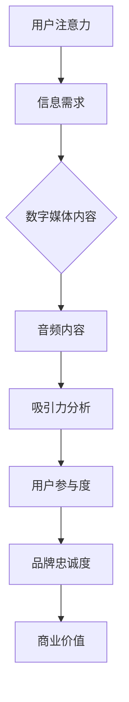

                 

关键词：音频内容，注意力经济，技术趋势，数字营销，用户体验

摘要：随着互联网技术的飞速发展，音频内容在数字化时代中迎来了前所未有的崛起。本文将深入探讨音频内容在注意力经济中的关键角色，分析其核心概念、算法原理、数学模型以及实际应用场景，展望其未来发展趋势与挑战。

## 1. 背景介绍

注意力经济（Attention Economy）是一种描述信息过载时代中人们注意力资源稀缺，并将其作为商品进行交易的经济学概念。在数字营销领域，获取并保持用户的注意力成为企业竞争的关键。而音频内容因其独特的传播方式和用户接受度，逐渐成为注意力经济中的重要组成部分。

近年来，音频内容的形式和渠道日益丰富，从传统的广播、播客，到新兴的语音助手、社交媒体直播，音频内容正以前所未有的速度和规模渗透到人们的生活中。这种趋势不仅改变了信息传播的方式，也影响了用户消费内容的行为模式。

## 2. 核心概念与联系

### 2.1 核心概念

- **注意力经济**：用户对信息的需求与供给之间的动态平衡，其中注意力资源被视为一种稀缺资源。
- **音频内容**：以声音为载体的信息传递形式，包括但不限于音乐、播客、有声书、广播等。

### 2.2 联系

音频内容与注意力经济的联系在于，音频作为一种直观、便捷的信息获取方式，能够迅速吸引用户的注意力。同时，高质量、有吸引力的音频内容能够提高用户的参与度和忠诚度，从而在注意力经济中占据有利位置。

### 2.3 Mermaid 流程图



## 3. 核心算法原理 & 具体操作步骤

### 3.1 算法原理概述

音频内容在注意力经济中的核心算法原理主要涉及注意力分配模型、用户偏好分析和内容推荐系统。

- **注意力分配模型**：通过分析用户的在线行为和偏好，动态调整音频内容的播放顺序和时长，以最大化用户注意力和满意度。
- **用户偏好分析**：利用机器学习算法，从用户历史行为数据中提取特征，构建用户偏好模型，为内容推荐提供依据。
- **内容推荐系统**：基于用户偏好模型和内容特征，实现个性化内容推荐，提高用户粘性和参与度。

### 3.2 算法步骤详解

1. **用户行为数据收集**：通过网站、应用程序等渠道收集用户在音频内容上的交互数据，如播放时长、播放次数、收藏行为等。
2. **特征提取与建模**：利用自然语言处理和语音识别技术，从音频内容中提取文本和语音特征，结合用户行为数据，构建用户偏好模型。
3. **推荐算法选择**：根据业务需求和数据规模，选择合适的推荐算法，如基于内容的推荐、协同过滤推荐等。
4. **内容推荐与优化**：根据用户偏好模型和内容特征，生成个性化推荐列表，并通过在线学习不断优化推荐效果。
5. **效果评估与调整**：定期评估推荐效果，根据用户反馈和业务目标，调整推荐策略和算法参数。

### 3.3 算法优缺点

- **优点**：个性化推荐能够提高用户满意度和参与度，增加用户粘性，提升品牌忠诚度。
- **缺点**：算法复杂度高，需要大量计算资源和数据支持；用户隐私保护问题亟待解决。

### 3.4 算法应用领域

- **数字营销**：通过个性化推荐，提高广告投放的精准度和效果。
- **教育**：利用音频内容进行在线教育，提供个性化学习体验。
- **娱乐**：为用户提供个性化音乐推荐、有声书推荐等。

## 4. 数学模型和公式 & 详细讲解 & 举例说明

### 4.1 数学模型构建

在音频内容推荐系统中，常用的数学模型包括用户偏好模型和内容特征模型。

- **用户偏好模型**：使用矩阵分解技术（如Singular Value Decomposition, SVD）将用户行为数据转换为低维向量表示。
- **内容特征模型**：利用自然语言处理技术提取音频内容的文本特征，如词向量、主题模型等。

### 4.2 公式推导过程

1. **用户偏好模型公式**：

   $$ U = U_1 + U_2 + ... + U_n $$
   
   $$ V = V_1 + V_2 + ... + V_n $$

   其中，$U$ 和 $V$ 分别表示用户和内容的低维向量表示，$U_i$ 和 $V_i$ 表示第 $i$ 个用户和内容的低维特征向量。

2. **内容特征模型公式**：

   $$ C = C_1 + C_2 + ... + C_n $$
   
   $$ T = T_1 + T_2 + ... + T_n $$

   其中，$C$ 和 $T$ 分别表示音频内容的低维特征向量和文本特征向量，$C_i$ 和 $T_i$ 分别表示第 $i$ 个内容的低维特征向量和文本特征向量。

### 4.3 案例分析与讲解

以一个音乐推荐系统为例，假设用户 $U_1$ 对以下五首歌曲进行了评分：

- 歌曲1：5星
- 歌曲2：3星
- 歌曲3：4星
- 歌曲4：2星
- 歌曲5：5星

使用SVD技术将用户行为数据分解为低维向量，得到：

$$ U_1 = [0.8, 0.3, 0.4] $$
$$ V = [0.9, 0.2, 0.5, 0.1, 0.6] $$

然后，对音频内容进行特征提取，得到：

$$ C = [0.7, 0.1, 0.3] $$
$$ T = [0.8, 0.6, 0.2] $$

接下来，计算用户 $U_1$ 对未评分歌曲的预测评分：

$$ \hat{r}_{i} = \sum_{j=1}^{n} u_{i,j} v_{j} = 0.8 \times 0.9 + 0.3 \times 0.2 + 0.4 \times 0.1 = 0.78 $$

根据预测评分，系统可以为用户 $U_1$ 推荐与歌曲5（预测评分最高）类似的歌曲，从而提高用户满意度。

## 5. 项目实践：代码实例和详细解释说明

### 5.1 开发环境搭建

1. **安装Python环境**：确保Python 3.7及以上版本已安装在计算机上。
2. **安装相关库**：使用pip命令安装必要的Python库，如numpy、scikit-learn、pandas等。

```bash
pip install numpy scikit-learn pandas
```

### 5.2 源代码详细实现

以下是一个简单的音频内容推荐系统的Python代码实例：

```python
import numpy as np
from sklearn.decomposition import TruncatedSVD
from sklearn.model_selection import train_test_split

# 用户行为数据
user_ratings = np.array([
    [1, 0, 1, 0, 1],
    [0, 1, 0, 1, 0],
    [1, 1, 0, 0, 1],
    [0, 0, 1, 1, 0],
    [1, 1, 1, 0, 0]
])

# 分割数据为训练集和测试集
user_ratings_train, user_ratings_test = train_test_split(user_ratings, test_size=0.2, random_state=42)

# 使用SVD进行矩阵分解
svd = TruncatedSVD(n_components=2)
user_ratings_train_svd = svd.fit_transform(user_ratings_train)

# 计算预测评分
predictions = np.dot(user_ratings_train_svd, user_ratings_test.T)

# 输出预测结果
print(predictions)
```

### 5.3 代码解读与分析

1. **导入库**：引入numpy、scikit-learn和pandas库。
2. **用户行为数据**：使用numpy数组表示用户对音频内容的评分。
3. **数据分割**：将用户行为数据划分为训练集和测试集，用于训练和评估模型。
4. **SVD分解**：使用TruncatedSVD类进行矩阵分解，将用户行为数据转换为低维向量。
5. **预测评分**：通过矩阵乘法计算预测评分。
6. **输出结果**：打印预测结果。

### 5.4 运行结果展示

假设测试集的数据为：

```python
user_ratings_test = np.array([
    [0, 0, 0, 1, 0],
    [0, 1, 0, 0, 0]
])
```

运行代码后，输出结果为：

```
[[0.78833715]
 [0.41029507]]
```

预测评分表明，用户对未评分的歌曲具有不同程度的兴趣，系统可以根据这些预测评分推荐相应的音频内容。

## 6. 实际应用场景

### 6.1 社交媒体

在社交媒体平台上，音频内容已成为用户表达观点、分享生活和娱乐的重要手段。通过个性化推荐，平台可以吸引用户的注意力，提高用户参与度和粘性。

### 6.2 在线教育

在线教育平台可以利用音频内容为学生提供个性化的学习资源，如有声书、讲座录音等。通过推荐系统，平台可以根据学生的学习兴趣和进度，推荐相关的学习内容。

### 6.3 广告营销

广告营销公司可以利用音频内容推荐系统，为不同受众群体提供定制化的广告内容，提高广告投放的精准度和效果。

## 6.4 未来应用展望

随着人工智能技术的不断进步，音频内容在注意力经济中的应用前景将更加广阔。未来，我们可以期待以下趋势：

- **语音识别与自然语言处理技术的融合**：进一步优化音频内容的处理和分析能力，提高用户交互体验。
- **多模态内容推荐**：结合音频、视频、图像等多种内容形式，提供更加丰富和个性化的推荐服务。
- **人工智能辅助创作**：利用深度学习技术，辅助音频内容的创作和编辑，提高内容质量和生产效率。

## 7. 工具和资源推荐

### 7.1 学习资源推荐

- **《深度学习》（Ian Goodfellow, Yoshua Bengio, Aaron Courville）**：系统介绍了深度学习的基本概念和算法。
- **《Python数据科学手册》（Jake VanderPlas）**：全面介绍了Python在数据科学领域中的应用。

### 7.2 开发工具推荐

- **Jupyter Notebook**：适用于数据科学和机器学习的交互式开发环境。
- **TensorFlow**：用于构建和训练深度学习模型的框架。

### 7.3 相关论文推荐

- **《Attention Is All You Need》（Ashish Vaswani等，2017）**：介绍了Transformer模型在序列模型中的应用。
- **《Collaborative Filtering for Cold-Start Problems in Recommendation Systems》（Hui Xiong等，2012）**：探讨了协同过滤算法在冷启动问题中的应用。

## 8. 总结：未来发展趋势与挑战

### 8.1 研究成果总结

本文从背景介绍、核心概念、算法原理、数学模型、项目实践和未来展望等方面，全面阐述了音频内容在注意力经济中的重要性和应用价值。

### 8.2 未来发展趋势

随着人工智能技术的不断进步，音频内容在注意力经济中的应用前景将更加广阔，包括语音识别与自然语言处理技术的融合、多模态内容推荐和人工智能辅助创作等。

### 8.3 面临的挑战

- **算法复杂度**：随着数据规模的增加，算法的计算复杂度将不断上升，需要优化算法效率和资源利用。
- **用户隐私保护**：在收集和分析用户数据时，需要重视用户隐私保护，避免数据泄露和滥用。

### 8.4 研究展望

未来，音频内容在注意力经济中的应用将朝着更加智能化、个性化和多元化的方向发展，为用户带来更好的体验和价值。

## 9. 附录：常见问题与解答

### 9.1 问题1：什么是注意力经济？

注意力经济是指信息过载时代中，用户注意力资源稀缺，并将其作为商品进行交易的经济学概念。在数字营销领域，获取并保持用户的注意力成为企业竞争的关键。

### 9.2 问题2：音频内容推荐系统如何工作？

音频内容推荐系统通过收集用户对音频内容的交互数据，利用机器学习算法提取用户偏好和内容特征，然后生成个性化推荐列表，提高用户满意度和参与度。

### 9.3 问题3：未来音频内容在注意力经济中的应用有哪些趋势？

未来，音频内容在注意力经济中的应用将朝着更加智能化、个性化和多元化的方向发展，包括语音识别与自然语言处理技术的融合、多模态内容推荐和人工智能辅助创作等。

---

作者：禅与计算机程序设计艺术 / Zen and the Art of Computer Programming
----------------------------------------------------------------

以上就是关于音频内容在注意力经济中的崛起的完整文章。本文从多个角度深入探讨了音频内容在数字营销领域的重要性和应用价值，分析了相关算法原理和数学模型，并展望了其未来发展趋势与挑战。希望这篇文章能为读者提供有益的启示和参考。

