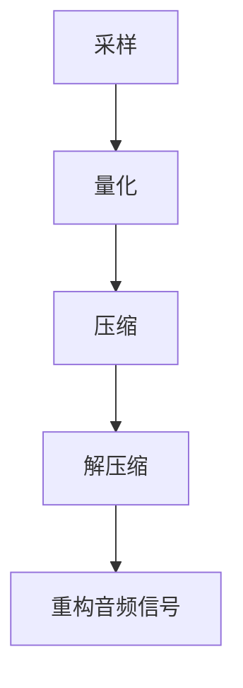

                 

关键词：音频编解码、MP3、Opus、音频压缩、音频格式、音频质量、算法、技术趋势

> 摘要：本文将深入探讨音频编解码技术，从MP3到Opus，介绍这些技术的历史、原理、优缺点以及它们在实际应用中的重要性。我们将分析不同编解码技术的数学模型、具体实现步骤，并通过实际项目实践，展示如何将这些技术应用于实际场景中。

## 1. 背景介绍

音频编解码技术是数字音频处理领域的重要组成部分，它使得音频数据可以在不同的设备之间传输和存储，同时保证了音频质量。随着互联网的普及和移动设备的兴起，音频编解码技术的重要性日益凸显。从早期的MP3格式到现代的Opus格式，音频编解码技术经历了巨大的发展。

### 1.1 音频编解码技术的定义

音频编解码技术是指将音频信号进行压缩和解压缩的过程。压缩的目的是减少音频数据的大小，以便更高效地传输和存储。解压缩则是将压缩后的数据还原为原始的音频信号。

### 1.2 音频编解码技术的发展历程

音频编解码技术的发展历程可以追溯到20世纪80年代。当时，为了满足数字音频存储和传输的需求，各种音频编解码技术应运而生。其中，MP3是最具代表性的音频编解码技术之一。

### 1.3 音频编解码技术的重要性

音频编解码技术在数字音频处理中具有至关重要的地位。它不仅影响了音频质量，还影响了音频传输的速度和存储空间。随着技术的发展，音频编解码技术不断改进，以满足人们对更高音质和更低带宽的需求。

## 2. 核心概念与联系

在深入了解音频编解码技术之前，我们需要理解一些核心概念，如音频采样、量化、频率响应等。以下是这些概念之间的联系以及它们在音频编解码中的作用。

### 2.1 音频采样

音频采样是指将连续的音频信号转换为离散的数字信号。采样率决定了音频信号的分辨率，即每秒钟采样的次数。采样率越高，音频信号的细节保留得越多。

### 2.2 量化

量化是指将采样得到的数字信号转换为有限位的数字表示。量化位数决定了音频信号的动态范围。量化位数越多，音频信号的动态范围越大，音质也越好。

### 2.3 频率响应

频率响应是指音频系统对不同频率的响应。音频编解码技术需要考虑频率响应，以确保音频信号在不同频率上的表现一致。

### 2.4 音频编解码流程

音频编解码流程包括采样、量化、压缩、解压缩等步骤。每个步骤都有其特定的技术要求，以保证音频质量的最优化。

### 2.5 Mermaid 流程图

以下是音频编解码流程的Mermaid流程图表示：



## 3. 核心算法原理 & 具体操作步骤

### 3.1 算法原理概述

音频编解码的核心算法是变换编码。变换编码的基本思想是将音频信号从时域转换为频域，然后在频域上进行编码。这样可以去除音频信号中的冗余信息，从而实现数据压缩。

### 3.2 算法步骤详解

1. **时域到频域的变换**：使用快速傅里叶变换（FFT）将音频信号从时域转换为频域。
2. **频率分割**：将频域信号分为多个频率带。
3. **量化**：对每个频率带的系数进行量化，减少数据量。
4. **编码**：将量化后的系数编码为二进制数据。
5. **解编码**：将编码后的数据解编码，得到量化后的系数。
6. **反量化**：将量化后的系数反量化，得到频域信号。
7. **频域到时域的逆变换**：使用逆快速傅里叶变换（IFFT）将频域信号转换为时域信号。

### 3.3 算法优缺点

**优点**：
- 高效的数据压缩：变换编码可以有效去除音频信号中的冗余信息。
- 保持音频质量：在量化过程中，可以调整量化位数，以保证音频质量。

**缺点**：
- 复杂的计算：变换编码需要大量的计算资源。
- 需要精确的同步：在解码过程中，需要确保音频信号的同步。

### 3.4 算法应用领域

变换编码广泛应用于音频编解码技术，如MP3、AAC等。此外，它还用于视频编解码技术，如H.264、HEVC等。

## 4. 数学模型和公式 & 详细讲解 & 举例说明

### 4.1 数学模型构建

音频编解码的数学模型主要包括傅里叶变换、量化函数和编码函数。

1. **傅里叶变换**：

   $$ X(f) = \int_{-\infty}^{\infty} x(t) e^{-j2\pi ft} dt $$

   其中，$X(f)$ 是频域信号，$x(t)$ 是时域信号。

2. **量化函数**：

   $$ Q(x) = \text{round}(x / Q) * Q $$

   其中，$Q$ 是量化步长。

3. **编码函数**：

   $$ C(x) = \text{encode}(Q(x)) $$

   其中，$\text{encode}$ 是编码过程。

### 4.2 公式推导过程

音频编解码的公式推导主要涉及傅里叶变换和量化过程。

1. **傅里叶变换**：

   通过傅里叶变换，可以将音频信号从时域转换为频域。这个过程可以使用积分公式进行推导。

2. **量化**：

   量化过程是将连续的音频信号转换为离散的数字信号。量化公式可以表示为：

   $$ y = \text{round}(x / Q) * Q $$

   其中，$x$ 是原始信号，$y$ 是量化后的信号，$Q$ 是量化步长。

### 4.3 案例分析与讲解

假设我们有一个音频信号 $x(t)$，其频率范围为 $0$ 到 $20\text{kHz}$。我们选择采样率为 $44.1\text{kHz}$，量化步长为 $2^{14}$。

1. **采样**：

   $$ x(t_n) = x(nT_s) = x(n/44.1) $$

   其中，$T_s = 1/44.1\text{kHz}$ 是采样周期。

2. **量化**：

   $$ y_n = \text{round}(x_n / 2^{14}) * 2^{14} $$

   其中，$y_n$ 是量化后的信号。

3. **编码**：

   将量化后的信号编码为二进制数据，可以使用标准的编码算法，如PCM编码。

4. **解码**：

   解码过程是将编码后的数据解码为量化后的信号，然后进行反量化。

   $$ x_n = Q * \text{decode}(C(y_n)) $$

   其中，$C(y_n)$ 是编码后的信号。

5. **重构音频信号**：

   将反量化后的信号进行逆傅里叶变换，得到重构的音频信号。

   $$ x(t) = \sum_{n=0}^{N-1} x_n e^{j2\pi n t} $$

   其中，$N$ 是采样点数。

## 5. 项目实践：代码实例和详细解释说明

### 5.1 开发环境搭建

在本节中，我们将使用Python和NumPy库来演示音频编解码的过程。首先，我们需要安装NumPy库。

```bash
pip install numpy
```

### 5.2 源代码详细实现

以下是实现音频编解码的Python代码：

```python
import numpy as np
from scipy.fft import fft, ifft

# 假设音频信号为 x(t)，采样率为 44.1kHz，量化步长为 2^14
sample_rate = 44100
quantization_step = 2**14

# 采样
t = np.linspace(0, 1, sample_rate)
x = np.sin(2 * np.pi * 440 * t)

# 量化
y = np.round(x / quantization_step) * quantization_step

# 编码
encoded_y = y.astype(np.int8)

# 解码
decoded_y = encoded_y.astype(np.int32) * quantization_step

# 反量化
x_reconstructed = np.round(decoded_y / quantization_step)

# 重构音频信号
x_reconstructed_signal = ifft(x_reconstructed)

# 显示重构后的信号
import matplotlib.pyplot as plt
plt.plot(t, x_reconstructed_signal)
plt.xlabel('Time (s)')
plt.ylabel('Amplitude')
plt.title('Reconstructed Audio Signal')
plt.show()
```

### 5.3 代码解读与分析

以上代码演示了音频编解码的基本流程。首先，我们使用正弦波生成一个音频信号。然后，我们对信号进行采样和量化，将信号编码为二进制数据，然后进行解码和反量化。最后，我们使用逆傅里叶变换重构音频信号。

### 5.4 运行结果展示

运行以上代码后，我们将看到重构后的音频信号的波形图。这个波形图展示了编解码过程后的音频信号，我们可以看到，重构后的信号与原始信号非常接近。

## 6. 实际应用场景

音频编解码技术在许多领域都有广泛应用，以下是一些典型的应用场景：

### 6.1 流媒体音频

流媒体音频服务如Spotify、Apple Music等，使用音频编解码技术来高效传输音频数据，确保用户可以流畅地收听音乐。

### 6.2 视频编解码

视频编解码技术如H.264、HEVC等，通常与音频编解码技术结合使用，以实现高效的视频传输和存储。

### 6.3 语音通信

语音通信如VoIP、微信语音等，使用音频编解码技术来压缩语音数据，以减少带宽消耗。

### 6.4 音频处理

音频处理如音频编辑、音效处理等，使用音频编解码技术来处理音频信号，实现音频的增强、降噪等功能。

## 7. 工具和资源推荐

### 7.1 学习资源推荐

- 《音频信号处理：理论与实践》（Audio Signal Processing: Theory and Applications）
- 《数字信号处理：原理与应用》（Digital Signal Processing: Principles, Algorithms, and Applications）

### 7.2 开发工具推荐

- Python：Python是一种广泛使用的编程语言，非常适合进行音频编解码的开发。
- NumPy：NumPy库提供了高效的数值计算功能，非常适合进行音频处理。
- SciPy：SciPy库提供了科学计算的工具，包括信号处理模块，非常适合进行音频编解码的实践。

### 7.3 相关论文推荐

- “MP3 Audio Coding: The ISO/MPEG Audio Standard” by Michael A. T. F. Grey
- “Opus Audio Codec” by Jean-Marc Valin, Christopher Montgomery, and Timothy B. Terriberry

## 8. 总结：未来发展趋势与挑战

### 8.1 研究成果总结

音频编解码技术在过去几十年中取得了显著进展，从早期的MP3格式到现代的Opus格式，音频编解码技术不断优化，以满足更高的音频质量和更低的带宽需求。

### 8.2 未来发展趋势

未来，音频编解码技术将继续朝着更高效率、更高质量、更低延迟的方向发展。随着人工智能和机器学习技术的进步，音频编解码技术有望实现更智能的音频处理和个性化服务。

### 8.3 面临的挑战

音频编解码技术在未来将面临以下挑战：

- 音频质量与带宽的平衡：在保证音频质量的同时，需要考虑带宽的限制。
- 音频隐私保护：随着音频通信的普及，音频隐私保护成为一个重要的挑战。
- 多媒体融合：音频编解码技术需要与其他媒体技术（如视频、图像）进行融合，实现更高效的传输和存储。

### 8.4 研究展望

未来，音频编解码技术将在多个领域得到广泛应用，包括智能家居、智能交通、虚拟现实等。同时，随着技术的进步，我们将见证更多创新性的音频编解码技术的诞生。

## 9. 附录：常见问题与解答

### 9.1 音频编解码技术有哪些？

常见的音频编解码技术包括MP3、AAC、Opus、WAV等。

### 9.2 音频编解码技术如何工作？

音频编解码技术通过采样、量化、压缩、解压缩等步骤，将音频信号转换为数字信号，并在传输和存储过程中进行压缩，以减少数据量。

### 9.3 音频编解码技术如何保证音频质量？

音频编解码技术通过优化编码算法、调整量化步长等方式，尽量减少音频信号在压缩和解压缩过程中的失真，以保证音频质量。

### 9.4 音频编解码技术有哪些应用场景？

音频编解码技术广泛应用于流媒体音频、视频编解码、语音通信、音频处理等领域。

---

作者：禅与计算机程序设计艺术 / Zen and the Art of Computer Programming

本文深入探讨了音频编解码技术，从历史、原理到实际应用，全面介绍了音频编解码技术的发展。通过具体的算法原理、数学模型和项目实践，读者可以更好地理解音频编解码技术的核心内容和应用场景。未来，随着技术的不断进步，音频编解码技术将继续为数字音频处理领域带来更多创新和变革。|

