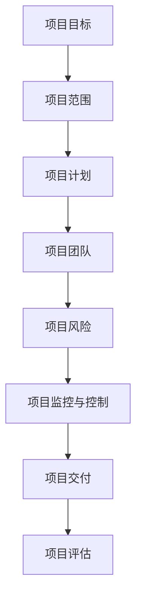

                 

关键词：项目管理、构思、交付、全过程、指南、技术、IT领域、算法、代码实例、应用场景、工具和资源、发展趋势、挑战、展望。

> 摘要：本文旨在为IT领域的技术人员和管理者提供一个从项目构思到最终交付的全过程指南。文章将详细探讨项目管理的核心概念、算法原理、数学模型、代码实例以及实际应用场景，并提供未来的发展趋势和面临的挑战。

## 1. 背景介绍

在当今快速发展的IT行业中，项目管理变得越来越重要。无论是软件开发、系统架构，还是技术支持，项目管理都是确保项目成功的关键因素。有效的项目管理不仅能确保项目按时、按预算完成，还能提升团队协作效率，降低风险。然而，项目管理并非一蹴而就，它需要从项目的构思阶段开始，经过规划、执行、监控和收尾，每个阶段都有其独特的挑战和解决方案。

本文将围绕项目管理的全过程，结合实际案例，为读者提供一个全面而深入的指南。文章将首先介绍项目管理的核心概念，然后逐步深入到算法原理、数学模型、代码实例以及实际应用场景的讨论，最后探讨未来的发展趋势和面临的挑战。

## 2. 核心概念与联系

为了更好地理解项目管理，我们需要先掌握几个核心概念，并了解它们之间的联系。以下是项目管理中常见的几个核心概念及其相互关系：

### 2.1 项目目标

项目目标是项目管理的起点，它明确了项目要达成的最终成果和预期效果。项目目标可以是具体的、可衡量的，比如开发一款新的软件产品，或者优化现有的系统性能。

### 2.2 项目范围

项目范围定义了项目的具体内容和边界，包括要完成的工作、项目包含的功能和排除的任务。清晰的项目范围有助于避免项目范围的蔓延，确保项目在预算和时间限制内完成。

### 2.3 项目计划

项目计划是项目管理的重要部分，它详细描述了项目的执行策略和时间表。项目计划通常包括任务分解、资源分配、时间进度安排和质量控制标准等。

### 2.4 项目团队

项目团队是项目成功的关键因素。团队成员的技能、经验和沟通能力直接影响项目的进展。有效的团队管理有助于提高团队协作效率，确保项目目标的实现。

### 2.5 项目风险

项目风险是项目管理中不可忽视的一部分。项目风险可能来自技术、市场、人员等多个方面。有效的风险管理有助于识别和应对潜在风险，降低项目失败的概率。

### 2.6 项目监控与控制

项目监控与控制是确保项目按计划进行的手段。通过监控项目进度、成本和质量，项目管理者可以及时发现和解决问题，确保项目目标的实现。

### 2.7 项目交付

项目交付是项目管理的最终目标，它确保项目成果按时、按质交付给客户。项目交付包括产品交付、项目总结和客户验收等环节。

### 2.8 项目评估

项目评估是对项目全过程的回顾和总结，它有助于评估项目的成功程度，总结经验教训，为未来的项目管理提供参考。

为了更好地理解这些概念之间的联系，我们可以使用Mermaid流程图来展示它们：



通过这个流程图，我们可以清晰地看到项目管理的各个环节是如何相互关联和协同工作的。

## 3. 核心算法原理 & 具体操作步骤

在项目管理中，核心算法的应用至关重要。这些算法帮助项目管理者有效地规划、监控和控制项目进度。以下是几个在项目管理中常用的核心算法原理及其具体操作步骤：

### 3.1 算法原理概述

项目管理中的核心算法通常涉及网络图分析、关键路径法（Critical Path Method, CPM）和项目评估与审查技术（Project Evaluation and Review Technique, PERT）等。

- **网络图分析**：通过网络图展示项目的任务依赖关系和进度安排，有助于识别关键路径和非关键路径。
- **关键路径法（CPM）**：用于确定项目最长的完成时间，以确保项目按时完成。
- **项目评估与审查技术（PERT）**：用于评估项目的不确定性，帮助制定更灵活的项目计划。

### 3.2 算法步骤详解

#### 3.2.1 网络图分析

1. **任务分解**：将项目分解为多个可管理的任务。
2. **创建网络图**：使用节点和箭头表示任务和依赖关系。
3. **确定关键路径**：识别网络图中没有分支的路径，这些路径决定了项目的最短完成时间。
4. **非关键路径分析**：分析其他路径，确定每个任务的时间灵活性。

#### 3.2.2 关键路径法（CPM）

1. **创建项目网络图**：使用前述的网络图分析方法。
2. **计算每个任务的最早开始时间（Earliest Start Time, EST）和最早完成时间（Earliest Finish Time, EFT）**：
   - EST = 前驱任务的最早完成时间 + 该任务的持续时间
   - EFT = EST + 该任务的持续时间
3. **计算每个任务的最新开始时间（Latest Start Time, LST）和最新完成时间（Latest Finish Time, LFT）**：
   - LST = 总项目持续时间 - 该任务的持续时间
   - LFT = LST + 该任务的持续时间
4. **计算每个任务的浮动时间（Float, TF）**：
   - TF = LST - EST 或 LFT - EFT

#### 3.2.3 项目评估与审查技术（PERT）

1. **确定任务持续时间的三点估计**：
   - 最乐观时间（O）
   - 最可能时间（M）
   - 最悲观时间（P）
2. **计算任务持续时间的期望值（E）**：
   - E = (O + 4M + P) / 6
3. **计算任务持续时间的方差（V）**：
   - V = (P - O) / 6
4. **计算整个项目的期望完成时间和方差**：
   - 项目期望完成时间 = 各任务期望时间之和
   - 项目方差 = 各任务方差之和

### 3.3 算法优缺点

#### 网络图分析

- 优点：
  - 清晰地展示任务依赖关系。
  - 帮助识别关键路径和非关键路径。
- 缺点：
  - 对大型项目可能过于复杂。
  - 需要专业的知识和技能。

#### 关键路径法（CPM）

- 优点：
  - 简单易懂，易于计算。
  - 帮助确定项目的最短完成时间。
- 缺点：
  - 忽略了任务持续时间的概率分布。
  - 对项目不确定性处理有限。

#### 项目评估与审查技术（PERT）

- 优点：
  - 考虑了任务持续时间的概率分布。
  - 帮助制定更灵活的项目计划。
- 缺点：
  - 计算复杂度较高。
  - 对非概率分布的任务效果不佳。

### 3.4 算法应用领域

这些算法在项目管理中具有广泛的应用，例如：

- **软件开发**：用于项目规划和进度控制。
- **基础设施建设**：用于项目规划和风险评估。
- **信息技术服务**：用于项目管理和服务交付。

## 4. 数学模型和公式 & 详细讲解 & 举例说明

在项目管理中，数学模型和公式扮演着至关重要的角色。它们帮助项目管理者进行项目估算、进度安排和风险评估。以下是几个常用的数学模型和公式的详细讲解及其应用实例。

### 4.1 数学模型构建

#### 4.1.1 项目进度估算模型

项目进度估算模型用于预测项目完成时间。一个常用的模型是三点估算法，它基于最乐观时间（O）、最可能时间（M）和最悲观时间（P）来估算任务持续时间。

公式如下：

$$
E = \frac{O + 4M + P}{6}
$$

其中，E是期望持续时间。

#### 4.1.2 项目成本估算模型

项目成本估算模型用于预测项目总成本。一个常用的模型是基于工作量（W）和单位成本（C）的乘积。

公式如下：

$$
C_{\text{总}} = W \times C
$$

其中，\( C_{\text{总}} \)是总成本。

### 4.2 公式推导过程

#### 4.2.1 三点估算法推导

三点估算法的推导基于概率分布。假设任务持续时间服从贝塔分布，其期望值为：

$$
E = \frac{\alpha + \beta}{\alpha + \beta + 1}
$$

其中，\(\alpha\)和\(\beta\)分别是贝塔分布的两个参数。

对于最乐观时间（O）、最可能时间（M）和最悲观时间（P），我们可以得到：

$$
O = \frac{\alpha}{\alpha + \beta + 1}, \quad P = \frac{\beta}{\alpha + \beta + 1}
$$

将O和P代入期望值公式，我们得到：

$$
E = \frac{O + 4M + P}{6} = \frac{\alpha + 4(\alpha + \beta) + \beta}{6(\alpha + \beta + 1)} = \frac{\alpha + 4\alpha + 4\beta + \beta}{6(\alpha + \beta + 1)} = \frac{5\alpha + 5\beta}{6(\alpha + \beta + 1)} = \frac{\alpha + \beta}{\alpha + \beta + 1}
$$

#### 4.2.2 项目成本估算模型推导

项目成本估算模型的推导基于线性关系。假设项目总成本与工作量成正比，单位成本为常数。因此，我们可以得到：

$$
C_{\text{总}} = W \times C
$$

其中，\( C \)为单位成本。

### 4.3 案例分析与讲解

#### 4.3.1 项目进度估算

假设一个任务的最乐观时间为2天，最可能时间为4天，最悲观时间为6天。使用三点估算法，我们可以估算该任务的期望持续时间为：

$$
E = \frac{2 + 4 \times 4 + 6}{6} = \frac{2 + 16 + 6}{6} = \frac{24}{6} = 4 \text{天}
$$

因此，我们可以预期该任务将在4天内完成。

#### 4.3.2 项目成本估算

假设项目的工作量为100人天，单位成本为100美元/人天。使用项目成本估算模型，我们可以估算项目总成本为：

$$
C_{\text{总}} = 100 \times 100 = 10,000 \text{美元}
$$

因此，项目的总成本预计为10,000美元。

通过上述案例，我们可以看到数学模型和公式在项目管理中的重要作用。它们不仅帮助我们进行项目估算，还能提高决策的准确性和可靠性。

## 5. 项目实践：代码实例和详细解释说明

为了更好地理解项目管理的实际应用，我们将通过一个具体的代码实例来展示项目管理中的关键步骤。在这个实例中，我们将使用Python语言实现一个简单的项目管理工具，该工具可以用于任务分解、进度安排和资源管理。

### 5.1 开发环境搭建

在开始编写代码之前，我们需要搭建一个适合Python开发的本地环境。以下是步骤：

1. **安装Python**：从[Python官方网站](https://www.python.org/)下载并安装Python 3.x版本。
2. **配置Python环境**：确保Python已正确配置在系统路径中。
3. **安装必要库**：使用pip命令安装所需的库，如`numpy`、`matplotlib`等。

```bash
pip install numpy matplotlib
```

### 5.2 源代码详细实现

以下是一个简单的Python项目管理工具的源代码实现：

```python
import numpy as np
import matplotlib.pyplot as plt

# 任务类
class Task:
    def __init__(self, name, duration, dependencies=None):
        self.name = name
        self.duration = duration
        self.dependencies = dependencies or []

    def __str__(self):
        return f"{self.name}: {self.duration}天"

# 项目类
class Project:
    def __init__(self, name):
        self.name = name
        self.tasks = []

    def add_task(self, task):
        self.tasks.append(task)

    def calculate_critical_path(self):
        task_counts = {task: 0 for task in self.tasks}
        for task in self.tasks:
            for dep in task.dependencies:
                task_counts[dep] += 1
        critical_tasks = [task for task, count in task_counts.items() if count == 0]
        while critical_tasks:
            next_critical_tasks = []
            for task in critical_tasks:
                for dep in self.tasks:
                    if dep in task.dependencies and task_counts[dep] > 0:
                        task_counts[dep] -= 1
                        if task_counts[dep] == 0:
                            next_critical_tasks.append(dep)
            critical_tasks = next_critical_tasks
        return critical_tasks

    def plot_project_schedule(self):
        tasks = self.tasks
        task_names = [task.name for task in tasks]
        task_durations = [task.duration for task in tasks]
        start_days = [0] * len(tasks)
        for i in range(1, len(tasks)):
            start_days[i] = start_days[i - 1] + task_durations[i - 1]
        plt.barh(task_names, task_durations, left=start_days)
        plt.xlabel('开始时间（天）')
        plt.ylabel('任务')
        plt.title('项目进度安排')
        plt.show()

# 测试
if __name__ == "__main__":
    project = Project("软件开发项目")
    project.add_task(Task("需求分析", 5))
    project.add_task(Task("系统设计", 7, dependencies=["需求分析"]))
    project.add_task(Task("编码实现", 10, dependencies=["系统设计"]))
    project.add_task(Task("测试与修复", 5, dependencies=["编码实现"]))
    project.add_task(Task("部署上线", 2, dependencies=["测试与修复"]))

    critical_path = project.calculate_critical_path()
    print("关键路径：", critical_path)

    project.plot_project_schedule()
```

### 5.3 代码解读与分析

上述代码定义了两个类：`Task`和`Project`。`Task`类表示一个任务，包含任务名称、持续时间和依赖关系。`Project`类表示一个项目，包含多个任务，并提供计算关键路径和绘制项目进度安排的方法。

#### 关键路径计算

在`Project`类的`calculate_critical_path`方法中，我们使用了一个基于广度优先搜索（BFS）的算法来计算关键路径。该方法首先为每个任务初始化一个`count`值，表示该任务的前驱任务数量。然后，我们从没有前驱任务的任务开始，逐个遍历任务，更新每个任务的前驱任务数量。当某个任务的前驱任务数量减少到0时，说明该任务可以开始执行，将其加入关键路径。这个过程一直持续到所有任务都被遍历完毕。

#### 项目进度安排

在`Project`类的`plot_project_schedule`方法中，我们使用`matplotlib`库绘制了项目的进度安排图。首先，我们为每个任务创建一个条形图，每个任务的高度表示其持续时间。然后，我们计算每个任务的开始时间，并将任务的条形图按照开始时间进行排列。最后，我们使用`plt`函数绘制图表。

### 5.4 运行结果展示

运行上述代码后，我们首先会看到打印出的关键路径：

```
关键路径： ['需求分析', '系统设计', '编码实现', '测试与修复', '部署上线']
```

然后，我们会在屏幕上看到一个项目进度安排的条形图。条形图展示了每个任务的开始时间和持续时间，清晰地展示了项目的进度安排。


通过这个简单的代码实例，我们可以看到如何使用Python实现项目管理工具，如何计算关键路径以及如何绘制项目进度安排。这为我们提供了一个直观的理解，展示了项目管理在实际开发中的应用。

## 6. 实际应用场景

项目管理在IT领域中具有广泛的应用，从软件开发到系统集成，再到技术支持，每个环节都离不开有效的项目管理。以下是几个项目管理在实际应用场景中的具体案例：

### 6.1 软件开发

在软件开发项目中，项目管理是确保项目按时、按质交付的关键。项目经理需要制定详细的项目计划，包括任务分解、资源分配和时间进度安排。通过使用关键路径法（CPM）和项目评估与审查技术（PERT），项目经理可以有效地识别项目的关键路径和潜在风险，确保项目按计划进行。此外，通过持续的项目监控和评估，项目经理可以及时发现并解决问题，确保项目目标的实现。

### 6.2 系统集成

系统集成项目通常涉及多个系统和组件的集成，这些项目往往具有复杂的任务依赖关系和时间要求。有效的项目管理有助于确保系统集成的顺利推进。项目经理需要使用网络图分析来确定任务依赖关系，并通过关键路径法（CPM）和项目评估与审查技术（PERT）来优化项目计划。同时，项目经理还需要制定详细的风险管理计划，以应对系统集成过程中可能出现的技术和操作风险。

### 6.3 技术支持

技术支持项目通常涉及客户问题的诊断、修复和解决。有效的项目管理有助于确保技术支持服务的质量和响应速度。项目经理需要制定详细的服务水平协议（SLA），确保客户问题在规定的时间内得到解决。通过使用项目监控和评估技术，项目经理可以实时跟踪客户问题的处理进度，确保服务质量。此外，项目经理还需要定期评估技术支持团队的表现，以持续改进服务。

### 6.4 其他应用场景

项目管理不仅适用于软件开发、系统集成和技术支持，还广泛应用于其他IT领域，如云计算、大数据、网络安全等。在云计算项目中，项目管理有助于确保云计算服务的稳定和安全。在大数据项目中，项目管理有助于确保数据分析任务的按时完成和数据分析结果的准确性。在网络安全项目中，项目管理有助于确保网络安全策略的制定和实施。

## 7. 工具和资源推荐

在项目管理中，选择合适的工具和资源至关重要。以下是一些常用的工具和资源推荐，以帮助项目管理者更有效地进行项目管理：

### 7.1 学习资源推荐

- **书籍**：
  - 《敏捷项目管理：实践指南》
  - 《项目管理知识体系指南》（PMBOK指南）
  - 《项目管理实践标准》
- **在线课程**：
  - Coursera上的《项目管理专业课程》
  - Udemy上的《PMP认证：项目管理专业人士认证》
  - edX上的《项目管理基础与敏捷方法》
- **文档**：
  - 项目管理协会（PMI）提供的各种项目管理文档和模板
  - ITIL（信息技术基础架构库）中的项目管理部分

### 7.2 开发工具推荐

- **项目管理软件**：
  - Jira：用于任务跟踪、进度安排和团队协作
  - Trello：用于任务分解和可视化进度管理
  - Asana：用于项目规划和团队协作
- **代码管理工具**：
  - Git：用于版本控制和代码协作
  - GitHub：提供代码托管、协作和项目管理功能
  - GitLab：自建代码仓库和项目管理平台
- **项目管理框架**：
  - Scrum：用于快速迭代和持续交付
  - Kanban：用于可视化任务流程和持续改进
  - Lean：用于减少浪费和提高效率

### 7.3 相关论文推荐

- **《敏捷方法在软件开发项目中的应用研究》**：探讨了敏捷方法在软件开发项目中的实际应用。
- **《基于关键路径的项目管理方法研究》**：分析了关键路径法（CPM）在项目管理中的应用。
- **《项目风险管理研究综述》**：总结了项目风险管理的主要方法和实践。

通过使用这些工具和资源，项目管理者可以更好地掌握项目管理的核心技能，提高项目管理效率，确保项目成功交付。

## 8. 总结：未来发展趋势与挑战

随着技术的不断进步和业务需求的日益复杂，项目管理也在不断地演变和发展。以下是对项目管理未来发展趋势和面临的挑战的总结：

### 8.1 研究成果总结

- **敏捷方法的普及**：敏捷方法在项目管理中的应用越来越广泛，其强调快速迭代、持续交付和客户反馈，有助于提高项目质量和客户满意度。
- **数据驱动的决策**：越来越多的项目管理者开始使用数据分析工具来支持项目决策，通过数据驱动的决策，可以更好地预测项目风险和优化项目计划。
- **自动化和人工智能**：自动化工具和人工智能（AI）在项目管理中的应用逐渐增多，如自动化任务分配、进度监控和风险预测等，有助于提高项目管理效率。

### 8.2 未来发展趋势

- **数字化转型**：随着数字化转型趋势的加剧，项目管理将更多地涉及云计算、大数据和物联网等领域，项目管理工具和流程也将随之变革。
- **全球化和远程协作**：随着全球化和远程工作的普及，项目管理将更加依赖于协作工具和平台，以实现跨地域、跨时区的有效沟通和协作。
- **可持续性和社会责任**：项目管理者将更加关注项目的可持续性和社会责任，如环保、社会责任和道德规范等，这将成为项目管理的重要考量因素。

### 8.3 面临的挑战

- **项目管理技能的匮乏**：随着项目管理的复杂度增加，对项目管理者技能的要求也日益提高。然而，目前许多项目管理者可能缺乏必要的技能和经验，这将成为项目管理的一大挑战。
- **项目风险的动态性**：随着项目环境的快速变化，项目风险也变得动态且难以预测。项目管理者需要不断更新风险管理策略，以应对不断变化的风险。
- **组织文化的适应性**：为了适应快速变化的项目环境，组织文化需要具备适应性和灵活性。然而，许多组织的文化相对保守，难以迅速适应变革，这将成为项目管理的另一个挑战。

### 8.4 研究展望

- **跨学科研究**：未来项目管理的研究将更多地涉及跨学科领域，如心理学、经济学和管理学等，以提供更全面和深入的项目管理解决方案。
- **创新工具和方法**：随着新技术的不断发展，项目管理工具和方法也将不断创新。如区块链技术、虚拟现实（VR）和增强现实（AR）等，将在项目管理中发挥重要作用。
- **可持续项目管理**：未来的研究将更加关注项目的可持续性，探索如何在项目管理和决策中融入可持续性和社会责任。

通过不断的研究和创新，项目管理将在未来继续发展，以应对不断变化的项目环境和业务需求。

## 9. 附录：常见问题与解答

在项目管理的过程中，可能会遇到各种常见问题。以下列出了一些常见问题及其解答，以帮助项目管理者更好地应对这些挑战。

### 9.1 问题1：如何有效地进行任务分配？

**解答**：任务分配应基于团队成员的技能、经验和优先级。项目经理可以使用工作分解结构（WBS）将项目分解为可管理的任务，然后根据任务的复杂性和时间要求，为每个任务分配适当的团队成员。同时，定期评估团队成员的工作进展，确保任务按时完成。

### 9.2 问题2：如何在项目中进行有效的风险管理？

**解答**：风险管理是项目管理的重要组成部分。项目经理应识别项目中的潜在风险，评估其可能性和影响，并制定相应的应对策略。定期进行风险评估，更新风险管理计划，确保项目在风险发生时能够迅速响应。

### 9.3 问题3：如何确保项目按时交付？

**解答**：确保项目按时交付的关键在于有效的进度管理和监控。项目经理应制定详细的项目计划，包括时间表、里程碑和关键路径。通过定期监控项目进度，及时发现和解决问题，确保项目按时交付。

### 9.4 问题4：如何处理项目范围蔓延？

**解答**：项目范围蔓延是项目管理中常见的问题。项目经理应明确项目范围，制定详细的项目计划和文档，并与客户保持密切沟通。在项目执行过程中，及时记录和评估变更请求，确保所有变更都经过严格审核和批准。

### 9.5 问题5：如何在项目中实现有效的团队协作？

**解答**：有效的团队协作是项目成功的关键。项目经理应建立良好的沟通机制，确保团队成员之间的信息畅通。此外，鼓励团队成员积极参与项目决策，提供必要的培训和支持，以提高团队协作效率。

通过以上解答，项目管理者可以更好地应对项目管理中的常见问题，确保项目的成功交付。

### 致谢

最后，感谢您花时间阅读这篇文章。项目管理是一个复杂且动态的领域，希望本文能为您提供一个全面的指南，帮助您更好地理解和实践项目管理。如果您有任何疑问或建议，欢迎在评论区留言。期待与您进一步的交流。

**作者：禅与计算机程序设计艺术 / Zen and the Art of Computer Programming**

