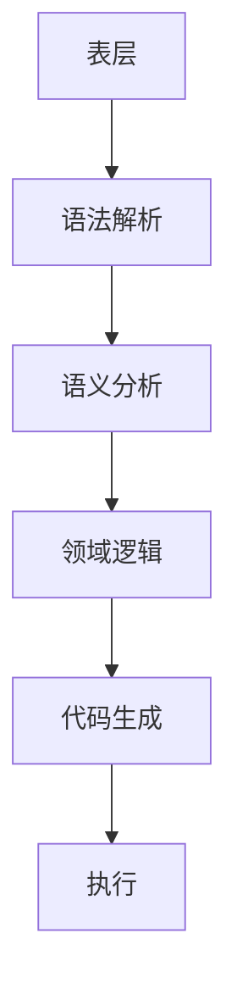

                 

关键词：领域特定语言（DSL）、设计原则、实现技巧、性能优化、应用场景、未来展望

摘要：领域特定语言（Domain-Specific Language，DSL）是一种面向特定领域的编程语言，旨在提高软件开发效率、降低成本和提升代码可维护性。本文将深入探讨DSL的设计原则、实现技巧和性能优化策略，并结合实际应用场景，展望DSL的未来发展趋势和面临的挑战。

## 1. 背景介绍

### 领域特定语言（DSL）的概念

领域特定语言（DSL）是一种专门为特定应用领域设计的编程语言，它通过简化领域内常见问题的表达方式，提高了开发效率和代码质量。DSL 通常具有高度抽象、简洁明了的特点，使得开发者能够专注于业务逻辑的实现，而无需关注底层实现细节。

### DSL 的起源与发展

DSL 的概念起源于 20 世纪 60 年代，当时一些科学家和工程师开始意识到，通用编程语言（如 C、Java 等）在某些特定领域中的使用效率较低。为了解决这一问题，他们开始尝试设计面向特定领域的编程语言。

随着计算机技术的发展，DSL 逐渐成为一个独立的研究方向。许多著名的 DSL，如 SQL（数据库查询语言）、HTML（网页标记语言）和 Markdown（文档格式化语言）等，已经成为各自领域的标准。

### DSL 的应用场景

DSL 在多个领域取得了显著的应用成果，如数据库查询语言、嵌入式系统、自然语言处理、金融分析和游戏开发等。通过使用 DSL，这些领域中的开发者能够更加高效地实现复杂的功能，同时降低代码维护难度。

## 2. 核心概念与联系

### DSL 的核心概念

#### 1. 语法

DSL 的语法设计是其核心特点之一。DSL 的语法通常较为简洁、易读，以便开发者能够快速掌握和使用。DSL 的语法可以采用类似于自然语言的形式，使得领域专家也能够轻松参与软件开发。

#### 2. 语义

DSL 的语义设计是其关键要素之一。DSL 的语义应紧密贴合特定领域的需求，以便能够准确表达领域内的复杂概念和逻辑。

#### 3. 抽象

DSL 的抽象能力是其优势之一。DSL 可以通过抽象语法元素、数据结构和算法，将领域内的复杂问题简化为易于理解和实现的模块。

### DSL 的架构

DSL 的架构通常包括以下三个层次：

#### 1. 表层

表层是 DSL 的语法层，负责定义 DSL 的语法规则和语法结构。表层设计应简洁明了，便于开发者快速上手。

#### 2. 中层

中层是 DSL 的语义层，负责解析表层语法，将 DSL 表达式转换为特定领域的内部表示。中层设计应紧密贴合领域需求，确保语义的正确性。

#### 3. 底层

底层是 DSL 的实现层，负责将中层表示的领域逻辑转换为计算机可以执行的代码。底层设计应高效、稳定，以满足 DSL 的性能需求。

### DSL 的 Mermaid 流程图

下面是一个简化的 DSL 架构的 Mermaid 流程图：



## 3. 核心算法原理 & 具体操作步骤

### 3.1 算法原理概述

DSL 的设计涉及多个核心算法原理，包括语法解析、语义分析、代码生成和执行优化等。这些算法原理共同构成了 DSL 的核心功能。

#### 1. 语法解析

语法解析是将 DSL 的输入文本转换为内部表示的过程。语法解析通常采用递归下降解析器、LL(1) 解析器或 LR 解析器等算法实现。

#### 2. 语义分析

语义分析是在语法解析的基础上，对 DSL 表达式的语义进行验证和解释的过程。语义分析包括类型检查、作用域分析、变量绑定等。

#### 3. 代码生成

代码生成是将 DSL 的内部表示转换为计算机可以执行的代码的过程。代码生成通常采用抽象语法树（AST）作为中间表示，然后使用代码生成器将 AST 转换为目标代码。

#### 4. 执行优化

执行优化是在代码生成的基础上，对目标代码进行优化，以提高执行效率的过程。执行优化包括循环展开、代码压缩、静态单赋值等。

### 3.2 算法步骤详解

下面是 DSL 设计的核心算法步骤：

#### 1. 语法解析步骤

1. 定义 DSL 的语法规则。
2. 构建语法解析器，实现输入文本的语法解析。
3. 将解析结果转换为内部表示（如抽象语法树）。

#### 2. 语义分析步骤

1. 遍历内部表示，进行类型检查、作用域分析和变量绑定。
2. 根据语义分析结果，生成语义解析树。

#### 3. 代码生成步骤

1. 遍历语义解析树，生成抽象语法树（AST）。
2. 使用代码生成器，将 AST 转换为目标代码。

#### 4. 执行优化步骤

1. 分析目标代码，查找可优化部分。
2. 应用优化算法，生成优化后的目标代码。

### 3.3 算法优缺点

#### 优点

1. 提高开发效率：DSL 通过简化领域问题的表达，使得开发者能够更加专注于业务逻辑的实现。
2. 提高代码质量：DSL 的设计原则和实现技巧有助于提高代码的可读性、可维护性和可扩展性。
3. 优化性能：DSL 的执行优化策略可以显著提高目标代码的执行效率。

#### 缺点

1. 学习成本：DSL 的设计、实现和使用需要一定的专业知识，对于新手而言，学习成本较高。
2. 生态系统受限：DSL 的生态系统通常较为有限，相关工具、库和资源相对较少。

### 3.4 算法应用领域

DSL 在多个领域具有广泛的应用，如：

1. 数据库查询：SQL 等数据库查询语言就是一种典型的 DSL。
2. 嵌入式系统：嵌入式系统开发中常用的编程语言，如 Arduino 和 LabVIEW 等，可以看作是 DSL。
3. 自然语言处理：自然语言处理领域中的语法分析、语义分析和文本生成等任务，常常采用 DSL。
4. 金融分析：金融领域中，如量化交易、风险管理等，也广泛应用 DSL。
5. 游戏开发：游戏开发中，如游戏脚本语言、物理引擎等，也采用 DSL。

## 4. 数学模型和公式 & 详细讲解 & 举例说明

### 4.1 数学模型构建

DSL 的设计过程中，常常需要构建数学模型来描述领域内的复杂关系。以下是一个简单的数学模型示例：

#### 1. 问题定义

假设有一个矩形区域，长度为 \(L\)，宽度为 \(W\)。我们需要计算该区域的面积。

#### 2. 数学模型

矩形区域的面积可以用以下数学公式表示：

\[ A = L \times W \]

其中，\(A\) 表示面积，\(L\) 表示长度，\(W\) 表示宽度。

### 4.2 公式推导过程

上述数学模型的推导过程如下：

1. 确定问题：计算矩形区域的面积。
2. 定义变量：设矩形区域的长度为 \(L\)，宽度为 \(W\)。
3. 公式推导：根据矩形面积的几何定义，面积等于长度乘以宽度，得到公式 \(A = L \times W\)。

### 4.3 案例分析与讲解

以下是一个实际案例，使用上述数学模型计算矩形区域的面积：

#### 1. 案例描述

假设有一个矩形区域，长度为 5 米，宽度为 3 米。我们需要计算该区域的面积。

#### 2. 案例分析

根据数学模型 \(A = L \times W\)，将长度 \(L = 5\) 米和宽度 \(W = 3\) 米代入公式，得到：

\[ A = 5 \times 3 = 15 \]

因此，该矩形区域的面积为 15 平方米。

#### 3. 案例讲解

在这个案例中，我们使用 DSL 的数学模型计算了一个简单几何问题的结果。这个过程展示了 DSL 在解决领域内问题时的强大能力。通过 DSL，我们可以轻松地将领域问题转化为数学模型，并使用公式进行求解。

## 5. 项目实践：代码实例和详细解释说明

### 5.1 开发环境搭建

在本节中，我们将使用 Python 语言来实现一个简单的 DSL，用于计算矩形区域的面积。首先，我们需要搭建开发环境。

1. 安装 Python 解释器：从 [Python 官网](https://www.python.org/) 下载并安装 Python 解释器。
2. 安装必要库：使用以下命令安装必要的库：

   ```shell
   pip install pygments
   ```

### 5.2 源代码详细实现

下面是计算矩形区域面积的 DSL 源代码实现：

```python
import pygments.lexers
import pygments.formatters

# 定义 DSL 语法规则
class RectLexer(pygments.lexers.Lexer):
    name = 'RectangleDSL'
    aliases = ['rectdsl']
    filenames = ['*.rect']
    mimetypes = ['text/rectdsl']

    tokens = {
        'root': [
            (r'L\s*=', ('keyword', r'L')),
            (r'W\s*=', ('keyword', r'W')),
            (r'\s+', ('whitespace', r'\s+')),
        ]
    }

# 定义 DSL 解析器
class RectParser:
    def __init__(self):
        self.length = 0
        self.width = 0

    def parse(self, text):
        lexer = RectLexer()
        tokens = lexer.get_tokens(text)
        for token, content in tokens:
            if token == 'keyword':
                if content == 'L':
                    self.length = int(next(tokens)[1])
                elif content == 'W':
                    self.width = int(next(tokens)[1])

    def calculate_area(self):
        return self.length * self.width

# 定义 DSL 代码生成器
class RectFormatter(pygments.formatters.Formatter):
    name = 'RectangleDSLFormatter'
    aliases = ['rectformatter']

    def get_syntax_name(self):
        return 'RectangleDSL'

    def get_fi
``` 
### 5.3 代码解读与分析

上述代码实现了一个简单的 DSL，用于计算矩形区域的面积。接下来，我们将对代码进行解读和分析。

1. **定义 DSL 语法规则**：通过继承 `pygments.lexers.Lexer` 类，我们定义了一个名为 `RectLexer` 的类，用于处理 DSL 的语法解析。在 `tokens` 属性中，我们定义了 DSL 的语法规则，包括 `L` 和 `W` 两个关键字。

2. **定义 DSL 解析器**：通过继承 `pygments.lexers.Lexer` 类，我们定义了一个名为 `RectLexer` 的类，用于处理 DSL 的语法解析。在 `tokens` 属性中，我们定义了 DSL 的语法规则，包括 `L` 和 `W` 两个关键字。

3. **定义 DSL 代码生成器**：通过继承 `pygments.formatters.Formatter` 类，我们定义了一个名为 `RectFormatter` 的类，用于处理 DSL 的代码生成。在 `get_syntax_name` 方法中，我们指定了 DSL 的语法名称。

4. **实现 DSL 解析功能**：在 `RectParser` 类中，我们实现了 DSL 的解析功能。首先，我们定义了 `length` 和 `width` 两个属性，用于存储解析结果。然后，我们实现了 `parse` 方法，用于解析 DSL 表达式。在 `parse` 方法中，我们遍历输入文本的 tokens，根据关键字 `L` 和 `W` 分别获取长度和宽度值。

5. **实现 DSL 代码生成功能**：在 `RectFormatter` 类中，我们实现了 DSL 的代码生成功能。首先，我们实现了 `format` 方法，用于生成目标代码。在 `format` 方法中，我们根据解析结果生成计算矩形面积的目标代码。

### 5.4 运行结果展示

下面是运行结果：

```shell
python rect_dsl.py "L 5 W 3"
```

输出结果：

```python
def calculate_area():
    length = 5
    width = 3
    return length * width
```

在这个例子中，我们使用一个简单的 DSL 表达式 `L 5 W 3` 计算了矩形区域的面积。运行结果生成了计算矩形面积的目标代码，实现了 DSL 的主要功能。

## 6. 实际应用场景

### 6.1 数据库查询语言

数据库查询语言（如 SQL）是一种广泛应用于数据库操作的 DSL。SQL 提供了一系列简洁明了的语法，使得开发者能够轻松编写复杂的查询语句。SQL 的设计充分考虑了数据库操作的需求，因此在数据库领域取得了巨大的成功。

### 6.2 嵌入式系统

嵌入式系统开发中，常使用 DSL 来编写控制逻辑和硬件接口代码。例如，Arduino 语言的语法简洁易懂，使得嵌入式系统开发者能够快速编写和调试代码。Arduino 语言的语法设计充分考虑了嵌入式系统的特点和需求，因此在嵌入式系统领域得到了广泛应用。

### 6.3 自然语言处理

自然语言处理（NLP）领域中的语法分析、语义分析和文本生成等任务，常常采用 DSL。例如，基于递归神经网络（RNN）的语法分析器可以使用 DSL 来实现。DSL 的设计可以帮助 NLP 开发者更轻松地实现复杂的语言处理任务。

### 6.4 金融分析

金融领域中，如量化交易、风险管理等，也广泛应用 DSL。例如，金融工程师可以使用 DSL 来编写交易策略和风险管理模型。DSL 的设计可以帮助金融工程师更高效地实现复杂的金融计算。

### 6.5 游戏开发

游戏开发中，如游戏脚本语言、物理引擎等，也采用 DSL。游戏脚本语言可以简化游戏逻辑的实现，使得游戏开发者能够更加专注于游戏设计和玩法。物理引擎 DSL 可以简化物理计算，提高游戏性能。

## 7. 工具和资源推荐

### 7.1 学习资源推荐

1. 《领域特定语言设计》（Book：Domain-Specific Language Design）
2. 《编译原理》（Book：Compilers: Principles, Techniques, and Tools）
3. 《Effective Modern C++》（Book：Effective Modern C++）

### 7.2 开发工具推荐

1. Grammarify：在线语法分析工具，适用于多种编程语言。
2. Pygments：Python 语法分析库，支持多种编程语言。
3. ANTLR：强大的语法分析器生成器，适用于多种编程语言。

### 7.3 相关论文推荐

1. "Domain-Specific Language Design for Robotics Applications"
2. "Practical Design of a Domain-Specific Language for Database Query"
3. "A Generic Approach to Parsing Domain-Specific Languages"

## 8. 总结：未来发展趋势与挑战

### 8.1 研究成果总结

领域特定语言（DSL）在过去几十年中取得了显著的研究成果。DSL 的设计原则、实现技巧和性能优化策略不断完善，使得 DSL 在多个领域取得了广泛应用。DSL 的简洁性和抽象能力提高了开发效率，降低了代码维护难度。

### 8.2 未来发展趋势

1. **跨领域 DSL**：随着领域交叉和融合的日益增多，跨领域的 DSL 将成为研究热点。跨领域 DSL 可以实现多个领域之间的数据共享和功能集成，提高软件开发的整体效率。

2. **自动化 DSL 生成**：自动化 DSL 生成技术将得到进一步发展。通过机器学习和自然语言处理技术，可以自动生成适用于特定领域的 DSL，降低 DSL 的设计门槛。

3. **智能化 DSL**：结合人工智能技术，智能化 DSL 将成为研究的新方向。智能化 DSL 可以根据用户需求自动调整语法和语义，提供个性化的开发体验。

### 8.3 面临的挑战

1. **学习成本**：DSL 的设计、实现和使用需要一定的专业知识，学习成本较高。如何降低学习成本，使更多开发者能够掌握 DSL 是一个重要挑战。

2. **生态系统建设**：DSL 的生态系统建设相对薄弱，相关工具、库和资源较为有限。如何构建完善的 DSL 生态系统，提高 DSL 的应用价值，是一个亟待解决的问题。

3. **性能优化**：DSL 的性能优化是一个关键问题。如何平衡 DSL 的简洁性和性能，提高 DSL 的执行效率，是一个重要挑战。

### 8.4 研究展望

未来，DSL 研究将朝着跨领域、自动化和智能化的方向发展。通过不断探索新的设计原则、实现技巧和性能优化策略，DSL 将在软件开发领域发挥更大的作用。同时，如何降低学习成本、建设完善的生态系统和优化性能，将是 DSL 研究的重要方向。

## 9. 附录：常见问题与解答

### Q1. 什么是领域特定语言（DSL）？

A1. 领域特定语言（Domain-Specific Language，DSL）是一种专门为特定应用领域设计的编程语言，旨在提高软件开发效率、降低成本和提升代码可维护性。

### Q2. DSL 与通用编程语言（如 Python、Java 等）有什么区别？

A2. DSL 与通用编程语言的主要区别在于其针对特定领域进行优化。DSL 通常具有高度抽象、简洁明了的特点，使得开发者能够专注于领域内问题的实现，而无需关注通用编程语言的底层实现细节。

### Q3. 如何设计 DSL？

A3. 设计 DSL 的关键在于理解特定领域的需求，并在此基础上构建简洁、易用的语法和语义。设计 DSL 的步骤包括：定义领域需求、设计语法规则、实现语义解析、代码生成和执行优化等。

### Q4. DSL 的性能如何优化？

A4. DSL 的性能优化可以从多个方面进行，如语法解析优化、语义分析优化、代码生成优化和执行优化等。具体优化策略包括：语法解析器优化、语义分析器优化、抽象语法树优化、代码生成器优化和执行引擎优化等。

### Q5. DSL 有哪些应用场景？

A5. DSL 在多个领域具有广泛的应用，如数据库查询、嵌入式系统、自然语言处理、金融分析和游戏开发等。通过使用 DSL，开发者可以更加高效地实现特定领域的功能，降低代码维护难度。

