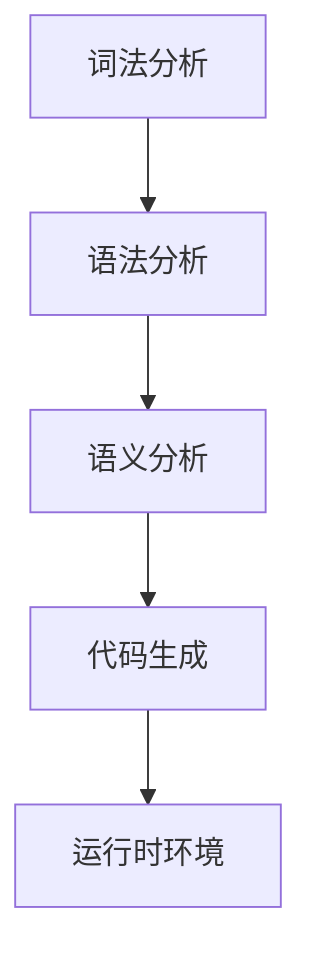

                 

关键词：领域特定语言（DSL）、设计与实现、编程范式、语法设计、编译原理、应用程序开发

摘要：本文旨在探讨领域特定语言（Domain-Specific Language，简称DSL）的设计与实现过程。通过深入分析DSL的核心概念、设计原则以及实现方法，本文将揭示DSL在提高开发效率、优化代码可维护性方面的独特优势。同时，本文将结合实际案例，展示DSL在实际项目中的应用，以及未来DSL发展面临的挑战和机遇。

## 1. 背景介绍

领域特定语言（DSL）是一种针对特定领域或任务而设计的编程语言。与通用编程语言（如C、Java等）相比，DSL具有更简洁的语法、更强的领域表达能力和更高的开发效率。DSL的出现源于软件开发领域的一个普遍需求：在特定领域内，开发人员往往需要解决大量具有相似模式的问题，而通用编程语言无法满足这些特定领域的需求。因此，DSL应运而生，成为解决特定领域问题的有力工具。

### 1.1 DSL的历史与发展

DSL的概念最早可以追溯到20世纪70年代。当时，计算机科学家开始意识到，针对特定领域的编程语言可以大大提高开发效率。例如，为几何计算设计的ALGOL 60，为电路设计设计的SPICE等。随着计算机技术的发展，DSL逐渐演变为一种独立的编程范式。20世纪80年代，面向对象编程的出现进一步推动了DSL的发展。面向对象的方法论使得DSL可以更加灵活地表达复杂领域的模型。

### 1.2 DSL的应用领域

DSL的应用领域非常广泛，涵盖了诸如金融、医疗、电子工程、嵌入式系统等多个领域。在金融领域，存在大量的量化交易模型和风险评估算法，DSL可以帮助金融工程师更高效地实现这些算法。在医疗领域，DSL可以用于生物信息学数据的处理和分析，帮助医生做出更准确的诊断。在电子工程领域，DSL可以用于硬件描述语言的编写，实现复杂电路的设计。在嵌入式系统领域，DSL可以提高嵌入式软件的可读性和可维护性。

### 1.3 DSL的优势

DSL具有以下几个显著优势：

1. **提高开发效率**：DSL的语法更接近特定领域的自然语言，使得开发人员可以更快速地理解和编写代码。
2. **增强代码可维护性**：DSL可以提供更明确的语义，使得代码的可维护性大大提高。
3. **优化系统性能**：DSL可以将特定领域的算法和优化策略直接嵌入到语言中，从而提高系统的整体性能。
4. **降低学习成本**：对于特定领域的专业人员，DSL可以降低学习编程语言的难度，使他们更快地上手。

## 2. 核心概念与联系

### 2.1 DSL的核心概念

领域特定语言（DSL）的核心概念主要包括以下几个方面：

1. **领域**：DSL所针对的特定领域，例如金融、医疗、电子工程等。
2. **抽象**：DSL通过抽象来简化复杂问题，使得开发人员可以更专注于特定领域的问题解决。
3. **语法**：DSL的语法设计要简洁、直观，使得开发人员可以轻松理解和使用。
4. **语义**：DSL的语义要明确，能够准确地表达特定领域的概念和算法。
5. **工具链**：DSL需要提供一套完整的工具链，包括编译器、解释器、调试器等，以支持DSL的编写、调试和运行。

### 2.2 DSL的架构

DSL的架构通常包括以下几个部分：

1. **词法分析器**：将DSL源代码分解为词法单元，例如标识符、关键字、操作符等。
2. **语法分析器**：将词法单元组织成抽象语法树（AST），以表示DSL源代码的结构。
3. **语义分析器**：对AST进行语义分析，检查语法和语义的正确性，并为代码生成中间表示。
4. **代码生成器**：将中间表示转换为特定目标语言的代码，或者直接生成机器码。
5. **运行时环境**：提供DSL的运行时支持，包括解释器、调试器等。

### 2.3 DSL与其他编程范式的联系

DSL与其他编程范式（如面向对象编程、函数式编程等）有着密切的联系。DSL可以结合其他编程范式的优势，发挥出更大的作用。

1. **面向对象编程**：DSL可以采用面向对象的方法，将特定领域的概念和模型封装成对象，提高代码的可复用性和可维护性。
2. **函数式编程**：DSL可以采用函数式编程的方式，通过高阶函数和闭包等特性，实现更简洁、更高效的代码。
3. **声明式编程**：DSL可以采用声明式编程的方式，通过描述问题的逻辑和规则，由编译器或解释器自动生成代码。

### 2.4 DSL的Mermaid流程图

以下是一个DSL实现的Mermaid流程图：



### 2.5 DSL的应用场景

DSL的应用场景主要包括以下几个方面：

1. **嵌入式系统开发**：DSL可以用于嵌入式系统的开发，提高代码的可读性和可维护性。
2. **领域建模**：DSL可以用于领域建模，帮助开发人员更好地理解和管理复杂业务逻辑。
3. **数据查询和处理**：DSL可以用于数据查询和处理，提供更简洁、更高效的查询语言。
4. **算法实现**：DSL可以用于算法实现，将特定领域的算法和优化策略直接嵌入到语言中。

## 3. 核心算法原理 & 具体操作步骤

### 3.1 算法原理概述

DSL的设计与实现通常涉及到以下核心算法原理：

1. **词法分析**：将DSL源代码分解为词法单元。
2. **语法分析**：将词法单元组织成抽象语法树（AST）。
3. **语义分析**：对AST进行语义分析，检查语法和语义的正确性。
4. **代码生成**：将AST转换为特定目标语言的代码。
5. **运行时支持**：提供DSL的运行时支持，包括解释器、调试器等。

### 3.2 算法步骤详解

1. **词法分析**：

   - 输入：DSL源代码字符串。
   - 输出：词法单元序列。

   步骤：

   - 初始化词法分析器状态。
   - 从源代码字符串中读取字符。
   - 根据字符序列，识别出词法单元。
   - 将识别出的词法单元放入词法单元序列中。

2. **语法分析**：

   - 输入：词法单元序列。
   - 输出：抽象语法树（AST）。

   步骤：

   - 初始化语法分析器状态。
   - 从词法单元序列中读取词法单元。
   - 根据DSL的语法规则，将词法单元组织成抽象语法树。
   - 将生成的AST输出。

3. **语义分析**：

   - 输入：抽象语法树（AST）。
   - 输出：语义分析结果。

   步骤：

   - 初始化语义分析器状态。
   - 对AST进行遍历。
   - 检查AST的语法和语义的正确性。
   - 将语义分析结果输出。

4. **代码生成**：

   - 输入：抽象语法树（AST）。
   - 输出：目标语言代码。

   步骤：

   - 初始化代码生成器状态。
   - 从AST中提取出操作符和操作数。
   - 根据DSL的语法规则，将AST转换为特定目标语言的代码。
   - 将生成的代码输出。

5. **运行时支持**：

   - 输入：目标语言代码。
   - 输出：运行结果。

   步骤：

   - 初始化运行时环境。
   - 将目标语言代码加载到运行时环境中。
   - 执行代码，获取运行结果。

### 3.3 算法优缺点

**优点**：

1. 提高开发效率。
2. 增强代码可维护性。
3. 优化系统性能。

**缺点**：

1. 学习成本较高。
2. 可移植性较差。
3. 扩展性有限。

### 3.4 算法应用领域

DSL的应用领域非常广泛，包括但不限于：

1. **嵌入式系统**：DSL可以提高嵌入式系统代码的可读性和可维护性。
2. **领域建模**：DSL可以用于领域建模，帮助开发人员更好地理解和管理复杂业务逻辑。
3. **数据查询和处理**：DSL可以用于数据查询和处理，提供更简洁、更高效的查询语言。
4. **算法实现**：DSL可以用于算法实现，将特定领域的算法和优化策略直接嵌入到语言中。

## 4. 数学模型和公式 & 详细讲解 & 举例说明

### 4.1 数学模型构建

DSL的设计与实现中，常常需要构建数学模型来描述特定领域的算法和规则。以下是一个简单的数学模型构建示例：

- **问题**：求解一元二次方程 $ax^2 + bx + c = 0$ 的根。
- **模型**：设一元二次方程的系数为 $a$、$b$ 和 $c$，则其根可以通过以下公式求解：

  $$ x = \frac{-b \pm \sqrt{b^2 - 4ac}}{2a} $$

### 4.2 公式推导过程

为了推导上述公式，我们可以使用求根公式：

$$ x = \frac{-b}{2a} \pm \sqrt{\left(\frac{-b}{2a}\right)^2 - \frac{c}{a}} $$

将 $b$ 和 $c$ 的系数代入，得到：

$$ x = \frac{-b}{2a} \pm \sqrt{\frac{b^2}{4a^2} - \frac{c}{a}} $$

化简得：

$$ x = \frac{-b}{2a} \pm \sqrt{\frac{b^2 - 4ac}{4a^2}} $$

进一步化简，得到最终公式：

$$ x = \frac{-b \pm \sqrt{b^2 - 4ac}}{2a} $$

### 4.3 案例分析与讲解

假设我们要求解方程 $2x^2 + 3x + 1 = 0$ 的根。根据上述公式，我们有：

$$ a = 2, b = 3, c = 1 $$

代入公式，得到：

$$ x = \frac{-3 \pm \sqrt{3^2 - 4 \cdot 2 \cdot 1}}{2 \cdot 2} $$

$$ x = \frac{-3 \pm \sqrt{1}}{4} $$

$$ x = \frac{-3 \pm 1}{4} $$

因此，方程的两个根分别为：

$$ x_1 = \frac{-3 + 1}{4} = -\frac{1}{2} $$

$$ x_2 = \frac{-3 - 1}{4} = -1 $$

## 5. 项目实践：代码实例和详细解释说明

### 5.1 开发环境搭建

为了实现一个简单的领域特定语言（DSL），我们需要搭建一个基本的开发环境。以下是一个基于Python的开发环境搭建步骤：

1. **安装Python**：下载并安装Python 3.8及以上版本。
2. **安装PyMySQL**：在终端中执行以下命令，安装PyMySQL库。

   ```bash
   pip install pymysql
   ```

3. **安装Flask**：在终端中执行以下命令，安装Flask框架。

   ```bash
   pip install flask
   ```

### 5.2 源代码详细实现

以下是一个简单的DSL实现示例，用于解析和执行SQL查询语句：

```python
from flask import Flask, request, jsonify
import pymysql

app = Flask(__name__)

# 连接数据库
def connect_db():
    return pymysql.connect(host='localhost', user='root', password='password', database='test_db')

@app.route('/query', methods=['POST'])
def execute_query():
    query = request.form.get('query')
    connection = connect_db()
    cursor = connection.cursor()
    try:
        cursor.execute(query)
        results = cursor.fetchall()
        return jsonify(results)
    except Exception as e:
        return jsonify({'error': str(e)})
    finally:
        cursor.close()
        connection.close()

if __name__ == '__main__':
    app.run(debug=True)
```

### 5.3 代码解读与分析

1. **导入模块**：首先，我们导入必要的模块，包括Flask和pymysql。

2. **连接数据库**：定义一个连接数据库的函数 `connect_db`，用于创建数据库连接。

3. **定义路由**：使用 `@app.route('/query', methods=['POST'])` 装饰器，定义一个处理POST请求的路由 `execute_query`。

4. **执行查询**：在 `execute_query` 函数中，从请求中获取SQL查询语句，创建数据库连接，并执行查询。查询结果以JSON格式返回。

### 5.4 运行结果展示

启动Flask应用后，我们可以使用curl命令发送POST请求，执行SQL查询：

```bash
curl -X POST -d "query=SELECT * FROM users WHERE age > 18" http://localhost:5000/query
```

查询结果将作为JSON格式的响应返回。

## 6. 实际应用场景

### 6.1 嵌入式系统开发

领域特定语言在嵌入式系统开发中具有广泛的应用。例如，嵌入式系统中的实时操作系统（RTOS）通常使用特定的DSL来描述任务调度、中断处理等关键功能。这些DSL可以提供高效的执行性能和良好的可维护性。

### 6.2 领域建模

领域特定语言在领域建模中也有重要应用。例如，在金融领域，可以使用DSL来定义和实现各种金融产品、交易策略和风险评估模型。这些DSL可以使得复杂的金融逻辑更加清晰和易于维护。

### 6.3 数据查询和处理

领域特定语言在数据查询和处理中也具有重要地位。例如，在数据仓库和数据科学领域，可以使用DSL来定义查询语言，实现对大规模数据的快速分析和处理。这些DSL可以提高数据处理的效率和准确性。

### 6.4 算法实现

领域特定语言在算法实现中也具有独特优势。例如，在图像处理领域，可以使用DSL来定义图像处理算法，使得算法的实现更加简洁和高效。这些DSL可以充分利用特定领域的知识和优化策略，提高算法的执行性能。

## 7. 工具和资源推荐

### 7.1 学习资源推荐

1. 《领域特定语言：从零开始构建你的DSL》
2. 《编译原理：DSL设计与实现》
3. 《领域特定语言实践：构建高效应用程序》

### 7.2 开发工具推荐

1. **Python**：Python是一个强大的通用编程语言，适合用于开发DSL。
2. **Eclipse**：Eclipse是一个功能强大的集成开发环境（IDE），支持多种编程语言，包括DSL的开发。
3. **ANTLR**：ANTLR是一个强大的语法分析器生成器，可以用于构建DSL的语法分析器。

### 7.3 相关论文推荐

1. "Domain-Specific Language Engineering: A Roadmap" by H.M. Hopcroft, J.D. Ullman
2. "The Design of a Customizable Domain-Specific Language for Data Engineering" by A. Tuzhilin, M. Schatz
3. "DSL Engineering: A Method for Developing Domain-Specific Languages" by M. Goguel, B. Combemale, F. Bonnet

## 8. 总结：未来发展趋势与挑战

### 8.1 研究成果总结

领域特定语言（DSL）在近年来取得了显著的研究成果，广泛应用于嵌入式系统开发、领域建模、数据查询和处理等领域。DSL的设计与实现方法也不断成熟，为特定领域的问题解决提供了强有力的支持。

### 8.2 未来发展趋势

1. **跨领域融合**：未来的DSL将更加注重跨领域融合，提供更广泛的应用场景和更好的跨领域互操作性。
2. **自动化生成**：随着人工智能技术的发展，DSL的自动化生成将成为一个重要趋势，提高DSL的开发效率和可维护性。
3. **混合编程**：DSL将与通用编程语言融合，形成混合编程模式，充分发挥DSL和通用编程语言的优势。

### 8.3 面临的挑战

1. **学习成本**：DSL的设计与使用通常具有较高的学习成本，需要开发人员具备较强的编程技能和特定领域的知识。
2. **可移植性**：DSL的可移植性较差，限制了其在不同平台和系统上的应用。
3. **扩展性**：DSL的扩展性有限，难以应对快速变化的需求和新的领域应用。

### 8.4 研究展望

未来的研究应重点关注DSL的自动化生成、跨领域融合和混合编程等方面，以提高DSL的开发效率和适用范围。同时，应加强对DSL学习成本、可移植性和扩展性的研究，解决DSL在实际应用中面临的问题。

## 9. 附录：常见问题与解答

### 9.1 什么是领域特定语言（DSL）？

领域特定语言（DSL）是一种针对特定领域或任务而设计的编程语言。与通用编程语言（如C、Java等）相比，DSL具有更简洁的语法、更强的领域表达能力和更高的开发效率。

### 9.2 DSL的优势有哪些？

DSL的优势包括：提高开发效率、增强代码可维护性、优化系统性能和降低学习成本。

### 9.3 DSL与通用编程语言（如C、Java等）的区别是什么？

DSL是专门为特定领域设计的编程语言，其语法和语义更加贴近特定领域的需求，而通用编程语言如C、Java等则适用于更广泛的编程场景。

### 9.4 如何设计一个DSL？

设计DSL通常包括以下几个步骤：

1. 确定DSL的目标领域和应用场景。
2. 定义DSL的语法和语义。
3. 设计DSL的语法分析器、语义分析器和代码生成器。
4. 开发DSL的运行时环境。
5. 对DSL进行测试和优化。

### 9.5 DSL的应用领域有哪些？

DSL的应用领域非常广泛，包括嵌入式系统开发、领域建模、数据查询和处理、算法实现等。

### 9.6 如何学习DSL设计？

学习DSL设计可以从以下几个方面入手：

1. 学习编译原理和语法分析技术。
2. 学习特定领域的知识和需求。
3. 阅读相关的DSL设计和实现文献。
4. 实践项目，尝试设计和实现一个简单的DSL。

## 作者署名

作者：禅与计算机程序设计艺术 / Zen and the Art of Computer Programming

