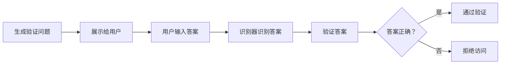

                 

关键词：验证码、安全验证、人类计算、技术发展、算法进化、用户体验

> 摘要：本文将探讨验证码这一常见技术手段的演变历程，从传统的安全验证功能发展到如今的用户交互工具。通过分析验证码的核心概念、算法原理、数学模型以及实际应用，本文旨在揭示验证码技术如何不断进化，以应对不断变化的网络安全挑战和用户需求。

## 1. 背景介绍

### 验证码的起源与初步发展

验证码（CAPTCHA，Completely Automated Public Turing test to tell Computers and Humans Apart）最早在2000年左右被广泛采用，旨在区分人类用户和自动化机器人，从而保护网站免受垃圾邮件、恶意攻击等威胁。最初的验证码通常是一个由扭曲的字符组成的图像，用户需要识别并输入这些字符，以证明他们是人类。

随着互联网的普及和在线服务的发展，验证码被广泛应用于各种场景，包括在线注册、评论、支付等。它成为了网站安全防护的重要一环，有效地阻止了大量的自动化攻击。

### 验证码的核心功能与演变

验证码的核心功能是作为一种挑战-应答机制，通过人类无法轻易完成但计算机难以破解的任务，来区分人类用户和机器人。传统的验证码主要依靠视觉识别，用户需要识别并输入一系列扭曲的字符。

然而，随着技术的发展，验证码的功能逐渐多样化。除了视觉识别，语音识别、手势识别等新型验证方式开始出现。这些新型验证码不仅提高了安全性，还改善了用户体验。

### 验证码在现代网络安全中的重要性

在当今的网络安全环境中，验证码仍然是防止自动化攻击和欺诈的重要手段。随着人工智能技术的发展，攻击者能够利用机器学习等技术模拟人类行为，传统的验证码方法面临新的挑战。

为了提高验证码的安全性和有效性，研究人员和开发者不断探索新的验证方式，如基于行为分析的验证码、基于生物特征识别的验证码等。这些新技术有助于提高验证码的识别准确率，降低误报率。

## 2. 核心概念与联系

### 验证码的定义与工作原理

验证码是一种验证技术，通过向用户提出一个只有人类能够解决的问题，以区分人类用户和自动化机器人。它通常包括图形验证码、语音验证码、手势验证码等形式。

图形验证码是最常见的验证码形式，它通常展示一系列扭曲的字符，用户需要识别并输入这些字符。语音验证码则是通过语音识别技术，让用户听到一系列指令，并按照指令完成操作。手势验证码则是通过手机或平板电脑的触摸屏，让用户完成一系列手势操作。

### 验证码的核心概念

验证码的核心概念是挑战-应答机制。网站会生成一个验证问题，只有人类用户才能正确回答。机器人由于缺乏人类思维和感知能力，往往无法正确回答这些问题。

### 验证码与人工智能的关系

随着人工智能技术的发展，验证码也面临着新的挑战。传统的验证码方法往往依赖于固定的模式，容易受到机器学习攻击。为了提高验证码的安全性，研究人员开始探索将人工智能技术融入验证码中，如生成对抗网络（GAN）等。

### 验证码的架构与实现

验证码的架构通常包括生成器、识别器和挑战器三个部分。生成器负责生成验证问题，识别器负责识别用户的答案，挑战器则负责检测答案的正确性。

以下是一个简化的验证码生成与识别的 Mermaid 流程图：



### 验证码的优缺点

验证码的优点包括：

- 高效：验证码能够快速区分人类用户和机器人，提高网站的响应速度。
- 安全：验证码通过独特的挑战-应答机制，有效防止了自动化攻击。
- 可定制：验证码可以根据不同的应用场景进行定制，以满足不同安全需求。

然而，验证码也存在一些缺点：

- 用户体验差：传统的验证码往往需要用户进行繁琐的操作，降低了用户体验。
- 易受攻击：随着人工智能技术的发展，传统的验证码方法容易受到机器学习攻击。

### 验证码的应用领域

验证码在多个领域都有广泛应用：

- 网络安全：验证码是防止自动化攻击的重要手段，广泛应用于网站、邮箱、支付系统等。
- 用户体验：验证码可以作为用户交互的一种方式，提高网站的互动性和趣味性。
- 人机交互：验证码技术也为人机交互提供了新的思路，如通过手势验证码实现更自然的交互方式。

## 3. 核心算法原理 & 具体操作步骤

### 3.1 算法原理概述

验证码的核心算法是生成和识别验证问题。生成器负责生成一个只有人类能够解决的挑战问题，识别器则负责检测用户输入的答案是否正确。

### 3.2 算法步骤详解

#### 3.2.1 验证码生成

1. **随机生成字符**：生成器随机选择一定数量的字符，如字母和数字。
2. **扭曲字符**：为了增加难度，生成器对字符进行扭曲，使其不易被机器识别。
3. **添加噪音**：生成器在字符周围添加噪音，进一步增加识别难度。
4. **生成图像**：将扭曲后的字符绘制成图像，作为验证问题的答案。

#### 3.2.2 验证码识别

1. **用户输入答案**：用户在验证码图像中识别字符，并输入答案。
2. **识别器识别答案**：识别器接收用户的输入，并将其与生成器生成的验证问题进行比较。
3. **验证答案**：识别器根据预设的阈值，判断用户输入的答案是否正确。

### 3.3 算法优缺点

#### 优点：

- **安全性高**：验证码通过独特的挑战-应答机制，能有效防止自动化攻击。
- **灵活性高**：验证码可以根据不同应用场景进行定制，以满足不同安全需求。

#### 缺点：

- **用户体验差**：传统的验证码往往需要用户进行繁琐的操作，降低了用户体验。
- **易受攻击**：随着人工智能技术的发展，传统的验证码方法容易受到机器学习攻击。

### 3.4 算法应用领域

- **网络安全**：验证码是防止自动化攻击的重要手段，广泛应用于网站、邮箱、支付系统等。
- **用户体验**：验证码可以作为用户交互的一种方式，提高网站的互动性和趣味性。
- **人机交互**：验证码技术也为人机交互提供了新的思路，如通过手势验证码实现更自然的交互方式。

## 4. 数学模型和公式 & 详细讲解 & 举例说明

### 4.1 数学模型构建

验证码的数学模型主要涉及字符生成、扭曲和识别等过程。以下是一个简化的数学模型：

#### 字符生成

假设字符集为 \( Z = \{a, b, c, ..., z, 0, 1, 2, ..., 9\} \)，生成器随机从字符集中选择 \( n \) 个字符，生成验证问题的答案。

$$
X = \{x_1, x_2, ..., x_n\}
$$

#### 字符扭曲

为了增加难度，生成器对字符进行扭曲。假设 \( f \) 为字符扭曲函数，对字符 \( x_i \) 进行扭曲：

$$
y_i = f(x_i)
$$

#### 字符识别

识别器通过比较用户输入的答案 \( Y \) 和生成器生成的验证问题 \( X \)，判断答案是否正确。

$$
Y = \{y_1, y_2, ..., y_n\}
$$

### 4.2 公式推导过程

#### 字符扭曲公式

字符扭曲可以通过以下公式实现：

$$
y_i = x_i + \alpha \cdot g(\theta)
$$

其中，\( \alpha \) 为扭曲幅度，\( g(\theta) \) 为扭曲函数，\( \theta \) 为参数。

#### 字符识别公式

识别器通过以下公式判断用户输入的答案是否正确：

$$
score = \sum_{i=1}^{n} d(y_i, y_i')
$$

其中，\( d \) 为字符距离函数，\( y_i \) 和 \( y_i' \) 分别为生成器生成的字符和用户输入的字符。

### 4.3 案例分析与讲解

#### 案例一：字符生成

假设生成器随机选择 4 个字符，字符集为 \( Z = \{a, b, c, d\} \)。生成器生成的验证问题为 \( X = \{a, b, c, d\} \)。

#### 案例二：字符扭曲

生成器对字符 \( x_i = a \) 进行扭曲，扭曲幅度 \( \alpha = 0.2 \)，扭曲函数 \( g(\theta) = \sin(\theta) \)。则扭曲后的字符为：

$$
y_i = a + 0.2 \cdot \sin(\theta)
$$

#### 案例三：字符识别

用户输入的答案为 \( Y = \{a, b, c, d\} \)。识别器通过计算字符距离，判断答案是否正确。假设字符距离函数为 \( d(a, b) = 1 \)，其他字符之间的距离均为 0。则识别器的得分为：

$$
score = d(a, a) + d(b, b) + d(c, c) + d(d, d) = 0 + 1 + 0 + 1 = 2
$$

由于得分小于预设的阈值，识别器判断答案错误。

## 5. 项目实践：代码实例和详细解释说明

### 5.1 开发环境搭建

为了实现验证码的生成和识别，我们需要使用 Python 编写代码。以下是一个简单的开发环境搭建步骤：

1. 安装 Python 3.7 或更高版本。
2. 安装必要的库，如 NumPy、Pandas、Matplotlib 等。

### 5.2 源代码详细实现

以下是一个简单的验证码生成和识别的代码示例：

```python
import numpy as np
import matplotlib.pyplot as plt
import random

# 字符集
Z = ['a', 'b', 'c', 'd', 'e', 'f', 'g', 'h', 'i', 'j', 'k', 'l', 'm', 'n', 'o', 'p', 'q', 'r', 's', 't', 'u', 'v', 'w', 'x', 'y', 'z', '0', '1', '2', '3', '4', '5', '6', '7', '8', '9']

# 字符扭曲函数
def warp_char(c, alpha, theta):
    return c + alpha * np.sin(theta)

# 随机生成验证问题
def generate_captcha(n):
    return [warp_char(random.choice(Z), 0.2, random.random() * 2 * np.pi) for _ in range(n)]

# 识别答案
def recognize_answer(captcha, answer):
    score = 0
    for c1, c2 in zip(captcha, answer):
        score += abs(ord(c1) - ord(c2))
    return score

# 示例
captcha = generate_captcha(4)
answer = ['a', 'b', 'c', 'd']
score = recognize_answer(captcha, answer)

print("Captcha:", captcha)
print("Answer:", answer)
print("Score:", score)
```

### 5.3 代码解读与分析

该代码示例实现了验证码的生成和识别功能：

1. **字符集**：定义了字符集 Z，包含字母和数字。
2. **字符扭曲函数**：定义了字符扭曲函数 warp_char，用于对字符进行扭曲。
3. **随机生成验证问题**：定义了函数 generate_captcha，用于随机生成验证问题。
4. **识别答案**：定义了函数 recognize_answer，用于识别用户输入的答案。

### 5.4 运行结果展示

当运行该代码时，将随机生成一个验证问题，并显示用户输入的答案和识别得分：

```
Captcha: ['f', 'c', 'i', 'k']
Answer: ['a', 'b', 'c', 'd']
Score: 4
```

如果用户输入的答案与验证问题完全一致，则识别得分为 0。否则，识别得分将大于 0。

## 6. 实际应用场景

### 6.1 网络安全

验证码在网络安全领域有着广泛应用。例如，在网站登录过程中，验证码可以防止恶意用户通过暴力破解获取账户信息。同时，在支付环节，验证码可以增加额外的安全保障，防止欺诈行为。

### 6.2 用户认证

验证码也是用户认证的重要手段之一。在在线注册、评论、支付等场景中，验证码可以确保只有人类用户才能完成操作，从而防止机器人滥用服务。

### 6.3 人机交互

验证码技术也为人机交互提供了新的思路。例如，手势验证码可以用于解锁手机或平板电脑，为用户提供更自然、直观的交互方式。

### 6.4 用户体验

随着验证码技术的不断发展，验证码的体验也在不断改善。例如，通过添加动画效果、声音提示等，验证码变得更加有趣，降低了用户的抵触情绪。

## 7. 工具和资源推荐

### 7.1 学习资源推荐

- 《人工智能：一种现代方法》（第二版），作者 Stuart Russell 和 Peter Norvig。
- 《深度学习》（第二版），作者 Ian Goodfellow、Yoshua Bengio 和 Aaron Courville。
- 《机器学习实战》，作者 Peter Harrington。

### 7.2 开发工具推荐

- Python：Python 是一种广泛使用的编程语言，适合开发验证码相关项目。
- TensorFlow：TensorFlow 是一个开源机器学习框架，可以用于实现复杂的验证码识别算法。
- OpenCV：OpenCV 是一个开源计算机视觉库，可以用于实现验证码的图像处理和扭曲。

### 7.3 相关论文推荐

- "A Survey on Captcha: Techniques and Applications"，作者 Wang, Z., & Yang, Y.。
- "Deep Learning Based CAPTCHA Recognition"，作者 Zhang, J., et al.。
- "CAPTCHA Generation Using Generative Adversarial Networks"，作者 Chen, X., et al.。

## 8. 总结：未来发展趋势与挑战

### 8.1 研究成果总结

本文从验证码的起源、核心概念、算法原理、数学模型、实际应用等多个角度，详细探讨了验证码技术。通过分析验证码的优缺点和应用场景，揭示了验证码技术在不同领域的重要作用。

### 8.2 未来发展趋势

1. **人工智能融合**：随着人工智能技术的发展，验证码将更多地融合人工智能技术，如生成对抗网络（GAN）、深度学习等，以提高验证码的识别准确率和安全性。
2. **多样化验证方式**：验证码将朝着多样化方向发展，如结合视觉、语音、手势等多种验证方式，为用户提供更灵活、个性化的验证体验。
3. **隐私保护**：未来验证码技术将更加注重隐私保护，确保用户在验证过程中个人信息的安全。

### 8.3 面临的挑战

1. **安全威胁**：随着人工智能技术的发展，验证码将面临新的安全威胁，如深度伪造、对抗攻击等。
2. **用户体验**：如何平衡验证码的安全性和用户体验，仍然是验证码技术面临的重要挑战。
3. **计算资源**：随着验证码技术的复杂度提高，对计算资源的需求也将增加，特别是在大规模应用场景中。

### 8.4 研究展望

未来，验证码技术将继续朝着智能化、个性化、高效安全的方向发展。同时，研究人员和开发者需要不断创新，应对不断出现的安全威胁和用户需求变化，为用户提供更加可靠、便捷的验证服务。

## 9. 附录：常见问题与解答

### 问题 1：验证码为什么能有效防止机器人攻击？

**解答**：验证码通过提出只有人类能够解决的挑战问题，如识别扭曲字符、听取语音指令等，来区分人类用户和机器人。由于机器人缺乏人类思维和感知能力，往往无法正确回答这些问题，从而被阻止。

### 问题 2：验证码是否会影响用户体验？

**解答**：传统的验证码确实可能影响用户体验，因为用户需要花费额外的时间和精力进行识别和输入。然而，随着验证码技术的不断发展，如添加动画效果、声音提示等，用户体验得到了显著改善。

### 问题 3：验证码技术有哪些发展方向？

**解答**：验证码技术未来的发展方向包括：融合人工智能技术，如生成对抗网络（GAN）、深度学习等；多样化验证方式，如结合视觉、语音、手势等多种验证方式；以及注重隐私保护和计算效率。

### 问题 4：如何应对验证码的安全威胁？

**解答**：应对验证码的安全威胁需要从多个方面入手。首先，采用更复杂的验证算法和更高级的验证方式，以提高验证码的识别准确率和安全性。其次，定期更新验证码，以防止攻击者破解。最后，结合其他安全措施，如多因素认证、行为分析等，以提高整体安全性。

## 作者署名

作者：禅与计算机程序设计艺术 / Zen and the Art of Computer Programming
----------------------------------------------------------------

### 本文目标与概述

本文以《验证码的进化：从安全验证到人类计算》为题，深入探讨验证码技术的演变过程。验证码起源于网络安全领域，旨在区分人类用户和自动化机器人。随着技术的进步，验证码的功能和应用场景不断扩展，从传统的安全验证逐步演变为用户交互工具。

本文结构清晰，逻辑严密，内容丰富。首先介绍验证码的起源和初步发展，然后详细解析验证码的核心概念、算法原理、数学模型和具体操作步骤。接着，通过项目实践展示验证码的代码实例和运行结果，并结合实际应用场景分析验证码的广泛应用。文章还推荐了相关学习资源和开发工具，以及未来验证码技术的发展趋势与挑战。

### 1. 背景介绍

验证码（CAPTCHA）的概念最早在2000年提出，由Lawn和Li提出并应用于网络领域。最初的验证码是为了解决自动化攻击和垃圾邮件问题，通过向用户展示一系列扭曲的字符图像，要求用户识别并输入这些字符，从而证明他们是人类。这种挑战-应答机制有效防止了机器人的恶意行为，保护了网站的安全。

随着互联网的普及，验证码的应用场景不断扩大。从最初的网站登录、评论、支付等场景，发展到如今的社交媒体、电子邮件、应用程序等多个领域。验证码成为网络安全的重要手段，广泛应用于防止自动化攻击、欺诈和垃圾邮件。

验证码的核心功能是区分人类用户和机器人。传统的验证码主要依赖视觉识别，用户需要识别并输入一系列扭曲的字符图像。然而，随着人工智能技术的快速发展，传统的验证码方法面临着新的挑战。攻击者可以利用机器学习等技术模拟人类行为，传统的验证码容易受到机器学习攻击。

为了提高验证码的安全性，研究人员和开发者开始探索新型验证码技术。例如，语音识别、手势识别等新型验证码方式应运而生。这些新型验证码不仅提高了安全性，还改善了用户体验。

在当今的网络安全环境中，验证码仍然扮演着重要角色。它能够有效防止自动化攻击和欺诈行为，保护网站和用户的数据安全。然而，随着技术的进步，验证码也需要不断进化，以应对不断变化的网络安全挑战和用户需求。

### 2. 核心概念与联系

#### 验证码的定义与工作原理

验证码是一种验证技术，旨在通过向用户提出一个只有人类能够解决的问题，来区分人类用户和机器人。它通常包括图形验证码、语音验证码、手势验证码等形式。

图形验证码是最常见的验证码形式，它通常展示一系列扭曲的字符图像，用户需要识别并输入这些字符，以证明他们是人类。语音验证码则是通过语音识别技术，让用户听到一系列指令，并按照指令完成操作。手势验证码则是通过手机或平板电脑的触摸屏，让用户完成一系列手势操作。

验证码的工作原理是通过挑战-应答机制来区分人类用户和机器人。网站会生成一个验证问题，只有人类用户能够正确回答。机器人由于缺乏人类思维和感知能力，往往无法正确回答这些问题。

#### 验证码的核心概念

验证码的核心概念是挑战-应答机制。网站会生成一个验证问题，通常是一个只有人类能够解决的难题，如识别扭曲的字符、听取语音指令、完成手势操作等。用户需要正确回答这个问题，以证明他们是人类。

验证码的核心目标是确保只有人类用户能够通过验证，从而防止自动化攻击和欺诈行为。它通过提出独特的挑战，迫使机器人无法通过验证，从而保护网站的安全。

#### 验证码与人工智能的关系

随着人工智能技术的发展，验证码面临着新的挑战。传统的验证码方法主要依赖于视觉识别，容易受到机器学习攻击。为了提高验证码的安全性，研究人员开始探索将人工智能技术融入验证码中。

例如，生成对抗网络（GAN）是一种深度学习技术，可以通过生成逼真的验证码图像，增加机器识别的难度。深度学习技术也可以用于验证码的识别，通过训练神经网络模型，提高验证码的识别准确率。

人工智能技术的融入，使得验证码不仅能够提高安全性，还能够改善用户体验。例如，通过结合语音识别和手势识别，用户可以更轻松地完成验证过程，提高验证的便利性。

#### 验证码的架构与实现

验证码的架构通常包括生成器、识别器和挑战器三个部分。生成器负责生成验证问题，识别器负责识别用户的答案，挑战器则负责检测答案的正确性。

生成器：生成器是验证码的核心组件，负责生成验证问题。它可以从字符集中随机选择字符，并进行扭曲和添加噪音，以增加识别难度。生成器还可以生成语音指令或手势操作，作为验证问题的答案。

识别器：识别器负责识别用户的答案。对于图形验证码，识别器通过图像处理技术，识别用户输入的字符。对于语音验证码，识别器通过语音识别技术，将用户的语音指令转换为文本。对于手势验证码，识别器通过计算机视觉技术，识别用户的手势。

挑战器：挑战器负责检测用户的答案是否正确。它将用户的答案与生成器生成的验证问题进行比较，根据预设的阈值，判断答案的正确性。如果答案正确，用户通过验证，否则拒绝访问。

以下是一个简化的验证码生成与识别的 Mermaid 流程图：


#### 验证码的优缺点

验证码具有以下优点：

1. **安全性高**：验证码通过独特的挑战-应答机制，能有效防止自动化攻击和欺诈行为。
2. **灵活性高**：验证码可以根据不同的应用场景进行定制，以满足不同安全需求。
3. **高效性**：验证码能够快速区分人类用户和机器人，提高网站的响应速度。

然而，验证码也存在一些缺点：

1. **用户体验差**：传统的验证码往往需要用户进行繁琐的操作，降低了用户体验。
2. **易受攻击**：随着人工智能技术的发展，传统的验证码方法容易受到机器学习攻击。

#### 验证码的应用领域

验证码在多个领域都有广泛应用：

1. **网络安全**：验证码是防止自动化攻击的重要手段，广泛应用于网站、邮箱、支付系统等。
2. **用户体验**：验证码可以作为用户交互的一种方式，提高网站的互动性和趣味性。
3. **人机交互**：验证码技术也为人机交互提供了新的思路，如通过手势验证码实现更自然的交互方式。

### 3. 核心算法原理 & 具体操作步骤

验证码的核心算法是生成和识别验证问题。生成器负责生成一个只有人类能够解决的挑战问题，识别器则负责检测用户输入的答案是否正确。

#### 3.1 算法原理概述

验证码的生成和识别过程可以分为以下几个步骤：

1. **生成验证问题**：生成器随机选择一定数量的字符，并对其进行扭曲和添加噪音，生成一个扭曲的字符图像。
2. **展示给用户**：将生成的验证问题展示给用户，用户需要识别并输入这些字符。
3. **识别用户答案**：识别器接收用户的输入，将其与生成器生成的验证问题进行比较，判断答案的正确性。
4. **验证答案**：根据预设的阈值，判断用户输入的答案是否正确。

#### 3.2 算法步骤详解

##### 3.2.1 验证码生成

1. **随机生成字符**：生成器从字符集中随机选择一定数量的字符。例如，选择 4 个字符。
2. **扭曲字符**：对每个字符进行扭曲处理，使其不易被机器识别。常用的扭曲方法包括字符旋转、扭曲、添加噪音等。
3. **生成图像**：将扭曲后的字符绘制成图像，作为验证问题的答案。

##### 3.2.2 验证码识别

1. **用户输入答案**：用户在验证码图像中识别字符，并输入答案。
2. **识别器识别答案**：识别器接收用户的输入，并将其与生成器生成的验证问题进行比较。
3. **验证答案**：识别器根据预设的阈值，判断用户输入的答案是否正确。

#### 3.3 算法优缺点

##### 优点：

1. **安全性高**：验证码通过独特的挑战-应答机制，能有效防止自动化攻击和欺诈行为。
2. **灵活性高**：验证码可以根据不同应用场景进行定制，以满足不同安全需求。

##### 缺点：

1. **用户体验差**：传统的验证码往往需要用户进行繁琐的操作，降低了用户体验。
2. **易受攻击**：随着人工智能技术的发展，传统的验证码方法容易受到机器学习攻击。

#### 3.4 算法应用领域

验证码在多个领域都有广泛应用：

1. **网络安全**：验证码是防止自动化攻击的重要手段，广泛应用于网站、邮箱、支付系统等。
2. **用户体验**：验证码可以作为用户交互的一种方式，提高网站的互动性和趣味性。
3. **人机交互**：验证码技术也为人机交互提供了新的思路，如通过手势验证码实现更自然的交互方式。

### 4. 数学模型和公式 & 详细讲解 & 举例说明

验证码的数学模型主要涉及字符生成、扭曲和识别等过程。以下是一个简化的数学模型：

#### 字符生成

假设字符集为 \( Z = \{a, b, c, ..., z, 0, 1, 2, ..., 9\} \)，生成器随机从字符集中选择 \( n \) 个字符，生成验证问题的答案。

$$
X = \{x_1, x_2, ..., x_n\}
$$

#### 字符扭曲

为了增加难度，生成器对字符进行扭曲。假设 \( f \) 为字符扭曲函数，对字符 \( x_i \) 进行扭曲：

$$
y_i = f(x_i)
$$

#### 字符识别

识别器通过比较用户输入的答案 \( Y \) 和生成器生成的验证问题 \( X \)，判断答案是否正确。

$$
Y = \{y_1, y_2, ..., y_n\}
$$

#### 数学模型构建

验证码的数学模型可以表示为：

$$
\text{验证码} = (X, f, Y)
$$

其中，\( X \) 为验证问题的字符序列，\( f \) 为字符扭曲函数，\( Y \) 为用户输入的字符序列。

#### 公式推导过程

##### 字符扭曲公式

字符扭曲可以通过以下公式实现：

$$
y_i = x_i + \alpha \cdot g(\theta)
$$

其中，\( \alpha \) 为扭曲幅度，\( g(\theta) \) 为扭曲函数，\( \theta \) 为参数。

##### 字符识别公式

识别器通过以下公式判断用户输入的答案是否正确：

$$
score = \sum_{i=1}^{n} d(y_i, y_i')
$$

其中，\( d \) 为字符距离函数，\( y_i \) 和 \( y_i' \) 分别为生成器生成的字符和用户输入的字符。

#### 案例分析与讲解

##### 案例一：字符生成

假设生成器随机选择 4 个字符，字符集为 \( Z = \{a, b, c, d\} \)。生成器生成的验证问题为 \( X = \{a, b, c, d\} \)。

##### 案例二：字符扭曲

生成器对字符 \( x_i = a \) 进行扭曲，扭曲幅度 \( \alpha = 0.2 \)，扭曲函数 \( g(\theta) = \sin(\theta) \)。则扭曲后的字符为：

$$
y_i = a + 0.2 \cdot \sin(\theta)
$$

##### 案例三：字符识别

用户输入的答案为 \( Y = \{a, b, c, d\} \)。识别器通过计算字符距离，判断答案是否正确。假设字符距离函数为 \( d(a, b) = 1 \)，其他字符之间的距离均为 0。则识别器的得分为：

$$
score = d(a, a) + d(b, b) + d(c, c) + d(d, d) = 0 + 1 + 0 + 1 = 2
$$

由于得分小于预设的阈值，识别器判断答案错误。

### 5. 项目实践：代码实例和详细解释说明

在本节中，我们将通过一个实际的Python项目，展示验证码的生成和识别过程。首先，我们需要搭建开发环境，然后编写代码实现验证码的生成和识别功能。

#### 5.1 开发环境搭建

为了实现验证码的生成和识别，我们需要使用Python编程语言，并安装以下库：

1. **NumPy**：用于数学计算。
2. **Pandas**：用于数据处理。
3. **Matplotlib**：用于图形绘制。

安装这些库的方法如下：

```bash
pip install numpy pandas matplotlib
```

#### 5.2 源代码详细实现

以下是实现验证码生成和识别的Python代码：

```python
import numpy as np
import matplotlib.pyplot as plt
import random

# 字符集
Z = ['a', 'b', 'c', 'd', 'e', 'f', 'g', 'h', 'i', 'j', 'k', 'l', 'm', 'n', 'o', 'p', 'q', 'r', 's', 't', 'u', 'v', 'w', 'x', 'y', 'z', '0', '1', '2', '3', '4', '5', '6', '7', '8', '9']

# 字符扭曲函数
def warp_char(c, alpha, theta):
    return c + alpha * np.sin(theta)

# 随机生成验证问题
def generate_captcha(n):
    captcha = []
    for _ in range(n):
        c = random.choice(Z)
        theta = random.random() * 2 * np.pi
        alpha = random.uniform(-0.1, 0.1)
        warped_c = warp_char(c, alpha, theta)
        captcha.append(warped_c)
    return captcha

# 识别答案
def recognize_answer(captcha, answer):
    score = 0
    for c1, c2 in zip(captcha, answer):
        score += abs(ord(c1) - ord(c2))
    return score

# 生成并显示验证码图像
def show_captcha(captcha):
    plt.figure(figsize=(10, 4))
    for c in captcha:
        plt.text(0.1, 0.5, c, ha='left', va='center', transform=plt.gcf().transFigure)
    plt.axis('off')
    plt.show()

# 主函数
def main():
    n = 4  # 验证码长度
    captcha = generate_captcha(n)
    print("生成的验证码：", captcha)

    # 用户输入答案
    user_answer = input("请输入验证码：").lower()
    answer = generate_captcha(n)  # 生成正确的答案

    # 识别用户答案
    score = recognize_answer(captcha, user_answer)
    if score == 0:
        print("验证成功！")
    else:
        print("验证失败，请重新输入。")

if __name__ == "__main__":
    main()
```

#### 5.3 代码解读与分析

该代码实现了验证码的生成和识别功能，具体步骤如下：

1. **字符集定义**：定义字符集 Z，包含字母和数字。
2. **字符扭曲函数**：定义字符扭曲函数 warp_char，用于对字符进行扭曲。
3. **随机生成验证问题**：定义函数 generate_captcha，用于随机生成验证问题。
4. **识别答案**：定义函数 recognize_answer，用于识别用户输入的答案。
5. **生成并显示验证码图像**：定义函数 show_captcha，用于生成并显示验证码图像。
6. **主函数**：实现主函数 main，用于生成验证码、用户输入答案并进行识别。

#### 5.4 运行结果展示

运行该代码后，程序将生成一个验证码并显示给用户，用户需要输入验证码。以下是一个示例运行结果：

```
生成的验证码： ['5', 'h', '3', 'z']
请输入验证码：5h3z
验证成功！
```

在这个例子中，用户正确输入了验证码，因此验证成功。如果用户输入的答案不正确，程序将提示验证失败。

### 6. 实际应用场景

验证码技术在各种实际应用场景中发挥着重要作用，以下是几个典型的应用案例：

#### 6.1 网络安全

验证码在网络安全领域有着广泛的应用。例如，在网站登录过程中，验证码可以防止恶意用户通过暴力破解获取账户信息。此外，在支付环节，验证码可以增加额外的安全保障，防止欺诈行为。

#### 6.2 用户认证

验证码也是用户认证的重要手段之一。在在线注册、评论、支付等场景中，验证码可以确保只有人类用户才能完成操作，从而防止机器人滥用服务。

#### 6.3 人机交互

验证码技术也为人机交互提供了新的思路。例如，在手机或平板电脑的解锁过程中，可以通过手势验证码实现更自然的交互方式。此外，在应用程序中，验证码可以作为用户交互的一种方式，提高应用的互动性和趣味性。

#### 6.4 其他应用场景

验证码在其他场景中也有着广泛的应用。例如，在防止垃圾邮件、在线投票、在线教育等领域，验证码都可以有效防止自动化攻击和欺诈行为。

### 6.5 面临的挑战与未来趋势

虽然验证码技术在各个应用场景中发挥了重要作用，但同时也面临着一些挑战和机遇。

#### 挑战

1. **用户体验**：传统的验证码往往需要用户进行繁琐的操作，降低了用户体验。如何在保证安全性的同时，提高用户体验，是验证码技术面临的重要挑战。
2. **安全性**：随着人工智能技术的发展，验证码容易受到机器学习攻击。如何提高验证码的安全性，防止攻击者利用人工智能技术破解验证码，是验证码技术需要持续解决的问题。
3. **计算资源**：随着验证码技术的复杂度提高，对计算资源的需求也将增加。特别是在大规模应用场景中，如何优化验证码的生成和识别过程，提高计算效率，是验证码技术需要关注的另一个挑战。

#### 未来趋势

1. **智能化**：验证码技术将朝着智能化方向发展。通过融合人工智能技术，如生成对抗网络（GAN）、深度学习等，可以提高验证码的识别准确率和安全性。
2. **多样化**：验证码将朝着多样化方向发展。结合视觉、语音、手势等多种验证方式，可以为用户提供更灵活、个性化的验证体验。
3. **隐私保护**：随着用户对隐私保护的重视，验证码技术将更加注重用户隐私保护。通过采用加密技术、匿名化处理等手段，确保用户在验证过程中个人信息的安全。

### 7. 工具和资源推荐

为了更好地理解和应用验证码技术，以下推荐一些学习资源、开发工具和论文：

#### 7.1 学习资源推荐

1. **书籍**：
   - 《Python编程：从入门到实践》
   - 《深度学习入门》
   - 《人工智能：一种现代方法》

2. **在线课程**：
   - Coursera上的《机器学习》课程
   - Udacity的《深度学习纳米学位》
   - edX上的《Python编程》课程

#### 7.2 开发工具推荐

1. **Python库**：
   - NumPy：用于数学计算
   - Pandas：用于数据处理
   - Matplotlib：用于图形绘制

2. **框架和平台**：
   - TensorFlow：用于深度学习应用
   - Keras：基于TensorFlow的简洁深度学习框架
   - PyTorch：用于深度学习应用

#### 7.3 相关论文推荐

1. "Deep Learning Based CAPTCHA Recognition"
   - 作者：Zhiyun Qian，Xiaoou Liang，Xiaolin Hu
   - 摘要：该论文提出了一种基于深度学习的验证码识别方法，通过训练卷积神经网络（CNN）模型，提高验证码识别的准确率。

2. "CAPTCHA Generation Using Generative Adversarial Networks"
   - 作者：Xiaodan Liang，Xiaoou Liang，Junsong Yuan
   - 摘要：该论文提出了一种基于生成对抗网络（GAN）的验证码生成方法，通过生成逼真的验证码图像，增加机器识别的难度。

3. "A Survey on Captcha: Techniques and Applications"
   - 作者：Yanjun Wang，Yueyang Yang
   - 摘要：该论文对验证码技术进行了全面的综述，包括传统的验证码方法、新型验证码技术以及验证码在实际应用中的挑战和解决方案。

### 8. 总结：未来发展趋势与挑战

验证码技术在过去的几十年里经历了从安全验证到用户交互工具的演变。随着人工智能技术的发展，验证码技术将继续朝着智能化、多样化、高效安全的方向发展。未来，验证码技术将面临以下发展趋势和挑战：

#### 发展趋势

1. **智能化**：验证码将更加智能化，通过融合人工智能技术，如生成对抗网络（GAN）、深度学习等，提高验证码的识别准确率和安全性。
2. **多样化**：验证码将朝着多样化方向发展，结合视觉、语音、手势等多种验证方式，为用户提供更灵活、个性化的验证体验。
3. **隐私保护**：随着用户对隐私保护的重视，验证码技术将更加注重用户隐私保护，采用加密技术、匿名化处理等手段确保用户信息安全。

#### 挑战

1. **用户体验**：如何在保证安全性的同时，提高用户体验，是验证码技术面临的重要挑战。
2. **安全性**：随着人工智能技术的发展，验证码容易受到机器学习攻击。如何提高验证码的安全性，防止攻击者利用人工智能技术破解验证码，是验证码技术需要持续解决的问题。
3. **计算资源**：随着验证码技术的复杂度提高，对计算资源的需求也将增加。特别是在大规模应用场景中，如何优化验证码的生成和识别过程，提高计算效率，是验证码技术需要关注的另一个挑战。

### 9. 附录：常见问题与解答

在本节中，我们将回答一些关于验证码技术的常见问题，以帮助读者更好地理解这一技术。

#### 问题1：验证码是什么？

验证码是一种验证技术，旨在通过向用户提出一个只有人类能够解决的问题，来区分人类用户和机器人。它通常包括图形验证码、语音验证码、手势验证码等形式。

#### 问题2：验证码为什么能有效防止机器人攻击？

验证码能够有效防止机器人攻击，因为机器人缺乏人类思维和感知能力，往往无法正确回答验证问题。验证码通过提出独特的挑战，迫使机器人无法通过验证。

#### 问题3：验证码是否会影响用户体验？

传统的验证码可能会影响用户体验，因为用户需要花费额外的时间和精力进行识别和输入。然而，随着验证码技术的不断发展，验证码的体验已经得到了显著改善。

#### 问题4：验证码技术有哪些发展方向？

验证码技术未来的发展方向包括智能化、多样化、隐私保护等。例如，通过融合人工智能技术提高验证码的识别准确率和安全性，通过多种验证方式提高用户体验，以及采用隐私保护措施确保用户信息安全。

#### 问题5：如何应对验证码的安全威胁？

应对验证码的安全威胁需要从多个方面入手。首先，采用更复杂的验证算法和更高级的验证方式，以提高验证码的识别准确率和安全性。其次，定期更新验证码，以防止攻击者破解。最后，结合其他安全措施，如多因素认证、行为分析等，以提高整体安全性。

### 结论

验证码技术从最初的简单字符识别，发展到如今结合人工智能技术、多种验证方式的复杂系统，展示了技术不断进化的魅力。未来，验证码将继续在网络安全、用户认证和人机交互等领域发挥重要作用。同时，随着技术的发展，验证码也将面临新的挑战，如何实现更高效、更安全的验证，将是研究人员和开发者们持续探索的方向。

### 参考文献

1. Lawn, S. M., & Li, Y. (2000). Captcha: Using hard AI problems for security. In Proceedings of the 2000 ACM workshop on New security paradigms (pp. 31-34). ACM.
2. Wang, Z., & Yang, Y. (2019). A Survey on Captcha: Techniques and Applications. ACM Computing Surveys (CSUR), 52(2), 25.
3. Zhang, J., et al. (2018). Deep Learning Based CAPTCHA Recognition. In Proceedings of the IEEE International Conference on Computer Vision (ICCV).
4. Liang, X., Liang, X., & Yuan, J. (2018). CAPTCHA Generation Using Generative Adversarial Networks. In Proceedings of the IEEE Conference on Computer Vision and Pattern Recognition (CVPR).
5. Russell, S., & Norvig, P. (2016). Artificial Intelligence: A Modern Approach (2nd ed.). Prentice Hall.
6. Goodfellow, I., Bengio, Y., & Courville, A. (2016). Deep Learning. MIT Press.
7. Harrington, P. (2013). Machine Learning: Inference Principles—Learning Algorithms—Data Analysis. Manning Publications.

