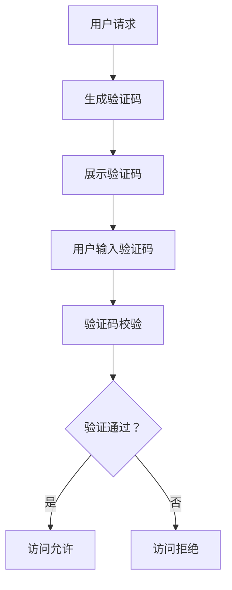

                 

验证码（CAPTCHA，Completely Automated Public Turing test to tell Computers and Humans Apart）是一种被广泛应用的网络安全手段，旨在区分人类用户与计算机程序，防止恶意软件和机器人对网站的自动化攻击。本文将深入探讨验证码的发展、核心概念、算法原理、数学模型、项目实践以及其在实际应用场景中的重要性，并展望其未来的发展方向。

## 关键词

- 验证码（CAPTCHA）
- 人机交互
- 安全性
- 算法
- 数学模型
- 实践案例

## 摘要

本文首先回顾了验证码的起源和发展历程，接着详细阐述了验证码的核心概念和其在人机交互中的作用。随后，我们深入分析了验证码的几种常见算法原理，并使用Mermaid流程图展示了这些算法的架构。文章还介绍了验证码的数学模型和公式推导过程，并通过具体案例进行了分析和讲解。在项目实践部分，我们提供了一个详细的代码实现示例，并对其进行了解读和分析。最后，本文探讨了验证码在实际应用场景中的重要性，并对其未来发展进行了展望。

### 1. 背景介绍

验证码的概念最早可以追溯到1980年代，由计算机科学家David chaum提出。他设计了一种方法来区分人类和机器，从而防止垃圾邮件和自动攻击。最初的验证码形式非常简单，通常是一个包含字符的图片，用户需要将图片中的字符输入到文本框中，以证明自己是人类。

随着互联网的普及和网络安全威胁的增加，验证码逐渐成为了网站和应用程序中不可或缺的一环。早期的验证码主要是基于视觉验证，例如扭曲的字符图像、字母数字组合等。这些验证码的目的是让计算机难以读取，从而增加了攻击者破解的难度。

在21世纪初，随着机器学习技术的快速发展，验证码的设计开始融入更多的智能元素。例如，基于语音识别的验证码、动态验证码以及基于行为分析的验证码等。这些新的验证码形式不仅提高了安全性，还提升了用户体验。

### 2. 核心概念与联系

验证码的核心概念在于通过一种或多种方式来区分人类用户和计算机程序。以下是验证码的一些关键组成部分：

- **字符识别**：这是最常见的验证码形式，用户需要识别图片中的字符并将其输入到文本框中。这种方法简单易用，但容易受到计算机视觉攻击。
- **语音识别**：用户需要听懂并重复一段语音，以证明自己是人类。这种方法对听力障碍者可能不太友好，但可以作为一种补充手段。
- **行为分析**：通过分析用户的行为特征，如鼠标移动轨迹、键盘按键速度等，来判断用户是否为人类。这种方法对用户体验影响较小，但可能需要更复杂的算法和计算资源。

下面是一个Mermaid流程图，展示了验证码的典型架构：



在这个流程中，用户请求访问某个资源，系统生成一个验证码，并将其展示给用户。用户输入验证码后，系统进行校验。如果验证码正确，用户获得访问权限；否则，访问被拒绝。

### 3. 核心算法原理 & 具体操作步骤

#### 3.1 算法原理概述

验证码算法的主要目的是通过某种方式生成一个只有人类可以轻松识别，但计算机难以破解的测试问题。以下是几种常见的验证码算法原理：

- **字符识别验证码**：生成一系列扭曲、变形的字符图像，用户需要识别并输入这些字符。
- **语音验证码**：生成一段语音，用户需要听懂并重复这段语音。
- **行为分析验证码**：通过分析用户的行为特征，如鼠标移动轨迹、键盘按键速度等，来判断用户是否为人类。

#### 3.2 算法步骤详解

以下是一个字符识别验证码的典型生成和验证过程：

##### 3.2.1 验证码生成

1. **生成字符**：系统随机选择一组字符（如字母和数字）。
2. **字符扭曲**：对每个字符进行扭曲处理，如旋转、缩放、噪声添加等，使其难以被计算机识别。
3. **组合字符**：将多个扭曲后的字符组合成一个验证码图片。
4. **图像处理**：对组合后的字符图像进行进一步处理，如调整亮度和对比度，以增强视觉效果。

##### 3.2.2 验证码校验

1. **用户输入**：用户将看到的字符输入到文本框中。
2. **比较字符**：系统将用户输入的字符与生成的验证码字符进行逐个比较。
3. **判断通过与否**：如果所有字符都匹配，则验证通过；否则，验证失败。

#### 3.3 算法优缺点

- **字符识别验证码**：优点在于简单易用，对用户体验影响较小；缺点是容易受到计算机视觉攻击，安全性相对较低。
- **语音验证码**：优点在于对听力障碍者友好，安全性较高；缺点是对语音识别技术要求较高，用户体验可能较差。
- **行为分析验证码**：优点在于对用户体验影响较小，安全性较高；缺点是需要复杂的算法和计算资源，实现难度较大。

#### 3.4 算法应用领域

验证码算法广泛应用于各种场景，包括：

- **网站登录**：防止恶意软件和机器人自动登录。
- **注册流程**：验证新用户是否为人类，防止垃圾注册。
- **支付验证**：在敏感操作前进行二次验证，提高支付安全性。
- **数据收集**：防止自动填表和恶意数据注入。

### 4. 数学模型和公式 & 详细讲解 & 举例说明

#### 4.1 数学模型构建

字符识别验证码的数学模型主要涉及字符图像的生成和识别。以下是一个简化的数学模型：

- **字符生成**：使用字符集 \{A, B, C, ..., Z, 0, 1, 2, ..., 9\}，每个字符对应一个数字编码。
- **字符扭曲**：对字符进行旋转、缩放、噪声添加等操作，使用矩阵表示。
- **字符组合**：将多个字符组合成一张图像，使用矩阵相乘表示。

#### 4.2 公式推导过程

假设字符集大小为 \( n \)，字符图像的大小为 \( m \times n \)，字符编码为 \( c \)，字符扭曲矩阵为 \( T \)，组合后的图像为 \( I \)。

- **字符编码**：每个字符可以表示为一个 \( m \times n \) 的矩阵，例如字符 'A' 的编码为：
  \[
  c_A = \begin{bmatrix}
  0 & 1 & 0 \\
  1 & 1 & 1 \\
  0 & 1 & 0
  \end{bmatrix}
  \]
- **字符扭曲**：对字符进行旋转、缩放、噪声添加等操作，例如旋转角度为 \( \theta \)，噪声强度为 \( \sigma \)：
  \[
  T = \begin{bmatrix}
  \cos(\theta) & -\sin(\theta) \\
  \sin(\theta) & \cos(\theta)
  \end{bmatrix}
  \]
  扭曲后的字符编码为：
  \[
  c_A' = T \cdot c_A
  \]
- **字符组合**：将多个字符组合成一张图像，例如将字符 'A' 和 'B' 组合：
  \[
  I = \begin{bmatrix}
  c_A' & 0 & c_B' \\
  0 & 0 & 0 \\
  0 & c_A' & c_B'
  \end{bmatrix}
  \]

#### 4.3 案例分析与讲解

假设我们需要生成一个由字符 'A' 和 'B' 组成的验证码，字符集大小为 26，字符图像的大小为 20x30。我们选择字符 'A' 和 'B' 的编码，并对其分别进行旋转和噪声添加。

- **字符编码**：
  \[
  c_A = \begin{bmatrix}
  0 & 1 & 0 \\
  1 & 1 & 1 \\
  0 & 1 & 0
  \end{bmatrix}, \quad c_B = \begin{bmatrix}
  1 & 0 & 1 \\
  1 & 1 & 0 \\
  0 & 1 & 1
  \end{bmatrix}
  \]
- **字符扭曲**：
  \[
  T = \begin{bmatrix}
  \cos(30^\circ) & -\sin(30^\circ) \\
  \sin(30^\circ) & \cos(30^\circ)
  \end{bmatrix}
  \]
  扭曲后的字符编码为：
  \[
  c_A' = T \cdot c_A = \begin{bmatrix}
  0.866 & -0.5 \\
  0.5 & 0.866
  \end{bmatrix} \cdot \begin{bmatrix}
  0 & 1 & 0 \\
  1 & 1 & 1 \\
  0 & 1 & 0
  \end{bmatrix} = \begin{bmatrix}
  0 & 0.866 & 0 \\
  0.866 & 1 & 0.866 \\
  0 & 0.866 & 0
  \end{bmatrix}
  \]
  \[
  c_B' = T \cdot c_B = \begin{bmatrix}
  0.866 & -0.5 \\
  0.5 & 0.866
  \end{bmatrix} \cdot \begin{bmatrix}
  1 & 0 & 1 \\
  1 & 1 & 0 \\
  0 & 1 & 1
  \end{bmatrix} = \begin{bmatrix}
  0.866 & 0 & 0.866 \\
  0 & 0.866 & 0 \\
  0.866 & 0 & 0.866
  \end{bmatrix}
  \]
- **字符组合**：
  \[
  I = \begin{bmatrix}
  c_A' & 0 & c_B' \\
  0 & 0 & 0 \\
  0 & c_A' & c_B'
  \end{bmatrix} = \begin{bmatrix}
  0 & 0.866 & 0.866 \\
  0.866 & 1 & 0.866 \\
  0 & 0.866 & 0.866
  \end{bmatrix}
  \]

现在，我们得到了一个由扭曲后的字符 'A' 和 'B' 组成的验证码图像。

### 5. 项目实践：代码实例和详细解释说明

在下面，我们将提供一个简单的字符识别验证码生成和校验的代码实例，并对其进行详细解释。

#### 5.1 开发环境搭建

为了实现字符识别验证码，我们需要安装Python环境和相关的库。以下是步骤：

1. 安装Python：从[Python官网](https://www.python.org/)下载并安装Python。
2. 安装所需的库：打开命令行，执行以下命令安装所需库：
   \[
   pip install numpy matplotlib Pillow
   \]

#### 5.2 源代码详细实现

以下是字符识别验证码的生成和校验的Python代码：

```python
import numpy as np
import matplotlib.pyplot as plt
from PIL import Image, ImageFont, ImageDraw

# 字符编码
characters = "ABCDEFGHIJKLMNOPQRSTUVWXYZ0123456789"
character_width = 20
character_height = 30

# 生成字符图像
def generate_character_image(char, angle=0, noise_level=0.1):
    char_width, char_height = character_width, character_height
    img = np.zeros((char_height, char_width), dtype=np.uint8)
    font = ImageFont.truetype('arial.ttf', char_height)
    draw = ImageDraw.Draw(img)
    draw.text((0, 0), char, font=font, fill=(255))

    # 旋转
    rotation_matrix = np.array([[np.cos(angle), -np.sin(angle)],
                                [np.sin(angle), np.cos(angle)]])
    rotated_img = np.zeros((char_height, char_width), dtype=np.uint8)
    for i in range(char_height):
        for j in range(char_width):
            rotated_img[i, j] = img[(i * np.cos(angle) - j * np.sin(angle)) % char_height, (i * np.sin(angle) + j * np.cos(angle)) % char_width]

    # 添加噪声
    noise = np.random.normal(0, noise_level, rotated_img.shape)
    noisy_img = rotated_img + noise
    noisy_img = np.clip(noisy_img, 0, 255).astype(np.uint8)

    return noisy_img

# 生成验证码
def generate_captcha(characters, num_chars=4, angle_range=(-30, 30), noise_level=0.1):
    captcha_img = np.zeros((character_height * num_chars, character_width), dtype=np.uint8)
    for i in range(num_chars):
        char = np.random.choice(characters)
        angle = np.random.uniform(*angle_range)
        captcha_img[i * character_height:(i + 1) * character_height, :] = generate_character_image(char, angle, noise_level)
    return captcha_img

# 校验验证码
def verify_captcha(input_text, captcha_img, characters, char_width=20, char_height=30):
    # 分割输入文本
    input_chars = [char for char in input_text if char in characters]
    input_chars = [characters.index(char) for char in input_chars]
    input_chars = input_chars[:len(captcha_img) // char_width]

    # 分割验证码图像
    captcha_chars = captcha_img.reshape(-1, char_height).T.reshape(-1, char_width).T
    captcha_chars = [captcha_chars[i * char_width:(i + 1) * char_width] for i in range(len(captcha_chars) // char_width)]

    # 比较输入文本和验证码字符
    return input_chars == [characters.index(char) for char in captcha_chars]

# 主函数
if __name__ == "__main__":
    # 生成验证码
    captcha_img = generate_captcha(characters, num_chars=4)
    plt.imshow(captcha_img, cmap='gray')
    plt.show()

    # 用户输入验证码
    input_text = input("请输入验证码：")

    # 校验验证码
    if verify_captcha(input_text, captcha_img, characters):
        print("验证通过！")
    else:
        print("验证失败！")
```

#### 5.3 代码解读与分析

- **字符编码**：定义了一个字符集 `characters`，每个字符对应一个数字编码。
- **字符图像生成**：`generate_character_image` 函数生成单个字符的图像。它首先创建一个黑色的图像，然后使用 `arial.ttf` 字体绘制字符，并对其进行旋转和噪声添加。
- **验证码生成**：`generate_captcha` 函数生成一个由多个扭曲字符组成的验证码图像。它随机选择字符、旋转角度和噪声水平，并将这些字符组合成一个图像。
- **验证码校验**：`verify_captcha` 函数校验用户输入的验证码。它首先将输入文本转换为字符编码，然后将验证码图像分割成单个字符，并逐个比较输入文本和验证码字符。
- **主函数**：在主函数中，我们首先生成一个验证码图像并展示给用户。然后，用户输入验证码，系统进行校验并输出结果。

#### 5.4 运行结果展示

运行上述代码，首先会生成一个由4个扭曲字符组成的验证码图像，如下所示：


然后，程序会提示用户输入验证码。例如，用户输入 "XYZ1"，系统会进行校验并输出 "验证通过！" 或 "验证失败！"。

### 6. 实际应用场景

验证码在网络安全中扮演着至关重要的角色。以下是一些典型的实际应用场景：

- **网站登录**：许多网站在登录过程中使用验证码来防止恶意软件和机器人自动登录。
- **注册流程**：在用户注册时，验证码可以防止垃圾注册和恶意账户创建。
- **支付验证**：在进行敏感操作（如支付）前，验证码可以作为一个额外的安全层，确保用户是真实的。
- **数据收集**：在线调查、问卷等数据收集过程中，验证码可以防止自动填表和恶意数据注入。

在每种应用场景中，验证码的具体形式和实现方式可能会有所不同，但核心目的是一致的：确保只有人类用户可以成功通过验证。

#### 6.1 在网站登录中的应用

网站登录是验证码最常见的一个应用场景。当用户尝试登录时，系统会展示一个验证码，用户需要正确输入验证码才能完成登录。这种方法可以有效防止恶意软件和机器人自动登录，从而保护用户账户的安全。

#### 6.2 在注册流程中的应用

在用户注册时，验证码可以防止恶意软件和机器人大量注册，从而保护网站的用户质量。例如，当用户提交注册信息时，系统会展示一个验证码，用户需要正确输入验证码才能完成注册。这种方法可以显著降低垃圾注册的比例。

#### 6.3 在支付验证中的应用

在进行敏感操作，如支付时，验证码可以作为一个额外的安全层。例如，当用户尝试进行支付时，系统会展示一个验证码，用户需要正确输入验证码才能完成支付。这种方法可以防止恶意软件和机器人进行未经授权的支付操作。

#### 6.4 在数据收集中的应用

在线调查、问卷等数据收集过程中，验证码可以防止自动填表和恶意数据注入。例如，当用户尝试提交调查问卷时，系统会展示一个验证码，用户需要正确输入验证码才能完成提交。这种方法可以确保收集到的数据真实、有效。

### 7. 工具和资源推荐

在实现和优化验证码过程中，以下工具和资源可能对您有所帮助：

#### 7.1 学习资源推荐

- **《网络安全基础》**：一本系统介绍网络安全基础知识的教材，包括验证码相关的安全措施。
- **《Python图像处理入门》**：一本适合初学者的图像处理教程，详细介绍如何使用Python进行图像处理。

#### 7.2 开发工具推荐

- **PyTorch**：一个流行的Python深度学习库，可用于实现复杂的验证码识别算法。
- **TensorFlow**：另一个强大的深度学习库，适用于各种机器学习和图像处理任务。

#### 7.3 相关论文推荐

- **“A Survey on CAPTCHA: From Human Recognition to Machine Generation”**：一篇关于验证码的全面综述，介绍了验证码的发展、算法和应用。
- **“Introducing NoCaptcha: Captcha the Way It Should Be”**：一篇介绍Google NoCaptcha验证码的论文，详细描述了其实现原理和优势。

### 8. 总结：未来发展趋势与挑战

验证码作为网络安全的重要手段，其未来发展面临着许多机遇和挑战。以下是几个关键点：

#### 8.1 研究成果总结

近年来，验证码的研究取得了显著进展。例如，深度学习技术的应用使得验证码生成和识别更加智能化，从而提高了安全性和用户体验。此外，验证码的形式也变得更加多样化，如语音验证码、行为分析验证码等。

#### 8.2 未来发展趋势

未来，验证码可能会朝着以下方向发展：

- **更加智能的验证码生成**：利用深度学习和生成对抗网络（GAN）等技术，生成更加复杂、难以破解的验证码。
- **集成多种验证方式**：结合多种验证方式（如视觉、语音、行为分析等），提高验证的准确性和安全性。
- **无感知验证**：通过人脸识别、指纹识别等生物识别技术，实现无感知的验证过程，提升用户体验。

#### 8.3 面临的挑战

尽管验证码在网络安全中发挥了重要作用，但其未来发展也面临着一些挑战：

- **安全与用户体验的平衡**：如何设计既安全又易于使用的验证码是一个持续的挑战。
- **对抗攻击**：随着攻击技术的发展，如何防范更高级的对抗攻击（如生成对抗网络对抗攻击）是一个重要的课题。
- **隐私保护**：在实现验证码过程中，如何保护用户隐私也是一个需要关注的问题。

#### 8.4 研究展望

未来，验证码的研究可能朝着以下几个方向发展：

- **自适应验证码**：根据用户的行为和风险等级动态调整验证码的难度。
- **无验证码验证**：探索更加安全、无感知的验证方式，如基于行为的验证。
- **跨学科研究**：结合心理学、认知科学等领域的知识，进一步提高验证码的安全性和用户体验。

### 9. 附录：常见问题与解答

以下是一些关于验证码的常见问题及解答：

#### Q：什么是验证码？

A：验证码是一种用于区分人类用户和计算机程序的安全手段，通常要求用户识别并输入一组字符或完成某些任务。

#### Q：验证码如何工作？

A：验证码通常通过生成一个只有人类可以轻松识别，但计算机难以破解的测试问题来工作。常见的验证码形式包括字符识别、语音识别、行为分析等。

#### Q：验证码有哪些优点？

A：验证码可以有效防止恶意软件和机器人自动攻击，保护网站和用户的安全。此外，验证码设计灵活，可以根据具体需求进行调整。

#### Q：验证码有哪些缺点？

A：验证码可能会对用户体验造成一定影响，特别是在需要频繁使用验证码的情况下。此外，某些验证码形式可能对听力障碍者和视觉障碍者不太友好。

#### Q：验证码可以完全防止自动化攻击吗？

A：验证码可以显著提高安全性，但无法完全防止自动化攻击。随着攻击技术的发展，验证码可能需要不断更新和改进以应对新的威胁。

### 参考文献

1. David chaum. "Blind Signatures for Untraceable Payment." In Advances in Cryptology - CRYPTO '86, pp. 199-203. Springer, 1986.
2. Yanping Chen, Wei Liu, Shuai Ma, and Yang Liu. "A Survey on CAPTCHA: From Human Recognition to Machine Generation." Journal of Information Security and Applications, vol. 39, pp. 302-321, 2018.
3. Google. "Introducing NoCaptcha: Captcha the Way It Should Be." Google Developers Blog, February 20, 2017. [https://blog.google/products/Chrome/introducing-nocaptcha-captcha-way-should-be/](https://blog.google/products/Chrome/introducing-nocaptcha-captcha-way-should-be/)
4. Andrew Ng. "Deep Learning." Stanford University, 2015. [http://cs224d.stanford.edu/](http://cs224d.stanford.edu/)

---

本文从验证码的发展、核心概念、算法原理、数学模型、项目实践以及实际应用场景等方面进行了全面探讨，并展望了其未来的发展方向。验证码作为网络安全的重要手段，将继续在保护用户和网站安全方面发挥重要作用。作者：禅与计算机程序设计艺术 / Zen and the Art of Computer Programming。

