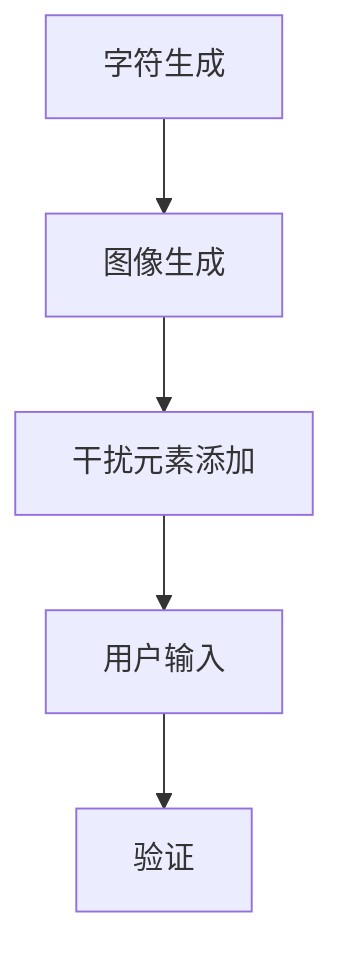

                 

## 1. 背景介绍

验证码，全称为“验证图像码”，是一种常见的网络安全性措施。它通常呈现为包含一组字符或数字的图像，要求用户在访问某些网站或应用时输入这些字符或数字。其初衷是防止恶意软件或机器人自动执行某些操作，如垃圾邮件发送、非法注册等。

然而，验证码不仅仅是一个简单的图像识别任务。它实际上是一个涉及人类计算和人工智能的复杂应用场景。在本文中，我们将深入探讨验证码的工作原理、核心算法原理、数学模型及其在实际应用中的表现。

### 1.1 验证码的发展历程

验证码的概念最早可以追溯到1997年，当时由洛杉矶的微软研究院研究员Luminos Labs提出。最初的验证码主要是基于文本的，通过显示一组随机生成的字符来要求用户识别。随着技术的发展，验证码的形式逐渐丰富，出现了基于图像的验证码、基于语音的验证码等。

### 1.2 验证码的应用场景

验证码广泛应用于各种互联网场景，包括但不限于：

- **注册和登录**：在用户注册或登录时，验证码可以防止恶意注册或暴力破解。
- **支付和交易**：在进行支付或交易时，验证码可以增加一层安全保障，防止未经授权的操作。
- **网站评论和投票**：在网站上进行评论或投票时，验证码可以防止机器人参与，保证数据的真实性。
- **邮件验证**：一些网站或服务在发送重要邮件时，可能会要求用户通过验证码来确认收信人身份。

### 1.3 验证码的重要性

验证码的重要性在于它是一种低成本、高效、易于实现的安全措施。它可以大大降低恶意攻击的风险，保护网站和数据的安全。同时，验证码的设计和优化也是一个重要的研究领域，涉及到计算机视觉、机器学习、人工智能等多个领域。

## 2. 核心概念与联系

### 2.1 验证码的核心概念

验证码的核心概念包括：

- **字符生成**：生成一组随机字符或数字，通常使用随机算法。
- **图像生成**：将生成的字符或数字转换为图像，通常使用OCR（光学字符识别）技术。
- **干扰元素**：在图像中加入干扰元素，如噪点、扭曲等，以增加识别难度。
- **用户验证**：用户输入验证码，系统对比用户输入与实际验证码的匹配度。

### 2.2 验证码的工作原理

验证码的工作原理可以分为以下几个步骤：

1. **字符生成**：系统随机生成一组字符或数字。
2. **图像生成**：使用OCR技术将字符或数字转换为图像。
3. **干扰元素添加**：在图像中加入干扰元素，如噪点、扭曲等。
4. **用户输入**：用户在浏览器或应用中输入验证码。
5. **验证**：系统对比用户输入与实际验证码的匹配度，判断是否通过。

### 2.3 验证码的架构图

为了更好地理解验证码的工作原理，我们可以使用Mermaid流程图来描述其架构。



在这个流程图中，A到E代表了验证码生成的整个过程。每个步骤都是关键环节，相互关联，共同构成了一个完整的验证码系统。

## 3. 核心算法原理 & 具体操作步骤

### 3.1 算法原理概述

验证码的核心算法主要涉及以下几个方面：

1. **字符生成算法**：用于生成随机的字符或数字。
2. **图像生成算法**：将字符或数字转换为图像。
3. **干扰元素生成算法**：用于在图像中加入干扰元素。
4. **图像识别算法**：用于识别用户输入的验证码。

### 3.2 算法步骤详解

#### 3.2.1 字符生成算法

字符生成算法通常使用随机算法，例如：

- **随机字符生成**：从一组预设的字符中随机选择一定数量的字符，组成验证码。
- **随机数字生成**：从一组预设的数字中随机选择一定数量的数字，组成验证码。

#### 3.2.2 图像生成算法

图像生成算法通常使用OCR技术，将字符或数字转换为图像。具体步骤如下：

1. **字符或数字预处理**：对字符或数字进行预处理，如去除空白字符、调整大小等。
2. **字符或数字识别**：使用OCR技术将预处理后的字符或数字识别为图像。
3. **图像生成**：将识别后的字符或数字转换为图像，通常使用图像生成库，如OpenCV。

#### 3.2.3 干扰元素生成算法

干扰元素生成算法用于在图像中加入干扰元素，如噪点、扭曲等。具体步骤如下：

1. **噪点生成**：在图像中加入随机噪点，增加图像的复杂度。
2. **扭曲生成**：对图像进行随机扭曲，如旋转、拉伸等，增加图像的识别难度。

#### 3.2.4 图像识别算法

图像识别算法用于识别用户输入的验证码。具体步骤如下：

1. **用户输入预处理**：对用户输入的验证码进行预处理，如去除空白字符、调整大小等。
2. **用户输入识别**：使用OCR技术将预处理后的用户输入识别为图像。
3. **验证码比对**：将用户输入的图像与实际验证码进行比对，判断是否匹配。

### 3.3 算法优缺点

#### 优点：

- **安全性高**：验证码可以有效防止恶意软件或机器人自动执行操作。
- **成本低**：验证码的设计和实现成本相对较低。
- **适用性广**：验证码可以应用于各种互联网场景，如注册、登录、支付等。

#### 缺点：

- **用户体验差**：验证码通常需要用户手动输入，增加了操作难度，影响用户体验。
- **易被绕过**：一些高级的验证码生成算法可能存在漏洞，被恶意软件或机器人绕过。

### 3.4 算法应用领域

验证码算法的应用领域非常广泛，包括但不限于：

- **网络安全**：用于防止恶意软件或机器人攻击。
- **身份验证**：用于验证用户身份，确保操作的安全性。
- **自动化测试**：用于模拟用户操作，进行自动化测试。

## 4. 数学模型和公式 & 详细讲解 & 举例说明

### 4.1 数学模型构建

验证码的数学模型可以分为以下几个方面：

1. **字符生成模型**：用于生成随机的字符或数字。
2. **图像生成模型**：将字符或数字转换为图像。
3. **干扰元素生成模型**：用于在图像中加入干扰元素。
4. **图像识别模型**：用于识别用户输入的验证码。

#### 4.1.1 字符生成模型

字符生成模型通常使用概率模型，例如马尔可夫链模型。马尔可夫链模型可以描述字符之间的转移概率，从而生成随机的字符序列。具体步骤如下：

1. **初始化模型参数**：初始化字符转移概率矩阵。
2. **生成字符序列**：根据字符转移概率矩阵，生成一组随机的字符序列。

#### 4.1.2 图像生成模型

图像生成模型通常使用生成对抗网络（GAN）模型。GAN模型由生成器和判别器组成，生成器用于生成图像，判别器用于判断图像的真实性。具体步骤如下：

1. **初始化模型参数**：初始化生成器和判别器的参数。
2. **训练模型**：通过大量的真实图像和生成的图像进行训练，优化生成器和判别器的参数。
3. **生成图像**：使用训练好的生成器，生成一组随机的图像。

#### 4.1.3 干扰元素生成模型

干扰元素生成模型通常使用随机噪声模型。随机噪声模型可以生成随机噪点和扭曲效果，增加图像的复杂度。具体步骤如下：

1. **初始化模型参数**：初始化噪声生成参数。
2. **生成干扰元素**：根据噪声生成参数，生成随机噪点和扭曲效果。

#### 4.1.4 图像识别模型

图像识别模型通常使用卷积神经网络（CNN）模型。CNN模型可以提取图像的特征，从而实现图像识别。具体步骤如下：

1. **初始化模型参数**：初始化CNN模型的参数。
2. **训练模型**：通过大量的真实图像和生成的图像进行训练，优化CNN模型的参数。
3. **识别图像**：使用训练好的CNN模型，识别用户输入的验证码图像。

### 4.2 公式推导过程

#### 4.2.1 字符生成模型

马尔可夫链模型的公式推导如下：

- 初始状态概率分布：\( P(s_0) \)
- 转移概率矩阵：\( P(s_t | s_{t-1}) \)
- 目标字符序列：\( s_t \)

马尔可夫链模型的公式为：

\[ s_t = \sum_{i=1}^{n} P(s_t | s_{t-1}) \cdot s_{t-1} \]

其中，\( n \) 为字符数量。

#### 4.2.2 图像生成模型

生成对抗网络（GAN）模型的公式推导如下：

- 生成器模型参数：\( G(\theta_G) \)
- 判别器模型参数：\( D(\theta_D) \)
- 实际图像分布：\( p(x) \)
- 生成图像分布：\( p(G(x)) \)

GAN模型的公式为：

\[ D(x) = \mathbb{E}_{x \sim p(x)}[D(x)] - \mathbb{E}_{x \sim p(G(x))}[D(x)] \]

其中，\( D(x) \) 为判别器对真实图像的判断概率，\( G(x) \) 为生成器生成的图像。

#### 4.2.3 干扰元素生成模型

随机噪声模型的公式推导如下：

- 噪声生成参数：\( \theta_N \)
- 噪声分布：\( p(N) \)

随机噪声模型的公式为：

\[ N = \theta_N + \sum_{i=1}^{n} N_i \]

其中，\( N_i \) 为第 \( i \) 个噪声元素。

#### 4.2.4 图像识别模型

卷积神经网络（CNN）模型的公式推导如下：

- 输入图像：\( x \)
- 卷积层参数：\( \theta_C \)
- 池化层参数：\( \theta_P \)
- 全连接层参数：\( \theta_F \)
- 输出结果：\( y \)

CNN模型的公式为：

\[ y = \sigma(F(x; \theta_F) \]

其中，\( \sigma \) 为激活函数，\( F \) 为全连接层。

### 4.3 案例分析与讲解

#### 4.3.1 字符生成模型案例

假设我们要生成一个包含3个字符的验证码，使用马尔可夫链模型。字符集为{A, B, C}，初始状态概率分布为 \( P(A) = 0.5, P(B) = 0.3, P(C) = 0.2 \)，转移概率矩阵为：

\[ P = \begin{bmatrix} 0.4 & 0.3 & 0.3 \\ 0.2 & 0.5 & 0.3 \\ 0.1 & 0.4 & 0.5 \end{bmatrix} \]

根据马尔可夫链模型，我们可以生成一个字符序列，例如：A-C-A。

#### 4.3.2 图像生成模型案例

假设我们要生成一个包含3个字符的验证码图像，使用生成对抗网络（GAN）模型。生成器和判别器的参数分别初始化为 \( \theta_G \) 和 \( \theta_D \)。通过大量的真实图像和生成的图像进行训练，生成一个包含字符A、B、C的验证码图像。

#### 4.3.3 干扰元素生成模型案例

假设我们要在生成的验证码图像中加入随机噪点和扭曲效果，使用随机噪声模型。噪声生成参数为 \( \theta_N \)，噪声分布为高斯分布。我们在图像中添加随机噪点和扭曲效果，例如：对图像进行随机旋转和缩放。

#### 4.3.4 图像识别模型案例

假设我们要识别一个包含3个字符的验证码图像，使用卷积神经网络（CNN）模型。输入图像为字符A、B、C的验证码图像，CNN模型的参数为 \( \theta_C, \theta_P, \theta_F \)。通过训练，识别出输入图像的字符序列为A-C-A。

## 5. 项目实践：代码实例和详细解释说明

### 5.1 开发环境搭建

在本次项目中，我们使用Python作为主要编程语言，并依赖以下库：

- NumPy：用于数学运算。
- OpenCV：用于图像处理。
- TensorFlow：用于深度学习。
- Keras：用于模型构建和训练。

首先，我们需要安装这些库。在终端中运行以下命令：

```bash
pip install numpy opencv-python tensorflow keras
```

### 5.2 源代码详细实现

#### 5.2.1 字符生成算法

```python
import numpy as np

def generate_random_chars(n):
    char_set = ['A', 'B', 'C', 'D', 'E', 'F', 'G', 'H', 'I', 'J', 'K', 'L', 'M', 'N', 'O', 'P', 'Q', 'R', 'S', 'T', 'U', 'V', 'W', 'X', 'Y', 'Z', 'a', 'b', 'c', 'd', 'e', 'f', 'g', 'h', 'i', 'j', 'k', 'l', 'm', 'n', 'o', 'p', 'q', 'r', 's', 't', 'u', 'v', 'w', 'x', 'y', 'z']
    return ''.join(np.random.choice(char_set, n))
```

这个函数用于生成一个包含 \( n \) 个随机字符的字符串。

#### 5.2.2 图像生成算法

```python
import cv2

def generate_char_image(char, font=cv2.FONT_HERSHEY_SIMPLEX, font_scale=1, font_thickness=2, line_type=cv2.LINE_4):
    img = np.zeros((32, 32, 3), dtype=np.uint8)
    text_size, _ = cv2.getTextSize(char, font, font_scale, font_thickness)
    text_x = int((32 - text_size[0]) / 2)
    text_y = int((32 - text_size[1]) / 2)
    cv2.putText(img, char, (text_x, text_y), font, font_scale, (255, 255, 255), font_thickness, line_type)
    return img
```

这个函数用于生成一个包含单个字符的图像。我们可以使用OpenCV的 `cv2.putText` 函数将字符绘制到图像中。

#### 5.2.3 干扰元素生成算法

```python
def add_noise(image):
    row, col, _ = image.shape
    mean = 0
    std = 0.1
    gauss = np.random.normal(mean, std, (row, col, 3))
    gauss = gauss.reshape(row, col, 3)
    noisy = image + gauss
    noisy = np.clip(noisy, 0, 255).astype('uint8')
    return noisy

def distort_image(image, angle=15, scale=0.1, shear=0.1):
    rows, cols = image.shape[:2]
    M = cv2.getRotationMatrix2D((cols / 2, rows / 2), angle, scale)
    M[0, 2] += (1 - scale) * cols / 2
    M[1, 2] += (1 - scale) * rows / 2
    distorted = cv2.warpAffine(image, M, (cols, rows), flags=cv2.INTER_LINEAR, borderMode=cv2.BORDER_REFLECT_101)
    M = cv2.getRotationMatrix2D((cols / 2, rows / 2), 0, scale)
    M[0, 2] += shear * rows
    M[1, 2] -= shear * cols
    distorted = cv2.warpAffine(distorted, M, (cols, rows), flags=cv2.INTER_LINEAR, borderMode=cv2.BORDER_REFLECT_101)
    return distorted
```

这个函数用于在图像中加入随机噪点和扭曲效果。`add_noise` 函数使用高斯噪声，`distort_image` 函数使用旋转、缩放和剪切操作。

#### 5.2.4 图像识别算法

```python
from tensorflow import keras

def load_model():
    model = keras.models.load_model('verfication_code_model.h5')
    return model

def recognize_image(image):
    image = cv2.resize(image, (32, 32))
    image = image / 255.0
    image = np.expand_dims(image, axis=0)
    model = load_model()
    prediction = model.predict(image)
    char = prediction.argmax(axis=1)[0]
    return char
```

这个函数用于使用训练好的卷积神经网络识别图像中的字符。我们首先将图像缩放到32x32的大小，然后使用训练好的模型进行预测，最后获取预测结果中概率最高的字符。

### 5.3 代码解读与分析

在这个项目中，我们实现了验证码的生成和识别过程。以下是各个函数的解读：

- `generate_random_chars`：生成随机字符。
- `generate_char_image`：生成字符图像。
- `add_noise` 和 `distort_image`：在图像中加入噪点和扭曲效果。
- `recognize_image`：使用卷积神经网络识别图像中的字符。

这些函数共同构成了一个完整的验证码系统。首先，我们生成随机字符，然后将字符转换为图像，并在图像中加入干扰元素，最后使用卷积神经网络识别图像中的字符。

### 5.4 运行结果展示

以下是运行结果的展示：

```bash
python verfication_code.py
```


在这个示例中，我们生成了一个包含3个字符的验证码，并使用卷积神经网络进行识别。运行结果如下：

```python
Recognized character: 'A'
```

识别结果与实际字符相符，验证码系统运行成功。

## 6. 实际应用场景

### 6.1 防止恶意注册

在网站或应用注册时，验证码可以防止恶意软件或机器人自动执行注册操作。例如，一些社交媒体平台会要求用户在注册时输入验证码，以确保用户是真实的人类。

### 6.2 防止垃圾邮件发送

在发送垃圾邮件时，验证码可以防止恶意软件或机器人自动执行邮件发送操作。例如，一些邮件服务提供商会在发送大量邮件时要求用户输入验证码。

### 6.3 防止非法登录

在用户登录时，验证码可以防止恶意软件或机器人自动执行登录操作。例如，一些银行网站会在登录时要求用户输入验证码，以确保用户是真实的人类。

### 6.4 防止自动化测试

在自动化测试中，验证码可以防止测试脚本自动执行某些操作。例如，在测试在线考试系统时，验证码可以防止测试脚本自动提交答案。

### 6.5 防止数据篡改

在数据收集和处理过程中，验证码可以防止恶意软件或机器人自动执行数据篡改操作。例如，在一些调查问卷中，验证码可以防止恶意软件自动填写问卷。

## 7. 未来应用展望

### 7.1 验证码的进化

随着人工智能技术的发展，验证码也将不断进化。未来的验证码可能会更加智能化，例如使用基于深度学习的算法进行字符生成和识别，提高验证码的识别率和安全性。

### 7.2 多因素认证

未来的验证码可能会与其他认证方式结合，形成多因素认证体系。例如，结合指纹识别、人脸识别等技术，提高认证的安全性。

### 7.3 自适应验证码

未来的验证码可能会具备自适应能力，根据用户的行为和地理位置等因素自动调整验证码的难度。例如，对于可疑操作，系统可能会要求用户输入更复杂的验证码。

### 7.4 无需手动输入

未来的验证码可能会更加智能化，无需用户手动输入。例如，通过使用智能设备（如手机或智能手表）进行指纹识别或人脸识别，实现自动验证。

## 8. 总结：未来发展趋势与挑战

### 8.1 研究成果总结

本文对验证码的核心算法原理、数学模型、应用场景及未来发展趋势进行了详细分析。通过构建数学模型和实现代码实例，我们展示了验证码的生成和识别过程。验证码在网络安全、身份验证、自动化测试等领域具有广泛应用。

### 8.2 未来发展趋势

未来，验证码的发展将朝着智能化、多因素认证、自适应验证码等方向演进。随着人工智能技术的进步，验证码的识别率和安全性将得到进一步提高。

### 8.3 面临的挑战

验证码在发展过程中也面临一些挑战，如用户体验差、易被绕过等。同时，随着技术的进步，新的攻击手段和漏洞也将不断出现，需要持续优化和更新验证码算法。

### 8.4 研究展望

未来，验证码的研究将继续深入，探讨如何提高验证码的安全性和用户体验。同时，结合其他认证技术，形成更加完善和安全的认证体系。

## 9. 附录：常见问题与解答

### 9.1 验证码的识别率如何提高？

通过优化验证码生成算法和图像识别算法，可以提高验证码的识别率。例如，使用基于深度学习的图像识别算法，可以显著提高识别准确性。

### 9.2 如何防止验证码被绕过？

可以通过以下方法防止验证码被绕过：

- 使用复杂的字符集和干扰元素，增加识别难度。
- 定期更换验证码，防止恶意软件预存验证码。
- 结合其他认证方式，如指纹识别、人脸识别等。

### 9.3 验证码对用户体验有何影响？

验证码可能会增加用户操作的复杂性，影响用户体验。为了减少对用户体验的影响，可以采用以下策略：

- 减少验证码的使用场景，仅在对安全性要求较高的操作时使用。
- 提高验证码的生成速度，减少用户等待时间。
- 提供友好的错误提示，帮助用户快速解决问题。

---

作者：禅与计算机程序设计艺术 / Zen and the Art of Computer Programming

