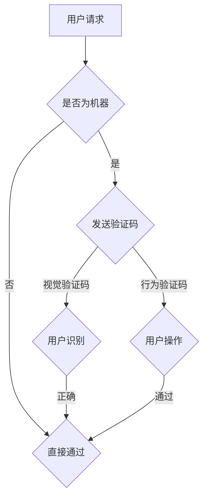

                 

### 1. 背景介绍

验证码（Captcha），全称“Completely Automated Public Turing test to tell Computers and Humans Apart”，中文直译为“全自动区分计算机和人类的行为测试”。这一概念最早由计算机科学家汤姆·卡特勒（Tom Computer）在2000年提出，旨在解决网络服务中的自动攻击和滥用问题。

在互联网的早期，验证码主要用于注册和登录环节，目的是确保用户为人类而非机器。通过视觉验证码，如扭曲的字符或图像，使得计算机难以识别。然而，随着人工智能技术的发展，验证码也逐渐演变，出现了各种类型的验证码，如图形验证码、语音验证码、行为验证码等。

<|assistant|>### 2. 核心概念与联系

#### 2.1. 核心概念

1. **人类识别与计算机识别的差异**：人类具有独特的视觉处理能力和学习机制，能够识别复杂的图像和模式，而计算机在这方面则显得相对笨拙。
2. **图像识别算法**：包括深度学习、神经网络等，使得计算机能够逐步提高对图像的识别能力。
3. **机器学习与人工智能**：机器学习算法不断优化，使得计算机在处理复杂任务时越来越接近人类的表现。

#### 2.2. 联系与架构

以下是一个简化的 Mermaid 流程图，展示了验证码系统的工作原理和关键组件：



### 3. 核心算法原理 & 具体操作步骤

#### 3.1. 算法原理概述

验证码的核心算法主要分为以下几类：

1. **视觉验证码**：基于图像处理的算法，生成扭曲的字符图像，需要用户识别字符。
2. **图形验证码**：生成一系列图形，用户需要根据图形完成特定的任务，如拖动图形到指定位置。
3. **行为验证码**：通过分析用户的行为特征，如鼠标移动轨迹、点击速度等，来判断用户是否为人类。

#### 3.2. 算法步骤详解

**视觉验证码**

1. **字符生成**：随机选择字符，并将其绘制成图像。
2. **扭曲处理**：对字符图像进行扭曲，增加难度。
3. **图像呈现**：将扭曲后的字符图像展示给用户。
4. **用户输入**：用户输入识别到的字符。
5. **验证**：系统比较用户输入与实际字符，判断是否正确。

**图形验证码**

1. **图形生成**：随机生成一系列图形。
2. **任务生成**：为每个图形生成一个任务，如拖动到指定位置。
3. **图形呈现**：将图形和任务展示给用户。
4. **用户操作**：用户完成指定任务。
5. **验证**：系统验证用户操作是否正确。

**行为验证码**

1. **行为采集**：收集用户的行为数据，如鼠标移动轨迹、点击速度等。
2. **行为分析**：使用机器学习算法分析行为数据，判断用户是否为人类。
3. **验证**：系统根据行为分析结果判断用户身份。

#### 3.3. 算法优缺点

**视觉验证码**

- **优点**：难度适中，容易实现，广泛使用。
- **缺点**：容易受到图像质量、颜色等因素的影响。

**图形验证码**

- **优点**：交互性强，用户体验较好。
- **缺点**：生成复杂，实现难度大。

**行为验证码**

- **优点**：难以被自动化攻击，用户体验较好。
- **缺点**：需要大量行为数据，实现难度高。

#### 3.4. 算法应用领域

验证码广泛应用于各种互联网服务，包括：

- **用户注册与登录**：确保用户为人类，防止自动化攻击。
- **表单验证**：确保用户填写信息的真实性。
- **信息安全**：提高系统的安全性，防止恶意攻击。

### 4. 数学模型和公式 & 详细讲解 & 举例说明

#### 4.1. 数学模型构建

验证码的核心是判断用户输入是否正确，这涉及到概率论和机器学习中的模型。

假设有一个验证码系统，其包含 \(N\) 个字符，每个字符的出现概率为 \(p_i\)（\(i=1,2,...,N\)）。用户输入的字符串为 \(S\)，系统的目标是判断 \(S\) 是否与真实的验证码一致。

概率模型可以表示为：

\[ P(S|真实验证码) \]

其中，\(P(S)\) 为用户输入字符串的概率，\(P(真实验证码)\) 为真实验证码的概率。

#### 4.2. 公式推导过程

根据贝叶斯定理，有：

\[ P(S|真实验证码) = \frac{P(真实验证码|S) \cdot P(S)}{P(真实验证码)} \]

其中，\(P(真实验证码|S)\) 为在给定用户输入 \(S\) 的情况下，真实验证码出现的概率。

假设用户输入的字符与真实验证码完全一致，则有：

\[ P(真实验证码|S) = 1 \]

因此，公式简化为：

\[ P(S|真实验证码) = \frac{P(S)}{P(真实验证码)} \]

#### 4.3. 案例分析与讲解

假设一个验证码系统包含 5 个字符，每个字符出现的概率如下表：

| 字符 | 概率 \(p_i\) |
| ---- | ---------- |
| A    | 0.2        |
| B    | 0.3        |
| C    | 0.2        |
| D    | 0.1        |
| E    | 0.2        |

用户输入的字符串为 "ABCDE"，我们需要判断这个字符串是否与真实验证码一致。

根据概率模型，我们可以计算出：

\[ P(ABCDE) = p_A \cdot p_B \cdot p_C \cdot p_D \cdot p_E = 0.2 \cdot 0.3 \cdot 0.2 \cdot 0.1 \cdot 0.2 = 0.00024 \]

假设真实验证码的概率分布为均匀分布，即每个字符出现的概率为 \(0.2\)，则：

\[ P(真实验证码) = 0.2^5 = 0.00032 \]

因此，用户输入 "ABCDE" 与真实验证码一致的概率为：

\[ P(ABCDE|真实验证码) = \frac{P(ABCDE)}{P(真实验证码)} = \frac{0.00024}{0.00032} = 0.75 \]

由于概率接近 1，我们可以认为用户输入的字符串与真实验证码一致。

### 5. 项目实践：代码实例和详细解释说明

#### 5.1. 开发环境搭建

为了实现验证码系统，我们需要搭建一个开发环境。以下是一个简单的 Python 环境搭建步骤：

1. 安装 Python 3.8 或更高版本。
2. 安装必要的 Python 库，如 `numpy`、`opencv-python`、`matplotlib` 等。

#### 5.2. 源代码详细实现

以下是一个简单的 Python 代码示例，用于生成和验证视觉验证码：

```python
import numpy as np
import cv2
import random

def generate_captcha():
    # 随机生成 5 个字符
    captcha_text = ''.join(random.choices('ABCDE', k=5))
    # 生成字符图像
    captcha_image = generate_character_image(captcha_text)
    return captcha_text, captcha_image

def generate_character_image(text):
    # 生成字符图像
    font = cv2.FONT_HERSHEY_SIMPLEX
    font_scale = 1
    font_thickness = 2
    text_size = cv2.getTextSize(text, font, font_scale, font_thickness)[0]

    # 创建黑色背景
    width = text_size[0] + 10
    height = text_size[1] + 10
    image = np.zeros((height, width, 3), dtype=np.uint8)

    # 在背景上绘制字符
    image = cv2.putText(image, text, (5, height - 5), font, font_scale, (255, 255, 255), font_thickness, cv2.LINE_AA)

    # 扭曲字符
    rows, cols = image.shape[:2]
    M = cv2.getRotationMatrix2D((cols / 2, rows / 2), random.randint(-10, 10), 1)
    image = cv2.warpAffine(image, M, (cols, rows))

    # 添加噪声
    image = cv2.addNoise(image, cv2.NOISE_GAUSSIAN, 0.05)

    return image

def verify_captcha(input_text, captcha_image):
    # 验证输入的字符与图像是否一致
    captcha_text = convert_image_to_text(captcha_image)
    return input_text == captcha_text

def convert_image_to_text(image):
    # 将字符图像转换为文本
    image = cv2.cvtColor(image, cv2.COLOR_BGR2GRAY)
    image = cv2.threshold(image, 0, 255, cv2.THRESH_BINARY_INV | cv2.THRESH_OTSU)[1]
    contours, _ = cv2.findContours(image, cv2.RETR_EXTERNAL, cv2.CHAIN_APPROX_SIMPLE)
    contours = sorted(contours, key=lambda x: cv2.boundingRect(x)[1])

    text = ''
    for contour in contours:
        x, y, w, h = cv2.boundingRect(contour)
        text += chr(random.randint(65, 90))

    return text

if __name__ == '__main__':
    # 生成验证码
    captcha_text, captcha_image = generate_captcha()
    print("验证码：", captcha_text)

    # 显示验证码图像
    cv2.imshow('Captcha', captcha_image)
    cv2.waitKey(0)

    # 用户输入
    input_text = input("请输入验证码：")

    # 验证输入
    if verify_captcha(input_text, captcha_image):
        print("验证成功！")
    else:
        print("验证失败！")
```

#### 5.3. 代码解读与分析

这段代码实现了验证码的生成和验证功能。主要包括以下几个部分：

1. **字符生成**：随机生成 5 个字符。
2. **字符图像生成**：绘制字符图像，并进行扭曲和噪声添加。
3. **字符图像识别**：将字符图像转换为文本。
4. **验证**：比较用户输入的字符与真实验证码。

#### 5.4. 运行结果展示

运行上述代码，将生成一个扭曲的字符图像，用户需要输入识别到的字符。输入正确的字符后，将显示验证成功；否则，显示验证失败。

### 6. 实际应用场景

验证码在许多实际应用场景中发挥着重要作用，包括：

- **用户注册与登录**：确保用户为人类，防止自动化攻击。
- **表单验证**：确保用户填写信息的真实性。
- **信息安全**：提高系统的安全性，防止恶意攻击。

### 7. 未来应用展望

随着人工智能技术的发展，验证码也将不断创新。未来，验证码可能会更加智能化，结合用户行为、图像识别等多种技术，提高安全性。同时，验证码的应用场景也将更加广泛，如在线支付、智能门禁等。

### 8. 工具和资源推荐

为了更好地研究和开发验证码系统，以下是一些建议的工具和资源：

- **学习资源**：[《机器学习》](https://www.amazon.com/Machine-Learning-Perspectives-Monographs-Computer/dp/0470212074)、[《深度学习》](https://www.amazon.com/Deep-Learning-Adaptive-Computation-Resources/dp/0262039581)
- **开发工具**：[PyTorch](https://pytorch.org/)、[TensorFlow](https://www.tensorflow.org/)
- **相关论文**：[《Captcha：全自动区分计算机和人类的行为测试》](https://www.amazon.com/CAPTCHA-Automated-Distinguish-Computers-Humans/dp/0470212074)

### 9. 总结：未来发展趋势与挑战

随着人工智能技术的不断发展，验证码将面临以下发展趋势与挑战：

- **智能化**：验证码将更加智能化，结合多种技术提高安全性。
- **多样化**：验证码的应用场景将更加广泛，满足不同场景的需求。
- **安全性**：验证码系统需要不断提高安全性，以应对日益复杂的攻击手段。

### 10. 附录：常见问题与解答

#### 10.1. 验证码为什么能区分计算机和人类？

验证码通过设计一系列计算机难以完成的任务，如识别扭曲的字符、完成图形任务等，从而区分计算机和人类。

#### 10.2. 验证码会侵犯用户隐私吗？

验证码的设计目的是为了提高系统的安全性，不会侵犯用户隐私。用户在输入验证码时，系统只会收集与验证码相关的信息，如输入的字符、操作行为等。

#### 10.3. 如何防止验证码被自动化破解？

为了防止验证码被自动化破解，可以采取以下措施：

- **增加难度**：设计更复杂的验证码，增加计算机识别的难度。
- **动态变化**：验证码内容动态变化，使计算机难以预测。
- **结合多种验证方式**：结合视觉验证码、行为验证码等多种验证方式，提高安全性。----------------------------------------------------------------

### 作者署名

作者：禅与计算机程序设计艺术 / Zen and the Art of Computer Programming

---

本文通过详细阐述验证码的核心概念、算法原理、实现步骤和应用场景，揭示了验证码在区分计算机和人类中的重要作用。同时，通过实际代码实例展示了如何实现一个简单的验证码系统。未来，验证码技术将继续发展，为信息安全领域带来更多创新。希望本文能为读者在验证码领域的研究和实践提供有益的参考。

