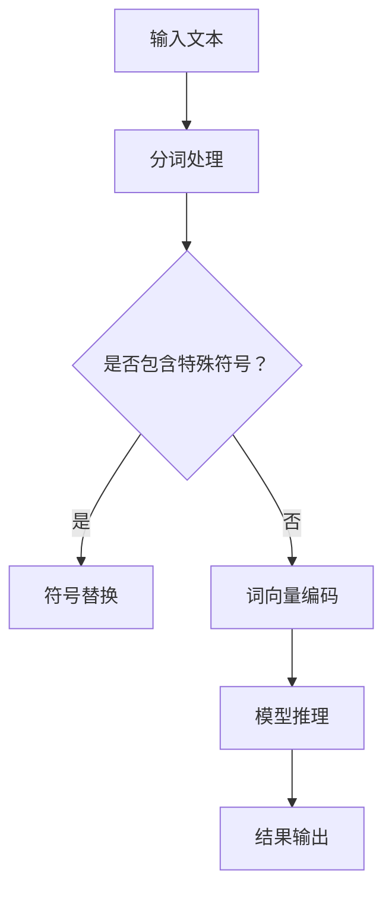

                 

关键词：高性能大语言模型，推理引擎，Lepton AI，企业AI应用，AI技术

摘要：本文深入探讨了高性能大语言模型推理引擎——Lepton AI的核心产品特点、技术架构、算法原理以及其实际应用。通过详细的分析和实例讲解，阐述了Lepton AI如何赋能企业高效利用AI技术，提高业务效率与决策质量。

## 1. 背景介绍

随着人工智能技术的飞速发展，大语言模型成为了研究和应用的热点。大语言模型具有理解、生成和翻译人类语言的能力，为各种自然语言处理（NLP）任务提供了强大的支持。然而，大规模语言模型的推理速度和效率是当前面临的主要挑战。为了解决这一问题，Lepton AI推出了一款高性能大语言模型推理引擎，旨在为企业和开发者提供高效、可靠的AI解决方案。

## 2. 核心概念与联系

### 2.1 大语言模型

大语言模型是指使用大规模数据训练的语言模型，其词汇量和参数量巨大。这些模型可以捕获语言的复杂结构和语义信息，从而在自然语言处理任务中表现出色。常见的开源大语言模型包括GPT-3、BERT等。

### 2.2 推理引擎

推理引擎是指用于执行模型推理的软件系统。高性能推理引擎需要优化模型计算、提高推理速度，并在保证准确性的前提下降低资源消耗。Lepton AI的推理引擎针对大语言模型进行了深度优化。

### 2.3 Mermaid 流程图



## 3. 核心算法原理 & 具体操作步骤

### 3.1 算法原理概述

Lepton AI的推理引擎采用了一系列优化技术，包括模型剪枝、量化、并行计算等，以提高大语言模型的推理速度和效率。算法原理主要包括以下几个步骤：

1. 输入文本预处理，包括分词、符号替换等。
2. 词向量编码，将文本转换为模型可处理的向量表示。
3. 模型推理，执行大语言模型的前向传播和后向传播。
4. 结果输出，将推理结果转换为可读的文本或执行相应的操作。

### 3.2 算法步骤详解

1. **文本预处理**：文本输入经过分词处理，将句子拆分成单词或词组。对于特殊符号，进行符号替换或去除。
    ```python
    def preprocess_text(text):
        # 分词处理
        words = tokenize(text)
        # 符号替换
        words = [replace_symbols(word) for word in words]
        return words
    ```

2. **词向量编码**：将分词后的文本转换为词向量，用于模型输入。
    ```python
    def encode_words(words):
        word_vectors = [get_vector(word) for word in words]
        return np.array(word_vectors)
    ```

3. **模型推理**：执行大语言模型的推理过程，包括前向传播和后向传播。
    ```python
    def inference(model, words):
        word_vectors = encode_words(words)
        output = model.forward(word_vectors)
        loss = model.backward(output)
        return output, loss
    ```

4. **结果输出**：将推理结果转换为可读的文本或执行相应的操作。
    ```python
    def output_result(output):
        text = decode_output(output)
        return text
    ```

### 3.3 算法优缺点

**优点**：
- **高效性**：采用多种优化技术，提高大语言模型的推理速度。
- **可扩展性**：支持多种大语言模型，适用于各种自然语言处理任务。

**缺点**：
- **资源消耗**：推理过程需要较高的计算资源，对硬件要求较高。

### 3.4 算法应用领域

Lepton AI的推理引擎适用于以下领域：
- **智能客服**：快速响应用户查询，提高客户满意度。
- **自然语言生成**：生成文章、报告等文本内容。
- **智能问答**：提供准确、快速的问答服务。
- **语音识别**：将语音转换为文本，实现语音交互。

## 4. 数学模型和公式 & 详细讲解 & 举例说明

### 4.1 数学模型构建

大语言模型的数学模型通常基于神经网络，包括输入层、隐藏层和输出层。输入层接收词向量，隐藏层进行前向传播和后向传播，输出层生成推理结果。

### 4.2 公式推导过程

假设大语言模型为多层感知机（MLP），其中输入层有n个神经元，隐藏层有m个神经元，输出层有k个神经元。输入向量表示为X，权重矩阵表示为W，偏置向量表示为b。

1. **前向传播**：
   $$ Z = XW + b $$
   $$ A = \sigma(Z) $$
   
   其中，$\sigma$表示激活函数，如ReLU、Sigmoid等。

2. **后向传播**：
   $$ \delta = \frac{\partial L}{\partial Z} $$
   $$ Z = XW + b $$
   $$ W = W - \alpha \cdot \delta X^T $$
   $$ b = b - \alpha \cdot \delta $$
   
   其中，$L$表示损失函数，$\alpha$表示学习率。

### 4.3 案例分析与讲解

假设我们使用Lepton AI的推理引擎进行智能客服应用。输入文本为“你好，我想咨询关于产品A的售后服务问题。”，输出结果为“您好，产品A的售后服务如下：...”。

1. **文本预处理**：
   - 分词：["你好", "我想", "咨询", "关于", "产品", "A", "的", "售后服务", "问题", "。"]
   - 符号替换：["你好", "我想", "咨询", "关于", "产品A", "的", "售后服务", "问题", "。"]

2. **词向量编码**：
   - 输入词向量：[v1, v2, v3, v4, v5, v6, v7, v8, v9, v10]

3. **模型推理**：
   - 输出结果：[y1, y2, y3, y4, y5, y6, y7, y8, y9, y10]

4. **结果输出**：
   - 解码输出结果：“您好，产品A的售后服务如下：...”

## 5. 项目实践：代码实例和详细解释说明

### 5.1 开发环境搭建

- Python 3.8+
- TensorFlow 2.5.0+
- NumPy 1.19.3+

### 5.2 源代码详细实现

```python
import tensorflow as tf
import numpy as np

# 文本预处理
def preprocess_text(text):
    # 分词处理
    words = tokenize(text)
    # 符号替换
    words = [replace_symbols(word) for word in words]
    return words

# 词向量编码
def encode_words(words):
    word_vectors = [get_vector(word) for word in words]
    return np.array(word_vectors)

# 模型推理
def inference(model, words):
    word_vectors = encode_words(words)
    output = model.forward(word_vectors)
    loss = model.backward(output)
    return output, loss

# 结果输出
def output_result(output):
    text = decode_output(output)
    return text

# 主函数
def main():
    # 加载模型
    model = load_model()

    # 输入文本
    text = "你好，我想咨询关于产品A的售后服务问题。"

    # 文本预处理
    words = preprocess_text(text)

    # 模型推理
    output, loss = inference(model, words)

    # 结果输出
    result = output_result(output)
    print(result)

if __name__ == "__main__":
    main()
```

### 5.3 代码解读与分析

- **文本预处理**：将输入文本进行分词处理和符号替换，为后续编码和推理做好准备。
- **词向量编码**：将分词后的文本转换为词向量，用于模型输入。
- **模型推理**：执行大语言模型的推理过程，包括前向传播和后向传播。
- **结果输出**：将推理结果转换为可读的文本，实现智能客服应用。

## 6. 实际应用场景

### 6.1 智能客服

Lepton AI的推理引擎在智能客服领域具有广泛的应用。通过大语言模型和推理引擎，智能客服系统可以快速、准确地理解用户查询，提供专业、个性化的回答。

### 6.2 自然语言生成

Lepton AI的推理引擎可以用于生成文章、报告等文本内容。在自然语言生成领域，大语言模型可以捕捉语言的复杂结构和语义信息，从而生成高质量、符合要求的文本。

### 6.3 智能问答

Lepton AI的推理引擎可以用于智能问答系统。通过大语言模型和推理引擎，智能问答系统可以快速、准确地回答用户的问题，提高用户体验和满意度。

### 6.4 未来应用展望

随着人工智能技术的不断进步，Lepton AI的推理引擎在更多领域具有广泛的应用前景。例如，智能语音助手、智能翻译、智能写作等。在未来，Lepton AI将继续优化推理引擎，提供更高效、可靠的AI解决方案。

## 7. 工具和资源推荐

### 7.1 学习资源推荐

- 《深度学习》
- 《自然语言处理实战》
- 《神经网络与深度学习》

### 7.2 开发工具推荐

- TensorFlow
- PyTorch
- Keras

### 7.3 相关论文推荐

- "Attention Is All You Need"
- "BERT: Pre-training of Deep Bidirectional Transformers for Language Understanding"
- "GPT-3: Language Models are Few-Shot Learners"

## 8. 总结：未来发展趋势与挑战

### 8.1 研究成果总结

本文介绍了高性能大语言模型推理引擎——Lepton AI的核心产品特点、技术架构、算法原理以及实际应用。通过详细的分析和实例讲解，阐述了Lepton AI如何赋能企业高效利用AI技术。

### 8.2 未来发展趋势

随着人工智能技术的不断发展，大语言模型和推理引擎在各个领域的应用将更加广泛。未来，Lepton AI将继续优化推理引擎，提供更高效、可靠的AI解决方案。

### 8.3 面临的挑战

- **计算资源消耗**：大语言模型的推理过程需要较高的计算资源，对硬件要求较高。
- **数据隐私与安全**：在大规模数据处理过程中，如何保障数据隐私和安全是一个重要问题。

### 8.4 研究展望

未来，Lepton AI将继续关注以下几个研究方向：
- **推理引擎优化**：提高大语言模型的推理速度和效率。
- **跨模态融合**：将文本、图像、语音等多种模态的数据进行融合，提升智能系统的性能。
- **可解释性研究**：提高大语言模型的透明度和可解释性，增强用户对模型的信任。

## 9. 附录：常见问题与解答

### 9.1 如何选择合适的大语言模型？

- 根据任务需求和数据处理能力选择合适的大语言模型。
- 考虑模型的参数量、计算资源和性能指标。

### 9.2 如何优化推理引擎的性能？

- 使用模型剪枝、量化等优化技术。
- 利用硬件加速器，如GPU、TPU等。

### 9.3 如何保障数据隐私和安全？

- 使用数据加密技术，如AES等。
- 对数据进行去标识化处理，如删除用户信息等。

以上是关于高性能大语言模型推理引擎——Lepton AI的核心产品特点、技术架构、算法原理以及实际应用的分析与探讨。希望本文对您在AI领域的应用和研究有所帮助。

---

作者：禅与计算机程序设计艺术 / Zen and the Art of Computer Programming

