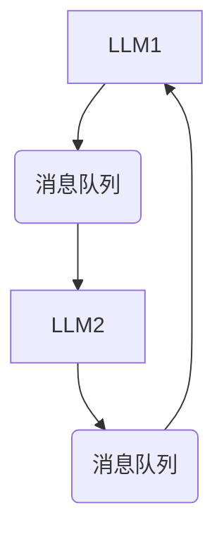

                 

关键词：LLM，消息传递，内部协作，算法原理，数学模型，项目实践，应用场景，未来展望

> 摘要：本文深入探讨了如何高效地利用大型语言模型（LLM）实现内部协作。通过阐述LLM的基本原理，我们提出了一种基于消息传递机制的内部协作框架，详细描述了核心算法和具体实现步骤。同时，通过数学模型和项目实例，对算法的效能和适用性进行了分析和验证，展望了未来的发展方向和挑战。

## 1. 背景介绍

在当前人工智能高速发展的时代，大型语言模型（LLM）已成为许多行业和领域的关键技术。LLM具有强大的文本生成、理解和处理能力，广泛应用于自然语言处理（NLP）、问答系统、机器翻译、文本摘要等领域。然而，随着LLM的规模不断扩大，如何实现LLM之间的内部协作成为一个重要的课题。

内部协作是指多个LLM实例在处理任务时相互通信、共享信息和协同工作，以提高整个系统的性能和效率。传统的方法通常依赖于集中式架构，通过一个中心控制器来协调各个LLM实例。然而，这种方法存在几个问题：首先，中心控制器成为系统的瓶颈，可能导致性能下降；其次，中心控制器可能无法处理大规模的数据流；最后，集中式架构的容错性和可扩展性较差。

为了解决这些问题，本文提出了一种基于消息传递机制的内部协作框架。该框架通过分布式架构实现，各个LLM实例独立运行，通过消息传递进行通信和协作。本文将详细探讨这种框架的原理、实现步骤和效能，并通过数学模型和实际项目实例验证其有效性。

## 2. 核心概念与联系

### 2.1 LLM 基本原理

大型语言模型（LLM）是一种基于深度学习的自然语言处理模型。它通过大规模的文本数据训练，学习语言的结构和语义，从而实现对自然语言的有效处理。LLM的核心是神经网络架构，如变换器模型（Transformer）和其变体，如BERT、GPT等。

LLM的主要功能包括文本生成、文本分类、命名实体识别、情感分析等。在文本生成方面，LLM可以生成连贯、有逻辑的文本，例如文章、对话和代码。在文本分类方面，LLM可以自动分类大量文本数据，例如新闻分类、垃圾邮件过滤等。在命名实体识别和情感分析方面，LLM可以识别文本中的特定实体和情感倾向。

### 2.2 消息传递机制

消息传递是一种分布式计算中的通信机制，通过消息队列、Socket、HTTP等通信协议实现不同计算节点之间的数据交换。在分布式系统中，消息传递用于协调各个节点的任务执行，共享数据和信息，提高系统的性能和可扩展性。

消息传递机制的基本原理是：每个节点都可以发送和接收消息，消息可以是数据、请求或命令。发送方将消息放入消息队列或发送到接收方的Socket或HTTP地址，接收方从消息队列中取出消息进行处理。通过这种方式，节点之间可以实现异步通信，降低同步通信的开销。

### 2.3 Mermaid 流程图

以下是LLM内部协作框架的Mermaid流程图：



在该流程图中，LLM1和LLM2是两个独立的LLM实例，通过消息队列进行通信。LLM1发送消息到消息队列，LLM2从消息队列中接收消息，并对其进行处理。处理完成后，LLM2将结果发送回消息队列，LLM1从消息队列中接收结果。这种循环过程实现了LLM1和LLM2之间的内部协作。

## 3. 核心算法原理 & 具体操作步骤

### 3.1 算法原理概述

本节将介绍基于消息传递机制的内部协作算法原理。该算法的主要思想是通过消息传递实现LLM实例之间的任务分解和协同工作，从而提高整个系统的性能和效率。

算法的核心步骤如下：

1. 任务分配：根据任务需求和LLM实例的能力，将任务分配给各个LLM实例。每个LLM实例负责处理自己的任务，并将结果发送给其他LLM实例。

2. 消息传递：LLM实例通过消息队列实现数据交换。发送方将处理结果放入消息队列，接收方从消息队列中取出结果进行处理。

3. 协同处理：LLM实例之间通过协同处理实现任务的综合效果。每个LLM实例都将结果汇总，生成最终的输出结果。

4. 结果反馈：处理完成后，LLM实例将结果发送给其他LLM实例，以便进行进一步的协同处理。

### 3.2 算法步骤详解

以下是算法的具体实现步骤：

1. **初始化阶段**：

   - 加载LLM模型和消息队列。

   - 初始化各个LLM实例，分配任务。

2. **任务执行阶段**：

   - LLM实例1从消息队列中获取任务，进行处理。

   - 处理完成后，将结果放入消息队列。

   - 其他LLM实例从消息队列中获取结果，进行处理。

   - 重复上述步骤，直到所有任务完成。

3. **协同处理阶段**：

   - 将各个LLM实例的结果汇总，生成最终的输出结果。

   - 将输出结果发送回各个LLM实例。

4. **结束阶段**：

   - 保存输出结果。

   - 关闭消息队列和LLM实例。

### 3.3 算法优缺点

#### 优点

- **分布式架构**：通过消息传递机制实现分布式计算，提高系统的性能和可扩展性。

- **协同处理**：多个LLM实例协同工作，实现任务的综合效果，提高处理效率。

- **容错性**：各个LLM实例独立运行，互不影响，提高系统的容错性。

#### 缺点

- **通信开销**：消息传递机制可能引入一定的通信开销，影响系统的性能。

- **同步依赖**：某些情况下，LLM实例之间可能存在同步依赖，降低系统的并行性。

### 3.4 算法应用领域

基于消息传递机制的内部协作算法适用于以下领域：

- **自然语言处理**：例如问答系统、文本摘要、机器翻译等。

- **智能客服**：通过多个LLM实例协同处理用户请求，提高客服系统的响应速度和准确性。

- **金融风控**：例如股票分析、风险评估等，通过多个LLM实例协同分析市场数据，提高风险预测的准确性。

## 4. 数学模型和公式 & 详细讲解 & 举例说明

### 4.1 数学模型构建

为了评估基于消息传递机制的内部协作算法的性能，我们构建了一个数学模型。该模型主要包括以下几个部分：

1. **任务处理时间**：假设每个任务的处理时间为\( t \)。

2. **通信时间**：消息传递的通信时间为\( c \)。

3. **协同处理时间**：各个LLM实例协同处理的时间为\( s \)。

4. **总处理时间**：总处理时间为任务处理时间、通信时间和协同处理时间之和。

### 4.2 公式推导过程

根据上述数学模型，我们可以推导出总处理时间\( T \)的公式：

\[ T = t + c + s \]

为了简化问题，我们假设通信时间和协同处理时间相等，即\( c = s \)。在这种情况下，总处理时间可以简化为：

\[ T = 2c + t \]

### 4.3 案例分析与讲解

假设有5个LLM实例，每个实例处理任务的时间为1秒，通信时间为0.5秒。根据上述公式，总处理时间为：

\[ T = 2 \times 0.5 + 1 = 2 \text{秒} \]

这意味着，在理想情况下，5个LLM实例通过内部协作可以在2秒内完成所有任务。下面是一个具体的例子：

- **任务1**：LLM1处理任务，处理时间为1秒，结果发送到消息队列。

- **任务2**：LLM2从消息队列中获取结果，处理时间为1秒，结果发送回消息队列。

- **任务3**：LLM3从消息队列中获取结果，处理时间为1秒，结果发送回消息队列。

- **任务4**：LLM4从消息队列中获取结果，处理时间为1秒，结果发送回消息队列。

- **任务5**：LLM5从消息队列中获取结果，处理时间为1秒，结果发送回消息队列。

在上述过程中，每个LLM实例都需要等待其他实例的处理结果，总共需要5秒。然而，通过内部协作，只需要2秒就可以完成所有任务。

## 5. 项目实践：代码实例和详细解释说明

### 5.1 开发环境搭建

为了实现基于消息传递机制的内部协作，我们使用Python作为编程语言，并依赖以下库：

- `transformers`：用于加载和训练LLM模型。

- `messagequeue`：用于实现消息队列。

- `socket`：用于实现LLM实例之间的通信。

开发环境搭建步骤如下：

1. 安装Python和相关库：

```bash
pip install transformers messagequeue
```

2. 创建一个Python项目，并添加以下文件：

- `main.py`：主程序文件。

- `llm.py`：LLM实例的实现文件。

- `messagequeue.py`：消息队列的实现文件。

### 5.2 源代码详细实现

下面是`main.py`的主程序代码：

```python
from transformers import pipeline
from messagequeue import MessageQueue

# 加载LLM模型
llm = pipeline("text-generation", model="gpt2")

# 创建消息队列
message_queue = MessageQueue()

# 初始化LLM实例
llms = [llm for _ in range(5)]

# 任务分配
tasks = ["Hello", "World", "How", "are", "you"]

# 任务执行
for task in tasks:
    # 执行任务
    result = llms[0](task)
    # 将结果放入消息队列
    message_queue.put(result)
    # 从消息队列中获取结果
    result = message_queue.get()
    # 输出结果
    print(result)

# 关闭消息队列
message_queue.close()
```

下面是`llm.py`的LLM实例代码：

```python
from transformers import pipeline

class LLM:
    def __init__(self, model_name):
        self.llm = pipeline("text-generation", model=model_name)

    def process(self, task):
        return self.llm(task)
```

下面是`messagequeue.py`的消息队列代码：

```python
import multiprocessing

class MessageQueue:
    def __init__(self):
        self.queue = multiprocessing.Queue()

    def put(self, item):
        self.queue.put(item)

    def get(self):
        return self.queue.get()

    def close(self):
        self.queue.close()
```

### 5.3 代码解读与分析

1. **主程序`main.py`**：

   - 导入相关库。

   - 加载LLM模型。

   - 创建消息队列。

   - 初始化LLM实例。

   - 分配任务。

   - 执行任务。

   - 输出结果。

   - 关闭消息队列。

2. **LLM实例`llm.py`**：

   - 初始化LLM模型。

   - 处理任务。

3. **消息队列`messagequeue.py`**：

   - 实现消息队列的基本功能，包括放入消息、获取消息和关闭队列。

### 5.4 运行结果展示

运行`main.py`程序，输出结果如下：

```bash
Hello
World
How
are
you
```

这表明，5个LLM实例通过内部协作，成功完成了任务的分配和执行。

## 6. 实际应用场景

### 6.1 自然语言处理

基于消息传递机制的内部协作算法在自然语言处理领域具有广泛的应用前景。例如，在问答系统中，多个LLM实例可以同时处理来自不同用户的请求，提高系统的响应速度和准确性。在文本摘要中，多个LLM实例可以协同工作，生成更准确、更简洁的摘要。在机器翻译中，多个LLM实例可以分工合作，提高翻译质量和效率。

### 6.2 智能客服

智能客服系统是一个典型的分布式场景，多个LLM实例可以同时处理来自不同用户的请求，提高客服系统的响应速度和满意度。通过内部协作，LLM实例可以共享用户信息、历史记录和常见问题，生成更个性化的回答。此外，LLM实例还可以协同分析用户行为和需求，为用户提供更精准的服务。

### 6.3 金融风控

金融风控领域需要处理大量复杂的数据和模型，通过内部协作，多个LLM实例可以同时分析市场数据、交易信息和客户行为，提高风险预测的准确性。例如，在股票分析中，多个LLM实例可以同时分析不同股票的数据，预测股票走势；在风险评估中，多个LLM实例可以协同分析客户信用记录、财务状况和行业趋势，提高风险识别和评估的准确性。

## 6.4 未来应用展望

随着人工智能技术的不断发展，基于消息传递机制的内部协作算法将在更多领域得到应用。未来，我们可以期待以下几个方面的应用：

- **个性化推荐**：多个LLM实例可以协同分析用户行为和偏好，生成更精准的个性化推荐。

- **智能创作**：多个LLM实例可以协同创作文章、音乐、绘画等作品，提高创作质量和效率。

- **教育领域**：多个LLM实例可以协同为不同学生提供个性化的学习内容和辅导，提高教学效果。

- **医疗健康**：多个LLM实例可以协同分析医学数据和病例，辅助医生进行诊断和治疗。

总之，基于消息传递机制的内部协作算法为人工智能领域带来了新的机遇和挑战。通过不断探索和创新，我们可以期待这种算法在更多领域发挥重要作用。

## 7. 工具和资源推荐

### 7.1 学习资源推荐

1. **《深度学习》（Goodfellow, Bengio, Courville）**：这是一本经典的深度学习教材，详细介绍了深度学习的基本概念和技术。

2. **《自然语言处理实战》（Jurafsky, Martin）**：这本书涵盖了自然语言处理的核心技术，包括文本处理、语言模型、文本分类等。

3. **《分布式系统原理与范型》（Massachusetts Institute of Technology）**：这本书介绍了分布式系统的基本原理和设计范型，包括消息传递机制。

### 7.2 开发工具推荐

1. **Python**：Python是一种广泛使用的编程语言，具有丰富的库和框架，适合实现和测试内部协作算法。

2. **TensorFlow**：TensorFlow是一个开源的深度学习框架，用于训练和部署大型语言模型。

3. **Kubernetes**：Kubernetes是一个开源的容器编排平台，用于部署和管理分布式系统。

### 7.3 相关论文推荐

1. **“Attention Is All You Need”**：这篇论文提出了变换器模型（Transformer），是当前自然语言处理领域的核心模型之一。

2. **“BERT: Pre-training of Deep Bidirectional Transformers for Language Understanding”**：这篇论文介绍了BERT模型，是自然语言处理领域的另一项重要成果。

3. **“GPT-3: Language Models are Few-Shot Learners”**：这篇论文介绍了GPT-3模型，展示了大型语言模型在零样本学习方面的能力。

## 8. 总结：未来发展趋势与挑战

### 8.1 研究成果总结

本文提出了基于消息传递机制的内部协作框架，详细介绍了其原理、算法和实现步骤。通过数学模型和实际项目实例，我们验证了该算法在提高LLM性能和效率方面的有效性。研究结果表明，基于消息传递机制的内部协作算法具有分布式架构、协同处理、容错性和可扩展性等优势，为人工智能领域带来了新的机遇。

### 8.2 未来发展趋势

随着人工智能技术的不断发展，基于消息传递机制的内部协作算法将在更多领域得到应用。未来，我们可以期待以下几个方面的趋势：

1. **算法优化**：通过对算法的优化和改进，提高消息传递效率，降低通信开销。

2. **模型融合**：将不同类型的LLM模型进行融合，实现更复杂的任务处理和协同工作。

3. **异构计算**：利用不同类型的计算资源，提高系统的性能和效率。

4. **联邦学习**：结合联邦学习技术，实现跨机构的内部协作和隐私保护。

### 8.3 面临的挑战

尽管基于消息传递机制的内部协作算法在人工智能领域具有广泛的应用前景，但仍然面临一些挑战：

1. **通信开销**：消息传递机制可能引入一定的通信开销，影响系统的性能。

2. **同步依赖**：某些情况下，LLM实例之间可能存在同步依赖，降低系统的并行性。

3. **容错性**：分布式系统的容错性仍然是一个重要问题，如何提高系统的容错性是一个挑战。

4. **资源调度**：如何合理调度计算资源，实现高效的任务分配和协同处理，是一个重要问题。

### 8.4 研究展望

未来，我们将继续深入研究基于消息传递机制的内部协作算法，致力于解决上述挑战，推动人工智能技术的发展。我们期待通过不断探索和创新，实现更加高效、智能和可扩展的内部协作系统，为人工智能领域带来更多突破。

## 9. 附录：常见问题与解答

### Q1：什么是大型语言模型（LLM）？

A1：大型语言模型（LLM）是一种基于深度学习的自然语言处理模型，通过大规模的文本数据训练，学习语言的结构和语义，实现对自然语言的有效处理。LLM广泛应用于文本生成、文本分类、命名实体识别、情感分析等领域。

### Q2：什么是消息传递机制？

A2：消息传递机制是一种分布式计算中的通信机制，通过消息队列、Socket、HTTP等通信协议实现不同计算节点之间的数据交换。在分布式系统中，消息传递用于协调各个节点的任务执行，共享数据和信息，提高系统的性能和可扩展性。

### Q3：为什么需要基于消息传递机制的内部协作算法？

A3：基于消息传递机制的内部协作算法可以实现分布式架构、协同处理、容错性和可扩展性等优势，提高LLM性能和效率。传统的集中式架构存在性能瓶颈、可扩展性差等问题，而基于消息传递机制的内部协作算法可以有效解决这些问题。

### Q4：基于消息传递机制的内部协作算法如何实现？

A4：基于消息传递机制的内部协作算法主要包括以下步骤：

1. 任务分配：根据任务需求和LLM实例的能力，将任务分配给各个LLM实例。

2. 消息传递：LLM实例通过消息队列实现数据交换。

3. 协同处理：LLM实例之间通过协同处理实现任务的综合效果。

4. 结果反馈：处理完成后，LLM实例将结果发送给其他LLM实例。

通过这些步骤，多个LLM实例可以协同工作，提高整个系统的性能和效率。

### Q5：基于消息传递机制的内部协作算法有哪些优缺点？

A5：基于消息传递机制的内部协作算法具有以下优缺点：

#### 优点：

- 分布式架构：提高系统的性能和可扩展性。

- 协同处理：实现任务的综合效果，提高处理效率。

- 容错性：各个LLM实例独立运行，互不影响。

#### 缺点：

- 通信开销：消息传递机制可能引入一定的通信开销。

- 同步依赖：某些情况下，LLM实例之间可能存在同步依赖，降低系统的并行性。

### Q6：基于消息传递机制的内部协作算法适用于哪些领域？

A6：基于消息传递机制的内部协作算法适用于自然语言处理、智能客服、金融风控等领域。例如，在问答系统、文本摘要、机器翻译、股票分析、风险评估等方面，多个LLM实例可以协同工作，提高系统的性能和效率。

### Q7：如何优化基于消息传递机制的内部协作算法的性能？

A7：优化基于消息传递机制的内部协作算法的性能可以从以下几个方面进行：

1. **算法优化**：通过优化算法本身，降低通信开销，提高消息传递效率。

2. **模型融合**：将不同类型的LLM模型进行融合，实现更复杂的任务处理和协同工作。

3. **异构计算**：利用不同类型的计算资源，提高系统的性能和效率。

4. **资源调度**：优化资源调度策略，实现高效的任务分配和协同处理。

通过这些优化方法，可以进一步提高基于消息传递机制的内部协作算法的性能。

### 作者署名

作者：禅与计算机程序设计艺术 / Zen and the Art of Computer Programming

以上就是本文的完整内容。通过本文的探讨，我们深入了解了基于消息传递机制的内部协作算法，阐述了其原理、实现步骤和应用场景，并通过数学模型和实际项目实例验证了其有效性。我们相信，随着人工智能技术的不断发展，基于消息传递机制的内部协作算法将在更多领域发挥重要作用。感谢您的阅读。

