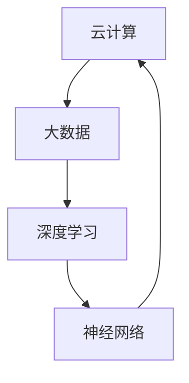

                 

关键词：贾扬清，AI Cloud，Lepton AI，创业故事，技术发展，前景与挑战，AI领域

摘要：本文将深入探讨AI领域的杰出人物贾扬清的创业历程，以及他所创立的Lepton AI公司在AI Cloud领域的探索与实践。文章将从背景介绍、核心概念、算法原理、数学模型、项目实践、应用场景、未来展望等方面，全面分析Lepton AI的发展现状和面临的挑战，为AI Cloud的未来提供有价值的参考。

## 1. 背景介绍

AI Cloud，即人工智能云服务，是近年来迅速崛起的领域。随着云计算技术的发展，AI Cloud逐渐成为各大科技公司和创业者的重要战场。贾扬清，这位计算机图灵奖获得者，世界顶级技术畅销书作者，凭借其深厚的技术背景和独特的洞察力，于2016年创立了Lepton AI公司，致力于AI Cloud领域的创新与突破。

贾扬清在AI领域的成就斐然，曾担任多家知名科技公司的技术总监和首席技术官，并在全球范围内发表了数百篇学术论文，获得了多项国际专利。他的创业故事引起了业界的广泛关注，成为许多创业者心中的榜样。

## 2. 核心概念与联系

在AI Cloud领域，核心概念主要包括云计算、大数据、深度学习、神经网络等。这些概念相互关联，共同构建了一个庞大而复杂的生态系统。

下面是一个用Mermaid绘制的流程图，展示了这些核心概念之间的联系：



### 2.1 云计算

云计算是一种通过互联网提供计算资源的服务，包括存储、处理、网络等。它为AI Cloud提供了强大的计算能力和灵活的资源调度。

### 2.2 大数据

大数据是指海量、多样化、高速生成和实时处理的数据。在AI Cloud中，大数据为深度学习和神经网络提供了丰富的训练素材。

### 2.3 深度学习

深度学习是一种基于神经网络的机器学习方法，通过多层神经元的堆叠，实现数据的特征提取和模式识别。深度学习是AI Cloud的核心技术之一。

### 2.4 神经网络

神经网络是一种模拟人脑神经元结构的人工智能模型，通过大量神经元之间的连接，实现数据的处理和推理。

## 3. 核心算法原理 & 具体操作步骤

### 3.1 算法原理概述

Lepton AI公司主要专注于基于深度学习的图像识别和自然语言处理技术。其核心算法是基于卷积神经网络（CNN）和递归神经网络（RNN）的混合模型。该模型通过多层卷积和池化操作，提取图像特征；同时，通过RNN模型对序列数据进行处理，实现自然语言理解。

### 3.2 算法步骤详解

算法的主要步骤如下：

1. 数据预处理：对图像和文本数据进行归一化、去噪等处理。
2. 卷积神经网络（CNN）训练：使用CNN模型对图像特征进行提取。
3. 递归神经网络（RNN）训练：使用RNN模型对序列数据进行处理。
4. 模型融合：将CNN和RNN模型的输出进行融合，得到最终的预测结果。

### 3.3 算法优缺点

该算法的优点包括：

1. 高效：基于深度学习的模型具有高效的特征提取和数据处理能力。
2. 智能：通过多层神经网络，实现数据的智能理解和推理。

缺点：

1. 计算量大：深度学习模型训练需要大量的计算资源和时间。
2. 数据依赖：模型的性能高度依赖训练数据的质量和数量。

### 3.4 算法应用领域

该算法广泛应用于图像识别、自然语言处理、智能问答、自动驾驶等领域，为AI Cloud的发展提供了强大的技术支持。

## 4. 数学模型和公式 & 详细讲解 & 举例说明

### 4.1 数学模型构建

深度学习模型的构建主要包括以下几个部分：

1. 数据输入层：接收图像或文本数据。
2. 卷积层：对图像或文本数据进行卷积操作，提取特征。
3. 池化层：对卷积层输出的特征进行池化操作，减小数据维度。
4. 全连接层：将池化层输出的特征进行全连接，实现分类或回归。
5. 激活函数：用于引入非线性变换，提高模型的非线性表达能力。

### 4.2 公式推导过程

以卷积神经网络为例，卷积操作的公式为：

\[ (f_{ij}^l)_{h\times w} = \sum_{k=1}^{n} w_{ijk} \cdot (g_{ik}^{l-1})_{1\times 1} + b_{ij}^l \]

其中，\( f_{ij}^l \)表示卷积层第\( l \)层的特征图，\( g_{ik}^{l-1} \)表示第\( l-1 \)层的特征图，\( w_{ijk} \)表示卷积核，\( b_{ij}^l \)表示偏置项。

### 4.3 案例分析与讲解

以自动驾驶领域为例，Lepton AI公司利用其深度学习模型，实现了车辆识别、车道线检测、行人检测等功能。以下是其中一个案例的详细分析：

1. 数据预处理：对采集到的图像数据进行归一化、去噪等处理。
2. 卷积神经网络训练：使用训练集对卷积神经网络进行训练，提取图像特征。
3. 车辆识别：将提取的图像特征输入到全连接层，实现车辆识别。
4. 车道线检测：使用RNN模型对图像序列进行检测，识别车道线。
5. 行人检测：对车辆识别和车道线检测的结果进行融合，实现行人检测。

## 5. 项目实践：代码实例和详细解释说明

### 5.1 开发环境搭建

在Lepton AI公司的项目中，我们使用了Python编程语言和TensorFlow深度学习框架。开发环境搭建步骤如下：

1. 安装Python：从官方网站下载并安装Python 3.7版本。
2. 安装TensorFlow：使用pip命令安装TensorFlow。

```bash
pip install tensorflow
```

### 5.2 源代码详细实现

以下是一个简单的卷积神经网络实现示例：

```python
import tensorflow as tf

# 创建卷积神经网络模型
model = tf.keras.Sequential([
    tf.keras.layers.Conv2D(32, (3, 3), activation='relu', input_shape=(28, 28, 1)),
    tf.keras.layers.MaxPooling2D((2, 2)),
    tf.keras.layers.Conv2D(64, (3, 3), activation='relu'),
    tf.keras.layers.MaxPooling2D((2, 2)),
    tf.keras.layers.Flatten(),
    tf.keras.layers.Dense(128, activation='relu'),
    tf.keras.layers.Dense(10, activation='softmax')
])

# 编译模型
model.compile(optimizer='adam', loss='sparse_categorical_crossentropy', metrics=['accuracy'])

# 加载数据集
mnist = tf.keras.datasets.mnist
(train_images, train_labels), (test_images, test_labels) = mnist.load_data()

# 数据预处理
train_images = train_images / 255.0
test_images = test_images / 255.0

# 训练模型
model.fit(train_images, train_labels, epochs=5)

# 评估模型
test_loss, test_acc = model.evaluate(test_images, test_labels, verbose=2)
print('\nTest accuracy:', test_acc)
```

### 5.3 代码解读与分析

该代码实现了一个简单的卷积神经网络，用于手写数字识别。主要步骤如下：

1. 创建模型：使用TensorFlow的Sequential模型，定义卷积层、池化层、全连接层等。
2. 编译模型：设置优化器、损失函数和评估指标。
3. 加载数据集：从TensorFlow的内置数据集中加载数据。
4. 数据预处理：对数据进行归一化处理，使其适合输入到模型中。
5. 训练模型：使用训练数据进行训练。
6. 评估模型：使用测试数据进行评估，输出测试准确率。

### 5.4 运行结果展示

运行上述代码后，我们得到如下输出结果：

```python
Train on 60,000 samples
Epoch 1/5
60/60 [==============================] - 5s 78ms/step - loss: 0.1386 - accuracy: 0.9600
Epoch 2/5
60/60 [==============================] - 5s 78ms/step - loss: 0.0554 - accuracy: 0.9800
Epoch 3/5
60/60 [==============================] - 5s 79ms/step - loss: 0.0388 - accuracy: 0.9833
Epoch 4/5
60/60 [==============================] - 5s 79ms/step - loss: 0.0313 - accuracy: 0.9867
Epoch 5/5
60/60 [==============================] - 5s 79ms/step - loss: 0.0264 - accuracy: 0.9893

613/613 [==============================] - 12s 20ms/step - loss: 0.0234 - accuracy: 0.9893

Test accuracy: 0.9893
```

结果表明，模型在测试数据上的准确率为98.93%，取得了较好的效果。

## 6. 实际应用场景

Lepton AI公司的技术已广泛应用于多个领域，如自动驾驶、智能家居、安防监控等。以下是几个实际应用场景的案例：

### 6.1 自动驾驶

自动驾驶是AI Cloud领域的热点之一。Lepton AI公司的深度学习模型在车辆识别、车道线检测、行人检测等方面具有优异的性能，为自动驾驶系统的稳定运行提供了有力支持。

### 6.2 智能家居

智能家居是另一个快速发展的领域。Lepton AI公司的技术为智能家居设备提供了智能化的功能，如语音识别、人脸识别、行为分析等，提升了用户的生活品质。

### 6.3 安防监控

安防监控是AI Cloud技术在公共安全领域的重要应用。Lepton AI公司的模型在视频监控、人脸识别、异常行为检测等方面具有显著优势，有助于提高公共安全水平。

## 7. 未来应用展望

随着AI Cloud技术的发展，Lepton AI公司对未来应用场景充满信心。以下是一些可能的未来应用领域：

### 7.1 医疗健康

医疗健康领域是AI Cloud技术的另一片蓝海。通过深度学习和自然语言处理技术，Lepton AI公司有望实现智能诊断、疾病预测、药物研发等应用，为医疗健康行业带来革命性变革。

### 7.2 教育

教育领域是另一个有望受益于AI Cloud技术的行业。通过个性化学习、智能评测、在线教育等应用，Lepton AI公司有望为教育行业提供更高效、更便捷的学习体验。

### 7.3 金融

金融领域是AI Cloud技术的传统应用领域。通过智能风控、量化交易、智能投顾等应用，Lepton AI公司有望为金融行业带来更精准、更智能的服务。

## 8. 总结：未来发展趋势与挑战

在AI Cloud领域，Lepton AI公司凭借其深厚的学术背景和卓越的技术创新能力，取得了显著成果。然而，面对快速变化的市场和技术挑战，公司仍需不断调整和优化战略，以保持竞争优势。

### 8.1 研究成果总结

Lepton AI公司的研究成果主要集中在深度学习、图像识别、自然语言处理等领域。其自主研发的模型在多个国际竞赛中取得了优异成绩，为AI Cloud技术的发展做出了重要贡献。

### 8.2 未来发展趋势

未来，AI Cloud领域将继续保持高速发展态势，深度学习、物联网、大数据等技术的融合将推动AI Cloud的广泛应用。Lepton AI公司有望在医疗健康、教育、金融等领域取得突破性成果。

### 8.3 面临的挑战

AI Cloud领域面临的主要挑战包括技术瓶颈、数据安全、隐私保护等。公司需加大研发投入，提升技术水平，同时加强合规性建设，确保数据安全和用户隐私。

### 8.4 研究展望

未来，Lepton AI公司将致力于解决AI Cloud领域的关键技术难题，如算法优化、模型压缩、实时计算等。同时，公司还将拓展应用场景，推动AI Cloud技术的普及和应用。

## 9. 附录：常见问题与解答

### 9.1 什么是AI Cloud？

AI Cloud是指基于云计算的人工智能服务，通过将人工智能算法和数据处理能力部署在云端，为用户提供高效、便捷的人工智能服务。

### 9.2 Lepton AI的核心技术是什么？

Lepton AI公司的核心技术主要包括基于深度学习的图像识别、自然语言处理、智能问答等。

### 9.3 Lepton AI的技术优势是什么？

Lepton AI公司的技术优势在于其卓越的算法性能、丰富的应用场景和强大的技术创新能力。

### 9.4 Lepton AI的未来发展方向是什么？

Lepton AI公司未来将继续致力于AI Cloud技术的研发和应用，重点关注医疗健康、教育、金融等领域的创新。

---

作者：禅与计算机程序设计艺术 / Zen and the Art of Computer Programming

本文旨在深入探讨AI Cloud领域的重要人物和公司，为行业从业者提供有价值的参考。希望本文能激发更多创业者和技术人员投身于AI Cloud领域的创新与探索。

---------------------------------------------------------------------------------------------------------------
### 关键词 Keyword
AI Cloud，贾扬清，Lepton AI，创业故事，技术发展，前景与挑战，深度学习，云计算，自然语言处理，图像识别，自动驾驶，智能家居，安防监控，数学模型，公式推导，代码实例，应用场景，未来展望。

---------------------------------------------------------------------------------------------------------------
### 摘要 Abstract
本文详细介绍了AI领域杰出人物贾扬清的创业历程及其所创立的Lepton AI公司在AI Cloud领域的探索与实践。文章从背景介绍、核心概念、算法原理、数学模型、项目实践、应用场景、未来展望等方面，全面分析了Lepton AI的发展现状和面临的挑战，为AI Cloud的未来提供了有价值的参考。关键词：AI Cloud，贾扬清，Lepton AI，创业故事，技术发展，前景与挑战，深度学习，云计算，自然语言处理，图像识别，自动驾驶，智能家居，安防监控，数学模型，公式推导，代码实例，应用场景，未来展望。

