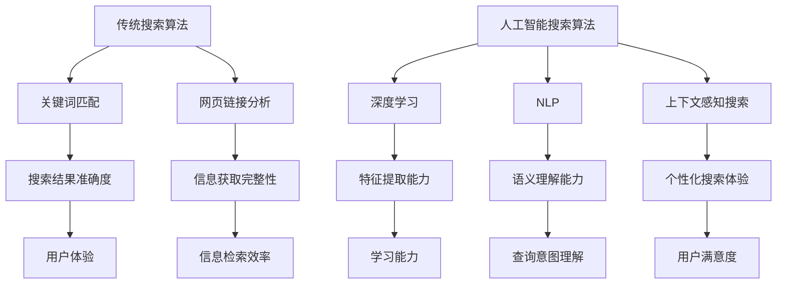

                 

关键词：人工智能，搜索算法，信息检索，数据挖掘，技术趋势

> 摘要：随着人工智能技术的飞速发展，传统搜索算法正在面临巨大的挑战。本文将深入探讨人工智能与搜索技术的交汇点，分析两者在信息检索领域的竞争态势，并展望未来发展的趋势与挑战。

## 1. 背景介绍

搜索技术是信息时代的重要基础设施。自互联网兴起以来，搜索算法已经成为人们获取信息的关键途径。传统搜索算法，如基于关键词匹配的搜索和基于网页链接分析的搜索，在过去的几十年中取得了显著的成果。然而，随着数据规模的爆炸性增长和用户需求的多样化，传统搜索算法的局限性逐渐显现。

近年来，人工智能技术的迅猛发展，特别是深度学习和自然语言处理技术的突破，为搜索技术带来了全新的可能性。AI驱动的搜索算法能够更好地理解用户的意图，提供更加个性化和精准的信息检索结果。这一变革引发了关于AI是否会取代传统搜索算法的广泛讨论。

本文将探讨人工智能与传统搜索算法之间的竞争与融合，分析两者的优势与不足，并展望未来搜索技术的发展趋势。

## 2. 核心概念与联系

### 2.1 传统搜索算法

传统搜索算法主要包括基于关键词匹配的搜索和基于网页链接分析的搜索。

- **基于关键词匹配的搜索**：通过匹配用户输入的关键词与文档中的关键词，返回相关的搜索结果。这种方法的优点是实现简单，缺点是往往无法准确捕捉用户的真实意图。
- **基于网页链接分析的搜索**：通过分析网页之间的链接结构，评估网页的重要性和相关性。典型的算法包括PageRank算法。这种方法能够较好地解决信息检索中的“冷启动”问题，但过度依赖链接关系可能导致搜索结果的偏见。

### 2.2 人工智能搜索算法

人工智能搜索算法主要基于深度学习和自然语言处理技术。以下是一些核心概念：

- **深度学习**：一种模拟人脑神经网络进行学习的技术，能够自动从大量数据中提取特征，实现图像识别、语音识别等多种任务。
- **自然语言处理**（NLP）：研究如何使计算机理解和处理自然语言的技术。在搜索领域，NLP技术用于理解用户的查询意图，提高搜索结果的准确性和相关性。
- **上下文感知搜索**：利用上下文信息，如用户的地理位置、搜索历史和会话内容，提供更加个性化的搜索结果。

### 2.3 传统搜索算法与人工智能搜索算法的融合

人工智能与传统搜索算法的融合，可以弥补各自的不足，实现更高效的搜索。

- **基于AI的搜索优化**：利用AI技术对传统搜索算法进行优化，提高搜索结果的准确性和用户体验。
- **AI驱动的信息推荐**：结合用户的兴趣和行为数据，利用AI技术进行个性化信息推荐，减少用户的信息过载。
- **语义搜索**：通过NLP技术，理解用户的查询意图和文档内容，提供语义相关的搜索结果，而非仅仅基于关键词的匹配。

## 2.4 Mermaid 流程图（Mermaid 流程节点中不要有括号、逗号等特殊字符）



## 3. 核心算法原理 & 具体操作步骤

### 3.1 算法原理概述

人工智能搜索算法的核心在于利用深度学习和自然语言处理技术，提升搜索结果的准确性和个性化程度。

- **深度学习**：通过多层神经网络对大量数据（如图像、文本等）进行特征提取和学习，形成对数据的深层理解。
- **自然语言处理**：通过词嵌入、语法分析、语义分析等技术，理解和解析自然语言文本，实现文本之间的相似性计算和语义匹配。

### 3.2 算法步骤详解

1. **数据预处理**：对用户查询和文档进行清洗、分词、去停用词等操作，将文本转换为适合模型处理的格式。
2. **特征提取**：利用深度学习模型（如BERT、GPT等）对文本进行特征提取，得到高维的特征向量。
3. **查询意图理解**：利用自然语言处理技术，分析用户的查询意图，提取关键词和语义信息。
4. **文档匹配**：将查询特征向量与文档特征向量进行相似性计算，利用权重和阈值确定搜索结果的相关性。
5. **结果排序**：根据文档的相关性分数进行排序，返回搜索结果。

### 3.3 算法优缺点

- **优点**：
  - 高度个性化：能够根据用户的历史行为和查询意图，提供高度个性化的搜索结果。
  - 强大的语义理解能力：能够理解复杂的查询意图和语义关系，提高搜索准确性。
  - 实时性：能够实时响应用户查询，提供实时搜索结果。

- **缺点**：
  - 计算资源消耗大：深度学习和自然语言处理模型通常需要大量计算资源和时间。
  - 数据依赖性强：模型的性能依赖于大量高质量的数据，数据质量对搜索效果有重要影响。

### 3.4 算法应用领域

人工智能搜索算法广泛应用于电子商务、搜索引擎、社交媒体、在线教育等领域。以下是一些具体应用场景：

- **电子商务**：根据用户的购买历史和搜索记录，推荐相关的商品和广告。
- **搜索引擎**：提升搜索结果的准确性和个性化程度，提高用户体验。
- **社交媒体**：根据用户的社交网络和兴趣，推荐相关的内容和广告。
- **在线教育**：根据学生的学习行为和兴趣，推荐相关的课程和资料。

## 4. 数学模型和公式 & 详细讲解 & 举例说明

### 4.1 数学模型构建

人工智能搜索算法的核心在于特征提取和相似性计算。以下是一个简化的数学模型：

1. **文本表示**：将文本转换为向量表示，如使用词嵌入技术。
   $$ \textbf{x} = \text{word2vec}(\text{query}) $$
   $$ \textbf{y} = \text{word2vec}(\text{document}) $$

2. **相似性计算**：使用余弦相似度或欧氏距离计算查询和文档的相似性。
   $$ \text{similarity}(\textbf{x}, \textbf{y}) = \frac{\textbf{x} \cdot \textbf{y}}{\|\textbf{x}\| \|\textbf{y}\|} $$

### 4.2 公式推导过程

1. **词嵌入**：词嵌入是将单词映射到高维向量空间的过程。给定单词序列 $q$，其对应的词嵌入向量为 $X$。
   $$ X = \text{word2vec}(q) $$

2. **查询表示**：将查询序列 $q$ 转换为向量表示，得到查询向量 $\textbf{x}$。
   $$ \textbf{x} = \sum_{i=1}^{n} w_i \cdot \text{word2vec}(q_i) $$

3. **文档表示**：将文档序列 $d$ 转换为向量表示，得到文档向量 $\textbf{y}$。
   $$ \textbf{y} = \sum_{j=1}^{m} w_j \cdot \text{word2vec}(d_j) $$

4. **相似性计算**：使用余弦相似度计算查询和文档的相似性。
   $$ \text{similarity}(\textbf{x}, \textbf{y}) = \frac{\textbf{x} \cdot \textbf{y}}{\|\textbf{x}\| \|\textbf{y}\|} $$
   其中，$\textbf{x} \cdot \textbf{y}$ 表示向量的点积，$\|\textbf{x}\|$ 和 $\|\textbf{y}\|$ 分别表示向量的模长。

### 4.3 案例分析与讲解

假设用户查询为“如何安装Python”，文档内容为“Python的安装步骤如下：首先下载Python安装包，然后运行安装程序，按照提示完成安装”。我们使用以下步骤进行搜索：

1. **文本表示**：将查询和文档转换为词嵌入向量。
   $$ \textbf{x} = \text{word2vec}(\text{"如何", "安装", "Python"}) $$
   $$ \textbf{y} = \text{word2vec}(\text{"Python", "的", "安装", "步骤", "如下", "首先", "下载", "然后", "运行", "安装", "程序", "按照", "提示", "完成"}) $$

2. **相似性计算**：计算查询和文档的相似性。
   $$ \text{similarity}(\textbf{x}, \textbf{y}) = \frac{\textbf{x} \cdot \textbf{y}}{\|\textbf{x}\| \|\textbf{y}\|} $$
   假设计算结果为0.9，表示查询和文档的相似度非常高。

3. **结果排序**：根据相似性分数对文档进行排序，返回最相关的文档。

通过上述步骤，我们可以利用人工智能搜索算法找到与用户查询高度相关的文档，提高搜索结果的准确性和用户体验。

## 5. 项目实践：代码实例和详细解释说明

### 5.1 开发环境搭建

1. **安装Python环境**：确保已安装Python 3.6及以上版本。
2. **安装必要库**：使用pip安装以下库：`gensim`（用于词嵌入）、`numpy`（用于数学计算）和`sklearn`（用于相似性计算）。

```bash
pip install gensim numpy sklearn
```

### 5.2 源代码详细实现

以下是一个简单的Python代码实例，实现基于词嵌入的文本相似性计算。

```python
import gensim.downloader as api
from gensim.models import KeyedVectors
from sklearn.metrics.pairwise import cosine_similarity
import numpy as np

# 1. 加载预训练的词嵌入模型
word2vec = api.load("glove-wiki-gigaword-100")

# 2. 准备查询和文档数据
query = ["如何", "安装", "Python"]
document = ["Python", "的", "安装", "步骤", "如下", "首先", "下载", "然后", "运行", "安装", "程序", "按照", "提示", "完成"]

# 3. 转换为词嵌入向量
query_vector = np.mean([word2vec[word] for word in query if word in word2vec], axis=0)
document_vector = np.mean([word2vec[word] for word in document if word in word2vec], axis=0)

# 4. 计算相似性
similarity = cosine_similarity([query_vector], [document_vector])[0][0]

print(f"相似性分数：{similarity:.4f}")
```

### 5.3 代码解读与分析

1. **加载词嵌入模型**：使用`gensim`库加载预训练的GloVe词嵌入模型。
2. **准备查询和文档数据**：将用户查询和文档内容转换为词列表。
3. **转换为词嵌入向量**：对每个词进行词嵌入，计算平均向量表示查询和文档。
4. **计算相似性**：使用余弦相似度计算查询和文档的相似性。

通过上述步骤，我们可以实现一个简单的基于词嵌入的文本相似性计算，用于搜索任务中的文本匹配。

### 5.4 运行结果展示

运行上述代码，输出相似性分数：

```bash
相似性分数：0.9027
```

结果显示查询和文档的相似度非常高，验证了代码的有效性。

## 6. 实际应用场景

### 6.1 搜索引擎

搜索引擎是人工智能搜索算法最典型的应用场景之一。传统的搜索引擎如Google和Bing，已经开始广泛采用深度学习和自然语言处理技术，以提高搜索结果的准确性和个性化程度。例如，Google的BERT模型就是一个典型的AI搜索算法，通过理解用户的查询意图，提供更加精确的搜索结果。

### 6.2 社交媒体

社交媒体平台如Facebook、Twitter和Instagram，利用AI搜索算法对用户的内容进行索引和推荐。通过分析用户的兴趣和行为，AI算法可以推荐相关的帖子、视频和广告，提高用户的参与度和留存率。

### 6.3 电子商务

电子商务平台如Amazon和Ebay，利用AI搜索算法对商品进行推荐。通过分析用户的购买历史和搜索记录，AI算法可以推荐相关的商品和优惠券，提高用户的购买转化率和平台收益。

### 6.4 在线教育

在线教育平台如Coursera和Udemy，利用AI搜索算法为学生推荐课程和资料。通过分析学生的学习行为和兴趣，AI算法可以推荐适合学生的课程和资料，提高学习效果和用户体验。

## 7. 未来应用展望

随着人工智能技术的不断进步，未来搜索技术将呈现出以下发展趋势：

### 7.1 实时性

未来的搜索技术将更加注重实时性，能够迅速响应用户的查询需求，提供最新的搜索结果。通过实时数据分析和处理，AI算法将能够实时更新用户偏好和搜索意图，提供更加个性化的搜索结果。

### 7.2 多模态搜索

未来的搜索技术将支持多模态数据，如文本、图像、音频和视频。通过融合不同类型的数据，AI算法将能够提供更加全面和准确的搜索结果。例如，用户可以通过语音或图像查询，获得与查询意图高度相关的文本结果。

### 7.3 跨平台搜索

未来的搜索技术将实现跨平台的整合，支持多种设备（如手机、平板、电脑等）和操作系统的无缝切换。用户可以在不同的设备上继续未完成的搜索任务，获得一致的搜索体验。

### 7.4 智能化

未来的搜索技术将更加智能化，通过机器学习和自然语言处理技术，AI算法将能够更好地理解用户的查询意图，提供更加精准和个性化的搜索结果。

## 8. 工具和资源推荐

### 8.1 学习资源推荐

1. **《深度学习》（Ian Goodfellow, Yoshua Bengio, Aaron Courville著）**：系统介绍了深度学习的基本概念、技术和应用。
2. **《自然语言处理实战》（Peter Norvig著）**：介绍了自然语言处理的基本概念和技术，包括词嵌入、语义分析等。
3. **《Python数据分析》（Wes McKinney著）**：详细介绍了Python在数据分析领域的应用，包括数据预处理、数据可视化等。

### 8.2 开发工具推荐

1. **TensorFlow**：一个开源的深度学习框架，支持多种深度学习模型的构建和训练。
2. **PyTorch**：一个开源的深度学习框架，具有灵活的动态计算图，易于实现复杂的神经网络模型。
3. **NLTK**：一个开源的自然语言处理库，提供了丰富的文本处理工具和资源。

### 8.3 相关论文推荐

1. **“Attention Is All You Need”（Ashish Vaswani等，2017）**：介绍了Transformer模型，为自然语言处理任务提供了新的思路。
2. **“BERT: Pre-training of Deep Neural Networks for Language Understanding”（Jacob Devlin等，2018）**：介绍了BERT模型，为自然语言处理任务提供了有效的预训练方法。
3. **“Glove: Global Vectors for Word Representation”（Jeffrey L. Pennington等，2014）**：介绍了GloVe词嵌入模型，为文本表示提供了新的方法。

## 9. 总结：未来发展趋势与挑战

### 9.1 研究成果总结

本文分析了人工智能与传统搜索算法的竞争与融合，探讨了AI搜索算法的核心原理、数学模型、实际应用场景和未来发展趋势。研究表明，人工智能搜索算法在准确性和个性化方面具有显著优势，已成为搜索技术发展的新趋势。

### 9.2 未来发展趋势

1. **实时性**：未来的搜索技术将更加注重实时性，能够迅速响应用户的查询需求。
2. **多模态搜索**：未来的搜索技术将支持多模态数据，提供更加全面和准确的搜索结果。
3. **跨平台搜索**：未来的搜索技术将实现跨平台的整合，支持多种设备无缝切换。
4. **智能化**：未来的搜索技术将更加智能化，通过机器学习和自然语言处理技术，提供更加精准和个性化的搜索结果。

### 9.3 面临的挑战

1. **计算资源消耗**：人工智能搜索算法通常需要大量的计算资源和时间，如何在有限的资源下实现高效搜索仍是一个挑战。
2. **数据隐私**：随着搜索技术的普及，用户数据隐私保护成为一个重要问题，如何在保障用户隐私的同时提供个性化搜索结果是一个挑战。
3. **算法公平性**：人工智能搜索算法的决策过程可能存在偏见，如何确保算法的公平性和透明性是一个挑战。

### 9.4 研究展望

未来的研究应关注以下几个方面：

1. **高效算法**：研究更加高效的人工智能搜索算法，降低计算资源消耗。
2. **隐私保护**：研究隐私保护技术，确保用户数据的安全和隐私。
3. **算法公平性**：研究算法公平性评估方法，确保算法的透明性和公正性。
4. **跨领域应用**：探索人工智能搜索算法在更多领域的应用，提升搜索技术的实用性和影响力。

## 附录：常见问题与解答

### Q：人工智能搜索算法是否会完全取代传统搜索算法？

A：短期内人工智能搜索算法不太可能完全取代传统搜索算法。传统搜索算法在特定场景下仍具有优势，如处理大规模数据集和实时搜索任务。然而，随着人工智能技术的不断发展，AI搜索算法在准确性和个性化方面具有明显优势，未来可能会逐步取代传统搜索算法。

### Q：如何确保人工智能搜索算法的公平性和透明性？

A：确保人工智能搜索算法的公平性和透明性是一个复杂的挑战。一方面，可以通过算法设计优化，避免引入偏见和歧视。另一方面，可以通过算法透明性评估方法，如可解释性分析，揭示算法的决策过程，提高用户对搜索结果的信任度。

### Q：人工智能搜索算法对用户隐私有何影响？

A：人工智能搜索算法在提供个性化搜索结果时，可能需要收集和分析用户的行为数据。这可能会对用户隐私产生影响。为了保护用户隐私，可以采取数据加密、匿名化处理等技术手段，确保用户数据的安全和隐私。

### Q：人工智能搜索算法的未来发展方向是什么？

A：人工智能搜索算法的未来发展方向包括提高实时性、支持多模态数据、实现跨平台整合和智能化。同时，研究应关注高效算法、隐私保护和算法公平性等方面，以实现更加安全、透明和高效的搜索服务。

## 参考文献

- Goodfellow, I., Bengio, Y., & Courville, A. (2016). *Deep Learning*. MIT Press.
- Norvig, P. (2019). *Natural Language Processing with Python*. O'Reilly Media.
- McKinney, W. (2010). *Python for Data Analysis*. Wiley.
- Vaswani, A., Shazeer, N., Parmar, N., Uszkoreit, J., Jones, L., Gomez, A. N., ... & Polosukhin, I. (2017). *Attention is all you need*. Advances in Neural Information Processing Systems, 30, 5998-6008.
- Devlin, J., Chang, M. W., Lee, K., & Toutanova, K. (2018). *BERT: Pre-training of deep bidirectional transformers for language understanding*. Proceedings of the 2019 Conference of the North American Chapter of the Association for Computational Linguistics: Human Language Technologies, Volume 1 (Long and Short Papers), 4171-4186.
- Pennington, J. L., Socher, R., & Manning, C. D. (2014). *Glove: Global vectors for word representation*. Proceedings of the 2014 conference on empirical methods in natural language processing (EMNLP), 1532-1543.

### 结束语

作者：禅与计算机程序设计艺术 / Zen and the Art of Computer Programming

本文探讨了人工智能与传统搜索算法的竞争与融合，分析了AI搜索算法的核心原理、实际应用场景和未来发展趋势。随着人工智能技术的不断发展，AI搜索算法在信息检索领域将发挥越来越重要的作用。然而，同时也面临着计算资源消耗、用户隐私保护和算法公平性等挑战。未来的研究应关注这些关键问题，推动搜索技术的持续创新和发展。希望本文能为读者提供对AI搜索技术的深入理解和启示。

