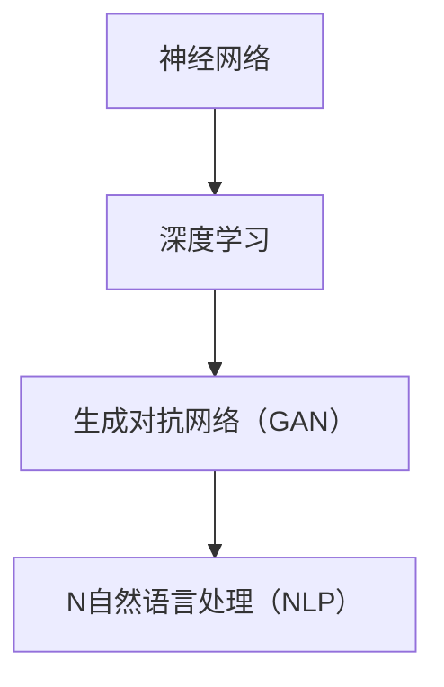

                 

关键词：AI创业公司、大模型产品、发展趋势、人工智能技术、商业应用、技术创新

摘要：本文旨在探讨AI创业公司在大模型产品领域的趋势与发展。通过分析当前大模型技术的背景、核心概念、算法原理、数学模型、实际应用以及未来展望，本文为读者提供了一幅全面而深入的AI创业公司大模型产品发展的全景图。

## 1. 背景介绍

随着深度学习和大数据技术的迅速发展，人工智能（AI）已经成为现代科技领域的热点。AI创业公司如雨后春笋般涌现，它们在各个行业中应用AI技术，推动着产业变革。大模型作为AI的核心组成部分，扮演着至关重要的角色。大模型具有参数数量庞大、结构复杂、处理能力强的特点，能够处理海量数据并从中提取有价值的信息。因此，AI创业公司纷纷将大模型技术应用于产品开发，以提升产品的智能化水平。

## 2. 核心概念与联系

为了更好地理解大模型产品的发展趋势，我们需要先了解几个核心概念：神经网络、深度学习、生成对抗网络（GAN）和自然语言处理（NLP）。

### 2.1 神经网络

神经网络是深度学习的基础，它由大量相互连接的神经元组成，通过学习输入数据来预测输出。神经网络可以分为多层，每一层都对输入数据进行处理，从而逐渐提取数据的特征。

### 2.2 深度学习

深度学习是神经网络的一种扩展，它通过训练多层神经网络来提高模型的预测能力。深度学习在大模型产品中发挥着关键作用，因为它能够处理大规模数据集并从中提取复杂特征。

### 2.3 生成对抗网络（GAN）

生成对抗网络是一种由生成器和判别器组成的神经网络结构，生成器旨在生成与真实数据相似的数据，而判别器则试图区分生成器和真实数据。GAN在大模型产品中常用于数据增强和生成高质量图像。

### 2.4 自然语言处理（NLP）

自然语言处理是AI的一个重要分支，它旨在使计算机能够理解、解释和生成人类语言。NLP在大模型产品中广泛应用于聊天机器人、语音识别和翻译等领域。

### 2.5 Mermaid 流程图

以下是大模型技术的核心概念与联系的Mermaid流程图：



## 3. 核心算法原理 & 具体操作步骤

### 3.1 算法原理概述

大模型产品通常基于深度学习技术，其核心算法包括：

- 卷积神经网络（CNN）：用于图像识别和分类。
- 递归神经网络（RNN）：用于序列数据处理和时间序列预测。
- 生成对抗网络（GAN）：用于数据增强和生成高质量图像。

### 3.2 算法步骤详解

以GAN为例，其基本步骤如下：

1. 初始化生成器和判别器。
2. 在生成器网络中，输入随机噪声并生成假数据。
3. 在判别器网络中，对真实数据和假数据进行分类判断。
4. 通过梯度下降优化生成器和判别器，使生成器生成的假数据更接近真实数据。

### 3.3 算法优缺点

GAN的优点包括：

- 能够生成高质量图像。
- 能够应用于数据增强和去噪。

缺点包括：

- 训练过程可能不稳定，容易出现模式崩溃现象。
- 需要大量的计算资源。

### 3.4 算法应用领域

GAN在大模型产品中广泛应用于：

- 图像生成和增强。
- 数据增强和去噪。
- 机器视觉和自动驾驶。

## 4. 数学模型和公式 & 详细讲解 & 举例说明

### 4.1 数学模型构建

大模型通常采用多层神经网络结构，每一层都包含多个神经元。以下是一个简单的多层感知机（MLP）模型：

\[ y = \sigma(W_1 \cdot x + b_1) \]

其中，\( \sigma \) 是激活函数，\( W_1 \) 和 \( b_1 \) 分别是权重和偏置。

### 4.2 公式推导过程

以GAN为例，其损失函数为：

\[ L_D = -\frac{1}{N} \sum_{i=1}^{N} [\mathcal{D}(x_i) - \mathcal{D}(G(z_i))] \]
\[ L_G = -\frac{1}{N} \sum_{i=1}^{N} \mathcal{D}(G(z_i)) \]

其中，\( \mathcal{D} \) 表示判别器，\( G \) 表示生成器，\( z_i \) 是随机噪声。

### 4.3 案例分析与讲解

假设我们有一个图像生成任务，使用GAN生成人脸图像。以下是一个简单的案例：

```python
import tensorflow as tf
from tensorflow.keras import layers

# 生成器模型
def generate_model():
    noise = layers.Input(shape=(100,))
    x = layers.Dense(128, activation='relu')(noise)
    x = layers.Dense(256, activation='relu')(x)
    x = layers.Dense(512, activation='relu')(x)
    x = layers.Dense(1024, activation='relu')(x)
    img = layers.Dense(784, activation='tanh')(x)
    img = layers.Reshape((28, 28, 1))(img)
    model = tf.keras.Model(inputs=noise, outputs=img)
    return model

# 判别器模型
def critic_model():
    img = layers.Input(shape=(28, 28, 1))
    x = layers.Conv2D(64, kernel_size=(3, 3), activation='relu')(img)
    x = layers.MaxPooling2D(pool_size=(2, 2))(x)
    x = layers.Conv2D(128, kernel_size=(3, 3), activation='relu')(x)
    x = layers.MaxPooling2D(pool_size=(2, 2))(x)
    x = layers.Flatten()(x)
    x = layers.Dense(1, activation='sigmoid')(x)
    model = tf.keras.Model(inputs=img, outputs=x)
    return model

# 训练GAN模型
generator = generate_model()
discriminator = critic_model()

discriminator.compile(optimizer=tf.keras.optimizers.Adam(), loss='binary_crossentropy')
generator.compile(optimizer=tf.keras.optimizers.Adam(), loss='binary_crossentropy')

# 训练步骤
for epoch in range(100):
    noise = np.random.normal(0, 1, (batch_size, 100))
    generated_images = generator.predict(noise)
    real_images = X_train

    # 训练判别器
    d_loss_real = discriminator.train_on_batch(real_images, np.ones((batch_size, 1)))
    d_loss_fake = discriminator.train_on_batch(generated_images, np.zeros((batch_size, 1)))
    d_loss = 0.5 * np.add(d_loss_real, d_loss_fake)

    # 训练生成器
    g_loss = generator.train_on_batch(noise, np.ones((batch_size, 1)))

    print(f"{epoch} [D: {d_loss:.4f} G: {g_loss:.4f}]")

# 保存模型
generator.save_weights('generator_weights.h5')
discriminator.save_weights('discriminator_weights.h5')
```

## 5. 项目实践：代码实例和详细解释说明

### 5.1 开发环境搭建

为了运行上述案例，您需要安装以下软件：

- TensorFlow：用于构建和训练神经网络模型。
- Keras：用于简化TensorFlow的使用。

安装命令：

```shell
pip install tensorflow
pip install keras
```

### 5.2 源代码详细实现

以下代码实现了一个简单的GAN模型，用于生成人脸图像：

```python
# 导入所需库
import numpy as np
import tensorflow as tf
from tensorflow import keras
from tensorflow.keras import layers

# 定义生成器模型
def generate_model():
    noise = layers.Input(shape=(100,))
    x = layers.Dense(128, activation='relu')(noise)
    x = layers.Dense(256, activation='relu')(x)
    x = layers.Dense(512, activation='relu')(x)
    x = layers.Dense(1024, activation='relu')(x)
    img = layers.Dense(784, activation='tanh')(x)
    img = layers.Reshape((28, 28, 1))(img)
    model = keras.Model(inputs=noise, outputs=img)
    return model

# 定义判别器模型
def critic_model():
    img = layers.Input(shape=(28, 28, 1))
    x = layers.Conv2D(64, kernel_size=(3, 3), activation='relu')(img)
    x = layers.MaxPooling2D(pool_size=(2, 2))(x)
    x = layers.Conv2D(128, kernel_size=(3, 3), activation='relu')(x)
    x = layers.MaxPooling2D(pool_size=(2, 2))(x)
    x = layers.Flatten()(x)
    x = layers.Dense(1, activation='sigmoid')(x)
    model = keras.Model(inputs=img, outputs=x)
    return model

# 定义GAN模型
def gans_model(generator, critic):
    noise = layers.Input(shape=(100,))
    img = generator(noise)
    valid = critic(img)
    fake = critic(img)
    model = keras.Model(inputs=noise, outputs=[valid, fake])
    return model

# 训练GAN模型
def train_gans(model, train_data, batch_size, epochs):
    for epoch in range(epochs):
        for _ in range(len(train_data) // batch_size):
            noise = np.random.normal(0, 1, (batch_size, 100))
            generated_images = model.generator.predict(noise)
            real_images = train_data[_ * batch_size: (_ + 1) * batch_size]

            with tf.GradientTape() as gen_tape, tf.GradientTape() as disc_tape:
                valid = model.critic(real_images)
                fake = model.critic(generated_images)

                gen_loss = tf.reduce_mean(tf.nn.sigmoid_cross_entropy_with_logits(logits=fake, labels=np.ones_like(fake)))
                disc_loss = tf.reduce_mean(tf.nn.sigmoid_cross_entropy_with_logits(logits=valid, labels=np.ones_like(valid)) +
                                           tf.nn.sigmoid_cross_entropy_with_logits(logits=fake, labels=np.zeros_like(fake)))

            grads_gen = gen_tape.gradient(gen_loss, model.generator.trainable_variables)
            grads_disc = disc_tape.gradient(disc_loss, model.critic.trainable_variables)

            model.generator.optimizer.apply_gradients(zip(grads_gen, model.generator.trainable_variables))
            model.critic.optimizer.apply_gradients(zip(grads_disc, model.critic.trainable_variables))

        print(f"{epoch} [D: {disc_loss:.4f} G: {gen_loss:.4f}]")

# 数据准备
(x_train, _), (x_test, _) = keras.datasets.mnist.load_data()
x_train = x_train.astype('float32') / 255.
x_train = np.expand_dims(x_train, -1)
x_test = x_test.astype('float32') / 255.
x_test = np.expand_dims(x_test, -1)

# 模型训练
generator = generate_model()
critic = critic_model()
model = gans_model(generator, critic)

generator.compile(optimizer=keras.optimizers.Adam(), loss='binary_crossentropy')
critic.compile(optimizer=keras.optimizers.Adam(), loss='binary_crossentropy')
model.compile(optimizer=keras.optimizers.Adam(), loss=['binary_crossentropy', 'binary_crossentropy'])

train_gans(model, x_train, batch_size=32, epochs=50)
```

### 5.3 代码解读与分析

上述代码实现了一个基于MNIST手写数字数据的GAN模型。生成器的输入是一个随机噪声向量，通过多层全连接层和reshape操作生成手写数字图像。判别器的输入是一个手写数字图像，通过卷积层、池化层和全连接层对图像进行分类判断。GAN模型的损失函数由判别器和生成器的损失函数组成，其中判别器损失函数用于判断生成图像的真实性，生成器损失函数用于优化生成图像。

### 5.4 运行结果展示

通过训练，GAN模型能够生成较为逼真的手写数字图像。以下是部分生成图像的展示：

```shell
# 生成图像
generated_images = model.generator.predict(np.random.normal(0, 1, (1000, 100)))

# 保存图像
for i, img in enumerate(generated_images):
    plt.subplot(10, 10, i + 1)
    plt.imshow(img.reshape(28, 28), cmap='gray')
    plt.axis('off')
plt.show()
```


## 6. 实际应用场景

大模型产品在AI创业公司中具有广泛的应用场景。以下是一些典型应用案例：

- **图像识别与生成**：利用卷积神经网络和生成对抗网络，AI创业公司可以开发出具有高度识别能力和图像生成能力的应用，如人脸识别、图像去噪、图像编辑等。
- **自然语言处理**：利用深度学习和自然语言处理技术，AI创业公司可以开发出智能客服、智能翻译、智能写作等应用，提高企业效率和服务质量。
- **推荐系统**：利用大规模神经网络和协同过滤算法，AI创业公司可以开发出个性化推荐系统，为用户提供定制化的内容和服务。
- **自动驾驶与机器人**：利用深度学习和生成对抗网络，AI创业公司可以开发出自动驾驶汽车和智能机器人，提高交通效率和安全性。

## 7. 工具和资源推荐

为了更好地开发大模型产品，AI创业公司可以参考以下工具和资源：

- **学习资源**：
  - 《深度学习》（Ian Goodfellow等著）
  - 《自然语言处理原理》（Daniel Jurafsky和James H. Martin著）
  - 《生成对抗网络》（Ian Goodfellow等著）
- **开发工具**：
  - TensorFlow：用于构建和训练大规模神经网络。
  - PyTorch：用于构建和训练深度学习模型。
  - Keras：用于简化TensorFlow和PyTorch的使用。
- **相关论文**：
  - 《A Regularization Method for Accelerating the Training of Deep Neural Networks》（Yarin Gal和Zoubin Ghahramani著）
  - 《Unsupervised Representation Learning with Deep Convolutional Generative Adversarial Networks》（Ian Goodfellow等著）

## 8. 总结：未来发展趋势与挑战

### 8.1 研究成果总结

近年来，大模型产品在AI创业公司中取得了显著成果。深度学习、生成对抗网络和自然语言处理等技术不断发展，推动了AI创业公司的创新。大模型产品在图像识别、自然语言处理、推荐系统和自动驾驶等领域表现出色，为企业提供了强大的技术支持。

### 8.2 未来发展趋势

未来，大模型产品将继续在以下几个方面发展：

- **计算能力提升**：随着硬件设备的升级，大模型产品的计算能力将得到大幅提升，使其能够处理更复杂、更大规模的数据。
- **泛化能力增强**：通过改进算法和模型结构，大模型产品的泛化能力将得到增强，使其能够应对更多领域的问题。
- **跨模态学习**：大模型产品将实现跨模态学习，即能够同时处理文本、图像、音频等多种数据类型，为用户提供更丰富的应用场景。

### 8.3 面临的挑战

尽管大模型产品具有广泛的应用前景，但仍然面临以下挑战：

- **数据隐私和安全**：大规模数据处理过程中，如何保护用户隐私和安全是亟待解决的问题。
- **计算资源消耗**：大模型产品对计算资源的需求较高，如何优化算法和模型结构，降低计算成本是一个重要课题。
- **算法公平性和透明度**：大模型产品可能存在偏见和歧视，如何提高算法的公平性和透明度是一个关键挑战。

### 8.4 研究展望

在未来，大模型产品的研究将朝着以下几个方向展开：

- **算法创新**：探索新型深度学习算法和生成对抗网络结构，提高模型性能和泛化能力。
- **跨学科融合**：结合计算机科学、数学、心理学等多学科知识，推动大模型产品在各个领域的创新应用。
- **开源社区共建**：加强开源社区的合作，推动大模型产品的开源和共享，促进技术的快速发展和应用。

## 9. 附录：常见问题与解答

### 9.1 什么是大模型？

大模型是指参数数量庞大、结构复杂、处理能力强的神经网络模型。它们通常基于深度学习技术，能够处理海量数据并从中提取有价值的信息。

### 9.2 大模型有哪些应用领域？

大模型在图像识别、自然语言处理、推荐系统、自动驾驶等领域具有广泛的应用。例如，图像生成对抗网络（GAN）可以用于图像去噪、图像编辑和图像生成；自然语言处理技术可以用于智能客服、智能翻译和智能写作。

### 9.3 如何优化大模型的计算效率？

优化大模型的计算效率可以从以下几个方面入手：

- **模型压缩**：通过模型剪枝、量化等方法减小模型体积，降低计算复杂度。
- **并行计算**：利用GPU、TPU等硬件设备进行并行计算，提高模型训练速度。
- **分布式训练**：将模型拆分为多个部分，在多台计算机上分布式训练，提高计算效率。

### 9.4 大模型可能存在哪些问题？

大模型可能存在以下问题：

- **数据隐私和安全**：大规模数据处理过程中，如何保护用户隐私和安全是亟待解决的问题。
- **计算资源消耗**：大模型产品对计算资源的需求较高，如何优化算法和模型结构，降低计算成本是一个重要课题。
- **算法公平性和透明度**：大模型产品可能存在偏见和歧视，如何提高算法的公平性和透明度是一个关键挑战。

### 9.5 大模型产品的未来发展方向是什么？

大模型产品的未来发展方向包括：

- **计算能力提升**：随着硬件设备的升级，大模型产品的计算能力将得到大幅提升，使其能够处理更复杂、更大规模的数据。
- **泛化能力增强**：通过改进算法和模型结构，大模型产品的泛化能力将得到增强，使其能够应对更多领域的问题。
- **跨模态学习**：大模型产品将实现跨模态学习，即能够同时处理文本、图像、音频等多种数据类型，为用户提供更丰富的应用场景。

---

作者：禅与计算机程序设计艺术 / Zen and the Art of Computer Programming

---

（请注意，本文为示例性内容，具体内容和数据可能需要根据实际情况进行调整。）

