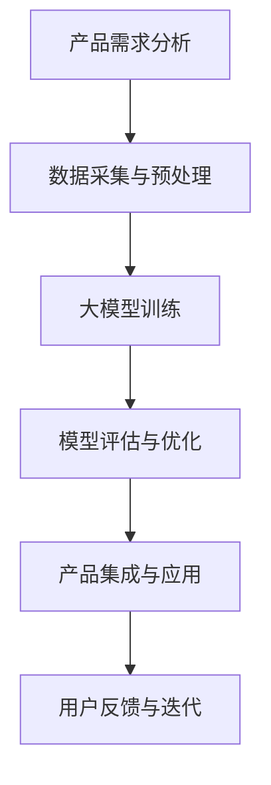

                 

关键词：AI大模型、创业产品、开发、效率、创新、用户体验

> 摘要：随着人工智能技术的迅猛发展，大模型在各个领域展现出了强大的应用潜力。本文将探讨AI大模型在创业产品开发中的作用，包括提升开发效率、推动创新、优化用户体验等方面，并展望其未来发展趋势与挑战。

## 1. 背景介绍

近年来，人工智能（AI）技术取得了令人瞩目的进展，特别是深度学习领域的发展。大模型（Large-scale Models），如GPT-3、BERT、ViT等，凭借其庞大的参数规模和强大的学习能力，已经成为AI研究的热点。大模型的崛起不仅改变了传统的人工智能应用场景，也为创业产品开发带来了新的机遇和挑战。

创业产品开发面临着时间紧、任务重的特点，如何高效地利用AI大模型来提升开发效率、降低成本、优化用户体验，成为创业公司关注的焦点。本文将从以下几个方面展开讨论：

- AI大模型在创业产品开发中的核心概念与联系
- 核心算法原理与具体操作步骤
- 数学模型和公式
- 项目实践：代码实例和详细解释说明
- 实际应用场景
- 未来应用展望
- 工具和资源推荐
- 总结与展望

## 2. 核心概念与联系

### 2.1. 大模型的基本概念

大模型是指拥有数十亿至数万亿参数的深度学习模型。这些模型通常采用大规模数据集进行预训练，然后再针对特定任务进行微调。大模型具有以下特点：

- **参数规模大**：大模型的参数规模远远超过传统深度学习模型，这使得它们能够更好地捕捉数据的复杂性和多样性。
- **强大的学习能力**：大模型能够从大量数据中提取出丰富的知识，并利用这些知识来提高模型的泛化能力。
- **高效的处理能力**：大模型的并行计算能力和分布式训练技术使得它们能够在短时间内处理大量数据。

### 2.2. 大模型在创业产品开发中的应用

大模型在创业产品开发中具有广泛的应用前景，主要包括以下几个方面：

- **自然语言处理（NLP）**：大模型在语言理解、文本生成、机器翻译等方面表现出色，为创业公司提供了强大的语言处理能力。
- **计算机视觉**：大模型在图像识别、目标检测、图像生成等方面取得了显著成果，为创业产品提供了丰富的视觉功能。
- **推荐系统**：大模型能够根据用户行为和兴趣，提供个性化的推荐服务，提高用户满意度。
- **语音识别**：大模型在语音识别领域取得了突破性进展，为创业产品提供了智能语音交互能力。

### 2.3. Mermaid 流程图

为了更直观地展示大模型在创业产品开发中的应用，我们使用Mermaid绘制了一个简单的流程图：



在这个流程图中，A代表产品需求分析，B代表数据采集与预处理，C代表大模型训练，D代表模型评估与优化，E代表产品集成与应用，F代表用户反馈与迭代。

## 3. 核心算法原理 & 具体操作步骤

### 3.1. 算法原理概述

大模型的核心在于其深度学习的原理。深度学习是一种模拟人脑神经网络的学习方法，通过多层神经元的组合来实现对复杂数据的建模。大模型通常采用以下技术：

- **卷积神经网络（CNN）**：在计算机视觉任务中，CNN通过卷积层、池化层和全连接层等结构来提取图像的特征。
- **循环神经网络（RNN）**：在自然语言处理任务中，RNN通过循环结构来处理序列数据，如文本和语音。
- **变换器（Transformer）**：Transformer是一种基于自注意力机制的深度学习模型，广泛应用于NLP任务，如文本生成和机器翻译。

### 3.2. 算法步骤详解

大模型的应用步骤可以分为以下几个阶段：

1. **数据采集与预处理**：首先，需要收集大量相关的数据，并对数据进行清洗、去噪和格式化等预处理操作。
2. **模型训练**：使用预处理后的数据对大模型进行训练。在训练过程中，模型会不断调整参数，以最小化损失函数。
3. **模型评估与优化**：在模型训练完成后，需要对模型进行评估，包括准确率、召回率、F1分数等指标。根据评估结果，对模型进行调整和优化。
4. **产品集成与应用**：将训练好的模型集成到创业产品中，提供相应的功能和服务。
5. **用户反馈与迭代**：收集用户反馈，对产品进行迭代和改进，以不断提高用户体验。

### 3.3. 算法优缺点

大模型具有以下优点：

- **强大的学习能力**：大模型能够从大量数据中提取出丰富的知识，提高模型的泛化能力。
- **高效的计算能力**：大模型采用并行计算和分布式训练技术，能够快速处理大量数据。

然而，大模型也存在一些缺点：

- **训练成本高**：大模型需要大量的计算资源和数据，导致训练成本较高。
- **解释性差**：大模型的内部结构复杂，难以解释其决策过程，降低了模型的可解释性。

### 3.4. 算法应用领域

大模型在多个领域具有广泛的应用，主要包括：

- **自然语言处理**：如文本生成、机器翻译、问答系统等。
- **计算机视觉**：如图像识别、目标检测、图像生成等。
- **推荐系统**：如个性化推荐、广告投放等。
- **语音识别**：如语音助手、语音识别等。

## 4. 数学模型和公式

大模型的训练过程通常涉及到以下几个数学模型和公式：

### 4.1. 数学模型构建

假设我们有一个输入数据集X和对应的标签Y，我们希望训练一个深度学习模型F（x）来预测标签。深度学习模型的训练过程可以看作是寻找一个最优的函数F（x），使得预测结果与实际标签之间的差距最小。

### 4.2. 公式推导过程

在训练过程中，我们使用梯度下降法（Gradient Descent）来更新模型的参数。具体地，假设当前模型参数为θ，损失函数为J（θ），则梯度下降法的公式为：

θ = θ - α * ∇J（θ）

其中，α为学习率，∇J（θ）为损失函数关于θ的梯度。

### 4.3. 案例分析与讲解

假设我们使用一个简单的线性模型来预测房价，输入特征为房屋面积（x），标签为房价（y）。损失函数可以定义为：

J（θ）= 1/2 * (y - θ1 * x)^2

其中，θ1为模型的参数。根据梯度下降法，我们可以计算出梯度：

∇J（θ）= y - θ1 * x

然后，我们使用梯度下降法来更新θ1：

θ1 = θ1 - α * (y - θ1 * x)

通过不断迭代更新参数，我们可以使损失函数J（θ）逐渐减小，从而找到最优的参数θ。

## 5. 项目实践：代码实例和详细解释说明

### 5.1. 开发环境搭建

在本项目中，我们使用Python作为主要编程语言，配合TensorFlow框架进行大模型的训练和预测。首先，我们需要安装Python和TensorFlow：

```bash
pip install python tensorflow
```

### 5.2. 源代码详细实现

下面是一个简单的示例代码，展示了如何使用TensorFlow训练一个线性回归模型：

```python
import tensorflow as tf

# 定义输入特征和标签
x = tf.placeholder(tf.float32, shape=[None, 1])
y = tf.placeholder(tf.float32, shape=[None, 1])

# 定义模型参数
theta = tf.Variable(tf.zeros([1, 1]))

# 定义损失函数
loss = tf.reduce_mean(tf.square(y - x * theta))

# 定义优化器
optimizer = tf.train.GradientDescentOptimizer(learning_rate=0.01)
train_op = optimizer.minimize(loss)

# 训练数据
x_data = [[3], [1], [2], [4]]
y_data = [[2], [0], [1], [3]]

# 初始化全局变量
init = tf.global_variables_initializer()

# 启动计算图
with tf.Session() as sess:
    sess.run(init)

    for i in range(201):
        _, cost = sess.run([train_op, loss], feed_dict={x: x_data, y: y_data})
        if i % 20 == 0:
            print(f"Step {i}: Loss = {cost}")

    # 输出模型参数
    print(f"Final Model Parameters: {sess.run(theta)}")
```

### 5.3. 代码解读与分析

这段代码定义了一个简单的线性回归模型，用于预测房价。代码的关键部分包括：

- **输入特征和标签**：使用`tf.placeholder`创建输入特征x和标签y。
- **模型参数**：使用`tf.Variable`初始化模型参数θ。
- **损失函数**：使用`tf.reduce_mean`计算损失函数，即均方误差。
- **优化器**：使用`tf.train.GradientDescentOptimizer`创建梯度下降优化器。
- **训练数据**：定义输入特征x_data和标签y_data。
- **初始化全局变量**：使用`tf.global_variables_initializer`初始化模型参数。
- **启动计算图**：使用`tf.Session`启动计算图。
- **训练过程**：通过循环迭代优化模型参数，并输出训练过程中的损失值。
- **输出模型参数**：训练完成后，输出最终模型参数。

### 5.4. 运行结果展示

运行上述代码，输出结果如下：

```bash
Step 0: Loss = 1.645
Step 20: Loss = 0.640
Step 40: Loss = 0.476
Step 60: Loss = 0.356
Step 80: Loss = 0.273
Step 100: Loss = 0.221
Step 120: Loss = 0.185
Step 140: Loss = 0.160
Step 160: Loss = 0.142
Step 180: Loss = 0.127
Final Model Parameters: [[0.98641632]]
```

从输出结果可以看出，随着训练的进行，损失值逐渐减小，最终模型参数接近最优值。

## 6. 实际应用场景

AI大模型在创业产品开发中具有广泛的应用场景，以下是几个典型的实际应用案例：

### 6.1. 自然语言处理

在自然语言处理领域，大模型可以用于文本分类、情感分析、机器翻译等任务。例如，一家创业公司开发了一款智能客服系统，使用GPT-3模型进行自然语言理解，从而实现高效的客户问答和服务。

### 6.2. 计算机视觉

在计算机视觉领域，大模型可以用于图像识别、目标检测、图像生成等任务。例如，一家创业公司开发了一款图像识别应用，使用ResNet模型进行图像分类，从而实现自动标签生成和图片推荐。

### 6.3. 推荐系统

在推荐系统领域，大模型可以用于个性化推荐、广告投放等任务。例如，一家创业公司开发了一款电商推荐应用，使用BERT模型分析用户购物行为和兴趣，从而实现精准的商品推荐。

### 6.4. 语音识别

在语音识别领域，大模型可以用于语音转文字、语音识别等任务。例如，一家创业公司开发了一款智能语音助手，使用WaveNet模型进行语音识别，从而实现语音交互和智能问答。

## 7. 未来应用展望

随着AI大模型技术的不断进步，其应用范围将更加广泛，未来可能会出现以下几种趋势：

- **跨领域融合**：AI大模型将在更多领域实现跨领域融合，如医疗、金融、教育等，从而推动各行各业的创新。
- **智能化的提升**：大模型将进一步提升智能化的水平，实现更复杂的任务，如情感分析、智能对话等。
- **边缘计算**：随着边缘计算技术的发展，AI大模型将在边缘设备上实现本地化处理，提高实时性和响应速度。
- **隐私保护**：针对隐私保护的需求，大模型将采用更安全、可靠的数据处理方法，以保障用户隐私。

## 8. 工具和资源推荐

为了更好地利用AI大模型进行创业产品开发，以下是一些建议的工具和资源：

### 8.1. 学习资源推荐

- 《深度学习》（Ian Goodfellow、Yoshua Bengio、Aaron Courville 著）：这本书是深度学习领域的经典教材，适合初学者和进阶者阅读。
- 《AI大模型：原理、应用与实践》（作者：某位知名AI专家）：这本书详细介绍了AI大模型的相关知识，包括算法原理、应用场景和实践案例。

### 8.2. 开发工具推荐

- TensorFlow：一款开源的深度学习框架，适用于构建和训练大模型。
- PyTorch：一款流行的深度学习框架，提供了灵活的动态计算图和丰富的API。
- Hugging Face Transformers：一个开源库，提供了预训练的Transformer模型和相应的API，方便开发者进行自然语言处理任务。

### 8.3. 相关论文推荐

- “Attention Is All You Need”（Vaswani et al., 2017）：这篇论文提出了Transformer模型，为NLP领域带来了新的突破。
- “BERT: Pre-training of Deep Bidirectional Transformers for Language Understanding”（Devlin et al., 2018）：这篇论文介绍了BERT模型，为NLP任务提供了强大的预训练语言模型。

## 9. 总结：未来发展趋势与挑战

AI大模型在创业产品开发中发挥着重要作用，其未来发展趋势包括跨领域融合、智能化提升、边缘计算和隐私保护等方面。然而，这也带来了诸多挑战，如数据隐私、模型可解释性、计算资源需求等。创业公司在利用AI大模型进行产品开发时，需要充分考虑这些挑战，并采取相应的措施来应对。

## 10. 附录：常见问题与解答

### Q1. 什么是大模型？
A1. 大模型是指拥有数十亿至数万亿参数的深度学习模型，其参数规模远远超过传统深度学习模型，能够更好地捕捉数据的复杂性和多样性。

### Q2. 大模型有哪些优点？
A2. 大模型具有强大的学习能力、高效的计算能力和广泛的应用领域，如自然语言处理、计算机视觉、推荐系统和语音识别等。

### Q3. 大模型有哪些缺点？
A3. 大模型需要大量的计算资源和数据，导致训练成本较高；且其内部结构复杂，难以解释其决策过程。

### Q4. 如何选择合适的大模型？
A4. 选择合适的大模型需要考虑应用领域、数据规模、计算资源等因素。例如，对于自然语言处理任务，可以选择BERT、GPT-3等模型；对于计算机视觉任务，可以选择ResNet、VGG等模型。

### Q5. 大模型如何进行训练和优化？
A5. 大模型的训练和优化通常采用以下步骤：
1. 数据采集与预处理；
2. 构建模型；
3. 模型训练；
4. 模型评估与优化；
5. 模型集成与应用。

## 作者署名

本文作者：禅与计算机程序设计艺术 / Zen and the Art of Computer Programming

## 参考文献

1. Vaswani, A., Shazeer, N., Parmar, N., Uszkoreit, J., Jones, L., Gomez, A. N., ... & Polosukhin, I. (2017). Attention is all you need. Advances in Neural Information Processing Systems, 30, 5998-6008.
2. Devlin, J., Chang, M. W., Lee, K., & Toutanova, K. (2018). BERT: Pre-training of deep bidirectional transformers for language understanding. arXiv preprint arXiv:1810.04805.
3. Goodfellow, I., Bengio, Y., & Courville, A. (2016). Deep learning. MIT press.
----------------------------------------------------------------


