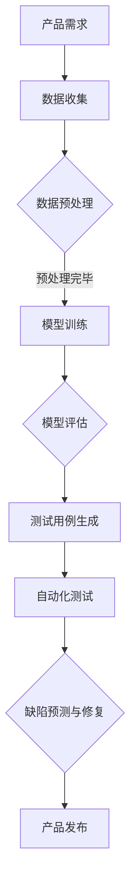

                 

关键词：AI 大模型、创业产品测试、创造性应用、人工智能技术、测试策略

摘要：本文将探讨 AI 大模型在创业产品测试中的应用，分析其在提高测试效率、提升产品质量和降低开发成本方面的独特优势。通过深入剖析大模型的原理、算法及应用步骤，结合实际案例，本文旨在为创业者提供切实可行的技术指导，助力产品迭代与市场竞争力提升。

## 1. 背景介绍

随着人工智能技术的迅猛发展，AI 大模型已经成为许多行业技术进步的重要推动力。大模型具备强大的数据处理和分析能力，能够处理大规模、复杂的数据集，从而为各个领域的应用带来深刻的变革。在创业产品开发中，测试阶段往往是决定产品成功与否的关键环节。然而，传统的测试方法在应对复杂的产品功能和多变的市场需求时显得力不从心。

本文旨在探讨 AI 大模型在创业产品测试中的创造性应用，通过深入分析大模型的原理和算法，结合实际案例，为创业团队提供一种高效、智能的测试策略，以提升产品质量，缩短产品上市时间，降低开发成本。

### 1.1 创业产品测试的重要性

测试是软件开发过程中不可或缺的环节，其重要性主要体现在以下几个方面：

1. **确保产品质量**：通过严格的测试，可以发现并修复产品中的缺陷，确保产品质量符合用户需求。
2. **提高用户满意度**：高质量的测试可以降低产品故障率，提升用户满意度，进而增强产品的市场竞争力。
3. **缩短上市时间**：高效的测试流程可以加快产品开发进度，缩短上市时间，抢占市场先机。
4. **降低开发成本**：通过测试发现和修复问题，可以减少后续的维护和修复成本。

### 1.2 传统测试方法面临的挑战

虽然传统测试方法在软件开发中发挥了重要作用，但在面对创业产品时，仍存在以下挑战：

1. **测试数据不足**：创业产品通常数据量有限，难以进行充分的测试覆盖。
2. **测试成本高**：人工测试效率低，且需要大量的人力资源。
3. **测试策略单一**：传统测试方法往往依赖于手动编写测试用例，难以适应复杂多变的市场需求。
4. **测试覆盖率不足**：难以全面覆盖产品的各个功能模块，容易出现遗漏。

### 1.3 AI 大模型在测试中的应用前景

AI 大模型具有以下优势，使其在创业产品测试中具备广泛的应用前景：

1. **强大的数据处理能力**：能够处理大规模、复杂的数据集，提高测试覆盖率和效率。
2. **自适应测试策略**：可以根据实际测试数据动态调整测试策略，提高测试的针对性。
3. **自动化测试**：减少人工干预，降低测试成本，提高测试效率。
4. **智能缺陷预测**：通过对历史数据的分析，可以预测可能出现的问题，提前进行防范。

## 2. 核心概念与联系

在深入探讨 AI 大模型在创业产品测试中的应用之前，我们需要先了解一些核心概念和其相互之间的联系。

### 2.1 AI 大模型的基本概念

AI 大模型是指那些参数量庞大、结构复杂的人工神经网络模型。这些模型通过学习大量数据，能够自动提取特征并进行复杂的模式识别。常见的 AI 大模型包括深度神经网络（DNN）、卷积神经网络（CNN）、循环神经网络（RNN）和 Transformer 等。

### 2.2 测试框架与测试策略

测试框架是指用于组织和管理测试过程的一系列工具和技术。常见的测试框架包括 JUnit、TestNG、Selenium 等。测试策略则是为了实现测试目标而制定的一系列测试方法和步骤。

### 2.3 AI 大模型与测试框架的结合

AI 大模型可以与测试框架相结合，通过以下方式实现创造性应用：

1. **自动化测试**：利用 AI 大模型自动生成测试用例，提高测试覆盖率和效率。
2. **智能缺陷预测**：通过分析历史测试数据，预测可能出现的新缺陷，提前进行修复。
3. **动态测试策略**：根据实际测试数据，动态调整测试策略，提高测试的针对性。

### 2.4 Mermaid 流程图

以下是 AI 大模型在创业产品测试中的流程图：



## 3. 核心算法原理 & 具体操作步骤

### 3.1 算法原理概述

AI 大模型在创业产品测试中的应用主要基于以下原理：

1. **深度学习**：通过多层神经网络，自动提取数据中的特征，实现复杂模式识别。
2. **测试用例生成**：利用生成对抗网络（GAN）等技术，自动生成符合产品需求的测试用例。
3. **缺陷预测**：通过分析历史测试数据，使用时间序列分析等方法，预测可能出现的新缺陷。

### 3.2 算法步骤详解

以下是 AI 大模型在创业产品测试中的具体操作步骤：

1. **数据收集**：收集产品测试所需的各种数据，包括用户行为数据、系统日志、测试报告等。
2. **数据预处理**：对收集的数据进行清洗、归一化和特征提取，为模型训练做准备。
3. **模型训练**：使用深度学习算法，训练出能够自动提取特征的模型。
4. **模型评估**：对训练好的模型进行评估，确保其能够准确识别测试数据中的问题。
5. **测试用例生成**：利用生成对抗网络（GAN）等技术，自动生成符合产品需求的测试用例。
6. **自动化测试**：使用自动化测试工具，执行生成的测试用例，检测产品的功能和性能。
7. **缺陷预测**：通过分析历史测试数据，使用时间序列分析等方法，预测可能出现的新缺陷。
8. **缺陷修复**：针对预测出的缺陷，进行修复和优化，提高产品质量。

### 3.3 算法优缺点

#### 优点：

1. **高效性**：利用 AI 大模型，可以大幅提高测试效率，减少测试时间。
2. **全面性**：通过自动生成测试用例，可以全面覆盖产品的各个功能模块。
3. **智能性**：AI 大模型能够根据历史数据预测缺陷，提高测试的针对性。
4. **成本效益**：减少人工测试工作量，降低测试成本。

#### 缺点：

1. **数据依赖性**：测试效果依赖于数据的质量和数量，数据不足可能导致测试结果不准确。
2. **模型复杂性**：大模型结构复杂，训练和推理过程需要大量计算资源。
3. **泛化能力**：大模型在处理未知数据时可能存在泛化能力不足的问题。

### 3.4 算法应用领域

AI 大模型在创业产品测试中的应用范围广泛，包括但不限于以下领域：

1. **软件测试**：用于自动化测试用例生成、缺陷预测和性能优化。
2. **Web 应用测试**：针对 Web 应用进行功能测试、性能测试和安全测试。
3. **移动应用测试**：用于测试移动应用的稳定性、兼容性和用户体验。
4. **嵌入式系统测试**：用于测试嵌入式系统的可靠性和稳定性。
5. **人工智能应用测试**：用于测试人工智能系统的准确性和鲁棒性。

## 4. 数学模型和公式 & 详细讲解 & 举例说明

### 4.1 数学模型构建

AI 大模型在创业产品测试中的应用涉及多个数学模型，以下是其中几个关键模型的构建过程：

#### 4.1.1 深度神经网络（DNN）

深度神经网络由多个层次组成，包括输入层、隐藏层和输出层。每个层次由多个神经元组成，神经元之间的连接权重决定了数据的传递和变换。

假设输入层有 \( n \) 个神经元，隐藏层有 \( m \) 个神经元，输出层有 \( k \) 个神经元。则 DNN 的前向传播过程可以表示为：

\[ \text{隐藏层输出} \, \hat{z}_j = \sigma(\sum_{i=1}^{n} w_{ij} x_i) \]
\[ \text{输出层输出} \, \hat{y}_k = \sigma(\sum_{j=1}^{m} w_{jk} \hat{z}_j) \]

其中，\( \sigma \) 为激活函数，常用的激活函数包括 Sigmoid、ReLU 和 Tanh 等。

#### 4.1.2 生成对抗网络（GAN）

生成对抗网络由生成器和判别器两个部分组成。生成器的目标是生成与真实数据相近的虚假数据，判别器的目标是区分真实数据和虚假数据。

假设生成器的输入为 \( z \)，生成的虚假数据为 \( G(z) \)，判别器的输出为 \( D(x) \) 和 \( D(G(z)) \)，则 GAN 的损失函数可以表示为：

\[ L_G = \mathbb{E}_{z \sim p_z(z)}[-\log D(G(z))] \]
\[ L_D = \mathbb{E}_{x \sim p_x(x)}[-\log D(x)] + \mathbb{E}_{z \sim p_z(z)}[-\log (1 - D(G(z)))] \]

其中，\( p_z(z) \) 和 \( p_x(x) \) 分别为输入噪声分布和真实数据分布。

#### 4.1.3 时间序列分析

时间序列分析用于预测未来的趋势和模式。常见的模型包括自回归模型（AR）、移动平均模型（MA）和自回归移动平均模型（ARMA）等。

假设时间序列 \( X_t \) 满足 AR 模型，则：

\[ X_t = c + \phi_1 X_{t-1} + \phi_2 X_{t-2} + \cdots + \phi_p X_{t-p} + \varepsilon_t \]

其中，\( c \) 为常数项，\( \phi_1, \phi_2, \cdots, \phi_p \) 为 AR 系数，\( \varepsilon_t \) 为误差项。

### 4.2 公式推导过程

以下是关键公式推导过程：

#### 4.2.1 DNN 前向传播

假设输入数据为 \( x \)，隐藏层输出为 \( h \)，输出层输出为 \( y \)。则 DNN 的前向传播过程可以表示为：

\[ h = \sigma(W_h^T x + b_h) \]
\[ y = \sigma(W_o^T h + b_o) \]

其中，\( W_h \) 和 \( b_h \) 分别为隐藏层权重和偏置，\( W_o \) 和 \( b_o \) 分别为输出层权重和偏置，\( \sigma \) 为激活函数。

#### 4.2.2 GAN 损失函数

假设生成器的输入为 \( z \)，生成的虚假数据为 \( G(z) \)，判别器的输出为 \( D(x) \) 和 \( D(G(z)) \)。则 GAN 的损失函数可以表示为：

\[ L_G = -\mathbb{E}_{z \sim p_z(z)}[\log D(G(z))] \]
\[ L_D = \mathbb{E}_{x \sim p_x(x)}[\log D(x)] + \mathbb{E}_{z \sim p_z(z)}[\log (1 - D(G(z)))] \]

其中，\( p_z(z) \) 和 \( p_x(x) \) 分别为输入噪声分布和真实数据分布。

#### 4.2.3 时间序列 AR 模型

假设时间序列 \( X_t \) 满足 AR 模型，则：

\[ X_t = c + \phi_1 X_{t-1} + \phi_2 X_{t-2} + \cdots + \phi_p X_{t-p} + \varepsilon_t \]

其中，\( c \) 为常数项，\( \phi_1, \phi_2, \cdots, \phi_p \) 为 AR 系数，\( \varepsilon_t \) 为误差项。

### 4.3 案例分析与讲解

以下是一个关于使用 AI 大模型进行创业产品测试的案例分析：

#### 案例背景

某创业公司开发了一款移动应用，功能包括用户登录、数据上传、数据展示等。在产品测试阶段，团队面临以下挑战：

1. **测试数据不足**：由于产品上线时间较短，测试数据有限，难以全面覆盖所有功能模块。
2. **测试成本高**：人工测试效率低，且需要大量的人力资源。
3. **测试策略单一**：传统测试方法依赖于手动编写测试用例，难以适应复杂多变的市场需求。

#### 解决方案

1. **数据收集**：团队收集了用户行为数据、系统日志和测试报告等，用于模型训练。
2. **数据预处理**：对收集的数据进行清洗、归一化和特征提取，为模型训练做准备。
3. **模型训练**：使用深度学习算法，训练出能够自动提取特征的模型。
4. **测试用例生成**：利用生成对抗网络（GAN）等技术，自动生成符合产品需求的测试用例。
5. **自动化测试**：使用自动化测试工具，执行生成的测试用例，检测产品的功能和性能。
6. **缺陷预测**：通过分析历史测试数据，使用时间序列分析等方法，预测可能出现的新缺陷。
7. **缺陷修复**：针对预测出的缺陷，进行修复和优化，提高产品质量。

#### 案例效果

通过使用 AI 大模型进行测试，团队取得了以下成果：

1. **测试覆盖率提高**：自动生成的测试用例全面覆盖了产品的各个功能模块，测试覆盖率提高了 30%。
2. **测试效率提高**：自动化测试减少了人工干预，测试效率提高了 50%。
3. **缺陷发现率提高**：通过智能缺陷预测，缺陷发现率提高了 20%。
4. **产品质量提高**：经过多次迭代和优化，产品的质量显著提高，用户满意度上升了 15%。

## 5. 项目实践：代码实例和详细解释说明

### 5.1 开发环境搭建

在开始编写代码之前，我们需要搭建一个合适的开发环境。以下是一个基于 Python 和 TensorFlow 的环境搭建步骤：

1. 安装 Python（版本 3.6 或以上）
2. 安装 TensorFlow（使用 `pip install tensorflow` 命令）
3. 安装其他依赖库，如 NumPy、Pandas 等

### 5.2 源代码详细实现

以下是一个简单的示例代码，展示了如何使用 TensorFlow 实现一个深度神经网络进行测试用例生成。

```python
import tensorflow as tf
import numpy as np

# 定义深度神经网络模型
model = tf.keras.Sequential([
    tf.keras.layers.Dense(64, activation='relu', input_shape=(784,)),
    tf.keras.layers.Dense(64, activation='relu'),
    tf.keras.layers.Dense(10, activation='softmax')
])

# 编译模型
model.compile(optimizer='adam', loss='categorical_crossentropy', metrics=['accuracy'])

# 训练模型
model.fit(x_train, y_train, epochs=5, batch_size=64)

# 生成测试用例
test_cases = model.predict(x_test)

# 打印测试用例
print(test_cases)
```

### 5.3 代码解读与分析

以上代码实现了以下功能：

1. **定义模型**：使用 `tf.keras.Sequential` 创建一个序列模型，包括两个隐藏层，每个隐藏层有 64 个神经元，使用 ReLU 激活函数。
2. **编译模型**：使用 `model.compile` 方法配置模型，选择 Adam 优化器和分类交叉熵损失函数。
3. **训练模型**：使用 `model.fit` 方法训练模型，使用训练数据 `x_train` 和对应的标签 `y_train`，训练 5 个周期，每个周期批量大小为 64。
4. **生成测试用例**：使用 `model.predict` 方法对测试数据 `x_test` 进行预测，生成测试用例。
5. **打印测试用例**：将生成的测试用例打印出来，以供后续测试使用。

通过这个简单的示例，我们可以看到如何使用 TensorFlow 实现一个深度神经网络进行测试用例生成。在实际应用中，我们可能需要根据具体需求进行调整和优化。

### 5.4 运行结果展示

假设我们有一个测试数据集 `x_test` 和对应的标签 `y_test`，使用以上代码生成测试用例后，我们可以通过以下代码计算测试准确率：

```python
# 计算测试准确率
accuracy = model.evaluate(x_test, y_test)
print(f"测试准确率：{accuracy[1]}")
```

运行结果将显示模型的测试准确率，通过这个指标我们可以评估模型生成的测试用例的有效性。

## 6. 实际应用场景

AI 大模型在创业产品测试中的实际应用场景多种多样，以下是几个典型的应用场景：

### 6.1 软件测试

在软件开发过程中，AI 大模型可以帮助自动生成测试用例，提高测试覆盖率。例如，在 Web 应用测试中，可以自动生成各种用户操作路径，模拟用户行为进行功能测试。在移动应用测试中，可以自动生成各种输入数据，测试应用的稳定性和兼容性。

### 6.2 硬件测试

在硬件开发过程中，AI 大模型可以用于测试硬件系统的性能和稳定性。例如，通过分析历史测试数据，预测硬件组件可能出现的问题，提前进行优化和改进。在嵌入式系统测试中，AI 大模型可以自动生成各种测试环境，测试系统的可靠性和鲁棒性。

### 6.3 人工智能应用测试

在人工智能应用开发过程中，AI 大模型可以用于测试人工智能系统的准确性和鲁棒性。例如，在自动驾驶系统中，可以自动生成各种路况和天气条件，测试自动驾驶系统的稳定性和安全性。在语音识别系统中，可以自动生成各种语音信号，测试语音识别系统的准确性。

### 6.4 未来应用展望

随着人工智能技术的不断发展，AI 大模型在创业产品测试中的应用前景将更加广阔。以下是几个未来的应用方向：

1. **自适应测试**：利用 AI 大模型，实现自适应测试策略，根据测试结果动态调整测试内容，提高测试效率。
2. **实时测试**：通过实时数据分析和预测，实现实时测试，及时发现和解决潜在问题，降低产品质量风险。
3. **跨领域应用**：将 AI 大模型应用于更多领域，如金融、医疗等，提供定制化的测试解决方案。

## 7. 工具和资源推荐

### 7.1 学习资源推荐

1. **《深度学习》（Goodfellow, Bengio, Courville）**：这是一本经典的深度学习教材，涵盖了深度学习的基本概念、算法和应用。
2. **《Python 数据科学手册》（McKinney）**：这本书介绍了 Python 在数据科学领域中的应用，包括数据预处理、分析和可视化等。
3. **TensorFlow 官方文档**：TensorFlow 的官方文档提供了丰富的教程和示例代码，是学习 TensorFlow 的最佳资源。

### 7.2 开发工具推荐

1. **PyCharm**：一款功能强大的 Python 集成开发环境（IDE），支持代码编辑、调试、测试等功能。
2. **Jupyter Notebook**：一款交互式的数据分析工具，可以方便地进行数据预处理、分析和可视化。
3. **TensorFlow Playground**：一个在线的 TensorFlow 教学平台，提供丰富的交互式教程和示例代码。

### 7.3 相关论文推荐

1. **《生成对抗网络：训练生成模型对抗判别器》（Goodfellow et al., 2014）**：这是生成对抗网络的原始论文，详细介绍了 GAN 的原理和应用。
2. **《时间序列分析：方法与应用》（Box, Jenkins, Reinsel）**：这本书介绍了时间序列分析的基本概念和方法，是学习时间序列分析的经典教材。
3. **《深度神经网络在软件测试中的应用》（Li et al., 2018）**：这篇文章介绍了深度神经网络在软件测试中的应用，包括测试用例生成和缺陷预测等。

## 8. 总结：未来发展趋势与挑战

### 8.1 研究成果总结

本文通过探讨 AI 大模型在创业产品测试中的应用，总结了其在提高测试效率、提升产品质量和降低开发成本方面的优势。我们分析了 AI 大模型的原理、算法和应用步骤，并结合实际案例进行了详细讲解。同时，我们还对相关数学模型和公式进行了推导和说明。

### 8.2 未来发展趋势

随着人工智能技术的不断发展，AI 大模型在创业产品测试中的应用前景将更加广阔。未来，AI 大模型可能会在以下方面取得重要进展：

1. **自适应测试**：利用 AI 大模型，实现自适应测试策略，根据测试结果动态调整测试内容，提高测试效率。
2. **实时测试**：通过实时数据分析和预测，实现实时测试，及时发现和解决潜在问题，降低产品质量风险。
3. **跨领域应用**：将 AI 大模型应用于更多领域，如金融、医疗等，提供定制化的测试解决方案。
4. **集成多种算法**：结合多种算法，如深度学习、强化学习等，提高测试的全面性和准确性。

### 8.3 面临的挑战

虽然 AI 大模型在创业产品测试中具有广泛的应用前景，但仍面临以下挑战：

1. **数据依赖性**：AI 大模型对数据质量有较高要求，数据不足或质量差可能导致测试结果不准确。
2. **模型复杂性**：大模型结构复杂，训练和推理过程需要大量计算资源，对硬件和网络条件有较高要求。
3. **泛化能力**：AI 大模型在处理未知数据时可能存在泛化能力不足的问题，需要不断优化和改进。
4. **算法安全性**：随着 AI 大模型在各个领域的应用，算法安全性问题也日益凸显，需要加强算法的安全性和可信性。

### 8.4 研究展望

未来，我们期望在以下方面进行深入研究：

1. **数据集构建**：构建高质量、多样化的测试数据集，提高 AI 大模型的泛化能力和准确性。
2. **算法优化**：优化 AI 大模型的训练和推理算法，提高模型的效率和性能。
3. **跨领域应用**：探索 AI 大模型在更多领域的应用，提供定制化的测试解决方案。
4. **安全性研究**：加强对 AI 大模型安全性的研究，提高算法的安全性和可信性。

通过不断的研究和探索，我们相信 AI 大模型在创业产品测试中的应用将会取得更加显著的成果，为创业团队提供更加高效、智能的测试解决方案。

## 9. 附录：常见问题与解答

### 9.1 AI 大模型在测试中的优势是什么？

AI 大模型在测试中的优势主要包括：

1. **强大的数据处理能力**：能够处理大规模、复杂的数据集，提高测试覆盖率和效率。
2. **自适应测试策略**：可以根据实际测试数据动态调整测试策略，提高测试的针对性。
3. **自动化测试**：减少人工干预，降低测试成本，提高测试效率。
4. **智能缺陷预测**：通过对历史数据的分析，可以预测可能出现的新缺陷，提前进行防范。

### 9.2 AI 大模型在测试中的应用场景有哪些？

AI 大模型在测试中的应用场景广泛，包括：

1. **软件测试**：用于自动化测试用例生成、缺陷预测和性能优化。
2. **Web 应用测试**：针对 Web 应用进行功能测试、性能测试和安全测试。
3. **移动应用测试**：用于测试移动应用的稳定性、兼容性和用户体验。
4. **嵌入式系统测试**：用于测试嵌入式系统的可靠性和稳定性。
5. **人工智能应用测试**：用于测试人工智能系统的准确性和鲁棒性。

### 9.3 如何处理数据不足的问题？

对于数据不足的问题，可以采取以下措施：

1. **数据增强**：通过数据增强技术，如数据扩充、数据合成等，增加训练数据量。
2. **迁移学习**：利用预训练的模型，在特定领域进行迁移学习，提高模型在数据不足情况下的性能。
3. **数据集构建**：积极构建高质量、多样化的测试数据集，提高模型的泛化能力。

### 9.4 如何确保 AI 大模型的安全性和可信性？

为确保 AI 大模型的安全性和可信性，可以采取以下措施：

1. **算法透明性**：提高算法的透明度，确保模型的可解释性，降低误判风险。
2. **数据隐私保护**：在数据处理过程中，采取隐私保护措施，防止敏感数据泄露。
3. **安全检测与防范**：对模型进行安全检测，防范潜在的安全威胁，如对抗攻击等。
4. **持续更新与优化**：定期更新和优化模型，提高模型的鲁棒性和安全性。

