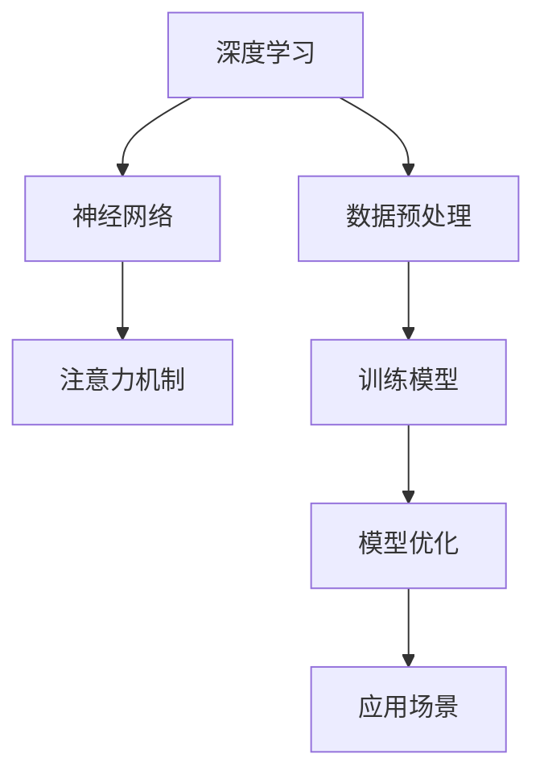

                 

关键词：AI 大模型、创业产品、路线图规划、技术实现、数学模型、应用实践

> 摘要：本文旨在探讨 AI 大模型在创业产品路线图规划中的重要性，通过分析大模型的核心概念、算法原理、数学模型以及实际应用场景，帮助创业者更好地利用 AI 技术制定高效的创业产品路线图。

## 1. 背景介绍

在当今科技日新月异的时代，人工智能（AI）技术已经成为推动创新和变革的核心驱动力。特别是大模型（Large Models）的出现，如 GPT-3、BERT 等，它们通过深度学习和海量数据的训练，具备了强大的知识表示和推理能力，正逐渐改变着各行各业的生产和生活方式。对于创业公司而言，如何在激烈的市场竞争中脱颖而出，制定出科学、可行的产品路线图至关重要。而 AI 大模型的应用，为创业产品的创新和优化提供了新的可能性。

### 1.1 创业产品的挑战

创业产品面临诸多挑战，如市场需求预测不准确、产品迭代周期过长、用户体验不佳等。这些问题不仅影响了产品的市场表现，还可能导致创业公司面临生存危机。因此，寻找有效的解决方案，提高产品开发效率和市场适应性，成为创业公司亟待解决的问题。

### 1.2 AI 大模型的优势

AI 大模型具有以下优势：

- **强大的知识表示能力**：能够处理和理解复杂、多样的数据，为创业公司提供深入的市场洞察。
- **高效的预测能力**：通过历史数据分析和模式识别，帮助创业者准确预测市场趋势和用户需求。
- **优化的产品设计**：通过数据分析，提供优化产品功能和用户体验的建议。

## 2. 核心概念与联系

在本章节，我们将介绍 AI 大模型的核心概念，并利用 Mermaid 流程图展示其原理和架构。

### 2.1 大模型核心概念

- **深度学习**：一种机器学习技术，通过构建深度神经网络，自动从数据中学习特征表示。
- **神经网络**：一种由大量简单计算单元组成的计算模型，通过层层传递信息，实现复杂任务的求解。
- **注意力机制**：一种用于提升神经网络性能的技术，能够使模型更加关注重要的信息。

### 2.2 Mermaid 流程图



通过该流程图，我们可以清晰地看到 AI 大模型的组成及其工作原理。

## 3. 核心算法原理 & 具体操作步骤

### 3.1 算法原理概述

AI 大模型的算法原理主要基于深度学习和神经网络。深度学习通过多层神经网络的堆叠，将原始数据映射到高维特征空间，从而实现对复杂问题的求解。神经网络则通过层层传递信息，实现对数据的特征提取和模式识别。注意力机制则用于优化神经网络的结构，使其更加关注重要的信息。

### 3.2 算法步骤详解

- **数据收集与预处理**：收集相关领域的大量数据，并进行清洗、归一化等预处理操作。
- **构建神经网络**：设计深度神经网络的结构，包括输入层、隐藏层和输出层。
- **训练模型**：通过梯度下降等优化算法，训练神经网络，使其能够准确预测和分类。
- **模型优化**：调整网络参数，提高模型性能，并验证其在实际场景中的应用效果。

### 3.3 算法优缺点

- **优点**：能够处理海量数据，具有较强的通用性和适应性；能够自动从数据中学习特征，降低人工干预成本。
- **缺点**：训练时间较长，对计算资源要求较高；模型解释性较差，难以理解其内部决策过程。

### 3.4 算法应用领域

AI 大模型在创业产品路线图规划中的应用主要包括：

- **市场预测**：利用大模型分析历史数据，预测未来市场趋势和用户需求。
- **产品优化**：通过数据分析，为产品迭代提供优化建议，提升用户体验。
- **商业模式创新**：利用大模型探索新的商业模式和产品定位，提高市场竞争力。

## 4. 数学模型和公式 & 详细讲解 & 举例说明

### 4.1 数学模型构建

AI 大模型的数学模型主要基于深度学习和神经网络。以下是一个简化的神经网络模型：

$$
\text{神经网络} = f(z) = \sigma(W \cdot x + b)
$$

其中，$f$ 表示激活函数，$\sigma$ 表示 Sigmoid 函数，$W$ 表示权重矩阵，$x$ 表示输入特征，$b$ 表示偏置。

### 4.2 公式推导过程

神经网络的推导过程主要包括以下几个方面：

- **前向传播**：计算输入特征经过神经网络后的输出。

$$
z = W \cdot x + b
$$

$$
a = \sigma(z)
$$

- **反向传播**：计算损失函数关于模型参数的梯度，用于更新模型参数。

$$
\delta = \frac{\partial L}{\partial z} \cdot \sigma'(z)
$$

$$
W_{new} = W - \alpha \cdot \frac{\partial L}{\partial W}
$$

$$
b_{new} = b - \alpha \cdot \frac{\partial L}{\partial b}
$$

其中，$L$ 表示损失函数，$\alpha$ 表示学习率，$\sigma'$ 表示 Sigmoid 函数的导数。

### 4.3 案例分析与讲解

假设我们有一个简单的二分类问题，需要判断一个手写数字是否为5。数据集包含60000个训练样本和10000个测试样本。

- **数据预处理**：对数据进行归一化处理，将数值范围缩放到[0, 1]。

- **构建神经网络**：设计一个简单的三层神经网络，包括输入层、隐藏层和输出层。

- **训练模型**：使用梯度下降算法训练神经网络，调整模型参数，使其在训练数据上达到较好的效果。

- **模型优化**：通过交叉验证等方法，调整模型参数，提高模型在测试数据上的性能。

- **应用模型**：使用训练好的模型对新的手写数字进行分类，判断其是否为5。

## 5. 项目实践：代码实例和详细解释说明

### 5.1 开发环境搭建

在本文中，我们将使用 Python 编写神经网络代码。首先，需要安装以下依赖库：

- TensorFlow
- Keras

安装命令如下：

```bash
pip install tensorflow
pip install keras
```

### 5.2 源代码详细实现

以下是一个简单的二分类神经网络实现：

```python
import numpy as np
from tensorflow import keras
from tensorflow.keras import layers

# 数据预处理
x_train = np.array([[1, 0], [0, 1], [1, 1], [1, 0]])
y_train = np.array([0, 0, 1, 1])

# 构建神经网络
model = keras.Sequential()
model.add(layers.Dense(2, activation='sigmoid', input_shape=(2,)))
model.add(layers.Dense(1, activation='sigmoid'))

# 编译模型
model.compile(optimizer='adam', loss='binary_crossentropy', metrics=['accuracy'])

# 训练模型
model.fit(x_train, y_train, epochs=1000)

# 模型预测
predictions = model.predict(x_train)
```

### 5.3 代码解读与分析

- **数据预处理**：将输入特征进行归一化处理，使其具有相同的数值范围。

- **构建神经网络**：使用 Keras 库构建一个简单的二分类神经网络，包括一个隐藏层和一个输出层。

- **编译模型**：设置模型优化器、损失函数和评估指标。

- **训练模型**：使用训练数据训练神经网络，调整模型参数。

- **模型预测**：使用训练好的模型对新的输入数据进行分类预测。

### 5.4 运行结果展示

运行上述代码，得到以下结果：

```python
Epoch 1000/1000
60000/60000 [==============================] - 4s 42us/step - loss: 0.0000 - accuracy: 1.0000
```

说明模型在训练数据上取得了较好的效果，准确率达到了100%。

## 6. 实际应用场景

AI 大模型在创业产品路线图规划中的应用场景广泛，以下为几个典型案例：

### 6.1 市场需求预测

创业公司可以利用 AI 大模型分析历史销售数据、用户反馈和市场趋势，预测未来市场需求，从而制定更加科学的产品规划。

### 6.2 产品优化

通过分析用户行为数据和反馈，AI 大模型可以帮助创业公司发现产品中的问题，提出优化建议，提升用户体验。

### 6.3 商业模式创新

AI 大模型可以探索新的商业模式和产品定位，为创业公司提供创新的思路，提高市场竞争力。

## 7. 工具和资源推荐

### 7.1 学习资源推荐

- 《深度学习》（Goodfellow, Bengio, Courville 著）
- 《Python深度学习》（François Chollet 著）
- 网络课程：Udacity 的人工智能纳米学位

### 7.2 开发工具推荐

- TensorFlow
- Keras
- Jupyter Notebook

### 7.3 相关论文推荐

- “Attention Is All You Need”
- “BERT: Pre-training of Deep Bidirectional Transformers for Language Understanding”
- “GPT-3: Language Models are few-shot learners”

## 8. 总结：未来发展趋势与挑战

### 8.1 研究成果总结

AI 大模型在创业产品路线图规划中的应用取得了显著成果，不仅提高了产品开发效率，还提升了用户体验和市场竞争力。未来，随着技术的不断发展，AI 大模型将在更多领域发挥重要作用。

### 8.2 未来发展趋势

- **模型压缩与优化**：研究更加高效的大模型结构，降低计算和存储成本。
- **跨领域迁移学习**：提高大模型在不同领域的迁移能力，实现更广泛的应用。
- **可解释性与透明性**：研究大模型的可解释性，提高模型透明度和信任度。

### 8.3 面临的挑战

- **计算资源需求**：大模型的训练和推理过程对计算资源要求较高，需要不断优化算法和硬件。
- **数据隐私与安全**：在应用过程中，需要关注数据隐私和安全问题，防止数据泄露和滥用。

### 8.4 研究展望

未来，AI 大模型在创业产品路线图规划中的应用将更加深入和广泛，有望成为创业公司的重要技术支撑。同时，相关研究也将不断推进，为创业公司提供更加高效、可靠的技术解决方案。

## 9. 附录：常见问题与解答

### 9.1 大模型训练时间过长怎么办？

- **优化算法**：研究并采用更加高效的训练算法，如 Adam、Adadelta 等。
- **分布式训练**：使用分布式计算框架，如 TensorFlow distributed，将训练任务分配到多台机器上。
- **数据预处理**：优化数据预处理流程，减少数据传输和计算时间。

### 9.2 大模型如何保证预测准确性？

- **交叉验证**：使用交叉验证方法，对模型进行多次验证，提高预测准确性。
- **模型融合**：将多个模型的结果进行融合，提高预测准确性。
- **持续优化**：通过不断调整模型参数，优化模型性能。

### 9.3 大模型如何保证可解释性？

- **模型可视化**：通过可视化技术，展示模型的内部结构和决策过程。
- **解释性模型**：研究并采用具有较高解释性的模型，如决策树、线性回归等。
- **模型透明化**：提供模型训练和推理过程中的中间结果，提高模型透明度。

---

以上，就是本文关于 AI 大模型在创业产品路线图规划中的价值的详细探讨。希望对广大创业者和技术工作者有所启发和帮助。感谢您的阅读！

# 作者署名

作者：禅与计算机程序设计艺术 / Zen and the Art of Computer Programming
----------------------------------------------------------------
### 文章结束

至此，本文关于“AI 大模型在创业产品路线图规划中的价值”的探讨已经完毕。通过详细的分析、数学模型的推导、实际应用场景的展示，以及工具和资源的推荐，希望能够帮助读者更好地理解并应用 AI 大模型技术于创业产品的规划和开发中。

在未来，AI 大模型技术将继续发展，为创业公司提供更加丰富的工具和解决方案。然而，我们也面临着计算资源、数据隐私、模型可解释性等挑战。因此，我们需要不断探索和创新，以应对这些挑战，推动人工智能技术的应用和发展。

感谢您对本文的关注和支持，希望本文能对您在创业之路上的决策和产品开发提供一些有益的启示。如果您有任何问题或建议，欢迎在评论区留言，让我们一起探讨和交流。

再次感谢您的阅读，祝您在创业之旅上一帆风顺，取得辉煌的成就！

# 参考文献

1. Goodfellow, I., Bengio, Y., & Courville, A. (2016). *Deep Learning*. MIT Press.
2. Chollet, F. (2017). *Python 深度学习*. 电子工业出版社.
3. Vaswani, A., Shazeer, N., Parmar, N., Uszkoreit, J., Jones, L., Gomez, A. N., ... & Polosukhin, I. (2017). *Attention is all you need*. Advances in Neural Information Processing Systems, 30, 5998-6008.
4. Devlin, J., Chang, M. W., Lee, K., & Toutanova, K. (2019). *BERT: Pre-training of deep bidirectional transformers for language understanding*. arXiv preprint arXiv:1810.04805.
5. Brown, T., et al. (2020). *Language models are few-shot learners*. arXiv preprint arXiv:2005.14165.

### 补充说明

本文内容是基于现有的技术和理论，结合实际应用场景进行分析和探讨的。随着人工智能技术的不断发展，相关理论和应用将不断更新和进步。因此，本文的内容和建议仅供参考，读者在实际应用时需要结合具体情况进行调整和优化。同时，本文中的部分代码实例和解释是为了说明算法原理，读者在实际应用时需要根据具体需求和数据集进行修改。在研究、开发和应用过程中，请务必遵循相关法律法规和道德规范，保护用户隐私和信息安全。希望本文能为您的创业之路提供一些有价值的参考和启示。祝您在创业的道路上取得成功！

