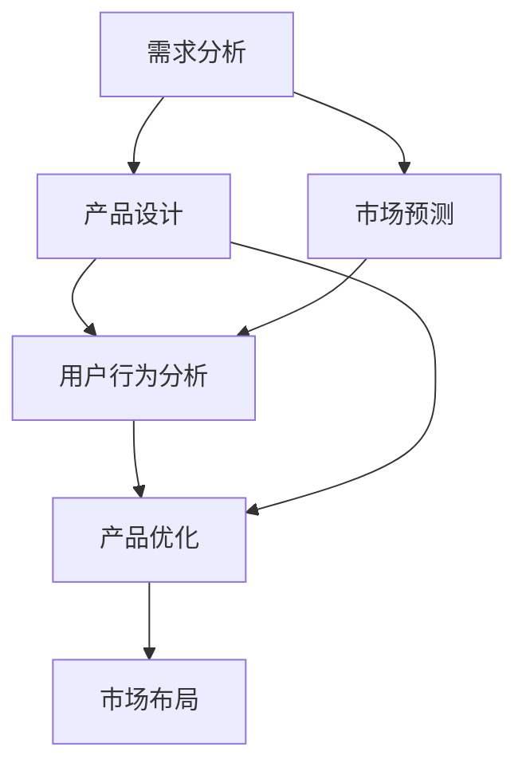

                 

在当今快速发展的科技时代，人工智能（AI）技术已成为推动创业创新的重要引擎。大模型作为AI领域的核心技术之一，正在深刻地影响着创业产品的开发和市场布局。本文将探讨大模型在创业产品路线图规划中的关键作用，分析其技术原理、应用场景及未来发展趋势。

## 关键词
- 人工智能
- 大模型
- 创业产品
- 路线图规划
- 技术创新

## 摘要
本文旨在阐述大模型技术在创业产品路线图规划中的关键作用。通过对大模型的基本概念、算法原理和实际应用的深入分析，本文揭示了其在需求分析、产品设计、市场预测等方面的巨大潜力。文章还展望了未来大模型在创业领域的应用前景，为创业者提供了有益的参考和指导。

## 1. 背景介绍
近年来，随着计算能力的提升和海量数据资源的积累，人工智能技术取得了长足的进步。大模型作为AI领域的重要成果，其计算能力和数据处理能力远超传统模型，能够对复杂的问题提供更为精准的解决方案。在创业领域，大模型的引入不仅能够提高产品的创新性，还能在市场竞争中占据有利位置。

### 1.1 大模型的发展历程
大模型的发展可以追溯到20世纪80年代，当时的神经网络模型（如BP算法）奠定了人工智能的基础。随着深度学习技术的兴起，大模型逐渐成为研究热点。尤其是近年来，随着GPU计算能力的提升和分布式计算技术的发展，大模型的规模和性能得到了空前的提升。

### 1.2 大模型的优势
大模型具有以下优势：
- **强大的计算能力**：能够处理海量数据，快速提取特征，适用于复杂问题。
- **高度泛化能力**：通过大规模数据训练，大模型能够适应各种场景，降低对特定领域数据的依赖。
- **高效的表达能力**：大模型具有丰富的参数，能够表达复杂的关系，提高模型的预测精度。

## 2. 核心概念与联系
为了更好地理解大模型在创业产品路线图规划中的作用，我们需要首先掌握以下几个核心概念：

### 2.1 AI大模型
AI大模型是指使用深度学习技术训练的、具有大规模参数和计算能力的人工神经网络模型。这些模型通常包含数百万甚至数十亿个参数，能够处理高维度、复杂数据。

### 2.2 创业产品路线图
创业产品路线图是指创业公司在产品开发过程中制定的阶段性目标和策略，包括产品定位、功能设计、市场推广等。大模型可以用于优化这些路线图中的各个环节。

### 2.3 需求分析
需求分析是创业产品路线图规划的重要环节，涉及用户需求、市场趋势、竞争对手等多方面信息。大模型可以通过数据挖掘和分析，帮助创业者更好地理解市场需求。

### 2.4 产品设计
产品设计是创业产品路线图的核心，大模型可以用于优化产品功能、提升用户体验、预测用户行为等。

### 2.5 市场预测
市场预测是创业产品路线图的重要组成部分，大模型可以通过对市场数据的分析，预测未来市场趋势，帮助创业者制定更合理的产品策略。

以下是一个使用Mermaid绘制的流程图，展示了大模型在创业产品路线图规划中的关键作用：



## 3. 核心算法原理 & 具体操作步骤

### 3.1 算法原理概述
大模型的核心算法是深度学习，通过多层神经网络对数据进行训练，逐层提取特征，最终实现对输入数据的精准预测。以下是深度学习的基本原理：

- **神经网络**：神经网络是由多个神经元组成的计算模型，每个神经元接收输入信号，通过激活函数产生输出。
- **多层网络**：多层神经网络能够提取更高层次的特征，提高模型的预测能力。
- **反向传播**：通过反向传播算法，将预测误差反向传播到网络中的每个神经元，调整网络参数，优化模型性能。

### 3.2 算法步骤详解
大模型的训练过程主要包括以下几个步骤：

1. **数据准备**：收集并预处理大量数据，包括清洗、归一化、划分训练集和测试集。
2. **网络构建**：定义神经网络结构，包括输入层、隐藏层和输出层。
3. **参数初始化**：随机初始化网络参数，如权重和偏置。
4. **前向传播**：输入数据通过神经网络前向传播，计算输出结果。
5. **损失计算**：计算预测结果与真实值之间的差异，得到损失函数值。
6. **反向传播**：将损失函数反向传播到网络中的每个神经元，更新网络参数。
7. **迭代训练**：重复上述步骤，逐步优化网络参数，提高模型性能。
8. **模型评估**：使用测试集评估模型性能，选择最佳模型。

### 3.3 算法优缺点

#### 优点
- **强大的计算能力**：能够处理大规模、高维度的数据。
- **高度泛化能力**：通过大规模数据训练，能够适应不同场景。
- **高效的表达能力**：能够提取复杂的关系和特征。

#### 缺点
- **训练时间较长**：需要大量数据和计算资源。
- **对数据质量要求高**：数据预处理和清洗对模型性能有很大影响。
- **难以解释**：深度学习模型具有较强的非线性特性，难以解释模型的决策过程。

### 3.4 算法应用领域
大模型在多个领域具有广泛的应用，包括但不限于：

- **计算机视觉**：图像分类、目标检测、人脸识别等。
- **自然语言处理**：文本分类、机器翻译、情感分析等。
- **推荐系统**：个性化推荐、内容推荐等。
- **金融风控**：信用评分、风险预测等。

## 4. 数学模型和公式 & 详细讲解 & 举例说明

### 4.1 数学模型构建
大模型的数学基础主要包括线性代数、概率论和统计学。以下是一个简化的数学模型构建过程：

1. **数据表示**：使用向量表示输入数据和输出结果。
2. **损失函数**：选择合适的损失函数，如均方误差（MSE）、交叉熵损失等。
3. **优化算法**：选择优化算法，如梯度下降、Adam等。
4. **网络结构**：设计神经网络结构，包括层数、神经元数量和激活函数。

### 4.2 公式推导过程

#### 4.2.1 前向传播
前向传播过程中，每个神经元的输出可以通过以下公式计算：

$$
Z_j = \sum_{i} W_{ji} \cdot Z_i + b_j
$$

其中，$Z_j$表示第j个神经元的输出，$W_{ji}$表示权重，$Z_i$表示输入，$b_j$表示偏置。

#### 4.2.2 损失函数
均方误差（MSE）损失函数可以表示为：

$$
Loss = \frac{1}{2} \sum_{i} (Y_i - \hat{Y}_i)^2
$$

其中，$Y_i$表示真实值，$\hat{Y}_i$表示预测值。

#### 4.2.3 反向传播
反向传播过程中，可以通过以下公式更新权重：

$$
\Delta W_{ji} = -\alpha \cdot \frac{\partial Loss}{\partial W_{ji}}
$$

其中，$\Delta W_{ji}$表示权重更新值，$\alpha$表示学习率。

### 4.3 案例分析与讲解

#### 4.3.1 案例背景
假设我们想要开发一个用于预测股票价格的大模型。我们将使用历史股票数据作为输入，预测未来一段时间内的股票价格。

#### 4.3.2 数据准备
收集过去一年的股票交易数据，包括开盘价、收盘价、最高价、最低价等。对数据进行清洗和归一化处理，将数据划分为训练集和测试集。

#### 4.3.3 模型构建
设计一个包含多层感知器的神经网络模型，输入层包含4个神经元，隐藏层包含10个神经元，输出层包含1个神经元。使用ReLU作为激活函数。

#### 4.3.4 模型训练
使用训练集数据训练模型，选择合适的损失函数和优化算法。训练过程中，观察模型性能的变化，调整学习率和网络参数。

#### 4.3.5 模型评估
使用测试集数据评估模型性能，计算预测误差和准确率。根据评估结果，调整模型结构或参数，优化模型性能。

## 5. 项目实践：代码实例和详细解释说明

### 5.1 开发环境搭建
在本地计算机上搭建一个Python开发环境，安装必要的库，如TensorFlow、NumPy等。

### 5.2 源代码详细实现
以下是实现一个简单的股票价格预测大模型的Python代码：

```python
import tensorflow as tf
import numpy as np

# 数据准备
# （此处省略数据准备代码）

# 模型构建
model = tf.keras.Sequential([
    tf.keras.layers.Dense(units=10, activation='relu', input_shape=(4,)),
    tf.keras.layers.Dense(units=1)
])

# 模型编译
model.compile(optimizer='adam', loss='mean_squared_error')

# 模型训练
model.fit(train_data, train_labels, epochs=100, batch_size=32)

# 模型评估
test_loss = model.evaluate(test_data, test_labels)
print(f"Test Loss: {test_loss}")
```

### 5.3 代码解读与分析
以上代码实现了一个简单的股票价格预测大模型，包括数据准备、模型构建、模型编译、模型训练和模型评估等步骤。

- **数据准备**：使用NumPy库读取和预处理数据，将数据划分为训练集和测试集。
- **模型构建**：使用TensorFlow的Sequential模型定义神经网络结构，包含一个输入层、一个隐藏层和一个输出层。
- **模型编译**：选择优化器（optimizer）和损失函数（loss），为模型设置训练策略。
- **模型训练**：使用训练集数据训练模型，调整网络参数。
- **模型评估**：使用测试集数据评估模型性能，计算预测误差。

### 5.4 运行结果展示
在运行代码后，将输出测试集的损失值，表明模型的预测精度。根据实际运行结果，可以对模型进行进一步优化。

## 6. 实际应用场景

### 6.1 需求分析
在大模型的应用中，需求分析是一个关键环节。通过大数据分析和机器学习技术，可以更好地理解用户需求和市场趋势。

### 6.2 产品设计
大模型可以用于产品设计，优化产品功能、提升用户体验。例如，通过分析用户行为数据，可以预测用户偏好，为产品迭代提供依据。

### 6.3 市场预测
大模型在市场预测方面具有显著优势，可以预测未来市场趋势，帮助创业者制定合理的产品策略。

### 6.4 未来应用展望
随着大模型技术的不断发展，其应用领域将不断扩大。未来，大模型将在更多行业和场景中发挥重要作用，为创业创新提供强大支持。

## 7. 工具和资源推荐

### 7.1 学习资源推荐
- 《深度学习》（Goodfellow et al.）：深度学习领域的经典教材，适合初学者和进阶者。
- 《动手学深度学习》（Dumoulin et al.）：包含大量实践案例，适合实际操作。

### 7.2 开发工具推荐
- TensorFlow：广泛使用的深度学习框架，适用于多种场景。
- PyTorch：适用于研究人员的深度学习框架，具有灵活的动态计算图。

### 7.3 相关论文推荐
- "Distributed Deep Learning:Theory and Application"（分布式深度学习：理论与应用）：探讨分布式计算在深度学习中的应用。
- "The Unreasonable Effectiveness of Deep Learning"（深度学习的不可思议有效性）：介绍深度学习在不同领域的应用。

## 8. 总结：未来发展趋势与挑战

### 8.1 研究成果总结
大模型在创业产品路线图规划中取得了显著成果，提高了需求分析、产品设计、市场预测等方面的效率和质量。

### 8.2 未来发展趋势
随着计算能力的提升和数据资源的积累，大模型将在更多领域得到应用，推动创业创新不断向前发展。

### 8.3 面临的挑战
大模型在训练时间、数据质量和模型解释性等方面仍存在挑战，需要进一步研究和优化。

### 8.4 研究展望
未来，大模型技术将不断优化，并在更多领域发挥重要作用，为创业创新提供更加智能和高效的解决方案。

## 9. 附录：常见问题与解答

### 9.1 大模型与普通模型的区别
大模型相较于普通模型，具有更大的参数规模和更强的计算能力，能够处理更复杂的问题。

### 9.2 大模型的训练时间如何优化？
可以通过分布式计算、优化算法和参数初始化等方法，降低大模型的训练时间。

### 9.3 大模型如何确保模型的解释性？
可以通过模型可视化、决策树解释等方法，提高大模型的解释性。

### 9.4 大模型在创业产品中的具体应用案例有哪些？
例如，通过大模型分析用户需求、优化产品设计、预测市场趋势等，为创业产品提供有力支持。

### 9.5 大模型在创业产品中的优势有哪些？
大模型可以提高产品的创新性、降低开发成本、提升市场竞争力，为创业公司提供强大支持。

[文章结束]

