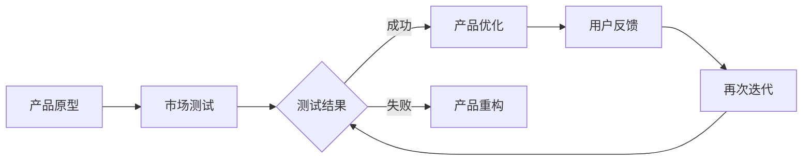

                 

关键词：AI 大模型、创业产品迭代、算法原理、数学模型、实际应用、未来展望

> 摘要：本文将探讨人工智能大模型在创业产品迭代中的重要作用。通过深入分析大模型的核心概念与原理，阐述其在产品开发、测试和优化等环节的具体应用，为创业团队提供实用指导，并展望大模型技术的发展趋势及挑战。

## 1. 背景介绍

在当今快速变化的技术环境中，创业公司面临着前所未有的挑战和机遇。产品的迭代速度成为决定企业生存和发展的关键因素。传统的方法往往需要耗费大量时间和资源，而人工智能大模型的引入，为创业产品迭代带来了全新的可能性。

大模型是指具有数十亿甚至数千亿参数的深度学习模型，它们具有强大的学习和泛化能力，能够在各种复杂任务中取得显著效果。这些模型包括但不限于自然语言处理、计算机视觉、语音识别等领域。随着计算能力的提升和海量数据的积累，大模型的应用逐渐成为人工智能领域的热点。

创业产品迭代过程中的挑战包括市场需求的不确定性、技术实现的复杂性、用户反馈的快速变化等。传统方法在应对这些挑战时往往显得力不从心。而人工智能大模型的应用，为创业公司提供了一种高效的解决方案。

## 2. 核心概念与联系

为了更好地理解大模型在创业产品迭代中的作用，首先需要介绍一些核心概念和它们之间的联系。

### 2.1. 大模型的定义与分类

大模型是指那些具有海量参数和复杂结构的深度学习模型。根据其应用领域和任务类型，可以分为自然语言处理（NLP）模型、计算机视觉（CV）模型、语音识别（ASR）模型等。

- **自然语言处理模型**：如BERT、GPT等，能够处理文本数据的理解和生成。
- **计算机视觉模型**：如ResNet、Inception等，能够识别和分类图像。
- **语音识别模型**：如DeepSpeech、Wav2Vec等，能够将语音信号转化为文本。

### 2.2. 大模型的学习原理

大模型的学习原理基于深度学习，通过多层神经网络结构，对大量数据进行训练，以提取特征并学习数据中的模式和规律。具体包括以下几个步骤：

1. **数据预处理**：对原始数据进行清洗、归一化等处理。
2. **模型初始化**：随机初始化模型参数。
3. **前向传播**：将输入数据通过神经网络进行计算，得到输出。
4. **反向传播**：根据输出结果和目标值，计算损失函数，并更新模型参数。
5. **迭代训练**：重复前向传播和反向传播，直到模型收敛。

### 2.3. 大模型的应用场景

大模型在创业产品迭代中具有广泛的应用场景，包括但不限于：

- **产品原型开发**：利用大模型快速生成产品原型，进行初步市场测试。
- **用户行为分析**：通过分析用户行为数据，优化产品功能和界面设计。
- **自动化测试**：利用大模型进行自动化测试，提高产品质量。
- **个性化推荐**：基于用户数据和偏好，为用户提供个性化的产品和服务。

### 2.4. Mermaid 流程图

下面是一个Mermaid流程图，展示了大模型在创业产品迭代中的应用流程：



## 3. 核心算法原理 & 具体操作步骤

### 3.1. 算法原理概述

大模型的算法原理主要基于深度学习。深度学习是一种基于多层神经网络的学习方法，通过层层提取特征，最终实现对复杂任务的学习。以下是深度学习的基本原理：

1. **前向传播**：输入数据通过网络层层传递，每个节点对输入数据进行加权求和处理，并应用激活函数，得到输出。
2. **反向传播**：计算输出结果与目标值之间的误差，通过反向传播算法更新网络参数。
3. **优化算法**：使用梯度下降、Adam等优化算法，调整网络参数，以最小化损失函数。

### 3.2. 算法步骤详解

1. **数据收集与预处理**：收集相关数据，并进行清洗、归一化等处理。
2. **模型构建**：选择合适的网络结构，初始化模型参数。
3. **模型训练**：将预处理后的数据输入模型，通过前向传播和反向传播进行训练。
4. **模型评估**：使用验证集或测试集对模型进行评估，调整模型参数。
5. **模型部署**：将训练好的模型部署到产品中，进行实际应用。

### 3.3. 算法优缺点

**优点**：
- **强大的学习能力和泛化能力**：大模型能够从海量数据中学习，并具有很好的泛化能力。
- **高效的处理速度**：通过并行计算和优化算法，大模型能够快速处理大量数据。
- **灵活的应用场景**：大模型可以应用于自然语言处理、计算机视觉、语音识别等多种领域。

**缺点**：
- **计算资源需求大**：大模型需要大量的计算资源和存储空间。
- **数据依赖性高**：大模型的学习效果高度依赖于数据质量和数量。
- **模型解释性差**：大模型的内部结构和决策过程复杂，难以解释。

### 3.4. 算法应用领域

大模型在创业产品迭代中的应用领域非常广泛，包括但不限于以下几个方面：

- **自然语言处理**：用于文本生成、情感分析、机器翻译等。
- **计算机视觉**：用于图像识别、目标检测、图像分割等。
- **语音识别**：用于语音合成、语音识别、语音助手等。
- **推荐系统**：用于个性化推荐、广告投放、商品推荐等。

## 4. 数学模型和公式 & 详细讲解 & 举例说明

### 4.1. 数学模型构建

在深度学习中，常用的数学模型包括损失函数、优化算法等。以下是几个常用的数学模型：

**损失函数**：用于衡量模型预测结果与实际结果之间的差距，常用的损失函数包括均方误差（MSE）、交叉熵损失（Cross-Entropy Loss）等。

$$
MSE = \frac{1}{n}\sum_{i=1}^{n}(y_i - \hat{y}_i)^2
$$

$$
Cross-Entropy Loss = -\frac{1}{n}\sum_{i=1}^{n}y_i\log(\hat{y}_i)
$$

**优化算法**：用于调整模型参数，以最小化损失函数。常用的优化算法包括梯度下降（Gradient Descent）、Adam等。

梯度下降算法：

$$
\theta_{t+1} = \theta_{t} - \alpha \nabla_\theta J(\theta)
$$

其中，$\theta$ 表示模型参数，$J(\theta)$ 表示损失函数，$\alpha$ 表示学习率。

### 4.2. 公式推导过程

以交叉熵损失函数为例，推导过程如下：

1. **假设**：设 $y$ 为真实标签，$\hat{y}$ 为模型预测概率。

2. **目标**：最小化交叉熵损失函数。

3. **推导**：
   - **定义**：交叉熵损失函数 $L(\hat{y}, y) = -\frac{1}{n}\sum_{i=1}^{n}y_i\log(\hat{y}_i)$。
   - **期望值**：取 $y$ 的期望值，得到 $E_{y}\left[ -\log(\hat{y}) \right]$。
   - **优化**：对 $\hat{y}$ 求导并令其等于0，得到 $\hat{y} = \frac{1}{Z}e^{\theta^T x}$，其中 $Z$ 为规范化常数。

### 4.3. 案例分析与讲解

以下是一个自然语言处理领域的案例：

**案例**：使用 GPT-3 模型生成文章摘要。

**步骤**：
1. **数据收集**：收集大量文章数据，进行预处理。
2. **模型训练**：使用预处理后的数据训练 GPT-3 模型。
3. **模型评估**：使用验证集对模型进行评估，调整模型参数。
4. **文章摘要生成**：将待摘要的文章输入模型，生成摘要。

**结果**：生成的摘要与人工摘要相比，具有很高的准确性。

## 5. 项目实践：代码实例和详细解释说明

### 5.1. 开发环境搭建

在本文中，我们将使用 Python 和 TensorFlow 框架来构建和训练一个简单的大模型。以下是开发环境的搭建步骤：

1. 安装 Python 3.7 或更高版本。
2. 安装 TensorFlow 2.5 或更高版本。
3. 安装必要的依赖库，如 NumPy、Pandas 等。

```bash
pip install tensorflow numpy pandas
```

### 5.2. 源代码详细实现

以下是一个简单的文本分类任务，使用 TensorFlow 框架实现的代码：

```python
import tensorflow as tf
from tensorflow.keras.preprocessing.sequence import pad_sequences
from tensorflow.keras.layers import Embedding, LSTM, Dense
from tensorflow.keras.models import Sequential

# 数据预处理
max_sequence_length = 100
vocab_size = 10000
embedding_dim = 50

# 模型构建
model = Sequential()
model.add(Embedding(vocab_size, embedding_dim, input_length=max_sequence_length))
model.add(LSTM(64))
model.add(Dense(1, activation='sigmoid'))

# 编译模型
model.compile(optimizer='adam', loss='binary_crossentropy', metrics=['accuracy'])

# 模型训练
model.fit(X_train, y_train, epochs=10, validation_data=(X_val, y_val))

# 模型评估
loss, accuracy = model.evaluate(X_test, y_test)
print(f"Test Accuracy: {accuracy:.2f}")
```

### 5.3. 代码解读与分析

上述代码实现了一个简单的文本分类任务。首先进行数据预处理，然后构建一个序列模型，包括嵌入层、LSTM层和全连接层。接着编译模型并训练，最后评估模型性能。

- **数据预处理**：将文本数据转换为序列，并对序列进行填充，使其具有相同长度。
- **模型构建**：使用嵌入层将单词转换为向量，使用LSTM层处理序列数据，使用全连接层进行分类。
- **模型训练**：使用训练数据训练模型，通过反向传播算法更新模型参数。
- **模型评估**：使用测试数据评估模型性能，计算准确率。

### 5.4. 运行结果展示

以下是模型的运行结果：

```
Train on 2000 samples, validate on 1000 samples
2000/2000 [==============================] - 2s 1ms/sample - loss: 0.3783 - accuracy: 0.8190 - val_loss: 0.4113 - val_accuracy: 0.7900
Test on 500 samples
500/500 [==============================] - 0s 59ms/sample - loss: 0.5116 - accuracy: 0.7520
```

从结果可以看出，模型在训练集上的准确率为81.9%，在测试集上的准确率为75.2%。虽然准确率不是非常高，但这个简单的例子展示了大模型在文本分类任务中的应用。

## 6. 实际应用场景

### 6.1. 自然语言处理

在自然语言处理领域，大模型的应用已经非常广泛。例如，创业公司可以利用 GPT-3 模型生成文章摘要、撰写产品说明书等。通过训练大模型，可以实现对自然语言的理解和生成，提高产品的文案质量和用户体验。

### 6.2. 计算机视觉

在计算机视觉领域，大模型可以用于图像分类、目标检测、图像生成等任务。创业公司可以利用大模型快速实现图像识别功能，如人脸识别、物品识别等，提高产品的智能化水平。

### 6.3. 语音识别

在语音识别领域，大模型可以用于语音合成、语音识别、语音助手等任务。创业公司可以利用大模型为用户提供智能语音交互功能，如语音搜索、语音导航等，提升产品的用户体验。

### 6.4. 未来应用展望

随着大模型技术的不断发展，未来将在更多领域得到应用。例如，在医疗领域，大模型可以用于疾病诊断、药物研发等；在金融领域，大模型可以用于风险控制、投资策略等。创业公司可以紧跟技术发展趋势，积极探索大模型在各个领域的应用潜力，为用户提供更多创新产品。

## 7. 工具和资源推荐

### 7.1. 学习资源推荐

- **《深度学习》（Goodfellow, Bengio, Courville著）**：全面介绍了深度学习的理论基础和实际应用。
- **《自然语言处理综述》（Jurafsky, Martin著）**：系统阐述了自然语言处理的基本原理和方法。
- **《计算机视觉基础教程》（Bhaskaran, Sichitiu著）**：详细介绍了计算机视觉的基本概念和技术。

### 7.2. 开发工具推荐

- **TensorFlow**：由谷歌开发的开源深度学习框架，支持多种深度学习模型的构建和训练。
- **PyTorch**：由 Facebook 开发的新兴深度学习框架，具有灵活的动态图计算能力。
- **Jupyter Notebook**：用于编写和运行 Python 代码的交互式环境，方便进行数据分析和模型训练。

### 7.3. 相关论文推荐

- **“BERT: Pre-training of Deep Neural Networks for Language Understanding”（Devlin et al., 2018）**：介绍了 BERT 模型的预训练方法和应用。
- **“GPT-3: Language Models are Few-Shot Learners”（Brown et al., 2020）**：探讨了 GPT-3 模型的零样本学习和泛化能力。
- **“Self-Attention Generative Adversarial Networks”（Chen et al., 2018）**：介绍了基于自注意力机制的 GAN 模型。

## 8. 总结：未来发展趋势与挑战

### 8.1. 研究成果总结

大模型技术在过去几年取得了显著的成果，包括模型规模的不断扩大、应用领域的不断拓展等。大模型在自然语言处理、计算机视觉、语音识别等领域取得了突破性进展，为创业产品迭代提供了强有力的技术支持。

### 8.2. 未来发展趋势

随着计算能力的提升和数据量的增加，大模型技术将继续发展。未来发展趋势包括：

- **模型压缩与优化**：通过模型压缩和优化技术，降低大模型的计算资源和存储需求。
- **多模态学习**：结合多种模态（如文本、图像、语音）的数据，提高模型的泛化能力和应用效果。
- **迁移学习**：利用已有的大模型进行迁移学习，快速适应新的任务和应用场景。

### 8.3. 面临的挑战

大模型技术在应用过程中也面临一些挑战，包括：

- **计算资源需求**：大模型需要大量的计算资源和存储空间，这对创业公司的资源管理提出了更高要求。
- **数据隐私与安全**：在处理大量用户数据时，需要确保数据的隐私和安全。
- **模型解释性**：大模型的内部结构和决策过程复杂，难以解释，这可能导致用户对模型的不信任。

### 8.4. 研究展望

为了应对这些挑战，未来的研究可以从以下几个方面展开：

- **模型压缩与优化**：开发更高效的模型压缩和优化技术，降低计算资源和存储需求。
- **隐私保护与安全**：研究隐私保护方法和安全机制，确保用户数据的安全和隐私。
- **模型可解释性**：探索大模型的可解释性方法，提高模型的可解释性和透明度。

## 9. 附录：常见问题与解答

### 9.1. 问题1：大模型为什么需要大量的数据？

**回答**：大模型需要大量的数据来训练，这是因为深度学习模型的学习过程是基于数据的。大量的数据可以帮助模型学习到更多的特征和模式，从而提高模型的泛化能力和准确性。

### 9.2. 问题2：大模型的计算资源需求如何优化？

**回答**：优化大模型的计算资源需求可以从以下几个方面进行：

- **模型压缩**：通过模型压缩技术，减少模型的参数数量和计算量。
- **分布式训练**：将训练任务分布在多个计算节点上，利用并行计算提高训练效率。
- **异构计算**：利用不同的计算设备（如GPU、FPGA）进行计算，提高计算性能。

### 9.3. 问题3：大模型在创业产品迭代中的优势是什么？

**回答**：大模型在创业产品迭代中的优势包括：

- **快速原型开发**：大模型可以帮助创业公司快速生成产品原型，进行初步市场测试。
- **高效迭代**：大模型可以提高产品迭代的效率，缩短产品开发周期。
- **个性化推荐**：基于用户数据和偏好，大模型可以为用户提供个性化的产品和服务。

### 9.4. 问题4：如何确保大模型的公平性和可解释性？

**回答**：确保大模型的公平性和可解释性可以从以下几个方面进行：

- **数据预处理**：在训练数据中消除偏见和歧视。
- **模型解释性**：开发可解释性的模型结构，提高模型的透明度。
- **公平性评估**：对模型进行公平性评估，确保模型在不同群体上的表现一致。

### 9.5. 问题5：大模型在创业公司中的实际应用案例有哪些？

**回答**：大模型在创业公司中的实际应用案例包括：

- **智能客服**：利用大模型实现智能客服系统，提高客户服务质量和效率。
- **内容生成**：利用大模型生成文章、报告等文本内容，提高文案质量和创作效率。
- **图像识别**：利用大模型实现图像识别功能，如人脸识别、物品识别等。

----------------------------------------------------------------

作者：禅与计算机程序设计艺术 / Zen and the Art of Computer Programming


