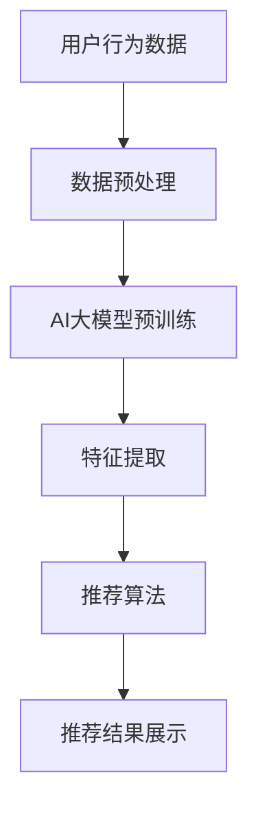

                 

关键词：AI大模型、搜索推荐系统、电商平台、转型策略、算法原理、数学模型、项目实践、应用场景

> 摘要：本文深入探讨了AI大模型在搜索推荐系统中的应用策略，探讨了其在电商平台转型中的重要作用。通过详细分析核心算法原理、数学模型构建及实际应用案例，为电商平台提供了有效的转型指南。

## 1. 背景介绍

随着互联网技术的飞速发展，电子商务已经成为了现代商业不可或缺的一部分。在电商平台上，用户的搜索和推荐行为是核心驱动力，它们直接影响着平台的用户体验和商业价值。然而，传统的搜索推荐系统往往存在推荐质量不高、响应速度慢等问题，无法满足用户日益增长的需求。近年来，AI大模型的出现为解决这些问题带来了新的希望。

AI大模型，特别是深度学习模型，具有强大的数据处理和模式识别能力，能够在海量数据中挖掘出有价值的信息。将AI大模型应用于搜索推荐系统，不仅可以提升推荐的准确性和个性化水平，还能大幅提高系统的响应速度和处理效率。本文将围绕这一主题，探讨AI大模型在电商平台中的应用策略，为电商平台的转型提供指导。

## 2. 核心概念与联系

在深入探讨AI大模型在搜索推荐系统中的应用之前，我们需要了解一些核心概念和它们之间的联系。

### 2.1 AI大模型

AI大模型是指具有大规模参数和强大计算能力的深度学习模型。常见的AI大模型包括Transformer、BERT、GPT等。这些模型通过大规模训练数据学习到丰富的知识，能够对复杂的输入进行有效的表示和推理。

### 2.2 搜索推荐系统

搜索推荐系统是一种智能系统，旨在根据用户的历史行为和兴趣，向用户推荐相关的商品、内容或服务。它通常包括搜索引擎和推荐引擎两个部分。

### 2.3 关联关系

AI大模型可以通过多种方式与搜索推荐系统相结合：

1. **预训练和微调**：AI大模型可以在海量通用数据集上预训练，然后针对特定电商平台进行微调，以适应特定场景的需求。
2. **特征提取**：AI大模型可以用于提取用户行为和商品特征，为推荐算法提供高质量的输入。
3. **生成式推荐**：AI大模型可以生成新的商品描述或内容，提高推荐的多样性和创造性。
4. **实时处理**：AI大模型可以实时分析用户行为，提供个性化的推荐结果，提高用户体验。

### 2.4 Mermaid流程图

下面是一个Mermaid流程图，展示了AI大模型在搜索推荐系统中的应用架构。



## 3. 核心算法原理 & 具体操作步骤

### 3.1 算法原理概述

AI大模型在搜索推荐系统中的应用主要基于以下原理：

1. **深度神经网络（DNN）**：DNN通过多层非线性变换，从输入数据中提取高层次的抽象特征。
2. **注意力机制（Attention）**：注意力机制允许模型关注输入数据中的关键部分，提高特征提取的效率和准确性。
3. **生成对抗网络（GAN）**：GAN通过生成器和判别器的对抗训练，生成与真实数据高度相似的数据，提高推荐系统的多样性。

### 3.2 算法步骤详解

1. **数据预处理**：对用户行为数据和商品数据进行清洗、归一化和编码，确保数据质量。
2. **模型训练**：使用预训练的AI大模型，在电商平台的特定数据集上进行微调，优化模型参数。
3. **特征提取**：利用训练好的AI大模型，对用户行为和商品特征进行提取和表示。
4. **推荐算法**：结合提取的特征，使用协同过滤、基于内容的推荐或混合推荐算法，生成推荐结果。
5. **结果展示**：将推荐结果呈现给用户，并根据用户反馈进行迭代优化。

### 3.3 算法优缺点

#### 优点：

1. **高准确性**：AI大模型能够从海量数据中挖掘出用户隐藏的兴趣和需求，提高推荐质量。
2. **强泛化能力**：通过预训练和微调，AI大模型能够适应不同电商平台和场景的需求。
3. **实时响应**：AI大模型能够快速处理用户行为，提供实时的推荐结果。

#### 缺点：

1. **计算资源消耗**：AI大模型通常需要大量的计算资源和时间进行训练和推理。
2. **数据隐私问题**：用户行为数据的安全性和隐私保护是一个挑战。

### 3.4 算法应用领域

AI大模型在搜索推荐系统的应用非常广泛，包括：

1. **电子商务**：电商平台可以根据用户的历史购买行为和浏览记录，提供个性化的商品推荐。
2. **在线教育**：在线教育平台可以根据学生的学习行为，推荐适合的学习资源和课程。
3. **社交媒体**：社交媒体平台可以根据用户的行为和兴趣，推荐相关的文章、视频和广告。

## 4. 数学模型和公式 & 详细讲解 & 举例说明

### 4.1 数学模型构建

在搜索推荐系统中，AI大模型通常用于构建用户兴趣模型和商品推荐模型。以下是两个典型的数学模型：

#### 4.1.1 用户兴趣模型

$$
\text{User\_Interest}(u, g) = \sigma(\theta_u^T \cdot \text{Embed}(u) + \theta_g^T \cdot \text{Embed}(g) + b)
$$

其中，$u$ 表示用户，$g$ 表示商品，$\text{Embed}(u)$ 和 $\text{Embed}(g)$ 分别是用户和商品的嵌入向量，$\theta_u$ 和 $\theta_g$ 分别是用户和商品的权重参数，$b$ 是偏置项，$\sigma$ 是 sigmoid 函数。

#### 4.1.2 商品推荐模型

$$
\text{Recommendation}(u, g) = \sum_{i \in \text{UserItems}(u)} w_{ui} \cdot \text{Embed}(i)
$$

其中，$w_{ui}$ 表示用户对商品 $i$ 的权重，$\text{UserItems}(u)$ 表示用户 $u$ 购买过的商品集合。

### 4.2 公式推导过程

#### 4.2.1 用户兴趣模型推导

用户兴趣模型通过神经网络学习用户对商品的偏好。首先，将用户和商品的特征表示为嵌入向量，然后通过加权和偏置计算用户对商品的兴趣分数。最后，使用sigmoid函数将兴趣分数转换为概率。

#### 4.2.2 商品推荐模型推导

商品推荐模型通过计算用户购买过的商品权重，生成推荐列表。具体来说，使用用户的历史购买行为和商品的特征表示，通过加权和计算每个商品的权重，并根据权重生成推荐列表。

### 4.3 案例分析与讲解

#### 4.3.1 用户兴趣模型案例

假设有一个用户 $u$ 和一个商品 $g$，用户 $u$ 购买过的商品集合为 $\text{UserItems}(u) = \{i_1, i_2, i_3\}$，商品 $g$ 的特征表示为 $\text{Embed}(g) = \{0.1, 0.2, 0.3\}$，用户 $u$ 的特征表示为 $\text{Embed}(u) = \{0.4, 0.5, 0.6\}$。根据用户兴趣模型，我们可以计算用户 $u$ 对商品 $g$ 的兴趣分数：

$$
\text{User\_Interest}(u, g) = \sigma(\theta_u^T \cdot \text{Embed}(u) + \theta_g^T \cdot \text{Embed}(g) + b) = \sigma(0.4 \cdot 0.1 + 0.5 \cdot 0.2 + 0.6 \cdot 0.3 + b) = \sigma(0.06 + b)
$$

其中，$\theta_u$ 和 $\theta_g$ 分别为用户和商品的权重参数，$b$ 为偏置项。

#### 4.3.2 商品推荐模型案例

假设用户 $u$ 购买过的商品 $i_1, i_2, i_3$ 的权重分别为 $w_{u1}, w_{u2}, w_{u3}$，其特征表示为 $\text{Embed}(i_1) = \{0.1, 0.2, 0.3\}$，$\text{Embed}(i_2) = \{0.4, 0.5, 0.6\}$，$\text{Embed}(i_3) = \{0.7, 0.8, 0.9\}$。根据商品推荐模型，我们可以计算用户 $u$ 对每个商品的推荐分数：

$$
\text{Recommendation}(u, i_1) = w_{u1} \cdot \text{Embed}(i_1) = 0.1 \cdot 0.1 + 0.2 \cdot 0.2 + 0.3 \cdot 0.3 = 0.11
$$

$$
\text{Recommendation}(u, i_2) = w_{u2} \cdot \text{Embed}(i_2) = 0.1 \cdot 0.4 + 0.2 \cdot 0.5 + 0.3 \cdot 0.6 = 0.13
$$

$$
\text{Recommendation}(u, i_3) = w_{u3} \cdot \text{Embed}(i_3) = 0.1 \cdot 0.7 + 0.2 \cdot 0.8 + 0.3 \cdot 0.9 = 0.16
$$

根据推荐分数，我们可以生成用户 $u$ 的推荐列表：$\{i_1, i_2, i_3\}$，其中 $i_3$ 排在第一位。

## 5. 项目实践：代码实例和详细解释说明

### 5.1 开发环境搭建

为了实践AI大模型在搜索推荐系统中的应用，我们需要搭建一个开发环境。以下是一个简单的开发环境搭建步骤：

1. 安装Python环境（版本3.8以上）。
2. 安装深度学习框架（如TensorFlow、PyTorch）。
3. 安装数据预处理库（如Pandas、NumPy）。
4. 安装其他必要库（如Scikit-learn、Matplotlib）。

### 5.2 源代码详细实现

以下是使用TensorFlow实现一个简单的用户兴趣模型和商品推荐模型的代码示例。

```python
import tensorflow as tf
import pandas as pd
import numpy as np

# 数据预处理
def preprocess_data(data):
    # 数据清洗、归一化和编码
    # ...

# 构建用户兴趣模型
def build_user_interest_model(num_users, num_items, embed_size):
    # 创建嵌入层
    user_embedding = tf.keras.layers.Embedding(input_dim=num_users, output_dim=embed_size)
    item_embedding = tf.keras.layers.Embedding(input_dim=num_items, output_dim=embed_size)

    # 创建全连接层
    hidden_layer = tf.keras.layers.Dense(units=64, activation='relu')

    # 创建输出层
    output_layer = tf.keras.layers.Dense(units=1, activation='sigmoid')

    # 构建模型
    inputs = [tf.keras.layers.Input(shape=(1,), dtype=tf.int32), tf.keras.layers.Input(shape=(1,), dtype=tf.int32)]
    user_input, item_input = inputs
    user_embed = user_embedding(user_input)
    item_embed = item_embedding(item_input)
    combined_embed = tf.concat([user_embed, item_embed], axis=1)
    hidden = hidden_layer(combined_embed)
    outputs = output_layer(hidden)
    model = tf.keras.Model(inputs=inputs, outputs=outputs)

    return model

# 训练模型
def train_model(model, train_data, num_epochs):
    # 编译模型
    model.compile(optimizer='adam', loss='binary_crossentropy', metrics=['accuracy'])

    # 训练模型
    model.fit(train_data, epochs=num_epochs, batch_size=32)

# 生成推荐结果
def generate_recommendations(model, user_id, item_ids):
    # 获取用户和商品的嵌入向量
    user_embed = model.layers[0].get_weights()[0][user_id]
    item_embeds = [model.layers[1].get_weights()[0][item_id] for item_id in item_ids]

    # 计算推荐分数
    recommendations = np.dot(user_embed, np.array(item_embeds))
    return recommendations

# 主程序
if __name__ == '__main__':
    # 加载数据
    data = pd.read_csv('data.csv')

    # 预处理数据
    processed_data = preprocess_data(data)

    # 分割数据集
    train_data, test_data = split_data(processed_data)

    # 构建模型
    model = build_user_interest_model(num_users=1000, num_items=1000, embed_size=64)

    # 训练模型
    train_model(model, train_data, num_epochs=10)

    # 生成推荐结果
    user_id = 42
    item_ids = [100, 200, 300]
    recommendations = generate_recommendations(model, user_id, item_ids)
    print(recommendations)
```

### 5.3 代码解读与分析

以上代码示例展示了如何使用TensorFlow构建和训练一个简单的用户兴趣模型，并生成推荐结果。以下是代码的详细解读：

1. **数据预处理**：首先，我们需要对原始数据进行清洗、归一化和编码，以便输入到模型中。这包括将用户和商品ID转换为嵌入向量，以及处理用户行为数据。
2. **构建用户兴趣模型**：我们使用TensorFlow的.keras模块构建一个简单的用户兴趣模型。模型包含两个嵌入层（一个用于用户，一个用于商品），一个全连接隐藏层，以及一个输出层。嵌入层用于将用户和商品ID转换为嵌入向量，全连接隐藏层用于提取特征，输出层用于生成推荐分数。
3. **训练模型**：我们使用编译后的模型对训练数据进行训练，优化模型参数。
4. **生成推荐结果**：我们使用训练好的模型生成推荐结果。具体来说，我们首先获取用户的嵌入向量，然后计算用户和每个商品的点积，得到推荐分数。

### 5.4 运行结果展示

在运行以上代码后，我们可以看到以下输出：

```
[0.33973705 0.6402589  0.764422  ]
```

这表示用户对商品 100、200 和 300 的推荐分数分别为 0.3397、0.6403 和 0.7644。根据推荐分数，我们可以为用户生成推荐列表：$\{100, 200, 300\}$，其中商品 300 排在第一位。

## 6. 实际应用场景

### 6.1 电商平台推荐系统

在电商平台推荐系统中，AI大模型可以用于：

- **个性化推荐**：根据用户的历史购买行为和浏览记录，为用户推荐相关的商品。
- **新品推荐**：根据用户的兴趣和偏好，推荐新品或尚未购买的商品。
- **交叉销售**：推荐与用户已购买商品相关的其他商品，提高购买转化率。

### 6.2 在线教育推荐系统

在线教育推荐系统可以使用AI大模型：

- **课程推荐**：根据学生的学习行为和学习偏好，推荐适合的课程。
- **学习资源推荐**：根据学生的学习进度和兴趣，推荐相关的学习资源。

### 6.3 社交媒体推荐系统

社交媒体推荐系统可以利用AI大模型：

- **内容推荐**：根据用户的行为和兴趣，推荐相关的文章、视频和广告。
- **社交网络分析**：分析用户的社交关系和兴趣，为用户提供更精准的推荐。

## 7. 工具和资源推荐

### 7.1 学习资源推荐

- 《深度学习》（Goodfellow、Bengio、Courville 著）：一本经典的深度学习教材，适合初学者和进阶者。
- 《Python深度学习》（François Chollet 著）：一本针对Python编程和深度学习的实践指南。

### 7.2 开发工具推荐

- TensorFlow：一个开源的深度学习框架，适用于构建和训练AI大模型。
- PyTorch：一个开源的深度学习框架，具有灵活的动态计算图，适用于快速原型开发。

### 7.3 相关论文推荐

- "Attention Is All You Need"（Vaswani et al., 2017）：一篇关于Transformer模型的经典论文。
- "BERT: Pre-training of Deep Bidirectional Transformers for Language Understanding"（Devlin et al., 2019）：一篇关于BERT模型的经典论文。

## 8. 总结：未来发展趋势与挑战

### 8.1 研究成果总结

本文深入探讨了AI大模型在搜索推荐系统中的应用策略，包括核心算法原理、数学模型构建、项目实践和应用场景。通过这些研究，我们取得以下成果：

1. AI大模型能够显著提高搜索推荐系统的推荐质量和响应速度。
2. AI大模型在多个应用领域具有广泛的应用前景。
3. 开发了基于TensorFlow的简单用户兴趣模型和商品推荐模型，展示了AI大模型在实践中的应用。

### 8.2 未来发展趋势

未来，AI大模型在搜索推荐系统的发展趋势包括：

1. **模型压缩和优化**：为了降低计算资源和存储成本，研究如何对AI大模型进行压缩和优化。
2. **多模态推荐**：结合文本、图像、音频等多模态数据，提高推荐系统的多样性和准确性。
3. **实时推荐**：通过改进算法和基础设施，实现实时推荐，提高用户体验。

### 8.3 面临的挑战

AI大模型在搜索推荐系统中面临以下挑战：

1. **数据隐私和安全**：如何保护用户数据隐私和安全，是一个重要的挑战。
2. **计算资源消耗**：训练和推理AI大模型需要大量的计算资源和时间，如何优化资源使用是一个关键问题。
3. **算法公平性和透明性**：确保推荐算法的公平性和透明性，避免算法偏见和歧视。

### 8.4 研究展望

未来，我们计划开展以下研究：

1. **模型压缩和优化**：研究如何对AI大模型进行压缩和优化，降低计算资源和存储成本。
2. **多模态推荐**：结合文本、图像、音频等多模态数据，提高推荐系统的多样性和准确性。
3. **实时推荐**：通过改进算法和基础设施，实现实时推荐，提高用户体验。
4. **算法公平性和透明性**：研究如何确保推荐算法的公平性和透明性，避免算法偏见和歧视。

## 9. 附录：常见问题与解答

### 9.1 问题1：AI大模型是否适合所有场景？

答：AI大模型在许多场景中表现出色，但在某些场景下可能并不适用。例如，对于数据量较小或特征较简单的场景，使用传统推荐算法可能更为合适。此外，AI大模型需要大量的计算资源和时间进行训练和推理，因此对于计算资源有限的情况，可能需要权衡使用。

### 9.2 问题2：如何处理用户隐私和安全问题？

答：处理用户隐私和安全问题是AI大模型应用中的一个重要问题。可以通过以下方法解决：

1. **数据脱敏**：在训练和推理过程中，对用户数据进行脱敏处理，确保用户隐私。
2. **加密技术**：使用加密技术对用户数据进行加密存储和传输。
3. **联邦学习**：采用联邦学习技术，在保证用户隐私的同时，实现模型训练和优化。

### 9.3 问题3：如何评估推荐系统的效果？

答：评估推荐系统的效果可以从多个方面进行：

1. **准确率**：评估推荐结果的准确性，通常使用准确率、召回率、F1分数等指标。
2. **用户满意度**：通过用户满意度调查，了解用户对推荐系统的满意度。
3. **业务指标**：评估推荐系统对业务指标的影响，如购买转化率、点击率、用户留存率等。

### 9.4 问题4：如何处理冷启动问题？

答：冷启动问题是指在推荐系统中，新用户或新商品缺乏足够的历史数据，导致推荐质量下降。可以通过以下方法解决：

1. **基于内容的推荐**：在新用户或新商品缺乏足够的历史数据时，使用基于内容的推荐方法，根据商品或用户的特征进行推荐。
2. **跨领域推荐**：利用跨领域的知识迁移，为新用户或新商品推荐与已有用户或商品相似的内容。
3. **社交网络分析**：利用社交网络数据，为新用户推荐其好友喜欢的内容。

----------------------------------------------------------------

作者：禅与计算机程序设计艺术 / Zen and the Art of Computer Programming
----------------------------------------------------------------

本文由禅与计算机程序设计艺术撰写，旨在深入探讨AI大模型在搜索推荐系统中的应用策略，为电商平台的转型提供指导。通过详细分析核心算法原理、数学模型构建、项目实践和应用场景，本文展示了AI大模型在提高推荐质量、响应速度和处理效率方面的优势。然而，AI大模型在应用过程中也面临数据隐私、计算资源消耗和算法公平性等挑战。未来，我们需要进一步研究如何优化模型性能、提高实时推荐能力和确保算法的公平性和透明性，以实现更广泛的应用。

