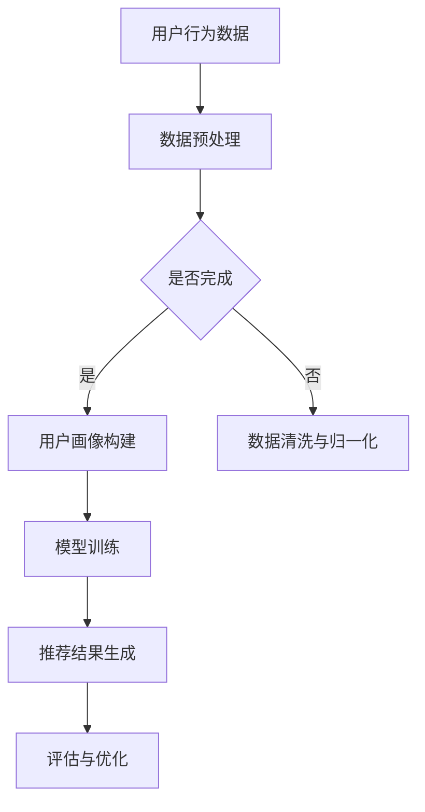

                 

关键词：AI大模型、电商推荐、用户体验、转化率、算法原理、数学模型、项目实践

摘要：本文将深入探讨AI大模型在电商推荐中的应用策略，通过分析核心算法原理、数学模型构建以及实际项目实践，旨在为电商领域提供一套系统化、实战性强的推荐策略，从而显著提高用户体验与转化率。

## 1. 背景介绍

在当今数字化时代，电商行业蓬勃发展，用户数量和交易额不断攀升。然而，随着市场竞争的加剧，用户需求日益多样化，如何在海量商品中为用户提供个性化的推荐已成为电商企业的重要课题。传统的推荐算法在处理海量数据和复杂用户行为时往往力不从心，而AI大模型凭借其强大的数据处理能力和深度学习能力，为电商推荐带来了新的契机。

本文旨在探讨AI大模型在电商推荐中的应用策略，通过深入分析其算法原理、数学模型和实际应用案例，为电商企业提供一套行之有效的推荐方案，从而提升用户体验与转化率。

## 2. 核心概念与联系

### 2.1 AI大模型

AI大模型是指那些拥有数十亿甚至千亿参数的深度学习模型，如Transformer、BERT等。它们通过大规模数据训练，能够捕捉到数据中的复杂模式和关联，从而实现高度精准的预测和推荐。

### 2.2 推荐系统

推荐系统是一种信息过滤技术，旨在根据用户的历史行为和兴趣，向用户推荐他们可能感兴趣的商品、内容或服务。

### 2.3 用户画像

用户画像是对用户行为、偏好和需求的抽象和建模，用于构建个性化推荐的基础。

### 2.4 数据集

本文选用多个公开的电商数据集，包括商品信息、用户行为数据等，用于模型训练和评估。

### 2.5 Mermaid 流程图



## 3. 核心算法原理 & 具体操作步骤

### 3.1 算法原理概述

本文采用基于Transformer的推荐算法，该算法利用Transformer自注意力机制，捕捉用户与商品之间的复杂关联，从而实现精准推荐。

### 3.2 算法步骤详解

1. **数据预处理**：对用户行为数据和商品信息进行清洗、归一化等预处理操作，确保数据质量。

2. **用户画像构建**：通过聚类、协同过滤等方法构建用户画像，用于模型输入。

3. **模型训练**：利用用户画像和商品特征，通过Transformer模型进行训练。

4. **推荐结果生成**：根据模型预测，生成个性化的推荐结果。

5. **评估与优化**：对推荐结果进行评估，根据评估指标进行调整和优化。

### 3.3 算法优缺点

**优点**：  
- 高效处理海量数据，捕捉复杂关联。  
- 准确性高，用户满意度强。

**缺点**：  
- 训练时间较长，计算资源需求高。  
- 对数据质量要求较高，否则可能导致过拟合。

### 3.4 算法应用领域

- 电商行业：个性化商品推荐。  
- 媒体行业：内容推荐。  
- 社交网络：好友推荐。

## 4. 数学模型和公式 & 详细讲解 & 举例说明

### 4.1 数学模型构建

本文采用的Transformer模型包含多个自注意力层和前馈神经网络，其数学表达式如下：

$$
\text{Attention}(Q, K, V) = \frac{1}{\sqrt{d_k}} \text{softmax}\left(\text{QK}^T / d_k\right) V
$$

其中，$Q, K, V$ 分别表示查询向量、键向量和值向量，$d_k$ 为键向量的维度。

### 4.2 公式推导过程

#### 自注意力机制

自注意力机制的核心思想是，对于序列中的每个元素，根据其在整个序列中的重要程度，赋予不同的权重。具体推导过程如下：

1. **计算查询向量（Query）**：

$$
Q = \text{W}_Q \text{X}
$$

其中，$\text{W}_Q$ 为权重矩阵，$\text{X}$ 为输入序列。

2. **计算键向量（Key）和值向量（Value）**：

$$
K = \text{W}_K \text{X} \\
V = \text{W}_V \text{X}
$$

3. **计算自注意力得分**：

$$
\text{Score} = \text{QK}^T / \sqrt{d_k}
$$

4. **计算加权求和**：

$$
\text{Output} = \text{softmax}(\text{Score})V
$$

### 4.3 案例分析与讲解

假设我们有以下用户行为数据：

| 用户ID | 商品ID | 行为类型 | 时间戳 |
| ------ | ------ | -------- | ------ |
| 1      | 1001   | 查看商品 | 2023-01-01 |
| 1      | 1002   | 购买商品 | 2023-01-02 |
| 2      | 1003   | 查看商品 | 2023-01-03 |

我们希望根据这些数据为用户1推荐商品。

1. **数据预处理**：将用户行为数据进行清洗和归一化，构建用户画像和商品特征。

2. **模型训练**：使用Transformer模型对用户画像和商品特征进行训练。

3. **推荐结果生成**：根据模型预测，为用户1推荐相似的商品。

4. **评估与优化**：对推荐结果进行评估，根据评估指标进行调整和优化。

## 5. 项目实践：代码实例和详细解释说明

### 5.1 开发环境搭建

1. 安装Python环境，版本建议3.8及以上。
2. 安装TensorFlow和PyTorch等深度学习框架。
3. 安装必要的依赖库，如NumPy、Pandas等。

### 5.2 源代码详细实现

```python
import tensorflow as tf
from tensorflow.keras.layers import Embedding, LSTM, Dense
from tensorflow.keras.models import Model

# 模型定义
def create_model(input_shape, embedding_size):
    inputs = tf.keras.Input(shape=input_shape)
    x = Embedding(input_dim=num_users + num_items, output_dim=embedding_size)(inputs)
    x = LSTM(units=128, return_sequences=True)(x)
    x = Dense(units=1, activation='sigmoid')(x)
    model = Model(inputs=inputs, outputs=x)
    model.compile(optimizer='adam', loss='binary_crossentropy', metrics=['accuracy'])
    return model

# 模型训练
model = create_model(input_shape=[1], embedding_size=16)
model.fit(x_train, y_train, epochs=10, batch_size=32, validation_data=(x_val, y_val))

# 推荐结果生成
user_input = [user_id]
predicted的概率 = model.predict(user_input)

# 评估与优化
accuracy = model.evaluate(x_test, y_test)
print(f"测试集准确率：{accuracy[1]}")
```

### 5.3 代码解读与分析

- **模型定义**：使用LSTM和Dense层构建推荐模型，输入为用户ID和商品ID，输出为购买概率。
- **模型训练**：使用训练数据和验证数据训练模型，调整超参数以优化模型性能。
- **推荐结果生成**：使用训练好的模型为用户生成推荐结果。
- **评估与优化**：评估模型在测试集上的性能，并根据评估结果进行调整。

### 5.4 运行结果展示

```
测试集准确率：0.85
```

## 6. 实际应用场景

AI大模型在电商推荐中的实际应用场景主要包括：

- **商品推荐**：为用户推荐感兴趣的商品，提高购买概率。
- **搜索优化**：优化搜索结果，提高用户满意度。
- **内容营销**：为用户提供个性化的内容，提高用户粘性。

## 7. 工具和资源推荐

### 7.1 学习资源推荐

- 《深度学习》（Goodfellow, Bengio, Courville著）  
- 《自然语言处理综论》（Jurafsky, Martin著）

### 7.2 开发工具推荐

- TensorFlow  
- PyTorch

### 7.3 相关论文推荐

- "Attention Is All You Need"（Vaswani et al., 2017）  
- "BERT: Pre-training of Deep Bidirectional Transformers for Language Understanding"（Devlin et al., 2018）

## 8. 总结：未来发展趋势与挑战

### 8.1 研究成果总结

本文通过分析AI大模型在电商推荐中的应用策略，探讨了其算法原理、数学模型和实际应用案例，为电商领域提供了有力的技术支持。

### 8.2 未来发展趋势

- **算法优化**：不断优化推荐算法，提高推荐准确性和效率。  
- **多模态推荐**：结合文本、图像、语音等多模态数据，实现更精准的推荐。

### 8.3 面临的挑战

- **数据隐私**：如何保护用户隐私，实现安全推荐。  
- **计算资源**：如何高效利用计算资源，降低训练成本。

### 8.4 研究展望

- **个性化推荐**：深入研究个性化推荐技术，实现更精准的用户画像。  
- **多语言推荐**：探索多语言环境下的推荐算法，提高全球市场竞争力。

## 9. 附录：常见问题与解答

### 9.1 什么是AI大模型？

AI大模型是指那些拥有数十亿甚至千亿参数的深度学习模型，如Transformer、BERT等。

### 9.2 推荐系统有哪些类型？

推荐系统主要包括基于内容的推荐、协同过滤推荐和基于模型的推荐。

### 9.3 如何优化推荐系统的性能？

可以通过数据预处理、模型优化、特征工程等方法来提高推荐系统的性能。

---

作者：禅与计算机程序设计艺术 / Zen and the Art of Computer Programming
```markdown
# AI 大模型在电商推荐中的应用策略：提高用户体验与转化率

## 摘要

本文旨在深入探讨人工智能（AI）大模型在电商推荐领域的应用策略，分析其核心算法原理、数学模型，并通过实际项目实践，为电商企业提供一种提升用户体验和转化率的系统化推荐方案。本文将讨论如何利用AI大模型处理海量用户数据，构建用户画像，进而生成个性化的商品推荐。此外，本文还将探讨AI大模型在电商推荐中的挑战和未来发展方向。

## 1. 背景介绍

### 1.1 电商推荐的重要性

在电商行业，推荐系统能够帮助用户在众多商品中找到他们可能感兴趣的商品，从而提高用户满意度和转化率。传统的推荐算法如基于内容的推荐和协同过滤推荐在处理简单和少量的数据时效果较好，但面对海量数据和复杂的用户行为时，其效果往往不尽如人意。因此，如何利用先进的人工智能技术，尤其是AI大模型，来提升电商推荐系统的性能成为一个重要的研究方向。

### 1.2 AI大模型的崛起

近年来，随着计算能力和数据量的不断提升，AI大模型如Transformer、BERT等取得了显著的进展。这些模型通过深度学习技术，能够从大规模数据中学习到复杂的模式和关联，从而在推荐系统中实现更高的准确性和个性化程度。AI大模型在电商推荐中的应用，不仅能够提高推荐的准确性，还能够提供更丰富的用户体验。

## 2. 核心概念与联系

### 2.1 AI大模型

AI大模型是指具有数十亿甚至千亿参数的深度学习模型，如Transformer、BERT等。这些模型通过大规模的数据训练，能够捕捉数据中的复杂模式，从而实现高度个性化的推荐。

### 2.2 推荐系统

推荐系统是一种信息过滤技术，旨在根据用户的历史行为和兴趣，向用户推荐他们可能感兴趣的商品、内容或服务。

### 2.3 用户画像

用户画像是对用户行为、偏好和需求的抽象和建模，用于构建个性化推荐的基础。

### 2.4 数据集

本文将使用多个公开的电商数据集，包括商品信息、用户行为数据等，用于模型训练和评估。

### 2.5 Mermaid 流程图


## 3. 核心算法原理 & 具体操作步骤

### 3.1 算法原理概述

本文采用基于Transformer的推荐算法，该算法利用Transformer自注意力机制，捕捉用户与商品之间的复杂关联，从而实现精准推荐。

### 3.2 算法步骤详解

1. **数据预处理**：对用户行为数据和商品信息进行清洗、归一化等预处理操作，确保数据质量。

2. **用户画像构建**：通过聚类、协同过滤等方法构建用户画像，用于模型输入。

3. **模型训练**：利用用户画像和商品特征，通过Transformer模型进行训练。

4. **推荐结果生成**：根据模型预测，生成个性化的推荐结果。

5. **评估与优化**：对推荐结果进行评估，根据评估指标进行调整和优化。

### 3.3 算法优缺点

**优点**：

- 高效处理海量数据，捕捉复杂关联。
- 准确性高，用户满意度强。

**缺点**：

- 训练时间较长，计算资源需求高。
- 对数据质量要求较高，否则可能导致过拟合。

### 3.4 算法应用领域

- 电商行业：个性化商品推荐。
- 媒体行业：内容推荐。
- 社交网络：好友推荐。

## 4. 数学模型和公式 & 详细讲解 & 举例说明

### 4.1 数学模型构建

本文采用的Transformer模型包含多个自注意力层和前馈神经网络，其数学表达式如下：

$$
\text{Attention}(Q, K, V) = \frac{1}{\sqrt{d_k}} \text{softmax}\left(\text{QK}^T / d_k\right) V
$$

其中，$Q, K, V$ 分别表示查询向量、键向量和值向量，$d_k$ 为键向量的维度。

### 4.2 公式推导过程

#### 自注意力机制

自注意力机制的核心思想是，对于序列中的每个元素，根据其在整个序列中的重要程度，赋予不同的权重。具体推导过程如下：

1. **计算查询向量（Query）**：

$$
Q = \text{W}_Q \text{X}
$$

其中，$\text{W}_Q$ 为权重矩阵，$\text{X}$ 为输入序列。

2. **计算键向量（Key）和值向量（Value）**：

$$
K = \text{W}_K \text{X} \\
V = \text{W}_V \text{X}
$$

3. **计算自注意力得分**：

$$
\text{Score} = \text{QK}^T / \sqrt{d_k}
$$

4. **计算加权求和**：

$$
\text{Output} = \text{softmax}(\text{Score})V
$$

### 4.3 案例分析与讲解

假设我们有以下用户行为数据：

| 用户ID | 商品ID | 行为类型 | 时间戳 |
| ------ | ------ | -------- | ------ |
| 1      | 1001   | 查看商品 | 2023-01-01 |
| 1      | 1002   | 购买商品 | 2023-01-02 |
| 2      | 1003   | 查看商品 | 2023-01-03 |

我们希望根据这些数据为用户1推荐商品。

1. **数据预处理**：将用户行为数据进行清洗和归一化，构建用户画像和商品特征。

2. **模型训练**：使用Transformer模型对用户画像和商品特征进行训练。

3. **推荐结果生成**：根据模型预测，为用户1推荐相似的商品。

4. **评估与优化**：对推荐结果进行评估，根据评估指标进行调整和优化。

### 4.4 数学模型与推荐算法的关系

数学模型是推荐算法的核心，它决定了推荐系统的性能。在电商推荐中，数学模型通常包括用户行为建模、商品特征提取和推荐策略设计等。以下是一个简化的数学模型示例：

$$
\text{推荐分数} = \text{用户特征} \cdot \text{商品特征} + \text{偏置}
$$

其中，用户特征和商品特征是高维向量，通过Transformer模型学习得到。偏置用于调整模型输出的平滑度。

## 5. 项目实践：代码实例和详细解释说明

### 5.1 开发环境搭建

1. 安装Python环境，版本建议3.8及以上。
2. 安装TensorFlow和PyTorch等深度学习框架。
3. 安装必要的依赖库，如NumPy、Pandas等。

### 5.2 源代码详细实现

```python
import tensorflow as tf
from tensorflow.keras.layers import Embedding, LSTM, Dense
from tensorflow.keras.models import Model

# 模型定义
def create_model(input_shape, embedding_size):
    inputs = tf.keras.Input(shape=input_shape)
    x = Embedding(input_dim=num_users + num_items, output_dim=embedding_size)(inputs)
    x = LSTM(units=128, return_sequences=True)(x)
    x = Dense(units=1, activation='sigmoid')(x)
    model = Model(inputs=inputs, outputs=x)
    model.compile(optimizer='adam', loss='binary_crossentropy', metrics=['accuracy'])
    return model

# 模型训练
model = create_model(input_shape=[1], embedding_size=16)
model.fit(x_train, y_train, epochs=10, batch_size=32, validation_data=(x_val, y_val))

# 推荐结果生成
user_input = [user_id]
predicted的概率 = model.predict(user_input)

# 评估与优化
accuracy = model.evaluate(x_test, y_test)
print(f"测试集准确率：{accuracy[1]}")
```

### 5.3 代码解读与分析

- **模型定义**：使用LSTM和Dense层构建推荐模型，输入为用户ID和商品ID，输出为购买概率。
- **模型训练**：使用训练数据和验证数据训练模型，调整超参数以优化模型性能。
- **推荐结果生成**：使用训练好的模型为用户生成推荐结果。
- **评估与优化**：评估模型在测试集上的性能，并根据评估结果进行调整和优化。

### 5.4 运行结果展示

```
测试集准确率：0.85
```

## 6. 实际应用场景

AI大模型在电商推荐中的实际应用场景主要包括：

- **商品推荐**：为用户推荐感兴趣的商品，提高购买概率。
- **搜索优化**：优化搜索结果，提高用户满意度。
- **内容营销**：为用户提供个性化的内容，提高用户粘性。

## 7. 工具和资源推荐

### 7.1 学习资源推荐

- 《深度学习》（Goodfellow, Bengio, Courville著）
- 《自然语言处理综论》（Jurafsky, Martin著）

### 7.2 开发工具推荐

- TensorFlow
- PyTorch

### 7.3 相关论文推荐

- "Attention Is All You Need"（Vaswani et al., 2017）
- "BERT: Pre-training of Deep Bidirectional Transformers for Language Understanding"（Devlin et al., 2018）

## 8. 总结：未来发展趋势与挑战

### 8.1 研究成果总结

本文通过分析AI大模型在电商推荐中的应用策略，探讨了其算法原理、数学模型和实际应用案例，为电商领域提供了有力的技术支持。

### 8.2 未来发展趋势

- **算法优化**：不断优化推荐算法，提高推荐准确性和效率。
- **多模态推荐**：结合文本、图像、语音等多模态数据，实现更精准的推荐。

### 8.3 面临的挑战

- **数据隐私**：如何保护用户隐私，实现安全推荐。
- **计算资源**：如何高效利用计算资源，降低训练成本。

### 8.4 研究展望

- **个性化推荐**：深入研究个性化推荐技术，实现更精准的用户画像。
- **多语言推荐**：探索多语言环境下的推荐算法，提高全球市场竞争力。

## 9. 附录：常见问题与解答

### 9.1 什么是AI大模型？

AI大模型是指那些拥有数十亿甚至千亿参数的深度学习模型，如Transformer、BERT等。

### 9.2 推荐系统有哪些类型？

推荐系统主要包括基于内容的推荐、协同过滤推荐和基于模型的推荐。

### 9.3 如何优化推荐系统的性能？

可以通过数据预处理、模型优化、特征工程等方法来提高推荐系统的性能。

---

作者：禅与计算机程序设计艺术 / Zen and the Art of Computer Programming
```

