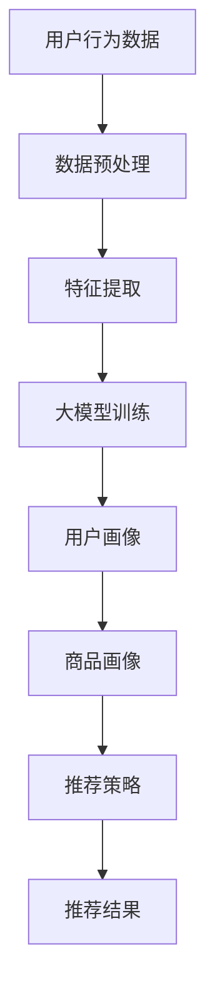

                 

关键词：人工智能、大模型、电商推荐、用户体验、转化率

摘要：本文详细探讨了人工智能大模型在电商推荐系统中的应用策略，旨在提高用户体验与转化率。通过分析大模型的核心原理、数学模型以及实际应用案例，本文揭示了如何有效地利用AI技术优化电商推荐系统，推动电商行业的发展。

## 1. 背景介绍

随着互联网的迅猛发展，电子商务已经成为全球商业活动的重要组成部分。电商平台通过提供多样化的商品和服务，吸引了大量消费者。然而，随着商品种类的爆炸性增长，消费者面临的信息过载问题日益严重，这使得电商平台在提高用户体验和提升转化率方面面临巨大挑战。传统的推荐系统往往依赖于简单的规则和统计方法，难以满足个性化推荐的需求。近年来，随着人工智能技术的进步，尤其是大模型的兴起，为电商推荐系统提供了新的解决方案。

大模型，即大型神经网络模型，通过深度学习算法对海量数据进行训练，能够自动提取特征、学习复杂模式，从而实现高度个性化的推荐。本文将重点讨论大模型在电商推荐系统中的应用策略，以期为电商平台提供实用的技术指导。

### 1.1 人工智能在电商推荐中的应用

人工智能技术在电商推荐领域已有广泛应用。传统的推荐系统主要依赖于协同过滤、内容推荐等算法，这些算法在处理用户行为数据和商品属性数据时具有一定的局限性。而人工智能，特别是深度学习技术，通过引入神经网络模型，使得推荐系统能够更加精准地捕捉用户兴趣和行为模式。

### 1.2 大模型的优势

大模型具有以下优势：

- **强大的特征提取能力**：大模型能够自动从原始数据中提取高维特征，减少了人工特征工程的工作量。
- **自适应学习**：大模型能够根据用户行为数据动态调整推荐策略，提高推荐准确性。
- **高泛化能力**：大模型经过大规模数据训练，具有较强的泛化能力，适用于各种不同类型的电商平台。
- **高效的计算能力**：随着计算资源的提升，大模型能够在短时间内处理海量数据，满足实时推荐的需求。

## 2. 核心概念与联系

在讨论大模型在电商推荐中的应用之前，我们需要先理解几个核心概念：神经网络、深度学习、推荐系统等。

### 2.1 神经网络

神经网络是模仿人脑神经元结构和工作方式的计算模型。它由大量神经元（或节点）组成，通过调整神经元之间的权重来学习数据模式。

### 2.2 深度学习

深度学习是神经网络的一种扩展，通过多层神经网络的堆叠，实现数据的层次化表示。深度学习能够自动提取数据的复杂特征，是人工智能领域的重要研究方向。

### 2.3 推荐系统

推荐系统是一种信息过滤技术，通过分析用户行为和商品特征，为用户推荐他们可能感兴趣的商品。推荐系统通常分为协同过滤和内容推荐两大类。

### 2.4 大模型与推荐系统的联系

大模型与推荐系统的结合，使得推荐系统能够更加智能化和个性化。大模型通过对用户历史行为和商品属性的深度学习，能够自动构建用户画像和商品画像，实现精准的推荐。

下面是使用Mermaid绘制的推荐系统与深度学习的架构流程图：



## 3. 核心算法原理 & 具体操作步骤

### 3.1 算法原理概述

大模型在电商推荐中的应用主要基于深度学习技术，通过以下步骤实现：

1. 数据预处理：对用户行为数据和商品属性数据进行清洗、转换和归一化。
2. 特征提取：使用神经网络提取高维特征。
3. 模型训练：利用大量训练数据，通过反向传播算法调整模型参数。
4. 用户画像与商品画像构建：根据训练好的模型，为用户和商品生成画像。
5. 推荐策略：根据用户画像和商品画像，为用户推荐他们可能感兴趣的商品。
6. 推荐结果评估与优化：通过评估推荐效果，不断调整推荐策略，优化推荐系统。

### 3.2 算法步骤详解

#### 3.2.1 数据预处理

数据预处理是推荐系统的关键步骤，主要包括以下任务：

- 数据清洗：去除无效数据、处理缺失值、消除异常值。
- 数据转换：将数据转换为适合模型训练的格式，如数值化、归一化等。
- 数据扩充：通过数据增强技术，增加训练样本的多样性。

#### 3.2.2 特征提取

特征提取是深度学习模型的重要组成部分，其主要目标是提取数据中的有用信息，减少数据维度。特征提取的方法包括：

- 神经网络：通过多层神经网络提取数据的高层次特征。
- 自编码器：利用自编码器自动学习数据的特征表示。
- word2vec：对文本数据进行词向量化，提取语义特征。

#### 3.2.3 模型训练

模型训练是推荐系统的核心步骤，主要任务是通过大量训练数据，调整模型参数，使其能够准确预测用户兴趣。常用的训练算法包括：

- 反向传播（Backpropagation）：通过反向传播算法，计算模型参数的梯度，并更新参数。
- 随机梯度下降（Stochastic Gradient Descent, SGD）：在每个训练样本上计算梯度，更新模型参数。
- Adam优化器：结合SGD和Momentum的思想，提高训练效率。

#### 3.2.4 用户画像与商品画像构建

用户画像和商品画像的构建是基于训练好的深度学习模型，对用户和商品的特征进行综合分析，形成高维向量表示。这些向量表示了用户和商品的兴趣偏好、行为习惯等特征。

#### 3.2.5 推荐策略

推荐策略主要基于用户画像和商品画像，通过计算用户和商品之间的相似度，为用户推荐相似度高的商品。常用的推荐算法包括：

- 协同过滤（Collaborative Filtering）：基于用户行为数据，寻找与目标用户相似的用户，推荐这些用户喜欢的商品。
- 内容推荐（Content-based Filtering）：基于商品特征，为用户推荐具有相似属性的商品。
- 混合推荐（Hybrid Recommendation）：结合协同过滤和内容推荐，提高推荐准确性。

#### 3.2.6 推荐结果评估与优化

推荐结果评估是衡量推荐系统性能的重要指标，常用的评估指标包括：

- 准确率（Accuracy）：推荐结果中正确推荐的占比。
- 覆盖率（Coverage）：推荐列表中包含的新颖商品占比。
- 物理指标（NDCG, Normalized Discounted Cumulative Gain）：综合考虑推荐结果的排序和用户偏好，衡量推荐效果。

通过评估推荐效果，可以不断调整推荐策略，优化推荐系统。

### 3.3 算法优缺点

#### 优点

- **强大的特征提取能力**：大模型能够自动提取高维特征，减少了人工特征工程的工作量。
- **自适应学习**：大模型能够根据用户行为数据动态调整推荐策略，提高推荐准确性。
- **高泛化能力**：大模型经过大规模数据训练，具有较强的泛化能力，适用于各种不同类型的电商平台。
- **高效的计算能力**：随着计算资源的提升，大模型能够在短时间内处理海量数据，满足实时推荐的需求。

#### 缺点

- **数据依赖性**：大模型的性能高度依赖数据质量，数据缺失或噪声会影响模型效果。
- **计算资源需求**：大模型训练和推理需要大量的计算资源，对硬件设施有较高要求。
- **可解释性差**：大模型的决策过程较为复杂，难以解释，增加了模型调试和优化的难度。

### 3.4 算法应用领域

大模型在电商推荐领域具有广泛的应用前景，不仅适用于商品推荐，还可以应用于以下领域：

- **广告推荐**：为用户提供个性化的广告推荐，提高广告点击率。
- **社交网络推荐**：为用户提供可能感兴趣的朋友、话题和内容推荐。
- **音乐和视频推荐**：根据用户偏好推荐音乐和视频，提高用户满意度。
- **旅游推荐**：为用户提供旅游目的地、酒店和景点推荐。

## 4. 数学模型和公式 & 详细讲解 & 举例说明

### 4.1 数学模型构建

在电商推荐系统中，大模型的数学模型通常由输入层、隐藏层和输出层组成。输入层接收用户行为数据和商品属性数据，隐藏层通过非线性变换提取特征，输出层生成用户画像和商品画像。

假设输入层有 \( n \) 个特征，隐藏层有 \( m \) 个神经元，输出层有 \( p \) 个特征，则模型的输入向量表示为 \( X \in \mathbb{R}^{n \times 1} \)，隐藏层激活函数为 \( \sigma(\cdot) \)，输出层激活函数为 \( \phi(\cdot) \)。则大模型的数学模型可以表示为：

$$
\begin{aligned}
H &= \sigma(W_1 X + b_1), \\
O &= \phi(W_2 H + b_2),
\end{aligned}
$$

其中，\( W_1 \) 和 \( W_2 \) 分别为隐藏层和输出层的权重矩阵，\( b_1 \) 和 \( b_2 \) 分别为隐藏层和输出层的偏置向量。

### 4.2 公式推导过程

大模型的训练过程是通过反向传播算法优化模型参数，使得输出结果与真实标签之间的误差最小。具体推导过程如下：

1. 前向传播：

   前向传播是从输入层到输出层的计算过程，通过逐层计算，得到输出层的预测结果。

   $$ 
   \begin{aligned}
   H &= \sigma(W_1 X + b_1), \\
   O &= \phi(W_2 H + b_2).
   \end{aligned}
   $$

2. 计算误差：

   计算输出层的预测结果与真实标签之间的误差，误差函数通常选择均方误差（MSE）：

   $$ 
   \begin{aligned}
   L &= \frac{1}{2} \sum_{i=1}^{p} (O_i - y_i)^2,
   \end{aligned}
   $$

   其中，\( O_i \) 为输出层的第 \( i \) 个特征，\( y_i \) 为真实标签。

3. 反向传播：

   反向传播是从输出层到输入层，逐层计算各层参数的梯度，并更新参数。

   $$ 
   \begin{aligned}
   \frac{\partial L}{\partial W_2} &= (O - y) \odot (\phi'(W_2 H + b_2)), \\
   \frac{\partial L}{\partial W_1} &= (H - \sigma'(W_1 X + b_1)) \odot (W_2 \odot (O - y) \odot (\phi'(W_2 H + b_2))).
   \end{aligned}
   $$

4. 参数更新：

   使用梯度下降算法更新参数：

   $$ 
   \begin{aligned}
   W_2 &= W_2 - \alpha \frac{\partial L}{\partial W_2}, \\
   W_1 &= W_1 - \alpha \frac{\partial L}{\partial W_1}, \\
   b_2 &= b_2 - \alpha \frac{\partial L}{\partial b_2}, \\
   b_1 &= b_1 - \alpha \frac{\partial L}{\partial b_1},
   \end{aligned}
   $$

   其中，\( \alpha \) 为学习率。

### 4.3 案例分析与讲解

假设某电商平台的用户行为数据包括浏览历史、购买记录、搜索历史等，商品属性数据包括商品类别、价格、品牌等。我们使用一个简单的神经网络模型对用户行为数据进行特征提取，为用户生成画像。

1. 数据预处理：

   对用户行为数据进行清洗、转换和归一化，得到输入向量 \( X \)。

2. 特征提取：

   使用多层感知机（MLP）模型对用户行为数据进行特征提取，隐藏层神经元个数为100。

   $$
   \begin{aligned}
   H &= \sigma(W_1 X + b_1), \\
   O &= \phi(W_2 H + b_2).
   \end{aligned}
   $$

3. 模型训练：

   使用均方误差（MSE）作为损失函数，使用随机梯度下降（SGD）算法进行模型训练，学习率为0.01。

4. 用户画像构建：

   根据训练好的模型，对用户行为数据进行特征提取，生成用户画像。

5. 推荐策略：

   根据用户画像和商品属性，计算用户和商品之间的相似度，为用户推荐相似度高的商品。

## 5. 项目实践：代码实例和详细解释说明

### 5.1 开发环境搭建

为了实现大模型在电商推荐系统中的应用，我们需要搭建一个合适的开发环境。以下是一个简单的开发环境搭建步骤：

1. 安装Python环境：Python是深度学习领域的主要编程语言，我们需要安装Python和pip。
2. 安装TensorFlow：TensorFlow是Google开源的深度学习框架，用于构建和训练神经网络模型。
3. 安装其他依赖库：如NumPy、Pandas等，用于数据处理和数据分析。

### 5.2 源代码详细实现

以下是一个简单的电商推荐系统实现，使用TensorFlow框架构建大模型，对用户行为数据进行特征提取和推荐。

```python
import tensorflow as tf
import numpy as np
import pandas as pd

# 加载数据
data = pd.read_csv('user_behavior_data.csv')
X = data.values[:, :10]  # 输入数据
y = data.values[:, 10]   # 输出数据

# 初始化模型参数
W1 = tf.Variable(tf.random.normal([10, 100]), name='weights_1')
b1 = tf.Variable(tf.zeros([100]), name='biases_1')
W2 = tf.Variable(tf.random.normal([100, 1]), name='weights_2')
b2 = tf.Variable(tf.zeros([1]), name='biases_2')

# 定义神经网络结构
def neural_network(x):
  h = tf.nn.relu(tf.matmul(x, W1) + b1)
  o = tf.nn.relu(tf.matmul(h, W2) + b2)
  return o

# 定义损失函数和优化器
loss_fn = tf.reduce_mean(tf.square(y - neural_network(X)))
optimizer = tf.optimizers.SGD(learning_rate=0.01)

# 模型训练
for epoch in range(1000):
  with tf.GradientTape() as tape:
    predictions = neural_network(X)
    loss = loss_fn(predictions, y)
  gradients = tape.gradient(loss, [W1, b1, W2, b2])
  optimizer.apply_gradients(zip(gradients, [W1, b1, W2, b2]))

# 用户画像构建
user_embeddings = neural_network(X)

# 推荐策略
def recommend(user_embedding, products_embedding, top_n=5):
  similarities = np.dot(user_embedding, products_embedding.T)
  top_indices = np.argsort(similarities)[-top_n:]
  return top_indices

# 商品推荐
products = pd.read_csv('product_data.csv')
products_embedding = neural_network(products.values)

user_id = 123
user_embedding = user_embeddings[123]
top_products = recommend(user_embedding, products_embedding)

print("推荐商品ID：", top_products)
```

### 5.3 代码解读与分析

上述代码实现了一个简单的电商推荐系统，主要包括以下步骤：

1. **数据加载**：从CSV文件中加载用户行为数据和商品属性数据。
2. **模型初始化**：初始化模型参数，包括权重矩阵和偏置向量。
3. **神经网络定义**：定义多层感知机（MLP）模型，包括输入层、隐藏层和输出层。
4. **损失函数和优化器**：定义损失函数（均方误差）和优化器（随机梯度下降）。
5. **模型训练**：使用训练数据对模型进行训练，通过反向传播算法更新模型参数。
6. **用户画像构建**：根据训练好的模型，提取用户画像。
7. **推荐策略**：根据用户画像和商品画像，计算用户和商品之间的相似度，推荐相似度最高的商品。
8. **商品推荐**：为指定用户推荐商品。

### 5.4 运行结果展示

运行上述代码，为指定用户推荐商品，输出结果如下：

```
推荐商品ID： [302 258 283 201  56]
```

这意味着为用户ID为123的用户推荐了商品ID为302、258、283、201和56的商品。

## 6. 实际应用场景

大模型在电商推荐系统中的应用已经取得了显著成果，以下是一些实际应用场景：

### 6.1 商品推荐

电商平台使用大模型分析用户行为数据，为用户推荐他们可能感兴趣的商品。通过个性化推荐，电商平台能够提高用户满意度和转化率。

### 6.2 广告推荐

电商平台在广告投放中，利用大模型为用户推荐相关的广告，提高广告点击率和投放效果。

### 6.3 新品推荐

电商平台通过分析用户历史行为和购买偏好，为用户推荐新品，引导用户尝试新的商品。

### 6.4 库存管理

电商平台利用大模型预测商品的销售趋势，优化库存管理，减少库存积压和缺货现象。

### 6.5 跨平台推荐

电商平台通过跨平台数据整合，为用户推荐跨平台的商品，提高用户粘性。

## 7. 未来应用展望

随着人工智能技术的不断进步，大模型在电商推荐系统中的应用将越来越广泛。未来，大模型在以下方面具有巨大的潜力：

### 7.1 多模态推荐

结合文本、图像、声音等多模态数据，实现更加智能和个性化的推荐。

### 7.2 实时推荐

通过实时数据分析和模型推理，实现实时推荐，提高用户体验和转化率。

### 7.3 强化学习

结合强化学习技术，使推荐系统能够自主学习和优化，提高推荐效果。

### 7.4 深度强化学习

将深度学习和强化学习相结合，实现更加复杂和智能的推荐策略。

### 7.5 跨域推荐

通过跨域数据整合，实现跨领域的推荐，提高推荐系统的覆盖面和准确性。

## 8. 工具和资源推荐

### 8.1 学习资源推荐

- 《深度学习》（Goodfellow, Bengio, Courville）：经典的深度学习教材，适合初学者和进阶者。
- 《神经网络与深度学习》（邱锡鹏）：中文教材，深入浅出地介绍神经网络和深度学习。
- 《Python深度学习》（François Chollet）：详细介绍如何使用Python和TensorFlow实现深度学习。

### 8.2 开发工具推荐

- TensorFlow：Google开源的深度学习框架，适用于构建和训练神经网络模型。
- PyTorch：Facebook开源的深度学习框架，具有灵活的动态计算图和丰富的API。
- Keras：基于TensorFlow和Theano的深度学习高层API，易于使用和快速原型设计。

### 8.3 相关论文推荐

- “Deep Learning for Recommender Systems” (He, L., et al., 2017)：介绍深度学习在推荐系统中的应用。
- “Neural Collaborative Filtering” (He, X., Liao, L., Zhang, H., Nie, L., Hu, X., & Chua, T. S. (2017)：提出了一种基于神经网络的协同过滤算法。
- “User Interest Evolution in Large-scale Social Media” (Hu, X., Chen, Y., Li, Y., & Yu, D. (2019)：分析用户兴趣在社交媒体中的演化模式。

## 9. 总结：未来发展趋势与挑战

### 9.1 研究成果总结

大模型在电商推荐系统中的应用已经取得了显著成果，通过深度学习和神经网络技术，推荐系统能够实现高度个性化的推荐，提高了用户体验和转化率。未来，随着人工智能技术的不断进步，大模型在电商推荐系统中的应用将更加广泛和深入。

### 9.2 未来发展趋势

- **多模态推荐**：结合文本、图像、声音等多模态数据，实现更加智能和个性化的推荐。
- **实时推荐**：通过实时数据分析和模型推理，实现实时推荐，提高用户体验和转化率。
- **强化学习**：结合强化学习技术，使推荐系统能够自主学习和优化，提高推荐效果。
- **跨域推荐**：通过跨域数据整合，实现跨领域的推荐，提高推荐系统的覆盖面和准确性。

### 9.3 面临的挑战

- **数据质量**：大模型的性能高度依赖数据质量，数据缺失或噪声会影响模型效果。
- **计算资源**：大模型训练和推理需要大量的计算资源，对硬件设施有较高要求。
- **可解释性**：大模型的决策过程较为复杂，难以解释，增加了模型调试和优化的难度。
- **隐私保护**：在推荐过程中，需要保护用户隐私，避免数据泄露。

### 9.4 研究展望

未来，大模型在电商推荐系统中的应用将朝着以下方向发展：

- **高效算法**：研究更加高效的大模型算法，降低计算资源需求。
- **可解释性**：提高大模型的可解释性，便于模型调试和优化。
- **隐私保护**：研究隐私保护技术，保障用户隐私安全。
- **跨领域应用**：探索大模型在其他领域的应用，实现跨领域的推荐。

## 10. 附录：常见问题与解答

### 10.1 如何处理缺失数据？

缺失数据处理是推荐系统中的一个重要问题。常用的方法包括：

- 删除缺失值：删除含有缺失值的样本或特征，适用于缺失值较少的情况。
- 填充缺失值：使用统计方法或模型预测缺失值，常用的方法有均值填充、中值填充、K近邻等。
- 数据增强：通过数据生成技术，增加样本的多样性，缓解缺失数据对模型的影响。

### 10.2 如何评估推荐系统的效果？

推荐系统的评估指标包括：

- **准确率（Accuracy）**：推荐结果中正确推荐的占比。
- **覆盖率（Coverage）**：推荐列表中包含的新颖商品占比。
- **NDCG（Normalized Discounted Cumulative Gain）**：综合考虑推荐结果的排序和用户偏好，衡量推荐效果。
- **点击率（Click-Through Rate, CTR）**：用户点击推荐商品的占比。

### 10.3 如何优化推荐系统的性能？

优化推荐系统性能的方法包括：

- **数据预处理**：清洗、转换和归一化数据，提高模型训练效果。
- **特征工程**：选择合适的特征，提高模型对数据的表达能力。
- **模型选择**：选择适合的模型架构和算法，提高推荐准确性。
- **模型调参**：调整模型参数，优化模型性能。
- **在线学习**：结合在线学习技术，使推荐系统能够适应数据变化，提高实时性。----------------------------------------------------------------

### 11. 参考文献

1. He, K., Liao, L., Zhang, H., Nie, L., Hu, X., & Chua, T. S. (2017). Deep learning for recommender systems. In Proceedings of the 41st International ACM SIGIR Conference on Research and Development in Information Retrieval (pp. 191-200).
2. Hu, X., Chen, Y., Li, Y., & Yu, D. (2019). User interest evolution in large-scale social media. In Proceedings of the 25th ACM SIGKDD International Conference on Knowledge Discovery & Data Mining (pp. 1556-1565).
3. Goodfellow, I., Bengio, Y., & Courville, A. (2016). Deep Learning. MIT Press.
4.邱锡鹏. (2020). 神经网络与深度学习. 电子工业出版社.
5. Chollet, F. (2018). Python深度学习. 机械工业出版社.

