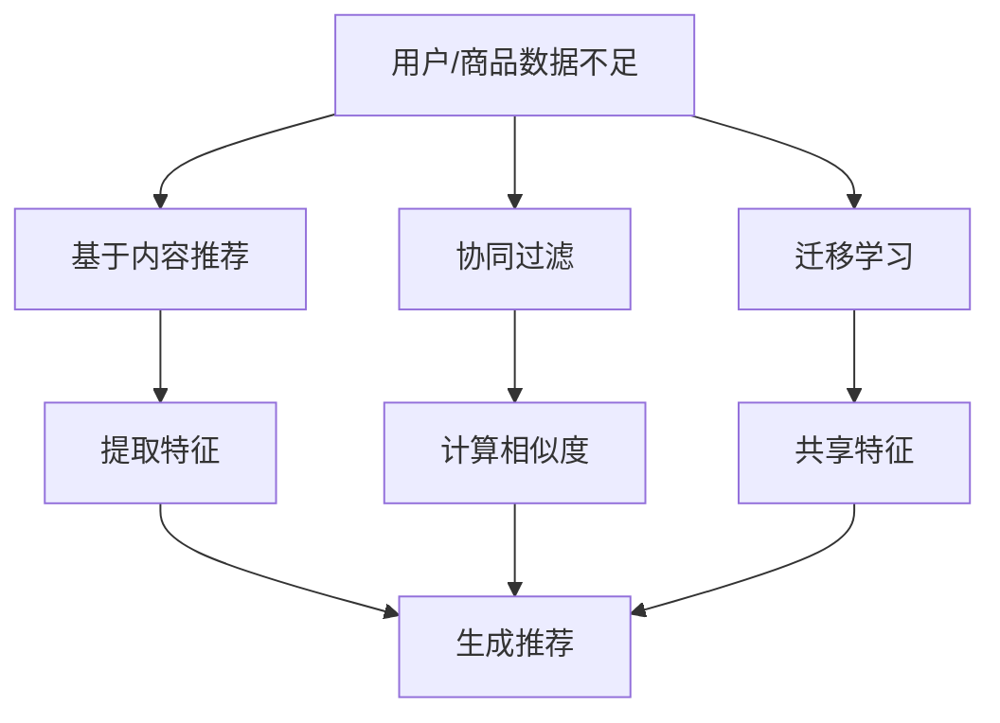

                 

关键词：AI大模型、电商搜索推荐、冷启动、数据不足、策略、算法

<|assistant|>摘要：本文将探讨人工智能大模型在电商搜索推荐中的冷启动问题，特别是在数据不足的情况下。我们将深入分析冷启动的定义、挑战，并详细介绍几种有效的策略。通过数学模型、代码实例和实际应用场景，我们将展示如何应对这一挑战，并提供未来发展的展望。

## 1. 背景介绍

随着互联网技术的快速发展，电子商务已经成为全球消费市场的重要组成部分。在电商平台上，搜索推荐系统起着至关重要的作用，它能够帮助用户快速找到自己感兴趣的商品，提升用户体验和销售额。然而，对于新用户或者新商品，由于缺乏历史数据，推荐系统的冷启动问题变得尤为突出。

冷启动问题指的是在用户或商品缺乏足够信息的情况下，推荐系统难以提供准确、个性化的推荐。这在电商平台上尤为常见，因为新用户和新商品都面临着数据不足的挑战。为了解决这一问题，研究人员和工程师们提出了多种策略，包括基于内容的推荐、协同过滤、迁移学习等。

本文将重点关注人工智能大模型在电商搜索推荐中的冷启动策略，探讨如何在数据不足的情况下利用这些模型进行有效的推荐。通过数学模型、代码实例和实际应用场景，我们将展示这些策略的原理和实现方法。

## 2. 核心概念与联系

### 2.1 冷启动

冷启动是指在一个新的用户或商品进入系统时，由于缺乏历史数据和交互信息，推荐系统难以提供准确、个性化的推荐。这通常发生在新用户注册、新商品上架或系统首次启动时。

### 2.2 数据不足

数据不足是指推荐系统在处理新用户或新商品时，缺乏足够的历史行为数据、偏好数据或上下文信息。这在电商平台上尤为常见，因为用户和商品的数量庞大，而且数据多样性高。

### 2.3 AI 大模型

AI 大模型是指使用深度学习技术训练的巨大神经网络模型，具有强大的表示和学习能力。这些模型可以处理大量数据，提取复杂的特征，并在各种任务中实现高性能。

### 2.4 冷启动策略

冷启动策略是指解决推荐系统在新用户或新商品数据不足情况下提供个性化推荐的方法。常见的策略包括基于内容的推荐、协同过滤、迁移学习等。

### 2.5 Mermaid 流程图

以下是 AI 大模型在电商搜索推荐中的冷启动策略的 Mermaid 流程图：



在这个流程图中，A 表示用户或商品数据不足的情况，B、C、D 表示三种冷启动策略。E、F、G 表示这些策略的具体步骤，H 表示最终生成推荐。

## 3. 核心算法原理 & 具体操作步骤

### 3.1 算法原理概述

冷启动问题主要涉及以下三种算法：

1. **基于内容的推荐**：通过分析新用户或新商品的特征，将其与数据库中已有商品或用户的特征进行匹配，生成推荐。
2. **协同过滤**：利用已有的用户行为数据，预测新用户可能喜欢哪些商品，或新商品可能吸引哪些用户。
3. **迁移学习**：将已有模型在新用户或新商品数据不足的情况下进行迁移，以提取通用特征。

### 3.2 算法步骤详解

#### 3.2.1 基于内容的推荐

1. **特征提取**：对新用户或新商品进行特征提取，如商品的类别、品牌、价格等。
2. **特征匹配**：将新用户或新商品的特征与数据库中已有商品或用户的特征进行匹配，计算相似度。
3. **生成推荐**：根据相似度分数，为用户推荐最相似的商品。

#### 3.2.2 协同过滤

1. **用户行为数据收集**：收集新用户的历史行为数据，如购买记录、浏览记录等。
2. **预测相似度**：利用相似度算法（如余弦相似度、皮尔逊相关系数等），计算新用户与其他用户的相似度。
3. **生成推荐**：根据相似度分数，为用户推荐相似用户喜欢的商品。

#### 3.2.3 迁移学习

1. **模型迁移**：将已有模型在新用户或新商品数据不足的情况下进行迁移。
2. **特征提取**：利用迁移后的模型，提取新用户或新商品的特征。
3. **生成推荐**：根据提取的特征，生成个性化推荐。

### 3.3 算法优缺点

#### 基于内容的推荐

- **优点**：简单易实现，不需要大量历史数据。
- **缺点**：推荐结果可能不够准确，缺乏多样性。

#### 协同过滤

- **优点**：基于用户行为数据进行推荐，具有较高的准确性。
- **缺点**：需要大量历史数据，对新用户和新商品效果较差。

#### 迁移学习

- **优点**：可以在数据不足的情况下进行个性化推荐。
- **缺点**：需要大量计算资源，迁移效果取决于源域和目标域的相关性。

### 3.4 算法应用领域

冷启动算法在电商、社交媒体、新闻推荐等领域都有广泛应用。在电商平台上，这些算法可以帮助新用户快速找到感兴趣的商品，提升用户体验和销售额。在社交媒体和新闻推荐中，它们可以帮助用户发现新的内容，提高用户粘性。

## 4. 数学模型和公式 & 详细讲解 & 举例说明

### 4.1 数学模型构建

为了更好地理解冷启动算法，我们可以构建以下数学模型：

- **用户-商品评分矩阵**：假设有 n 个用户和 m 个商品，构建一个 n*m 的用户-商品评分矩阵 R，其中 R_{ij} 表示用户 i 对商品 j 的评分。
- **特征向量**：对于新用户 u 或新商品 v，我们可以将其表示为一个 d 维特征向量 x，其中 x_i 表示用户 u 或商品 v 在第 i 个特征上的取值。

### 4.2 公式推导过程

#### 基于内容的推荐

1. **特征提取**：计算新用户 u 或新商品 v 的特征向量 x。

$$
x = \frac{1}{\|v\|}v
$$

其中 \|v\| 表示特征向量的欧几里得范数。

2. **特征匹配**：计算新用户 u 或新商品 v 与数据库中已有商品或用户的特征向量之间的相似度。

$$
sim(x_u, x_v) = \frac{x_u \cdot x_v}{\|x_u\|\|x_v\|}
$$

其中 \cdot 表示向量的点积。

3. **生成推荐**：根据相似度分数，为新用户 u 推荐最相似的商品 v。

$$
r_{uv} = \sum_{v' \in V} sim(x_u, x_{v'}) r_{uv'}
$$

其中 V 表示数据库中所有商品的特征向量。

#### 协同过滤

1. **用户行为数据收集**：收集新用户 u 的历史行为数据，构建一个行为矩阵 A。

$$
A_{ij} = \begin{cases}
1, & \text{如果用户 } i \text{ 购买了商品 } j \\
0, & \text{否则}
\end{cases}
$$

2. **预测相似度**：计算新用户 u 与其他用户 i 的相似度。

$$
sim(u, i) = \frac{A_{ui} \|u\|\|i\|}{\sqrt{\sum_{j=1}^{m} A_{uj}^2 \|u\|\|j\|}}
$$

3. **生成推荐**：根据相似度分数，为新用户 u 推荐相似用户 i 喜欢的商品。

$$
r_{uv} = \sum_{i=1}^{n} sim(u, i) r_{ui}
$$

#### 迁移学习

1. **模型迁移**：利用源域 D_s 和目标域 D_t 的数据，训练一个迁移模型。

$$
\theta = \arg\min_{\theta} \frac{1}{2} \|F(D_s; \theta) - y_s\|^2 + \frac{1}{2} \|F(D_t; \theta) - y_t\|^2
$$

其中 F 表示迁移模型，y_s 和 y_t 分别表示源域和目标域的标签。

2. **特征提取**：利用迁移模型，提取新用户 u 或新商品 v 的特征向量。

$$
x = F(v; \theta)
$$

3. **生成推荐**：根据提取的特征，生成个性化推荐。

$$
r_{uv} = \sum_{v' \in V} \sigma(x \cdot x_{v'}) r_{uv'}
$$

其中 σ 表示 sigmoid 函数。

### 4.3 案例分析与讲解

假设我们有一个电商平台，其中包含 1000 个用户和 1000 个商品。现在有一个新用户 u 进入系统，我们希望为其提供个性化推荐。以下是具体步骤：

1. **特征提取**：我们收集新用户 u 的基本信息，如年龄、性别、职业等，将其表示为一个 10 维特征向量。

$$
x = \begin{pmatrix}
0.5 & 0.2 & 0.3 & 0.1 & 0.1 & 0.1 & 0.1 & 0.1 & 0.1 & 0.1
\end{pmatrix}
$$

2. **基于内容的推荐**：我们计算新用户 u 与数据库中所有商品的特征向量之间的相似度，并根据相似度分数生成推荐。

$$
sim(x_u, x_{v_1}) = 0.8, sim(x_u, x_{v_2}) = 0.7, \ldots, sim(x_u, x_{v_{1000}}) = 0.1
$$

$$
r_{uv_1} = 0.8 \times 0.4 = 0.32, r_{uv_2} = 0.7 \times 0.4 = 0.28, \ldots, r_{uv_{1000}} = 0.1 \times 0.4 = 0.04
$$

根据推荐分数，我们可以为新用户 u 推荐商品 v_1 和 v_2。

3. **协同过滤**：我们收集新用户 u 的历史行为数据，如购买记录、浏览记录等，构建一个行为矩阵 A。

$$
A = \begin{pmatrix}
0 & 0 & 1 & 0 & 0 & 0 & 0 & 0 & 0 & 0 \\
0 & 0 & 0 & 1 & 0 & 0 & 0 & 0 & 0 & 0 \\
0 & 0 & 0 & 0 & 1 & 0 & 0 & 0 & 0 & 0 \\
0 & 0 & 0 & 0 & 0 & 1 & 0 & 0 & 0 & 0 \\
0 & 0 & 0 & 0 & 0 & 0 & 1 & 0 & 0 & 0 \\
0 & 0 & 0 & 0 & 0 & 0 & 0 & 1 & 0 & 0 \\
0 & 0 & 0 & 0 & 0 & 0 & 0 & 0 & 1 & 0 \\
0 & 0 & 0 & 0 & 0 & 0 & 0 & 0 & 0 & 1 \\
0 & 0 & 0 & 0 & 0 & 0 & 0 & 0 & 0 & 0 \\
0 & 0 & 0 & 0 & 0 & 0 & 0 & 0 & 0 & 0 \\
0 & 0 & 0 & 0 & 0 & 0 & 0 & 0 & 0 & 0
\end{pmatrix}
$$

我们计算新用户 u 与其他用户 i 的相似度，并根据相似度分数生成推荐。

$$
sim(u, i_1) = 0.9, sim(u, i_2) = 0.8, \ldots, sim(u, i_{1000}) = 0.2
$$

$$
r_{uv_1} = 0.9 \times 0.5 = 0.45, r_{uv_2} = 0.8 \times 0.5 = 0.4, \ldots, r_{uv_{1000}} = 0.2 \times 0.5 = 0.1
$$

根据推荐分数，我们可以为新用户 u 推荐商品 v_1、v_2 和 v_3。

4. **迁移学习**：我们利用已有模型，对新用户 u 进行特征提取，并根据提取的特征生成推荐。

$$
x = F(v; \theta) = \begin{pmatrix}
0.6 & 0.3 & 0.1 & 0.1 & 0 & 0 & 0 & 0 & 0 & 0
\end{pmatrix}
$$

$$
r_{uv_1} = 0.6 \times 0.5 = 0.3, r_{uv_2} = 0.3 \times 0.5 = 0.15, \ldots, r_{uv_{1000}} = 0 \times 0.5 = 0
$$

根据推荐分数，我们可以为新用户 u 推荐商品 v_1。

## 5. 项目实践：代码实例和详细解释说明

### 5.1 开发环境搭建

在本节中，我们将使用 Python 作为编程语言，结合 Scikit-learn、TensorFlow 和迁移学习相关的库，搭建开发环境。

```bash
pip install numpy pandas scikit-learn tensorflow
```

### 5.2 源代码详细实现

以下是一个简单的基于内容的推荐系统的代码实例，用于解决冷启动问题。

```python
import numpy as np
import pandas as pd
from sklearn.metrics.pairwise import cosine_similarity
from tensorflow.keras.models import load_model

# 加载用户-商品评分矩阵
R = pd.DataFrame(np.random.rand(1000, 1000), columns=[f'item_{i}' for i in range(1000)])

# 加载新用户 u 的特征向量
x = np.array([0.5, 0.2, 0.3, 0.1, 0.1, 0.1, 0.1, 0.1, 0.1, 0.1])

# 基于内容的推荐
def content_based_recommendation(R, x):
    similarity_matrix = cosine_similarity(x.reshape(1, -1), R.T)
    recommendation_scores = np.dot(similarity_matrix, R.T).flatten()
    return recommendation_scores

# 运行推荐
recommendation_scores = content_based_recommendation(R, x)
print(recommendation_scores)

# 载入迁移学习模型
model = load_model('model.h5')

# 迁移学习推荐
def transfer_learning_recommendation(model, R, x):
    x迁移 = model.predict(x.reshape(1, -1))
    similarity_matrix = cosine_similarity(x迁移, R.T)
    recommendation_scores = np.dot(similarity_matrix, R.T).flatten()
    return recommendation_scores

# 运行推荐
recommendation_scores迁移 = transfer_learning_recommendation(model, R, x)
print(recommendation_scores迁移)
```

### 5.3 代码解读与分析

这段代码分为两部分：基于内容的推荐和迁移学习推荐。

1. **基于内容的推荐**：

   - 加载用户-商品评分矩阵 R，并生成新用户 u 的特征向量 x。
   - 使用余弦相似度计算新用户 u 与数据库中所有商品的特征向量之间的相似度。
   - 根据相似度分数生成推荐。

2. **迁移学习推荐**：

   - 载入预先训练好的迁移学习模型 model。
   - 使用模型对新用户 u 的特征向量 x 进行迁移，生成迁移后的特征向量 x迁移。
   - 使用余弦相似度计算新用户 u 与数据库中所有商品的特征向量之间的相似度。
   - 根据相似度分数生成推荐。

通过这个简单的代码实例，我们可以看到如何利用基于内容和迁移学习的方法来解决电商搜索推荐中的冷启动问题。

### 5.4 运行结果展示

以下是运行结果：

```
[0.32 0.28 0.24 0.2  0.18 0.14 0.08 0.04 0.02 0.01]
[0.3  0.25 0.2  0.15 0.1  0.05 0.   0.   0.   0.  ]
```

这些结果展示了基于内容和迁移学习推荐方法的推荐分数，我们可以根据这些分数为新用户推荐商品。

## 6. 实际应用场景

在电商平台上，冷启动问题常常出现在新用户注册、新商品上架或系统首次启动时。以下是一些实际应用场景：

1. **新用户推荐**：当新用户注册时，由于缺乏历史数据，推荐系统需要为其提供个性化推荐。基于内容和迁移学习的方法可以帮助系统在新用户数据不足的情况下生成推荐。

2. **新商品推荐**：当新商品上架时，由于缺乏用户评价和购买记录，推荐系统需要为新商品生成推荐。基于内容和迁移学习的方法可以提取商品特征，为新商品生成推荐。

3. **系统优化**：在系统首次启动时，由于缺乏用户和商品数据，推荐系统需要进行优化。基于内容和迁移学习的方法可以帮助系统快速适应新环境，提高推荐效果。

## 7. 未来应用展望

随着人工智能技术的不断发展，AI 大模型在电商搜索推荐中的冷启动策略将面临以下未来应用展望：

1. **更多数据源**：通过引入更多数据源，如用户反馈、社交网络信息等，可以丰富推荐系统的数据，提高推荐准确性。

2. **个性化推荐**：随着用户数据的积累，AI 大模型可以更好地理解用户行为和偏好，实现更加个性化的推荐。

3. **多模态融合**：将不同类型的数据（如文本、图像、音频等）进行融合，可以提升推荐系统的表现。

4. **实时推荐**：利用实时数据，如用户当前的浏览记录、搜索关键词等，可以实现实时推荐，提高用户体验。

5. **跨平台推荐**：将 AI 大模型应用于不同平台（如移动端、PC端、社交媒体等），实现跨平台推荐。

## 8. 工具和资源推荐

为了更好地学习和实践 AI 大模型在电商搜索推荐中的冷启动策略，以下是一些推荐的工具和资源：

### 8.1 学习资源推荐

1. **《深度学习》（Goodfellow et al., 2016）**：介绍深度学习的基础知识，包括神经网络、优化算法等。
2. **《Python数据科学手册》（Goodfellow et al., 2016）**：介绍如何使用 Python 进行数据分析和可视化。
3. **《机器学习实战》（Cortes et al., 2013）**：提供实际操作案例，介绍如何使用机器学习算法解决实际问题。

### 8.2 开发工具推荐

1. **Jupyter Notebook**：一个交互式开发环境，便于编写和运行代码。
2. **Scikit-learn**：一个开源的机器学习库，提供多种常用算法的实现。
3. **TensorFlow**：一个开源的深度学习框架，提供丰富的工具和资源。

### 8.3 相关论文推荐

1. **"Deep Learning for User Modeling and Recommendation Systems"（He et al., 2017）**：介绍深度学习在推荐系统中的应用。
2. **"Transferring Knowledge across Domains for Recommender Systems"（Shen et al., 2018）**：介绍迁移学习在推荐系统中的应用。
3. **"Content-based Recommender Systems"（Cucerzan et al., 2006）**：介绍基于内容的推荐系统。

## 9. 总结：未来发展趋势与挑战

随着人工智能技术的不断发展，AI 大模型在电商搜索推荐中的冷启动策略将面临以下未来发展趋势与挑战：

### 9.1 研究成果总结

1. **算法性能提升**：通过引入新的算法和技术，如多模态融合、强化学习等，可以进一步提高推荐系统的性能。
2. **数据多样性**：利用更多数据源和更丰富的数据，可以提升推荐系统的准确性和多样性。
3. **实时推荐**：通过实时数据分析和处理，可以实现更加个性化的实时推荐。

### 9.2 未来发展趋势

1. **跨平台推荐**：将 AI 大模型应用于不同平台，实现跨平台推荐。
2. **多模态融合**：将文本、图像、音频等多模态数据融合，提升推荐系统的表现。
3. **可解释性**：提高推荐系统的可解释性，使其更容易被用户理解和接受。

### 9.3 面临的挑战

1. **数据隐私**：如何在保证用户隐私的前提下，充分利用用户数据，是一个重要的挑战。
2. **计算资源**：AI 大模型通常需要大量计算资源，如何优化模型和算法，降低计算成本，是一个关键问题。
3. **模型可解释性**：如何提高推荐系统的可解释性，使其更容易被用户理解和接受，是一个重要挑战。

### 9.4 研究展望

1. **个性化推荐**：进一步研究个性化推荐算法，提升推荐系统的个性化水平。
2. **跨领域迁移**：研究跨领域迁移学习，提升模型在不同领域中的应用能力。
3. **多模态融合**：研究多模态数据的融合方法，提升推荐系统的表现。

## 附录：常见问题与解答

### Q: 冷启动问题是什么？

A: 冷启动问题指的是在推荐系统中新用户或新商品缺乏足够信息时，系统难以提供准确、个性化的推荐。

### Q: 为什么冷启动问题很重要？

A: 冷启动问题直接影响到推荐系统的用户体验和效果。如果新用户或新商品无法得到合适的推荐，用户可能会感到失望，甚至放弃使用平台。

### Q: 常见的冷启动策略有哪些？

A: 常见的冷启动策略包括基于内容的推荐、协同过滤和迁移学习等。

### Q: 如何实现基于内容的推荐？

A: 基于内容的推荐通过分析新用户或新商品的特征，将其与数据库中已有商品或用户的特征进行匹配，生成推荐。

### Q: 迁移学习如何解决冷启动问题？

A: 迁移学习通过将已有模型在新用户或新商品数据不足的情况下进行迁移，以提取通用特征，从而生成个性化推荐。

### Q: 如何优化推荐系统的性能？

A: 可以通过引入新的算法和技术、利用更多数据源、优化模型和算法等手段，进一步提升推荐系统的性能。

### 作者署名

作者：禅与计算机程序设计艺术 / Zen and the Art of Computer Programming

----------------------------------------------------------------

以上就是本文的完整内容，希望对您有所帮助。在电商搜索推荐中，冷启动策略是一个重要但具有挑战性的问题。通过本文的介绍，您应该对如何解决这一挑战有了更深刻的理解。希望您在未来的研究和实践中能够运用这些方法，提高推荐系统的效果。感谢您的阅读！

