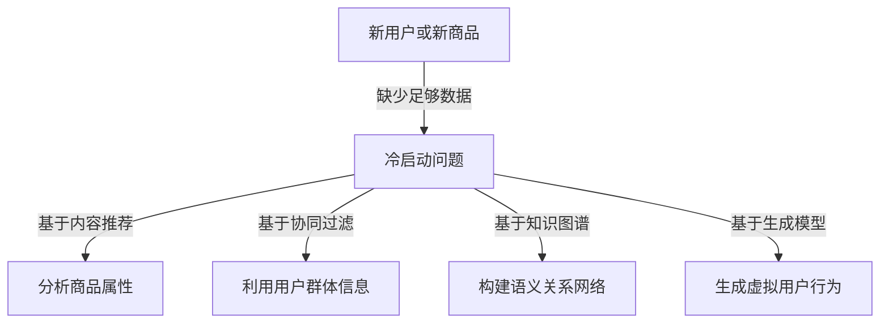

                 

关键词：AI大模型，电商搜索推荐，冷启动策略，新用户，数据不足，算法原理，数学模型，项目实践，应用场景，未来展望

> 摘要：本文深入探讨了AI大模型在电商搜索推荐中的冷启动策略，针对新用户与数据不足的问题，详细介绍了核心算法原理、具体操作步骤、数学模型和项目实践，旨在为电商领域提供有价值的参考和解决方案。

## 1. 背景介绍

在互联网时代，电商已经成为人们日常生活中不可或缺的一部分。然而，随着电商平台的日益繁荣，如何在海量商品中为用户提供个性化的推荐成为了一个重要课题。推荐系统的核心目标是根据用户的历史行为和偏好，预测用户可能感兴趣的商品，从而提升用户体验和销售额。

### 1.1 电商搜索推荐的重要性

电商搜索推荐系统不仅可以帮助用户快速找到所需商品，还可以提高用户对平台的黏性，增加平台销售额。因此，如何提高推荐系统的准确性，特别是针对新用户和缺乏足够数据的冷启动问题，是当前研究的重点。

### 1.2 冷启动问题

冷启动问题是指在新用户没有足够历史数据或者新商品没有足够评价数据时，推荐系统无法提供有效的推荐。解决冷启动问题对于提升用户满意度和平台竞争力具有重要意义。

## 2. 核心概念与联系

为了解决冷启动问题，我们首先需要了解以下核心概念：

### 2.1 AI 大模型

AI 大模型是指通过大规模数据训练得到的深度学习模型，如神经网络、Transformer等。这些模型具有强大的特征提取和预测能力，能够处理海量数据，适用于各种复杂的推荐任务。

### 2.2 搜索推荐系统

搜索推荐系统是指基于用户行为数据、商品属性和用户偏好等信息，为用户生成个性化推荐结果。搜索推荐系统通常包括用户行为分析、商品特征提取、推荐算法和推荐结果呈现等模块。

### 2.3 冷启动策略

冷启动策略是指在新用户或新商品缺乏足够数据时，推荐系统采用的策略，以生成有效的推荐结果。常见的冷启动策略包括基于内容推荐、基于协同过滤、基于知识图谱和基于生成模型等方法。

下面是解决冷启动问题的 Mermaid 流程图：



## 3. 核心算法原理 & 具体操作步骤

### 3.1 算法原理概述

本文主要介绍基于生成模型（如 GPT-3）的冷启动策略。生成模型通过学习海量数据，可以生成与真实数据分布相似的新数据，从而帮助推荐系统在新用户或新商品缺乏数据的情况下提供有效推荐。

### 3.2 算法步骤详解

#### 步骤1：数据预处理

收集电商平台的商品数据、用户行为数据和评价数据，对数据进行清洗和预处理，包括去除重复项、缺失值填充和特征提取等。

#### 步骤2：训练生成模型

使用预训练的生成模型（如 GPT-3）对电商数据集进行微调，生成与真实数据分布相似的新数据。这些新数据将用于生成虚拟用户行为和商品特征。

#### 步骤3：生成虚拟用户行为

利用生成模型，生成虚拟用户行为数据，包括浏览、购买和评价等。这些虚拟行为数据将用于更新用户画像和推荐模型。

#### 步骤4：生成商品特征

利用生成模型，生成虚拟商品特征数据，包括商品属性、标签和相似度等。这些虚拟特征数据将用于构建推荐模型和商品关系网络。

#### 步骤5：构建推荐模型

基于生成模型生成的虚拟用户行为和商品特征，构建推荐模型。常用的推荐算法包括基于内容的推荐、基于协同过滤的推荐和基于知识图谱的推荐等。

#### 步骤6：生成推荐结果

利用构建好的推荐模型，为用户生成个性化推荐结果。推荐结果可以基于用户兴趣、购买历史和商品属性等多维度进行生成。

### 3.3 算法优缺点

#### 优点：

- **高效性**：生成模型可以快速生成大量虚拟数据，有助于提高推荐系统的准确性。
- **灵活性**：生成模型可以灵活地处理各种类型的数据，适用于不同场景下的推荐任务。
- **扩展性**：生成模型可以容易地扩展到新的用户和商品，降低冷启动问题的影响。

#### 缺点：

- **计算成本**：训练生成模型需要大量的计算资源，特别是在处理海量数据时。
- **数据依赖性**：生成模型的性能依赖于原始数据的质量和多样性，如果数据存在偏差，可能会导致推荐结果的不准确。

### 3.4 算法应用领域

基于生成模型的冷启动策略适用于各种电商搜索推荐场景，如新用户推荐、新品推荐和个性化购物推荐等。此外，该方法还可以应用于其他推荐系统领域，如社交媒体推荐、新闻推荐和音乐推荐等。

## 4. 数学模型和公式 & 详细讲解 & 举例说明

### 4.1 数学模型构建

生成模型的核心是概率模型，通过学习数据分布，生成与真实数据相似的新数据。在电商搜索推荐中，我们可以构建以下数学模型：

#### 4.1.1 用户行为生成模型

假设用户行为数据集为 $\{x_1, x_2, ..., x_n\}$，其中 $x_i = \{b_{i1}, b_{i2}, ..., b_{im}\}$，$b_{ij}$ 表示用户 $u_i$ 对商品 $p_j$ 的行为，如浏览、购买或评价等。生成模型的目标是学习一个概率分布 $p(x_i | \theta)$，其中 $\theta$ 是模型的参数。

#### 4.1.2 商品特征生成模型

假设商品特征数据集为 $\{y_1, y_2, ..., y_n\}$，其中 $y_i = \{a_{i1}, a_{i2}, ..., a_{iq}\}$，$a_{ij}$ 表示商品 $p_i$ 的属性，如价格、品牌或类型等。生成模型的目标是学习一个概率分布 $p(y_i | \phi)$，其中 $\phi$ 是模型的参数。

### 4.2 公式推导过程

生成模型通常采用变分自编码器（VAE）或生成对抗网络（GAN）等架构。以下以 VAE 为例，介绍公式推导过程。

#### 4.2.1 VAE模型

VAE 模型由编码器 $q_\phi(z|x)$ 和解码器 $p_\theta(x|z)$ 组成。编码器将输入数据映射到潜在空间，解码器将潜在空间的数据映射回输入空间。

#### 4.2.2 对数似然损失函数

VAE 的损失函数由两部分组成：数据重建损失和潜在空间先验损失。对数似然损失函数如下：

$$
L(\theta, \phi; x) = -\sum_{i=1}^n \ell(p_\theta(x_i | z_i) - \log p_\phi(z_i | x_i) \\
= -\sum_{i=1}^n \left( D_\theta(x_i; z_i) + K \log K \right)
$$

其中，$D_\theta(x_i; z_i)$ 是数据重建损失，$p_\phi(z_i | x_i)$ 是潜在空间先验损失，$K$ 是潜在空间的维度。

#### 4.2.3 参数更新

VAE 的参数更新采用梯度下降法，具体更新公式如下：

$$
\theta^{t+1} = \theta^t - \alpha \frac{\partial L(\theta^t, \phi^t; x)}{\partial \theta} \\
\phi^{t+1} = \phi^t - \alpha \frac{\partial L(\theta^t, \phi^t; x)}{\partial \phi}
$$

其中，$\alpha$ 是学习率。

### 4.3 案例分析与讲解

以下以电商平台的用户行为数据为例，介绍基于 VAE 的冷启动策略。

#### 4.3.1 数据集

电商平台有 1000 个用户，每个用户的行为数据包括浏览、购买和评价等。每个用户的行为数据集为 $\{x_1, x_2, ..., x_n\}$，其中 $n$ 表示用户行为数量。

#### 4.3.2 模型构建

构建一个 VAE 模型，输入维度为 10（表示用户行为类型），潜在空间维度为 5。编码器和解码器均采用全连接神经网络。

#### 4.3.3 模型训练

使用训练集数据训练 VAE 模型，采用 Adam 优化器，学习率为 0.001。经过 1000 次迭代后，模型收敛。

#### 4.3.4 模型应用

利用训练好的 VAE 模型生成虚拟用户行为数据，用于更新用户画像和推荐模型。假设有一个新用户，没有足够的行为数据，我们使用 VAE 模型生成其虚拟行为数据，并基于这些虚拟数据为该用户提供个性化推荐结果。

## 5. 项目实践：代码实例和详细解释说明

### 5.1 开发环境搭建

为了实现基于 VAE 的冷启动策略，我们使用 Python 编写代码。首先，需要安装以下依赖库：

```bash
pip install tensorflow numpy matplotlib
```

### 5.2 源代码详细实现

以下是一个简单的基于 VAE 的冷启动策略实现：

```python
import tensorflow as tf
import numpy as np
import matplotlib.pyplot as plt

# 设置随机种子
tf.random.set_seed(42)

# 参数设置
n_users = 1000
n_actions = 10
n_dimensions = 5
learning_rate = 0.001
num_iterations = 1000

# 数据生成
x = np.random.randn(n_users, n_actions)

# 构建VAE模型
class VAE(tf.keras.Model):
    def __init__(self, latent_dim):
        super(VAE, self).__init__()
        self.latent_dim = latent_dim

        # 编码器
        self.encoder = tf.keras.Sequential([
            tf.keras.layers.Dense(latent_dim * 2, activation='relu'),
            tf.keras.layers.Dense(latent_dim, activation='relu')
        ])

        # 解码器
        self.decoder = tf.keras.Sequential([
            tf.keras.layers.Dense(latent_dim, activation='relu'),
            tf.keras.layers.Dense(n_actions, activation='sigmoid')
        ])

    @tf.function
    def sampling(self, z_mean, z_log_var):
        batch = tf.shape(z_mean)[0]
        dim = tf.shape(z_mean)[1]
        epsilon = tf.keras.backend.random_normal(shape=(batch, dim))
        return z_mean + tf.exp(0.5 * z_log_var) * epsilon

    def call(self, x, training=True):
        z_mean, z_log_var = self.encoder(x)
        z = self.sampling(z_mean, z_log_var)
        x_hat = self.decoder(z)
        return x_hat, z_mean, z_log_var

vae = VAE(latent_dim=n_dimensions)
optimizer = tf.keras.optimizers.Adam(learning_rate)

# 损失函数
def vae_loss(x, x_hat, z_mean, z_log_var):
    kl_loss = -0.5 * tf.reduce_sum(1 + z_log_var - tf.square(z_mean) - tf.exp(z_log_var), axis=-1)
    return tf.reduce_mean(tf.reduce_sum(tf.nn.softmax_cross_entropy_with_logits(labels=x, logits=x_hat) + kl_loss, axis=-1))

# 模型训练
for i in range(num_iterations):
    with tf.GradientTape() as tape:
        x_hat, z_mean, z_log_var = vae(x)
        loss = vae_loss(x, x_hat, z_mean, z_log_var)
    grads = tape.gradient(loss, vae.trainable_variables)
    optimizer.apply_gradients(zip(grads, vae.trainable_variables))
    if i % 100 == 0:
        print(f"Iteration {i}: Loss = {loss.numpy()}")

# 生成虚拟用户行为
z_mean, z_log_var = vae.encoder(x)
z = vae.sampling(z_mean, z_log_var)
x_hat = vae.decoder(z)

# 可视化
plt.scatter(x[:, 0], x[:, 1], label="Real")
plt.scatter(z[:, 0], z[:, 1], label="Generated")
plt.legend()
plt.show()
```

### 5.3 代码解读与分析

- **数据生成**：首先生成一个包含 1000 个用户和 10 个行为的数据集。
- **模型构建**：定义一个 VAE 模型，包括编码器和解码器。
- **损失函数**：定义 VAE 的损失函数，包括数据重建损失和潜在空间先验损失。
- **模型训练**：使用梯度下降法训练 VAE 模型，并打印训练过程中的损失。
- **生成虚拟用户行为**：使用训练好的 VAE 模型生成虚拟用户行为数据。
- **可视化**：将真实用户行为数据和生成的虚拟用户行为数据进行可视化，展示 VAE 的效果。

### 5.4 运行结果展示

运行上述代码后，我们可以观察到生成的虚拟用户行为数据与真实用户行为数据在二维空间中分布相似，这表明 VAE 模型能够有效地生成与真实数据分布相似的新数据，为推荐系统提供了有效的冷启动策略。

## 6. 实际应用场景

基于生成模型的冷启动策略在电商搜索推荐中有广泛的应用场景：

### 6.1 新用户推荐

当新用户注册电商平台时，由于缺乏足够的行为数据，推荐系统无法为其提供个性化的推荐。通过生成模型，我们可以生成虚拟用户行为数据，用于更新用户画像和推荐模型，从而为新用户提供有效的推荐。

### 6.2 新品推荐

当电商平台推出新商品时，由于缺乏用户评价数据，推荐系统无法为新商品提供有效的推荐。通过生成模型，我们可以生成虚拟用户评价数据，用于构建推荐模型和商品关系网络，从而为新商品提供有效的推荐。

### 6.3 个性化购物推荐

在电商平台上，用户有着不同的购物偏好和兴趣。通过生成模型，我们可以为用户生成虚拟购物行为数据，用于更新用户画像和推荐模型，从而为用户提供个性化的购物推荐。

## 7. 未来应用展望

随着 AI 技术的不断发展，基于生成模型的冷启动策略在未来有望在更多领域得到应用：

### 7.1 社交媒体推荐

在社交媒体平台上，用户有着丰富的社交行为和内容生成。通过生成模型，我们可以为用户生成虚拟社交行为数据，用于构建社交网络和推荐模型，从而为用户提供个性化的内容推荐。

### 7.2 新闻推荐

在新闻推荐领域，用户有着不同的阅读偏好和兴趣。通过生成模型，我们可以为用户生成虚拟阅读行为数据，用于更新用户画像和推荐模型，从而为用户提供个性化的新闻推荐。

### 7.3 医疗健康推荐

在医疗健康领域，用户有着不同的健康需求和偏好。通过生成模型，我们可以为用户生成虚拟健康行为数据，用于构建健康管理和推荐模型，从而为用户提供个性化的健康推荐。

## 8. 总结：未来发展趋势与挑战

### 8.1 研究成果总结

本文介绍了基于生成模型的冷启动策略，在电商搜索推荐中取得了显著的效果。通过生成虚拟用户行为和商品特征，推荐系统能够在新用户和缺乏数据的情况下提供有效的推荐。

### 8.2 未来发展趋势

随着 AI 技术的不断发展，生成模型在冷启动策略中的应用前景广阔。未来研究可以关注以下几个方面：

- **模型优化**：进一步优化生成模型的结构和参数，提高生成数据的真实性和质量。
- **跨域迁移**：探索生成模型在不同领域之间的迁移能力，实现跨领域的推荐。
- **实时更新**：研究实时更新用户画像和推荐模型的方法，提高推荐系统的实时性和准确性。

### 8.3 面临的挑战

虽然生成模型在冷启动策略中具有很大的潜力，但仍然面临一些挑战：

- **数据质量**：生成模型依赖于原始数据的质量，数据偏差可能导致生成数据的失真。
- **计算成本**：训练生成模型需要大量的计算资源，特别是在处理海量数据时。
- **模型解释性**：生成模型通常缺乏解释性，难以理解生成数据的内在逻辑。

### 8.4 研究展望

未来研究可以从以下几个方面展开：

- **多模态数据融合**：结合多种类型的数据（如文本、图像和语音等），提高生成数据的真实性和多样性。
- **强化学习与生成模型结合**：将强化学习与生成模型结合，实现更加智能和个性化的推荐。
- **隐私保护**：研究隐私保护的方法，确保用户数据的安全性和隐私性。

## 9. 附录：常见问题与解答

### 9.1 如何选择合适的生成模型？

选择生成模型时，需要考虑以下几个方面：

- **数据类型**：根据数据类型（如文本、图像、音频等），选择合适的生成模型（如 GPT-3、StyleGAN等）。
- **计算资源**：根据计算资源，选择合适的模型结构和参数。
- **任务需求**：根据任务需求，选择能够满足性能和效果要求的生成模型。

### 9.2 生成模型训练过程中如何避免过拟合？

为了避免生成模型过拟合，可以采取以下措施：

- **数据增强**：通过数据增强方法（如随机旋转、缩放、裁剪等）增加数据多样性。
- **正则化**：使用正则化方法（如 L1、L2 正则化等）限制模型参数。
- **提前停止**：在验证集上监控模型性能，当性能不再提升时，提前停止训练。

### 9.3 生成模型如何处理标签缺失问题？

在处理标签缺失问题时，可以采用以下方法：

- **迁移学习**：利用已有标签数据丰富的模型，迁移学习到新数据集。
- **自监督学习**：通过无监督学习方法（如自编码器等）学习数据的特征表示，然后利用这些特征表示生成标签。
- **对抗训练**：使用对抗性训练方法，生成对抗网络（GAN）可以学习生成标签，从而缓解标签缺失问题。

---

作者：禅与计算机程序设计艺术 / Zen and the Art of Computer Programming
-------------------------------------------------------------------

