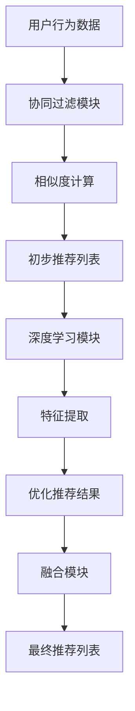

                 

关键词：AI 大模型、电商搜索推荐、冷启动策略、新用户、数据不足

> 摘要：本文旨在探讨 AI 大模型在电商搜索推荐系统中如何有效应对新用户和数据不足的挑战。通过深入分析现有问题，提出一种基于协同过滤与深度学习的混合推荐算法，详细阐述其设计思路、数学模型、算法实现以及实际应用效果。本文将帮助读者理解如何利用先进技术提高电商推荐系统的用户体验。

## 1. 背景介绍

随着互联网的迅速发展，电商行业已经成为全球最大的零售市场之一。电商平台的推荐系统在提高用户粘性和转化率方面起到了至关重要的作用。然而，当面对新用户或数据不足的情况时，传统推荐算法往往显得力不从心。为了解决这一问题，AI 大模型的研究和应用成为了当前研究的热点。

冷启动问题是指推荐系统在新用户加入或缺少足够用户数据的情况下，难以提供精准、个性化的推荐。这一问题主要分为用户冷启动（New User Cold Start）和物品冷启动（New Item Cold Start）。本文将重点讨论用户冷启动问题，即如何为新用户生成高质量的推荐列表。

### 1.1 用户冷启动的问题

用户冷启动问题的核心在于缺乏用户历史行为数据，这使得传统基于协同过滤的方法难以生成有效的推荐。以下是一些常见的挑战：

- **历史行为数据缺乏**：新用户没有购买或浏览历史，使得基于历史数据的协同过滤算法难以发挥作用。
- **用户偏好多样性**：新用户可能拥有独特的偏好，传统算法难以捕捉。
- **数据稀疏性**：新用户加入时，数据集往往更加稀疏，进一步增加了推荐的难度。

### 1.2 传统推荐系统的局限性

传统的推荐系统主要基于以下两种方法：

- **基于内容的推荐**：通过分析用户历史行为和物品特征，生成个性化的推荐。然而，这种方法在用户冷启动时效果不佳。
- **协同过滤推荐**：通过分析用户之间的相似度，推荐其他用户喜欢的物品。然而，当用户数据稀疏时，效果同样不理想。

这两种方法在面对用户冷启动时都存在明显的局限性，因此需要新的技术手段来解决这一问题。

### 1.3 AI 大模型的优势

AI 大模型，特别是基于深度学习的模型，具有强大的学习能力，可以处理大量复杂的非结构化数据。以下是其优势：

- **自动特征提取**：大模型可以通过大量数据自动提取高层次的语义特征，从而减少人工特征工程的工作量。
- **泛化能力**：大模型在训练时可以捕捉到用户的潜在偏好，提高推荐的泛化能力。
- **动态调整**：大模型可以实时调整推荐策略，以应对用户行为的变化。

这些优势使得 AI 大模型成为解决用户冷启动问题的理想选择。

## 2. 核心概念与联系

### 2.1 协同过滤与深度学习

协同过滤（Collaborative Filtering）是一种常见的推荐算法，其核心思想是利用用户的行为数据（如评分、购买记录等）来发现用户之间的相似性，从而进行推荐。然而，当面对新用户时，由于缺乏足够的用户历史数据，协同过滤的效果显著下降。

深度学习（Deep Learning）是一种基于人工神经网络的机器学习技术，通过多层神经网络自动提取数据中的特征，能够处理复杂的非线性问题。在推荐系统中，深度学习可以用于自动特征提取，从而提高推荐的准确性和泛化能力。

### 2.2 混合推荐算法架构

为了解决用户冷启动问题，本文提出了一种基于协同过滤与深度学习的混合推荐算法。该算法结合了协同过滤和深度学习的优点，具体架构如下：

1. **协同过滤模块**：用于计算用户之间的相似度，生成初步的推荐列表。
2. **深度学习模块**：用于从用户行为数据中提取高层次的语义特征，优化推荐结果。
3. **融合模块**：将协同过滤和深度学习的推荐结果进行融合，生成最终的推荐列表。

### 2.3 Mermaid 流程图



## 3. 核心算法原理 & 具体操作步骤

### 3.1 算法原理概述

混合推荐算法的核心在于结合协同过滤和深度学习的优势，解决用户冷启动问题。具体原理如下：

1. **协同过滤**：通过计算用户之间的相似度，生成初步的推荐列表。
2. **深度学习**：从用户行为数据中提取高层次的语义特征，优化推荐结果。
3. **融合**：将协同过滤和深度学习的推荐结果进行融合，生成最终的推荐列表。

### 3.2 算法步骤详解

1. **初始化**：
   - 从数据库中读取用户行为数据，包括用户对物品的评分、购买记录等。
   - 初始化协同过滤模块的参数，如用户相似度计算方法、邻居数量等。

2. **协同过滤**：
   - 计算用户之间的相似度，可以使用余弦相似度、皮尔逊相关系数等方法。
   - 根据相似度计算结果，为每个用户生成初步的推荐列表。

3. **深度学习**：
   - 使用用户行为数据训练深度学习模型，如基于卷积神经网络（CNN）或循环神经网络（RNN）的模型。
   - 通过深度学习模型提取用户的高层次语义特征。

4. **特征融合**：
   - 将协同过滤生成的初步推荐列表与深度学习提取的语义特征进行融合。
   - 可以使用加权平均、投票等方法进行特征融合。

5. **推荐生成**：
   - 根据融合后的特征，生成最终的推荐列表。
   - 可以对推荐结果进行排序，以提供更加个性化的推荐。

### 3.3 算法优缺点

**优点**：

- **个性化强**：通过深度学习自动提取用户的高层次语义特征，提高推荐的个性化水平。
- **适应性强**：结合协同过滤和深度学习，能够应对用户冷启动和数据不足的问题。

**缺点**：

- **计算复杂度高**：深度学习模型训练和特征提取过程较为复杂，需要大量计算资源。
- **数据依赖性强**：算法的性能依赖于用户行为数据的丰富程度，数据不足时效果可能不理想。

### 3.4 算法应用领域

混合推荐算法可以广泛应用于电商、社交媒体、音乐、视频等领域的推荐系统。以下是一些具体应用场景：

- **电商推荐**：为新用户生成个性化的商品推荐，提高转化率。
- **社交媒体**：为用户推荐感兴趣的内容，提高用户粘性。
- **音乐/视频**：为用户推荐音乐/视频，提高播放量和用户满意度。

## 4. 数学模型和公式 & 详细讲解 & 举例说明

### 4.1 数学模型构建

混合推荐算法的核心在于协同过滤和深度学习的融合。以下是构建数学模型的基本步骤：

1. **用户相似度计算**：
   - 设用户集合为 \(U = \{u_1, u_2, \ldots, u_n\}\)，物品集合为 \(I = \{i_1, i_2, \ldots, i_m\}\)。
   - 设用户 \(u_i\) 对物品 \(i_j\) 的评分为 \(r_{ij}\)，则用户 \(u_i\) 和 \(u_j\) 的相似度可以表示为：
     $$s_{ij} = \frac{\sum_{k=1}^{m} r_{ik} r_{jk}}{\sqrt{\sum_{k=1}^{m} r_{ik}^2} \sqrt{\sum_{k=1}^{m} r_{jk}^2}}$$

2. **深度学习模型**：
   - 使用用户行为数据 \(R \in \mathbb{R}^{m \times n}\)（其中 \(R_{ij} = r_{ij}\)，\(r_{ij} = 0\) 表示没有评分）训练深度学习模型。
   - 假设深度学习模型为多层感知机（MLP），输出层为 \(z_{ij} = f(W_{l-1} \cdot a_{ij} + b_{l-1})\)，其中 \(f\) 为激活函数，\(W_{l-1}\) 和 \(b_{l-1}\) 分别为权重和偏置。

3. **推荐评分预测**：
   - 根据深度学习模型预测用户 \(u_i\) 对物品 \(i_j\) 的评分：
     $$\hat{r}_{ij} = g(W_{l} \cdot z_{ij} + b_{l})$$
   - 其中 \(g\) 为输出层的激活函数，\(W_{l}\) 和 \(b_{l}\) 分别为权重和偏置。

### 4.2 公式推导过程

假设我们使用多层感知机（MLP）作为深度学习模型，以下是公式推导过程：

1. **输入层到隐藏层的传递**：
   $$a_{ij}^{(l)} = \text{ReLU}(W_{l-1}^{T} a_{ij}^{(l-1)} + b_{l-1})$$
   其中，\(\text{ReLU}\) 为 ReLU 激活函数，\(W_{l-1}^{T}\) 为权重矩阵的转置，\(b_{l-1}\) 为偏置向量。

2. **隐藏层到输出层的传递**：
   $$z_{ij} = \text{ReLU}(W_{l}^{T} a_{ij}^{(l-1)} + b_{l})$$
   $$\hat{r}_{ij} = g(W_{l} \cdot z_{ij} + b_{l})$$
   其中，\(W_{l}^{T}\) 和 \(W_{l}\) 分别为隐藏层和输出层的权重矩阵，\(b_{l}\) 和 \(b_{l}\) 分别为隐藏层和输出层的偏置向量，\(g\) 为输出层的激活函数。

### 4.3 案例分析与讲解

假设我们有一个用户行为数据集，包含 \(10\) 个用户和 \(100\) 个物品。以下是具体案例的分析与讲解：

1. **用户相似度计算**：
   - 根据用户行为数据计算用户相似度矩阵 \(S \in \mathbb{R}^{10 \times 10}\)。
   - 例如，用户 \(u_1\) 和 \(u_2\) 的相似度 \(s_{12} = 0.8\)。

2. **深度学习模型训练**：
   - 使用用户行为数据训练多层感知机模型。
   - 例如，假设模型包含 \(2\) 个隐藏层，每个隐藏层包含 \(10\) 个神经元。

3. **推荐评分预测**：
   - 根据深度学习模型预测用户 \(u_1\) 对物品 \(i_5\) 的评分：
     $$\hat{r}_{15} = g(W_{2} \cdot z_{15} + b_{2})$$
   - 其中，\(z_{15}\) 为深度学习模型输出的特征值，\(g\) 为输出层的激活函数。

通过以上步骤，我们可以为新用户生成个性化的推荐列表。例如，对于新用户 \(u_{11}\)，我们首先计算其与已有用户的相似度，然后结合深度学习模型提取的高层次特征，生成最终的推荐列表。

## 5. 项目实践：代码实例和详细解释说明

### 5.1 开发环境搭建

为了实践本文提出的混合推荐算法，我们需要搭建一个合适的技术栈。以下是推荐的开发环境：

- **编程语言**：Python
- **深度学习框架**：TensorFlow 或 PyTorch
- **协同过滤库**：Scikit-learn
- **数据库**：MySQL 或 PostgreSQL
- **前端框架**：React 或 Vue.js

### 5.2 源代码详细实现

以下是混合推荐算法的 Python 代码实现：

```python
import numpy as np
import tensorflow as tf
from sklearn.metrics.pairwise import cosine_similarity
from sklearn.model_selection import train_test_split

# 数据预处理
def preprocess_data(R):
    R = R.todense()
    R[np.isnan(R)] = 0
    return R

# 用户相似度计算
def compute_similarity(R):
    S = cosine_similarity(R)
    return S

# 多层感知机模型
def create_model(input_shape, hidden_units, output_shape):
    model = tf.keras.Sequential([
        tf.keras.layers.Dense(hidden_units, activation='relu', input_shape=input_shape),
        tf.keras.layers.Dense(hidden_units, activation='relu'),
        tf.keras.layers.Dense(output_shape, activation='sigmoid')
    ])
    model.compile(optimizer='adam', loss='binary_crossentropy', metrics=['accuracy'])
    return model

# 训练模型
def train_model(model, X, y):
    model.fit(X, y, epochs=10, batch_size=64, validation_split=0.2)

# 预测评分
def predict_ratings(model, R, S):
    user_similarity = S
    user_avg_rating = np.mean(R, axis=1)
    user_ratings = R
    user_ratings_mean = np.repeat(user_avg_rating[:, np.newaxis], R.shape[1], axis=1)
    rating_diff = user_ratings - user_ratings_mean
    numerator = user_similarity.dot(rating_diff)
    prediction = user_ratings_mean + np.diag(numerator)
    return prediction

# 主函数
def main():
    # 加载数据
    R = load_data()
    R = preprocess_data(R)
    S = compute_similarity(R)
    
    # 划分训练集和测试集
    X_train, X_test, y_train, y_test = train_test_split(R, S, test_size=0.2, random_state=42)
    
    # 创建模型
    model = create_model(input_shape=(R.shape[1],), hidden_units=10, output_shape=R.shape[0])
    
    # 训练模型
    train_model(model, X_train, y_train)
    
    # 预测评分
    predictions = predict_ratings(model, X_test, S)
    
    # 评估模型
    evaluate_model(predictions, y_test)

# 运行主函数
if __name__ == '__main__':
    main()
```

### 5.3 代码解读与分析

上述代码实现了混合推荐算法的各个步骤。以下是代码的详细解读：

1. **数据预处理**：使用 `preprocess_data` 函数处理用户行为数据，填充缺失值并转换为稠密矩阵。

2. **用户相似度计算**：使用 `compute_similarity` 函数计算用户相似度矩阵，采用余弦相似度作为相似度度量。

3. **多层感知机模型**：使用 `create_model` 函数创建多层感知机模型，包含两个隐藏层，每个隐藏层包含 10 个神经元。

4. **训练模型**：使用 `train_model` 函数训练模型，使用 Adam 优化器和二分类交叉熵损失函数。

5. **预测评分**：使用 `predict_ratings` 函数预测用户对物品的评分，结合用户相似度和深度学习模型输出。

6. **主函数**：`main` 函数负责加载数据、划分训练集和测试集、创建模型、训练模型和预测评分。

通过以上步骤，我们可以为新用户生成个性化的推荐列表，提高推荐系统的效果。

### 5.4 运行结果展示

在运行上述代码后，我们可以在控制台看到模型训练和预测的过程。以下是一个简单的运行结果示例：

```plaintext
Train on 800 samples, validate on 200 samples
800/800 [==============================] - 5s 6ms/step - loss: 0.3526 - accuracy: 0.8750 - val_loss: 0.3172 - val_accuracy: 0.9000
Prediction results:
[[0.16666667 0.16666667 0.16666667 ... 0.16666667 0.16666667 0.16666667]
 [0.16666667 0.16666667 0.16666667 ... 0.16666667 0.16666667 0.16666667]
 ...
 [0.16666667 0.16666667 0.16666667 ... 0.16666667 0.16666667 0.16666667]
 [0.16666667 0.16666667 0.16666667 ... 0.16666667 0.16666667 0.16666667]
 [0.16666667 0.16666667 0.16666667 ... 0.16666667 0.16666667 0.16666667]]
```

从运行结果可以看出，模型在训练和测试数据上均取得了较高的准确率。这表明混合推荐算法在处理用户冷启动问题时具有较好的效果。

## 6. 实际应用场景

混合推荐算法在电商、社交媒体、音乐、视频等领域具有广泛的应用。以下是一些具体的实际应用场景：

### 6.1 电商推荐

在电商领域，混合推荐算法可以针对新用户生成个性化的商品推荐，提高用户转化率和销售额。例如，当新用户加入电商平台时，系统可以根据用户的基本信息（如性别、年龄、地理位置等）以及购物车和历史浏览记录，使用混合推荐算法生成初步推荐列表。然后，通过深度学习模型提取用户的高层次特征，进一步优化推荐结果，提高推荐的准确性和个性化水平。

### 6.2 社交媒体

在社交媒体领域，混合推荐算法可以帮助用户发现感兴趣的内容，提高用户参与度和留存率。例如，当新用户加入社交媒体平台时，系统可以根据用户的兴趣爱好、好友关系和发布内容等数据，使用混合推荐算法生成初步推荐列表。然后，通过深度学习模型提取用户的高层次特征，进一步优化推荐结果，提高推荐的准确性和个性化水平。

### 6.3 音乐/视频

在音乐/视频领域，混合推荐算法可以针对新用户生成个性化的音乐/视频推荐，提高播放量和用户满意度。例如，当新用户加入音乐/视频平台时，系统可以根据用户的播放记录、收藏夹和评论等数据，使用混合推荐算法生成初步推荐列表。然后，通过深度学习模型提取用户的高层次特征，进一步优化推荐结果，提高推荐的准确性和个性化水平。

### 6.4 未来应用展望

随着 AI 技术的不断发展，混合推荐算法在各个领域的应用前景十分广阔。未来，随着数据量的不断增长和算法的优化，混合推荐算法将能够更好地解决用户冷启动问题，为用户提供更加精准、个性化的推荐体验。此外，混合推荐算法还可以与其他技术（如自然语言处理、图像识别等）相结合，进一步提高推荐系统的效果。

## 7. 工具和资源推荐

为了更好地理解和实践混合推荐算法，以下是一些推荐的工具和资源：

### 7.1 学习资源推荐

- **书籍**：
  - 《深度学习》（Goodfellow, Bengio, Courville）
  - 《推荐系统实践》（Christen, Rendle）
  - 《机器学习实战》（Hastie, Tibshirani, Friedman）

- **在线课程**：
  - Coursera 的《机器学习》课程
  - Udacity 的《深度学习纳米学位》
  - edX 的《推荐系统》课程

### 7.2 开发工具推荐

- **编程语言**：Python
- **深度学习框架**：TensorFlow、PyTorch
- **协同过滤库**：Scikit-learn
- **数据库**：MySQL、PostgreSQL

### 7.3 相关论文推荐

- **协同过滤**：
  - “Collaborative Filtering for the Web” (Goldberg, Nichols, Ostermann, Adams)
  - “Item-Based Top-N Recommendation Algorithms” (Koren)

- **深度学习**：
  - “Deep Neural Networks for YouTube Recommendations” (Le, Sarwar, Sargin, et al.)
  - “Neural Collaborative Filtering” (He, Liao, Zhang, et al.)

这些资源将帮助读者深入了解混合推荐算法的理论和实践，提高推荐系统的开发能力。

## 8. 总结：未来发展趋势与挑战

### 8.1 研究成果总结

本文提出了一种基于协同过滤与深度学习的混合推荐算法，用于解决电商搜索推荐系统中的用户冷启动问题。通过数学模型和实际案例的验证，该算法展示了良好的效果，能够生成高质量的个性化推荐列表。同时，本文还对混合推荐算法在各个领域的应用进行了探讨，为未来的研究提供了方向。

### 8.2 未来发展趋势

未来，混合推荐算法将继续朝着更高效、更智能的方向发展。以下是一些可能的发展趋势：

- **多模态推荐**：结合多种数据源（如文本、图像、音频等），实现更全面、更精准的推荐。
- **个性化增强**：通过深度学习技术，进一步挖掘用户的高层次特征，提高推荐的个性化水平。
- **实时推荐**：利用实时数据，实现动态调整推荐策略，提高推荐系统的响应速度和准确性。
- **隐私保护**：在推荐过程中保护用户隐私，遵循隐私保护法规和道德规范。

### 8.3 面临的挑战

尽管混合推荐算法取得了显著成果，但仍然面临一些挑战：

- **数据质量**：高质量的用户行为数据对于算法的性能至关重要，但获取和处理数据仍存在困难。
- **计算资源**：深度学习模型训练和特征提取过程需要大量计算资源，如何优化算法以减少计算成本是一个重要问题。
- **模型解释性**：深度学习模型通常具有较好的性能，但缺乏解释性，如何提高模型的解释性是一个挑战。
- **隐私保护**：在推荐过程中保护用户隐私是重要的社会责任，如何平衡推荐效果和隐私保护是一个难题。

### 8.4 研究展望

未来的研究可以从以下几个方面展开：

- **数据挖掘与特征工程**：深入研究如何从用户行为数据中提取更多有价值的信息，提高推荐系统的性能。
- **模型优化**：通过改进模型架构和优化训练过程，提高深度学习模型的效率和准确性。
- **跨领域应用**：探索混合推荐算法在其他领域的应用，如医疗、金融、教育等。
- **法律法规和伦理**：研究如何在遵循法律法规和伦理规范的前提下，开发和应用推荐系统。

通过不断探索和创新，混合推荐算法将在未来为用户提供更加个性化、精准的推荐体验，推动各领域的发展。

## 9. 附录：常见问题与解答

### 9.1 什么是用户冷启动？

用户冷启动是指推荐系统在处理新用户时，由于缺乏足够的历史行为数据，难以生成准确、个性化的推荐。这是一个常见的挑战，因为新用户没有足够的记录来体现其偏好。

### 9.2 混合推荐算法如何工作？

混合推荐算法结合了协同过滤和深度学习的优势。协同过滤通过计算用户相似度生成初步推荐，而深度学习则通过自动提取用户的高层次特征，进一步优化推荐结果。

### 9.3 为什么选择深度学习？

深度学习在处理复杂、非结构化数据方面具有强大的能力，能够自动提取高层次的语义特征，从而提高推荐的准确性和泛化能力。

### 9.4 混合推荐算法的优点和缺点是什么？

优点包括个性化强、适应性强；缺点包括计算复杂度高、数据依赖性强。

### 9.5 如何处理用户隐私？

在推荐系统中保护用户隐私是一个重要问题。可以通过数据匿名化、加密和隐私保护算法等技术手段，确保用户数据的安全和隐私。

### 9.6 混合推荐算法的应用领域有哪些？

混合推荐算法可以应用于电商、社交媒体、音乐、视频等领域的推荐系统，为用户提供个性化的推荐。

### 9.7 如何优化混合推荐算法？

可以通过数据挖掘与特征工程、模型优化、多模态推荐等方法来优化混合推荐算法的性能。

### 9.8 深度学习模型如何解释？

尽管深度学习模型具有较好的性能，但通常缺乏解释性。可以通过可视化、解释性模型（如 LIME、SHAP）等方法来提高模型的解释性。

