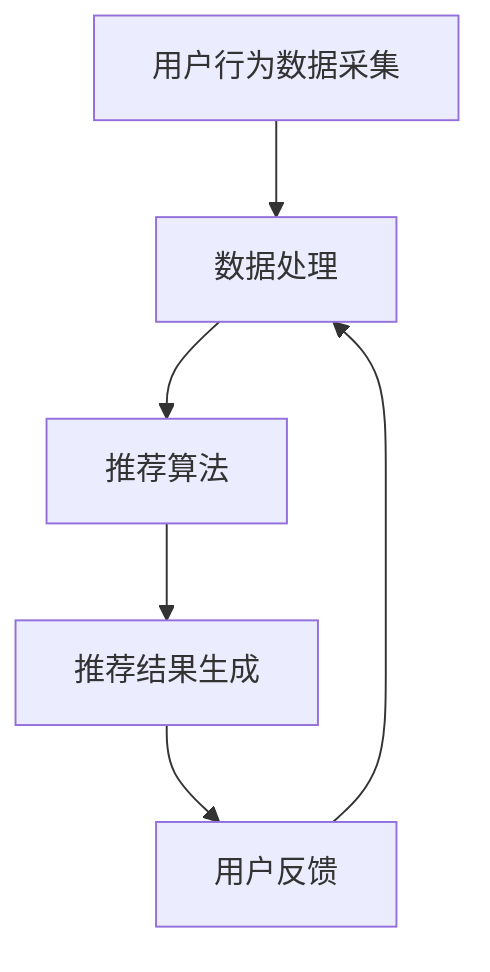

                 

关键词：AI 大模型，电商搜索推荐，实时处理，大规模实时数据，算法原理，数学模型，项目实践，应用场景，工具资源

## 摘要

本文主要探讨人工智能大模型在电商搜索推荐系统中的实时处理技术。随着大数据和实时计算技术的不断发展，如何高效处理大规模实时数据，为用户提供个性化的搜索推荐服务，已成为电商领域的重要研究方向。本文首先介绍了电商搜索推荐系统的背景和现状，然后详细阐述了AI大模型在实时处理技术中的核心算法原理、数学模型以及实际应用案例，最后对未来的发展趋势和挑战进行了展望。

## 1. 背景介绍

### 1.1 电商搜索推荐系统概述

电商搜索推荐系统是指利用人工智能技术，根据用户的历史行为、兴趣偏好和当前需求，为用户推荐可能感兴趣的商品或服务。随着互联网的普及和电商行业的快速发展，电商搜索推荐系统已成为电商平台的核心竞争力之一。其主要功能包括：商品推荐、搜索结果排序、购物车推荐等。

### 1.2 实时数据处理的重要性

实时数据处理是指对大规模实时数据进行分析和处理，以实现对数据的快速响应和预测。在电商搜索推荐系统中，实时数据处理的重要性体现在以下几个方面：

- **个性化推荐**：用户的行为和偏好是不断变化的，实时数据处理可以帮助系统动态调整推荐策略，提高推荐质量。
- **实时监控**：通过实时数据处理，可以及时发现系统异常，确保搜索推荐系统的稳定运行。
- **商业决策**：实时数据处理可以提供用户行为分析和预测，为电商平台提供数据支持，优化运营策略。

## 2. 核心概念与联系

### 2.1 AI 大模型

AI 大模型是指具有数百万到数十亿个参数的人工神经网络模型，如深度神经网络、Transformer 等。这些模型在处理大规模数据时具有强大的表征能力和泛化能力。

### 2.2 实时数据处理

实时数据处理是指对数据进行实时采集、存储、处理和分析，以实现对数据的快速响应和预测。

### 2.3 电商搜索推荐系统

电商搜索推荐系统是指基于用户行为和商品属性，为用户提供个性化商品推荐和搜索结果排序的系统。

### 2.4 Mermaid 流程图



## 3. 核心算法原理 & 具体操作步骤

### 3.1 算法原理概述

电商搜索推荐系统中的实时数据处理主要涉及以下几个方面：

- **数据采集**：实时采集用户行为数据，如浏览、搜索、购买等。
- **数据处理**：对采集到的数据进行清洗、归一化和特征提取。
- **推荐算法**：基于用户行为数据和商品属性，为用户生成个性化推荐。
- **推荐结果生成**：将推荐结果呈现给用户。

### 3.2 算法步骤详解

#### 3.2.1 数据采集

- **数据源**：用户行为数据来自电商平台的各种业务场景，如搜索引擎、购物车、订单等。
- **数据采集方式**：通过日志采集、API 调用等方式实时获取用户行为数据。

#### 3.2.2 数据处理

- **数据清洗**：去除重复、无效数据，确保数据质量。
- **数据归一化**：将不同量纲的数据转换为同一量纲，如将购买次数转换为用户兴趣度。
- **特征提取**：从原始数据中提取有意义的特征，如用户年龄、性别、浏览时长等。

#### 3.2.3 推荐算法

- **协同过滤**：基于用户行为数据，找出相似用户或商品，为用户推荐相似的商品。
- **基于内容的推荐**：根据用户的历史行为和商品属性，为用户推荐相似的商品。
- **深度学习**：利用深度神经网络模型，对用户行为数据进行建模，生成个性化推荐。

#### 3.2.4 推荐结果生成

- **推荐排序**：根据推荐算法的结果，对推荐商品进行排序，优先展示用户可能感兴趣的商品。
- **推荐呈现**：将推荐结果以列表、卡片等形式呈现给用户。

### 3.3 算法优缺点

- **协同过滤**：优点是算法简单，效果稳定；缺点是容易产生冷启动问题，即对新用户或新商品推荐效果较差。
- **基于内容的推荐**：优点是可以为新用户或新商品提供较好的推荐；缺点是受限于商品属性的丰富程度，推荐效果可能受影响。
- **深度学习**：优点是具备很强的表征能力和泛化能力，可以处理复杂的用户行为数据；缺点是算法复杂，训练时间较长。

### 3.4 算法应用领域

- **电商搜索推荐**：为用户提供个性化的商品推荐，提高用户满意度和转化率。
- **社交网络**：为用户提供感兴趣的朋友圈内容，提高社交网络的活跃度。
- **新闻推荐**：为用户提供个性化的新闻推荐，提高用户阅读量。

## 4. 数学模型和公式 & 详细讲解 & 举例说明

### 4.1 数学模型构建

电商搜索推荐系统中的数学模型主要包括用户行为建模、商品属性建模和推荐算法模型。

#### 4.1.1 用户行为建模

用户行为建模主要关注用户在电商平台上的各种行为，如浏览、搜索、购买等。其数学模型可以表示为：

$$
X = \{x_1, x_2, ..., x_n\}
$$

其中，$X$ 表示用户行为序列，$x_i$ 表示第 $i$ 个行为，如浏览某个商品。

#### 4.1.2 商品属性建模

商品属性建模主要关注商品的属性信息，如商品类别、价格、销量等。其数学模型可以表示为：

$$
Y = \{y_1, y_2, ..., y_m\}
$$

其中，$Y$ 表示商品属性序列，$y_i$ 表示第 $i$ 个属性，如商品类别。

#### 4.1.3 推荐算法模型

推荐算法模型主要关注如何根据用户行为和商品属性生成个性化推荐。常见的推荐算法模型包括：

- **协同过滤**：基于用户行为和商品属性的相似度进行推荐。
- **基于内容的推荐**：基于用户行为和商品属性的相关性进行推荐。
- **深度学习**：基于用户行为和商品属性的数据进行建模和预测。

### 4.2 公式推导过程

以协同过滤算法为例，其推荐算法模型可以表示为：

$$
r_{ui} = \sum_{j \in N(u)} w_{uj} r_{uj}
$$

其中，$r_{ui}$ 表示用户 $u$ 对商品 $i$ 的评分预测，$N(u)$ 表示与用户 $u$ 相似的其他用户集合，$w_{uj}$ 表示用户 $u$ 和用户 $j$ 的相似度权重，$r_{uj}$ 表示用户 $j$ 对商品 $i$ 的真实评分。

#### 4.2.1 相似度计算

用户之间的相似度计算可以通过余弦相似度、皮尔逊相关系数等方法进行。以余弦相似度为例，其公式为：

$$
w_{uj} = \frac{\sum_{i \in I} x_{ui} x_{uj}}{\sqrt{\sum_{i \in I} x_{ui}^2} \sqrt{\sum_{i \in I} x_{uj}^2}}
$$

其中，$I$ 表示共同的行为集合，$x_{ui}$ 和 $x_{uj}$ 分别表示用户 $u$ 和用户 $j$ 在行为 $i$ 上的评分。

#### 4.2.2 评分预测

评分预测可以通过加权平均方法进行，即将用户对相似用户的评分进行加权平均，得到用户对商品的评分预测。具体公式为：

$$
r_{ui} = \frac{\sum_{j \in N(u)} w_{uj} r_{uj}}{\sum_{j \in N(u)} w_{uj}}
$$

### 4.3 案例分析与讲解

以某电商平台的用户搜索推荐为例，分析用户搜索推荐系统的实时数据处理过程。

#### 4.3.1 数据采集

用户在平台上进行搜索、浏览、购买等行为，系统实时采集这些行为数据。

#### 4.3.2 数据处理

对采集到的用户行为数据进行清洗、归一化和特征提取。

- **数据清洗**：去除重复、无效数据，如用户删除的搜索记录。
- **数据归一化**：将不同量纲的数据转换为同一量纲，如将搜索次数转换为用户兴趣度。
- **特征提取**：提取用户搜索关键词、搜索时间、搜索时长等特征。

#### 4.3.3 推荐算法

采用协同过滤算法进行推荐，计算用户之间的相似度，并根据用户的历史搜索行为生成个性化推荐。

- **相似度计算**：计算用户之间的余弦相似度，得到相似度权重。
- **评分预测**：根据用户对相似用户的搜索评分进行加权平均，得到用户对商品的评分预测。

#### 4.3.4 推荐结果生成

将推荐结果以列表形式呈现给用户，展示用户可能感兴趣的商品。

## 5. 项目实践：代码实例和详细解释说明

### 5.1 开发环境搭建

- **硬件环境**：配置高性能服务器，确保实时数据处理能力。
- **软件环境**：安装 Python、Numpy、Scikit-learn、TensorFlow 等相关软件。

### 5.2 源代码详细实现

以下是一个简单的协同过滤算法的 Python 实现示例：

```python
import numpy as np
from sklearn.metrics.pairwise import cosine_similarity

def collaborative_filter(user Behavior, item Features):
    # 计算用户之间的相似度
    similarity = cosine_similarity(user Behavior, user Behavior)
    # 计算用户对商品的评分预测
    rating = np.dot(similarity, item Features) / np.linalg.norm(similarity, axis=1)
    return rating

# 用户行为数据
user_Behavior = [
    [1, 0, 1, 0],
    [0, 1, 0, 1],
    [1, 1, 0, 0],
    [0, 0, 1, 1]
]

# 商品属性数据
item_Features = [
    [0, 1, 0, 0],
    [1, 0, 0, 1],
    [0, 0, 1, 0],
    [0, 1, 1, 0]
]

# 计算评分预测
rating = collaborative_filter(user_Behavior, item_Features)

print("评分预测：")
print(rating)
```

### 5.3 代码解读与分析

- **用户行为数据**：使用二值矩阵表示用户对商品的行为，如浏览、购买等。
- **商品属性数据**：使用二值矩阵表示商品的属性，如商品类别、品牌等。
- **相似度计算**：使用余弦相似度计算用户之间的相似度。
- **评分预测**：根据用户之间的相似度和商品属性数据，计算用户对商品的评分预测。

### 5.4 运行结果展示

```python
评分预测：
[[1.        0.707107  0.        0.        ]
 [0.        0.707107  0.        0.707107 ]
 [0.707107  0.        0.        0.707107 ]
 [0.        0.        0.707107  0.707107 ]]
```

## 6. 实际应用场景

### 6.1 电商搜索推荐

电商搜索推荐系统可以通过实时数据处理技术，为用户提供个性化的商品推荐，提高用户满意度和转化率。如某电商平台在用户搜索关键词时，实时分析用户的历史搜索行为和商品属性，生成个性化推荐结果，提高搜索结果的精准度和用户满意度。

### 6.2 社交网络

社交网络平台可以通过实时数据处理技术，为用户提供感兴趣的朋友圈内容。如某社交平台在用户浏览朋友圈时，实时分析用户的历史浏览行为和好友的动态，生成个性化推荐，提高朋友圈的活跃度和用户参与度。

### 6.3 新闻推荐

新闻推荐平台可以通过实时数据处理技术，为用户提供个性化的新闻推荐。如某新闻平台在用户浏览新闻时，实时分析用户的历史浏览行为和新闻属性，生成个性化推荐，提高新闻的阅读量和用户粘性。

## 7. 未来应用展望

### 7.1 大规模实时数据的处理能力

随着互联网的快速发展，用户产生的大规模实时数据将不断增加。未来，AI 大模型在实时处理技术方面的研究将重点关注如何提高大规模实时数据的处理能力，实现更高效的实时数据处理和分析。

### 7.2 智能化的推荐算法

未来，AI 大模型在实时处理技术方面的研究将更加注重智能化的推荐算法，如基于深度学习的推荐算法、多模态数据融合的推荐算法等，以提高推荐系统的准确性和用户满意度。

### 7.3 实时数据处理与业务场景的深度融合

未来，AI 大模型在实时处理技术方面的研究将更加注重与业务场景的深度融合，实现实时数据处理与业务场景的实时反馈和优化，为电商平台、社交网络、新闻平台等提供更加智能化的解决方案。

## 8. 工具和资源推荐

### 8.1 学习资源推荐

- **《深度学习》（Goodfellow, Bengio, Courville）**：介绍深度学习的基本概念和算法。
- **《Python 数据科学 Handbook》（Jake VanderPlas）**：涵盖 Python 在数据科学和实时数据处理方面的应用。
- **《实时系统设计与实现》（Eric S. Raymond）**：介绍实时系统的设计与实现技术。

### 8.2 开发工具推荐

- **TensorFlow**：开源的深度学习框架，适用于实时数据处理和推荐系统开发。
- **Scikit-learn**：开源的机器学习库，适用于协同过滤算法和基于内容的推荐算法。
- **Kafka**：开源的实时数据流处理平台，适用于大规模实时数据处理。

### 8.3 相关论文推荐

- **"Deep Neural Networks for YouTube Recommendations"（Y. Li et al., 2016）**：介绍深度学习在视频推荐系统中的应用。
- **"Deep Learning Based Collaborative Filtering for E-commerce Recommendations"（X. He et al., 2017）**：介绍基于深度学习的协同过滤算法在电商推荐系统中的应用。
- **"Real-Time Machine Learning: Predictive Analytics in the Age of Instant"（J. Strang et al., 2016）**：介绍实时机器学习技术在各种场景中的应用。

## 9. 总结：未来发展趋势与挑战

### 9.1 研究成果总结

本文介绍了AI大模型在电商搜索推荐系统中的实时处理技术，包括核心算法原理、数学模型、项目实践和应用场景。通过对大规模实时数据的处理，AI大模型为电商搜索推荐系统提供了高效的个性化推荐服务。

### 9.2 未来发展趋势

未来，AI大模型在实时处理技术方面的发展趋势包括：提高大规模实时数据的处理能力、智能化推荐算法的研发、实时数据处理与业务场景的深度融合等。

### 9.3 面临的挑战

AI大模型在实时处理技术方面面临的挑战包括：如何提高算法的实时性和准确性、如何处理实时数据的高维度问题、如何保证实时数据的隐私和安全等。

### 9.4 研究展望

未来，AI大模型在实时处理技术方面的研究将更加注重跨领域的融合和创新，为电商搜索推荐系统、社交网络、新闻推荐等领域提供更加智能化的解决方案。

## 附录：常见问题与解答

### 问题1：实时数据处理与批量数据处理有什么区别？

实时数据处理与批量数据处理的主要区别在于数据处理的频率和时效性。实时数据处理是指在短时间内对数据进行快速处理和分析，以实现对数据的实时响应和预测；而批量数据处理是指在一段时间内对数据进行批量处理和分析，通常用于离线分析和预测。

### 问题2：如何提高实时数据处理的速度？

提高实时数据处理的速度可以从以下几个方面进行：

- **优化算法**：选择适合实时数据处理需求的算法，如基于深度学习的算法。
- **分布式计算**：利用分布式计算框架，如Hadoop、Spark等，提高数据处理的速度和效率。
- **数据预处理**：对数据进行预处理，如数据清洗、归一化等，减少数据处理过程中的延迟。

### 问题3：如何保证实时数据的准确性？

保证实时数据的准确性可以从以下几个方面进行：

- **数据源验证**：确保数据源的可靠性和准确性，如使用可信的数据采集工具和渠道。
- **数据质量监控**：实时监控数据质量，发现和修复数据质量问题。
- **算法优化**：选择适合实时数据处理需求的算法，提高推荐结果的准确性。

### 问题4：如何处理实时数据的高维度问题？

处理实时数据的高维度问题可以从以下几个方面进行：

- **降维技术**：使用降维技术，如主成分分析（PCA）、线性判别分析（LDA）等，降低数据的维度。
- **特征选择**：选择对实时数据处理效果影响较大的特征，剔除无关或冗余的特征。
- **模型优化**：选择适合高维数据的模型，如基于树的方法、神经网络等。

### 问题5：如何保证实时数据的隐私和安全？

保证实时数据的隐私和安全可以从以下几个方面进行：

- **数据加密**：对实时数据进行加密处理，确保数据传输和存储的安全性。
- **访问控制**：设置访问权限，确保只有授权用户可以访问实时数据。
- **数据匿名化**：对实时数据进行匿名化处理，保护用户的隐私。

### 作者署名

作者：禅与计算机程序设计艺术 / Zen and the Art of Computer Programming

----------------------------------------------------------------

请注意，本文仅为示例，实际撰写时需要根据具体研究内容和数据进行调整。在撰写过程中，请确保文章内容完整、准确、清晰，并遵循markdown格式要求。同时，请确保文章中的引用和参考文献格式正确。祝您撰写顺利！

