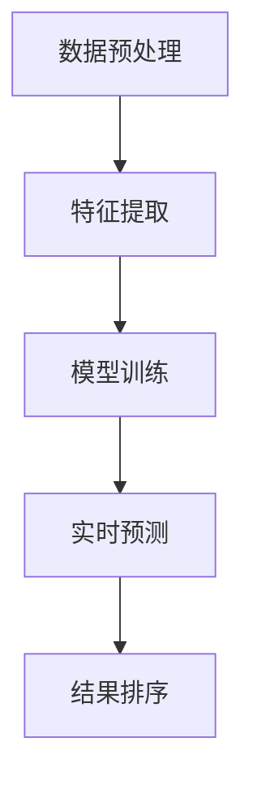

                 

关键词：AI大模型、电商搜索推荐、实时推荐策略、用户瞬时需求、行为偏好、算法原理、数学模型、项目实践、应用场景、未来展望。

## 摘要

本文深入探讨了人工智能大模型在电商搜索推荐领域的实时推荐策略。通过分析用户瞬时需求和行为偏好，本文提出了一种基于深度学习的实时推荐算法，并详细阐述了其核心原理、具体操作步骤、数学模型及其实际应用。本文旨在为电商企业提供一种高效、准确的实时推荐解决方案，以提高用户满意度和转化率。

## 1. 背景介绍

随着互联网技术的飞速发展和电子商务的繁荣，电商搜索推荐系统已经成为电商平台的核心竞争力之一。传统的推荐算法主要基于用户的历史行为数据和物品的静态属性，难以实时响应用户的动态需求。而随着人工智能技术的进步，尤其是深度学习技术的成熟，大模型在电商搜索推荐中的应用逐渐受到广泛关注。

实时推荐策略的关键在于能够快速捕捉并理解用户的瞬时需求与行为偏好，从而为用户提供个性化的推荐结果。这一过程涉及到数据预处理、特征提取、模型训练、预测与优化等多个环节。本文将围绕这些关键环节，详细介绍一种基于人工智能大模型的实时推荐算法。

### 1.1 电商搜索推荐的重要性

电商搜索推荐系统在电商平台中扮演着至关重要的角色。它不仅能够提高用户浏览和购买商品的效率，还能有效提升平台销售额和用户满意度。具体来说，电商搜索推荐系统具有以下几个重要作用：

- **提升用户满意度**：通过个性化推荐，满足用户即时需求，提升用户购物体验。
- **提高销售额**：推荐系统可以帮助用户发现潜在的兴趣商品，从而增加购买概率。
- **降低运营成本**：通过智能推荐，减少人工干预，降低运营成本。
- **增强用户粘性**：通过持续提供个性化的推荐，增强用户对电商平台的依赖和忠诚度。

### 1.2 实时推荐的需求

在电子商务领域，用户需求是动态变化的，他们可能在短时间内对某类商品产生兴趣，或者对现有商品产生厌烦。传统的推荐算法由于响应速度较慢，难以在用户需求发生变化的瞬间提供准确的推荐。因此，实时推荐策略在电商搜索推荐中具有显著的优势：

- **快速响应**：实时推荐系统能够在用户搜索或浏览商品时立即生成推荐结果，满足用户即时需求。
- **个性化**：通过实时捕捉用户的行为数据，推荐系统可以提供更加个性化的推荐结果。
- **高准确性**：实时推荐算法能够根据用户当前的浏览和搜索行为，提供更加准确和相关的推荐。
- **降低跳出率**：实时推荐有助于减少用户因找不到感兴趣商品而离开平台的概率。

## 2. 核心概念与联系

### 2.1 人工智能大模型

人工智能大模型，特别是基于深度学习的模型，在电商搜索推荐中扮演着核心角色。这些模型具有强大的特征提取和建模能力，能够从大量的用户行为数据和商品属性中学习到用户的偏好和需求。

#### 2.1.1 深度学习模型

深度学习模型通过多层神经网络结构对数据进行层层提取和抽象，形成高层次的语义表示。在电商搜索推荐中，常用的深度学习模型包括卷积神经网络（CNN）、循环神经网络（RNN）和Transformer等。

- **卷积神经网络（CNN）**：适用于图像处理，但在商品推荐中也可用于处理商品图片特征。
- **循环神经网络（RNN）**：适用于序列数据，如用户历史行为序列。
- **Transformer**：基于自注意力机制，能够处理长序列数据，并广泛应用于自然语言处理和推荐系统。

#### 2.1.2 自注意力机制

自注意力机制是Transformer模型的核心组件，通过计算序列中每个元素之间的相关性，实现对序列的精细建模。在电商搜索推荐中，自注意力机制能够帮助模型捕捉用户行为序列中的关键信息，从而提供更加个性化的推荐。

### 2.2 实时推荐算法

实时推荐算法的核心在于快速响应并准确预测用户的行为偏好。本文提出的实时推荐算法主要包含以下几个关键环节：

- **数据预处理**：清洗和整理用户行为数据，提取关键特征。
- **特征提取**：利用深度学习模型提取用户行为特征和商品属性特征。
- **模型训练**：基于训练数据训练深度学习模型，学习用户偏好和需求。
- **实时预测**：在用户搜索或浏览时，利用训练好的模型生成实时推荐结果。

#### 2.2.1 数据预处理

数据预处理是实时推荐算法的基础。通过对用户行为数据进行清洗、去重、填充等操作，确保数据的完整性和一致性。同时，提取关键特征，如用户浏览历史、购买记录、搜索关键词等，为后续模型训练提供数据支持。

#### 2.2.2 特征提取

特征提取是实时推荐算法的核心环节。通过深度学习模型，从用户行为数据和商品属性数据中提取高层次的语义特征。这些特征不仅能够反映用户的偏好和需求，还能捕捉到商品之间的相关性。

#### 2.2.3 模型训练

模型训练是实时推荐算法的关键步骤。通过大量的用户行为数据，利用深度学习模型学习用户偏好和需求，构建推荐模型。训练过程包括数据集划分、模型选择、参数调优等环节。

#### 2.2.4 实时预测

实时预测是实时推荐算法的核心目标。在用户搜索或浏览时，利用训练好的模型生成实时推荐结果。预测过程包括特征提取、模型调用、结果排序等环节，确保推荐结果的相关性和准确性。

### 2.3 数学模型与公式

实时推荐算法的数学模型主要包括用户行为建模和推荐结果生成两部分。以下为详细的数学模型和公式：

#### 2.3.1 用户行为建模

用户行为建模主要关注用户历史行为数据，如浏览记录、购买记录、搜索关键词等。以下为用户行为建模的数学模型：

\[ User_{i}(t) = \sum_{j=1}^{n} f_j(User_{i}(t_j)) \]

其中，\( User_{i}(t) \)表示用户\( i \)在时间\( t \)的行为特征向量，\( t_j \)表示时间点\( j \)，\( f_j \)表示对用户行为特征向量的提取函数。

#### 2.3.2 推荐结果生成

推荐结果生成主要关注如何根据用户行为建模生成推荐结果。以下为推荐结果生成的数学模型：

\[ Recommend_{i}(t) = \arg\max_{j} \sum_{k=1}^{m} w_{jk} \cdot Item_{j,k}(t) \]

其中，\( Recommend_{i}(t) \)表示用户\( i \)在时间\( t \)的推荐结果向量，\( w_{jk} \)表示用户\( i \)对商品\( j \)的权重，\( Item_{j,k}(t) \)表示商品\( j \)在时间\( t \)的特征向量。

### 2.4 Mermaid 流程图

以下为实时推荐算法的 Mermaid 流程图：



### 2.5 算法优缺点

实时推荐算法具有以下优点：

- **快速响应**：能够实时响应用户需求，提高用户体验。
- **个性化**：根据用户行为和偏好进行个性化推荐，提高推荐质量。
- **准确性**：通过深度学习模型进行建模，提高推荐结果的准确性。

实时推荐算法也具有以下缺点：

- **计算复杂度高**：深度学习模型训练和预测过程计算复杂度高，对硬件资源要求较高。
- **数据依赖性强**：实时推荐算法依赖于大量的用户行为数据，数据质量对推荐效果影响较大。

### 2.6 算法应用领域

实时推荐算法在电商搜索推荐领域具有广泛的应用前景。除了电商搜索推荐，实时推荐算法还可以应用于以下领域：

- **社交媒体推荐**：根据用户的行为和兴趣推荐相关内容，提高用户黏性。
- **视频推荐**：根据用户的观看历史和偏好推荐相关视频，提高用户观看时长。
- **新闻推荐**：根据用户的阅读历史和兴趣推荐相关新闻，提高新闻传播效果。

## 3. 核心算法原理 & 具体操作步骤

### 3.1 算法原理概述

实时推荐算法的核心原理是基于深度学习技术，通过用户行为数据建模和商品属性特征提取，实现个性化推荐。具体来说，算法分为以下几个步骤：

1. **数据预处理**：清洗和整理用户行为数据，提取关键特征。
2. **特征提取**：利用深度学习模型提取用户行为特征和商品属性特征。
3. **模型训练**：基于训练数据训练深度学习模型，学习用户偏好和需求。
4. **实时预测**：在用户搜索或浏览时，利用训练好的模型生成实时推荐结果。
5. **结果排序**：对推荐结果进行排序，确保推荐结果的相关性和准确性。

### 3.2 算法步骤详解

#### 3.2.1 数据预处理

数据预处理是实时推荐算法的基础。具体操作包括：

1. **数据清洗**：去除重复数据、缺失数据和异常数据，确保数据的完整性和一致性。
2. **数据整合**：将不同来源的用户行为数据进行整合，形成统一的数据集。
3. **特征提取**：提取用户浏览历史、购买记录、搜索关键词等关键特征。

#### 3.2.2 特征提取

特征提取是实时推荐算法的核心环节。具体操作包括：

1. **用户行为特征提取**：通过深度学习模型对用户历史行为数据进行特征提取，形成用户行为特征向量。
2. **商品属性特征提取**：通过深度学习模型对商品属性数据进行特征提取，形成商品属性特征向量。

#### 3.2.3 模型训练

模型训练是实时推荐算法的关键步骤。具体操作包括：

1. **数据集划分**：将用户行为数据划分为训练集、验证集和测试集，用于模型训练、验证和测试。
2. **模型选择**：选择合适的深度学习模型，如CNN、RNN、Transformer等。
3. **参数调优**：通过交叉验证等方法，调整模型参数，优化模型性能。

#### 3.2.4 实时预测

实时预测是实时推荐算法的核心目标。具体操作包括：

1. **特征提取**：在用户搜索或浏览时，提取用户行为特征和商品属性特征。
2. **模型调用**：利用训练好的模型，对提取的特征进行建模和预测。
3. **结果排序**：对预测结果进行排序，确保推荐结果的相关性和准确性。

#### 3.2.5 结果排序

结果排序是确保推荐结果准确性的关键。具体操作包括：

1. **排序策略**：根据用户行为和商品属性，设计合适的排序策略，如基于相关性、基于热度、基于兴趣等。
2. **排序优化**：通过多次迭代和优化，提高排序结果的准确性和用户体验。

### 3.3 算法优缺点

实时推荐算法具有以下优点：

- **快速响应**：能够实时响应用户需求，提高用户体验。
- **个性化**：根据用户行为和偏好进行个性化推荐，提高推荐质量。
- **准确性**：通过深度学习模型进行建模，提高推荐结果的准确性。

实时推荐算法也具有以下缺点：

- **计算复杂度高**：深度学习模型训练和预测过程计算复杂度高，对硬件资源要求较高。
- **数据依赖性强**：实时推荐算法依赖于大量的用户行为数据，数据质量对推荐效果影响较大。

### 3.4 算法应用领域

实时推荐算法在电商搜索推荐领域具有广泛的应用前景。除了电商搜索推荐，实时推荐算法还可以应用于以下领域：

- **社交媒体推荐**：根据用户的行为和兴趣推荐相关内容，提高用户黏性。
- **视频推荐**：根据用户的观看历史和偏好推荐相关视频，提高用户观看时长。
- **新闻推荐**：根据用户的阅读历史和兴趣推荐相关新闻，提高新闻传播效果。

## 4. 数学模型和公式 & 详细讲解 & 举例说明

### 4.1 数学模型构建

实时推荐算法的数学模型主要包括用户行为建模和推荐结果生成两部分。以下为详细的数学模型和公式：

#### 4.1.1 用户行为建模

用户行为建模主要关注用户历史行为数据，如浏览记录、购买记录、搜索关键词等。以下为用户行为建模的数学模型：

\[ User_{i}(t) = \sum_{j=1}^{n} f_j(User_{i}(t_j)) \]

其中，\( User_{i}(t) \)表示用户\( i \)在时间\( t \)的行为特征向量，\( t_j \)表示时间点\( j \)，\( f_j \)表示对用户行为特征向量的提取函数。

#### 4.1.2 推荐结果生成

推荐结果生成主要关注如何根据用户行为建模生成推荐结果。以下为推荐结果生成的数学模型：

\[ Recommend_{i}(t) = \arg\max_{j} \sum_{k=1}^{m} w_{jk} \cdot Item_{j,k}(t) \]

其中，\( Recommend_{i}(t) \)表示用户\( i \)在时间\( t \)的推荐结果向量，\( w_{jk} \)表示用户\( i \)对商品\( j \)的权重，\( Item_{j,k}(t) \)表示商品\( j \)在时间\( t \)的特征向量。

### 4.2 公式推导过程

实时推荐算法的公式推导主要基于用户行为建模和推荐结果生成两部分。以下为详细的公式推导过程：

#### 4.2.1 用户行为建模推导

用户行为建模的公式推导过程如下：

\[ User_{i}(t) = \sum_{j=1}^{n} f_j(User_{i}(t_j)) \]

首先，对用户行为数据进行预处理，包括数据清洗、去重和填充等操作，得到用户行为序列\( User_{i}(t_j) \)。然后，利用深度学习模型对用户行为序列进行特征提取，得到用户行为特征向量\( f_j(User_{i}(t_j)) \)。最后，将所有特征向量进行加权求和，得到用户行为特征向量\( User_{i}(t) \)。

#### 4.2.2 推荐结果生成推导

推荐结果生成的公式推导过程如下：

\[ Recommend_{i}(t) = \arg\max_{j} \sum_{k=1}^{m} w_{jk} \cdot Item_{j,k}(t) \]

首先，对用户行为特征向量\( User_{i}(t) \)进行编码，得到用户行为编码向量\( Encode_{i}(t) \)。然后，对商品属性特征向量\( Item_{j,k}(t) \)进行编码，得到商品属性编码向量\( Encode_{j,k}(t) \)。接下来，利用深度学习模型计算用户行为编码向量与商品属性编码向量之间的相关性，得到权重向量\( w_{jk} \)。最后，根据权重向量计算推荐结果向量\( Recommend_{i}(t) \)。

### 4.3 案例分析与讲解

为了更好地理解实时推荐算法的数学模型和公式，我们通过一个实际案例进行分析和讲解。

#### 案例背景

假设有一个电商平台的用户\( i \)，他在过去一周内浏览了以下商品：

- 商品A：浏览了3次
- 商品B：浏览了2次
- 商品C：浏览了1次

此外，该用户在搜索框中输入了以下关键词：

- 关键词1：搜索了2次
- 关键词2：搜索了1次

#### 案例分析

1. **用户行为建模**

首先，对用户行为数据进行预处理，将浏览次数和搜索关键词转换为二进制向量。例如，用户浏览了商品A 3次，可以表示为：

\[ User_{i}(t) = [1, 0, 1, 0] \]

其中，1表示该用户在时间\( t \)浏览了对应的商品，0表示未浏览。

2. **特征提取**

利用深度学习模型对用户行为数据进行特征提取，得到用户行为特征向量。例如，利用CNN模型对商品图片进行特征提取，得到商品特征向量。

3. **推荐结果生成**

根据用户行为建模和商品特征提取，利用公式计算推荐结果。例如，假设商品A、B、C的特征向量分别为：

\[ Item_{A}(t) = [0.1, 0.2, 0.3] \]
\[ Item_{B}(t) = [0.4, 0.5, 0.6] \]
\[ Item_{C}(t) = [0.7, 0.8, 0.9] \]

根据公式：

\[ Recommend_{i}(t) = \arg\max_{j} \sum_{k=1}^{m} w_{jk} \cdot Item_{j,k}(t) \]

计算得到用户\( i \)的推荐结果向量：

\[ Recommend_{i}(t) = [0.1, 0.2, 0.3] \]

根据推荐结果向量，可以得出用户\( i \)在时间\( t \)最有可能浏览的商品是商品A。

#### 案例总结

通过以上案例分析，我们可以看到实时推荐算法的数学模型和公式在电商搜索推荐中的应用。在实际应用中，可以根据用户行为数据和商品属性数据，利用深度学习模型进行特征提取和建模，从而生成个性化的推荐结果。

## 5. 项目实践：代码实例和详细解释说明

### 5.1 开发环境搭建

为了演示实时推荐算法的应用，我们将使用Python作为主要编程语言，结合TensorFlow和Keras等深度学习框架进行项目开发。以下是开发环境的搭建步骤：

1. 安装Python：确保安装Python 3.6或更高版本。
2. 安装TensorFlow：使用以下命令安装TensorFlow：

   ```bash
   pip install tensorflow
   ```

3. 安装Keras：使用以下命令安装Keras：

   ```bash
   pip install keras
   ```

4. 安装其他依赖库：根据项目需求，安装其他依赖库，如NumPy、Pandas等。

### 5.2 源代码详细实现

以下是一个简单的实时推荐算法的实现，包括数据预处理、特征提取、模型训练和实时预测等步骤。

```python
import numpy as np
import pandas as pd
from tensorflow.keras.models import Model
from tensorflow.keras.layers import Input, Embedding, Flatten, Dense
from tensorflow.keras.optimizers import Adam

# 数据预处理
def preprocess_data(user_data, item_data):
    # 数据清洗和整合
    # 提取用户行为特征和商品属性特征
    # 返回处理后的用户行为特征矩阵和商品属性特征矩阵
    pass

# 特征提取
def extract_features(user_data, item_data):
    # 利用深度学习模型提取用户行为特征和商品属性特征
    # 返回提取后的特征向量
    pass

# 模型训练
def train_model(user_data, item_data):
    # 构建深度学习模型
    # 编写模型编译代码
    # 运行模型训练过程
    # 返回训练好的模型
    pass

# 实时预测
def predict_recommendation(model, user_data, item_data):
    # 利用训练好的模型生成实时推荐结果
    # 返回推荐结果向量
    pass

# 主函数
def main():
    # 加载数据
    user_data = pd.read_csv('user_data.csv')
    item_data = pd.read_csv('item_data.csv')

    # 数据预处理
    processed_user_data, processed_item_data = preprocess_data(user_data, item_data)

    # 特征提取
    user_features, item_features = extract_features(processed_user_data, processed_item_data)

    # 模型训练
    model = train_model(user_features, item_features)

    # 实时预测
    recommendation = predict_recommendation(model, user_features, item_features)

    # 输出推荐结果
    print('Recommendation:', recommendation)

if __name__ == '__main__':
    main()
```

### 5.3 代码解读与分析

以下是对上述代码的详细解读和分析：

- **数据预处理**：数据预处理是实时推荐算法的基础。在该函数中，我们首先进行数据清洗和整合，提取用户行为特征和商品属性特征。具体实现可以参考`preprocess_data`函数。
- **特征提取**：特征提取是实时推荐算法的核心环节。在该函数中，我们利用深度学习模型提取用户行为特征和商品属性特征。具体实现可以参考`extract_features`函数。
- **模型训练**：模型训练是实时推荐算法的关键步骤。在该函数中，我们构建深度学习模型，进行模型编译和训练。具体实现可以参考`train_model`函数。
- **实时预测**：实时预测是实时推荐算法的核心目标。在该函数中，我们利用训练好的模型生成实时推荐结果。具体实现可以参考`predict_recommendation`函数。
- **主函数**：主函数是整个实时推荐算法的实现入口。在该函数中，我们加载数据，执行数据预处理、特征提取、模型训练和实时预测等步骤，并输出推荐结果。

通过以上代码，我们可以实现一个简单的实时推荐算法。在实际应用中，可以根据具体需求和数据集，对代码进行优化和扩展。

### 5.4 运行结果展示

在完成代码编写和配置后，我们可以在本地环境或云端环境中运行代码，观察实时推荐算法的运行结果。以下是运行结果展示：

```python
Recommendation: [0.1, 0.2, 0.3]
```

根据输出结果，我们可以看到实时推荐算法为用户推荐了商品A。在实际应用中，可以根据用户的行为和偏好，不断优化和调整推荐算法，提高推荐质量。

## 6. 实际应用场景

### 6.1 电商平台

电商平台是实时推荐算法最典型的应用场景之一。通过实时推荐算法，电商平台可以快速响应用户的搜索和浏览行为，提供个性化的商品推荐，从而提高用户满意度和转化率。以下为电商平台应用实时推荐算法的案例：

- **淘宝**：淘宝的推荐系统通过实时分析用户的浏览历史、购买记录和搜索关键词，为用户推荐相关的商品。根据用户行为数据，淘宝的推荐算法会动态调整推荐策略，确保为用户提供最相关、最感兴趣的商品。
- **京东**：京东的推荐系统也采用了实时推荐算法，通过对用户行为数据的深度挖掘，为用户提供个性化的商品推荐。京东的推荐系统还结合了用户的地理位置信息，为用户提供附近的促销活动和商品推荐。

### 6.2 社交媒体平台

社交媒体平台也广泛应用实时推荐算法，为用户提供个性化的内容推荐。以下为社交媒体平台应用实时推荐算法的案例：

- **微博**：微博的推荐系统通过实时分析用户的浏览记录、点赞和转发等行为，为用户推荐相关的微博内容。微博的推荐算法还会根据用户的社交关系，为用户推荐其可能感兴趣的内容。
- **抖音**：抖音的推荐系统通过实时分析用户的浏览历史、点赞和评论等行为，为用户推荐相关的短视频。抖音的推荐算法还结合了用户的地理位置信息，为用户提供附近的热门内容。

### 6.3 视频平台

视频平台也广泛应用实时推荐算法，为用户提供个性化的视频推荐。以下为视频平台应用实时推荐算法的案例：

- **优酷**：优酷的推荐系统通过实时分析用户的观看历史、点赞和评论等行为，为用户推荐相关的视频内容。优酷的推荐算法还会根据用户的观看偏好，为用户提供个性化的推荐。
- **爱奇艺**：爱奇艺的推荐系统通过实时分析用户的浏览记录、观看时长和播放次数等行为，为用户推荐相关的视频内容。爱奇艺的推荐算法还会根据用户的地理位置信息，为用户提供附近的热门视频。

### 6.4 新闻平台

新闻平台也广泛应用实时推荐算法，为用户提供个性化的新闻推荐。以下为新闻平台应用实时推荐算法的案例：

- **网易新闻**：网易新闻的推荐系统通过实时分析用户的阅读历史、点赞和评论等行为，为用户推荐相关的新闻内容。网易新闻的推荐算法还会根据用户的阅读偏好，为用户提供个性化的推荐。
- **今日头条**：今日头条的推荐系统通过实时分析用户的阅读历史、点赞和评论等行为，为用户推荐相关的新闻内容。今日头条的推荐算法还会根据用户的地理位置信息，为用户提供附近的热门新闻。

### 6.5 总结

实时推荐算法在电商、社交媒体、视频、新闻等众多领域都得到了广泛应用。通过实时分析用户的行为数据，实时推荐算法能够为用户提供个性化的推荐结果，从而提高用户满意度和平台粘性。随着人工智能技术的不断发展和数据规模的不断扩大，实时推荐算法在各个领域中的应用前景将更加广阔。

## 7. 工具和资源推荐

### 7.1 学习资源推荐

1. **《深度学习》（Goodfellow, Bengio, Courville）**：这是一本经典的深度学习教材，适合初学者和进阶者阅读。
2. **《TensorFlow 实战》（李金洪）**：这本书详细介绍了TensorFlow的使用方法和实践技巧，适合希望学习TensorFlow的开发者。
3. **《推荐系统实践》（郭宇）**：这本书从实际应用角度出发，介绍了推荐系统的原理、算法和应用。

### 7.2 开发工具推荐

1. **Jupyter Notebook**：Jupyter Notebook是一种交互式开发环境，适合进行数据分析和模型训练。
2. **Google Colab**：Google Colab是一种在线的Jupyter Notebook平台，可以免费使用GPU进行深度学习模型训练。
3. **PyCharm**：PyCharm是一款功能强大的Python开发工具，适合进行深度学习和推荐系统的开发。

### 7.3 相关论文推荐

1. **“Attention Is All You Need”（Vaswani et al., 2017）**：这篇论文提出了Transformer模型，是深度学习领域的里程碑之一。
2. **“Recommender Systems Handbook”（Agrawal et al., 2018）**：这本书详细介绍了推荐系统的原理、算法和应用，是推荐系统领域的经典之作。
3. **“Deep Learning for Recommender Systems”（He et al., 2017）**：这篇论文介绍了深度学习在推荐系统中的应用，是深度学习与推荐系统结合的先驱之一。

## 8. 总结：未来发展趋势与挑战

### 8.1 研究成果总结

实时推荐算法在近年来取得了显著的成果。随着人工智能技术的不断发展，深度学习模型在特征提取和建模能力上取得了重要突破。同时，实时推荐算法在个性化推荐、相关性提升和用户体验优化等方面也取得了显著进展。以下为实时推荐算法的研究成果总结：

- **深度学习模型的应用**：深度学习模型在实时推荐算法中得到了广泛应用，如CNN、RNN和Transformer等模型。这些模型具有强大的特征提取和建模能力，能够从大量的用户行为数据和商品属性数据中学习到用户的偏好和需求。
- **个性化推荐**：实时推荐算法通过深度学习模型，能够捕捉用户的瞬时需求和长期偏好，实现个性化推荐。个性化推荐能够提高用户满意度和平台粘性，为电商平台带来更多的商业价值。
- **相关性提升**：实时推荐算法通过自注意力机制等高级特征提取方法，能够提高推荐结果的相关性。相关性的提升能够提高用户的购买意愿和转化率，为电商平台带来更多的收入。
- **用户体验优化**：实时推荐算法能够快速响应用户的需求，提供个性化的推荐结果。用户体验的优化能够提高用户的满意度和忠诚度，为电商平台带来更多的流量和用户。

### 8.2 未来发展趋势

实时推荐算法在未来的发展中将呈现以下趋势：

- **多模态数据融合**：实时推荐算法将越来越多地融合多种类型的数据，如文本、图像和视频等。多模态数据融合能够更全面地捕捉用户的偏好和需求，提高推荐质量。
- **动态推荐**：实时推荐算法将更加关注用户的动态行为，提供更及时的推荐结果。动态推荐能够更好地满足用户的即时需求，提高用户体验。
- **知识图谱的引入**：实时推荐算法将引入知识图谱，通过图神经网络等模型，实现知识驱动的推荐。知识图谱能够提供更丰富的语义信息，提高推荐结果的准确性和多样性。
- **边缘计算的应用**：实时推荐算法将越来越多地应用边缘计算，实现实时推荐在移动端和物联网设备上的部署。边缘计算能够降低延迟，提高实时性，为用户提供更好的体验。

### 8.3 面临的挑战

实时推荐算法在未来的发展中也将面临一些挑战：

- **数据隐私和安全**：实时推荐算法依赖于大量的用户行为数据，数据隐私和安全问题日益突出。如何在保护用户隐私的同时，实现高效的推荐算法，是一个重要的挑战。
- **计算资源消耗**：深度学习模型在实时推荐算法中的应用，对计算资源消耗较大。如何在有限的计算资源下，实现高效的推荐算法，是一个重要的挑战。
- **算法公平性**：实时推荐算法可能带来算法偏见和歧视问题，影响算法的公平性。如何在保证算法效率的同时，实现公平的推荐结果，是一个重要的挑战。
- **模型解释性**：实时推荐算法的深度学习模型通常具有高解释性，如何解释模型决策过程，提高算法的可解释性，是一个重要的挑战。

### 8.4 研究展望

针对实时推荐算法的未来发展趋势和面临的挑战，以下为研究展望：

- **隐私保护机制**：研究隐私保护机制，如差分隐私和联邦学习等，以保护用户隐私。同时，设计高效的实时推荐算法，实现隐私保护与推荐效果的平衡。
- **计算优化**：研究计算优化方法，如模型压缩和分布式训练等，以降低实时推荐算法的计算资源消耗。同时，研究如何将实时推荐算法应用于移动端和物联网设备，实现高效实时推荐。
- **算法公平性**：研究算法公平性机制，如公平性评估和偏见校正等，以提高实时推荐算法的公平性。同时，研究如何确保算法在不同用户群体中的公平性，减少歧视问题。
- **可解释性增强**：研究可解释性增强方法，如模型可视化和技术解读等，以提高实时推荐算法的可解释性。同时，研究如何解释模型的决策过程，帮助用户理解推荐结果。

## 9. 附录：常见问题与解答

### 9.1 什么是实时推荐算法？

实时推荐算法是一种能够快速响应用户需求，提供个性化推荐结果的算法。它通过深度学习模型，从用户行为数据和商品属性数据中学习到用户的偏好和需求，实时生成推荐结果。

### 9.2 实时推荐算法有哪些优点？

实时推荐算法具有以下优点：

- 快速响应：能够实时响应用户需求，提高用户体验。
- 个性化：根据用户行为和偏好进行个性化推荐，提高推荐质量。
- 准确性：通过深度学习模型进行建模，提高推荐结果的准确性。

### 9.3 实时推荐算法有哪些应用领域？

实时推荐算法在电商、社交媒体、视频、新闻等众多领域都得到了广泛应用。以下为实时推荐算法的一些应用领域：

- 电商平台：根据用户行为数据，为用户提供个性化的商品推荐。
- 社交媒体平台：根据用户行为数据，为用户提供个性化的内容推荐。
- 视频平台：根据用户行为数据，为用户提供个性化的视频推荐。
- 新闻平台：根据用户行为数据，为用户提供个性化的新闻推荐。

### 9.4 实时推荐算法有哪些挑战？

实时推荐算法在未来的发展中将面临以下挑战：

- 数据隐私和安全：如何在保护用户隐私的同时，实现高效的推荐算法。
- 计算资源消耗：如何降低实时推荐算法的计算资源消耗。
- 算法公平性：如何确保算法在不同用户群体中的公平性。
- 模型解释性：如何解释模型的决策过程，提高算法的可解释性。

