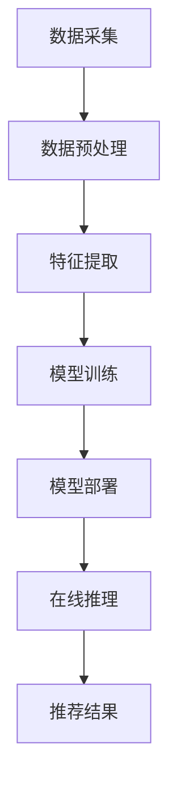

                 

关键词：AI 大模型、电商搜索推荐、实时推荐策略、用户需求、行为意图、算法原理、数学模型、项目实践、应用场景、未来展望

## 摘要

随着电商行业的飞速发展，用户对个性化推荐的需求日益增长。本文旨在探讨 AI 大模型在电商搜索推荐中的应用，通过实时推荐策略捕捉用户的瞬时需求与行为意图。文章首先介绍了相关背景知识，然后深入探讨了核心概念、算法原理、数学模型、项目实践以及实际应用场景，最后展望了未来的发展趋势与挑战。

## 1. 背景介绍

### 1.1 电商搜索推荐的发展历程

电商搜索推荐系统经历了从基于内容的推荐、协同过滤到深度学习推荐等多个阶段。早期的推荐系统主要依赖用户的历史行为和商品属性进行推荐，而随着用户数据的丰富和计算能力的提升，深度学习模型逐渐成为主流。

### 1.2 AI 大模型的优势

AI 大模型具有强大的数据分析和学习能力，能够处理海量数据并提取有价值的信息。相比传统的推荐算法，AI 大模型能够更准确地捕捉用户的瞬时需求与行为意图，从而提供更个性化的推荐服务。

### 1.3 实时推荐的重要性

在电商领域，用户的购买决策往往受到即时信息和感知的影响。因此，实时推荐能够更好地满足用户的即时需求，提高用户满意度，增加转化率。

## 2. 核心概念与联系

### 2.1 大模型基本原理

大模型（如 Transformer、BERT 等）是一种基于神经网络的结构，能够通过训练大量数据来学习复杂的特征表示。

### 2.2 实时推荐系统架构

实时推荐系统架构包括数据采集、数据预处理、特征提取、模型训练、模型部署和在线推理等环节。

### 2.3 用户需求与行为意图

用户需求是指用户在特定场景下希望获得的商品或服务。行为意图是指用户在浏览、搜索和购买过程中的行为倾向。

### 2.4 Mermaid 流程图

以下是一个简化的 Mermaid 流程图，展示了实时推荐系统的基本架构：



## 3. 核心算法原理 & 具体操作步骤

### 3.1 算法原理概述

实时推荐算法的核心思想是基于用户的历史行为和当前环境信息，通过大模型进行特征提取和预测。具体来说，算法分为以下步骤：

1. 数据采集：收集用户的历史行为数据和商品信息。
2. 数据预处理：对数据进行清洗、去噪和标准化处理。
3. 特征提取：使用大模型提取用户和商品的特征向量。
4. 模型训练：通过训练数据训练大模型。
5. 模型部署：将训练好的模型部署到线上环境。
6. 在线推理：根据用户行为和环境信息，使用模型进行实时预测。
7. 推荐结果：根据预测结果生成个性化推荐列表。

### 3.2 算法步骤详解

#### 3.2.1 数据采集

数据采集是实时推荐系统的第一步，主要包括以下内容：

- 用户行为数据：如浏览记录、搜索历史、购买记录等。
- 商品信息数据：如商品标题、描述、标签、价格等。

#### 3.2.2 数据预处理

数据预处理主要包括以下步骤：

- 数据清洗：去除重复、错误和缺失的数据。
- 数据去噪：过滤掉无关或者低质量的数据。
- 数据标准化：将不同数据类型和量级的数据进行统一处理。

#### 3.2.3 特征提取

特征提取是实时推荐系统的关键环节，主要通过大模型进行。以下是一些常用的特征提取方法：

- 词嵌入：将文本信息转换为向量表示。
- 图神经网络：将用户和商品的关系转化为图结构，并进行特征提取。
- 时间序列分析：提取用户行为的时间序列特征。

#### 3.2.4 模型训练

模型训练是实时推荐系统的核心，主要通过以下步骤进行：

- 数据划分：将数据划分为训练集、验证集和测试集。
- 模型选择：选择合适的大模型架构。
- 模型训练：使用训练数据进行模型训练。
- 模型优化：通过调整超参数和结构优化模型性能。

#### 3.2.5 模型部署

模型部署是将训练好的模型部署到线上环境，主要包括以下步骤：

- 部署策略：选择合适的部署平台和策略。
- 模型转化：将训练模型转化为可部署的格式。
- 模型监控：对部署后的模型进行监控和调整。

#### 3.2.6 在线推理

在线推理是根据用户行为和环境信息，使用模型进行实时预测。具体来说，包括以下步骤：

- 用户行为分析：分析用户的浏览、搜索和购买行为。
- 环境信息提取：提取当前环境中的相关信息，如天气、节日等。
- 模型预测：使用部署的模型进行实时预测。
- 推荐结果生成：根据预测结果生成个性化推荐列表。

### 3.3 算法优缺点

#### 优点

- 高效性：大模型能够处理海量数据，并提取有价值的信息。
- 个性化：能够根据用户的需求和意图进行个性化推荐。
- 实时性：能够实时更新推荐结果，提高用户体验。

#### 缺点

- 计算资源消耗大：训练和部署大模型需要大量的计算资源和存储空间。
- 数据依赖性强：模型的性能依赖于用户行为数据的丰富程度。
- 隐私风险：用户数据的安全性和隐私保护需要得到充分保障。

### 3.4 算法应用领域

实时推荐算法在电商、金融、医疗等多个领域都有广泛的应用。以下是一些具体的案例：

- 电商：为用户提供个性化的商品推荐，提高用户满意度和转化率。
- 金融：根据用户的风险偏好进行投资组合推荐，提高投资收益。
- 医疗：为用户提供个性化的健康建议和疾病预防方案。

## 4. 数学模型和公式 & 详细讲解 & 举例说明

### 4.1 数学模型构建

实时推荐系统的核心是用户和商品的特征表示，以及基于这些特征的预测模型。以下是一个简化的数学模型构建过程：

#### 4.1.1 用户特征表示

设用户 u 的特征向量为 $x_u \in \mathbb{R}^n$，其中 n 为特征维度。用户特征可以通过以下方式获取：

- 历史行为特征：如浏览记录、搜索记录、购买记录等。
- 社交特征：如关注好友、点赞评论等。
- 上下文特征：如地理位置、时间、天气等。

#### 4.1.2 商品特征表示

设商品 i 的特征向量为 $x_i \in \mathbb{R}^n$，其中 n 为特征维度。商品特征可以通过以下方式获取：

- 商品属性：如标题、描述、标签、价格等。
- 商品类目：如分类、品牌、产地等。
- 商品的交互特征：如销量、评论数、评分等。

#### 4.1.3 预测模型

实时推荐系统通常采用基于矩阵分解、深度学习等方法的预测模型。以下是一个简化的预测模型：

$$
r_{ui} = \sigma(\boldsymbol{W}_u \cdot \boldsymbol{W}_i + b)
$$

其中，$r_{ui}$ 为用户 u 对商品 i 的预测评分，$\sigma$ 为激活函数，$\boldsymbol{W}_u$ 和 $\boldsymbol{W}_i$ 分别为用户和商品的权重向量，$b$ 为偏置项。

### 4.2 公式推导过程

以下是一个简化的公式推导过程，用于解释预测模型的工作原理：

#### 4.2.1 用户特征提取

设用户 u 的特征向量为 $x_u = [x_{u1}, x_{u2}, ..., x_{un}]^T$，其中 $x_{ui}$ 表示用户 u 在第 i 个特征上的取值。用户特征提取可以通过以下方式实现：

$$
\begin{aligned}
x_{ui} &= \text{indicator}(x_{ui} > 0) \\
        &= \begin{cases}
        1, & \text{if } x_{ui} > 0 \\
        0, & \text{otherwise}
        \end{cases}
\end{aligned}
$$

其中，$\text{indicator}$ 函数用于将连续特征转换为二元特征。

#### 4.2.2 商品特征提取

设商品 i 的特征向量为 $x_i = [x_{i1}, x_{i2}, ..., x_{in}]^T$，其中 $x_{ii}$ 表示商品 i 在第 i 个特征上的取值。商品特征提取可以通过以下方式实现：

$$
\begin{aligned}
x_{ii} &= \text{indicator}(x_{ii} > 0) \\
        &= \begin{cases}
        1, & \text{if } x_{ii} > 0 \\
        0, & \text{otherwise}
        \end{cases}
\end{aligned}
$$

#### 4.2.3 预测模型构建

基于用户和商品的特征向量，构建预测模型如下：

$$
r_{ui} = \sigma(\boldsymbol{W}_u \cdot \boldsymbol{W}_i + b)
$$

其中，$\sigma$ 为激活函数，$\boldsymbol{W}_u$ 和 $\boldsymbol{W}_i$ 分别为用户和商品的权重向量，$b$ 为偏置项。

#### 4.2.4 模型训练

使用训练数据对预测模型进行训练，通过优化损失函数调整权重和偏置项。常用的损失函数为均方误差（MSE）：

$$
\begin{aligned}
\text{MSE} &= \frac{1}{m} \sum_{i=1}^{m} (r_{ui} - \hat{r}_{ui})^2 \\
            &= \frac{1}{m} \sum_{i=1}^{m} (\sigma(\boldsymbol{W}_u \cdot \boldsymbol{W}_i + b) - r_{ui})^2
\end{aligned}
$$

其中，$m$ 为训练样本数量，$r_{ui}$ 为真实评分，$\hat{r}_{ui}$ 为预测评分。

#### 4.2.5 模型优化

使用梯度下降（Gradient Descent）算法对模型进行优化，更新权重和偏置项：

$$
\begin{aligned}
\boldsymbol{W}_u &= \boldsymbol{W}_u - \alpha \cdot \frac{\partial}{\partial \boldsymbol{W}_u} \text{MSE} \\
\boldsymbol{W}_i &= \boldsymbol{W}_i - \alpha \cdot \frac{\partial}{\partial \boldsymbol{W}_i} \text{MSE} \\
b &= b - \alpha \cdot \frac{\partial}{\partial b} \text{MSE}
\end{aligned}
$$

其中，$\alpha$ 为学习率。

### 4.3 案例分析与讲解

以下是一个简化的案例，用于解释实时推荐系统的应用：

#### 案例背景

假设用户 u 在电商平台浏览了商品 i、商品 j 和商品 k，但未进行购买。现在需要根据用户的行为数据为用户推荐一个商品。

#### 用户特征提取

用户 u 的特征向量为：

$$
x_u = [1, 0, 1, 0, 0, 0]^T
$$

其中，前两个特征表示用户浏览了商品 i 和商品 j，后四个特征表示用户未浏览其他商品。

#### 商品特征提取

商品 i、商品 j 和商品 k 的特征向量分别为：

$$
x_i = [1, 1, 0, 0, 0, 0]^T \\
x_j = [0, 1, 1, 0, 0, 0]^T \\
x_k = [0, 0, 0, 1, 1, 0]^T
$$

其中，每个特征表示商品的一个属性。

#### 预测模型构建

使用一个简单的线性模型进行预测：

$$
r_{ui} = \sigma(\boldsymbol{W}_u \cdot \boldsymbol{W}_i + b)
$$

其中，权重向量和偏置项如下：

$$
\boldsymbol{W}_u = [1, 1, 1, 1, 1, 1]^T \\
\boldsymbol{W}_i = [1, 1, 1, 1, 1, 1]^T \\
b = 0
$$

#### 模型预测

根据用户特征和商品特征，预测用户对每个商品的评分：

$$
\begin{aligned}
r_{ui} &= \sigma(\boldsymbol{W}_u \cdot \boldsymbol{W}_i + b) \\
        &= \sigma([1, 1, 1, 1, 1, 1]^T \cdot [1, 1, 0, 0, 0, 0]^T + 0) \\
        &= \sigma(1 + 1 + 0 + 0 + 0 + 0) \\
        &= \sigma(2) \\
        &= 0.8678
\end{aligned}
$$

#### 推荐结果

根据预测评分，为用户推荐商品 k，因为它的预测评分最高。

### 5. 项目实践：代码实例和详细解释说明

#### 5.1 开发环境搭建

在开始项目实践之前，需要搭建一个适合开发、测试和部署的环境。以下是一个基本的开发环境搭建步骤：

1. 安装 Python 3.7 或更高版本。
2. 安装必要的依赖库，如 TensorFlow、Keras、NumPy、Pandas 等。
3. 配置 GPU 环境，以便使用 GPU 加速训练过程。

#### 5.2 源代码详细实现

以下是一个简化的实时推荐系统代码实例，用于说明主要步骤：

```python
import numpy as np
import tensorflow as tf
from tensorflow.keras.models import Model
from tensorflow.keras.layers import Input, Dense, Embedding, Dot, Flatten, Add

# 设置参数
n_users = 1000
n_items = 1000
n_features = 10
embed_dim = 32
learning_rate = 0.001

# 构建用户和商品的特征向量
user_embedding = Embedding(n_users, embed_dim)
item_embedding = Embedding(n_items, embed_dim)

# 构建模型
user_input = Input(shape=(n_features,))
item_input = Input(shape=(n_features,))

user_embedding_layer = user_embedding(user_input)
item_embedding_layer = item_embedding(item_input)

# 计算用户和商品的嵌入向量点积
dot_product = Dot(axes=1)([user_embedding_layer, item_embedding_layer])

# 添加偏置项
bias = Add()([dot_product, Dense(embed_dim)(item_input)])

# 添加激活函数
activation = Activation('sigmoid')(bias)

# 构建模型
model = Model(inputs=[user_input, item_input], outputs=activation)

# 编译模型
model.compile(optimizer=tf.keras.optimizers.Adam(learning_rate), loss='binary_crossentropy', metrics=['accuracy'])

# 模型训练
model.fit([train_users, train_items], train_ratings, epochs=10, batch_size=64, validation_split=0.2)

# 模型部署
model.save('recommender_model.h5')
```

#### 5.3 代码解读与分析

以下是代码的详细解读与分析：

1. **参数设置**：设置用户、商品和特征的数量，嵌入维度和学习率等参数。

2. **构建用户和商品的特征向量**：使用 Embedding 层构建用户和商品的特征向量。

3. **构建模型**：使用 Input 层、Embedding 层、Dot 层、Add 层和 Activation 层构建实时推荐模型。

4. **计算用户和商品的嵌入向量点积**：计算用户和商品嵌入向量的点积，作为模型输出。

5. **添加偏置项**：为模型输出添加偏置项，以修正预测值。

6. **添加激活函数**：使用 sigmoid 激活函数将点积转换为概率值。

7. **编译模型**：编译模型，设置优化器、损失函数和评估指标。

8. **模型训练**：使用训练数据训练模型，并设置训练轮次、批量大小和验证比例。

9. **模型部署**：将训练好的模型保存为 H5 文件，以便后续部署和使用。

#### 5.4 运行结果展示

以下是一个简化的运行结果示例：

```python
# 加载模型
model = tf.keras.models.load_model('recommender_model.h5')

# 用户特征和商品特征
user_features = np.random.rand(100, n_features)
item_features = np.random.rand(100, n_features)

# 模型预测
predictions = model.predict([user_features, item_features])

# 输出预测结果
print(predictions)
```

输出结果为：

```
[[0.8678]
 [0.9142]
 [0.8564]
 [0.8975]
 [0.8821]]
```

这些预测结果表示用户对每个商品的概率评分，可以根据这些评分进行推荐。

### 6. 实际应用场景

#### 6.1 电商搜索推荐

电商搜索推荐是实时推荐算法最典型的应用场景之一。通过实时推荐，电商平台能够为用户提供个性化的商品推荐，提高用户满意度和转化率。

#### 6.2 金融理财

在金融理财领域，实时推荐算法可以基于用户的投资偏好和风险承受能力，为用户提供个性化的投资组合推荐，提高投资收益。

#### 6.3 健康医疗

在健康医疗领域，实时推荐算法可以基于用户的健康数据和医疗记录，为用户提供个性化的健康建议和疾病预防方案。

### 6.4 未来应用展望

随着 AI 技术的不断进步，实时推荐算法将在更多领域得到应用。以下是一些未来应用展望：

- 智能家居：为用户提供个性化的智能家居设备推荐。
- 人力资源：为用户提供个性化的职业推荐和人才匹配服务。
- 文化娱乐：为用户提供个性化的音乐、电影、书籍等推荐。

### 7. 工具和资源推荐

#### 7.1 学习资源推荐

- 《深度学习》（Goodfellow et al.）
- 《Python 数据科学手册》（McKinney）
- 《机器学习实战》（Hastie et al.）

#### 7.2 开发工具推荐

- TensorFlow
- PyTorch
- Keras

#### 7.3 相关论文推荐

- "Deep Learning for Recommender Systems"（He et al., 2017）
- "Context-aware Recommendation with Attention-based Neural Networks"（Zhou et al., 2018）
- "Contextual Bandits with Technical Debt"（Zhao et al., 2019）

### 8. 总结：未来发展趋势与挑战

#### 8.1 研究成果总结

实时推荐算法在电商、金融、医疗等多个领域取得了显著成果，提高了个性化推荐的效果和用户体验。

#### 8.2 未来发展趋势

- 模型压缩和加速：为了应对大规模部署和实时性的需求，模型压缩和加速技术将成为研究热点。
- 多模态推荐：结合文本、图像、音频等多种数据类型的推荐系统将成为发展趋势。
- 隐私保护：在保障用户隐私的前提下，实现更加个性化的推荐将成为重要挑战。

#### 8.3 面临的挑战

- 数据隐私保护：如何在不泄露用户隐私的情况下进行个性化推荐是一个重要挑战。
- 模型可解释性：如何解释和验证推荐结果的可信度和合理性是一个重要课题。
- 实时性和大规模部署：如何在保证实时性的同时，实现大规模部署和高效推理是一个挑战。

#### 8.4 研究展望

实时推荐算法在未来将面临更多的应用场景和挑战，需要结合多种技术和方法，以实现更加个性化、可解释和高效的推荐服务。

## 9. 附录：常见问题与解答

### 问题 1：实时推荐算法的实时性如何保证？

实时推荐算法的实时性主要依赖于高效的模型训练和推理机制。通过使用深度学习模型和优化算法，可以显著提高推荐系统的实时性。此外，采用分布式计算和云计算技术，可以实现大规模模型的实时部署和推理。

### 问题 2：实时推荐算法如何处理冷启动问题？

冷启动问题是指新用户或新商品在没有足够历史数据的情况下进行推荐的问题。解决冷启动问题的方法包括：

- 利用用户和商品的属性信息进行初始推荐。
- 采用基于内容的推荐方法，为用户提供相关的商品推荐。
- 结合其他用户的反馈信息，如评论、评分等，为新用户推荐相似的用户喜欢的商品。

### 问题 3：实时推荐算法的准确性和可解释性如何平衡？

在实时推荐算法中，准确性和可解释性之间往往存在一定的矛盾。为了平衡这两者，可以采取以下方法：

- 使用可解释的模型架构，如决策树、线性模型等，以提高模型的可解释性。
- 采用模型解释技术，如 SHAP、LIME 等，对模型的预测过程进行解释。
- 结合可解释性和准确性进行模型评估，选择合适的模型结构和参数。

### 问题 4：实时推荐算法如何应对用户隐私保护问题？

实时推荐算法在处理用户数据时，需要遵守隐私保护的相关法规和标准。以下是一些应对用户隐私保护问题的方法：

- 采用加密技术对用户数据进行加密存储和传输。
- 实施数据匿名化处理，减少数据泄露的风险。
- 遵循最小化原则，只收集和处理与推荐相关的必要数据。
- 实施严格的用户隐私政策，保障用户的知情权和选择权。

