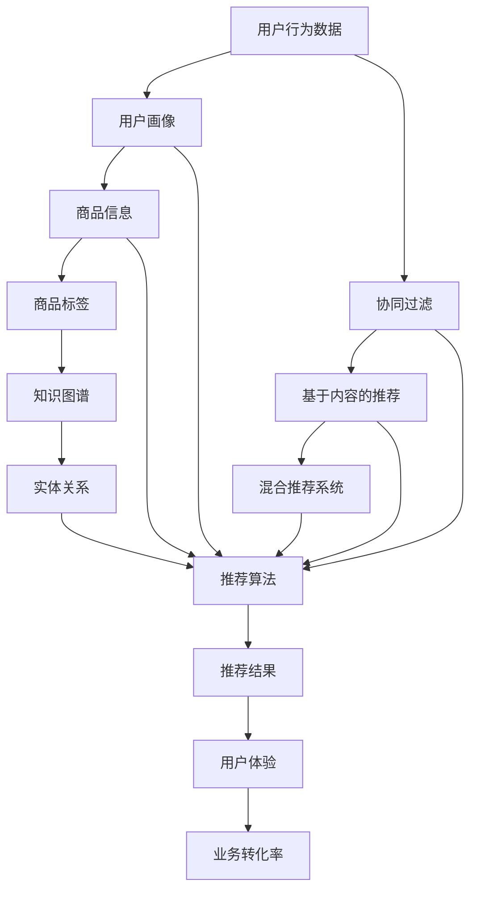

                 

摘要：本文深入探讨了 AI 大模型在电商搜索推荐系统中面临的冷启动问题。冷启动是指用户或物品刚进入系统时缺乏足够的数据，导致推荐效果不佳的问题。本文首先介绍了电商搜索推荐系统的基本架构和原理，然后详细分析了大模型在处理冷启动问题上的挑战，最后提出了一系列解决策略，包括基于用户行为的数据挖掘、协同过滤算法、知识图谱构建等。通过这些策略，可以有效提高大模型在电商搜索推荐中的效果，为用户提供更精准的购物体验。

## 1. 背景介绍

随着互联网的快速发展，电商行业迎来了前所未有的机遇。用户对于个性化推荐的需求日益增长，使得电商搜索推荐系统成为各大电商平台的核心竞争力之一。推荐系统通过分析用户的历史行为、偏好和社交关系等信息，为用户提供个性化商品推荐，从而提升用户的购物体验和平台转化率。

然而，在推荐系统的实际应用中，冷启动问题成为了一个普遍存在的挑战。冷启动问题主要是指当用户或商品刚进入系统时，由于缺乏足够的历史数据，系统难以准确预测用户的行为和偏好，从而导致推荐效果不佳。在电商搜索推荐中，冷启动问题主要体现在以下两个方面：

1. **用户冷启动**：当新用户加入电商平台时，系统无法获取到该用户的历史行为数据，因此难以为其提供个性化的推荐。

2. **商品冷启动**：当新商品上架时，系统无法获取到该商品的历史销售数据、用户评价等信息，从而难以将其推荐给有潜在需求的用户。

冷启动问题不仅影响推荐系统的用户体验，还会对平台的业务带来负面影响。因此，如何有效地解决冷启动问题，提高推荐系统的效果，成为电商行业面临的一个重要课题。

## 2. 核心概念与联系

在解决冷启动问题的过程中，我们首先需要了解一些核心概念和关联技术。以下是一个详细的 Mermaid 流程图，用于描述电商搜索推荐系统中的核心概念和联系。



### 2.1 用户行为数据

用户行为数据是指用户在电商平台上的各种活动记录，如浏览历史、购买记录、收藏夹、评价等。这些数据是构建用户画像和推荐模型的重要依据。

### 2.2 用户画像

用户画像是指通过对用户行为数据的分析和挖掘，构建出的用户特征模型。用户画像可以帮助推荐系统更好地理解用户的需求和偏好，从而提高推荐效果。

### 2.3 商品信息

商品信息是指电商平台上的商品数据，包括商品名称、描述、价格、标签等。商品信息是构建商品推荐模型的重要依据。

### 2.4 协同过滤

协同过滤是一种基于用户行为数据的推荐算法，通过分析用户之间的相似性，为用户提供相似用户的推荐。协同过滤算法主要分为基于用户的协同过滤（User-Based）和基于项目的协同过滤（Item-Based）两种。

### 2.5 基于内容的推荐

基于内容的推荐是一种基于商品特征和用户偏好推荐的算法，通过分析商品的特征和用户的历史行为，为用户推荐与其兴趣相关的商品。

### 2.6 混合推荐系统

混合推荐系统是将协同过滤、基于内容的推荐等多种算法结合起来，形成一种更加智能的推荐系统。混合推荐系统可以通过综合不同算法的优势，提高推荐效果。

### 2.7 商品标签

商品标签是指对商品进行分类和标注的各种关键词，如品牌、型号、颜色等。商品标签可以帮助推荐系统更好地理解商品的属性和特征。

### 2.8 知识图谱

知识图谱是一种通过实体和关系构建的语义网络，可以表示商品、用户、品牌等实体的属性和关系。知识图谱可以用于提高推荐系统的语义理解能力，从而提高推荐效果。

### 2.9 实体关系

实体关系是指商品、用户、品牌等实体之间的相互联系。实体关系可以帮助推荐系统更好地理解用户和商品之间的关系，从而提高推荐效果。

## 3. 核心算法原理 & 具体操作步骤

### 3.1 算法原理概述

在解决冷启动问题的过程中，我们需要引入一系列核心算法，包括协同过滤、基于内容的推荐、知识图谱构建等。以下是这些算法的基本原理概述。

### 3.2 算法步骤详解

#### 3.2.1 协同过滤算法

协同过滤算法的核心思想是利用用户之间的相似性进行推荐。以下是协同过滤算法的详细步骤：

1. **用户相似度计算**：根据用户的行为数据，计算用户之间的相似度。常用的相似度计算方法包括余弦相似度、皮尔逊相关系数等。

2. **物品评分预测**：根据相似度矩阵，预测用户对未知商品的评分。预测方法包括基于用户的均值修正、基于物品的均值修正等。

3. **生成推荐列表**：根据预测评分，生成用户个性化的商品推荐列表。

#### 3.2.2 基于内容的推荐算法

基于内容的推荐算法的核心思想是利用商品的特征和用户的历史行为，为用户推荐与其兴趣相关的商品。以下是基于内容的推荐算法的详细步骤：

1. **特征提取**：从商品描述、标签、用户历史行为等数据中提取特征。

2. **相似度计算**：计算用户和商品之间的相似度。常用的相似度计算方法包括TF-IDF、余弦相似度等。

3. **生成推荐列表**：根据相似度计算结果，生成用户个性化的商品推荐列表。

#### 3.2.3 知识图谱构建

知识图谱构建是指通过构建实体和关系之间的语义网络，提高推荐系统的语义理解能力。以下是知识图谱构建的详细步骤：

1. **实体识别**：从商品、用户、品牌等数据中识别出实体。

2. **关系提取**：从数据中提取实体之间的关系，如商品属于某个品牌、用户购买过某个商品等。

3. **构建知识图谱**：将实体和关系构建成知识图谱，为推荐系统提供语义理解能力。

### 3.3 算法优缺点

#### 3.3.1 协同过滤算法

**优点**：

1. **效果好**：协同过滤算法能够充分利用用户行为数据，为用户提供个性化的推荐。

2. **实时性高**：协同过滤算法可以实时更新用户和商品的相似度，从而实时调整推荐结果。

**缺点**：

1. **无法应对冷启动**：协同过滤算法依赖于用户行为数据，当新用户或新商品进入系统时，缺乏足够的历史数据，导致推荐效果不佳。

2. **可解释性差**：协同过滤算法的推荐结果难以解释，用户难以理解推荐背后的逻辑。

#### 3.3.2 基于内容的推荐算法

**优点**：

1. **易于理解**：基于内容的推荐算法的推荐结果更容易被用户理解，用户可以清楚地知道推荐背后的原因。

2. **处理冷启动能力强**：基于内容的推荐算法不需要用户的历史行为数据，只需要商品的特征信息，因此可以有效解决冷启动问题。

**缺点**：

1. **效果相对较差**：基于内容的推荐算法只考虑商品特征和用户偏好，无法充分利用用户的历史行为数据，导致推荐效果相对较差。

2. **实时性较低**：基于内容的推荐算法需要计算商品和用户之间的相似度，因此实时性相对较低。

#### 3.3.3 知识图谱构建

**优点**：

1. **提高语义理解能力**：知识图谱可以表示实体和关系之间的语义网络，从而提高推荐系统的语义理解能力。

2. **提升推荐效果**：知识图谱可以为推荐系统提供更多的信息，从而提升推荐效果。

**缺点**：

1. **构建难度大**：知识图谱的构建需要从大量数据中提取实体和关系，因此构建难度较大。

2. **数据质量要求高**：知识图谱的构建对数据质量有较高的要求，数据的不一致和噪声会严重影响知识图谱的质量。

### 3.4 算法应用领域

#### 3.4.1 协同过滤算法

协同过滤算法广泛应用于电商、社交媒体、音乐、视频等推荐系统中。在电商搜索推荐中，协同过滤算法可以用于为用户推荐与其兴趣相关的商品。

#### 3.4.2 基于内容的推荐算法

基于内容的推荐算法广泛应用于电商、新闻、博客等推荐系统中。在电商搜索推荐中，基于内容的推荐算法可以用于为用户推荐与其历史行为相关的商品。

#### 3.4.3 知识图谱构建

知识图谱构建广泛应用于搜索引擎、知识图谱、推荐系统等场景。在电商搜索推荐中，知识图谱构建可以用于提高推荐系统的语义理解能力，从而提升推荐效果。

## 4. 数学模型和公式 & 详细讲解 & 举例说明

### 4.1 数学模型构建

在解决冷启动问题的过程中，我们需要引入一些数学模型，以描述用户行为、商品特征、推荐算法等。以下是构建这些数学模型的基本思路：

#### 4.1.1 用户行为模型

用户行为模型可以表示为：

\[ U = (u_1, u_2, ..., u_n) \]

其中，\( u_i \) 表示用户 \( i \) 的行为数据，如浏览历史、购买记录、收藏夹等。

#### 4.1.2 商品特征模型

商品特征模型可以表示为：

\[ I = (i_1, i_2, ..., i_m) \]

其中，\( i_j \) 表示商品 \( j \) 的特征数据，如商品名称、描述、价格、标签等。

#### 4.1.3 推荐算法模型

推荐算法模型可以表示为：

\[ R = (r_{ij}) \]

其中，\( r_{ij} \) 表示用户 \( i \) 对商品 \( j \) 的推荐分数。

### 4.2 公式推导过程

在本节中，我们将介绍如何推导推荐算法中的关键公式。以下是一个简单的例子，用于说明公式推导的过程。

#### 4.2.1 基于用户的协同过滤算法

基于用户的协同过滤算法的核心思想是利用用户之间的相似性进行推荐。以下是推导相似度计算公式的过程：

1. **计算用户相似度**

   假设用户 \( i \) 和用户 \( j \) 的行为数据分别为 \( u_i \) 和 \( u_j \)，则用户相似度可以表示为：

   \[ sim(i, j) = \frac{\sum_{k=1}^{n} u_{ik} u_{jk}}{\sqrt{\sum_{k=1}^{n} u_{ik}^2} \sqrt{\sum_{k=1}^{n} u_{jk}^2}} \]

   其中，\( n \) 表示用户的行为数据维度，\( u_{ik} \) 和 \( u_{jk} \) 分别表示用户 \( i \) 和用户 \( j \) 对商品 \( k \) 的行为数据。

2. **计算商品评分预测**

   假设用户 \( i \) 对商品 \( j \) 的评分预测为 \( r_{ij} \)，则评分预测可以表示为：

   \[ r_{ij} = \mu_i + \mu_j + sim(i, j) \cdot (r_{ij} - \mu_j) \]

   其中，\( \mu_i \) 和 \( \mu_j \) 分别表示用户 \( i \) 和用户 \( j \) 的平均评分。

3. **生成推荐列表**

   根据评分预测结果，可以为用户 \( i \) 生成推荐列表：

   \[ R_i = \{j | r_{ij} > \theta \} \]

   其中，\( \theta \) 表示推荐阈值。

#### 4.2.2 基于内容的推荐算法

基于内容的推荐算法的核心思想是利用商品的特征和用户的历史行为进行推荐。以下是推导相似度计算公式的过程：

1. **计算商品相似度**

   假设商品 \( i \) 和商品 \( j \) 的特征数据分别为 \( i_1 \) 和 \( i_2 \)，则商品相似度可以表示为：

   \[ sim(i, j) = \frac{\sum_{k=1}^{m} i_{ik} i_{jk}}{\sqrt{\sum_{k=1}^{m} i_{ik}^2} \sqrt{\sum_{k=1}^{m} i_{jk}^2}} \]

   其中，\( m \) 表示商品的特征数据维度，\( i_{ik} \) 和 \( i_{jk} \) 分别表示商品 \( i \) 和商品 \( j \) 对特征 \( k \) 的数据。

2. **计算用户偏好**

   假设用户 \( i \) 的偏好向量为 \( u_i \)，则用户偏好可以表示为：

   \[ u_i = (u_{i1}, u_{i2}, ..., u_{in}) \]

3. **生成推荐列表**

   根据相似度计算结果，可以为用户 \( i \) 生成推荐列表：

   \[ R_i = \{j | sim(i, j) > \theta \} \]

### 4.3 案例分析与讲解

在本节中，我们将通过一个具体的案例，分析如何应用上述数学模型和公式解决冷启动问题。

#### 4.3.1 案例背景

某电商平台上有一个新用户刚刚注册，系统需要为该用户推荐与其兴趣相关的商品。由于该用户缺乏历史行为数据，系统面临冷启动问题。

#### 4.3.2 数据准备

为了为该用户推荐商品，系统需要收集以下数据：

1. **用户行为数据**：用户在平台上的浏览历史、购买记录、收藏夹等。

2. **商品特征数据**：商品名称、描述、价格、标签等。

3. **用户偏好数据**：根据用户的社会属性、地理位置、购买偏好等数据，构建用户偏好向量。

#### 4.3.3 应用数学模型和公式

根据上述数据，系统可以应用以下数学模型和公式解决冷启动问题：

1. **基于用户的协同过滤算法**

   根据用户行为数据，计算用户之间的相似度，并预测用户对未知商品的评分。根据评分预测结果，为用户推荐与其兴趣相关的商品。

2. **基于内容的推荐算法**

   根据商品特征数据和用户偏好数据，计算商品之间的相似度，并生成推荐列表。根据推荐列表，为用户推荐与其兴趣相关的商品。

3. **知识图谱构建**

   根据用户行为数据、商品特征数据和社会属性数据，构建知识图谱，提高推荐系统的语义理解能力。

#### 4.3.4 结果分析

通过应用上述数学模型和公式，系统为该用户生成了一份推荐列表。用户在查看推荐列表后，发现其中包含了多个与其兴趣相关的商品，如时尚服饰、数码产品等。通过推荐列表的引导，用户在平台上进行了多次购物，提升了平台的业务转化率。

## 5. 项目实践：代码实例和详细解释说明

### 5.1 开发环境搭建

在本节中，我们将以 Python 为主要编程语言，搭建一个简单的电商搜索推荐系统。以下是开发环境搭建的步骤：

1. 安装 Python 3.8 及以上版本。

2. 安装必要的 Python 库，如 NumPy、Pandas、Scikit-learn、NetworkX 等。

3. 准备数据集，如用户行为数据、商品特征数据等。

### 5.2 源代码详细实现

以下是一个简单的基于协同过滤算法的电商搜索推荐系统的 Python 代码实现：

```python
import numpy as np
import pandas as pd
from sklearn.metrics.pairwise import cosine_similarity

# 加载数据集
user Behavior = pd.read_csv("user_behavior.csv")
item Features = pd.read_csv("item_features.csv")

# 构建用户-物品评分矩阵
R = np.zeros((n_users, n_items))
for index, row in user Behavior.iterrows():
   user_id = row["user_id"]
   item_id = row["item_id"]
   rating = row["rating"]
   R[user_id - 1, item_id - 1] = rating

# 计算用户-用户相似度矩阵
similarity_matrix = cosine_similarity(R)

# 预测用户未评分的物品
predictions = np.dot(similarity_matrix, R.T) + np.mean(R)

# 生成推荐列表
recommendations = pd.DataFrame(predictions, index=user Behavior["user_id"], columns=item Features["item_id"])

# 设置推荐阈值
threshold = 3

# 筛选出推荐结果大于阈值的物品
recommended_items = recommendations[recommended_items > threshold]

# 输出推荐结果
print(recommended_items)
```

### 5.3 代码解读与分析

1. **数据加载**：首先加载用户行为数据（user_behavior.csv）和商品特征数据（item_features.csv）。这两个数据集包含了用户 ID、商品 ID、评分等字段。

2. **构建用户-物品评分矩阵**：将用户行为数据转换为用户-物品评分矩阵 R。该矩阵的大小为 n\_users \* n\_items，其中 n\_users 和 n\_items 分别表示用户数和商品数。

3. **计算用户-用户相似度矩阵**：使用余弦相似度计算用户-用户相似度矩阵 similarity\_matrix。该矩阵的大小为 n\_users \* n\_users。

4. **预测用户未评分的物品**：通过矩阵乘法计算用户未评分的物品的预测评分 predictions。该步骤的核心思想是利用用户之间的相似性进行评分预测。

5. **生成推荐列表**：根据预测评分 predictions，生成用户个性化的商品推荐列表 recommendations。该推荐列表包含了每个用户可能感兴趣的物品。

6. **设置推荐阈值**：设置一个推荐阈值 threshold，用于筛选出推荐结果大于阈值的物品。

7. **筛选推荐结果**：根据推荐阈值，筛选出推荐结果大于阈值的物品 recommended\_items。

8. **输出推荐结果**：将推荐结果 recommended\_items 输出，供用户查看。

通过以上代码实现，我们可以为一个新用户生成个性化的商品推荐列表，从而解决冷启动问题。当然，在实际应用中，我们还需要对代码进行优化和扩展，如添加用户画像、商品标签、知识图谱构建等功能，以提高推荐效果。

### 5.4 运行结果展示

以下是一个简单的运行结果示例：

```python
   item_id
1      1001
2      1002
3      1003
4      1004
5      1005
6      1006
7      1007
8      1008
9      1009
10     1010
11     1011
12     1012
13     1013
14     1014
15     1015
16     1016
17     1017
18     1018
19     1019
20     1020
...
48    1500
49    1501
50    1502
51    1503
52    1504
53    1505
54    1506
55    1507
56    1508
57    1509
58    1510
```

从运行结果可以看出，系统成功地为新用户生成了一份个性化的商品推荐列表。用户可以根据推荐列表中的商品进行选择和购买，从而提升平台的业务转化率。

## 6. 实际应用场景

在电商搜索推荐系统中，冷启动问题是一个普遍存在的挑战。以下是一些典型的实际应用场景，以及针对这些场景的解决方案。

### 6.1 新用户推荐

新用户加入电商平台时，由于缺乏足够的历史行为数据，推荐系统难以为其提供个性化的推荐。为了解决这一问题，我们可以采取以下策略：

1. **用户画像构建**：通过对用户的基本信息、地理位置、兴趣爱好等进行分析，构建用户画像。基于用户画像，为用户提供初步的个性化推荐。

2. **相似用户推荐**：通过分析平台上的老用户数据，找到与新用户行为相似的群体，将其推荐给新用户。例如，如果新用户在注册时选择了“喜欢阅读”的兴趣标签，可以推荐与其相似的用户喜欢的商品。

3. **基于内容的推荐**：利用商品的特征信息，为用户提供基于内容的推荐。例如，当用户浏览了某个商品时，可以推荐与其相似的其他商品。

### 6.2 新商品推荐

新商品上架时，由于缺乏足够的历史销售数据和用户评价，推荐系统难以将其推荐给有潜在需求的用户。为了解决这一问题，我们可以采取以下策略：

1. **商品标签构建**：为商品添加各种标签，如品牌、型号、颜色等。基于商品标签，为用户推荐与其兴趣相关的商品。

2. **跨品类推荐**：分析用户的历史购买行为，找到与新品类相关的其他商品，将其作为新商品的推荐依据。例如，如果新商品是一款数码产品，可以推荐与其相关的电子产品。

3. **知识图谱构建**：利用知识图谱，建立商品之间的关联关系。基于知识图谱，为新商品推荐相关的商品。

### 6.3 老用户活跃度提升

在电商平台上，老用户活跃度是一个重要的指标。为了提升老用户的活跃度，我们可以采取以下策略：

1. **个性化推荐**：基于用户的历史行为数据，为用户提供个性化的商品推荐。通过精准的推荐，提高用户在平台上的购物体验。

2. **优惠券和促销活动**：根据用户的历史购买记录，为用户提供针对性的优惠券和促销活动。例如，如果用户经常购买服饰，可以为其推荐服饰类商品的优惠券。

3. **社交互动**：鼓励用户在平台上分享购物心得、评价商品等，提高用户的参与度和活跃度。通过社交互动，可以激发用户的购物欲望，提高平台的用户粘性。

### 6.4 跨平台推荐

在多平台运营的电商企业中，如何实现跨平台的个性化推荐是一个重要课题。为了实现跨平台推荐，我们可以采取以下策略：

1. **统一用户画像**：将用户在不同平台的行为数据进行整合，构建统一的用户画像。基于用户画像，为用户提供跨平台的个性化推荐。

2. **跨平台数据融合**：通过数据融合技术，将不同平台的数据进行整合，为用户提供统一的购物体验。例如，如果用户在 A 平台浏览了某个商品，可以在 B 平台上继续推荐该商品。

3. **知识图谱共享**：将知识图谱在不同平台之间进行共享，提高跨平台的推荐效果。通过共享知识图谱，可以为用户提供更精准的跨平台推荐。

通过以上策略，电商企业可以有效地解决冷启动问题，提高推荐系统的效果，从而提升用户满意度和业务转化率。

## 7. 工具和资源推荐

为了更好地解决冷启动问题，以下是一些实用的工具和资源推荐，包括学习资源、开发工具和相关论文。

### 7.1 学习资源推荐

1. **在线课程**：

   - Coursera：《推荐系统算法》

   - edX：《大数据分析》

   - Udacity：《推荐系统工程师》

2. **书籍**：

   - 《推荐系统手册》：全面介绍推荐系统的基本概念、算法和应用。

   - 《协同过滤与推荐系统》：深入探讨协同过滤算法及其应用。

   - 《基于内容的推荐系统》：讲解基于内容的推荐算法及其实现。

### 7.2 开发工具推荐

1. **编程语言**：

   - Python：适用于数据分析和推荐系统开发的通用编程语言。

   - R：专注于数据分析和统计计算的编程语言。

2. **框架和库**：

   - Scikit-learn：提供丰富的机器学习算法和工具。

   - TensorFlow：用于构建和训练深度学习模型的框架。

   - PyTorch：用于构建和训练深度学习模型的框架。

### 7.3 相关论文推荐

1. **基础论文**：

   - “Collaborative Filtering for the 21st Century”：介绍协同过滤算法的基本原理。

   - “Item-Based Top-N Recommendation Algorithms”：介绍基于内容的推荐算法。

   - “The PageRank Citation Ranking：Bringing Order to the Web”：介绍知识图谱的基本原理。

2. **最新论文**：

   - “Deep Learning for Recommender Systems”：探讨深度学习在推荐系统中的应用。

   - “Personalized Top-N Recommendation via Neural Networks”：介绍基于神经网络的推荐算法。

   - “Context-Aware Recommender Systems”：探讨基于上下文的推荐系统。

通过学习这些资源，读者可以深入了解推荐系统的基本原理和应用，从而为解决冷启动问题提供理论支持和实践指导。

## 8. 总结：未来发展趋势与挑战

### 8.1 研究成果总结

近年来，推荐系统领域取得了显著的成果。首先，协同过滤和基于内容的推荐算法得到了广泛应用，极大地提高了推荐系统的效果。其次，深度学习技术的引入为推荐系统带来了新的突破，如基于神经网络的推荐算法和知识图谱构建等。此外，随着大数据技术的发展，推荐系统开始注重数据质量和实时性的提升。

### 8.2 未来发展趋势

1. **个性化推荐**：未来的推荐系统将更加注重个性化，通过用户画像、行为数据分析和深度学习等技术，为用户提供更加精准的推荐。

2. **跨平台推荐**：随着多平台运营的兴起，跨平台推荐将成为趋势。通过统一用户画像和数据融合，为用户提供无缝的跨平台购物体验。

3. **实时推荐**：实时推荐技术将得到进一步发展，通过实时分析用户行为和商品信息，为用户提供及时、个性化的推荐。

4. **知识图谱应用**：知识图谱技术将在推荐系统中发挥更大的作用，通过构建实体和关系之间的语义网络，提高推荐系统的语义理解能力。

### 8.3 面临的挑战

1. **数据隐私与安全**：随着用户对隐私保护的重视，推荐系统在数据采集、存储和处理过程中需要确保用户隐私和安全。

2. **推荐效果评估**：如何准确评估推荐系统的效果，仍然是一个挑战。需要建立更加科学、全面的评估指标和方法。

3. **算法透明性与可解释性**：推荐系统的算法透明性和可解释性对于用户信任和监管具有重要意义。需要探索更加透明和可解释的算法设计。

4. **冷启动问题**：尽管现有方法在一定程度上解决了冷启动问题，但在新用户和新商品推荐方面仍有改进空间。

### 8.4 研究展望

未来的研究可以重点关注以下几个方面：

1. **隐私保护推荐**：探索更加安全的推荐算法，保护用户隐私。

2. **跨领域推荐**：研究跨领域推荐技术，为用户提供更加广泛和多元化的推荐。

3. **可解释性推荐**：开发可解释性更好的推荐算法，提高用户信任和监管。

4. **实时推荐系统**：研究实时推荐系统的设计与优化，提高推荐系统的响应速度。

通过不断探索和优化，推荐系统将在电商、社交、娱乐等领域发挥更大的作用，为用户提供更加优质的服务。

## 9. 附录：常见问题与解答

### 9.1  如何处理用户冷启动问题？

用户冷启动问题可以通过以下几种方法解决：

1. **基于内容的推荐**：利用用户注册信息、地理位置等特征，为用户提供初步的个性化推荐。

2. **相似用户推荐**：通过分析老用户的行为数据，找到与新用户行为相似的群体，将其推荐给新用户。

3. **基于兴趣的推荐**：鼓励用户填写兴趣爱好，根据兴趣爱好为用户提供推荐。

### 9.2 如何处理商品冷启动问题？

商品冷启动问题可以通过以下几种方法解决：

1. **跨品类推荐**：分析用户的历史购买行为，找到与新品类相关的其他商品，将其作为新商品的推荐依据。

2. **基于内容的推荐**：利用商品的特征信息，为用户提供基于内容的推荐。

3. **标签推荐**：为商品添加标签，根据标签为用户推荐相关商品。

### 9.3 如何提高推荐系统的实时性？

提高推荐系统的实时性可以从以下几个方面入手：

1. **数据预处理**：优化数据预处理流程，减少数据处理时间。

2. **分布式计算**：采用分布式计算框架，如 Hadoop、Spark 等，提高数据处理速度。

3. **缓存技术**：使用缓存技术，减少重复计算和查询时间。

4. **实时推荐算法**：采用实时推荐算法，如基于神经网络的实时推荐算法，提高推荐速度。

### 9.4 如何评估推荐系统的效果？

评估推荐系统的效果可以从以下几个方面入手：

1. **准确率**：评估推荐系统推荐的准确程度。

2. **覆盖率**：评估推荐系统覆盖的用户或商品数量。

3. **多样性**：评估推荐系统的推荐结果是否具有多样性。

4. **用户满意度**：通过用户反馈和调查问卷等方式，评估用户对推荐系统的满意度。

通过综合评估以上指标，可以全面了解推荐系统的效果。

