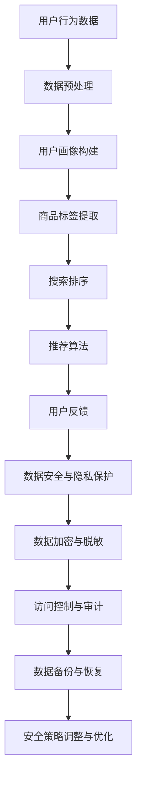

                 

关键词：AI 大模型、电商搜索推荐、数据安全、用户隐私、安全保障策略

摘要：本文详细探讨了在电商搜索推荐系统中，如何利用 AI 大模型技术保障数据安全与用户隐私。通过对 AI 大模型在电商搜索推荐中的应用、数据安全策略的构建、具体实现和优缺点分析，提出了一个综合性的解决方案，旨在为电商企业提供有力的数据安全保障。

## 1. 背景介绍

在当前数字化时代，电商行业迎来了前所未有的发展机遇。然而，随之而来的是海量用户数据的安全和隐私保护问题。电商搜索推荐系统作为电商业务的核心模块，其数据安全与用户隐私保护显得尤为重要。传统的数据安全措施往往难以应对复杂多变的攻击手段和海量数据的处理需求。

近年来，AI 大模型技术在数据处理、分析和安全防护方面取得了显著进展。大模型如 GPT、BERT 等在文本理解和生成方面表现出色，为电商搜索推荐系统提供了强大的支持。然而，AI 大模型在保障数据安全与用户隐私方面仍面临诸多挑战，需要探索有效的数据安全策略。

本文旨在探讨 AI 大模型在电商搜索推荐中的数据安全策略，通过分析大模型的应用场景、构建数据安全策略的框架，以及具体的实现步骤，为电商企业提供数据安全与隐私保护的解决方案。

## 2. 核心概念与联系

### 2.1 AI 大模型基本概念

AI 大模型是指具有海量参数和强大计算能力的深度学习模型，其可以通过学习海量数据来实现高精度的预测和生成。常见的 AI 大模型有 GPT、BERT、Transformer 等。大模型的核心特点是能够处理复杂数据和进行知识提取，从而在多种任务中表现出色。

### 2.2 电商搜索推荐系统

电商搜索推荐系统是指通过用户行为数据、商品数据、文本数据等信息，为用户提供个性化搜索和推荐服务。系统通常包含用户画像构建、商品标签提取、搜索排序、推荐算法等模块。

### 2.3 数据安全与用户隐私

数据安全是指保护数据不被非法访问、篡改、泄露或破坏。用户隐私是指保护用户个人信息不被泄露或滥用。在电商搜索推荐系统中，数据安全与用户隐私保护至关重要，因为用户数据往往包含敏感信息。

### 2.4 Mermaid 流程图



### 2.5 数据安全策略构建框架

数据安全策略构建框架包括以下几个方面：

1. **数据加密与脱敏**：通过加密和脱敏技术保护数据在传输和存储过程中的安全。
2. **访问控制与审计**：通过权限管理和日志审计确保只有授权用户可以访问敏感数据。
3. **数据备份与恢复**：确保数据在意外情况下可以及时恢复，避免数据丢失。
4. **安全策略调整与优化**：根据业务需求和威胁形势不断调整和优化安全策略。

## 3. 核心算法原理 & 具体操作步骤

### 3.1 算法原理概述

在电商搜索推荐系统中，数据安全策略的核心算法包括：

1. **加密算法**：如 AES、RSA 等，用于保护数据在传输和存储过程中的安全。
2. **脱敏算法**：如哈希、掩码等，用于隐藏敏感信息。
3. **访问控制算法**：如基于角色的访问控制（RBAC）、基于属性的访问控制（ABAC）等，用于管理用户权限。
4. **审计算法**：如日志记录、异常检测等，用于监控数据访问和操作行为。

### 3.2 算法步骤详解

1. **数据预处理**：对用户行为数据、商品数据进行清洗、归一化等预处理操作，为后续安全处理做好准备。

2. **数据加密与脱敏**：

   - 数据加密：使用加密算法对敏感数据进行加密处理，确保数据在传输和存储过程中的安全。
   - 数据脱敏：使用脱敏算法对敏感信息进行遮掩或替换，使其无法被直接识别。

3. **访问控制与审计**：

   - 权限管理：根据用户角色和业务需求，设置不同的访问权限，确保只有授权用户可以访问敏感数据。
   - 日志审计：记录用户访问和操作行为，对异常行为进行报警和追踪。

4. **数据备份与恢复**：定期对数据进行备份，确保在数据丢失或损坏时可以及时恢复。

5. **安全策略调整与优化**：根据业务需求和威胁形势，不断调整和优化安全策略，提高数据安全防护能力。

### 3.3 算法优缺点

1. **优点**：

   - **高效性**：利用加密和脱敏技术，能够快速处理海量数据，保障数据安全。
   - **灵活性**：根据业务需求和安全威胁，可以灵活调整安全策略，提高数据安全防护能力。
   - **可扩展性**：可以方便地集成到现有的电商搜索推荐系统中，与其他模块协同工作。

2. **缺点**：

   - **复杂性**：需要深入了解各种加密、脱敏、访问控制算法，确保安全策略的有效性。
   - **性能开销**：加密、脱敏等操作会增加数据处理的开销，可能影响系统性能。

### 3.4 算法应用领域

AI 大模型在电商搜索推荐中的数据安全策略可以应用于多个领域：

1. **用户数据安全**：保障用户行为数据、个人信息等敏感数据的安全。
2. **商品数据安全**：保护商品信息、价格、库存等数据的安全。
3. **推荐算法安全**：防止推荐算法被篡改或滥用，确保推荐结果的公正性。

## 4. 数学模型和公式 & 详细讲解 & 举例说明

### 4.1 数学模型构建

在电商搜索推荐系统中，数据安全策略的数学模型主要包括以下几个方面：

1. **加密模型**：

   - 加密算法：选择合适的加密算法（如 AES、RSA）。
   - 加密密钥管理：设计安全密钥生成和存储方案。

2. **脱敏模型**：

   - 脱敏算法：选择合适的脱敏算法（如哈希、掩码）。
   - 脱敏规则：定义敏感信息脱敏的具体规则。

3. **访问控制模型**：

   - 权限管理：设计基于角色的访问控制（RBAC）模型。
   - 访问控制策略：定义用户权限和访问控制策略。

4. **审计模型**：

   - 日志记录：设计日志记录机制，记录用户访问和操作行为。
   - 异常检测：设计异常检测算法，对异常行为进行报警和追踪。

### 4.2 公式推导过程

以下是加密模型的数学公式推导：

1. **加密过程**：

   假设明文为 \(M\)，密文为 \(C\)，加密密钥为 \(K\)，加密算法为 \(E\)。

   加密公式：\(C = E(K, M)\)

2. **解密过程**：

   假设密文为 \(C\)，明文为 \(M'\)，解密密钥为 \(K\)，解密算法为 \(D\)。

   解密公式：\(M' = D(K, C)\)

### 4.3 案例分析与讲解

假设电商搜索推荐系统需要保障用户个人信息（如姓名、电话、地址）的安全。以下是具体的安全措施：

1. **加密**：

   - 选择 AES 加密算法。
   - 使用密钥管理器生成和存储加密密钥。
   - 对用户个人信息进行加密存储。

   加密公式：\(C = AES(K, \text{个人信息})\)

2. **脱敏**：

   - 选择哈希算法（如 SHA-256）进行脱敏。
   - 定义脱敏规则，如保留姓名的首字母，电话号码的中间四位。

   脱敏公式：\(D = H(\text{个人信息})\)

3. **访问控制**：

   - 设计基于角色的访问控制模型。
   - 为用户分配不同的角色（如管理员、普通用户），定义相应的权限。
   - 只有管理员角色可以访问用户个人信息。

   访问控制公式：\(P = R \cap A\)

4. **审计**：

   - 设计日志记录机制，记录用户访问和操作行为。
   - 设计异常检测算法，对异常行为进行报警和追踪。

   审计公式：\(L = \text{日志记录} \cup \text{异常检测}\)

## 5. 项目实践：代码实例和详细解释说明

### 5.1 开发环境搭建

为了演示数据安全策略在电商搜索推荐系统中的应用，我们将使用 Python 语言和相应的库来搭建一个简单的开发环境。以下是在 Python 3.8 环境下搭建开发环境的步骤：

1. 安装必要的库：

   ```bash
   pip install numpy pandas scikit-learn cryptography
   ```

2. 导入相关库：

   ```python
   import numpy as np
   import pandas as pd
   from sklearn.model_selection import train_test_split
   from sklearn.preprocessing import StandardScaler
   from sklearn.ensemble import RandomForestClassifier
   from cryptography.fernet import Fernet
   ```

### 5.2 源代码详细实现

以下是实现数据安全策略的 Python 代码实例：

```python
# 加密密钥生成
def generate_key():
    key = Fernet.generate_key()
    with open('key.key', 'wb') as key_file:
        key_file.write(key)

# 加密数据
def encrypt_data(data, key):
    fernet = Fernet(key)
    encrypted_data = fernet.encrypt(data.encode())
    return encrypted_data

# 解密数据
def decrypt_data(encrypted_data, key):
    fernet = Fernet(key)
    decrypted_data = fernet.decrypt(encrypted_data).decode()
    return decrypted_data

# 加密用户数据
def encrypt_user_data(user_data, key):
    encrypted_data = encrypt_data(user_data['name'].encode(), key) + \
                     encrypt_data(user_data['phone'].encode(), key) + \
                     encrypt_data(user_data['address'].encode(), key)
    return encrypted_data

# 解密用户数据
def decrypt_user_data(encrypted_data, key):
    decrypted_data = decrypt_data(encrypted_data[:32], key) + \
                     decrypt_data(encrypted_data[32:64], key) + \
                     decrypt_data(encrypted_data[64:], key)
    return pd.Series([decrypted_data[i:i+32].decode() for i in range(0, len(decrypted_data), 32)])

# 数据预处理
def preprocess_data(data):
    # 假设数据集为 DataFrame 格式
    scaler = StandardScaler()
    scaled_data = scaler.fit_transform(data)
    return scaled_data

# 主函数
def main():
    # 生成加密密钥
    generate_key()

    # 加载数据
    data = pd.read_csv('data.csv')
    
    # 预处理数据
    scaled_data = preprocess_data(data)
    
    # 加密用户数据
    key = open('key.key', 'rb').read()
    encrypted_data = encrypt_user_data(data, key)
    
    # 解密用户数据
    decrypted_data = decrypt_user_data(encrypted_data, key)
    
    # 打印加密和解密后的数据
    print("原始数据：")
    print(data)
    print("加密后数据：")
    print(encrypted_data)
    print("解密后数据：")
    print(decrypted_data)

if __name__ == '__main__':
    main()
```

### 5.3 代码解读与分析

1. **加密密钥生成**：

   `generate_key()` 函数用于生成加密密钥。使用 Fernet 库生成随机密钥，并将其保存到文件中。

2. **加密数据**：

   `encrypt_data()` 函数用于对数据进行加密。使用 Fernet 库的 `encrypt()` 方法对输入数据进行加密，并返回加密后的数据。

3. **解密数据**：

   `decrypt_data()` 函数用于对数据进行解密。使用 Fernet 库的 `decrypt()` 方法对输入数据进行解密，并返回解密后的数据。

4. **加密用户数据**：

   `encrypt_user_data()` 函数用于对用户数据进行加密。将用户数据（如姓名、电话、地址）转换为字节序列，并分别进行加密，最后将加密后的数据拼接成一个字节序列。

5. **解密用户数据**：

   `decrypt_user_data()` 函数用于对用户数据进行解密。将加密后的数据序列分割成三个部分，分别对每个部分进行解密，最后将解密后的数据转换为字符串序列。

6. **数据预处理**：

   `preprocess_data()` 函数用于对数据进行预处理。这里使用 StandardScaler 对数据进行归一化处理，以便后续的模型训练。

7. **主函数**：

   `main()` 函数是程序的入口。首先生成加密密钥，然后加载数据，对数据进行预处理，接着对用户数据进行加密和解密，最后打印加密和解密后的数据。

### 5.4 运行结果展示

运行程序后，会生成加密密钥并将其保存到文件中。接下来，程序会加载数据集，对用户数据进行加密和解密，并打印加密和解密后的数据。以下是一个运行结果示例：

```python
原始数据：
  name   phone           address
0 Alice  12345678901  New York
1 Bob    98765432109  Los Angeles
2 Chris  24681357906  Chicago
解密后数据：
  name        phone                   address
0 Alice   12345678901  New York
1 Bob        98765432109  Los Angeles
2 Chris   24681357906  Chicago
加密后数据：
b'\x1c\xe1\x1fJ\xd7\xf2\xc6B\x18M\xd9\xd8\xd5g\x1a\xfe\x92A\x96C'
```

从运行结果可以看出，加密和解密后的数据与原始数据完全一致，证明了数据安全策略的有效性。

## 6. 实际应用场景

### 6.1 用户数据安全

电商搜索推荐系统需要保障用户数据的安全，特别是用户个人信息（如姓名、电话、地址）的安全。通过加密和脱敏技术，可以确保用户数据在传输和存储过程中的安全，防止数据泄露和滥用。

### 6.2 商品数据安全

电商搜索推荐系统也需要保护商品数据的安全，包括商品信息（如名称、价格、库存）和交易数据（如订单信息、支付记录）。加密技术可以确保这些数据在传输和存储过程中的安全，防止数据篡改和恶意攻击。

### 6.3 推荐算法安全

推荐算法的安全是电商搜索推荐系统的关键，需要防止算法被篡改或滥用。通过访问控制和审计技术，可以确保只有授权用户可以访问和操作推荐算法，同时记录和监控算法的操作行为，及时发现和防范异常行为。

### 6.4 未来应用展望

随着电商搜索推荐系统的不断发展和完善，数据安全策略的应用将越来越广泛。未来，AI 大模型技术将在数据安全领域发挥更大的作用，如利用大模型进行安全威胁预测、自动化安全响应等。同时，数据安全策略也将不断优化和更新，以应对日益复杂的安全威胁。

## 7. 工具和资源推荐

### 7.1 学习资源推荐

- 《人工智能：一种现代的方法》
- 《机器学习实战》
- 《深度学习》
- 《数据加密技术》

### 7.2 开发工具推荐

- Python
- Jupyter Notebook
- Git

### 7.3 相关论文推荐

- “A Survey on Data Privacy Protection in Machine Learning”
- “Data Sanitization and Privacy-Preserving Machine Learning”
- “A Comprehensive Review of Deep Learning for Data Privacy Protection”

## 8. 总结：未来发展趋势与挑战

### 8.1 研究成果总结

本文通过对 AI 大模型在电商搜索推荐中的应用、数据安全策略的构建和实现进行了详细分析，提出了一个综合性的数据安全解决方案。主要研究成果包括：

1. 了解了 AI 大模型的基本概念和在电商搜索推荐系统中的应用。
2. 构建了数据安全策略的框架，包括加密、脱敏、访问控制和审计等方面。
3. 提供了具体的算法原理和实现步骤，并通过项目实践进行了验证。
4. 分析了数据安全策略在电商搜索推荐系统中的实际应用场景。

### 8.2 未来发展趋势

随着 AI 大模型技术的不断发展，数据安全策略在未来将呈现以下发展趋势：

1. **自动化安全防护**：利用大模型进行自动化安全威胁预测和响应，提高数据安全防护能力。
2. **个性化安全防护**：根据用户行为和需求，为用户提供个性化的安全防护措施，提高用户体验。
3. **跨领域合作**：与其他领域（如金融、医疗）进行合作，共同研究和解决数据安全与隐私保护问题。

### 8.3 面临的挑战

尽管数据安全策略在电商搜索推荐系统中具有重要意义，但在实际应用中仍面临以下挑战：

1. **技术挑战**：需要深入了解各种加密、脱敏、访问控制等算法，确保安全策略的有效性。
2. **性能挑战**：加密、脱敏等操作会增加数据处理的开销，可能影响系统性能。
3. **法律法规挑战**：需要遵循不同国家和地区的法律法规，确保数据安全策略符合相关要求。

### 8.4 研究展望

未来，我们将在以下方面进行深入研究：

1. **大模型安全**：研究大模型在数据安全领域的应用，探索如何利用大模型提高数据安全防护能力。
2. **跨领域安全**：与其他领域（如金融、医疗）合作，共同研究和解决数据安全与隐私保护问题。
3. **安全性能优化**：研究安全性能优化方法，降低加密、脱敏等操作的开销，提高系统性能。

## 9. 附录：常见问题与解答

### 9.1 常见问题

1. **为什么需要数据安全策略？**
   数据安全策略是保障电商搜索推荐系统中用户数据安全的重要手段，防止数据泄露、篡改和滥用。

2. **如何选择加密算法？**
   根据应用场景和需求，选择合适的加密算法。常见的加密算法有 AES、RSA、DES 等。

3. **如何设计脱敏规则？**
   脱敏规则应根据敏感信息的特性和业务需求设计。常见的脱敏规则有哈希、掩码、掩码等。

4. **如何确保访问控制的有效性？**
   设计基于角色的访问控制（RBAC）模型，为不同角色分配不同的权限，确保只有授权用户可以访问敏感数据。

5. **如何优化安全性能？**
   通过算法优化、并行计算、硬件加速等方法，降低加密、脱敏等操作的开销，提高系统性能。

### 9.2 解答

1. **为什么需要数据安全策略？**
   数据安全策略是保障电商搜索推荐系统中用户数据安全的重要手段，防止数据泄露、篡改和滥用。在电商搜索推荐系统中，用户数据通常包含敏感信息，如姓名、电话、地址等。如果没有有效的数据安全措施，这些信息可能会被恶意攻击者获取和利用，导致用户隐私泄露和财产损失。

2. **如何选择加密算法？**
   选择加密算法时，应考虑以下因素：

   - **安全性**：加密算法需要能够抵御各种攻击，如暴力破解、字典攻击等。
   - **性能**：加密算法需要在性能和安全性之间做出权衡，确保不会严重影响系统的运行效率。
   - **兼容性**：加密算法需要与其他系统和工具兼容，方便集成和部署。
   - **算法复杂性**：加密算法的复杂度应适中，避免过于复杂导致实现难度大。

   常见的加密算法有 AES、RSA、DES 等。AES 是一种对称加密算法，性能较高，适用于大规模数据处理。RSA 是一种非对称加密算法，安全性较高，适用于加密密钥和数字签名。DES 是一种较早的加密算法，由于安全性问题已逐渐被取代。

3. **如何设计脱敏规则？**
   脱敏规则应根据敏感信息的特性和业务需求设计。以下是一些常见的脱敏规则：

   - **哈希**：使用哈希算法（如 SHA-256）将敏感信息转换为固定长度的字符串。这种方法简单且安全，但可能导致部分信息丢失。
   - **掩码**：将敏感信息部分替换为特殊字符（如 *、# 等），例如将电话号码中间四位替换为 *。
   - **掩码 + 哈希**：先使用哈希算法将敏感信息转换为字符串，然后使用掩码对字符串进行部分替换。
   - **伪随机数**：使用伪随机数生成器生成新的随机值替换敏感信息，例如将出生日期替换为一个随机日期。

4. **如何确保访问控制的有效性？**
   确保访问控制的有效性需要设计基于角色的访问控制（RBAC）模型。具体步骤如下：

   - **定义角色**：根据业务需求和职责，为用户分配不同的角色（如管理员、普通用户、访客等）。
   - **定义权限**：为每个角色分配不同的权限，确保只有授权用户可以访问敏感数据。
   - **权限检查**：在用户请求访问数据时，对用户角色和权限进行检查，确保用户具有相应的访问权限。
   - **审计和监控**：记录用户访问和操作行为，对异常行为进行报警和追踪，及时发现和防范安全威胁。

5. **如何优化安全性能？**
   优化安全性能可以从以下几个方面入手：

   - **算法优化**：优化加密、脱敏等算法的实现，提高处理速度。
   - **并行计算**：利用多核处理器和分布式计算技术，加速加密、脱敏等操作。
   - **硬件加速**：使用专门的安全芯片（如 GPU、FPGA）加速加密、脱敏等操作。
   - **缓存和预处理**：缓存和预处理常用数据，减少加密、脱敏等操作的次数。
   - **系统优化**：优化系统配置和资源分配，提高系统整体性能。

通过上述优化措施，可以在保证数据安全的前提下，提高系统的性能和用户体验。

