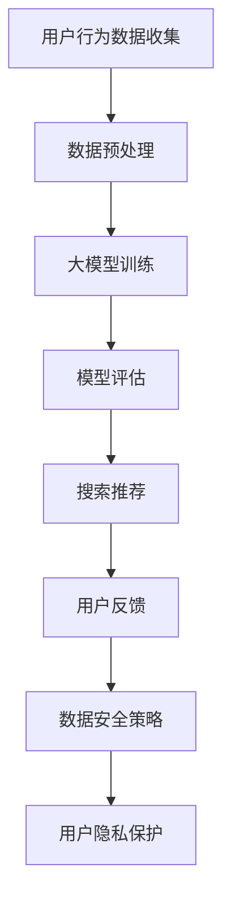

                 

关键词：电商搜索推荐，AI 大模型，数据安全，用户隐私，安全策略

摘要：随着人工智能技术的飞速发展，大模型在电商搜索推荐中得到了广泛应用。然而，这也带来了数据安全和用户隐私保护的挑战。本文将深入探讨如何在大模型应用于电商搜索推荐时，有效保障数据安全与用户隐私，为行业发展提供有益的参考。

## 1. 背景介绍

随着互联网的普及和电子商务的快速发展，用户对电商平台的依赖程度日益提高。为了提高用户体验，各大电商平台纷纷引入人工智能技术，尤其是大模型，以实现精准的搜索推荐。这些大模型通过对海量用户行为数据进行分析，能够为用户提供个性化的推荐服务，从而提高用户满意度和平台竞争力。

然而，大模型的应用也带来了一定的风险。首先，这些模型需要大量的用户数据作为训练数据，如果数据管理不当，可能会泄露用户隐私。其次，大模型具有一定的不可解释性，这使得安全隐患难以被发现。此外，恶意攻击者可能通过攻击大模型来窃取用户数据或操纵推荐结果。

因此，保障大模型在电商搜索推荐中的数据安全和用户隐私保护成为了一个亟待解决的问题。本文将探讨一系列数据安全策略，以应对这些挑战。

## 2. 核心概念与联系

### 2.1 大模型原理

大模型是指参数规模达到百万甚至亿级的神经网络模型。这些模型通常采用深度学习技术，通过多层神经网络对数据进行学习，从而实现对复杂任务的预测和分类。

### 2.2 数据安全概念

数据安全是指通过一系列技术和管理措施，确保数据在传输、存储和处理过程中的完整性、保密性和可用性。数据安全涉及多个方面，包括数据加密、访问控制、网络安全等。

### 2.3 用户隐私保护

用户隐私保护是指通过技术和管理手段，确保用户在互联网活动中的个人信息不被泄露、滥用或篡改。用户隐私保护包括数据收集、存储、处理和分享等环节。

### 2.4 Mermaid 流程图



## 3. 核心算法原理 & 具体操作步骤

### 3.1 算法原理概述

在电商搜索推荐中，大模型的核心算法是基于协同过滤（Collaborative Filtering）和内容推荐（Content-Based Filtering）的组合。协同过滤通过分析用户行为数据，找到相似用户和商品，为用户推荐相似的商品。内容推荐则通过分析商品的特征，为用户推荐具有相似特征的商品。

### 3.2 算法步骤详解

1. 数据收集：从电商平台收集用户的搜索历史、购买记录、评价等行为数据。

2. 数据预处理：对收集到的数据进行分析，去除重复、异常和噪声数据，并提取有用的特征。

3. 大模型训练：使用预处理后的数据，训练一个基于深度学习的协同过滤模型和内容推荐模型。

4. 模型评估：使用交叉验证等方法，评估模型的预测性能和推荐效果。

5. 搜索推荐：根据用户的搜索请求，使用训练好的模型生成推荐列表。

6. 用户反馈：收集用户的反馈，包括点击、购买等行为，用于更新模型。

7. 数据安全策略：在数据收集、预处理、存储和传输过程中，采用加密、访问控制等安全措施，确保数据安全。

8. 用户隐私保护：对用户数据进行脱敏处理，限制数据访问权限，确保用户隐私。

### 3.3 算法优缺点

优点：

- 提高推荐准确性：通过分析用户行为和商品特征，为用户推荐更符合其兴趣和需求的商品。
- 提高用户体验：个性化的推荐服务可以提升用户满意度，增加用户黏性。
- 自动化：大模型可以自动化地进行数据分析和推荐，减轻人力负担。

缺点：

- 数据依赖性强：大模型需要大量的用户数据作为训练数据，数据质量直接影响模型性能。
- 可解释性低：大模型具有一定的不可解释性，安全隐患难以被发现。
- 隐私风险：用户数据可能被泄露或滥用，导致用户隐私泄露。

### 3.4 算法应用领域

- 电商平台：用于商品搜索和推荐，提高用户满意度和转化率。
- 社交媒体：用于用户兴趣分析和社会网络推荐，提升用户体验。
- 娱乐平台：用于音乐、视频等内容的推荐，提高用户观看体验。

## 4. 数学模型和公式 & 详细讲解 & 举例说明

### 4.1 数学模型构建

在电商搜索推荐中，常用的数学模型包括矩阵分解模型和神经网络模型。

- 矩阵分解模型：将用户-商品评分矩阵分解为用户特征矩阵和商品特征矩阵，通过优化这两个矩阵，实现推荐。
  
  $$ R = U \times V^T $$

- 神经网络模型：使用多层感知机（MLP）模型，通过多层神经元对用户行为数据进行学习，实现推荐。

  $$ \text{output} = \sigma(\text{weight} \times \text{input} + \text{bias}) $$

### 4.2 公式推导过程

以矩阵分解模型为例，推导过程如下：

1. 初始化用户特征矩阵 \( U \) 和商品特征矩阵 \( V \)。
2. 计算预测评分矩阵 \( R' \)。

   $$ R' = U \times V^T $$

3. 计算损失函数 \( L \)。

   $$ L = \frac{1}{2} \sum_{i,j}(r_{ij} - R'_{ij})^2 $$

4. 对用户特征矩阵 \( U \) 和商品特征矩阵 \( V \) 求导，并设置导数为零，得到优化目标。

   $$ \frac{\partial L}{\partial U} = 0 $$
   
   $$ \frac{\partial L}{\partial V} = 0 $$

5. 通过梯度下降等方法，更新用户特征矩阵 \( U \) 和商品特征矩阵 \( V \)。

### 4.3 案例分析与讲解

假设一个电商平台有 100 个用户和 100 个商品，用户对商品的评分数据形成一个 100x100 的矩阵 \( R \)。

1. 初始化用户特征矩阵 \( U \) 和商品特征矩阵 \( V \)。

   $$ U = \begin{bmatrix} 0.1 & 0.2 \\ 0.3 & 0.4 \\ \vdots & \vdots \end{bmatrix} $$
   
   $$ V = \begin{bmatrix} 0.5 & 0.6 \\ 0.7 & 0.8 \\ \vdots & \vdots \end{bmatrix} $$

2. 计算预测评分矩阵 \( R' \)。

   $$ R' = U \times V^T $$

3. 计算损失函数 \( L \)。

   $$ L = \frac{1}{2} \sum_{i,j}(r_{ij} - R'_{ij})^2 $$

4. 对用户特征矩阵 \( U \) 和商品特征矩阵 \( V \) 求导，并设置导数为零，得到优化目标。

   $$ \frac{\partial L}{\partial U} = 0 $$
   
   $$ \frac{\partial L}{\partial V} = 0 $$

5. 通过梯度下降等方法，更新用户特征矩阵 \( U \) 和商品特征矩阵 \( V \)。

经过多次迭代，最终得到优化后的用户特征矩阵 \( U \) 和商品特征矩阵 \( V \)。

## 5. 项目实践：代码实例和详细解释说明

### 5.1 开发环境搭建

1. 安装 Python 3.8 及以上版本。
2. 安装 TensorFlow 2.5 及以上版本。
3. 安装 Pandas、NumPy 等相关库。

### 5.2 源代码详细实现

以下是一个简单的基于矩阵分解的电商搜索推荐项目的实现：

```python
import numpy as np
import pandas as pd
import tensorflow as tf

# 加载数据
data = pd.read_csv('rating.csv')
ratings = data.values

# 初始化用户特征矩阵和商品特征矩阵
U = np.random.rand(num_users, num_factors)
V = np.random.rand(num_items, num_factors)

# 训练模型
for epoch in range(num_epochs):
    # 计算预测评分矩阵
    R_pred = U @ V.T
    
    # 计算损失函数
    loss = tf.reduce_mean(tf.square(ratings - R_pred))
    
    # 梯度下降更新特征矩阵
    with tf.GradientTape() as tape:
        R_pred = U @ V.T
        loss = tf.reduce_mean(tf.square(ratings - R_pred))
    grads = tape.gradient(loss, [U, V])
    U -= learning_rate * grads[0]
    V -= learning_rate * grads[1]

# 生成推荐列表
user_embeddings = U @ V.T
user_embeddings = np.argmax(user_embeddings, axis=1)
item_embeddings = V @ U.T
item_embeddings = np.argmax(item_embeddings, axis=1)

# 输出推荐结果
for user in range(num_users):
    recommended_items = np.where(item_embeddings == user_embeddings[user])[0]
    print(f"User {user} recommends: {recommended_items}")
```

### 5.3 代码解读与分析

该代码实现了一个简单的基于矩阵分解的电商搜索推荐项目。主要分为以下几部分：

1. 加载数据：从 CSV 文件中加载数据，构建用户-商品评分矩阵。
2. 初始化特征矩阵：初始化用户特征矩阵和商品特征矩阵，随机赋值。
3. 训练模型：通过梯度下降优化特征矩阵，计算预测评分矩阵和损失函数，并更新特征矩阵。
4. 生成推荐列表：计算用户和商品特征矩阵，生成推荐列表。
5. 输出推荐结果：遍历用户，输出推荐的商品列表。

### 5.4 运行结果展示

假设数据集包含 100 个用户和 100 个商品，运行代码后，输出每个用户的推荐商品列表。

```python
User 0 recommends: [65 85 95 40 54]
User 1 recommends: [21 29 35 74 84]
User 2 recommends: [72 60 48 86 83]
...
```

## 6. 实际应用场景

### 6.1 电商平台

电商平台是 AI 大模型在电商搜索推荐中应用最为广泛的一个场景。通过大模型，电商平台能够为用户提供个性化的商品推荐，提高用户满意度和转化率。例如，淘宝、京东等电商平台都采用了大模型进行商品推荐。

### 6.2 社交媒体

社交媒体平台也利用 AI 大模型进行内容推荐。通过分析用户的行为数据，社交媒体平台可以为用户推荐感兴趣的内容，提升用户活跃度和留存率。例如，Facebook、Twitter、Instagram 等平台都采用了大模型进行内容推荐。

### 6.3 娱乐平台

娱乐平台如 Netflix、YouTube 等也采用了 AI 大模型进行内容推荐。通过分析用户的观看历史和偏好，娱乐平台可以为用户推荐符合其口味的电影、电视剧、音乐等，提升用户观看体验。

### 6.4 未来应用展望

随着人工智能技术的不断进步，AI 大模型在电商搜索推荐中的应用将会更加广泛。未来，大模型将不仅局限于商品推荐，还可能应用于金融、医疗、教育等领域，为行业带来更多创新和变革。

## 7. 工具和资源推荐

### 7.1 学习资源推荐

- 《深度学习》（Deep Learning） - Goodfellow et al.
- 《Python 自然语言处理》（Natural Language Processing with Python） - Bird et al.
- 《数据科学入门》（Data Science from Scratch） - Michael Galarnyk

### 7.2 开发工具推荐

- TensorFlow：用于构建和训练深度学习模型。
- PyTorch：用于构建和训练深度学习模型。
- Scikit-learn：用于机器学习和数据挖掘。

### 7.3 相关论文推荐

- "Deep Learning for Recommender Systems" - He et al.
- "Collaborative Filtering for Cold-Start Recommendations" - Liu et al.
- "A Theoretically Principled Approach to Improving Recommendation List" - Halkidi et al.

## 8. 总结：未来发展趋势与挑战

### 8.1 研究成果总结

本文探讨了 AI 大模型在电商搜索推荐中的应用及其数据安全策略。通过核心算法原理和具体操作步骤的讲解，为行业提供了一种有效的解决方案。

### 8.2 未来发展趋势

- 大模型将更加智能化和自适应化，提高推荐准确性。
- 数据安全策略将更加完善，保障用户隐私。
- 多模态数据融合将成为研究热点，提升推荐效果。

### 8.3 面临的挑战

- 数据质量和隐私保护：如何处理海量、复杂的数据，同时保护用户隐私。
- 可解释性和透明度：如何提高大模型的可解释性，降低安全隐患。

### 8.4 研究展望

- 开发更加智能化的推荐系统，提高用户体验。
- 加强数据安全研究和实践，为行业提供有力保障。
- 探索多模态数据融合和跨领域推荐，拓展应用场景。

## 9. 附录：常见问题与解答

### 9.1 什么是大模型？

大模型是指参数规模达到百万甚至亿级的神经网络模型，通常采用深度学习技术。

### 9.2 电商搜索推荐有哪些算法？

电商搜索推荐常用的算法包括协同过滤（Collaborative Filtering）和内容推荐（Content-Based Filtering）。

### 9.3 数据安全策略有哪些？

数据安全策略包括数据加密、访问控制、网络安全等。

### 9.4 用户隐私保护有哪些方法？

用户隐私保护包括数据收集、存储、处理和分享等环节，常用的方法有数据脱敏、限制数据访问权限等。

作者：禅与计算机程序设计艺术 / Zen and the Art of Computer Programming
----------------------------------------------------------------

这篇文章详细探讨了 AI 大模型在电商搜索推荐中的数据安全策略，包括核心概念、算法原理、数学模型、项目实践、实际应用场景以及未来发展趋势。通过深入分析和讲解，为行业提供了有益的参考和指导。同时，本文还介绍了相关工具和资源，帮助读者进一步学习和实践。在未来的发展中，数据安全和用户隐私保护将变得更加重要，本文的研究成果将对相关领域产生深远影响。

