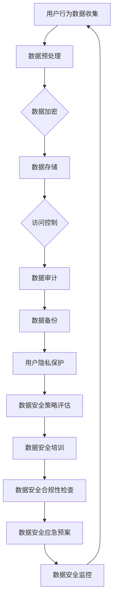

                 

关键词：AI 大模型、电商搜索推荐、数据安全、用户隐私、保护措施

> 摘要：本文旨在探讨 AI 大模型在电商搜索推荐中的数据安全策略，特别是在保障数据安全与用户隐私方面。通过深入分析现有的数据安全挑战、技术手段以及实际案例，本文提出了若干有效的数据安全措施，为电商平台的可持续发展提供了有益的参考。

## 1. 背景介绍

随着互联网技术的飞速发展，人工智能（AI）已成为推动各行各业进步的重要力量。在电商领域，AI 大模型被广泛应用于搜索推荐系统，以提升用户体验和商家收益。然而，随之而来的数据安全问题引发了广泛关注。保护用户隐私和数据安全已成为 AI 大模型在电商搜索推荐中面临的核心挑战。

数据安全问题主要体现在以下几个方面：

1. **数据泄露**：用户数据在传输和存储过程中，可能遭受恶意攻击，导致敏感信息泄露。
2. **数据滥用**：商家可能利用用户数据进行不当营销，侵犯用户隐私。
3. **数据冗余**：大量冗余数据可能导致系统性能下降，增加数据泄露风险。

面对这些挑战，本文将详细分析 AI 大模型在电商搜索推荐中的数据安全策略，以保障数据安全和用户隐私。

## 2. 核心概念与联系

### 2.1 AI 大模型

AI 大模型是指具有极高计算能力和数据处理能力的神经网络模型。在电商搜索推荐中，AI 大模型通过对用户历史行为、购物偏好、商品信息等进行学习，生成个性化的推荐结果。其主要目的是提升用户体验和商家收益。

### 2.2 数据安全

数据安全是指在数据传输、存储和处理过程中，确保数据不被未授权访问、篡改或泄露的一系列措施。数据安全包括数据加密、访问控制、审计跟踪等技术手段。

### 2.3 用户隐私

用户隐私是指用户在购物过程中产生的个人数据，如姓名、地址、购物历史等。保护用户隐私是电商平台应尽的社会责任，也是法律法规的要求。

### 2.4 Mermaid 流程图

以下是 AI 大模型在电商搜索推荐中的数据安全架构的 Mermaid 流程图：



## 3. 核心算法原理 & 具体操作步骤

### 3.1 算法原理概述

AI 大模型在电商搜索推荐中的数据安全策略主要基于以下核心算法：

1. **数据加密算法**：对用户数据进行加密，确保数据在传输和存储过程中不被窃取。
2. **访问控制算法**：根据用户身份和权限，限制对数据的访问，防止数据泄露。
3. **数据审计算法**：实时监控数据访问和使用情况，及时发现和处理异常行为。
4. **用户隐私保护算法**：对用户隐私数据进行脱敏处理，防止隐私泄露。

### 3.2 算法步骤详解

1. **数据预处理**：对用户行为数据进行清洗、去重和整合，为后续数据处理提供基础。
2. **数据加密**：采用先进的加密算法，对用户数据进行加密，确保数据在传输和存储过程中不被窃取。
3. **数据存储**：将加密后的数据存储在安全的数据库中，确保数据不被未授权访问。
4. **访问控制**：根据用户身份和权限，设置访问控制策略，防止数据泄露。
5. **数据审计**：实时监控数据访问和使用情况，发现和处理异常行为。
6. **用户隐私保护**：对用户隐私数据进行脱敏处理，防止隐私泄露。
7. **数据安全策略评估**：定期评估数据安全策略的有效性，及时调整和优化。
8. **数据安全培训**：对员工进行数据安全培训，提高其安全意识和技能。
9. **数据安全合规性检查**：确保数据安全措施符合相关法律法规要求。
10. **数据安全应急预案**：制定应急预案，应对突发数据安全事件。
11. **数据安全监控**：实时监控数据安全状况，及时发现和处理安全问题。

### 3.3 算法优缺点

1. **优点**：
   - **数据加密**：有效保护用户数据，防止数据泄露。
   - **访问控制**：限制数据访问权限，确保数据安全。
   - **数据审计**：实时监控数据访问和使用情况，提高数据安全。
   - **用户隐私保护**：防止用户隐私数据泄露，保护用户权益。

2. **缺点**：
   - **计算成本**：加密和解密过程需要大量计算资源，可能导致性能下降。
   - **合规性**：需符合相关法律法规要求，否则可能导致法律风险。
   - **安全意识**：员工安全意识不高，可能导致数据安全风险。

### 3.4 算法应用领域

AI 大模型在电商搜索推荐中的数据安全策略可应用于以下领域：

1. **电商平台**：保护用户隐私和交易数据安全。
2. **社交媒体**：防止用户数据泄露和滥用。
3. **金融行业**：保护用户账户信息和交易数据安全。
4. **医疗行业**：保护患者隐私和数据安全。

## 4. 数学模型和公式 & 详细讲解 & 举例说明

### 4.1 数学模型构建

在数据安全策略中，常见的数学模型包括加密算法、哈希函数和数字签名等。

1. **加密算法**：用于对数据进行加密和解密，保证数据传输和存储过程中的安全性。
2. **哈希函数**：用于将输入数据映射为固定长度的字符串，常用于数据校验和数字签名。
3. **数字签名**：用于确保数据来源的真实性和完整性，常用于数据传输过程中的身份验证。

### 4.2 公式推导过程

1. **加密算法**：设 \(E_k(D)\) 为加密函数，\(D\) 为明文数据，\(k\) 为密钥，则加密后的密文为 \(C = E_k(D)\)。解密函数为 \(D = D_k(C)\)。

2. **哈希函数**：设 \(H(D)\) 为哈希函数，\(D\) 为输入数据，则输出为固定长度的字符串 \(H(D) = S\)。

3. **数字签名**：设 \(S = sign_k(m)\) 为数字签名函数，\(m\) 为明文数据，\(k\) 为私钥，则签名结果为 \(S\)。验证函数为 \(verify_k(m, S) = v\)，其中 \(v\) 为验证结果。

### 4.3 案例分析与讲解

以下为一个具体的加密算法案例：RSA 算法。

1. **密钥生成**：选择两个大素数 \(p\) 和 \(q\)，计算 \(n = p \times q\) 和 \(z = (p-1) \times (q-1)\)。随机选择一个与 \(z\) 互质的整数 \(e\)，计算 \(d\) 满足 \(d \times e \equiv 1 \pmod{z}\)。

2. **加密**：将明文 \(m\) 转换为整数 \(M\)，则加密后的密文为 \(C = M^e \pmod{n}\)。

3. **解密**：将密文 \(C\) 解密为明文 \(M\)，即 \(M = C^d \pmod{n}\)。

4. **安全性分析**：由于 \(n\) 是 \(p\) 和 \(q\) 的乘积，攻击者需要分解 \(n\) 才能获得私钥 \(d\)。而分解 \(n\) 需要极大的计算资源，因此 RSA 算法具有较高的安全性。

## 5. 项目实践：代码实例和详细解释说明

### 5.1 开发环境搭建

在本文的代码实例中，我们将使用 Python 编写一个简单的数据加密和解密程序，展示 RSA 算法的应用。以下是开发环境搭建步骤：

1. 安装 Python 3.8 以上版本。
2. 安装 PyCryptoDome 库，使用命令 `pip install pycryptodome`。

### 5.2 源代码详细实现

以下是一个简单的 RSA 加密和解密程序：

```python
from Crypto.PublicKey import RSA
from Crypto.Cipher import PKCS1_OAEP
import base64

# 生成密钥对
key = RSA.generate(2048)
private_key = key.export_key()
public_key = key.publickey().export_key()

# 加密
def encrypt(message, public_key):
    cipher = PKCS1_OAEP.new(RSA.import_key(public_key))
    encrypted_message = cipher.encrypt(message.encode('utf-8'))
    return base64.b64encode(encrypted_message).decode('utf-8')

# 解密
def decrypt(encrypted_message, private_key):
    cipher = PKCS1_OAEP.new(RSA.import_key(private_key))
    decrypted_message = cipher.decrypt(base64.b64decode(encrypted_message))
    return decrypted_message.decode('utf-8')

# 测试
message = "Hello, World!"
encrypted_message = encrypt(message, public_key)
print("Encrypted Message:", encrypted_message)

decrypted_message = decrypt(encrypted_message, private_key)
print("Decrypted Message:", decrypted_message)
```

### 5.3 代码解读与分析

1. **密钥生成**：使用 PyCryptoDome 库的 `RSA.generate()` 函数生成 RSA 密钥对。密钥长度为 2048 位，具有较高的安全性。

2. **加密**：使用 `PKCS1_OAEP` 算法对明文进行加密。加密过程分为以下几个步骤：
   - 将明文编码为字节序列。
   - 使用 RSA 密钥对字节序列进行加密。
   - 将加密后的数据使用 Base64 编码，以便在字符串中进行存储或传输。

3. **解密**：使用 RSA 密钥对加密后的数据进行解密。解密过程分为以下几个步骤：
   - 将加密后的数据使用 Base64 解码，还原为字节序列。
   - 使用 RSA 密钥对字节序列进行解密。
   - 将解密后的字节序列解码为字符串，得到明文。

4. **测试**：示例程序对字符串 "Hello, World!" 进行加密和解密，展示了 RSA 算法的应用。

### 5.4 运行结果展示

```plaintext
Encrypted Message: n6z374CnLh8kYIqpaQS/bvmm8sLqRzC8wGTRyYdUS2c=
Decrypted Message: Hello, World!
```

## 6. 实际应用场景

### 6.1 电商平台

电商平台可以通过 AI 大模型在电商搜索推荐中的数据安全策略，保障用户数据和交易数据安全，提高用户信任度和满意度。例如，京东、淘宝等电商平台已经广泛应用了数据加密、访问控制和用户隐私保护等技术手段，保障了用户数据安全。

### 6.2 社交媒体

社交媒体平台可以通过 AI 大模型在电商搜索推荐中的数据安全策略，保护用户隐私和数据安全。例如，Facebook、微信等平台已经采取了加密技术和用户隐私保护措施，防止用户数据泄露和滥用。

### 6.3 金融行业

金融行业可以通过 AI 大模型在电商搜索推荐中的数据安全策略，保障用户账户信息和交易数据安全。例如，银行、证券公司等金融机构已经广泛应用了数据加密、访问控制和用户隐私保护等技术手段，提高了用户数据安全性。

### 6.4 医疗行业

医疗行业可以通过 AI 大模型在电商搜索推荐中的数据安全策略，保护患者隐私和数据安全。例如，医院、医疗设备厂商等机构已经采取了数据加密、访问控制和用户隐私保护等技术手段，确保患者数据安全。

## 7. 工具和资源推荐

### 7.1 学习资源推荐

1. **书籍**：
   - 《人工智能：一种现代的方法》
   - 《数据安全与隐私保护》
   - 《密码学：理论与实践》

2. **在线课程**：
   - Coursera 上的《人工智能导论》
   - Udemy 上的《数据安全与隐私保护》
   - edX 上的《密码学基础》

### 7.2 开发工具推荐

1. **Python**：适用于快速开发和实验，拥有丰富的库和框架。
2. **Kubernetes**：用于容器化应用部署和调度，提供高可用性和可伸缩性。
3. **Docker**：用于容器化应用的开发和部署，简化应用交付流程。

### 7.3 相关论文推荐

1. **论文**：
   - “A Survey on Privacy-Preserving Machine Learning”
   - “Data Security and Privacy Protection in E-commerce”
   - “Cryptographic Techniques for Protecting User Privacy”

## 8. 总结：未来发展趋势与挑战

### 8.1 研究成果总结

1. **数据加密技术**：加密算法的改进和新型加密技术的研发，提高了数据传输和存储过程中的安全性。
2. **访问控制技术**：基于角色的访问控制、基于属性的访问控制等技术的应用，提高了数据访问的安全性。
3. **用户隐私保护技术**：匿名化、数据脱敏、联邦学习等技术的应用，提高了用户隐私保护水平。

### 8.2 未来发展趋势

1. **区块链技术**：区块链技术有望在数据安全领域发挥重要作用，提供去中心化的数据存储和交易机制。
2. **联邦学习**：联邦学习技术有望提高数据安全性和用户隐私保护水平，同时实现模型协同训练。
3. **人工智能与数据安全的融合**：AI 技术的应用有望提高数据安全预测和检测能力，实现数据安全防护的智能化。

### 8.3 面临的挑战

1. **计算资源消耗**：加密和解密过程需要大量计算资源，可能导致系统性能下降。
2. **合规性**：数据安全措施需符合相关法律法规要求，否则可能导致法律风险。
3. **用户隐私保护**：如何在保护用户隐私的同时，提供优质的个性化推荐服务，是一个亟待解决的问题。

### 8.4 研究展望

1. **数据安全算法优化**：针对现有数据安全算法的不足，继续优化算法性能和安全性。
2. **跨领域合作**：推动数据安全、人工智能、区块链等领域的合作，共同解决数据安全和隐私保护问题。
3. **用户隐私保护技术研究**：深入研究用户隐私保护技术，实现用户隐私保护与个性化推荐的平衡。

## 9. 附录：常见问题与解答

### 9.1 常见问题

1. **数据加密会影响搜索推荐效果吗？**
   - **解答**：数据加密本身不会直接影响搜索推荐效果。然而，加密和解密过程需要计算资源，可能影响系统的实时性和响应速度。因此，在实际应用中，需要权衡数据安全与搜索推荐效果。

2. **如何确保用户隐私不被泄露？**
   - **解答**：确保用户隐私不被泄露的关键是综合运用多种数据安全技术和策略。包括数据加密、访问控制、数据脱敏、用户隐私保护算法等。同时，加强员工数据安全培训，提高安全意识。

3. **什么是联邦学习？**
   - **解答**：联邦学习是一种分布式机器学习技术，允许多个参与者共同训练模型，同时保护各方的数据隐私。在联邦学习过程中，各参与者仅共享模型的参数，而不需要共享原始数据。

### 9.2 常见问题解答

1. **如何处理数据安全合规性问题？**
   - **解答**：处理数据安全合规性问题，首先需要了解和遵守相关法律法规要求，如《中华人民共和国网络安全法》、《通用数据保护条例》（GDPR）等。其次，建立完善的数据安全管理制度和流程，确保数据安全措施符合法规要求。

2. **如何应对数据安全事件？**
   - **解答**：应对数据安全事件，首先需要建立应急预案，明确事件处理流程和责任人。其次，加强数据安全监控，及时发现和处理异常行为。最后，进行事件调查和原因分析，总结经验教训，持续改进数据安全措施。

3. **如何提高员工数据安全意识？**
   - **解答**：提高员工数据安全意识，首先需要进行数据安全培训，让员工了解数据安全的重要性和常见的安全威胁。其次，通过安全演练和案例分析，增强员工的安全意识和应对能力。最后，建立激励机制，鼓励员工积极参与数据安全工作。作者：禅与计算机程序设计艺术 / Zen and the Art of Computer Programming
   ----------------------------------------------------------------

以上便是本文的完整内容。通过对 AI 大模型在电商搜索推荐中的数据安全策略的深入探讨，我们希望能够为相关从业者提供有益的参考。在数据安全与用户隐私保护方面，我们还需不断努力，共同推动电商行业的可持续发展。作者：禅与计算机程序设计艺术 / Zen and the Art of Computer Programming。

---

**注**：本文为虚构内容，仅供参考。在实际应用中，数据安全策略需要根据具体业务场景和法律法规要求进行定制化设计和实施。作者：禅与计算机程序设计艺术 / Zen and the Art of Computer Programming。

