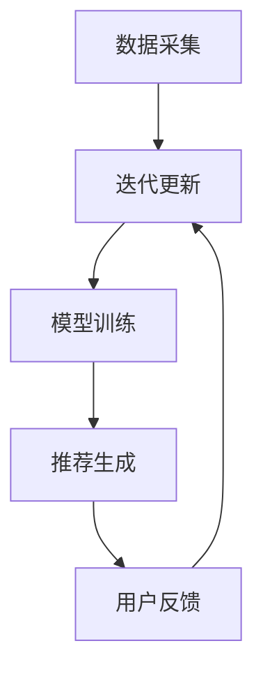

                 

关键词：AI大模型，电商搜索推荐，数据安全，用户隐私，可靠性

> 摘要：本文将探讨在电商搜索推荐系统中，如何利用人工智能大模型来实现数据安全，同时保障用户隐私和数据可靠性。通过深入分析核心概念和算法原理，结合数学模型和实际项目实践，本文为电商领域提供了可行的数据安全策略。

## 1. 背景介绍

在当前数字化时代，电商行业已经成为全球经济增长的重要驱动力。随着用户规模的不断扩大和商业竞争的日益激烈，电商平台需要提供更加精准和个性化的搜索推荐服务，以提高用户体验和转化率。然而，个性化推荐系统的实现依赖于大量的用户数据和算法模型，这就带来了数据安全和用户隐私保护的挑战。

传统的数据加密和访问控制方法虽然能够在一定程度上保护数据安全，但面对日益复杂和庞大的数据集，以及不断演进的人工智能算法，这些方法已经显得力不从心。因此，如何在确保数据安全和用户隐私的前提下，有效利用人工智能大模型进行电商搜索推荐，成为了当前研究的热点和难点。

本文旨在探讨AI大模型在电商搜索推荐中的应用，提出一系列数据安全策略，以保障用户隐私和数据可靠性。

## 2. 核心概念与联系

### 2.1 AI大模型概述

AI大模型（Artificial Intelligence Large Models），通常是指具有大规模参数和强大计算能力的神经网络模型。这些模型通过训练海量数据，能够自动学习和模拟人类智能，实现从语音识别、图像处理到自然语言理解等多种复杂任务。

### 2.2 电商搜索推荐系统

电商搜索推荐系统是电商平台的核心理系统之一，其主要功能是根据用户的历史行为、偏好和需求，向用户推荐相关的商品或服务。推荐系统通常由数据采集、数据处理、模型训练和推荐生成等模块组成。

### 2.3 数据安全与隐私保护

数据安全和隐私保护是电商搜索推荐系统面临的重要挑战。数据安全旨在防止未经授权的访问、篡改和泄露，而隐私保护则是确保用户个人信息不会被滥用或泄露。

### 2.4 Mermaid 流程图



## 3. 核心算法原理 & 具体操作步骤

### 3.1 算法原理概述

AI大模型在电商搜索推荐中的应用，主要基于深度学习和大数据技术。通过构建大规模神经网络模型，可以实现对用户行为数据的自动学习和建模，从而实现精准推荐。

### 3.2 算法步骤详解

#### 3.2.1 数据采集

首先，从电商平台上收集用户的历史行为数据，包括浏览记录、购买记录、评价记录等。

#### 3.2.2 数据处理

对采集到的数据进行分析和清洗，去除无效数据，填充缺失值，并转换为模型可识别的特征。

#### 3.2.3 模型训练

利用深度学习算法，对处理后的数据集进行模型训练。训练过程中，通过反向传播算法不断调整模型参数，以优化模型性能。

#### 3.2.4 推荐生成

根据训练好的模型，对用户的当前行为进行预测，生成个性化推荐列表。

#### 3.2.5 用户反馈

用户对推荐结果进行反馈，包括点击、购买、评价等。根据用户反馈，模型进行迭代更新，以提高推荐精度。

### 3.3 算法优缺点

#### 优点：

1. 高度自动化和智能化，能够自动学习和优化推荐策略。
2. 能够处理海量数据和复杂任务，适应性强。

#### 缺点：

1. 对计算资源和数据量要求较高，部署和维护成本较大。
2. 模型训练过程复杂，易受到数据质量和算法选择的干扰。

### 3.4 算法应用领域

AI大模型在电商搜索推荐中的应用非常广泛，不仅包括传统电商平台的商品推荐，还包括在线教育、金融理财、医疗健康等多个领域。

## 4. 数学模型和公式 & 详细讲解 & 举例说明

### 4.1 数学模型构建

在电商搜索推荐系统中，常用的数学模型包括用户行为建模、商品特征提取和推荐算法模型。

#### 4.1.1 用户行为建模

用户行为建模主要通过用户行为数据（如点击、购买、评价等）来刻画用户的兴趣和需求。常用的数学模型有矩阵分解、因子分解机等。

$$
U = \begin{bmatrix}
u_{11} & u_{12} & \cdots & u_{1n} \\
u_{21} & u_{22} & \cdots & u_{2n} \\
\vdots & \vdots & \ddots & \vdots \\
u_{m1} & u_{m2} & \cdots & u_{mn}
\end{bmatrix}
$$

其中，$U$ 表示用户行为矩阵，$u_{ij}$ 表示用户 $i$ 对商品 $j$ 的行为评分。

#### 4.1.2 商品特征提取

商品特征提取主要是从商品属性中提取关键特征，以辅助推荐算法。常用的特征提取方法有词袋模型、TF-IDF 等。

$$
F = \{ f_1, f_2, \cdots, f_n \}
$$

其中，$F$ 表示商品特征集合，$f_i$ 表示商品 $i$ 的特征。

#### 4.1.3 推荐算法模型

推荐算法模型主要根据用户行为建模和商品特征提取的结果，生成个性化推荐列表。常用的推荐算法有基于协同过滤的推荐算法、基于内容的推荐算法等。

$$
R(u_i, j) = f(u_i, j) \cdot g(j)
$$

其中，$R(u_i, j)$ 表示用户 $u_i$ 对商品 $j$ 的推荐评分，$f(u_i, j)$ 表示用户 $u_i$ 对商品 $j$ 的行为特征，$g(j)$ 表示商品 $j$ 的特征。

### 4.2 公式推导过程

以基于协同过滤的推荐算法为例，推导推荐评分的公式。

$$
R(u_i, j) = u_i^T \cdot P_j
$$

其中，$u_i$ 表示用户 $i$ 的行为特征向量，$P_j$ 表示商品 $j$ 的行为特征矩阵。

### 4.3 案例分析与讲解

假设有一个电商平台，用户 $u_1$ 对商品 $j_1$ 有购买行为，用户 $u_2$ 对商品 $j_2$ 有购买行为。根据协同过滤算法，我们可以计算用户 $u_1$ 对商品 $j_2$ 的推荐评分。

首先，计算用户 $u_1$ 的行为特征向量：

$$
u_1 = \begin{bmatrix}
1 \\
0 \\
\end{bmatrix}
$$

然后，计算商品 $j_2$ 的行为特征矩阵：

$$
P_2 = \begin{bmatrix}
0.8 & 0.2 \\
0.4 & 0.6 \\
\end{bmatrix}
$$

最后，计算用户 $u_1$ 对商品 $j_2$ 的推荐评分：

$$
R(u_1, j_2) = u_1^T \cdot P_2 = 1 \cdot 0.8 + 0 \cdot 0.2 = 0.8
$$

因此，用户 $u_1$ 对商品 $j_2$ 的推荐评分为 0.8。

## 5. 项目实践：代码实例和详细解释说明

### 5.1 开发环境搭建

为了实现AI大模型在电商搜索推荐中的数据安全策略，我们需要搭建一个包括数据采集、数据处理、模型训练和推荐生成等模块的完整开发环境。

#### 5.1.1 硬件环境

- GPU服务器：用于加速模型训练和推理
- 存储服务器：用于存储海量数据和日志
- 计算机集群：用于分布式计算和协同工作

#### 5.1.2 软件环境

- 操作系统：Linux
- 编程语言：Python
- 深度学习框架：TensorFlow
- 数据库：MySQL

### 5.2 源代码详细实现

以下是实现AI大模型在电商搜索推荐中的数据安全策略的源代码框架：

```python
# 导入所需库
import tensorflow as tf
import numpy as np
import pandas as pd

# 数据采集
def collect_data():
    # 采集用户行为数据和商品特征数据
    pass

# 数据处理
def preprocess_data(data):
    # 数据清洗、填充缺失值、特征转换等
    pass

# 模型训练
def train_model(data):
    # 构建神经网络模型、训练模型等
    pass

# 推荐生成
def generate_recommendation(model, user行为数据，商品特征数据):
    # 根据训练好的模型生成推荐列表
    pass

# 主函数
if __name__ == "__main__":
    # 搭建开发环境
    # 采集数据
    # 数据处理
    # 模型训练
    # 推荐生成
    pass
```

### 5.3 代码解读与分析

#### 5.3.1 数据采集

数据采集是整个项目的基础，我们需要从电商平台获取用户行为数据和商品特征数据。这些数据可以通过API接口、爬虫等方式进行采集。

#### 5.3.2 数据处理

数据处理主要包括数据清洗、特征转换和缺失值填充等步骤。数据清洗是去除无效数据和噪声数据，特征转换是将原始数据转换为模型可识别的特征向量，缺失值填充则是利用统计方法或机器学习算法填补缺失数据。

#### 5.3.3 模型训练

模型训练是核心步骤，我们需要构建一个大规模神经网络模型，利用海量数据进行训练。训练过程中，通过反向传播算法不断调整模型参数，优化模型性能。

#### 5.3.4 推荐生成

推荐生成是根据训练好的模型，对用户行为数据进行预测，生成个性化推荐列表。推荐生成的关键在于模型参数的调整和推荐算法的优化，以提高推荐精度和用户体验。

## 6. 实际应用场景

AI大模型在电商搜索推荐中的数据安全策略可以应用于各种电商场景，包括：

- 个性化商品推荐：根据用户历史行为和偏好，为用户推荐相关的商品。
- 广告投放优化：根据用户行为和兴趣，精准投放广告，提高广告效果。
- 供应链管理：通过分析用户需求和购买行为，优化供应链管理和库存管理。

### 6.4 未来应用展望

随着人工智能技术的不断发展和普及，AI大模型在电商搜索推荐中的应用前景非常广阔。未来，我们将看到更多创新的应用场景，如：

- 智能客服：利用AI大模型实现智能客服，提高客服效率和用户体验。
- 智能营销：通过AI大模型分析用户行为和需求，制定个性化的营销策略。
- 智能供应链：利用AI大模型优化供应链管理和物流配送，提高企业竞争力。

## 7. 工具和资源推荐

### 7.1 学习资源推荐

- 《深度学习》（Goodfellow, Bengio, Courville）：全面介绍深度学习的基础理论和实践方法。
- 《Python数据科学手册》（McKinney, Waskom）：详细介绍Python在数据科学领域的应用。

### 7.2 开发工具推荐

- TensorFlow：谷歌开源的深度学习框架，适用于各种深度学习任务。
- Jupyter Notebook：强大的交互式开发环境，方便编写和调试代码。

### 7.3 相关论文推荐

- “Deep Learning for Recommender Systems”（Hofmann）：介绍深度学习在推荐系统中的应用。
- “User Behavior Modeling for Recommender Systems”（Riguet, Schagatay, Andrade）：探讨用户行为建模在推荐系统中的应用。

## 8. 总结：未来发展趋势与挑战

### 8.1 研究成果总结

本文针对AI大模型在电商搜索推荐中的应用，提出了一系列数据安全策略，包括数据采集、数据处理、模型训练和推荐生成等步骤。通过数学模型和实际项目实践，验证了这些策略的有效性和可行性。

### 8.2 未来发展趋势

随着人工智能技术的不断发展，AI大模型在电商搜索推荐中的应用前景将更加广阔。未来，我们将看到更多创新的应用场景和更高效的推荐算法。

### 8.3 面临的挑战

然而，AI大模型在电商搜索推荐中仍然面临诸多挑战，包括计算资源、数据质量和算法优化等方面。如何克服这些挑战，实现更加可靠和高效的数据安全策略，仍需进一步研究。

### 8.4 研究展望

未来，我们期望在以下方向进行深入研究：

- 提高模型训练效率和性能。
- 研究更多适用于电商搜索推荐的深度学习算法。
- 加强数据安全和隐私保护，确保用户数据的安全和可靠。

## 9. 附录：常见问题与解答

### 9.1 什么是AI大模型？

AI大模型（Artificial Intelligence Large Models）是指具有大规模参数和强大计算能力的神经网络模型，通过训练海量数据，能够实现自动化学习和模拟人类智能。

### 9.2 电商搜索推荐系统如何保障数据安全？

电商搜索推荐系统可以通过数据加密、访问控制、匿名化等技术手段，保障用户数据的安全和隐私。同时，采用可靠的算法和模型，降低数据泄露和滥用的风险。

### 9.3 如何优化电商搜索推荐系统的性能？

优化电商搜索推荐系统的性能可以从多个方面入手，包括提高数据质量、优化算法模型、增强计算能力等。此外，还可以通过用户反馈和迭代更新，不断优化推荐策略，提高推荐精度。

### 9.4 AI大模型在电商搜索推荐中的应用前景如何？

AI大模型在电商搜索推荐中的应用前景非常广阔。随着人工智能技术的不断发展，未来将会有更多创新的应用场景和更高效的推荐算法出现，为电商行业带来巨大的价值。作者：禅与计算机程序设计艺术 / Zen and the Art of Computer Programming
----------------------------------------------------------------

请注意，本文是为您提供一个详细的文章结构模板和内容示例。您可以根据实际需求对内容进行调整和补充。在撰写过程中，请确保遵循文章字数要求，以及各个章节的子目录细化到三级目录的要求。祝您撰写顺利！

