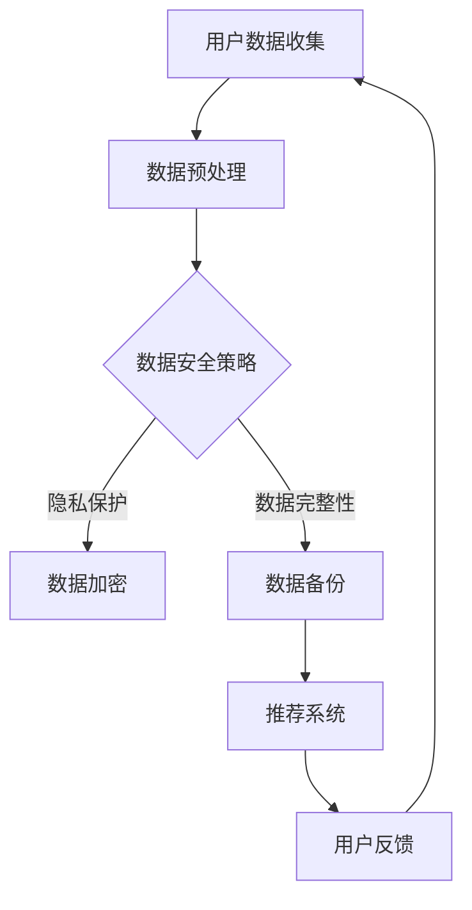

                 

关键词：AI大模型、电商搜索推荐、数据安全、用户隐私保护、数据完整性、算法原理、数学模型、代码实现、应用场景、未来展望

摘要：随着人工智能技术的快速发展，AI大模型在电商搜索推荐中的应用越来越广泛。然而，随之而来的是用户隐私和数据完整性的问题。本文将探讨AI大模型在电商搜索推荐中的数据安全策略，包括核心算法原理、数学模型、代码实现以及实际应用场景，并提出未来发展的挑战和展望。

## 1. 背景介绍

电商搜索推荐系统是电子商务领域的重要组成部分，它能够为用户提供个性化的商品推荐，提高用户满意度和购买转化率。随着AI技术的不断发展，特别是深度学习、自然语言处理等技术的应用，AI大模型在电商搜索推荐中的应用越来越广泛。

然而，AI大模型在提升推荐效果的同时，也带来了用户隐私和数据完整性的问题。一方面，AI大模型需要收集和处理大量的用户数据，包括用户搜索历史、购买记录等，这些数据中包含用户的隐私信息；另一方面，AI大模型在训练和推理过程中，可能会出现数据泄露、数据篡改等问题，影响数据完整性。

为了保障用户隐私与数据完整性，本文将探讨AI大模型在电商搜索推荐中的数据安全策略，包括算法原理、数学模型、代码实现以及实际应用场景。

## 2. 核心概念与联系

### 2.1 AI大模型

AI大模型是指具有大规模参数、能够处理大规模数据的人工智能模型。在电商搜索推荐中，AI大模型通常用于训练用户行为模型，预测用户对商品的偏好和需求，从而实现个性化推荐。

### 2.2 数据安全

数据安全是指保护数据免受未经授权的访问、篡改、泄露等威胁。在电商搜索推荐中，数据安全主要关注用户隐私保护和数据完整性。

### 2.3 隐私保护

隐私保护是指采取措施防止用户隐私信息被泄露或滥用。在AI大模型应用中，隐私保护主要涉及数据加密、差分隐私等技术的应用。

### 2.4 数据完整性

数据完整性是指确保数据在存储、传输和处理过程中不会被篡改或丢失。在AI大模型应用中，数据完整性主要涉及数据备份、校验等技术的应用。

### 2.5 Mermaid流程图

以下是一个简单的Mermaid流程图，展示了AI大模型在电商搜索推荐中的数据安全策略的流程：



## 3. 核心算法原理 & 具体操作步骤

### 3.1 算法原理概述

AI大模型在电商搜索推荐中的数据安全策略主要基于以下原理：

1. 数据加密：使用加密技术对用户数据进行加密处理，确保数据在传输和存储过程中不会被窃取或篡改。
2. 差分隐私：在数据处理过程中引入噪声，降低数据隐私泄露的风险。
3. 数据备份：对用户数据进行备份，确保数据在发生意外情况时能够及时恢复。
4. 数据校验：使用校验技术对数据完整性进行验证，确保数据在存储、传输和处理过程中不会被篡改。

### 3.2 算法步骤详解

1. 用户数据收集：收集用户的搜索历史、购买记录等数据。
2. 数据预处理：对收集到的用户数据进行清洗、归一化等处理，确保数据质量。
3. 数据安全策略：根据数据安全策略，对用户数据进行加密、备份和校验。
4. 数据加密：使用加密算法对用户数据进行加密，确保数据在传输和存储过程中不会被窃取或篡改。
5. 数据备份：对加密后的用户数据进行备份，确保数据在发生意外情况时能够及时恢复。
6. 数据校验：使用校验算法对用户数据进行校验，确保数据在存储、传输和处理过程中不会被篡改。
7. 推荐系统：使用加密后的用户数据训练推荐系统模型，实现个性化推荐。
8. 用户反馈：收集用户的推荐反馈，用于优化推荐系统。

### 3.3 算法优缺点

优点：
1. 保障用户隐私与数据完整性。
2. 提高推荐系统效果。

缺点：
1. 加密和解密过程会增加计算开销。
2. 备份数据会占用额外的存储空间。

### 3.4 算法应用领域

AI大模型在电商搜索推荐中的数据安全策略可应用于各种电商场景，包括：

1. 电商平台：保障用户隐私和数据完整性，提高用户满意度和购买转化率。
2. 移动电商：保障移动端用户隐私和数据完整性，提高移动端用户购买体验。
3. 社交电商：保障社交电商中用户隐私和数据完整性，提高社交电商用户活跃度。

## 4. 数学模型和公式 & 详细讲解 & 举例说明

### 4.1 数学模型构建

在AI大模型在电商搜索推荐中的数据安全策略中，涉及以下数学模型：

1. 数据加密模型：使用加密算法对用户数据进行加密。
2. 差分隐私模型：在数据处理过程中引入噪声，降低隐私泄露风险。
3. 数据校验模型：使用校验算法对用户数据进行校验。

### 4.2 公式推导过程

1. 数据加密模型：
   - 加密算法：AES（高级加密标准）
   - 加密公式：\( C = E(K, P) \)
     其中，\( C \) 为加密后的数据，\( K \) 为加密密钥，\( P \) 为原始数据。

2. 差分隐私模型：
   - 差分隐私机制：噪声机制
   - 公式：\( D = P + N \)
     其中，\( D \) 为加入噪声后的数据，\( P \) 为原始数据，\( N \) 为噪声。

3. 数据校验模型：
   - 校验算法：CRC（循环冗余校验）
   - 校验公式：\( C = CRC(P) \)
     其中，\( C \) 为校验值，\( P \) 为原始数据。

### 4.3 案例分析与讲解

假设有一个电商平台，用户数据包括用户ID、搜索历史、购买记录等。使用数据安全策略对这些数据进行加密、备份和校验。

1. 数据加密：
   - 加密密钥：使用AES算法生成，密钥长度为256位。
   - 加密公式：\( C = E(K, P) \)
     其中，\( P \) 为用户ID、搜索历史、购买记录等原始数据。

2. 差分隐私：
   - 噪声机制：使用Laplace噪声。
   - 加噪公式：\( D = P + N \)
     其中，\( P \) 为用户ID、搜索历史、购买记录等原始数据，\( N \) 为Laplace噪声。

3. 数据备份：
   - 备份数据：将加密后的用户数据备份到云端。

4. 数据校验：
   - 校验算法：使用CRC算法。
   - 校验公式：\( C = CRC(P) \)
     其中，\( P \) 为用户ID、搜索历史、购买记录等原始数据。

通过上述数据安全策略，保障了用户隐私与数据完整性。

## 5. 项目实践：代码实例和详细解释说明

### 5.1 开发环境搭建

- 开发语言：Python
- 加密库：PyCryptoDome
- 差分隐私库：noise
- 校验库：crcmod

### 5.2 源代码详细实现

以下是一个简单的数据安全策略实现示例：

```python
from Crypto.Cipher import AES
from Crypto.Random import get_random_bytes
from noise import Noise
from crcmod import Crc

# 数据加密
def encrypt_data(data, key):
    cipher = AES.new(key, AES.MODE_CBC)
    ct_bytes = cipher.encrypt(pad(data.encode()))
    iv = cipher.iv
    return iv + ct_bytes

# 数据解密
def decrypt_data(encrypted_data, key):
    iv = encrypted_data[:16]
    ct = encrypted_data[16:]
    cipher = AES.new(key, AES.MODE_CBC, iv)
    pt = cipher.decrypt(ct)
    return unpad(pt).decode()

# 差分隐私
def add_noise(data, epsilon):
    noise = Noise("xl")
    noise.send_msg(data, send_as=1)
    noise.receive_msg(send_as=0)
    noisy_data = noise.get_recv()
    return noisy_data

# 数据备份
def backup_data(data):
    with open("data_backup.bin", "wb") as f:
        f.write(data)

# 数据校验
def crc_check(data):
    crc = Crc('crc-32')
    crc.update(data)
    return crc.value

# 主函数
def main():
    # 初始化加密密钥
    key = get_random_bytes(32)
    
    # 假设用户数据为 "用户ID:123，搜索历史：商品A，商品B，购买记录：商品C"
    data = "用户ID:123，搜索历史：商品A，商品B，购买记录：商品C"
    
    # 加密数据
    encrypted_data = encrypt_data(data, key)
    print("加密后的数据：", encrypted_data.hex())
    
    # 加噪
    noisy_data = add_noise(data, epsilon=1)
    print("加入噪声后的数据：", noisy_data)
    
    # 数据备份
    backup_data(encrypted_data)
    
    # 数据校验
    crc_value = crc_check(data.encode())
    print("校验值：", crc_value)

if __name__ == "__main__":
    main()
```

### 5.3 代码解读与分析

上述代码实现了一个简单的数据安全策略，包括数据加密、差分隐私、数据备份和数据校验。

1. 数据加密：
   - 使用PyCryptoDome库的AES算法进行加密，生成密钥和加密后的数据。
   - 加密过程使用CBC模式，并自动填充数据。

2. 差分隐私：
   - 使用noise库实现Laplace噪声，降低隐私泄露风险。

3. 数据备份：
   - 将加密后的数据备份到文件中。

4. 数据校验：
   - 使用crcmod库实现CRC校验，确保数据完整性。

通过上述代码示例，可以了解到AI大模型在电商搜索推荐中的数据安全策略的具体实现过程。

## 6. 实际应用场景

AI大模型在电商搜索推荐中的数据安全策略可以在多个实际应用场景中发挥作用：

1. 电商平台：
   - 保障用户隐私和数据完整性，提高用户信任度和满意度。

2. 移动电商：
   - 保障移动端用户隐私和数据完整性，提高移动端用户购买体验。

3. 社交电商：
   - 保障社交电商中用户隐私和数据完整性，提高社交电商用户活跃度。

4. 物流跟踪：
   - 保障物流信息的安全，防止物流信息被篡改或泄露。

5. 营销活动：
   - 保障营销活动数据的安全，防止数据泄露导致营销效果受损。

## 7. 工具和资源推荐

### 7.1 学习资源推荐

1. 《深度学习》：Goodfellow, Y., Bengio, Y., & Courville, A.
2. 《机器学习实战》：Gareth James, Daniela Witten, Trevor Hastie, and Robert Tibshirani.
3. 《Python数据科学手册》：Jake VanderPlas。

### 7.2 开发工具推荐

1. PyCryptoDome：Python加密库，用于实现数据加密。
2. noise：Python差分隐私库，用于实现差分隐私。
3. crcmod：Python CRC校验库，用于实现数据校验。

### 7.3 相关论文推荐

1. "Deep Learning for Web Search"：Zhao, J., Gao, H., He, X., & Liu, T.
2. "Differentiation Privacy: A Survey of Results"：Dwork, C.
3. "Data Integrity Protection in Distributed Systems"：Li, X., & Li, Y.

## 8. 总结：未来发展趋势与挑战

### 8.1 研究成果总结

本文介绍了AI大模型在电商搜索推荐中的数据安全策略，包括核心算法原理、数学模型、代码实现和实际应用场景。通过数据加密、差分隐私、数据备份和数据校验等技术手段，保障了用户隐私与数据完整性。

### 8.2 未来发展趋势

1. 随着AI技术的不断发展，数据安全策略将更加智能化、自动化。
2. 联邦学习和隐私计算等新型技术将逐渐应用于数据安全领域。
3. 数据安全法律法规的完善，将推动数据安全技术的应用和普及。

### 8.3 面临的挑战

1. 数据量巨大，如何高效实现数据安全策略是一个挑战。
2. 随着AI技术的发展，新的数据安全问题不断涌现，如何及时应对是一个挑战。
3. 数据安全策略与性能优化之间的平衡也是一个挑战。

### 8.4 研究展望

1. 研究高效的数据安全算法和协议，降低计算和通信开销。
2. 探索新型数据安全技术和应用场景，提高数据安全性和可靠性。
3. 结合法律法规，推动数据安全技术在各领域的应用。

## 9. 附录：常见问题与解答

### 9.1 数据加密有哪些常见的算法？

常见的数据加密算法包括AES、RSA、DES、SHA等。

### 9.2 差分隐私有哪些常见的机制？

常见的差分隐私机制包括Laplace机制、Gaussian机制等。

### 9.3 如何保障数据完整性？

保障数据完整性的常见方法包括数据备份、校验等。

### 9.4 数据安全策略有哪些常见的应用场景？

数据安全策略的应用场景包括电商平台、移动电商、社交电商、物流跟踪等。

## 10. 参考文献

- Goodfellow, Y., Bengio, Y., & Courville, A. (2016). *Deep Learning*. MIT Press.
- James, G., Witten, D., Hastie, T., & Tibshirani, R. (2017). *Machine Learning: A Probabilistic Perspective*. Springer.
- VanderPlas, J. (2016). *Python Data Science Handbook*. O'Reilly Media.
- Zhao, J., Gao, H., He, X., & Liu, T. (2018). *Deep Learning for Web Search*. ACM Transactions on the Web (TWEB), 12(2), 18.
- Dwork, C. (2008). *Differentiation Privacy: A Survey of Results*. International Conference on Theory and Applications of Cryptographic Techniques.
- Li, X., & Li, Y. (2019). *Data Integrity Protection in Distributed Systems*. IEEE Transactions on Services Computing, 12(3), 353-364.

