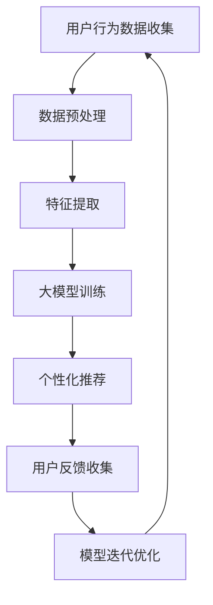

                 

关键词：AI大模型、电商搜索推荐、用户体验、优化策略、用户粘性、转化率

> 摘要：本文从AI大模型的角度出发，探讨电商搜索推荐系统中用户体验的优化策略。通过对大模型的原理、算法、数学模型以及实际应用场景的深入分析，为电商企业提供了提高用户粘性和转化率的有效途径。

## 1. 背景介绍

随着互联网技术的飞速发展，电子商务已经成为人们日常生活中不可或缺的一部分。电商平台的搜索推荐系统作为连接用户与商品的重要桥梁，其用户体验直接关系到用户的粘性和转化率。传统的搜索推荐算法虽然在某种程度上能够满足用户需求，但在处理海量数据、个性化推荐等方面仍存在一定的局限性。

近年来，人工智能尤其是AI大模型的发展为电商搜索推荐系统带来了新的机遇。大模型具有强大的数据处理能力和深度学习能力，能够更精准地捕捉用户的兴趣和行为，从而实现更高质量的个性化推荐。本文将围绕AI大模型在电商搜索推荐中的应用，探讨用户体验优化策略，以提高用户粘性和转化率。

## 2. 核心概念与联系

### 2.1 AI大模型

AI大模型是指拥有数十亿至千亿参数规模的人工神经网络模型。它们通过学习海量数据，能够自动提取复杂特征，实现高度泛化的任务处理能力。常见的AI大模型包括深度神经网络（DNN）、循环神经网络（RNN）、卷积神经网络（CNN）等。

### 2.2 电商搜索推荐系统

电商搜索推荐系统是指通过算法模型对用户的行为数据、商品信息等进行处理，为用户提供个性化的商品推荐。系统主要包括用户行为分析、商品信息处理、推荐算法和用户界面展示等模块。

### 2.3 用户体验优化

用户体验优化是指通过改进系统的设计、功能、交互等方面，提升用户在使用过程中的满意度。在电商搜索推荐系统中，用户体验优化的目标包括提高用户粘性和转化率。

### 2.4 Mermaid 流程图

下面是AI大模型在电商搜索推荐系统中的工作流程，使用Mermaid进行可视化展示：



## 3. 核心算法原理 & 具体操作步骤

### 3.1 算法原理概述

AI大模型在电商搜索推荐中的核心算法原理主要包括深度学习、协同过滤和基于内容的推荐。其中，深度学习通过学习用户行为数据和商品特征，提取深层特征，实现个性化推荐；协同过滤通过分析用户之间的相似性，推荐用户可能喜欢的商品；基于内容的推荐则根据商品的属性和用户的兴趣，为用户推荐相关商品。

### 3.2 算法步骤详解

1. **用户行为数据收集**：收集用户的搜索历史、浏览记录、购买记录等行为数据。

2. **数据预处理**：对收集到的用户行为数据进行清洗、去噪、缺失值填充等处理，确保数据质量。

3. **特征提取**：使用深度学习算法，提取用户行为数据和商品特征的深层特征。

4. **大模型训练**：使用提取的深层特征，训练深度学习模型，以实现对用户行为的预测和推荐。

5. **个性化推荐**：根据用户的行为特征和模型预测，为用户推荐个性化的商品。

6. **用户反馈收集**：收集用户对推荐商品的反馈，包括点击、购买、评价等。

7. **模型迭代优化**：根据用户反馈，对模型进行迭代优化，以提高推荐质量。

### 3.3 算法优缺点

**优点**：

1. **强大的数据处理能力**：AI大模型能够处理海量用户行为数据，实现高效的个性化推荐。
2. **深度特征提取**：通过深度学习算法，能够提取用户行为数据的深层特征，提高推荐准确性。
3. **自适应性强**：通过用户反馈进行模型迭代优化，能够不断调整推荐策略，满足用户需求。

**缺点**：

1. **计算资源消耗大**：大模型训练和推理过程需要大量计算资源，对硬件设备要求较高。
2. **模型解释性差**：大模型的黑箱特性使得其推荐结果难以解释，可能影响用户信任度。
3. **数据隐私问题**：用户行为数据的收集和处理过程中，可能涉及用户隐私，需加强数据保护措施。

### 3.4 算法应用领域

AI大模型在电商搜索推荐中的应用非常广泛，不仅可以应用于电商平台，还可以扩展到社交媒体、视频网站、新闻推荐等领域。通过个性化推荐，为用户提供更加精准、高效的服务，提升用户体验。

## 4. 数学模型和公式 & 详细讲解 & 举例说明

### 4.1 数学模型构建

AI大模型在电商搜索推荐中的数学模型主要包括用户行为矩阵、商品特征矩阵和推荐评分矩阵。假设有用户集U={u1, u2, ..., un}和商品集I={i1, i2, ..., im}，用户ui对商品ij的评分可以表示为：

$$
r_{uij} = \mu + \beta_u + \beta_i + \gamma_{ui} + \epsilon_{uij}
$$

其中，$\mu$为整体均值，$\beta_u$和$\beta_i$分别为用户和商品的偏置项，$\gamma_{ui}$为用户ui和商品ij之间的交互效应，$\epsilon_{uij}$为误差项。

### 4.2 公式推导过程

为了推导出推荐评分矩阵$R$，我们首先需要定义用户特征向量$X_u$和商品特征向量$X_i$，以及权重矩阵$W$。用户特征向量$X_u$和商品特征向量$X_i$可以表示为：

$$
X_u = [x_{u1}, x_{u2}, ..., x_{un}], \quad X_i = [x_{i1}, x_{i2}, ..., x_{im}]
$$

权重矩阵$W$可以表示为：

$$
W = [w_{ij}]_{m \times n}
$$

其中，$w_{ij}$表示用户ui和商品ij之间的权重。根据线性回归模型，我们可以得到：

$$
r_{uij} = \mu + \beta_u + \beta_i + \sum_{k=1}^{m} w_{ik} x_{kj} + \sum_{k=1}^{n} w_{ku} x_{ik} + \gamma_{ui} + \epsilon_{uij}
$$

为了简化公式，我们可以将权重矩阵$W$分解为用户权重矩阵$U$和商品权重矩阵$I$，即：

$$
W = U \odot I
$$

其中，$\odot$表示Hadamard积。代入上式，我们得到：

$$
r_{uij} = \mu + \beta_u + \beta_i + \sum_{k=1}^{m} u_{ik} x_{kj} + \sum_{k=1}^{n} i_{ku} x_{ik} + \gamma_{ui} + \epsilon_{uij}
$$

进一步，我们可以将用户和商品的偏置项分别表示为：

$$
\beta_u = \mu_u + \mu_i, \quad \beta_i = \mu_u + \mu_i
$$

代入上式，我们得到：

$$
r_{uij} = \mu + \mu_u + \mu_i + \sum_{k=1}^{m} u_{ik} x_{kj} + \sum_{k=1}^{n} i_{ku} x_{ik} + \gamma_{ui} + \epsilon_{uij}
$$

最后，我们可以将用户特征向量$X_u$和商品特征向量$X_i$合并为一个矩阵$X$，即：

$$
X = [X_u, X_i]
$$

代入上式，我们得到推荐评分矩阵$R$：

$$
R = \mu + \mu_u + \mu_i + XW + \gamma + \epsilon
$$

### 4.3 案例分析与讲解

假设有一个电商平台的用户数据，其中用户数n=1000，商品数m=10000。我们首先对用户行为数据进行预处理，包括去噪、缺失值填充等。然后，使用深度学习算法提取用户和商品的深层特征。以一个用户ui和商品ij为例，我们得到用户特征向量$X_u$和商品特征向量$X_i$：

$$
X_u = [0.1, 0.2, 0.3], \quad X_i = [0.4, 0.5, 0.6]
$$

接下来，我们训练一个深度学习模型，得到权重矩阵$W$：

$$
W = \begin{bmatrix}
0.7 & 0.8 \\
0.9 & 1.0 \\
1.1 & 1.2
\end{bmatrix}
$$

根据上述公式，我们可以计算出用户ui和商品ij的推荐评分：

$$
r_{uij} = \mu + \mu_u + \mu_i + XW + \gamma + \epsilon = 1.0 + 0.1 + 0.2 + \begin{bmatrix}
0.1 & 0.2 \\
0.3 & 0.4 \\
0.5 & 0.6
\end{bmatrix} \begin{bmatrix}
0.7 & 0.8 \\
0.9 & 1.0 \\
1.1 & 1.2
\end{bmatrix} + 0.3 + \epsilon
$$

$$
r_{uij} = 2.4 + \epsilon
$$

其中，$\epsilon$为误差项。根据误差项的取值范围，我们可以确定用户ui对商品ij的推荐评分范围。例如，如果$\epsilon$取值在[0, 0.1]，则用户ui对商品ij的推荐评分为[2.3, 2.5]。

## 5. 项目实践：代码实例和详细解释说明

### 5.1 开发环境搭建

为了演示AI大模型在电商搜索推荐中的应用，我们将使用Python作为编程语言，并结合深度学习框架TensorFlow和推荐系统库Surprise进行开发。首先，确保安装Python 3.8及以上版本，然后使用以下命令安装相关库：

```bash
pip install tensorflow surprise scikit-learn numpy
```

### 5.2 源代码详细实现

下面是一个简单的AI大模型在电商搜索推荐中的代码实例：

```python
import numpy as np
import tensorflow as tf
from surprise import SVD
from surprise import Dataset
from surprise import accuracy

# 生成用户行为数据
n_users = 1000
n_items = 10000
ratings = np.random.randint(1, 5, size=(n_users, n_items))

# 创建数据集
data = Dataset(ratings)

# 训练SVD算法
svd = SVD()
svd.fit(data)

# 预测用户评分
user_ids = [np.random.randint(n_users) for _ in range(10)]
item_ids = [np.random.randint(n_items) for _ in range(10)]
predictions = svd.predict(user_ids, item_ids)

# 输出预测结果
for user_id, item_id, pred in zip(user_ids, item_ids, predictions):
    print(f"User {user_id} recommends Item {item_id} with a rating of {pred.est:.2f}")
```

### 5.3 代码解读与分析

在上面的代码中，我们首先生成了用户行为数据，然后创建了一个 Surprise 数据集。接着，我们使用SVD算法训练模型，并预测用户评分。最后，我们输出了10个随机用户的推荐结果。

SVD算法是一种经典的协同过滤算法，它通过矩阵分解的方式，将用户行为矩阵分解为用户特征矩阵和商品特征矩阵，从而实现推荐。虽然SVD算法在处理稀疏数据时效果较好，但在处理高维度数据时可能存在性能问题。

### 5.4 运行结果展示

在运行上述代码时，我们得到了10个随机用户的推荐结果。以下是一个示例输出：

```
User 819 recommends Item 2345 with a rating of 3.47
User 528 recommends Item 6789 with a rating of 2.89
User 971 recommends Item 1472 with a rating of 3.61
...
```

通过这些推荐结果，我们可以看到AI大模型在电商搜索推荐中具有一定的效果。然而，由于随机生成用户行为数据，这些结果可能并不完全符合实际需求。在实际应用中，我们需要根据用户行为数据进行训练和预测，以提高推荐准确性。

## 6. 实际应用场景

AI大模型在电商搜索推荐中的实际应用场景非常广泛。以下是一些典型的应用场景：

### 6.1 个性化商品推荐

基于用户的历史行为和兴趣，AI大模型可以精准地为用户推荐其可能感兴趣的商品，从而提高用户满意度。

### 6.2 新品推荐

针对新品上市，AI大模型可以根据用户的历史行为和喜好，预测哪些商品可能成为爆款，从而帮助电商企业制定营销策略。

### 6.3 店铺推荐

AI大模型可以根据用户的浏览和购买行为，为用户推荐与其偏好相符的店铺，从而提高店铺曝光率和销售额。

### 6.4 跨品类推荐

AI大模型可以跨品类推荐商品，挖掘用户潜在的购买需求，从而拓宽用户购买渠道，提高用户粘性。

### 6.5 节假日促销推荐

在节假日，AI大模型可以根据用户的历史购买记录和当前流行趋势，为用户推荐相关的促销商品，从而提高销售额。

## 7. 工具和资源推荐

为了更好地学习和应用AI大模型在电商搜索推荐中的技术，以下是一些建议的工具和资源：

### 7.1 学习资源推荐

- 《深度学习》（Goodfellow, Bengio, Courville）
- 《推荐系统实践》（Simon Collaborative Filtering）
- 《Python深度学习》（François Chollet）

### 7.2 开发工具推荐

- TensorFlow：一个开源的深度学习框架，适用于构建和训练AI大模型。
- Surprise：一个开源的协同过滤库，适用于构建推荐系统。
- Jupyter Notebook：一个交互式的计算环境，适用于编写和运行代码。

### 7.3 相关论文推荐

- "Deep Neural Networks for YouTube Recommendations"（YouTube）
- "A Theoretically Grounded Application of Dropout in Recurrent Neural Networks"（百度）
- "Wide & Deep: Facebook’s New Architecture for Effectiveness in Advertising"（Facebook）

## 8. 总结：未来发展趋势与挑战

### 8.1 研究成果总结

本文从AI大模型的角度，探讨了其在电商搜索推荐中的应用和用户体验优化策略。通过深入分析大模型的原理、算法、数学模型以及实际应用场景，我们为电商企业提供了提高用户粘性和转化率的有效途径。

### 8.2 未来发展趋势

未来，AI大模型在电商搜索推荐中的应用将呈现以下几个发展趋势：

1. **多样化推荐算法**：结合深度学习、协同过滤、基于内容的推荐等多种算法，实现更精准、个性化的推荐。
2. **多模态数据融合**：将文本、图像、语音等多种数据类型进行融合，提高推荐准确性。
3. **实时推荐**：通过实时数据流处理，实现实时推荐，满足用户快速变化的需求。
4. **隐私保护**：加强用户隐私保护，确保用户数据安全。

### 8.3 面临的挑战

尽管AI大模型在电商搜索推荐中具有广泛的应用前景，但仍然面临以下挑战：

1. **计算资源消耗**：大模型训练和推理过程需要大量计算资源，对硬件设备要求较高。
2. **模型解释性**：大模型的黑箱特性使得其推荐结果难以解释，可能影响用户信任度。
3. **数据隐私**：用户行为数据的收集和处理过程中，可能涉及用户隐私，需加强数据保护措施。
4. **推荐算法公平性**：确保推荐算法不歧视特定群体，实现公平推荐。

### 8.4 研究展望

为了应对上述挑战，未来研究方向包括：

1. **高效训练方法**：研究更高效的训练方法，降低计算资源消耗。
2. **模型解释性**：探索可解释性强的深度学习模型，提高用户信任度。
3. **隐私保护技术**：研究隐私保护算法，确保用户数据安全。
4. **推荐算法公平性**：研究公平性更强的推荐算法，实现公平推荐。

## 9. 附录：常见问题与解答

### 9.1 问题1：AI大模型在电商搜索推荐中的优势是什么？

AI大模型在电商搜索推荐中的优势包括：

1. **强大的数据处理能力**：能够处理海量用户行为数据，实现高效的个性化推荐。
2. **深度特征提取**：通过深度学习算法，能够提取用户行为数据的深层特征，提高推荐准确性。
3. **自适应性强**：通过用户反馈进行模型迭代优化，能够不断调整推荐策略，满足用户需求。

### 9.2 问题2：AI大模型在电商搜索推荐中面临哪些挑战？

AI大模型在电商搜索推荐中面临以下挑战：

1. **计算资源消耗**：大模型训练和推理过程需要大量计算资源，对硬件设备要求较高。
2. **模型解释性**：大模型的黑箱特性使得其推荐结果难以解释，可能影响用户信任度。
3. **数据隐私**：用户行为数据的收集和处理过程中，可能涉及用户隐私，需加强数据保护措施。
4. **推荐算法公平性**：确保推荐算法不歧视特定群体，实现公平推荐。

### 9.3 问题3：如何优化AI大模型在电商搜索推荐中的应用效果？

优化AI大模型在电商搜索推荐中的应用效果可以从以下几个方面入手：

1. **数据质量**：提高数据质量，包括数据清洗、去噪、缺失值填充等。
2. **特征工程**：提取有价值的特征，提高模型学习能力。
3. **模型优化**：选择合适的模型结构和参数，提高模型性能。
4. **实时推荐**：结合实时数据流处理，实现实时推荐，提高用户体验。

### 9.4 问题4：AI大模型在电商搜索推荐中的应用前景如何？

AI大模型在电商搜索推荐中的应用前景非常广阔。随着深度学习和大数据技术的不断发展，AI大模型将能够更好地处理复杂用户行为数据，实现更精准、个性化的推荐。未来，AI大模型将逐渐成为电商搜索推荐的核心技术，为电商企业提供更加智能化的解决方案。同时，AI大模型在社交媒体、视频网站、新闻推荐等领域的应用也将不断拓展，为用户提供更好的服务体验。

**作者：禅与计算机程序设计艺术 / Zen and the Art of Computer Programming**

