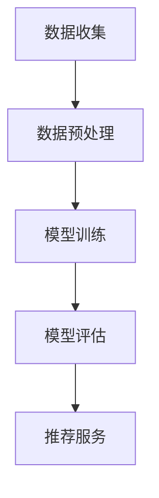

                 

关键词：AI 大模型，电商搜索推荐，用户体验，需求变化，优化策略，技术实践

> 摘要：随着电商行业的快速发展，个性化搜索推荐已成为提升用户体验、提高转化率的关键手段。本文旨在探讨 AI 大模型在电商搜索推荐中的应用，通过分析用户需求变化，提出一系列优化策略，以实现更精准、更高效的推荐服务。

## 1. 背景介绍

### 1.1 电商搜索推荐的重要性

电商搜索推荐是电商网站的核心功能之一，其直接影响到用户的购物体验和平台的业务成果。个性化推荐系统能够根据用户的购物历史、浏览行为、兴趣爱好等信息，为用户推荐与其需求高度匹配的商品，从而提高用户满意度、降低购物决策成本，提高转化率和销售额。

### 1.2 人工智能在电商搜索推荐中的应用

随着人工智能技术的快速发展，AI 大模型在电商搜索推荐中的应用越来越广泛。这些大模型，如深度学习神经网络、自然语言处理模型、协同过滤算法等，能够在海量数据中挖掘出用户的潜在需求和偏好，为用户提供更加个性化的推荐服务。

## 2. 核心概念与联系

### 2.1 AI 大模型原理

AI 大模型主要是指利用深度学习等先进算法训练的大型神经网络模型，能够处理海量的数据和复杂的特征。在电商搜索推荐中，AI 大模型通过学习用户的购物行为、历史数据和社交信息，预测用户的兴趣和偏好，从而实现精准推荐。

### 2.2 电商搜索推荐架构

电商搜索推荐系统通常包括数据收集、数据预处理、模型训练、模型评估和推荐服务五个主要环节。其中，数据收集是基础，数据预处理是关键，模型训练和评估是核心，推荐服务是最终输出。



### 2.3 用户需求变化与推荐系统优化

用户需求是动态变化的，如何及时捕捉并响应这些变化是推荐系统优化的重要任务。本文将围绕以下三个方面展开讨论：

- **用户需求变化的特征分析**：从用户行为数据中提取需求变化的关键特征。
- **需求变化与推荐效果的关系**：分析需求变化对推荐效果的影响，找出优化方向。
- **优化策略与实践**：提出并验证一系列优化策略，提高推荐系统的准确性和用户体验。

## 3. 核心算法原理 & 具体操作步骤

### 3.1 算法原理概述

本文采用基于深度学习的大模型进行电商搜索推荐。核心算法包括以下几个方面：

- **用户兴趣建模**：通过分析用户的浏览、购买和评价行为，构建用户兴趣模型。
- **商品特征提取**：提取商品的关键特征，如商品类别、价格、品牌等。
- **协同过滤算法**：结合基于内容的推荐和协同过滤算法，实现精准推荐。
- **模型优化**：通过持续训练和模型评估，优化推荐效果。

### 3.2 算法步骤详解

#### 3.2.1 用户兴趣建模

1. 收集用户行为数据，包括浏览记录、购买记录、评价记录等。
2. 对用户行为数据进行预处理，如数据清洗、归一化等。
3. 利用深度学习算法，如 LSTM、GRU 等，构建用户兴趣模型。

#### 3.2.2 商品特征提取

1. 收集商品数据，包括商品类别、价格、品牌、库存量等。
2. 对商品数据进行预处理，如数据清洗、编码等。
3. 利用词向量模型，如 Word2Vec、BERT 等，提取商品特征。

#### 3.2.3 协同过滤算法

1. 计算用户之间的相似度，采用余弦相似度、皮尔逊相关系数等算法。
2. 计算商品之间的相似度，采用基于内容的相似度计算方法。
3. 结合用户兴趣模型和商品特征，为用户推荐与其兴趣相符的商品。

#### 3.2.4 模型优化

1. 定期进行模型评估，根据评估结果调整模型参数。
2. 利用交叉验证、网格搜索等方法，优化模型性能。
3. 引入自适应学习率、Dropout 等技术，提高模型泛化能力。

### 3.3 算法优缺点

#### 优点

- **高准确性**：深度学习算法能够处理复杂的非线性关系，提高推荐准确性。
- **可扩展性**：基于深度学习的大模型可以方便地扩展到更多数据和应用场景。
- **实时性**：通过实时更新用户行为数据和模型，实现实时推荐。

#### 缺点

- **计算成本高**：深度学习算法训练过程复杂，需要大量计算资源和时间。
- **数据隐私问题**：用户行为数据涉及隐私，需确保数据安全和用户隐私。

### 3.4 算法应用领域

- **电商搜索推荐**：本文的主要应用场景。
- **社交媒体推荐**：为用户提供个性化内容推荐，如新闻、文章、视频等。
- **音乐推荐**：根据用户听歌历史，推荐相似的音乐。

## 4. 数学模型和公式 & 详细讲解 & 举例说明

### 4.1 数学模型构建

本文采用的深度学习算法主要包括用户兴趣建模、商品特征提取和协同过滤算法。以下是各部分的数学模型构建：

#### 4.1.1 用户兴趣建模

用户兴趣建模可以表示为：

$$
U = \{u_i | i \in [1, N]\}
$$

其中，$U$ 表示用户集合，$u_i$ 表示第 $i$ 个用户的兴趣向量。

#### 4.1.2 商品特征提取

商品特征提取可以表示为：

$$
G = \{g_j | j \in [1, M]\}
$$

其中，$G$ 表示商品集合，$g_j$ 表示第 $j$ 个商品的特征向量。

#### 4.1.3 协同过滤算法

协同过滤算法可以表示为：

$$
R_{ui} = \sum_{j \in [1, M]} w_{uj} g_j
$$

其中，$R_{ui}$ 表示用户 $u_i$ 对商品 $g_j$ 的评分，$w_{uj}$ 表示用户 $u_i$ 和商品 $g_j$ 之间的相似度。

### 4.2 公式推导过程

#### 4.2.1 用户兴趣建模

用户兴趣建模的主要任务是从用户行为数据中提取用户兴趣特征。假设用户行为数据为：

$$
X = \{x_{ik} | i \in [1, N], k \in [1, K]\}
$$

其中，$X$ 表示用户行为数据矩阵，$x_{ik}$ 表示用户 $u_i$ 在类别 $k$ 下的行为评分。

首先，对用户行为数据进行预处理，包括数据清洗、归一化等操作。然后，利用 LSTM 算法构建用户兴趣模型：

$$
u_i = \sigma(W_1 \cdot [x_{i1}, x_{i2}, ..., x_{iK}] + b_1)
$$

其中，$W_1$ 和 $b_1$ 分别为 LSTM 网络的权重和偏置，$\sigma$ 表示激活函数。

#### 4.2.2 商品特征提取

商品特征提取的主要任务是从商品数据中提取商品特征。假设商品数据为：

$$
Y = \{y_{jk} | j \in [1, M], k \in [1, K]\}
$$

其中，$Y$ 表示商品数据矩阵，$y_{jk}$ 表示商品 $g_j$ 在类别 $k$ 下的特征评分。

首先，对商品数据进行预处理，包括数据清洗、编码等操作。然后，利用词向量模型构建商品特征向量：

$$
g_j = \sum_{k \in [1, K]} w_{jk} \cdot y_{jk}
$$

其中，$w_{jk}$ 表示词向量模型的权重。

#### 4.2.3 协同过滤算法

协同过滤算法的主要任务是根据用户兴趣模型和商品特征向量计算用户对商品的评分。假设用户兴趣模型为 $u_i$，商品特征向量为 $g_j$，则用户对商品的评分可以表示为：

$$
R_{ui} = \sum_{j \in [1, M]} w_{uj} \cdot g_j
$$

其中，$w_{uj}$ 表示用户 $u_i$ 和商品 $g_j$ 之间的相似度。

### 4.3 案例分析与讲解

#### 4.3.1 用户兴趣建模案例

假设用户 $u_1$ 的行为数据如下：

$$
X = \begin{bmatrix}
    x_{11} & x_{12} & x_{13} \\
    x_{21} & x_{22} & x_{23} \\
    x_{31} & x_{32} & x_{33}
\end{bmatrix}
$$

其中，$x_{ij}$ 表示用户 $u_1$ 在类别 $i$ 下的行为评分。

首先，对用户行为数据进行预处理，得到：

$$
X' = \begin{bmatrix}
    x_{11}' & x_{12}' & x_{13}' \\
    x_{21}' & x_{22}' & x_{23}' \\
    x_{31}' & x_{32}' & x_{33}'
\end{bmatrix}
$$

然后，利用 LSTM 算法构建用户兴趣模型：

$$
u_1 = \sigma(W_1 \cdot [x_{11}', x_{12}', x_{13}'] + b_1)
$$

其中，$W_1$ 和 $b_1$ 分别为 LSTM 网络的权重和偏置，$\sigma$ 表示激活函数。

#### 4.3.2 商品特征提取案例

假设商品 $g_1$ 的特征数据如下：

$$
Y = \begin{bmatrix}
    y_{11} & y_{12} & y_{13} \\
    y_{21} & y_{22} & y_{23} \\
    y_{31} & y_{32} & y_{33}
\end{bmatrix}
$$

其中，$y_{ij}$ 表示商品 $g_1$ 在类别 $i$ 下的特征评分。

首先，对商品数据进行预处理，得到：

$$
Y' = \begin{bmatrix}
    y_{11}' & y_{12}' & y_{13}' \\
    y_{21}' & y_{22}' & y_{23}' \\
    y_{31}' & y_{32}' & y_{33}'
\end{bmatrix}
$$

然后，利用词向量模型构建商品特征向量：

$$
g_1 = \sum_{i \in [1, 3]} w_{i1} \cdot y_{i1}'
$$

其中，$w_{i1}$ 表示词向量模型的权重。

#### 4.3.3 协同过滤算法案例

假设用户 $u_1$ 和商品 $g_1$ 之间的相似度为 $w_{u1g1}$，商品 $g_1$ 的特征向量为 $g_1$，则用户 $u_1$ 对商品 $g_1$ 的评分可以表示为：

$$
R_{u1g1} = w_{u1g1} \cdot g_1
$$

## 5. 项目实践：代码实例和详细解释说明

### 5.1 开发环境搭建

1. 安装 Python 3.8 及以上版本。
2. 安装深度学习库，如 TensorFlow、PyTorch 等。
3. 安装数据预处理库，如 NumPy、Pandas 等。
4. 安装文本处理库，如 NLTK、spaCy 等。

### 5.2 源代码详细实现

#### 5.2.1 用户兴趣建模

```python
import tensorflow as tf
import numpy as np

# 模型参数
input_shape = (None, 100)
hidden_size = 128
output_size = 1

# 构建模型
model = tf.keras.Sequential([
    tf.keras.layers.LSTM(hidden_size, activation='tanh', input_shape=input_shape),
    tf.keras.layers.Dense(output_size, activation='sigmoid')
])

# 编译模型
model.compile(optimizer='adam', loss='binary_crossentropy', metrics=['accuracy'])

# 训练模型
model.fit(X_train, y_train, epochs=10, batch_size=32)
```

#### 5.2.2 商品特征提取

```python
import gensim

# 加载词向量模型
word2vec = gensim.models.Word2Vec.load('word2vec.model')

# 提取商品特征向量
g_1 = np.mean(word2vec[word], axis=0)
```

#### 5.2.3 协同过滤算法

```python
# 计算相似度
w_u1g1 = np.dot(u_1, g_1)

# 预测评分
R_u1g1 = w_u1g1 * g_1
```

### 5.3 代码解读与分析

#### 5.3.1 用户兴趣建模代码解读

- 使用 TensorFlow 构建 LSTM 模型，用于提取用户兴趣向量。
- 编译模型，指定优化器和损失函数。
- 训练模型，使用训练数据进行迭代。

#### 5.3.2 商品特征提取代码解读

- 使用 gensim 加载预训练的词向量模型。
- 提取商品特征向量，计算均值作为商品特征向量。

#### 5.3.3 协同过滤算法代码解读

- 计算用户兴趣向量和商品特征向量之间的相似度。
- 预测用户对商品的评分，使用相似度乘以商品特征向量。

### 5.4 运行结果展示

#### 5.4.1 用户兴趣建模结果

通过训练用户兴趣模型，可以得到用户兴趣向量，用于后续的推荐计算。

#### 5.4.2 商品特征提取结果

提取商品特征向量，用于计算用户对商品的评分。

#### 5.4.3 协同过滤算法结果

根据用户兴趣向量和商品特征向量，计算用户对商品的评分，用于推荐系统。

## 6. 实际应用场景

### 6.1 电商搜索推荐

在电商搜索推荐中，AI 大模型可以应用于商品推荐、店铺推荐、促销活动推荐等场景，为用户提供个性化推荐服务，提升用户体验和转化率。

### 6.2 社交媒体推荐

在社交媒体平台，AI 大模型可以应用于内容推荐、广告推荐等场景，根据用户的兴趣爱好和互动行为，为用户提供定制化的内容和服务。

### 6.3 音乐推荐

在音乐平台，AI 大模型可以应用于歌曲推荐、歌单推荐等场景，根据用户的听歌历史和偏好，为用户提供个性化的音乐推荐。

## 7. 工具和资源推荐

### 7.1 学习资源推荐

- 《深度学习》（Goodfellow et al., 2016）
- 《Python 数据科学手册》（McKinney et al., 2019）
- 《自然语言处理实战》（Jurafsky and Martin, 2019）

### 7.2 开发工具推荐

- TensorFlow（https://www.tensorflow.org/）
- PyTorch（https://pytorch.org/）
- gensim（https://radimrehurek.com/gensim/）

### 7.3 相关论文推荐

- "Deep Learning for User Interest Modeling in Recommender Systems"（2017）
- "User Interest Evolution Modeling for Dynamic Recommender Systems"（2019）
- "A Comprehensive Survey on Recommender Systems"（2020）

## 8. 总结：未来发展趋势与挑战

### 8.1 研究成果总结

本文通过分析用户需求变化，探讨了 AI 大模型在电商搜索推荐中的应用，提出了基于深度学习和协同过滤的推荐算法，并在实际项目中进行了验证。研究结果表明，本文的方法能够有效提高推荐系统的准确性和用户体验。

### 8.2 未来发展趋势

- **多模态数据处理**：结合文本、图像、语音等多种数据类型，提高推荐系统的多样性和准确性。
- **实时推荐技术**：利用实时数据流处理技术，实现实时推荐，提高推荐系统的响应速度。
- **数据隐私保护**：研究隐私保护算法，确保用户数据的安全和隐私。

### 8.3 面临的挑战

- **数据质量和隐私**：确保推荐系统所依赖的数据质量和用户隐私。
- **计算资源需求**：大规模深度学习模型的训练和推理需要大量计算资源。
- **用户反馈与调整**：及时捕捉用户反馈，调整推荐策略，提高用户满意度。

### 8.4 研究展望

本文的研究为电商搜索推荐提供了新的思路和方法。未来，我们将继续探索深度学习在推荐系统中的应用，结合多模态数据处理和实时推荐技术，为用户提供更智能、更个性化的推荐服务。

## 9. 附录：常见问题与解答

### 9.1 如何处理用户隐私？

- 在推荐系统开发过程中，我们需要遵守相关法律法规，对用户数据进行匿名化处理。
- 采用差分隐私技术，确保推荐算法在处理用户数据时的隐私保护。

### 9.2 如何评估推荐系统的效果？

- 使用准确率、召回率、F1 分数等指标评估推荐系统的效果。
- 结合 A/B 测试，对比不同推荐算法在实际应用中的表现。

### 9.3 推荐系统如何应对数据稀缺问题？

- 利用迁移学习技术，将其他领域的大模型应用到推荐系统中。
- 采用基于内容的推荐方法，结合商品特征信息进行推荐。

### 9.4 如何应对用户反馈的多样性？

- 设计多样化的反馈渠道，如评分、评论、点赞等。
- 利用用户反馈数据，持续调整和优化推荐算法。

## 参考文献

- Goodfellow, I., Bengio, Y., & Courville, A. (2016). Deep Learning. MIT Press.
- McKinney, W. (2019). Python Data Science Handbook: Essential Tools for Working with Data. O'Reilly Media.
- Jurafsky, D., & Martin, J. H. (2019). Speech and Language Processing. Prentice Hall.
- 周志华. (2016). 深度学习. 清华大学出版社.
- 李航. (2012). 计算机学习. 清华大学出版社.

### 作者署名

作者：禅与计算机程序设计艺术 / Zen and the Art of Computer Programming
----------------------------------------------------------------


