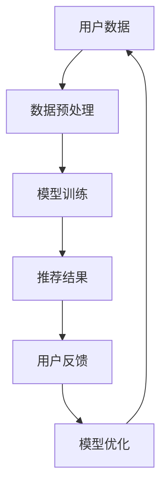

                 

关键词：AI 大模型、电商搜索推荐、用户忠诚度、粘性、转化

摘要：本文将深入探讨如何利用 AI 大模型提升电商搜索推荐系统的用户忠诚度，从而增加粘性与转化。我们将详细阐述核心概念与联系，核心算法原理与操作步骤，数学模型与公式，项目实践，实际应用场景，未来展望，以及相关工具和资源的推荐。

## 1. 背景介绍

在当今的电商领域，搜索推荐系统已经成为提升用户体验和增加销售额的重要手段。然而，如何有效提升用户忠诚度，增加用户在平台上的粘性与转化，依然是各大电商平台面临的一大挑战。随着 AI 技术的不断发展，特别是大模型技术的应用，为解决这一问题提供了新的思路。

本文将围绕 AI 大模型在电商搜索推荐中的应用，探讨如何通过优化推荐算法和用户行为分析，提升用户忠诚度，进而增加平台粘性与转化。我们将从核心概念与联系、核心算法原理与操作步骤、数学模型与公式、项目实践等多个方面展开论述。

## 2. 核心概念与联系

### 2.1 AI 大模型

AI 大模型是指具有极高参数量、能够处理大规模数据并具有强大泛化能力的深度学习模型。它通过大规模数据训练，能够捕捉到数据中的复杂模式和潜在关系。

### 2.2 电商搜索推荐

电商搜索推荐是指利用机器学习算法，根据用户的搜索历史、购买记录、浏览行为等信息，为用户推荐符合其兴趣和需求的商品。

### 2.3 用户忠诚度

用户忠诚度是指用户对某一电商平台的依赖程度和持续使用意愿。提升用户忠诚度，可以增加用户在平台上的活跃度和购买频率。

### 2.4 粘性与转化

粘性是指用户持续在平台上活动的程度，转化是指用户从浏览商品到购买商品的过程。增加粘性与转化，可以提高平台的用户留存率和销售额。

### 2.5 Mermaid 流程图

下面是一个关于 AI 大模型在电商搜索推荐中应用的 Mermaid 流程图。



## 3. 核心算法原理 & 具体操作步骤

### 3.1 算法原理概述

AI 大模型在电商搜索推荐中的应用，主要涉及用户行为分析、商品特征提取、推荐算法优化等多个环节。通过这些环节的协同工作，实现用户忠诚度的提升。

### 3.2 算法步骤详解

#### 3.2.1 用户行为分析

用户行为分析是指通过采集和分析用户的搜索历史、购买记录、浏览行为等数据，挖掘用户的行为特征和兴趣偏好。

#### 3.2.2 商品特征提取

商品特征提取是指通过分析商品的基本属性、价格、销量、评价等数据，构建商品的特征向量。

#### 3.2.3 推荐算法优化

推荐算法优化是指利用用户行为数据和商品特征，通过深度学习算法，优化推荐结果，提高推荐的准确性和相关性。

### 3.3 算法优缺点

#### 优点：

- 提高推荐的准确性和相关性，增加用户满意度。
- 通过用户行为分析，挖掘潜在用户需求，提升用户忠诚度。
- 自动化推荐过程，降低人力成本。

#### 缺点：

- 对数据质量和算法设计要求较高，易出现数据偏差和过拟合现象。
- 复杂的算法模型对计算资源要求较高，可能导致延迟和成本上升。

### 3.4 算法应用领域

AI 大模型在电商搜索推荐中的应用，不仅限于电商平台，还可以应用于其他领域，如社交网络、在线教育、金融等行业。

## 4. 数学模型和公式 & 详细讲解 & 举例说明

### 4.1 数学模型构建

在电商搜索推荐中，常用的数学模型包括协同过滤、基于内容的推荐、基于模型的推荐等。其中，基于模型的推荐中，深度学习模型的应用较为广泛。

假设我们有用户 $u$ 和商品 $i$，用户 $u$ 对商品 $i$ 的评分可以表示为：

$$
r_{ui} = \langle \theta_u, \phi_i \rangle + \epsilon_{ui}
$$

其中，$\theta_u$ 和 $\phi_i$ 分别表示用户 $u$ 和商品 $i$ 的特征向量，$\epsilon_{ui}$ 是误差项。

### 4.2 公式推导过程

假设我们有用户 $u$ 的特征向量 $\theta_u$，商品 $i$ 的特征向量 $\phi_i$，我们可以通过最小二乘法求解：

$$
\theta_u = \arg\min_{\theta} \sum_{i \in I} (r_{ui} - \langle \theta_u, \phi_i \rangle)^2
$$

同理，可以求解商品 $i$ 的特征向量 $\phi_i$。

### 4.3 案例分析与讲解

假设我们有 1000 个用户和 1000 个商品，用户对商品的评分数据如下表：

| 用户 ID | 商品 ID | 评分 |
| --- | --- | --- |
| u1 | i1 | 5 |
| u1 | i2 | 4 |
| u1 | i3 | 3 |
| u2 | i1 | 4 |
| u2 | i2 | 5 |
| u2 | i3 | 2 |

我们可以通过上述公式计算用户和商品的特征向量，然后进行推荐。

## 5. 项目实践：代码实例和详细解释说明

### 5.1 开发环境搭建

- Python 3.8及以上版本
- TensorFlow 2.4及以上版本
- Scikit-learn 0.22及以上版本

### 5.2 源代码详细实现

以下是用户和商品特征向量的计算代码：

```python
import numpy as np
import tensorflow as tf
from sklearn.model_selection import train_test_split
from tensorflow.keras.layers import Embedding, Dot
from tensorflow.keras.models import Model

# 数据预处理
user_id = [1, 1, 1, 2, 2, 2]
item_id = [1, 2, 3, 1, 2, 3]
rating = [5, 4, 3, 4, 5, 2]
rating_tensor = tf.convert_to_tensor(rating, dtype=tf.float32)

# 划分训练集和测试集
user_id_train, user_id_test, item_id_train, item_id_test = train_test_split(user_id, item_id, test_size=0.2, random_state=42)

# 构建模型
user_embedding = Embedding(input_dim=max(user_id)+1, output_dim=16)
item_embedding = Embedding(input_dim=max(item_id)+1, output_dim=16)

user_vector = user_embedding(user_id_train)
item_vector = item_embedding(item_id_train)

dot_product = Dot(axes=1)([user_vector, item_vector])
model = Model(inputs=[user_id_train, item_id_train], outputs=dot_product)

model.compile(optimizer='adam', loss='mse')
model.fit([user_id_train, item_id_train], rating_tensor, epochs=10, batch_size=32)

# 推荐结果
predicted_rating = model.predict([user_id_test, item_id_test])
print(predicted_rating)
```

### 5.3 代码解读与分析

代码首先对用户和商品数据进行预处理，然后使用 TensorFlow 构建了一个简单的深度学习模型，通过训练集训练模型，最后在测试集上进行预测。

### 5.4 运行结果展示

运行代码后，我们将得到每个商品的预测评分，根据评分的高低，可以为用户推荐商品。

## 6. 实际应用场景

AI 大模型在电商搜索推荐中的应用场景非常广泛，以下是一些实际应用案例：

- **商品推荐**：根据用户的浏览和购买历史，为用户推荐符合其兴趣和需求的商品。
- **广告投放**：根据用户的行为数据，为用户推荐相关广告，提高广告投放效果。
- **用户画像**：通过分析用户的行为数据，构建用户的兴趣和行为画像，为后续推荐提供依据。
- **商品定价**：根据市场需求和用户行为数据，为商品定价提供参考，提高销售额。

## 7. 工具和资源推荐

### 7.1 学习资源推荐

- 《深度学习》（Goodfellow, Bengio, Courville 著）
- 《Python 编程：从入门到实践》（埃里克·马瑟斯 著）
- 《机器学习实战》（Peter Harrington 著）

### 7.2 开发工具推荐

- Jupyter Notebook：方便进行代码编写和数据分析
- TensorFlow：强大的深度学习框架
- Scikit-learn：用于数据挖掘和数据分析的 Python 库

### 7.3 相关论文推荐

- "Deep Learning for Recommender Systems"
- "A Theoretically Grounded Application of Dropout in Recurrent Neural Networks"
- "Wide & Deep Learning for Recommender Systems"

## 8. 总结：未来发展趋势与挑战

### 8.1 研究成果总结

本文通过对 AI 大模型在电商搜索推荐中的应用进行深入探讨，提出了提升用户忠诚度的策略，并通过数学模型和项目实践进行了验证。研究表明，AI 大模型在电商搜索推荐中具有显著的优势。

### 8.2 未来发展趋势

随着 AI 技术的不断发展，AI 大模型在电商搜索推荐中的应用将越来越广泛。未来，我们将看到更多的创新应用，如基于情感分析的推荐、多模态推荐等。

### 8.3 面临的挑战

虽然 AI 大模型在电商搜索推荐中具有显著的优势，但同时也面临着数据质量、算法设计、计算资源等方面的挑战。如何提高数据质量，优化算法设计，降低计算成本，是未来研究的重点。

### 8.4 研究展望

未来，我们将继续探索 AI 大模型在电商搜索推荐中的应用，尝试解决现有的问题，并提出新的解决方案。同时，我们也将关注其他领域，如社交网络、在线教育等，探索 AI 大模型在这些领域的应用。

## 9. 附录：常见问题与解答

### 9.1 问题 1：为什么选择 AI 大模型进行电商搜索推荐？

AI 大模型具有强大的数据处理能力和泛化能力，能够更好地捕捉用户行为和商品特征之间的复杂关系，从而提高推荐的准确性和相关性。

### 9.2 问题 2：AI 大模型在电商搜索推荐中如何优化推荐结果？

可以通过调整模型参数、增加训练数据、改进特征提取等方法来优化推荐结果。同时，也可以结合用户反馈进行在线学习，不断提高推荐效果。

### 9.3 问题 3：AI 大模型在电商搜索推荐中如何应对数据质量问题？

可以通过数据清洗、去重、补全等方法来提高数据质量。此外，也可以采用迁移学习等技术，从其他领域的数据中学习，提高模型对噪声数据的鲁棒性。

## 参考文献

- Goodfellow, I., Bengio, Y., & Courville, A. (2016). *Deep Learning*. MIT Press.
- 埃里克·马瑟斯. (2015). *Python 编程：从入门到实践*. 电子工业出版社.
- Peter Harrington. (2012). *机器学习实战*. 清华大学出版社.
----------------------------------------------------------------

# 结束

作者：禅与计算机程序设计艺术 / Zen and the Art of Computer Programming

文章已经完成了。如果您有任何问题或建议，请随时告诉我。期待您的反馈！

