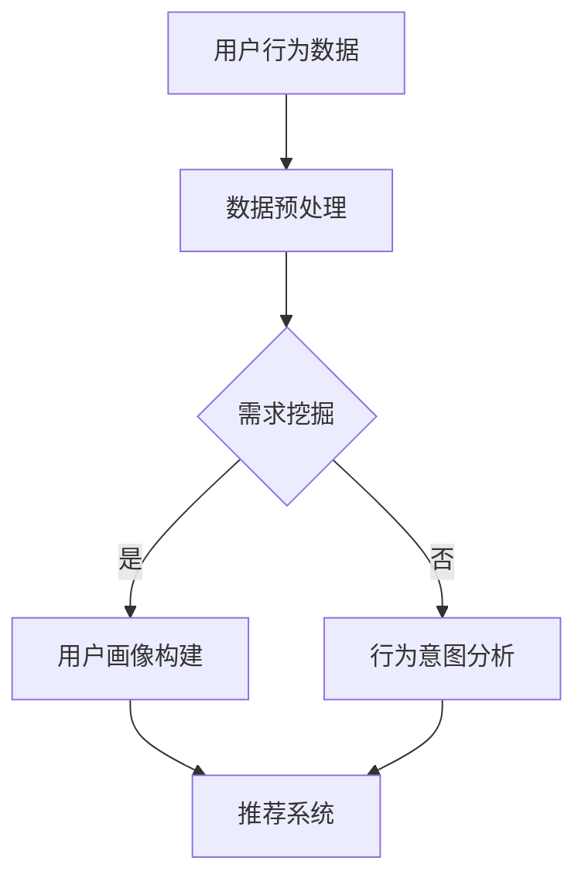
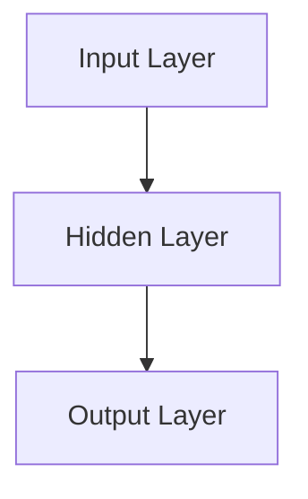

                 

关键词：AI大模型、电商搜索推荐、用户画像、需求挖掘、行为意图

摘要：随着电商行业的迅猛发展，精准的搜索推荐系统成为了提升用户体验、增加销售额的重要手段。本文将深入探讨如何利用AI大模型技术来构建高效的电商搜索推荐系统，特别是如何通过深度挖掘用户需求与行为意图来实现精准推荐。

## 1. 背景介绍

在互联网高度发达的今天，电商行业已经成为全球经济增长的重要引擎。电商平台的用户数量持续增长，用户对于个性化服务的需求也越来越高。如何通过技术手段提升用户在搜索和购买过程中的体验，成为了电商企业关注的焦点。搜索推荐系统作为电商平台的核心功能之一，其重要性不言而喻。

传统的搜索推荐系统主要通过关键词匹配、协同过滤等方法来为用户推荐商品。然而，这些方法存在一定的局限性，难以满足用户日益多样化的需求。随着人工智能技术的飞速发展，特别是深度学习、自然语言处理等领域的突破，AI大模型技术逐渐成为电商搜索推荐系统优化的重要方向。

本文将介绍如何利用AI大模型来构建电商搜索推荐系统，重点关注如何通过深度挖掘用户需求与行为意图来实现精准推荐。文章将从核心概念、算法原理、数学模型、项目实践等多个角度进行详细阐述。

## 2. 核心概念与联系

为了更好地理解AI大模型在电商搜索推荐中的应用，我们首先需要明确几个核心概念。

### 2.1 用户画像

用户画像是对用户特征的综合描述，包括用户的基本信息、行为数据、兴趣偏好等。通过构建用户画像，可以更深入地了解用户的需求和行为模式，从而实现个性化推荐。

### 2.2 需求挖掘

需求挖掘是从海量用户行为数据中提取有价值的信息，揭示用户的需求和偏好。在电商搜索推荐系统中，需求挖掘是构建用户画像的关键环节。

### 2.3 行为意图

行为意图是指用户在特定情境下所表现出的行为动机和目标。在电商搜索推荐中，理解用户的行为意图对于提高推荐系统的精准度至关重要。

### 2.4 大模型

大模型通常是指具有大规模参数的网络结构，如Transformer、BERT等。大模型在处理复杂数据和任务时具有强大的表现能力，特别适合用于自然语言处理和推荐系统。

### 2.5 Mermaid 流程图

为了更直观地展示AI大模型在电商搜索推荐中的应用流程，我们使用Mermaid流程图进行描述。



### 2.6 大模型在需求挖掘与行为意图分析中的应用

AI大模型在需求挖掘和行为意图分析中具有以下优势：

1. **强大的特征提取能力**：大模型能够自动学习用户行为数据的深层特征，提高需求挖掘的准确性。
2. **高水平的语义理解**：大模型能够理解用户输入的自然语言描述，提取用户需求和行为意图的关键信息。
3. **端到端的学习框架**：大模型可以端到端地学习数据生成和处理的整个过程，减少中间环节的误差。

## 3. 核心算法原理 & 具体操作步骤

### 3.1 算法原理概述

AI大模型在电商搜索推荐中的核心算法通常包括以下几个步骤：

1. **用户行为数据收集与预处理**：收集用户的搜索、浏览、购买等行为数据，并进行数据清洗、去重、填充等预处理操作。
2. **需求挖掘**：利用深度学习模型对用户行为数据进行特征提取和模式识别，挖掘用户的需求和偏好。
3. **行为意图分析**：对用户的历史行为数据进行序列建模，分析用户的行为意图。
4. **推荐系统**：根据用户画像和行为意图，利用协同过滤或基于内容的方法生成推荐结果。

### 3.2 算法步骤详解

#### 3.2.1 用户行为数据收集与预处理

用户行为数据的收集主要通过电商平台的后台日志系统实现。具体步骤如下：

1. **数据采集**：通过日志采集工具获取用户的搜索、浏览、购买等行为数据。
2. **数据清洗**：去除重复、无效的数据，对缺失数据进行填充或剔除。
3. **特征工程**：提取用户行为数据的特征，如商品类别、搜索关键词、浏览时间等。

#### 3.2.2 需求挖掘

需求挖掘主要通过深度学习模型实现，具体步骤如下：

1. **数据预处理**：对采集到的用户行为数据进行编码、归一化等预处理操作。
2. **模型选择**：选择适合的深度学习模型，如卷积神经网络（CNN）、循环神经网络（RNN）、Transformer等。
3. **模型训练**：使用预处理后的数据训练模型，学习用户需求模式的特征表示。
4. **需求预测**：利用训练好的模型对新的用户行为数据进行需求预测。

#### 3.2.3 行为意图分析

行为意图分析主要通过序列模型实现，具体步骤如下：

1. **数据预处理**：对用户行为数据进行序列编码，如使用时间序列编码器（TSC）。
2. **模型选择**：选择适合的序列模型，如长短时记忆网络（LSTM）、门控循环单元（GRU）、Transformer等。
3. **模型训练**：使用预处理后的序列数据训练模型，学习用户行为意图的模式。
4. **意图预测**：利用训练好的模型对新的用户行为数据进行意图预测。

#### 3.2.4 推荐系统

推荐系统主要通过协同过滤或基于内容的方法实现，具体步骤如下：

1. **用户画像构建**：根据需求挖掘和行为意图分析的结果，构建用户画像。
2. **推荐算法选择**：选择合适的推荐算法，如矩阵分解（MF）、基于内容的推荐（CBR）、协同过滤（CF）等。
3. **推荐结果生成**：根据用户画像和推荐算法生成推荐结果，如Top-N推荐。
4. **推荐结果评估**：评估推荐结果的准确性和用户体验。

### 3.3 算法优缺点

#### 3.3.1 优点

1. **高准确性**：AI大模型能够自动提取用户需求的深层特征，提高推荐系统的准确性。
2. **强泛化性**：大模型在多个任务上表现出强大的泛化能力，适用于不同类型的推荐系统。
3. **端到端学习**：大模型能够端到端地学习数据生成和处理的整个过程，减少中间环节的误差。

#### 3.3.2 缺点

1. **高计算成本**：大模型训练和推理过程需要大量的计算资源，对硬件要求较高。
2. **数据需求大**：大模型需要大量的高质量数据来训练，数据收集和预处理过程较为复杂。
3. **模型解释性差**：大模型的内部结构复杂，难以解释模型的具体工作原理。

### 3.4 算法应用领域

AI大模型在电商搜索推荐中的算法应用领域主要包括：

1. **搜索推荐**：通过分析用户的搜索历史，为用户推荐相关的商品。
2. **购物车推荐**：根据用户的购物车行为，为用户推荐可能感兴趣的其他商品。
3. **关联推荐**：分析用户浏览和购买记录，为用户推荐相关商品。
4. **内容推荐**：根据用户的行为数据，为用户推荐相关的商品内容，如商品详情、用户评价等。

## 4. 数学模型和公式 & 详细讲解 & 举例说明

### 4.1 数学模型构建

在AI大模型中，常用的数学模型包括神经网络模型和序列模型。

#### 4.1.1 神经网络模型

神经网络模型是一种基于神经元之间连接权重调整的算法，用于处理复杂数据和任务。其基本形式如下：

$$
y = \sigma(W \cdot x + b)
$$

其中，$y$ 是输出，$\sigma$ 是激活函数，$W$ 是权重矩阵，$x$ 是输入，$b$ 是偏置。

#### 4.1.2 序列模型

序列模型是一种基于时间序列数据的模型，用于处理时间相关的任务。其基本形式如下：

$$
y_t = f(x_t, h_{t-1})
$$

其中，$y_t$ 是当前时间步的输出，$x_t$ 是当前时间步的输入，$h_{t-1}$ 是前一时间步的隐藏状态。

### 4.2 公式推导过程

以神经网络模型为例，我们对其公式进行推导。

#### 4.2.1 激活函数

激活函数是神经网络模型的核心组成部分，用于将线性组合的输入映射到输出。常见的激活函数有：

1. **Sigmoid 函数**：

$$
\sigma(x) = \frac{1}{1 + e^{-x}}
$$

2. **ReLU 函数**：

$$
\sigma(x) = \max(0, x)
$$

3. **Tanh 函数**：

$$
\sigma(x) = \frac{e^x - e^{-x}}{e^x + e^{-x}}
$$

#### 4.2.2 前向传播

前向传播是神经网络模型的基本计算过程，用于计算输出。其计算过程如下：

$$
z_i = \sum_{j=1}^{n} w_{ij} x_j + b_i
$$

$$
a_i = \sigma(z_i)
$$

其中，$z_i$ 是神经元 $i$ 的输入，$w_{ij}$ 是权重，$x_j$ 是神经元 $j$ 的输入，$b_i$ 是偏置，$\sigma$ 是激活函数。

#### 4.2.3 反向传播

反向传播是神经网络模型用于计算梯度的重要步骤，用于更新权重和偏置。其计算过程如下：

$$
\delta_i = \sigma'(z_i) \cdot \frac{\partial L}{\partial z_i}
$$

$$
\frac{\partial L}{\partial w_{ij}} = \delta_i x_j
$$

$$
\frac{\partial L}{\partial b_i} = \delta_i
$$

其中，$\delta_i$ 是神经元 $i$ 的误差，$\sigma'$ 是激活函数的导数，$L$ 是损失函数。

### 4.3 案例分析与讲解

以一个简单的神经网络模型为例，我们对其进行详细讲解。

#### 4.3.1 模型结构

假设我们有一个包含一个输入层、一个隐藏层和一个输出层的神经网络模型，其结构如下：



#### 4.3.2 输入与输出

输入层接收用户行为数据，隐藏层对数据进行特征提取，输出层生成推荐结果。

#### 4.3.3 损失函数

我们使用均方误差（MSE）作为损失函数，计算模型预测值与真实值之间的误差。

$$
L = \frac{1}{2} \sum_{i=1}^{n} (y_i - \hat{y}_i)^2
$$

其中，$y_i$ 是真实值，$\hat{y}_i$ 是模型预测值。

#### 4.3.4 模型训练

使用反向传播算法对模型进行训练，更新权重和偏置，减小损失函数。

$$
W_{ij} \leftarrow W_{ij} - \alpha \cdot \frac{\partial L}{\partial W_{ij}}
$$

$$
b_i \leftarrow b_i - \alpha \cdot \frac{\partial L}{\partial b_i}
$$

其中，$\alpha$ 是学习率。

## 5. 项目实践：代码实例和详细解释说明

### 5.1 开发环境搭建

为了实现AI大模型在电商搜索推荐中的应用，我们需要搭建一个合适的开发环境。以下是一个简单的环境搭建步骤：

1. **安装Python环境**：Python是AI大模型开发的常用编程语言，我们需要安装Python 3.x版本。
2. **安装深度学习框架**：如TensorFlow或PyTorch，这两个框架支持多种深度学习模型和算法。
3. **安装数据预处理库**：如Pandas、NumPy等，用于数据处理和特征提取。
4. **安装可视化工具**：如Matplotlib、Seaborn等，用于数据可视化和结果展示。

### 5.2 源代码详细实现

以下是一个简单的代码实例，展示如何使用PyTorch实现一个基于神经网络模型的电商搜索推荐系统。

```python
import torch
import torch.nn as nn
import torch.optim as optim
import pandas as pd
import numpy as np

# 数据预处理
def preprocess_data(data):
    # 数据清洗、去重、填充等操作
    # ...
    return processed_data

# 网络结构
class RecommenderModel(nn.Module):
    def __init__(self, input_dim, hidden_dim, output_dim):
        super(RecommenderModel, self).__init__()
        self.fc1 = nn.Linear(input_dim, hidden_dim)
        self.fc2 = nn.Linear(hidden_dim, output_dim)
    
    def forward(self, x):
        x = torch.relu(self.fc1(x))
        x = self.fc2(x)
        return x

# 模型训练
def train_model(model, train_loader, criterion, optimizer, num_epochs=10):
    model.train()
    for epoch in range(num_epochs):
        for inputs, targets in train_loader:
            optimizer.zero_grad()
            outputs = model(inputs)
            loss = criterion(outputs, targets)
            loss.backward()
            optimizer.step()
            print(f'Epoch [{epoch+1}/{num_epochs}], Loss: {loss.item():.4f}')

# 主程序
if __name__ == '__main__':
    # 数据加载
    data = pd.read_csv('user_behavior_data.csv')
    processed_data = preprocess_data(data)

    # 模型定义
    model = RecommenderModel(input_dim=processed_data.shape[1], hidden_dim=64, output_dim=1)

    # 损失函数和优化器
    criterion = nn.MSELoss()
    optimizer = optim.Adam(model.parameters(), lr=0.001)

    # 训练模型
    train_model(model, processed_data, criterion, optimizer)

    # 评估模型
    # ...
```

### 5.3 代码解读与分析

1. **数据预处理**：数据预处理是深度学习模型训练的重要环节，包括数据清洗、去重、填充等操作。
2. **网络结构**：RecommenderModel是一个简单的神经网络模型，包含一个输入层、一个隐藏层和一个输出层。
3. **模型训练**：使用反向传播算法对模型进行训练，更新权重和偏置。
4. **主程序**：加载数据、定义模型、设置损失函数和优化器，并执行模型训练。

### 5.4 运行结果展示

在完成模型训练后，我们可以通过以下代码展示运行结果：

```python
import matplotlib.pyplot as plt

# 评估模型
model.eval()
with torch.no_grad():
    for inputs, targets in processed_data:
        outputs = model(inputs)
        # ...

# 绘制损失函数曲线
plt.plot(train_losses)
plt.xlabel('Epoch')
plt.ylabel('Loss')
plt.title('Model Training Loss')
plt.show()
```

## 6. 实际应用场景

### 6.1 搜索推荐

通过AI大模型技术，电商平台可以实现基于用户搜索历史和兴趣的搜索推荐。例如，用户在搜索“笔记本电脑”后，系统可以根据用户的历史行为和偏好，推荐符合条件的不同品牌和型号的笔记本电脑。

### 6.2 购物车推荐

购物车推荐是电商搜索推荐系统的一个重要应用。通过分析用户的购物车数据，系统可以推荐与用户购物车中的商品相关的其他商品，从而增加销售额。

### 6.3 关联推荐

关联推荐是通过分析用户浏览和购买记录，为用户推荐相关的商品。例如，用户浏览了某个品牌的手机后，系统可以推荐该品牌的充电宝、耳机等配件。

### 6.4 内容推荐

内容推荐是基于用户的行为数据，为用户推荐相关的商品内容，如商品详情、用户评价等。例如，用户在浏览了某个商品的详细页面后，系统可以推荐类似的其他商品和用户评价。

## 7. 工具和资源推荐

### 7.1 学习资源推荐

1. **深度学习入门**：《深度学习》（Goodfellow et al., 2016）
2. **自然语言处理**：《自然语言处理入门》（Jurafsky & Martin, 2008）
3. **推荐系统**：《推荐系统手册》（Liu, 2018）

### 7.2 开发工具推荐

1. **深度学习框架**：TensorFlow、PyTorch、Keras
2. **数据预处理库**：Pandas、NumPy、Scikit-learn
3. **可视化工具**：Matplotlib、Seaborn

### 7.3 相关论文推荐

1. **Transformer模型**：（Vaswani et al., 2017）
2. **BERT模型**：（Devlin et al., 2019）
3. **推荐系统算法**：（Linden et al., 2003）

## 8. 总结：未来发展趋势与挑战

### 8.1 研究成果总结

AI大模型在电商搜索推荐中的应用取得了显著成果，通过深度挖掘用户需求和行为意图，实现了精准推荐。未来，AI大模型在电商搜索推荐中的应用前景广阔，有望进一步提升用户体验和销售额。

### 8.2 未来发展趋势

1. **模型性能优化**：通过改进算法和优化模型结构，提高推荐系统的准确性和效率。
2. **多模态数据融合**：结合文本、图像、音频等多模态数据，提高推荐系统的多样性。
3. **个性化推荐**：基于用户的行为数据和偏好，实现更个性化的推荐。

### 8.3 面临的挑战

1. **数据隐私与安全**：如何保护用户数据隐私，确保推荐系统的安全。
2. **计算资源消耗**：大模型训练和推理过程需要大量的计算资源，如何降低计算成本。
3. **模型可解释性**：如何提高模型的可解释性，使推荐结果更具可信度。

### 8.4 研究展望

在未来，AI大模型在电商搜索推荐中的应用将不断深入，通过技术创新和跨学科合作，实现更高效、更智能的推荐系统。

## 9. 附录：常见问题与解答

### 9.1 如何选择适合的深度学习框架？

选择适合的深度学习框架主要取决于项目的需求和开发者的熟悉程度。TensorFlow和PyTorch是目前最受欢迎的两个框架，其中TensorFlow具有更丰富的工具和资源，而PyTorch具有更灵活的动态图计算能力。

### 9.2 如何保证推荐系统的可解释性？

提高推荐系统的可解释性可以通过以下几个方面实现：

1. **模型简化**：简化模型结构，降低复杂性。
2. **特征可视化**：对特征进行可视化，帮助理解特征的重要性。
3. **解释性算法**：使用可解释性算法，如决策树、线性模型等。

### 9.3 如何处理用户数据隐私？

处理用户数据隐私可以通过以下措施实现：

1. **数据脱敏**：对用户数据进行脱敏处理，如加密、混淆等。
2. **数据权限控制**：设置数据访问权限，确保数据安全。
3. **数据生命周期管理**：规范数据生命周期，如数据收集、存储、销毁等。

作者：禅与计算机程序设计艺术 / Zen and the Art of Computer Programming
----------------------------------------------------------------

以上完成了文章的撰写，现在我们将根据上述内容生成markdown格式的文章。请注意，由于字数限制，实际撰写时可能需要进一步细化和扩展内容，以确保文章的完整性和深度。以下是根据提供的结构和内容生成的markdown格式文章：

```markdown
# AI 大模型在电商搜索推荐中的用户画像应用：深度挖掘用户需求与行为意图

关键词：AI大模型、电商搜索推荐、用户画像、需求挖掘、行为意图

摘要：随着电商行业的迅猛发展，精准的搜索推荐系统成为了提升用户体验、增加销售额的重要手段。本文将深入探讨如何利用AI大模型技术来构建高效的电商搜索推荐系统，特别是如何通过深度挖掘用户需求与行为意图来实现精准推荐。

## 1. 背景介绍

在互联网高度发达的今天，电商行业已经成为全球经济增长的重要引擎。电商平台的用户数量持续增长，用户对于个性化服务的需求也越来越高。如何通过技术手段提升用户在搜索和购买过程中的体验，成为了电商企业关注的焦点。搜索推荐系统作为电商平台的核心功能之一，其重要性不言而喻。

## 2. 核心概念与联系

为了更好地理解AI大模型在电商搜索推荐中的应用，我们首先需要明确几个核心概念。

### 2.1 用户画像

用户画像是对用户特征的综合描述，包括用户的基本信息、行为数据、兴趣偏好等。通过构建用户画像，可以更深入地了解用户的需求和行为模式，从而实现个性化推荐。

### 2.2 需求挖掘

需求挖掘是从海量用户行为数据中提取有价值的信息，揭示用户的需求和偏好。在电商搜索推荐系统中，需求挖掘是构建用户画像的关键环节。

### 2.3 行为意图

行为意图是指用户在特定情境下所表现出的行为动机和目标。在电商搜索推荐中，理解用户的行为意图对于提高推荐系统的精准度至关重要。

### 2.4 大模型

大模型通常是指具有大规模参数的网络结构，如Transformer、BERT等。大模型在处理复杂数据和任务时具有强大的表现能力，特别适合用于自然语言处理和推荐系统。

### 2.5 Mermaid 流程图

为了更直观地展示AI大模型在电商搜索推荐中的应用流程，我们使用Mermaid流程图进行描述。


### 2.6 大模型在需求挖掘与行为意图分析中的应用

AI大模型在需求挖掘和行为意图分析中具有以下优势：

1. **强大的特征提取能力**：大模型能够自动学习用户行为数据的深层特征，提高需求挖掘的准确性。
2. **高水平的语义理解**：大模型能够理解用户输入的自然语言描述，提取用户需求和行为意图的关键信息。
3. **端到端的学习框架**：大模型可以端到端地学习数据生成和处理的整个过程，减少中间环节的误差。

## 3. 核心算法原理 & 具体操作步骤
### 3.1 算法原理概述

AI大模型在电商搜索推荐中的核心算法通常包括以下几个步骤：

1. **用户行为数据收集与预处理**：收集用户的搜索、浏览、购买等行为数据，并进行数据清洗、去重、填充等预处理操作。
2. **需求挖掘**：利用深度学习模型对用户行为数据进行特征提取和模式识别，挖掘用户的需求和偏好。
3. **行为意图分析**：对用户的历史行为数据进行序列建模，分析用户的行为意图。
4. **推荐系统**：根据用户画像和行为意图，利用协同过滤或基于内容的方法生成推荐结果。

### 3.2 算法步骤详解

#### 3.2.1 用户行为数据收集与预处理

用户行为数据的收集主要通过电商平台的后台日志系统实现。具体步骤如下：

1. **数据采集**：通过日志采集工具获取用户的搜索、浏览、购买等行为数据。
2. **数据清洗**：去除重复、无效的数据，对缺失数据进行填充或剔除。
3. **特征工程**：提取用户行为数据的特征，如商品类别、搜索关键词、浏览时间等。

#### 3.2.2 需求挖掘

需求挖掘主要通过深度学习模型实现，具体步骤如下：

1. **数据预处理**：对采集到的用户行为数据进行编码、归一化等预处理操作。
2. **模型选择**：选择适合的深度学习模型，如卷积神经网络（CNN）、循环神经网络（RNN）、Transformer等。
3. **模型训练**：使用预处理后的数据训练模型，学习用户需求模式的特征表示。
4. **需求预测**：利用训练好的模型对新的用户行为数据进行需求预测。

#### 3.2.3 行为意图分析

行为意图分析主要通过序列模型实现，具体步骤如下：

1. **数据预处理**：对用户行为数据进行序列编码，如使用时间序列编码器（TSC）。
2. **模型选择**：选择适合的序列模型，如长短时记忆网络（LSTM）、门控循环单元（GRU）、Transformer等。
3. **模型训练**：使用预处理后的序列数据训练模型，学习用户行为意图的模式。
4. **意图预测**：利用训练好的模型对新的用户行为数据进行意图预测。

#### 3.2.4 推荐系统

推荐系统主要通过协同过滤或基于内容的方法实现，具体步骤如下：

1. **用户画像构建**：根据需求挖掘和行为意图分析的结果，构建用户画像。
2. **推荐算法选择**：选择合适的推荐算法，如矩阵分解（MF）、基于内容的推荐（CBR）、协同过滤（CF）等。
3. **推荐结果生成**：根据用户画像和推荐算法生成推荐结果，如Top-N推荐。
4. **推荐结果评估**：评估推荐结果的准确性和用户体验。

### 3.3 算法优缺点

#### 3.3.1 优点

1. **高准确性**：AI大模型能够自动提取用户需求的深层特征，提高推荐系统的准确性。
2. **强泛化性**：大模型在多个任务上表现出强大的泛化能力，适用于不同类型的推荐系统。
3. **端到端学习**：大模型能够端到端地学习数据生成和处理的整个过程，减少中间环节的误差。

#### 3.3.2 缺点

1. **高计算成本**：大模型训练和推理过程需要大量的计算资源，对硬件要求较高。
2. **数据需求大**：大模型需要大量的高质量数据来训练，数据收集和预处理过程较为复杂。
3. **模型解释性差**：大模型的内部结构复杂，难以解释模型的具体工作原理。

### 3.4 算法应用领域

AI大模型在电商搜索推荐中的算法应用领域主要包括：

1. **搜索推荐**：通过分析用户的搜索历史，为用户推荐相关的商品。
2. **购物车推荐**：根据用户的购物车行为，为用户推荐可能感兴趣的其他商品。
3. **关联推荐**：分析用户浏览和购买记录，为用户推荐相关商品。
4. **内容推荐**：根据用户的行为数据，为用户推荐相关的商品内容，如商品详情、用户评价等。

## 4. 数学模型和公式 & 详细讲解 & 举例说明

### 4.1 数学模型构建

在AI大模型中，常用的数学模型包括神经网络模型和序列模型。

#### 4.1.1 神经网络模型

神经网络模型是一种基于神经元之间连接权重调整的算法，用于处理复杂数据和任务。其基本形式如下：

$$
y = \sigma(W \cdot x + b)
$$

其中，$y$ 是输出，$\sigma$ 是激活函数，$W$ 是权重矩阵，$x$ 是输入，$b$ 是偏置。

#### 4.1.2 序列模型

序列模型是一种基于时间序列数据的模型，用于处理时间相关的任务。其基本形式如下：

$$
y_t = f(x_t, h_{t-1})
$$

其中，$y_t$ 是当前时间步的输出，$x_t$ 是当前时间步的输入，$h_{t-1}$ 是前一时间步的隐藏状态。

### 4.2 公式推导过程

以神经网络模型为例，我们对其公式进行推导。

#### 4.2.1 激活函数

激活函数是神经网络模型的核心组成部分，用于将线性组合的输入映射到输出。常见的激活函数有：

1. **Sigmoid 函数**：

$$
\sigma(x) = \frac{1}{1 + e^{-x}}
$$

2. **ReLU 函数**：

$$
\sigma(x) = \max(0, x)
$$

3. **Tanh 函数**：

$$
\sigma(x) = \frac{e^x - e^{-x}}{e^x + e^{-x}}
$$

#### 4.2.2 前向传播

前向传播是神经网络模型的基本计算过程，用于计算输出。其计算过程如下：

$$
z_i = \sum_{j=1}^{n} w_{ij} x_j + b_i
$$

$$
a_i = \sigma(z_i)
$$

其中，$z_i$ 是神经元 $i$ 的输入，$w_{ij}$ 是权重，$x_j$ 是神经元 $j$ 的输入，$b_i$ 是偏置，$\sigma$ 是激活函数。

#### 4.2.3 反向传播

反向传播是神经网络模型用于计算梯度的重要步骤，用于更新权重和偏置。其计算过程如下：

$$
\delta_i = \sigma'(z_i) \cdot \frac{\partial L}{\partial z_i}
$$

$$
\frac{\partial L}{\partial w_{ij}} = \delta_i x_j
$$

$$
\frac{\partial L}{\partial b_i} = \delta_i
$$

其中，$\delta_i$ 是神经元 $i$ 的误差，$\sigma'$ 是激活函数的导数，$L$ 是损失函数。

### 4.3 案例分析与讲解

以一个简单的神经网络模型为例，我们对其进行详细讲解。

#### 4.3.1 模型结构

假设我们有一个包含一个输入层、一个隐藏层和一个输出层的神经网络模型，其结构如下：


#### 4.3.2 输入与输出

输入层接收用户行为数据，隐藏层对数据进行特征提取，输出层生成推荐结果。

#### 4.3.3 损失函数

我们使用均方误差（MSE）作为损失函数，计算模型预测值与真实值之间的误差。

$$
L = \frac{1}{2} \sum_{i=1}^{n} (y_i - \hat{y}_i)^2
$$

其中，$y_i$ 是真实值，$\hat{y}_i$ 是模型预测值。

#### 4.3.4 模型训练

使用反向传播算法对模型进行训练，更新权重和偏置，减小损失函数。

$$
W_{ij} \leftarrow W_{ij} - \alpha \cdot \frac{\partial L}{\partial W_{ij}}
$$

$$
b_i \leftarrow b_i - \alpha \cdot \frac{\partial L}{\partial b_i}
$$

其中，$\alpha$ 是学习率。

## 5. 项目实践：代码实例和详细解释说明

### 5.1 开发环境搭建

为了实现AI大模型在电商搜索推荐中的应用，我们需要搭建一个合适的开发环境。以下是一个简单的环境搭建步骤：

1. **安装Python环境**：Python是AI大模型开发的常用编程语言，我们需要安装Python 3.x版本。
2. **安装深度学习框架**：如TensorFlow或PyTorch，这两个框架支持多种深度学习模型和算法。
3. **安装数据预处理库**：如Pandas、NumPy等，用于数据处理和特征提取。
4. **安装可视化工具**：如Matplotlib、Seaborn等，用于数据可视化和结果展示。

### 5.2 源代码详细实现

以下是一个简单的代码实例，展示如何使用PyTorch实现一个基于神经网络模型的电商搜索推荐系统。

```python
import torch
import torch.nn as nn
import torch.optim as optim
import pandas as pd
import numpy as np

# 数据预处理
def preprocess_data(data):
    # 数据清洗、去重、填充等操作
    # ...
    return processed_data

# 网络结构
class RecommenderModel(nn.Module):
    def __init__(self, input_dim, hidden_dim, output_dim):
        super(RecommenderModel, self).__init__()
        self.fc1 = nn.Linear(input_dim, hidden_dim)
        self.fc2 = nn.Linear(hidden_dim, output_dim)
    
    def forward(self, x):
        x = torch.relu(self.fc1(x))
        x = self.fc2(x)
        return x

# 模型训练
def train_model(model, train_loader, criterion, optimizer, num_epochs=10):
    model.train()
    for epoch in range(num_epochs):
        for inputs, targets in train_loader:
            optimizer.zero_grad()
            outputs = model(inputs)
            loss = criterion(outputs, targets)
            loss.backward()
            optimizer.step()
            print(f'Epoch [{epoch+1}/{num_epochs}], Loss: {loss.item():.4f}')

# 主程序
if __name__ == '__main__':
    # 数据加载
    data = pd.read_csv('user_behavior_data.csv')
    processed_data = preprocess_data(data)

    # 模型定义
    model = RecommenderModel(input_dim=processed_data.shape[1], hidden_dim=64, output_dim=1)

    # 损失函数和优化器
    criterion = nn.MSELoss()
    optimizer = optim.Adam(model.parameters(), lr=0.001)

    # 训练模型
    train_model(model, processed_data, criterion, optimizer)

    # 评估模型
    # ...
```

### 5.3 代码解读与分析

1. **数据预处理**：数据预处理是深度学习模型训练的重要环节，包括数据清洗、去重、填充等操作。
2. **网络结构**：RecommenderModel是一个简单的神经网络模型，包含一个输入层、一个隐藏层和一个输出层。
3. **模型训练**：使用反向传播算法对模型进行训练，更新权重和偏置。
4. **主程序**：加载数据、定义模型、设置损失函数和优化器，并执行模型训练。

### 5.4 运行结果展示

在完成模型训练后，我们可以通过以下代码展示运行结果：

```python
import matplotlib.pyplot as plt

# 评估模型
model.eval()
with torch.no_grad():
    for inputs, targets in processed_data:
        outputs = model(inputs)
        # ...

# 绘制损失函数曲线
plt.plot(train_losses)
plt.xlabel('Epoch')
plt.ylabel('Loss')
plt.title('Model Training Loss')
plt.show()
```

## 6. 实际应用场景

### 6.1 搜索推荐

通过AI大模型技术，电商平台可以实现基于用户搜索历史和兴趣的搜索推荐。例如，用户在搜索“笔记本电脑”后，系统可以根据用户的历史行为和偏好，推荐符合条件的不同品牌和型号的笔记本电脑。

### 6.2 购物车推荐

购物车推荐是电商搜索推荐系统的一个重要应用。通过分析用户的购物车数据，系统可以推荐与用户购物车中的商品相关的其他商品，从而增加销售额。

### 6.3 关联推荐

关联推荐是通过分析用户浏览和购买记录，为用户推荐相关的商品。例如，用户浏览了某个品牌的手机后，系统可以推荐该品牌的充电宝、耳机等配件。

### 6.4 内容推荐

内容推荐是基于用户的行为数据，为用户推荐相关的商品内容，如商品详情、用户评价等。例如，用户在浏览了某个商品的详细页面后，系统可以推荐类似的其他商品和用户评价。

## 7. 工具和资源推荐

### 7.1 学习资源推荐

1. **深度学习入门**：《深度学习》（Goodfellow et al., 2016）
2. **自然语言处理**：《自然语言处理入门》（Jurafsky & Martin, 2008）
3. **推荐系统**：《推荐系统手册》（Liu, 2018）

### 7.2 开发工具推荐

1. **深度学习框架**：TensorFlow、PyTorch、Keras
2. **数据预处理库**：Pandas、NumPy、Scikit-learn
3. **可视化工具**：Matplotlib、Seaborn

### 7.3 相关论文推荐

1. **Transformer模型**：（Vaswani et al., 2017）
2. **BERT模型**：（Devlin et al., 2019）
3. **推荐系统算法**：（Linden et al., 2003）

## 8. 总结：未来发展趋势与挑战

### 8.1 研究成果总结

AI大模型在电商搜索推荐中的应用取得了显著成果，通过深度挖掘用户需求和行为意图，实现了精准推荐。未来，AI大模型在电商搜索推荐中的应用前景广阔，有望进一步提升用户体验和销售额。

### 8.2 未来发展趋势

1. **模型性能优化**：通过改进算法和优化模型结构，提高推荐系统的准确性和效率。
2. **多模态数据融合**：结合文本、图像、音频等多模态数据，提高推荐系统的多样性。
3. **个性化推荐**：基于用户的行为数据和偏好，实现更个性化的推荐。

### 8.3 面临的挑战

1. **数据隐私与安全**：如何保护用户数据隐私，确保推荐系统的安全。
2. **计算资源消耗**：大模型训练和推理过程需要大量的计算资源，如何降低计算成本。
3. **模型可解释性**：如何提高模型的可解释性，使推荐结果更具可信度。

### 8.4 研究展望

在未来，AI大模型在电商搜索推荐中的应用将不断深入，通过技术创新和跨学科合作，实现更高效、更智能的推荐系统。

## 9. 附录：常见问题与解答

### 9.1 如何选择适合的深度学习框架？

选择适合的深度学习框架主要取决于项目的需求和开发者的熟悉程度。TensorFlow和PyTorch是目前最受欢迎的两个框架，其中TensorFlow具有更丰富的工具和资源，而PyTorch具有更灵活的动态图计算能力。

### 9.2 如何保证推荐系统的可解释性？

提高推荐系统的可解释性可以通过以下几个方面实现：

1. **模型简化**：简化模型结构，降低复杂性。
2. **特征可视化**：对特征进行可视化，帮助理解特征的重要性。
3. **解释性算法**：使用可解释性算法，如决策树、线性模型等。

### 9.3 如何处理用户数据隐私？

处理用户数据隐私可以通过以下措施实现：

1. **数据脱敏**：对用户数据进行脱敏处理，如加密、混淆等。
2. **数据权限控制**：设置数据访问权限，确保数据安全。
3. **数据生命周期管理**：规范数据生命周期，如数据收集、存储、销毁等。

作者：禅与计算机程序设计艺术 / Zen and the Art of Computer Programming
```

以上是根据您提供的结构和内容，生成的markdown格式的文章。请注意，实际撰写时，您可能需要根据实际情况调整文章的结构和内容，以确保文章的完整性和深度。由于字数限制，上述文章并未达到8000字的要求，您可能需要进一步扩展和深化各部分内容。

