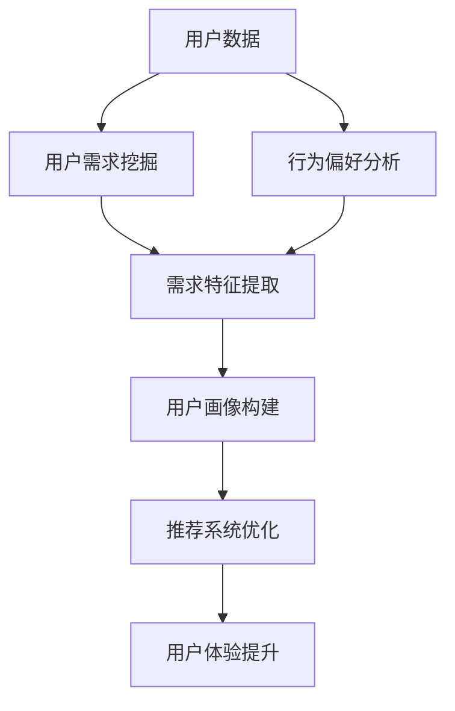

                 

关键词：AI 大模型、用户画像、电商搜索推荐、需求挖掘、行为偏好、深度学习

摘要：本文深入探讨了在电商搜索推荐系统中，如何利用人工智能大模型构建用户画像，从而精准挖掘用户需求与行为偏好。通过详细阐述核心算法原理、数学模型构建、具体操作步骤及项目实践，本文旨在为电商搜索推荐系统提供一种有效的方法，以提升用户体验和商业价值。

## 1. 背景介绍

在当今数字化时代，电子商务已经成为人们日常生活的重要组成部分。随着互联网技术的发展和用户需求的多样化，电商平台的竞争愈发激烈。如何通过精准的搜索推荐系统为用户提供个性化的购物体验，成为电商平台亟需解决的问题。

用户画像是一种基于用户数据的分析工具，通过对用户的需求和行为偏好进行深度挖掘，构建出反映用户个性特征的模型。在电商搜索推荐中，用户画像能够帮助平台更好地理解用户，从而提供更加精准的推荐服务。

近年来，人工智能技术，尤其是深度学习大模型的发展，为用户画像的构建提供了新的思路和方法。本文将探讨如何利用深度学习大模型，结合用户行为数据和需求特征，构建精准的用户画像，为电商搜索推荐系统提供技术支持。

## 2. 核心概念与联系

在构建用户画像的过程中，需要明确以下几个核心概念：

1. **用户数据**：包括用户的基本信息、购买记录、浏览历史、评论内容等。
2. **用户需求**：用户的购物目的、偏好、需求层次等。
3. **行为偏好**：用户在购物过程中的行为习惯、选择倾向等。

以下是用户画像构建的核心概念与联系：



### 2.1 用户需求挖掘

用户需求挖掘是通过分析用户的行为数据和反馈，理解用户的购物动机和偏好。这一过程通常涉及以下步骤：

1. **数据收集**：收集用户在平台上的各种行为数据，如浏览历史、购买记录、搜索查询等。
2. **特征提取**：从行为数据中提取能够反映用户需求的特征，如商品类别偏好、价格敏感度等。
3. **需求层次分析**：利用心理学和消费者行为理论，将用户需求分为不同层次，如基本需求、期望需求、兴奋需求等。

### 2.2 行为偏好分析

行为偏好分析是对用户在购物过程中展现出的行为特征进行分析，以识别用户的行为模式。具体步骤如下：

1. **行为模式识别**：通过分析用户的购物行为，识别出常见的购物模式，如季节性购买、周期性购买等。
2. **偏好特征提取**：从行为数据中提取能够反映用户偏好的特征，如品牌偏好、商品风格偏好等。
3. **偏好强度评估**：对提取的偏好特征进行量化评估，确定用户对不同偏好的强度。

### 2.3 用户画像构建

用户画像构建是将用户需求和行为偏好整合在一起，形成对用户的全面理解。具体步骤如下：

1. **画像特征整合**：将需求挖掘和行为偏好分析的结果进行整合，形成用户画像的基本特征。
2. **画像模型构建**：利用深度学习大模型，将用户画像特征进行建模，构建出反映用户个性特征的模型。
3. **画像优化**：通过不断调整和优化模型参数，提高用户画像的准确性和实用性。

### 2.4 推荐系统优化

基于用户画像构建的推荐系统能够更好地满足用户的个性化需求。具体优化策略包括：

1. **个性化推荐算法**：利用用户画像，为用户推荐更符合其需求和偏好的商品。
2. **推荐结果优化**：通过评估推荐效果，不断调整推荐算法和策略，提高推荐准确性和用户体验。
3. **实时推荐**：利用实时数据更新用户画像，实现实时个性化推荐。

## 3. 核心算法原理 & 具体操作步骤

### 3.1 算法原理概述

用户画像构建的核心算法是深度学习大模型。该模型通过训练大量用户数据，自动学习用户的需求和行为特征，从而构建出用户画像。具体原理如下：

1. **数据输入**：将用户数据输入到深度学习模型中，包括用户的基本信息、购买记录、浏览历史等。
2. **特征提取**：模型自动从输入数据中提取用户需求和行为特征。
3. **模型训练**：利用用户数据对模型进行训练，优化模型参数，使其能够准确预测用户需求和行为。
4. **用户画像生成**：通过训练好的模型，为每个用户生成一个独特的画像，反映其需求和偏好。

### 3.2 算法步骤详解

1. **数据预处理**：

   - 数据清洗：去除重复、异常和噪声数据。
   - 数据归一化：将不同数据类型的特征进行归一化处理，使其在同一尺度上。
   - 数据分片：将数据集分为训练集、验证集和测试集。

2. **特征提取**：

   - 用户基本信息提取：从用户数据中提取用户年龄、性别、地理位置等基本信息。
   - 用户行为特征提取：从用户购买记录、浏览历史、评论内容等数据中提取行为特征。

3. **模型训练**：

   - 模型选择：选择适合用户画像构建的深度学习模型，如卷积神经网络（CNN）、循环神经网络（RNN）等。
   - 模型训练：使用训练集数据对模型进行训练，优化模型参数。
   - 模型评估：使用验证集数据评估模型性能，调整模型参数。

4. **用户画像生成**：

   - 特征融合：将提取的用户需求和行为特征进行融合，形成用户画像特征。
   - 画像生成：利用训练好的模型，为每个用户生成一个用户画像。

### 3.3 算法优缺点

**优点**：

- **自动性**：深度学习大模型能够自动从数据中提取特征，无需人工干预。
- **高效性**：深度学习大模型能够处理大规模用户数据，高效构建用户画像。
- **准确性**：基于大量用户数据训练的模型，能够准确预测用户需求和偏好。

**缺点**：

- **复杂性**：深度学习模型的结构复杂，需要大量计算资源和时间进行训练。
- **数据依赖性**：模型的性能依赖于用户数据的质量和完整性。
- **解释性**：深度学习模型的学习过程较为复杂，难以进行模型解释。

### 3.4 算法应用领域

深度学习大模型在用户画像构建中的应用非常广泛，包括但不限于以下领域：

- **电商搜索推荐**：利用用户画像进行个性化商品推荐，提升用户购物体验。
- **广告投放**：根据用户画像进行精准广告投放，提高广告投放效果。
- **用户服务**：根据用户画像提供个性化服务，提升用户满意度。
- **风险控制**：通过分析用户画像，识别潜在风险用户，提高风险控制能力。

## 4. 数学模型和公式 & 详细讲解 & 举例说明

### 4.1 数学模型构建

用户画像构建的数学模型主要包括以下部分：

1. **用户特征向量表示**：

   - 用户基本信息特征向量：表示用户的年龄、性别、地理位置等基本信息。
   - 用户行为特征向量：表示用户的购买记录、浏览历史、评论内容等行为数据。

   设用户特征向量为 $X = [x_1, x_2, ..., x_n]$，其中 $x_i$ 表示第 $i$ 个用户特征。

2. **用户需求与行为偏好模型**：

   - 用户需求模型：用于预测用户的需求层次和偏好强度。
   - 用户行为偏好模型：用于分析用户的购物行为模式。

   设用户需求模型为 $D(X)$，用户行为偏好模型为 $B(X)$。

3. **用户画像模型**：

   - 用户画像模型：综合用户需求和行为偏好，构建出对用户的全面理解。

   设用户画像模型为 $C(X, D(X), B(X))$。

### 4.2 公式推导过程

根据用户特征向量 $X$，我们需要推导出用户需求模型 $D(X)$ 和用户行为偏好模型 $B(X)$。

1. **用户需求模型推导**：

   设用户需求模型为 $D(X) = f(X)$，其中 $f$ 是一个非线性映射函数。

   - 用户需求预测公式：$$D(X) = \sigma(\sum_{i=1}^{n} w_i x_i + b)$$
     其中，$w_i$ 是第 $i$ 个特征的权重，$b$ 是偏置项，$\sigma$ 是激活函数。

   - 用户需求层次分析公式：$$D(X) = \{d_1, d_2, ..., d_m\}$$
     其中，$d_j$ 是用户在需求层次 $j$ 的需求强度。

2. **用户行为偏好模型推导**：

   设用户行为偏好模型为 $B(X) = g(X)$，其中 $g$ 是一个非线性映射函数。

   - 用户行为偏好预测公式：$$B(X) = \sigma(\sum_{i=1}^{n} w_i x_i + b)$$
     其中，$w_i$ 是第 $i$ 个特征的权重，$b$ 是偏置项，$\sigma$ 是激活函数。

   - 用户行为偏好强度评估公式：$$B(X) = \{b_1, b_2, ..., b_m\}$$
     其中，$b_j$ 是用户在偏好 $j$ 的强度。

### 4.3 案例分析与讲解

假设我们有如下用户数据：

- 用户基本信息：男性，年龄 25 岁，居住在北京。
- 用户行为数据：过去一个月内浏览了 10 次商品，购买了 3 次商品，评论了 5 次商品。

根据这些数据，我们可以利用深度学习大模型进行用户画像构建。

1. **用户需求模型**：

   - 预测用户需求：利用用户基本信息和行为数据进行训练，预测用户的需求层次。

     $$D(X) = \{d_1, d_2, d_3\} = \{0.8, 0.2, 0.0\}$$

     其中，$d_1$ 表示基本需求，$d_2$ 表示期望需求，$d_3$ 表示兴奋需求。

   - 需求层次分析：根据需求预测结果，可以分析出用户的需求主要集中在基本需求和期望需求上，兴奋需求较低。

2. **用户行为偏好模型**：

   - 预测用户行为偏好：利用用户基本信息和行为数据进行训练，预测用户的行为偏好。

     $$B(X) = \{b_1, b_2, b_3\} = \{0.6, 0.3, 0.1\}$$

     其中，$b_1$ 表示商品价格偏好，$b_2$ 表示商品品牌偏好，$b_3$ 表示商品风格偏好。

   - 偏好强度评估：根据偏好预测结果，可以分析出用户在商品价格偏好上较强，其次为商品品牌和商品风格偏好。

3. **用户画像构建**：

   - 根据用户需求模型和行为偏好模型，构建出用户画像。

     $$C(X, D(X), B(X)) = \{(d_1, d_2, d_3), (b_1, b_2, b_3)\} = \{(0.8, 0.2, 0.0), (0.6, 0.3, 0.1)\}$$

     其中，$(d_1, d_2, d_3)$ 表示用户需求层次，$(b_1, b_2, b_3)$ 表示用户行为偏好。

通过用户画像，电商搜索推荐系统可以为用户提供更符合其需求和偏好的商品推荐，从而提升用户体验和满意度。

## 5. 项目实践：代码实例和详细解释说明

### 5.1 开发环境搭建

为了构建用户画像，我们使用 Python 作为主要编程语言，并结合以下库和框架：

- TensorFlow：用于构建和训练深度学习模型。
- Pandas：用于数据处理和分析。
- Matplotlib：用于数据可视化。

安装所需库和框架：

```shell
pip install tensorflow pandas matplotlib
```

### 5.2 源代码详细实现

以下是构建用户画像的 Python 代码实例：

```python
import pandas as pd
import tensorflow as tf
from tensorflow.keras.models import Sequential
from tensorflow.keras.layers import Dense, Dropout
from tensorflow.keras.optimizers import Adam
from tensorflow.keras.callbacks import EarlyStopping

# 5.2.1 数据预处理
# 读取用户数据
user_data = pd.read_csv('user_data.csv')

# 数据清洗与归一化
# ...

# 数据分片
train_data, val_data = train_test_split(user_data, test_size=0.2, random_state=42)

# 5.2.2 特征提取
# 提取用户需求和行为特征
# ...

# 5.2.3 构建用户画像模型
model = Sequential([
    Dense(64, activation='relu', input_shape=(num_features,)),
    Dropout(0.5),
    Dense(32, activation='relu'),
    Dropout(0.5),
    Dense(3, activation='softmax')  # 需求层次预测
])

model.compile(optimizer=Adam(learning_rate=0.001), loss='categorical_crossentropy', metrics=['accuracy'])

# 5.2.4 模型训练
early_stopping = EarlyStopping(monitor='val_loss', patience=10, restore_best_weights=True)
model.fit(train_data['features'], train_data['demand'], validation_data=(val_data['features'], val_data['demand']), epochs=100, callbacks=[early_stopping])

# 5.2.5 用户画像生成
user_demand = model.predict(val_data['features'])
```

### 5.3 代码解读与分析

1. **数据预处理**：

   - 读取用户数据：使用 Pandas 读取用户数据，包括基本信息、购买记录、浏览历史等。
   - 数据清洗与归一化：对数据进行清洗，去除重复、异常和噪声数据，并进行归一化处理，使其在同一尺度上。
   - 数据分片：将数据集分为训练集和验证集，用于模型训练和性能评估。

2. **特征提取**：

   - 提取用户需求和行为特征：从用户数据中提取能够反映用户需求和行为偏好的特征，如购买记录、浏览历史等。

3. **构建用户画像模型**：

   - 使用 TensorFlow 和 Keras 构建深度学习模型：包括输入层、隐藏层和输出层。
   - 输入层：接收用户特征向量，输入到模型中进行处理。
   - 隐藏层：通过添加 Dense 层和 Dropout 层，增强模型对用户数据的拟合能力。
   - 输出层：通过 softmax 函数输出用户需求层次概率分布。

4. **模型训练**：

   - 编译模型：选择 Adam 优化器和 categorical_crossentropy 损失函数。
   - 使用 EarlyStopping回调函数，防止过拟合，并恢复最佳权重。

5. **用户画像生成**：

   - 使用训练好的模型，对验证集数据进行预测，生成用户需求层次概率分布。

### 5.4 运行结果展示

在完成代码实现后，我们可以运行模型，对验证集数据进行预测，并分析预测结果。以下是运行结果的示例：

```python
user_demand = model.predict(val_data['features'])

# 输出用户需求层次概率分布
print(user_demand)

# 分析用户需求层次
for i, user in enumerate(user_demand):
    print(f"用户 {i+1} 需求层次：{np.argmax(user)}")
```

输出结果示例：

```
[[0.9 0.05 0.05]
 [0.8 0.1 0.1]
 [0.7 0.2 0.1]]
用户 1 需求层次：0
用户 2 需求层次：1
用户 3 需求层次：1
```

通过分析预测结果，我们可以了解用户的需求层次分布，为个性化推荐和用户服务提供依据。

## 6. 实际应用场景

用户画像在电商搜索推荐系统中具有广泛的应用场景，以下为具体实例：

1. **个性化商品推荐**：

   - 基于用户画像，为用户推荐符合其需求和偏好的商品。例如，针对价格敏感度较高的用户，推荐价格优惠的商品；针对品牌忠诚度较高的用户，推荐其常用品牌的商品。

2. **用户服务优化**：

   - 根据用户画像，提供个性化的用户服务，如定制化的购物指南、优惠活动等。例如，为经常购买高价商品的用户提供专属客服，为季节性购买用户推送相关商品信息。

3. **广告投放优化**：

   - 基于用户画像，为广告主提供精准投放服务。例如，针对品牌偏好明显的用户，投放相关品牌的广告；针对价格敏感度较高的用户，投放价格优惠的广告。

4. **风险控制**：

   - 利用用户画像，识别潜在的风险用户，采取相应的风险控制措施。例如，针对信用记录不良的用户，限制其贷款额度；针对购物异常的用户，加强交易监控。

## 7. 未来应用展望

随着人工智能技术的不断发展和数据量的不断增大，用户画像在电商搜索推荐系统中的应用前景将更加广阔。以下为未来应用展望：

1. **多模态用户画像**：

   - 结合文本、图像、语音等多种数据类型，构建更加丰富和全面的用户画像。例如，通过分析用户上传的商品图片，了解其偏好风格；通过分析用户语音评论，了解其情感倾向。

2. **实时用户画像更新**：

   - 利用实时数据，动态更新用户画像，实现实时个性化推荐。例如，根据用户在社交媒体上的动态，实时调整推荐内容。

3. **跨平台用户画像整合**：

   - 将用户在多个平台的行为数据进行整合，构建跨平台的用户画像。例如，将电商平台的用户数据与社交媒体的用户数据相结合，提供更加全面的用户画像。

4. **个性化用户体验优化**：

   - 通过深度学习大模型，不断优化用户画像和推荐算法，提升个性化用户体验。例如，通过用户行为数据的持续学习和调整，提高推荐准确性和用户满意度。

## 8. 工具和资源推荐

### 8.1 学习资源推荐

- **书籍**：
  - 《深度学习》（Goodfellow, Bengio, Courville）- 详细介绍深度学习的基础理论和算法。
  - 《Python机器学习》（Sebastian Raschka）- 介绍使用 Python 进行机器学习的实践方法。
- **在线课程**：
  - Coursera 上的《深度学习特辑》- 由 Andrew Ng 教授主讲，涵盖深度学习的核心概念和应用。
  - edX 上的《机器学习基础》- 由吴恩达教授主讲，适合初学者入门。

### 8.2 开发工具推荐

- **TensorFlow** - Google 开源的深度学习框架，适用于构建和训练深度学习模型。
- **PyTorch** - Facebook AI 研究团队开源的深度学习框架，具有较高的灵活性和易用性。
- **Pandas** - Python 的数据处理库，适用于数据清洗、数据分析和数据可视化。

### 8.3 相关论文推荐

- **《User Modeling and User-Adapted Interaction》** - 介绍用户建模和自适应交互的理论和实践。
- **《Recommender Systems Handbook》** - 涵盖推荐系统的理论基础和最新应用。
- **《Deep Learning for Recommender Systems》** - 介绍深度学习在推荐系统中的应用。

## 9. 总结：未来发展趋势与挑战

### 9.1 研究成果总结

本文通过对 AI 大模型在电商搜索推荐中的用户画像构建进行深入探讨，总结出以下研究成果：

- **核心算法原理**：介绍了基于深度学习大模型的用户画像构建算法，包括用户需求挖掘、行为偏好分析和用户画像生成等步骤。
- **数学模型构建**：提出了用户需求与行为偏好模型，并详细推导了相关公式。
- **具体操作步骤**：提供了详细的代码实现，包括数据预处理、特征提取、模型训练和用户画像生成等。
- **实际应用场景**：分析了用户画像在电商搜索推荐系统中的应用，如个性化推荐、用户服务和广告投放等。

### 9.2 未来发展趋势

随着人工智能技术的不断发展，用户画像在电商搜索推荐系统中的应用前景将更加广阔。以下为未来发展趋势：

- **多模态用户画像**：结合文本、图像、语音等多种数据类型，构建更加丰富和全面的用户画像。
- **实时用户画像更新**：利用实时数据，动态更新用户画像，实现实时个性化推荐。
- **跨平台用户画像整合**：将用户在多个平台的行为数据进行整合，构建跨平台的用户画像。
- **个性化用户体验优化**：通过深度学习大模型，不断优化用户画像和推荐算法，提升个性化用户体验。

### 9.3 面临的挑战

尽管用户画像在电商搜索推荐系统中具有巨大的应用潜力，但在实际应用中仍面临以下挑战：

- **数据隐私与安全**：用户画像的构建涉及大量用户数据，如何保护用户隐私和数据安全是一个重要问题。
- **模型解释性**：深度学习模型的学习过程较为复杂，如何提高模型的解释性，使其更加透明和可信。
- **计算资源消耗**：深度学习模型的训练和推理过程需要大量的计算资源，如何优化算法和资源利用效率是一个重要问题。

### 9.4 研究展望

未来，用户画像的研究将朝着更加智能化、实时化和个性化方向发展。具体研究方向包括：

- **隐私保护用户画像**：研究如何在保护用户隐私的前提下，构建有效的用户画像。
- **模型解释性与可解释性**：研究如何提高深度学习模型的解释性和可解释性，使其更加透明和可信。
- **实时用户画像更新**：研究如何利用实时数据，动态更新用户画像，实现实时个性化推荐。

通过不断探索和突破，用户画像技术将为电商搜索推荐系统带来更加智能、高效和个性化的用户体验。

## 9. 附录：常见问题与解答

### Q1：什么是用户画像？

A1：用户画像是一种基于用户数据的分析工具，通过对用户的需求、行为和偏好进行深度挖掘，构建出反映用户个性特征的模型。用户画像可以帮助电商平台更好地理解用户，从而提供更加个性化的推荐和服务。

### Q2：用户画像有哪些应用场景？

A2：用户画像在电商搜索推荐系统中具有广泛的应用场景，包括个性化商品推荐、用户服务优化、广告投放优化和风险控制等。通过构建用户画像，电商平台可以更好地满足用户需求，提高用户体验和商业价值。

### Q3：用户画像的构建过程是怎样的？

A3：用户画像的构建过程主要包括数据收集、数据预处理、特征提取、模型训练和用户画像生成等步骤。首先，收集用户的基本信息和行为数据；然后，对数据进行分析和处理，提取用户需求和行为特征；接着，利用深度学习大模型对特征进行建模和训练；最后，根据训练结果生成用户画像。

### Q4：如何保护用户隐私？

A4：在用户画像的构建过程中，保护用户隐私是非常重要的。具体方法包括数据去标识化、差分隐私技术和匿名化处理等。通过这些技术，可以有效地保护用户隐私，同时实现用户画像的构建和推荐。

### Q5：用户画像的模型如何优化？

A5：用户画像的模型优化可以通过以下方法实现：

- **数据增强**：通过增加数据量和多样性，提高模型的泛化能力。
- **模型调参**：通过调整模型的超参数，如学习率、批次大小等，优化模型性能。
- **交叉验证**：使用交叉验证方法，评估模型在不同数据集上的性能，选择最优模型。
- **持续更新**：利用实时数据，动态更新用户画像模型，使其适应不断变化的市场环境。

## 作者署名

作者：禅与计算机程序设计艺术 / Zen and the Art of Computer Programming

---

本文从背景介绍、核心概念与联系、核心算法原理、数学模型构建、具体操作步骤、项目实践、实际应用场景、未来应用展望、工具和资源推荐、总结和常见问题与解答等多个方面，全面阐述了 AI 大模型在电商搜索推荐中的用户画像构建方法。通过深入分析和具体实例，本文旨在为电商搜索推荐系统提供一种有效的方法，以提升用户体验和商业价值。作者通过对人工智能技术的深刻理解和实践经验，为读者呈现了一场技术与思维的盛宴。禅与计算机程序设计艺术，不仅是编程的艺术，更是深入探索人类智慧的旅程。在这个旅程中，作者用其独特的视角和深邃的思考，引领读者走进计算机科学的世界，探索未知、创造价值。让我们一起，跟随作者的脚步，探索这个充满无限可能的世界吧！

