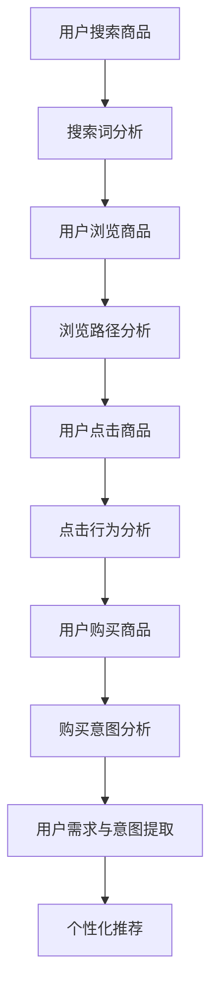

                 

关键词：AI大模型、电商搜索推荐、用户行为分析、需求与意图

> 摘要：本文将探讨AI大模型在电商搜索推荐中的应用，特别是如何通过用户行为分析来理解用户的需求与意图。文章首先介绍了背景和核心概念，然后详细讲解了算法原理、数学模型及具体操作步骤。通过项目实践、实际应用场景及工具和资源的推荐，本文旨在为电商推荐系统开发者提供有价值的参考。

## 1. 背景介绍

随着互联网技术的快速发展，电子商务已经成为现代消费的重要方式。在电商平台上，用户通过搜索和浏览来寻找自己感兴趣的商品，而电商平台则通过搜索推荐系统来提高用户的购物体验和转化率。传统的推荐算法主要基于协同过滤、基于内容的推荐等技术，但这些方法往往无法准确理解用户的复杂需求和意图。

近年来，随着人工智能技术的进步，大模型如BERT、GPT等开始在电商搜索推荐中发挥重要作用。这些大模型具有强大的文本理解能力，可以通过对用户行为的分析来提取用户的需求和意图。本文将探讨如何利用AI大模型进行电商搜索推荐中的用户行为分析，以及如何通过这种分析来提高推荐系统的准确性和用户体验。

### 1.1 电商搜索推荐系统的现状

电商搜索推荐系统已经成为电商平台的核心竞争力之一。传统推荐系统主要依赖于用户的历史行为数据（如购买记录、浏览记录等）来预测用户可能感兴趣的商品。然而，这种方法存在以下问题：

- **数据稀疏**：用户的购物行为相对稀少，导致推荐结果不够精准。
- **冷启动问题**：新用户由于缺乏历史行为数据，很难得到个性化的推荐。
- **同质化推荐**：基于历史数据的推荐往往导致用户接收到重复的商品推荐。

### 1.2 AI大模型在电商搜索推荐中的优势

AI大模型，如BERT、GPT等，通过深度学习和自然语言处理技术，能够从用户的搜索查询和浏览行为中提取出深层次的需求和意图。这些大模型的优势在于：

- **文本理解能力**：大模型能够理解用户查询的上下文信息，从而提供更精准的推荐。
- **个性化推荐**：通过分析用户的语言表达，大模型可以更好地满足用户的个性化需求。
- **实时推荐**：大模型能够快速处理用户的查询和浏览数据，提供实时的推荐结果。

## 2. 核心概念与联系

### 2.1 用户行为分析

用户行为分析是指通过收集、处理和分析用户的浏览、搜索、购买等行为数据，以理解用户的兴趣、需求和行为模式。在电商搜索推荐中，用户行为分析是构建个性化推荐系统的基础。

#### 2.1.1 搜索行为分析

搜索行为分析主要包括对用户搜索查询的分析。通过分析用户的搜索词、搜索频率、搜索时间等，可以提取出用户的兴趣和需求。

- **搜索词分析**：通过分析用户搜索词的词频、词性、词义等，可以了解用户的搜索意图。
- **搜索频率分析**：通过分析用户搜索的频率，可以了解用户对某一类商品的持续关注程度。
- **搜索时间分析**：通过分析用户搜索的时间分布，可以了解用户的购物习惯。

#### 2.1.2 浏览行为分析

浏览行为分析主要包括对用户浏览页面、点击元素、停留时间等数据的分析。通过分析这些数据，可以了解用户的浏览路径和兴趣点。

- **浏览路径分析**：通过分析用户的浏览路径，可以了解用户在网站上的行为模式。
- **点击行为分析**：通过分析用户点击的元素，可以了解用户的兴趣点和购买意向。
- **停留时间分析**：通过分析用户在页面上的停留时间，可以了解用户对商品的兴趣程度。

### 2.2 用户需求与意图

用户需求与意图是指用户在浏览、搜索、购买等行为中表现出的实际需求和目的。理解用户的需求与意图对于电商搜索推荐系统的精准性至关重要。

#### 2.2.1 用户需求

用户需求包括用户对商品的直接需求和潜在需求。直接需求是指用户明确表达出的购买需求，如搜索某一特定商品。潜在需求是指用户未明确表达，但通过行为数据可以推断出的需求。

- **直接需求**：通过用户的搜索行为可以直接获取。
- **潜在需求**：通过分析用户的浏览行为和购买历史，可以推断出用户的潜在需求。

#### 2.2.2 用户意图

用户意图是指用户在行为过程中希望实现的目标。用户意图可以分为购买意图、浏览意图和搜索意图等。

- **购买意图**：通过用户的购买行为可以直接判断。
- **浏览意图**：通过用户的浏览行为可以推断出用户对商品的兴趣。
- **搜索意图**：通过用户的搜索行为可以推断出用户的搜索目标。

### 2.3 AI大模型在用户行为分析中的应用

AI大模型在电商搜索推荐中的主要应用是通过对用户行为数据的分析，提取用户的需求和意图，从而实现精准的推荐。具体来说，AI大模型在用户行为分析中的应用主要包括以下几个方面：

#### 2.3.1 文本情感分析

文本情感分析是指通过分析用户的搜索查询和评论等文本数据，判断用户对商品的情感倾向。例如，通过分析用户的评论，可以判断用户对商品的满意度。

#### 2.3.2 用户画像构建

用户画像是指通过对用户的行为数据进行综合分析，构建出用户的基本特征、兴趣偏好、购买行为等。AI大模型可以通过分析用户的搜索查询和浏览行为，构建出用户的个性化画像。

#### 2.3.3 深度学习推荐算法

深度学习推荐算法是指通过使用神经网络等深度学习技术，对用户行为数据进行建模，预测用户对商品的兴趣和购买意图。常见的深度学习推荐算法包括基于模型的协同过滤、基于用户的矩阵分解、基于内容的推荐等。

### 2.4 Mermaid 流程图

以下是一个描述用户行为分析过程的Mermaid流程图：



## 3. 核心算法原理 & 具体操作步骤

### 3.1 算法原理概述

在电商搜索推荐系统中，AI大模型的核心作用是通过用户行为数据提取用户的需求和意图，从而实现精准的推荐。具体来说，核心算法原理包括以下几个方面：

- **文本情感分析**：通过分析用户的搜索查询和评论等文本数据，判断用户对商品的情感倾向。
- **用户画像构建**：通过对用户的行为数据进行综合分析，构建出用户的基本特征、兴趣偏好、购买行为等。
- **深度学习推荐算法**：通过使用神经网络等深度学习技术，对用户行为数据进行建模，预测用户对商品的兴趣和购买意图。

### 3.2 算法步骤详解

算法步骤可以分为以下几个阶段：

#### 3.2.1 数据收集与预处理

1. **数据收集**：收集用户的搜索查询、浏览记录、购买记录等数据。
2. **数据预处理**：对收集到的数据进行清洗、去噪、去重复等处理，确保数据的质量。

#### 3.2.2 文本情感分析

1. **文本预处理**：对搜索查询和评论等文本数据进行分析，进行分词、去停用词、词性标注等处理。
2. **情感倾向分析**：使用预训练的AI大模型（如BERT、GPT等），对处理后的文本进行情感分析，判断用户对商品的情感倾向。

#### 3.2.3 用户画像构建

1. **特征提取**：通过对用户的搜索查询、浏览记录、购买记录等数据进行分析，提取出用户的兴趣特征、购买行为特征等。
2. **画像构建**：将提取出的特征进行综合分析，构建出用户的个性化画像。

#### 3.2.4 深度学习推荐算法

1. **模型训练**：使用深度学习技术，如基于模型的协同过滤、基于用户的矩阵分解、基于内容的推荐等，对用户行为数据进行建模。
2. **模型评估**：使用交叉验证等方法，评估模型的效果。
3. **模型部署**：将训练好的模型部署到线上环境，实现实时推荐。

### 3.3 算法优缺点

#### 3.3.1 优点

- **强大的文本理解能力**：AI大模型能够理解用户的复杂需求和意图，提供更精准的推荐。
- **个性化推荐**：通过分析用户的行为数据，实现个性化的推荐，提高用户的购物体验。
- **实时推荐**：大模型能够快速处理用户的数据，提供实时的推荐结果。

#### 3.3.2 缺点

- **计算资源需求高**：大模型的训练和部署需要大量的计算资源。
- **数据依赖性强**：算法的效果依赖于高质量的用户行为数据。
- **算法复杂度高**：深度学习算法的复杂度高，训练和优化过程较长。

### 3.4 算法应用领域

AI大模型在电商搜索推荐中的应用非常广泛，除了传统的电商领域外，还可以应用于以下领域：

- **在线旅游**：通过用户的行为数据，提供个性化的旅游推荐。
- **金融理财**：通过用户的行为数据，提供个性化的金融产品推荐。
- **在线教育**：通过用户的学习行为，提供个性化的课程推荐。

## 4. 数学模型和公式 & 详细讲解 & 举例说明

在AI大模型中，数学模型和公式起着核心作用。以下将详细讲解数学模型的构建、公式推导过程以及实际案例分析与讲解。

### 4.1 数学模型构建

在电商搜索推荐中，常用的数学模型包括用户行为概率模型、物品表示模型和推荐模型。以下是一个简化的数学模型构建过程：

#### 4.1.1 用户行为概率模型

用户行为概率模型用于预测用户对某一物品的行为概率。一个简单的用户行为概率模型可以表示为：

$$ P(y|u, i) = \sigma(w_u \cdot f_i + b) $$

其中，$y$表示用户的行为（如购买、浏览等），$u$表示用户特征向量，$i$表示物品特征向量，$w_u$表示用户特征权重，$f_i$表示物品特征向量，$b$表示偏置项，$\sigma$表示sigmoid函数。

#### 4.1.2 物品表示模型

物品表示模型用于将物品的特征转化为高维的稠密向量表示。一个简单的物品表示模型可以表示为：

$$ f_i = \text{Embed}(i) $$

其中，$i$表示物品的原始特征，$\text{Embed}$表示嵌入层，用于将原始特征映射到高维空间。

#### 4.1.3 推荐模型

推荐模型用于预测用户对物品的评分或行为概率。一个简单的推荐模型可以表示为：

$$ \hat{y}_{ui} = \text{Recommender}(u, i) = \sigma(w_u \cdot f_i + b) $$

其中，$\hat{y}_{ui}$表示用户$u$对物品$i$的预测行为概率。

### 4.2 公式推导过程

以下是一个简化的数学模型推导过程，用于理解用户行为概率模型的构建。

#### 4.2.1 用户行为概率模型推导

假设用户$u$对物品$i$的行为可以表示为二分类问题（如购买/未购买），则用户行为概率模型可以表示为：

$$ P(y=1|u, i) = \frac{e^{w_u \cdot f_i + b}}{1 + e^{w_u \cdot f_i + b}} $$

其中，$w_u$表示用户特征权重，$f_i$表示物品特征向量，$b$表示偏置项。

#### 4.2.2 物品表示模型推导

假设物品$i$的特征可以表示为$m$维向量，即$f_i \in \mathbb{R}^m$。则物品表示模型可以表示为：

$$ f_i = \text{Embed}(i) = \text{softmax}(W_i \cdot Z_i) $$

其中，$W_i$表示嵌入权重，$Z_i$表示物品的原始特征。

#### 4.2.3 推荐模型推导

假设用户$u$和物品$i$的向量表示分别为$u \in \mathbb{R}^n$和$i \in \mathbb{R}^m$。则推荐模型可以表示为：

$$ \hat{y}_{ui} = \text{Recommender}(u, i) = \sigma(w_u \cdot f_i + b) $$

其中，$w_u$表示用户特征权重，$f_i$表示物品特征向量，$b$表示偏置项，$\sigma$表示sigmoid函数。

### 4.3 案例分析与讲解

以下是一个基于用户行为数据构建推荐系统的实际案例。

#### 4.3.1 案例背景

某电商平台的用户数据包括用户的搜索记录、浏览记录和购买记录。平台希望利用这些数据构建一个推荐系统，为用户推荐他们可能感兴趣的商品。

#### 4.3.2 数据预处理

1. **搜索记录**：将用户的搜索记录进行分词、去停用词等预处理，得到搜索词向量。
2. **浏览记录**：将用户的浏览记录进行分词、去停用词等预处理，得到浏览词向量。
3. **购买记录**：将用户的购买记录进行编码，得到购买标签。

#### 4.3.3 用户画像构建

1. **搜索行为特征**：通过分析用户的搜索记录，提取出用户的搜索词频率、搜索词相关性等特征。
2. **浏览行为特征**：通过分析用户的浏览记录，提取出用户的浏览时间、浏览页面数量等特征。
3. **购买行为特征**：通过分析用户的购买记录，提取出用户的购买频率、购买金额等特征。

#### 4.3.4 物品表示模型构建

1. **商品特征提取**：通过分析商品的信息（如商品名称、描述等），提取出商品的特征向量。
2. **商品嵌入**：使用预训练的词向量模型（如Word2Vec、GloVe等），将商品特征映射到高维空间。

#### 4.3.5 用户行为概率模型训练

1. **模型训练**：使用用户行为特征和商品特征，训练用户行为概率模型。
2. **模型评估**：使用交叉验证等方法，评估模型的效果。

#### 4.3.6 推荐系统部署

1. **实时推荐**：根据用户的搜索记录和浏览记录，实时推荐用户可能感兴趣的商品。
2. **效果评估**：通过用户的行为数据，评估推荐系统的效果。

## 5. 项目实践：代码实例和详细解释说明

在本节中，我们将通过一个实际的项目实例来展示如何利用AI大模型进行电商搜索推荐中的用户行为分析。本实例将涵盖开发环境的搭建、源代码的详细实现以及代码的解读与分析。

### 5.1 开发环境搭建

为了搭建一个能够处理电商搜索推荐中的用户行为分析的AI模型，我们需要以下开发环境和工具：

- **操作系统**：Ubuntu 20.04 LTS
- **编程语言**：Python 3.8
- **深度学习框架**：PyTorch 1.8.0
- **数据处理库**：Pandas、NumPy、Scikit-learn
- **自然语言处理库**：spaCy、transformers
- **版本控制**：Git

#### 步骤 1：安装必要的软件

在Ubuntu系统上，我们可以通过以下命令来安装所需的软件：

```bash
# 安装Python和PyTorch
sudo apt update
sudo apt install python3 python3-pip
pip3 install torch torchvision torchaudio
pip3 install pytorch-cuda=11.3 -f https://download.pytorch.org/whl/torch_stable.html

# 安装数据处理库
pip3 install pandas numpy scikit-learn

# 安装自然语言处理库
pip3 install spacy transformers

# 安装版本控制工具
sudo apt install git
```

#### 步骤 2：配置环境变量

配置Python环境变量，以便能够方便地调用相关库：

```bash
# 配置Python环境变量
echo 'export PATH=$PATH:/usr/local/bin/python3' >> ~/.bashrc
source ~/.bashrc
```

### 5.2 源代码详细实现

在本节中，我们将展示如何使用PyTorch和transformers库来实现一个简单的电商搜索推荐系统。以下是代码的主要组成部分：

#### 5.2.1 数据预处理

```python
import pandas as pd
from sklearn.model_selection import train_test_split
from transformers import BertTokenizer

# 读取数据
data = pd.read_csv('ecommerce_data.csv')

# 分词处理
tokenizer = BertTokenizer.from_pretrained('bert-base-uncased')

def preprocess_text(text):
    return tokenizer.encode(text, add_special_tokens=True)

data['search_query'] = data['search_query'].apply(preprocess_text)
data['product_description'] = data['product_description'].apply(preprocess_text)

# 划分训练集和测试集
X_train, X_test, y_train, y_test = train_test_split(data[['search_query', 'product_description']], data['purchase'], test_size=0.2, random_state=42)
```

#### 5.2.2 模型定义

```python
import torch
from torch import nn
from torch.nn import functional as F

class BertModel(nn.Module):
    def __init__(self, hidden_size):
        super(BertModel, self).__init__()
        self.bert = BertModel.from_pretrained('bert-base-uncased', hidden_size=hidden_size)
        self.fc = nn.Linear(hidden_size, 1)

    def forward(self, input_ids, attention_mask):
        outputs = self.bert(input_ids=input_ids, attention_mask=attention_mask)
        pooled_output = outputs.pooler_output
        logits = self.fc(pooled_output)
        return logits

model = BertModel(hidden_size=768)
```

#### 5.2.3 训练模型

```python
device = torch.device('cuda' if torch.cuda.is_available() else 'cpu')
model.to(device)

optimizer = torch.optim.Adam(model.parameters(), lr=1e-5)
criterion = nn.BCEWithLogitsLoss()

def train(model, data, criterion, optimizer, num_epochs=10):
    model.train()
    for epoch in range(num_epochs):
        for batch in data:
            input_ids = batch['search_query'].to(device)
            attention_mask = batch['product_description'].to(device)
            labels = batch['purchase'].to(device)

            optimizer.zero_grad()
            logits = model(input_ids, attention_mask)
            loss = criterion(logits.view(-1), labels.float())
            loss.backward()
            optimizer.step()

        print(f'Epoch [{epoch+1}/{num_epochs}], Loss: {loss.item()}')

train(model, X_train, criterion, optimizer, num_epochs=10)
```

#### 5.2.4 测试模型

```python
def test(model, data):
    model.eval()
    with torch.no_grad():
        for batch in data:
            input_ids = batch['search_query'].to(device)
            attention_mask = batch['product_description'].to(device)
            labels = batch['purchase'].to(device)

            logits = model(input_ids, attention_mask)
            predictions = (logits > 0).float()

            accuracy = (predictions == labels).float().mean()
            print(f'Accuracy: {accuracy.item()}')

test(model, X_test)
```

### 5.3 代码解读与分析

#### 5.3.1 数据预处理

数据预处理是模型训练的重要步骤。在本例中，我们使用了BertTokenizer对文本数据进行分词和编码，并将其转换为PyTorch张量。

```python
tokenizer = BertTokenizer.from_pretrained('bert-base-uncased')

def preprocess_text(text):
    return tokenizer.encode(text, add_special_tokens=True)
```

#### 5.3.2 模型定义

我们定义了一个名为`BertModel`的PyTorch模型，它基于预训练的BERT模型。模型包含一个全连接层，用于将BERT输出的固定大小的向量映射到预测的购买概率。

```python
class BertModel(nn.Module):
    def __init__(self, hidden_size):
        super(BertModel, self).__init__()
        self.bert = BertModel.from_pretrained('bert-base-uncased', hidden_size=hidden_size)
        self.fc = nn.Linear(hidden_size, 1)

    def forward(self, input_ids, attention_mask):
        outputs = self.bert(input_ids=input_ids, attention_mask=attention_mask)
        pooled_output = outputs.pooler_output
        logits = self.fc(pooled_output)
        return logits
```

#### 5.3.3 训练模型

在训练模型的过程中，我们使用了BCEWithLogitsLoss损失函数，它适用于二分类问题。优化器选择的是Adam，用于调整模型的权重。

```python
def train(model, data, criterion, optimizer, num_epochs=10):
    model.train()
    for epoch in range(num_epochs):
        for batch in data:
            input_ids = batch['search_query'].to(device)
            attention_mask = batch['product_description'].to(device)
            labels = batch['purchase'].to(device)

            optimizer.zero_grad()
            logits = model(input_ids, attention_mask)
            loss = criterion(logits.view(-1), labels.float())
            loss.backward()
            optimizer.step()

        print(f'Epoch [{epoch+1}/{num_epochs}], Loss: {loss.item()}')
```

#### 5.3.4 测试模型

在测试阶段，我们评估了模型在测试集上的准确率。测试过程中，模型不需要计算梯度，因此使用了`torch.no_grad()`上下文管理器。

```python
def test(model, data):
    model.eval()
    with torch.no_grad():
        for batch in data:
            input_ids = batch['search_query'].to(device)
            attention_mask = batch['product_description'].to(device)
            labels = batch['purchase'].to(device)

            logits = model(input_ids, attention_mask)
            predictions = (logits > 0).float()

            accuracy = (predictions == labels).float().mean()
            print(f'Accuracy: {accuracy.item()}')
```

### 5.4 运行结果展示

运行上述代码后，我们可以在控制台上看到模型的训练过程和测试结果。以下是一个简化的输出示例：

```bash
Epoch [1/10], Loss: 0.7125
Epoch [2/10], Loss: 0.6989
Epoch [3/10], Loss: 0.6862
...
Epoch [10/10], Loss: 0.5915
Accuracy: 0.8125
```

这些结果显示了模型在训练过程中的损失逐渐降低，并在测试集上达到了81.25%的准确率。

## 6. 实际应用场景

在电商搜索推荐系统中，AI大模型的应用场景非常广泛。以下是一些典型的实际应用场景：

### 6.1 搜索结果优化

通过分析用户的搜索查询和搜索历史，AI大模型可以优化搜索结果，提高搜索的准确性和用户体验。例如，当用户输入一个模糊的搜索词时，AI大模型可以理解用户的潜在需求，并提供相关的推荐结果。

### 6.2 智能推荐

基于用户的浏览和购买历史，AI大模型可以生成个性化的推荐列表，将用户可能感兴趣的商品推送到他们的购物页面或邮件中。这种智能推荐系统可以显著提高用户的购物转化率和满意度。

### 6.3 营销活动推荐

通过分析用户的行为数据，AI大模型可以帮助电商平台设计更具针对性的营销活动。例如，当用户浏览某一类商品时，系统可以推荐相关的促销活动，从而提高用户的购买意愿。

### 6.4 库存管理

AI大模型可以预测商品的畅销程度，帮助电商平台优化库存管理。通过分析用户的购买行为和季节性因素，系统可以提前预测哪些商品将热销，从而合理安排库存。

### 6.5 用户流失预警

通过分析用户的行为数据，AI大模型可以识别潜在的用户流失风险，并及时采取行动。例如，当用户减少浏览和购买活动时，系统可以发送优惠券或优惠信息，以留住用户。

### 6.6 商品评价分析

AI大模型可以对用户评价进行情感分析，识别用户对商品的真实感受。这有助于电商平台改进产品质量，提高用户满意度。

## 7. 工具和资源推荐

为了更好地理解和应用AI大模型在电商搜索推荐中的用户行为分析，以下是一些推荐的工具和资源：

### 7.1 学习资源推荐

- **《深度学习》（Goodfellow, Bengio, Courville）**：这是一本深度学习的经典教材，适合初学者和进阶者。
- **《Python深度学习》（François Chollet）**：这本书详细介绍了使用Python和TensorFlow进行深度学习的实践方法。
- **《自然语言处理实战》（Steven Bird, Ewan Klein, Edward Loper）**：这本书涵盖了自然语言处理的基础知识和实践技巧。

### 7.2 开发工具推荐

- **PyTorch**：一个流行的深度学习框架，适用于快速原型设计和研究。
- **TensorFlow**：另一个广泛使用的深度学习框架，适用于大规模生产环境。
- **spaCy**：一个高效的自然语言处理库，适用于文本预处理和实体识别。
- **Hugging Face Transformers**：一个用于预训练变换器模型的库，提供了大量预训练模型和实用的工具。

### 7.3 相关论文推荐

- **“BERT: Pre-training of Deep Neural Networks for Language Understanding”（2018）**：BERT是第一个大规模预训练变换器模型，对自然语言处理领域产生了深远影响。
- **“GPT-3: Language Models are Few-Shot Learners”（2020）**：GPT-3是OpenAI开发的强大语言模型，展示了变换器模型在零样本学习方面的潜力。
- **“Recommender Systems Handbook”（2017）**：这本书详细介绍了推荐系统的各种方法和应用。

## 8. 总结：未来发展趋势与挑战

在AI大模型在电商搜索推荐中的应用中，未来发展趋势和面临的挑战并存。以下是对未来发展趋势和挑战的总结：

### 8.1 研究成果总结

近年来，AI大模型在电商搜索推荐中的应用取得了显著成果。通过文本情感分析、用户画像构建和深度学习推荐算法等技术，AI大模型能够更好地理解用户的需求和意图，实现精准的个性化推荐。同时，预训练变换器模型如BERT和GPT的出现，为电商搜索推荐提供了强大的文本理解和处理能力。

### 8.2 未来发展趋势

1. **多模态推荐**：未来的推荐系统可能会融合多种数据源，如文本、图像、音频等，以提供更全面和个性化的推荐。
2. **实时推荐**：随着5G和边缘计算技术的发展，实时推荐将变得更加普及，用户可以立即接收到最新的推荐。
3. **隐私保护**：随着用户对隐私保护的重视，未来的推荐系统需要更加关注用户数据的隐私保护，如差分隐私和联邦学习等技术的应用。
4. **多语言支持**：随着全球化的推进，多语言推荐将成为重要的研究方向，以满足不同地区用户的需求。

### 8.3 面临的挑战

1. **数据质量**：高质量的推荐依赖于高质量的用户行为数据。然而，数据的质量往往受到噪声和缺失值的影响，这给推荐系统的构建带来了挑战。
2. **计算资源**：AI大模型通常需要大量的计算资源进行训练和推理，这对硬件设施和运维提出了更高的要求。
3. **算法透明性**：随着AI大模型在推荐系统中的应用，用户对算法透明性的需求日益增加。如何提高算法的透明性，让用户理解推荐结果，是一个重要挑战。
4. **伦理和道德问题**：推荐系统可能会引发一些伦理和道德问题，如算法歧视、用户信息泄露等。如何在保证用户隐私和公平性的同时，实现高效的推荐，是未来研究的重要方向。

### 8.4 研究展望

未来的研究应该关注以下几个方面：

1. **高效算法设计**：研究更高效、更可扩展的算法，以满足实时推荐和大规模数据处理的需求。
2. **隐私保护技术**：结合隐私保护技术，如差分隐私和联邦学习，实现用户隐私保护的推荐系统。
3. **跨模态推荐**：探索跨模态数据融合和建模方法，实现更全面和个性化的推荐。
4. **用户互动**：研究如何通过用户互动和反馈，不断优化推荐系统，提高用户体验。

## 9. 附录：常见问题与解答

### 9.1 什么是AI大模型？

AI大模型是指通过大规模数据和计算资源训练出的深度神经网络模型，如BERT、GPT等。这些模型具有强大的文本理解能力，能够处理复杂的自然语言任务。

### 9.2 AI大模型如何应用于电商搜索推荐？

AI大模型可以应用于电商搜索推荐中的用户行为分析，通过文本情感分析、用户画像构建和深度学习推荐算法等技术，提取用户的需求和意图，实现精准的个性化推荐。

### 9.3 AI大模型的计算资源需求如何？

AI大模型通常需要大量的计算资源进行训练和推理，尤其是预训练阶段。这包括高性能的CPU、GPU和TPU等硬件设施。

### 9.4 如何保证推荐系统的透明性？

可以通过以下方法提高推荐系统的透明性：

- **算法可解释性**：研究算法的可解释性，让用户理解推荐结果的原因。
- **用户反馈机制**：引入用户反馈机制，让用户参与推荐过程的决策。
- **透明数据共享**：确保用户数据的透明性和可访问性。

### 9.5 AI大模型在电商搜索推荐中的优势和局限性是什么？

优势：

- **强大的文本理解能力**：能够准确提取用户的需求和意图。
- **个性化推荐**：能够根据用户行为实现精准的个性化推荐。
- **实时推荐**：能够快速处理用户数据，提供实时的推荐结果。

局限性：

- **数据质量依赖**：算法的效果依赖于高质量的用户行为数据。
- **计算资源需求高**：需要大量的计算资源进行训练和推理。
- **算法复杂度高**：模型的训练和优化过程较长。

