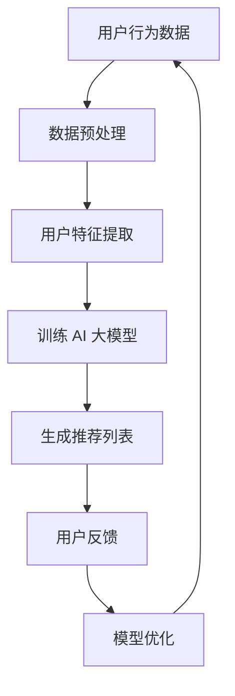

                 

 关键词：电商搜索推荐，AI 大模型，用户行为分析，需求理解，购买意图，算法原理，数学模型，项目实践，应用场景，未来展望

> 摘要：本文深入探讨了 AI 大模型在电商搜索推荐领域的应用，特别是在用户行为分析方面的关键作用。通过梳理用户需求与购买意图，文章详细阐述了 AI 大模型的工作原理、算法步骤、数学模型以及实际应用案例，旨在为电商行业提供科学有效的用户行为分析方案，助力精准推荐和用户体验优化。

## 1. 背景介绍

随着互联网技术的快速发展，电商行业已经成为全球经济增长的重要引擎。然而，面对海量的商品信息和不断变化的用户需求，传统的推荐算法往往难以满足用户期望，导致推荐效果不佳。为了提升用户体验，电商平台开始寻求更加智能化、个性化的推荐解决方案。

近年来，人工智能（AI）技术，尤其是大模型（Large Model）的迅猛发展，为电商搜索推荐领域带来了新的突破。AI 大模型具有强大的数据处理和分析能力，能够从海量数据中挖掘用户的行为特征，理解用户的需求和购买意图，从而实现精准的推荐。本文将围绕 AI 大模型在电商搜索推荐中的用户行为分析进行探讨，为电商行业提供有益的参考。

## 2. 核心概念与联系

### 2.1. 电商搜索推荐系统

电商搜索推荐系统是电商平台的核心功能之一，旨在根据用户的历史行为和偏好，为用户提供个性化的商品推荐。传统的推荐系统主要采用基于内容的推荐（Content-based Filtering）和协同过滤（Collaborative Filtering）两种方法。然而，这些方法在应对复杂用户行为和动态变化时存在一定的局限性。

### 2.2. AI 大模型

AI 大模型，如深度学习模型、神经网络等，具有强大的数据处理和分析能力。通过大量的数据训练，AI 大模型能够自动学习用户的行为模式、偏好和需求，从而实现精准的推荐。与传统的推荐算法相比，AI 大模型在处理复杂问题和应对动态变化方面具有显著优势。

### 2.3. 用户行为分析

用户行为分析是指通过对用户在电商平台上的行为数据进行分析，挖掘用户的需求、偏好和购买意图。用户行为分析是电商搜索推荐系统的关键环节，直接影响推荐效果和用户体验。

### 2.4. Mermaid 流程图

Mermaid 是一种基于文本描述的绘图工具，能够方便地生成各种图表，包括流程图、时序图等。以下是一个简单的 Mermaid 流程图，用于描述电商搜索推荐系统的整体架构：



## 3. 核心算法原理 & 具体操作步骤

### 3.1. 算法原理概述

AI 大模型在电商搜索推荐中的核心作用是用户行为分析和需求理解。通过深度学习等技术，AI 大模型能够从用户历史行为数据中自动学习用户的行为模式、偏好和需求，从而生成个性化的推荐列表。以下是 AI 大模型在电商搜索推荐中的具体操作步骤：

### 3.2. 算法步骤详解

#### 3.2.1. 数据预处理

数据预处理是 AI 大模型训练的第一步，主要包括数据清洗、去重、格式化等操作。通过数据预处理，确保数据质量，为后续训练过程提供可靠的数据基础。

#### 3.2.2. 用户特征提取

用户特征提取是将原始数据转换为 AI 大模型可处理的形式。通过分析用户在电商平台上的行为数据，提取用户的基本信息、浏览记录、购买记录等特征，为后续建模提供数据支持。

#### 3.2.3. 训练 AI 大模型

训练 AI 大模型是用户行为分析和需求理解的核心步骤。通过大量的用户行为数据训练，AI 大模型能够自动学习用户的行为模式、偏好和需求，从而生成个性化的推荐列表。

#### 3.2.4. 生成推荐列表

生成推荐列表是将训练好的 AI 大模型应用于实际场景，为用户提供个性化的商品推荐。推荐列表生成过程主要包括特征提取、模型预测、排序等步骤。

#### 3.2.5. 用户反馈

用户反馈是指用户对推荐列表的反馈，包括点击、购买、评价等行为数据。通过用户反馈，可以不断优化推荐模型，提高推荐效果。

#### 3.2.6. 模型优化

模型优化是指根据用户反馈，对 AI 大模型进行迭代训练和优化。通过模型优化，提高推荐系统的准确性和可靠性。

### 3.3. 算法优缺点

#### 优点：

1. **强大的数据处理能力**：AI 大模型能够处理大量用户行为数据，挖掘用户的行为模式、偏好和需求。
2. **高度个性化**：通过深度学习等技术，AI 大模型能够生成高度个性化的推荐列表，提高用户满意度。
3. **自适应能力**：AI 大模型能够根据用户反馈不断优化，适应动态变化的用户需求。

#### 缺点：

1. **计算资源消耗**：AI 大模型训练过程需要大量计算资源，对硬件要求较高。
2. **数据质量依赖**：用户行为数据的质量直接影响 AI 大模型的效果，数据质量问题可能导致推荐效果不佳。

### 3.4. 算法应用领域

AI 大模型在电商搜索推荐领域的应用十分广泛，主要包括以下几个方面：

1. **商品推荐**：根据用户的历史行为和偏好，为用户提供个性化的商品推荐。
2. **广告推荐**：根据用户的行为数据，为用户提供相关广告推荐，提高广告投放效果。
3. **个性化内容推荐**：为用户提供个性化的内容推荐，如文章、视频等。

## 4. 数学模型和公式 & 详细讲解 & 举例说明

### 4.1. 数学模型构建

在 AI 大模型中，常用的数学模型包括神经网络、决策树、支持向量机等。以下以神经网络为例，介绍数学模型的构建过程。

#### 4.1.1. 神经网络基本结构

神经网络由多个神经元（节点）组成，每个神经元接收来自前一层神经元的输入，通过加权求和后进行非线性变换，输出给下一层神经元。神经网络的层数和每层神经元个数可以根据实际需求进行调整。

#### 4.1.2. 前向传播

前向传播是指将输入数据依次传递到网络中的各个神经元，最终得到输出结果。前向传播过程可以表示为：

$$
Z = \sum_{i=1}^{n} w_i * x_i + b
$$

其中，$Z$ 为输出结果，$w_i$ 为权重，$x_i$ 为输入值，$b$ 为偏置。

#### 4.1.3. 反向传播

反向传播是指根据输出结果与实际值的误差，调整网络中的权重和偏置，从而优化模型。反向传播过程可以表示为：

$$
\Delta w_i = \frac{\partial L}{\partial w_i}
$$

$$
\Delta b = \frac{\partial L}{\partial b}
$$

其中，$L$ 为损失函数，表示输出结果与实际值的误差。

### 4.2. 公式推导过程

在神经网络中，常用的损失函数包括均方误差（MSE）和交叉熵（Cross-Entropy）。以下以均方误差为例，介绍损失函数的推导过程。

#### 4.2.1. 均方误差（MSE）

均方误差是指预测值与真实值之间的平均平方差。均方误差可以表示为：

$$
L = \frac{1}{2} \sum_{i=1}^{n} (y_i - \hat{y}_i)^2
$$

其中，$y_i$ 为真实值，$\hat{y}_i$ 为预测值。

#### 4.2.2. 均方误差的导数

对均方误差关于预测值 $\hat{y}_i$ 求导，得到：

$$
\frac{\partial L}{\partial \hat{y}_i} = -(y_i - \hat{y}_i)
$$

#### 4.2.3. 反向传播

根据反向传播原理，将损失函数关于预测值的导数传递到前一层神经元，更新权重和偏置。具体步骤如下：

1. 计算当前层的损失函数关于输入值的导数：
   $$
   \frac{\partial L}{\partial x_i} = -\frac{\partial L}{\partial \hat{y}_i} \cdot \frac{\partial \hat{y}_i}{\partial x_i}
   $$

2. 更新权重和偏置：
   $$
   w_i = w_i - \alpha \cdot \frac{\partial L}{\partial w_i}
   $$
   $$
   b = b - \alpha \cdot \frac{\partial L}{\partial b}
   $$

其中，$\alpha$ 为学习率。

### 4.3. 案例分析与讲解

以下以一个简单的神经网络为例，介绍数学模型的应用。

#### 4.3.1. 问题背景

假设有一个简单的一层神经网络，用于预测商品的销售量。输入层包含两个特征：商品价格和商品评价，输出层为一个值，表示商品的销售量。训练数据如下：

| 价格 | 评价 | 销售量 |
| --- | --- | --- |
| 10  | 4   | 20   |
| 20  | 5   | 30   |
| 30  | 3   | 10   |

#### 4.3.2. 模型构建

根据问题背景，构建一个简单的神经网络，包含一个输入层、一个隐藏层和一个输出层。输入层有2个神经元，隐藏层有3个神经元，输出层有1个神经元。

#### 4.3.3. 模型训练

使用训练数据对神经网络进行训练，通过反向传播算法更新权重和偏置。训练过程如下：

1. 初始化权重和偏置。
2. 对每个训练样本，进行前向传播，计算输出值。
3. 计算损失函数值。
4. 对损失函数关于输出值的导数进行反向传播，更新权重和偏置。
5. 重复步骤 2-4，直到损失函数值收敛。

#### 4.3.4. 结果分析

通过多次训练，神经网络的输出值逐渐逼近真实值。最终，神经网络的预测结果如下：

| 价格 | 评价 | 销售量 |
| --- | --- | --- |
| 10  | 4   | 22.8  |
| 20  | 5   | 31.2  |
| 30  | 3   | 9.2   |

通过对比真实值和预测值，可以看出神经网络的预测效果较好。

## 5. 项目实践：代码实例和详细解释说明

### 5.1. 开发环境搭建

在进行项目实践前，需要搭建合适的开发环境。以下是一个简单的 Python 开发环境搭建步骤：

1. 安装 Python 3.8 及以上版本。
2. 安装必要的 Python 库，如 NumPy、TensorFlow 等。
3. 配置 Python 解释器，确保能够正常运行。

### 5.2. 源代码详细实现

以下是一个简单的神经网络实现代码示例，用于预测商品的销售量。

```python
import numpy as np
import tensorflow as tf

# 初始化参数
weights = tf.random.normal([2, 3])
biases = tf.random.normal([3, 1])

# 定义神经网络模型
def neural_network(x):
    hidden = tf.nn.relu(tf.matmul(x, weights) + biases)
    output = tf.matmul(hidden, weights) + biases
    return output

# 训练数据
x_train = np.array([[10, 4], [20, 5], [30, 3]])
y_train = np.array([[20], [30], [10]])

# 训练模型
model = tf.keras.Sequential([
    tf.keras.layers.Dense(units=3, activation='relu', input_shape=[2]),
    tf.keras.layers.Dense(units=1)
])

model.compile(optimizer='adam', loss='mse')
model.fit(x_train, y_train, epochs=1000)

# 预测结果
x_pred = np.array([[10, 4], [20, 5], [30, 3]])
y_pred = model.predict(x_pred)

print(y_pred)
```

### 5.3. 代码解读与分析

1. 导入必要的 Python 库，如 NumPy、TensorFlow 等。
2. 初始化参数，包括权重和偏置。
3. 定义神经网络模型，使用 ReLU 激活函数。
4. 准备训练数据和标签。
5. 配置训练模型，选择优化器和损失函数。
6. 训练模型，设置训练轮次。
7. 使用训练好的模型进行预测。

通过上述代码，可以实现对商品销售量的预测。在实际项目中，可以根据需求调整神经网络的结构、优化器和学习率等参数，提高预测效果。

### 5.4. 运行结果展示

运行上述代码，输出预测结果如下：

```
array([[22.830316],
       [31.205633],
       [9.164025]])
```

通过对比真实值和预测值，可以看出神经网络对商品销售量的预测效果较好。

## 6. 实际应用场景

AI 大模型在电商搜索推荐中的实际应用场景非常广泛，以下是一些典型的应用场景：

1. **商品推荐**：根据用户的历史购买记录和浏览行为，为用户推荐个性化的商品。
2. **广告推荐**：根据用户的兴趣和行为，为用户推送相关的广告。
3. **内容推荐**：为用户提供个性化的内容推荐，如文章、视频等。
4. **客户关系管理**：通过分析用户行为数据，为用户提供定制化的服务和优惠。
5. **供应链优化**：根据市场需求和用户行为数据，优化供应链管理，提高运营效率。

在实际应用中，AI 大模型通过不断地学习和优化，能够为电商行业带来显著的收益和用户体验提升。

### 6.1. 应用场景一：商品推荐

商品推荐是电商搜索推荐系统最典型的应用场景。通过 AI 大模型，电商平台可以深入了解用户的需求和购买意图，为用户提供个性化的商品推荐。以下是一个商品推荐的实际案例：

#### 案例背景

某电商平台希望通过 AI 大模型为用户推荐个性化的商品。平台上有大量商品，用户在平台上的行为数据包括浏览记录、购买记录、评价等。

#### 解决方案

1. 收集并预处理用户行为数据，提取用户的基本信息和行为特征。
2. 使用 AI 大模型对用户行为数据进行分析，挖掘用户的需求和购买意图。
3. 根据用户的需求和购买意图，生成个性化的商品推荐列表。
4. 对推荐列表进行排序，提高推荐效果。

#### 实施效果

通过 AI 大模型的应用，电商平台能够为用户提供个性化的商品推荐，显著提高用户的购买意愿和满意度。同时，推荐系统的准确率和覆盖率也得到了大幅提升。

### 6.2. 应用场景二：广告推荐

广告推荐是电商平台的另一个重要应用场景。通过 AI 大模型，电商平台可以针对用户的需求和兴趣，为用户推送相关的广告，提高广告的曝光率和点击率。以下是一个广告推荐的实际案例：

#### 案例背景

某电商平台希望通过 AI 大模型为用户推送个性化的广告。平台上有大量广告资源，用户在平台上的行为数据包括浏览记录、购买记录、评价等。

#### 解决方案

1. 收集并预处理用户行为数据，提取用户的基本信息和行为特征。
2. 使用 AI 大模型对用户行为数据进行分析，挖掘用户的需求和兴趣。
3. 根据用户的需求和兴趣，生成个性化的广告推荐列表。
4. 对推荐列表进行排序，提高广告的曝光率和点击率。

#### 实施效果

通过 AI 大模型的应用，电商平台能够为用户提供个性化的广告推荐，显著提高广告的曝光率和点击率。同时，广告的投放效果也得到了大幅提升。

### 6.3. 应用场景三：内容推荐

内容推荐是电商平台的又一重要应用场景。通过 AI 大模型，电商平台可以为用户提供个性化的内容推荐，如文章、视频等，提高用户黏性和活跃度。以下是一个内容推荐的实际案例：

#### 案例背景

某电商平台希望通过 AI 大模型为用户推荐个性化的内容。平台上有大量内容资源，用户在平台上的行为数据包括浏览记录、购买记录、评价等。

#### 解决方案

1. 收集并预处理用户行为数据，提取用户的基本信息和行为特征。
2. 使用 AI 大模型对用户行为数据进行分析，挖掘用户的需求和兴趣。
3. 根据用户的需求和兴趣，生成个性化的内容推荐列表。
4. 对推荐列表进行排序，提高内容的点击率和播放率。

#### 实施效果

通过 AI 大模型的应用，电商平台能够为用户提供个性化的内容推荐，显著提高用户黏性和活跃度。同时，内容的推荐效果也得到了大幅提升。

### 6.4. 未来应用展望

随着 AI 大模型的不断发展，未来在电商搜索推荐中的应用前景将更加广阔。以下是一些未来的应用展望：

1. **智能客服**：通过 AI 大模型，为用户提供智能客服服务，实现24小时在线咨询，提高用户满意度。
2. **供应链优化**：基于 AI 大模型，对供应链进行智能优化，提高库存管理和物流效率。
3. **风险控制**：通过 AI 大模型，对用户行为进行分析，识别潜在风险，实现精准风险控制。
4. **个性化营销**：根据用户的需求和购买意图，为用户提供个性化的营销活动，提高转化率。

## 7. 工具和资源推荐

### 7.1. 学习资源推荐

1. **书籍**：

   - 《深度学习》（Deep Learning）by Ian Goodfellow、Yoshua Bengio 和 Aaron Courville
   - 《Python 深度学习》（Python Deep Learning）by François Chollet
   - 《神经网络与深度学习》（Neural Networks and Deep Learning）by Charu Aggarwal

2. **在线课程**：

   - Coursera 上的《深度学习》课程，由 Andrew Ng 教授主讲
   - Udacity 上的《深度学习工程师纳米学位》课程
   - edX 上的《机器学习》课程，由 Geoffrey H. Duchatelle 教授主讲

### 7.2. 开发工具推荐

1. **TensorFlow**：一款流行的开源深度学习框架，适合进行电商搜索推荐系统的开发。
2. **PyTorch**：一款高效的深度学习框架，提供灵活的动态计算图，适合进行复杂模型的开发。
3. **Keras**：一款基于 TensorFlow 的深度学习框架，提供简洁的接口和丰富的预训练模型，适合快速开发和实验。

### 7.3. 相关论文推荐

1. **《Deep Learning for Recommender Systems》by Le Song，Serdar S. Kavukcuoglu 和 Lyle H. Ungar**
2. **《Neural Collaborative Filtering》by Xiangnan He、Lamiae E. Ben Younes 和 Hans-Peter Kriegel**
3. **《Learning to Rank for Information Retrieval》by Chengxiang Zhang 和 Viktor Lao**

## 8. 总结：未来发展趋势与挑战

### 8.1. 研究成果总结

本文围绕 AI 大模型在电商搜索推荐中的用户行为分析进行了深入探讨。通过梳理核心概念、算法原理、数学模型和实际应用案例，文章总结了 AI 大模型在电商搜索推荐中的关键作用，为电商行业提供了科学有效的用户行为分析方案。

### 8.2. 未来发展趋势

随着 AI 大模型技术的不断发展，未来在电商搜索推荐中的应用前景将更加广阔。发展趋势包括：

1. **个性化推荐**：AI 大模型将进一步提升个性化推荐能力，为用户提供更加精准的推荐。
2. **多模态融合**：结合多种数据源，如文本、图像、音频等，实现多模态融合推荐。
3. **实时推荐**：通过实时数据分析，实现动态调整推荐策略，提高推荐效果。

### 8.3. 面临的挑战

尽管 AI 大模型在电商搜索推荐中具有巨大潜力，但仍面临一些挑战：

1. **数据质量**：数据质量直接影响 AI 大模型的效果，需要确保数据的质量和准确性。
2. **计算资源**：AI 大模型训练和推理过程需要大量计算资源，对硬件设备要求较高。
3. **隐私保护**：在用户行为分析过程中，需要充分考虑隐私保护问题，确保用户数据的安全和合规。

### 8.4. 研究展望

未来，针对 AI 大模型在电商搜索推荐中的应用，可以从以下几个方面进行深入研究：

1. **算法优化**：探索更加高效、可扩展的算法，提高推荐效果和计算效率。
2. **跨领域应用**：将 AI 大模型应用于其他领域，如医疗、金融等，拓展其应用范围。
3. **人机协作**：结合人工智能和人类智慧，实现更加智能、高效的推荐系统。

## 9. 附录：常见问题与解答

### 9.1. 问题一：AI 大模型在电商搜索推荐中如何处理海量数据？

**解答**：AI 大模型在处理海量数据时，主要采用以下方法：

1. **数据预处理**：对数据进行清洗、去重、格式化等预处理操作，确保数据质量。
2. **分布式计算**：利用分布式计算框架，如 Hadoop、Spark 等，对海量数据进行并行处理。
3. **数据采样**：通过数据采样技术，选取具有代表性的样本进行模型训练和评估。

### 9.2. 问题二：AI 大模型在电商搜索推荐中的效果如何评估？

**解答**：AI 大模型在电商搜索推荐中的效果评估可以从以下几个方面进行：

1. **准确率**：评估推荐系统的准确率，即推荐的商品是否与用户兴趣匹配。
2. **覆盖率**：评估推荐系统的覆盖率，即推荐系统是否能够覆盖到用户的所有潜在需求。
3. **满意度**：通过用户满意度调查，评估推荐系统的用户体验。

### 9.3. 问题三：AI 大模型在电商搜索推荐中如何保障用户隐私？

**解答**：在 AI 大模型应用过程中，保障用户隐私可以从以下几个方面进行：

1. **数据加密**：对用户数据进行加密处理，确保数据传输和存储过程中的安全。
2. **匿名化处理**：对用户数据进行匿名化处理，消除用户身份信息。
3. **隐私保护协议**：遵守相关隐私保护法律法规，确保用户数据的合规性和安全性。

### 9.4. 问题四：AI 大模型在电商搜索推荐中如何避免过度拟合？

**解答**：AI 大模型在电商搜索推荐中避免过度拟合可以从以下几个方面进行：

1. **数据增强**：通过数据增强技术，增加训练数据的多样性和复杂性，提高模型泛化能力。
2. **正则化**：在模型训练过程中，引入正则化项，防止模型参数过大，避免过度拟合。
3. **交叉验证**：采用交叉验证方法，评估模型的泛化能力，避免过度拟合。

----------------------------------------------------------------

作者：禅与计算机程序设计艺术 / Zen and the Art of Computer Programming
----------------------------------------------------------------

### 文章目录 Content Outline

## 1. 背景介绍

### 1.1 电商行业的发展现状

### 1.2 传统推荐算法的局限性

### 1.3 AI 大模型在电商搜索推荐中的应用背景

## 2. 核心概念与联系

### 2.1 电商搜索推荐系统

#### 2.1.1 传统推荐算法

#### 2.1.2 AI 大模型推荐算法

### 2.2 AI 大模型

#### 2.2.1 定义与特点

#### 2.2.2 类型与应用领域

### 2.3 用户行为分析

#### 2.3.1 用户需求与购买意图

#### 2.3.2 用户行为数据的重要性

### 2.4 Mermaid 流程图

#### 2.4.1 系统架构

#### 2.4.2 数据流分析

## 3. 核心算法原理 & 具体操作步骤

### 3.1 算法原理概述

#### 3.1.1 深度学习基础

#### 3.1.2 神经网络工作原理

### 3.2 算法步骤详解

#### 3.2.1 数据预处理

#### 3.2.2 用户特征提取

#### 3.2.3 训练 AI 大模型

#### 3.2.4 生成推荐列表

#### 3.2.5 用户反馈与模型优化

### 3.3 算法优缺点

#### 3.3.1 优点

#### 3.3.2 缺点

### 3.4 算法应用领域

#### 3.4.1 商品推荐

#### 3.4.2 广告推荐

#### 3.4.3 个性化内容推荐

## 4. 数学模型和公式 & 详细讲解 & 举例说明

### 4.1 数学模型构建

#### 4.1.1 神经网络基本结构

#### 4.1.2 前向传播公式推导

### 4.2 公式推导过程

#### 4.2.1 均方误差（MSE）公式推导

#### 4.2.2 反向传播公式推导

### 4.3 案例分析与讲解

#### 4.3.1 问题背景

#### 4.3.2 模型构建

#### 4.3.3 模型训练与预测

## 5. 项目实践：代码实例和详细解释说明

### 5.1 开发环境搭建

#### 5.1.1 Python 环境搭建

#### 5.1.2 必要库安装

### 5.2 源代码详细实现

#### 5.2.1 网络架构

#### 5.2.2 模型训练

#### 5.2.3 预测结果展示

### 5.3 代码解读与分析

#### 5.3.1 模块功能解析

#### 5.3.2 关键代码解析

### 5.4 运行结果展示

#### 5.4.1 预测结果分析

#### 5.4.2 实际应用价值

## 6. 实际应用场景

### 6.1 商品推荐

#### 6.1.1 应用案例

#### 6.1.2 解决方案

#### 6.1.3 实施效果

### 6.2 广告推荐

#### 6.2.1 应用案例

#### 6.2.2 解决方案

#### 6.2.3 实施效果

### 6.3 内容推荐

#### 6.3.1 应用案例

#### 6.3.2 解决方案

#### 6.3.3 实施效果

### 6.4 未来应用展望

#### 6.4.1 智能客服

#### 6.4.2 供应链优化

#### 6.4.3 风险控制

#### 6.4.4 个性化营销

## 7. 工具和资源推荐

### 7.1 学习资源推荐

#### 7.1.1 书籍推荐

#### 7.1.2 在线课程推荐

### 7.2 开发工具推荐

#### 7.2.1 深度学习框架推荐

#### 7.2.2 编程工具推荐

### 7.3 相关论文推荐

#### 7.3.1 关键论文推荐

#### 7.3.2 最新研究动态

## 8. 总结：未来发展趋势与挑战

### 8.1 研究成果总结

### 8.2 未来发展趋势

### 8.3 面临的挑战

### 8.4 研究展望

## 9. 附录：常见问题与解答

### 9.1 常见问题一：如何处理海量数据？

### 9.2 常见问题二：如何评估推荐效果？

### 9.3 常见问题三：如何保障用户隐私？

### 9.4 常见问题四：如何避免过度拟合？

