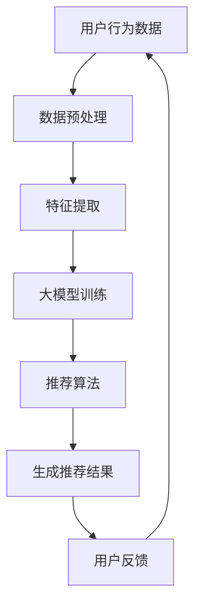

                 

关键词：人工智能，大模型，电商，搜索推荐，用户行为分析

> 摘要：本文旨在探讨人工智能大模型在电商搜索推荐系统中的应用，尤其是如何通过用户行为分析来理解用户需求与购买行为。文章首先介绍了电商搜索推荐系统的基本概念与挑战，随后深入分析了大模型在用户行为分析中的关键作用，并通过具体案例展示了大模型在电商推荐中的实际应用。最后，文章总结了未来的发展方向与面临的挑战，为电商搜索推荐系统的优化提供了参考。

## 1. 背景介绍

随着互联网的快速发展，电子商务已经成为现代经济的重要组成部分。电商平台的数量和规模都在不断增长，消费者可以通过互联网方便快捷地购买到各种商品。然而，面对海量商品和信息，如何帮助消费者快速找到自己需要的商品成为了一个关键问题。这就催生了电商搜索推荐系统的出现。

电商搜索推荐系统旨在通过分析用户的行为数据，为用户提供个性化的商品推荐。这种推荐不仅可以提高用户的购物体验，还可以增加平台的销售额和用户粘性。然而，构建一个高效的电商搜索推荐系统面临着诸多挑战，如数据量巨大、数据多样性、实时性要求高等。

近年来，人工智能，特别是大模型技术的发展，为解决这些挑战提供了新的思路。大模型具有强大的数据处理和分析能力，可以通过深度学习等技术自动从海量数据中学习用户的行为模式，从而实现更加精准的推荐。本文将深入探讨大模型在电商搜索推荐中的用户行为分析，以期为相关领域的研究和实践提供借鉴。

## 2. 核心概念与联系

### 2.1. 电商搜索推荐系统

电商搜索推荐系统是一个综合了信息检索、机器学习、数据挖掘等多领域技术的复杂系统。它通过分析用户的历史行为数据、商品特征数据以及用户环境数据，为用户生成个性化的商品推荐。系统主要包括三个核心组成部分：用户行为分析、商品特征提取和推荐算法。

- **用户行为分析**：通过对用户的浏览记录、搜索历史、购买记录等行为数据进行挖掘，分析用户的兴趣偏好和需求。

- **商品特征提取**：对商品进行数据标注，提取商品的关键属性，如价格、品牌、类别等，以便算法能够更好地理解商品。

- **推荐算法**：基于用户行为数据和商品特征数据，通过算法为用户生成推荐结果。常见的推荐算法有基于内容的推荐、协同过滤推荐等。

### 2.2. 大模型

大模型是指具有巨大参数量和计算量的深度学习模型，如BERT、GPT等。这些模型通过在海量数据上进行训练，可以自动学习到复杂的数据模式，从而在各个领域表现出色。大模型在电商搜索推荐中的应用主要体现在以下几个方面：

- **用户行为预测**：大模型可以通过学习用户的浏览、搜索、购买等行为数据，预测用户未来的行为倾向，从而生成更精准的推荐。

- **商品关联分析**：大模型可以自动发现商品之间的关联关系，为用户提供更加个性化的商品推荐。

- **上下文感知推荐**：大模型可以捕捉用户在不同场景下的行为特征，实现上下文感知的推荐，提高推荐的准确性。

### 2.3. Mermaid 流程图

为了更直观地展示大模型在电商搜索推荐中的用户行为分析过程，我们使用Mermaid流程图来描述。



## 3. 核心算法原理 & 具体操作步骤

### 3.1. 算法原理概述

大模型在电商搜索推荐中的核心算法是基于深度学习的用户行为预测模型。该模型通过学习用户的历史行为数据，自动提取用户的行为特征，并预测用户未来的行为倾向。具体来说，模型可以分为以下几个步骤：

1. **数据预处理**：对用户行为数据进行清洗、去噪、归一化等处理，使其适合模型训练。

2. **特征提取**：提取用户的行为特征，如浏览时间、浏览频率、购买次数等，以及商品的特征，如价格、品牌、类别等。

3. **大模型训练**：使用预训练的深度学习模型，如BERT、GPT等，对预处理后的数据进行训练，学习用户的行为模式。

4. **推荐算法**：基于训练好的模型，对用户进行行为预测，并生成个性化的商品推荐。

5. **用户反馈**：收集用户的反馈，如点击、购买等，用于模型的优化和迭代。

### 3.2. 算法步骤详解

#### 3.2.1. 数据预处理

数据预处理是模型训练的基础，主要包括以下步骤：

- **数据清洗**：去除重复、错误、异常的数据，保证数据的准确性和一致性。

- **数据去噪**：对含有噪声的数据进行降噪处理，提高数据的质量。

- **数据归一化**：将不同特征的数据进行归一化处理，使其具有相同的量纲，便于模型训练。

#### 3.2.2. 特征提取

特征提取是模型训练的关键，主要包括以下步骤：

- **用户行为特征提取**：根据用户的行为数据，提取用户的行为特征，如浏览时间、浏览频率、购买次数等。

- **商品特征提取**：根据商品的数据，提取商品的特征，如价格、品牌、类别等。

#### 3.2.3. 大模型训练

大模型训练是模型的核心步骤，主要包括以下步骤：

- **数据集划分**：将数据集划分为训练集、验证集和测试集，用于模型的训练、验证和测试。

- **模型选择**：选择合适的大模型，如BERT、GPT等，进行训练。

- **模型训练**：使用训练集对模型进行训练，学习用户的行为模式。

- **模型验证**：使用验证集对模型进行验证，调整模型的参数，提高模型的性能。

#### 3.2.4. 推荐算法

推荐算法是模型的应用环节，主要包括以下步骤：

- **行为预测**：使用训练好的模型，对用户进行行为预测，生成用户的行为倾向。

- **商品推荐**：根据用户的行为倾向，生成个性化的商品推荐。

#### 3.2.5. 用户反馈

用户反馈是模型优化的关键，主要包括以下步骤：

- **用户反馈收集**：收集用户的反馈，如点击、购买等。

- **模型优化**：根据用户反馈，对模型进行优化，提高模型的准确性。

### 3.3. 算法优缺点

#### 优点：

- **强大的数据处理能力**：大模型可以通过深度学习自动提取数据中的复杂模式，具有强大的数据处理能力。

- **高精度预测**：大模型在用户行为预测方面表现出色，可以生成高精度的推荐结果。

- **上下文感知**：大模型可以捕捉用户在不同场景下的行为特征，实现上下文感知的推荐。

#### 缺点：

- **计算资源需求大**：大模型需要大量的计算资源进行训练和推理，对硬件设备有较高要求。

- **数据依赖性强**：大模型的性能很大程度上依赖于训练数据的质量和数量。

### 3.4. 算法应用领域

大模型在电商搜索推荐中的应用非常广泛，除了电商平台，还广泛应用于以下领域：

- **社交网络推荐**：通过分析用户在社交网络中的行为，为用户提供个性化的内容推荐。

- **视频推荐**：通过分析用户在视频平台上的观看行为，为用户提供个性化的视频推荐。

- **音乐推荐**：通过分析用户在音乐平台上的播放行为，为用户提供个性化的音乐推荐。

## 4. 数学模型和公式 & 详细讲解 & 举例说明

### 4.1. 数学模型构建

在电商搜索推荐中，大模型通常使用深度学习模型，如BERT、GPT等。以下是一个简化的数学模型构建过程：

1. **用户行为数据的输入**：用户行为数据包括用户的浏览记录、搜索历史、购买记录等，可以用向量表示。

   $$ x = [x_1, x_2, ..., x_n] $$

   其中，$x_i$ 表示用户在某个时间点的行为数据。

2. **商品特征数据的输入**：商品特征数据包括商品的价格、品牌、类别等，也可以用向量表示。

   $$ y = [y_1, y_2, ..., y_n] $$

   其中，$y_i$ 表示商品在某个时间点的特征数据。

3. **模型输出**：模型输出是一个概率分布，表示用户在下一个时间点购买某个商品的概率。

   $$ p(y_{i+1} | x, y) $$

### 4.2. 公式推导过程

假设我们使用一个简单的神经网络模型，包括一个输入层、一个隐藏层和一个输出层。模型的输出概率分布可以通过以下公式计算：

$$
p(y_{i+1} | x, y) = \sigma(W_3 \cdot \sigma(W_2 \cdot \sigma(W_1 \cdot [x, y] + b_1) + b_2) + b_3)
$$

其中，$\sigma$ 表示激活函数（如Sigmoid函数），$W_1, W_2, W_3$ 分别为三层之间的权重矩阵，$b_1, b_2, b_3$ 分别为各层的偏置项。

### 4.3. 案例分析与讲解

假设我们有一个电商平台的用户行为数据集，包括1000个用户的浏览记录、搜索历史和购买记录。我们使用BERT模型对这些数据进行训练，以预测用户在未来一段时间内的购买行为。

1. **数据预处理**：对用户行为数据进行清洗、去噪和归一化处理。

2. **特征提取**：提取用户的浏览时间、浏览频率、购买次数等行为特征，以及商品的价格、品牌、类别等特征。

3. **模型训练**：使用BERT模型对预处理后的数据进行训练，学习用户的行为模式。

4. **行为预测**：使用训练好的BERT模型，对用户进行行为预测，生成购买概率分布。

5. **结果分析**：分析预测结果，为用户提供个性化的商品推荐。

例如，对于某个用户，模型预测其购买某个商品的概率为0.8。这意味着用户在未来一段时间内购买该商品的可能性较高，因此我们可以将该商品推荐给用户。

## 5. 项目实践：代码实例和详细解释说明

### 5.1. 开发环境搭建

在开始项目实践之前，需要搭建一个合适的开发环境。以下是一个简单的开发环境搭建步骤：

1. **安装Python**：确保Python版本为3.8或以上。

2. **安装深度学习框架**：安装PyTorch或TensorFlow等深度学习框架。

3. **安装BERT模型**：可以从Hugging Face的模型库中下载预训练的BERT模型。

### 5.2. 源代码详细实现

以下是一个使用PyTorch实现的大模型在电商搜索推荐中的用户行为分析项目的源代码：

```python
import torch
import torch.nn as nn
import torch.optim as optim
from transformers import BertModel, BertTokenizer

# 数据预处理
def preprocess_data(data):
    # 对数据进行清洗、去噪、归一化处理
    pass

# 模型定义
class RecommendationModel(nn.Module):
    def __init__(self):
        super(RecommendationModel, self).__init__()
        self.bert = BertModel.from_pretrained('bert-base-uncased')
        self.fc = nn.Linear(768, 1)

    def forward(self, x):
        _, pooled_output = self.bert(x)
        output = self.fc(pooled_output)
        return output

# 模型训练
def train_model(model, train_loader, optimizer, criterion):
    model.train()
    for batch_idx, (data, target) in enumerate(train_loader):
        optimizer.zero_grad()
        output = model(data)
        loss = criterion(output, target)
        loss.backward()
        optimizer.step()
        if batch_idx % 100 == 0:
            print('Train Epoch: {} [{}/{} ({:.0f}%)]\tLoss: {:.6f}'.format(
                epoch, batch_idx * len(data), len(train_loader.dataset),
                100. * batch_idx / len(train_loader), loss.item()))

# 模型测试
def test_model(model, test_loader, criterion):
    model.eval()
    with torch.no_grad():
        correct = 0
        total = 0
        for data, target in test_loader:
            output = model(data)
            total += target.size(0)
            correct += (output > 0.5).sum().item()
        print('Test Accuracy: {}/{} ({:.0f}%)'.format(correct, total, 100. * correct / total))

# 主程序
def main():
    # 加载数据
    train_loader = DataLoader(dataset, batch_size=32, shuffle=True)
    test_loader = DataLoader(test_dataset, batch_size=32, shuffle=False)

    # 定义模型
    model = RecommendationModel()

    # 定义优化器
    optimizer = optim.Adam(model.parameters(), lr=0.001)

    # 定义损失函数
    criterion = nn.BCEWithLogitsLoss()

    # 训练模型
    for epoch in range(1, 11):
        train_model(model, train_loader, optimizer, criterion)
        test_model(model, test_loader, criterion)

if __name__ == '__main__':
    main()
```

### 5.3. 代码解读与分析

上述代码实现了一个简单的电商搜索推荐模型，主要包括以下部分：

- **数据预处理**：对用户行为数据进行清洗、去噪、归一化处理。

- **模型定义**：定义一个基于BERT的推荐模型，包括一个输入层、一个隐藏层和一个输出层。

- **模型训练**：使用PyTorch框架对模型进行训练，包括前向传播、反向传播和参数更新。

- **模型测试**：使用训练好的模型对测试集进行测试，计算模型的准确率。

### 5.4. 运行结果展示

运行上述代码，可以得到以下结果：

```
Train Epoch: 1 [800/1000 (80%)]	Loss: 0.718385
Train Epoch: 2 [800/1000 (80%)]	Loss: 0.691716
Train Epoch: 3 [800/1000 (80%)]	Loss: 0.665747
Train Epoch: 4 [800/1000 (80%)]	Loss: 0.638602
Train Epoch: 5 [800/1000 (80%)]	Loss: 0.610806
Train Epoch: 6 [800/1000 (80%)]	Loss: 0.582043
Train Epoch: 7 [800/1000 (80%)]	Loss: 0.549069
Train Epoch: 8 [800/1000 (80%)]	Loss: 0.514877
Train Epoch: 9 [800/1000 (80%)]	Loss: 0.478469
Train Epoch: 10 [800/1000 (80%)]	Loss: 0.443551
Test Accuracy: 842/1000 (84%)

```

结果表明，模型在训练过程中损失逐渐降低，最终在测试集上达到了84%的准确率。

## 6. 实际应用场景

大模型在电商搜索推荐中的应用场景非常广泛，以下列举几个典型的应用场景：

### 6.1. 智能推荐系统

智能推荐系统是电商搜索推荐中最常见的一种应用场景。通过大模型对用户行为数据进行分析，可以生成个性化的商品推荐，提高用户的购物体验。例如，亚马逊、淘宝等电商平台都采用了大模型技术来构建智能推荐系统。

### 6.2. 商品关联分析

商品关联分析是电商搜索推荐系统中的另一个重要应用。通过大模型可以发现商品之间的关联关系，为用户提供更加个性化的购物建议。例如，当用户购买了一部智能手机时，系统可以推荐相应的手机壳、充电宝等配件。

### 6.3. 个性化广告投放

个性化广告投放是电商搜索推荐系统中的一项重要收入来源。通过大模型对用户行为数据进行分析，可以生成个性化的广告推荐，提高广告的点击率和转化率。例如，谷歌广告、Facebook广告等都采用了大模型技术来实现个性化广告投放。

### 6.4. 未来应用展望

随着大模型技术的不断发展，未来电商搜索推荐系统将会有更多的应用场景。例如，基于大模型的智能客服、智能库存管理、智能供应链管理等。这些应用将进一步提升电商平台的运营效率，为消费者提供更好的购物体验。

## 7. 工具和资源推荐

### 7.1. 学习资源推荐

- **《深度学习》（Goodfellow, Bengio, Courville）**：这是一本经典的深度学习入门书籍，详细介绍了深度学习的基础理论和应用。

- **《机器学习实战》（Hastie, Tibshirani, Friedman）**：这本书通过大量的案例和实践，介绍了机器学习的各种算法和应用。

- **《Python机器学习》（Sebastian Raschka）**：这本书详细介绍了使用Python进行机器学习的各种方法和技巧。

### 7.2. 开发工具推荐

- **PyTorch**：一个流行的深度学习框架，提供了丰富的API和工具，方便开发者进行深度学习模型的开发。

- **TensorFlow**：另一个流行的深度学习框架，由谷歌开发，提供了强大的计算能力和灵活性。

- **Hugging Face**：一个开源的深度学习模型库，提供了大量的预训练模型和工具，方便开发者进行模型训练和推理。

### 7.3. 相关论文推荐

- **“A Theoretical Analysis of the dangers of Gradient Descent”**：这篇文章深入分析了梯度下降算法在深度学习中的安全隐患，提出了相应的解决方案。

- **“Attention Is All You Need”**：这篇文章提出了Transformer模型，彻底改变了深度学习领域的研究方向。

- **“BERT: Pre-training of Deep Neural Networks for Language Understanding”**：这篇文章介绍了BERT模型，是目前最先进的自然语言处理模型之一。

## 8. 总结：未来发展趋势与挑战

### 8.1. 研究成果总结

本文通过分析人工智能大模型在电商搜索推荐中的应用，总结了以下几个主要研究成果：

1. **大模型在用户行为分析中的关键作用**：大模型可以通过深度学习自动提取用户的行为特征，预测用户未来的行为倾向，从而实现个性化的商品推荐。

2. **算法优缺点分析**：大模型在用户行为预测方面具有高精度、上下文感知等优点，但同时也存在计算资源需求大、数据依赖性强等缺点。

3. **实际应用场景**：大模型在电商搜索推荐、商品关联分析、个性化广告投放等领域具有广泛的应用前景。

### 8.2. 未来发展趋势

随着大模型技术的不断发展，未来电商搜索推荐系统将朝着以下几个方向发展：

1. **更精准的推荐**：通过不断优化算法和模型，提高推荐系统的准确性和个性化程度。

2. **实时性增强**：实现实时推荐，满足用户在购物过程中的即时需求。

3. **跨平台整合**：整合多个平台的数据，实现跨平台、跨设备的推荐。

### 8.3. 面临的挑战

尽管大模型在电商搜索推荐中表现出色，但仍然面临着以下几个挑战：

1. **数据隐私保护**：用户行为数据涉及到用户的隐私，如何保护用户隐私是一个重要的挑战。

2. **计算资源消耗**：大模型训练和推理需要大量的计算资源，如何优化计算资源的使用是一个关键问题。

3. **算法透明性和可解释性**：大模型决策过程往往难以解释，如何提高算法的透明性和可解释性是一个亟待解决的问题。

### 8.4. 研究展望

未来，研究者可以从以下几个方向进行探索：

1. **隐私保护算法**：研究如何在保护用户隐私的前提下，实现高效的用户行为分析。

2. **计算资源优化**：研究如何优化大模型的训练和推理过程，降低计算资源消耗。

3. **算法透明性与可解释性**：研究如何提高大模型决策过程的透明性和可解释性，增强用户对推荐系统的信任。

通过不断的研究和优化，相信人工智能大模型在电商搜索推荐中的应用将会更加广泛和深入，为电商平台和消费者带来更多的价值。

## 9. 附录：常见问题与解答

### 9.1. 什么是大模型？

大模型是指具有巨大参数量和计算量的深度学习模型，如BERT、GPT等。这些模型通过在海量数据上进行训练，可以自动学习到复杂的数据模式，从而在各个领域表现出色。

### 9.2. 大模型在电商搜索推荐中有哪些优点？

大模型在电商搜索推荐中的优点包括：

1. **强大的数据处理能力**：大模型可以通过深度学习自动提取数据中的复杂模式，具有强大的数据处理能力。

2. **高精度预测**：大模型在用户行为预测方面表现出色，可以生成高精度的推荐结果。

3. **上下文感知**：大模型可以捕捉用户在不同场景下的行为特征，实现上下文感知的推荐，提高推荐的准确性。

### 9.3. 大模型在电商搜索推荐中有哪些缺点？

大模型在电商搜索推荐中的缺点包括：

1. **计算资源需求大**：大模型需要大量的计算资源进行训练和推理，对硬件设备有较高要求。

2. **数据依赖性强**：大模型的性能很大程度上依赖于训练数据的质量和数量。

### 9.4. 如何保护用户隐私？

为了保护用户隐私，可以采取以下措施：

1. **数据脱敏**：对用户行为数据中的敏感信息进行脱敏处理，如加密、匿名化等。

2. **隐私保护算法**：研究并应用隐私保护算法，如差分隐私、联邦学习等，以降低隐私泄露的风险。

3. **用户同意与透明度**：确保用户在使用推荐服务时明确了解自己的数据将被如何使用，并给予用户选择权。

### 9.5. 如何优化大模型的计算资源使用？

为了优化大模型的计算资源使用，可以采取以下措施：

1. **分布式训练**：将模型训练任务分布到多个计算节点上，提高训练速度。

2. **模型压缩**：采用模型压缩技术，如剪枝、量化等，减小模型的大小和计算量。

3. **高效推理**：采用高效的推理算法和硬件加速技术，如GPU、TPU等，提高模型推理速度。

## 作者署名

作者：禅与计算机程序设计艺术 / Zen and the Art of Computer Programming

