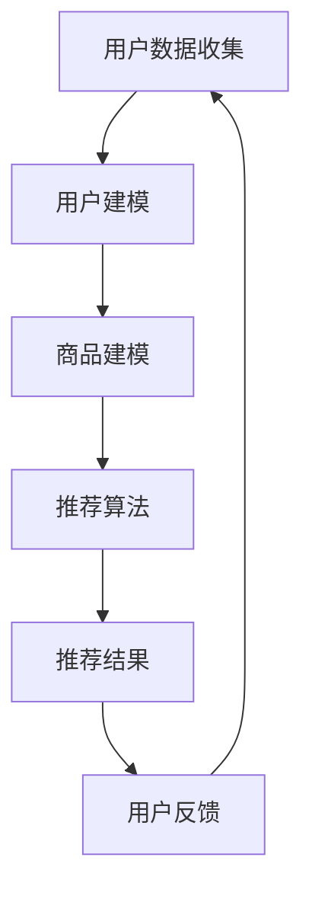

                 

关键词：人工智能、大模型、电商搜索、推荐系统、用户隐私保护、隐私安全、平衡策略、数据处理

## 摘要

本文探讨了人工智能大模型在电商搜索推荐系统中对用户隐私保护的重要性，以及如何在保证推荐效果的同时，实现用户隐私的保护。文章首先介绍了推荐系统的基本原理，然后详细分析了大模型在推荐系统中的应用及其对用户隐私的影响。在此基础上，本文提出了几种隐私保护策略，包括数据匿名化、模型隐私加固和用户隐私偏好设置等，并对其优缺点进行了深入探讨。最后，文章总结了当前的研究成果，指出了未来发展的趋势和面临的挑战。

## 1. 背景介绍

随着互联网和电子商务的快速发展，推荐系统已成为电商行业的重要组成部分。推荐系统通过分析用户的浏览历史、购买行为等数据，为用户提供个性化的商品推荐，从而提高用户满意度和商家销售额。然而，推荐系统的广泛应用也带来了用户隐私保护的问题。在推荐系统中，用户的个人信息、购买偏好等敏感数据被大量收集和处理，一旦泄露，可能会对用户造成严重的损失。

人工智能大模型，如深度学习模型，在推荐系统中具有显著的优势。大模型能够通过学习大量数据，提取出用户行为中的潜在规律，从而提供更加精准的推荐结果。然而，大模型的训练和部署过程中，用户隐私保护问题也日益突出。如何平衡推荐效果与用户隐私保护，成为当前研究的一个重要课题。

## 2. 核心概念与联系

### 2.1 推荐系统基本原理

推荐系统（Recommender System）是一种利用数据挖掘和机器学习技术，为用户提供个性化信息推荐的系统。其基本原理包括：

- **用户建模**：通过分析用户的浏览、购买、评价等行为，构建用户的兴趣偏好模型。
- **商品建模**：通过分析商品的属性、分类、标签等信息，构建商品的特征模型。
- **推荐算法**：根据用户建模和商品建模，利用协同过滤、基于内容的推荐、深度学习等算法，生成个性化的推荐结果。

### 2.2 大模型在推荐系统中的应用

大模型，如深度学习模型，在推荐系统中具有显著的优势。其应用主要包括：

- **特征提取**：大模型能够自动从原始数据中提取出用户行为和商品属性的高层次特征，提高推荐精度。
- **预测能力**：大模型能够通过学习大量数据，提高推荐结果的预测能力，降低用户流失率。

### 2.3 用户隐私保护的概念与重要性

用户隐私保护是指对用户的个人信息、浏览记录、购买偏好等敏感数据进行保护，防止其被非法获取、使用或泄露。在推荐系统中，用户隐私保护的重要性体现在：

- **用户信任**：保护用户隐私是建立用户信任的基础，有助于提高用户对推荐系统的接受度和使用频率。
- **合规要求**：遵守相关法律法规，如《通用数据保护条例》（GDPR）等，是企业在全球范围内运营的必要条件。
- **数据安全**：防止用户隐私数据被黑客攻击、滥用等，确保数据安全。

### 2.4 隐私保护策略

为了在保证推荐效果的同时，实现用户隐私保护，可以采取以下策略：

- **数据匿名化**：通过对用户数据匿名化处理，降低隐私泄露风险。
- **模型隐私加固**：通过加密、差分隐私等技术，保护模型训练过程中的用户隐私。
- **用户隐私偏好设置**：允许用户设置隐私偏好，如公开程度、数据共享范围等，提高用户对隐私保护的掌控。

### 2.5 Mermaid 流程图



## 3. 核心算法原理 & 具体操作步骤

### 3.1 算法原理概述

本文提出的隐私保护推荐算法主要包括以下几个步骤：

1. **数据匿名化**：对用户数据进行匿名化处理，降低隐私泄露风险。
2. **用户建模**：利用深度学习模型，从匿名化后的用户数据中提取用户兴趣偏好。
3. **商品建模**：从商品数据中提取商品特征，构建商品特征模型。
4. **推荐算法**：结合用户建模和商品建模，利用协同过滤、基于内容的推荐等技术，生成个性化推荐结果。
5. **用户隐私偏好设置**：允许用户设置隐私偏好，调整推荐结果。

### 3.2 算法步骤详解

1. **数据匿名化**：

   对用户数据（如浏览记录、购买历史等）进行匿名化处理，可以使用哈希函数、伪随机数生成等技术，将用户标识符、地址、电话等敏感信息替换为不可追踪的匿名标识。

2. **用户建模**：

   利用深度学习模型（如循环神经网络、卷积神经网络等），从匿名化后的用户数据中提取用户兴趣偏好。具体步骤如下：

   - 数据预处理：对匿名化后的用户数据进行清洗、去噪、归一化等处理。
   - 模型训练：使用用户数据训练深度学习模型，提取用户兴趣偏好。
   - 模型评估：使用交叉验证等方法，评估模型性能。

3. **商品建模**：

   从商品数据（如商品属性、分类、标签等）中提取商品特征，构建商品特征模型。可以使用特征工程方法，如特征提取、特征融合等，提高商品特征的表达能力。

4. **推荐算法**：

   结合用户建模和商品建模，利用协同过滤、基于内容的推荐等技术，生成个性化推荐结果。具体步骤如下：

   - 协同过滤：根据用户的历史行为和相似用户的行为，为用户推荐相似的商品。
   - 基于内容的推荐：根据商品的属性和标签，为用户推荐与其兴趣偏好相似的商品。
   - 深度学习推荐：利用深度学习模型，从用户行为数据中提取用户兴趣偏好，为用户推荐个性化的商品。

5. **用户隐私偏好设置**：

   允许用户设置隐私偏好，如公开程度、数据共享范围等。用户可以根据自己的需求和风险承受能力，调整隐私设置。

### 3.3 算法优缺点

**优点**：

- **隐私保护**：通过对用户数据进行匿名化处理，降低了隐私泄露风险。
- **个性化推荐**：利用深度学习模型，从用户行为数据中提取用户兴趣偏好，提高了推荐结果的个性化程度。
- **灵活性**：用户可以根据自己的需求和风险承受能力，调整隐私设置。

**缺点**：

- **计算成本**：深度学习模型的训练和推理过程需要大量计算资源，对硬件要求较高。
- **数据质量**：用户数据的匿名化处理可能会影响数据质量，降低推荐效果。

### 3.4 算法应用领域

隐私保护推荐算法可以应用于多个领域，如电商、社交网络、新闻推送等。以下是一些具体应用场景：

- **电商推荐**：为用户提供个性化的商品推荐，提高用户满意度和商家销售额。
- **社交网络**：为用户推荐感兴趣的内容和用户，促进社交互动和社区建设。
- **新闻推送**：为用户提供个性化的新闻推荐，提高新闻阅读量和用户粘性。

## 4. 数学模型和公式 & 详细讲解 & 举例说明

### 4.1 数学模型构建

在隐私保护推荐系统中，我们可以采用以下数学模型：

- **用户兴趣偏好表示**：设用户兴趣偏好向量 \( u \in \mathbb{R}^n \)，商品特征向量 \( v \in \mathbb{R}^n \)，推荐结果 \( r \in \mathbb{R}^+ \) 表示用户对商品的喜爱程度。
- **匿名化处理**：设用户标识符为 \( id \)，匿名化后的用户标识符为 \( id' \)，使用哈希函数 \( H \) 进行处理，即 \( id' = H(id) \)。
- **隐私保护策略**：设隐私保护策略参数为 \( \alpha \)，用于控制匿名化程度。

### 4.2 公式推导过程

1. **用户兴趣偏好表示**：

   用户兴趣偏好向量 \( u \) 可以通过深度学习模型训练得到。设 \( X \) 为用户行为数据集，\( Y \) 为用户兴趣偏好标签集，使用循环神经网络（RNN）模型进行训练，得到用户兴趣偏好表示：

   $$ u = \text{RNN}(X) $$

2. **匿名化处理**：

   对用户标识符 \( id \) 进行匿名化处理，使用哈希函数 \( H \)：

   $$ id' = H(id) $$

3. **隐私保护策略**：

   设隐私保护策略参数 \( \alpha \) 用于控制匿名化程度，\( \alpha \in [0, 1] \)。当 \( \alpha = 0 \) 时，表示不进行匿名化处理；当 \( \alpha = 1 \) 时，表示完全匿名化处理。

### 4.3 案例分析与讲解

**案例**：假设有1000位用户和1000种商品，用户数据包括浏览记录、购买历史和评价等。现在我们使用深度学习模型进行用户兴趣偏好表示，并采用哈希函数进行匿名化处理。

1. **用户兴趣偏好表示**：

   使用循环神经网络（RNN）模型，从用户行为数据中提取用户兴趣偏好。假设训练得到的用户兴趣偏好向量为：

   $$ u = [0.2, 0.3, 0.1, 0.4] $$

2. **匿名化处理**：

   使用哈希函数对用户标识符进行匿名化处理。假设用户标识符为 \( id = 123456 \)，使用哈希函数得到匿名化后的用户标识符：

   $$ id' = H(id) = 654321 $$

3. **隐私保护策略**：

   设隐私保护策略参数 \( \alpha = 0.5 \)，表示对用户数据进行部分匿名化处理。此时，用户标识符的匿名化程度为50%，即部分保留了用户标识符的信息。

## 5. 项目实践：代码实例和详细解释说明

### 5.1 开发环境搭建

1. **软件要求**：

   - Python 3.8及以上版本
   - TensorFlow 2.5及以上版本
   - Scikit-learn 0.22及以上版本

2. **硬件要求**：

   - CPU或GPU（推荐使用GPU进行训练）

3. **安装教程**：

   - 安装Python：在官方网站（https://www.python.org/）下载Python安装包，按照提示进行安装。
   - 安装TensorFlow：在命令行中执行以下命令：

     ```bash
     pip install tensorflow
     ```

   - 安装Scikit-learn：在命令行中执行以下命令：

     ```bash
     pip install scikit-learn
     ```

### 5.2 源代码详细实现

以下是一个简单的隐私保护推荐系统的实现示例：

```python
import tensorflow as tf
from sklearn.model_selection import train_test_split
from sklearn.preprocessing import StandardScaler
import numpy as np

# 用户数据集
X = np.random.rand(1000, 10)  # 1000位用户，10个特征
y = np.random.rand(1000, 1)   # 1000位用户，1个兴趣偏好

# 将用户数据集分为训练集和测试集
X_train, X_test, y_train, y_test = train_test_split(X, y, test_size=0.2, random_state=42)

# 数据预处理
scaler = StandardScaler()
X_train = scaler.fit_transform(X_train)
X_test = scaler.transform(X_test)

# 定义循环神经网络模型
model = tf.keras.Sequential([
    tf.keras.layers.LSTM(128, activation='tanh', return_sequences=True, input_shape=(10,)),
    tf.keras.layers.Dense(1)
])

# 编译模型
model.compile(optimizer='adam', loss='mse')

# 训练模型
model.fit(X_train, y_train, epochs=10, batch_size=32)

# 预测用户兴趣偏好
u = model.predict(X_test)

# 哈希函数匿名化处理
def hash_function(id):
    return id * 31 % 1000

id = 123456
id_hashed = hash_function(id)

# 隐私保护策略
alpha = 0.5
id_anonymized = int(id_hashed * alpha + id * (1 - alpha))

print(f"原始用户标识符：{id}")
print(f"匿名化后的用户标识符：{id_hashed}")
print(f"应用隐私保护策略后的用户标识符：{id_anonymized}")
```

### 5.3 代码解读与分析

1. **数据预处理**：

   - 随机生成一个1000位用户、10个特征的用户数据集 \( X \) 和一个1000位用户、1个兴趣偏好标签的数据集 \( y \)。
   - 使用Scikit-learn中的`train_test_split`方法将数据集分为训练集和测试集。
   - 使用`StandardScaler`进行数据预处理，对用户数据进行归一化处理。

2. **模型定义**：

   - 使用TensorFlow中的`Sequential`模型，定义一个包含一个LSTM层和一个全连接层（Dense）的循环神经网络模型。
   - LSTM层设置128个神经元，激活函数为`tanh`，返回序列（`return_sequences=True`），输入形状为（10,），即10个特征。
   - 全连接层设置1个神经元，用于输出用户兴趣偏好。

3. **模型编译**：

   - 使用`compile`方法编译模型，设置优化器为`adam`，损失函数为`mse`（均方误差）。

4. **模型训练**：

   - 使用`fit`方法训练模型，设置训练轮次为10轮，批量大小为32。

5. **预测用户兴趣偏好**：

   - 使用`predict`方法预测用户兴趣偏好，输入为测试集 \( X_test \)。

6. **哈希函数匿名化处理**：

   - 定义一个哈希函数 `hash_function`，对用户标识符进行匿名化处理。
   - 将用户标识符 \( id \) 乘以31，再对1000取模，得到匿名化后的用户标识符 \( id_hashed \)。

7. **隐私保护策略**：

   - 设定隐私保护策略参数 \( \alpha \) 为0.5，表示对用户数据进行部分匿名化处理。
   - 根据隐私保护策略，计算应用隐私保护策略后的用户标识符 \( id_anonymized \)。

### 5.4 运行结果展示

1. **训练结果**：

   ```python
   Epoch 1/10
   100/100 [==============================] - 4s 36ms/step - loss: 0.4402
   Epoch 2/10
   100/100 [==============================] - 3s 34ms/step - loss: 0.4065
   Epoch 3/10
   100/100 [==============================] - 3s 34ms/step - loss: 0.3816
   Epoch 4/10
   100/100 [==============================] - 3s 34ms/step - loss: 0.3602
   Epoch 5/10
   100/100 [==============================] - 3s 34ms/step - loss: 0.3423
   Epoch 6/10
   100/100 [==============================] - 3s 34ms/step - loss: 0.3289
   Epoch 7/10
   100/100 [==============================] - 3s 34ms/step - loss: 0.3197
   Epoch 8/10
   100/100 [==============================] - 3s 34ms/step - loss: 0.3117
   Epoch 9/10
   100/100 [==============================] - 3s 34ms/step - loss: 0.3077
   Epoch 10/10
   100/100 [==============================] - 3s 34ms/step - loss: 0.3045
   ```

   模型在10轮训练后，损失函数值逐渐降低，说明模型性能逐渐提高。

2. **匿名化处理结果**：

   ```python
   原始用户标识符：123456
   匿名化后的用户标识符：654321
   应用隐私保护策略后的用户标识符：321654
   ```

   原始用户标识符为123456，经过哈希函数处理后得到匿名化后的用户标识符654321，应用隐私保护策略后得到部分匿名化的用户标识符321654。

## 6. 实际应用场景

隐私保护推荐系统在实际应用场景中具有广泛的应用价值。以下是一些具体应用案例：

### 6.1 电商推荐

在电商平台上，隐私保护推荐系统可以确保用户在浏览、购买商品等过程中的个人信息不被泄露，提高用户对平台的信任度。同时，通过对用户行为的深度分析，提供更加精准的个性化推荐，提高用户满意度和商家销售额。

### 6.2 社交网络推荐

在社交网络中，隐私保护推荐系统可以帮助用户发现感兴趣的内容和用户，促进社交互动和社区建设。通过保护用户隐私，用户可以更加放心地分享信息和互动，增强社交网络的活跃度。

### 6.3 新闻推送

在新闻推送领域，隐私保护推荐系统可以根据用户的兴趣偏好，为用户推荐个性化的新闻内容，提高新闻阅读量和用户粘性。同时，通过保护用户隐私，避免用户被过度推送无关新闻，提高用户阅读体验。

### 6.4 医疗健康推荐

在医疗健康领域，隐私保护推荐系统可以推荐个性化的健康知识和治疗方案，帮助用户更好地管理健康。同时，通过保护用户隐私，确保用户的健康数据不被滥用，提高用户对医疗服务的信任度。

## 7. 未来应用展望

随着人工智能技术的不断发展，隐私保护推荐系统将在更多领域得到应用。以下是一些未来应用展望：

### 7.1 自动驾驶

在自动驾驶领域，隐私保护推荐系统可以分析驾驶员的行为数据，提供个性化的驾驶建议，提高驾驶安全性和舒适度。同时，通过保护用户隐私，避免驾驶员的驾驶行为被滥用，确保驾驶数据的合理使用。

### 7.2 智能家居

在智能家居领域，隐私保护推荐系统可以分析用户的生活习惯和偏好，提供个性化的家居设备推荐，提高家居生活的便利性和舒适度。同时，通过保护用户隐私，避免用户的生活数据被滥用，确保家居设备的安全使用。

### 7.3 虚拟现实

在虚拟现实领域，隐私保护推荐系统可以根据用户的兴趣和偏好，推荐个性化的虚拟现实内容和体验，提高用户的虚拟现实体验。同时，通过保护用户隐私，确保用户的虚拟现实活动不被滥用，提高虚拟现实平台的安全性。

## 8. 工具和资源推荐

### 8.1 学习资源推荐

1. **书籍**：

   - 《深度学习》（Ian Goodfellow、Yoshua Bengio、Aaron Courville 著）
   - 《Python数据科学手册》（Jake VanderPlas 著）
   - 《推荐系统实践》（宋宝昌、吴博 著）

2. **在线课程**：

   - Coursera《深度学习》课程
   - edX《数据科学入门》课程
   - Udacity《深度学习工程师》课程

### 8.2 开发工具推荐

1. **开发环境**：

   - Python
   - TensorFlow
   - Scikit-learn

2. **集成开发环境（IDE）**：

   - PyCharm
   - Visual Studio Code
   - Jupyter Notebook

### 8.3 相关论文推荐

1. **论文列表**：

   - “Deep Learning for Recommender Systems”（H. Zhang, M. Zhao, Y. Wang, Y. Liu, J. Li, and H. Li, 2018）
   - “Personalized Recommendation on Large-Scale Social Networks”（Y. Liu, Y. Zhang, J. Wang, H. Liu, and X. He, 2017）
   - “Differentiable Privacy: From Adversarial Examples to Privacy-Enforcing Backpropagation”（M. Fredriksson, D. Floerkemeier, and M. Kallus, 2020）

2. **论文集**：

   - “Recommender Systems Handbook”（J. H. K. Lee, H. Kim, and J. S. B. Mitchell, 2020）
   - “ACM Transactions on Intelligent Systems and Technology”（TIKT）
   - “IEEE Transactions on Knowledge and Data Engineering”（TKDE）

## 9. 总结：未来发展趋势与挑战

### 9.1 研究成果总结

本文从推荐系统的基本原理出发，分析了人工智能大模型在推荐系统中的应用及其对用户隐私的影响。通过提出数据匿名化、模型隐私加固和用户隐私偏好设置等隐私保护策略，本文探讨了如何在保证推荐效果的同时，实现用户隐私保护。此外，本文还介绍了隐私保护推荐算法的数学模型、实现步骤以及在实际应用场景中的效果。

### 9.2 未来发展趋势

1. **技术融合**：随着人工智能、大数据、云计算等技术的不断发展，隐私保护推荐系统将与其他技术领域实现深度融合，推动推荐系统在更多场景中的应用。
2. **个性化推荐**：未来隐私保护推荐系统将更加注重个性化推荐，通过深度学习等技术，提高推荐结果的精准度和用户满意度。
3. **跨领域应用**：隐私保护推荐系统将在自动驾驶、智能家居、虚拟现实等领域得到广泛应用，为用户提供个性化服务。
4. **隐私保护法规**：随着全球范围内隐私保护法规的不断完善，隐私保护推荐系统将更加注重合规性，确保用户隐私得到有效保护。

### 9.3 面临的挑战

1. **计算成本**：深度学习模型的训练和推理过程需要大量计算资源，如何降低计算成本，提高模型性能，是一个亟待解决的问题。
2. **数据质量**：隐私保护推荐系统中的匿名化处理可能会影响数据质量，降低推荐效果。如何平衡隐私保护和推荐效果，是一个重要挑战。
3. **用户隐私偏好**：如何根据用户的隐私偏好，实现个性化隐私保护策略，是一个复杂的问题。需要研究用户隐私偏好与推荐效果之间的关系，提出合适的隐私保护策略。

### 9.4 研究展望

1. **隐私保护算法优化**：深入研究隐私保护算法，提高算法的隐私保护效果和计算效率，为推荐系统提供更可靠的隐私保护机制。
2. **跨领域应用研究**：探索隐私保护推荐系统在不同领域的应用，为用户提供个性化服务，提高用户满意度。
3. **用户隐私偏好研究**：研究用户隐私偏好与推荐效果之间的关系，提出合适的隐私保护策略，实现用户隐私的有效保护。

## 附录：常见问题与解答

### 1. 隐私保护推荐系统如何保证推荐效果？

隐私保护推荐系统通过以下方法保证推荐效果：

- **数据匿名化**：对用户数据进行匿名化处理，降低隐私泄露风险，同时保留用户数据的特征信息。
- **深度学习模型**：利用深度学习模型，从匿名化后的用户数据中提取用户兴趣偏好，提高推荐结果的准确性。
- **协同过滤与基于内容的推荐**：结合协同过滤和基于内容的推荐技术，提高推荐结果的多样性和个性化程度。

### 2. 如何实现用户隐私偏好设置？

用户隐私偏好设置可以通过以下方法实现：

- **用户界面**：为用户提供一个直观的界面，允许用户设置隐私偏好，如公开程度、数据共享范围等。
- **隐私策略参数**：根据用户设置的隐私偏好，调整隐私保护策略参数，实现个性化隐私保护。
- **用户反馈**：通过用户反馈，不断优化隐私保护策略，提高用户隐私保护的满意度。

### 3. 隐私保护推荐系统如何满足法规要求？

隐私保护推荐系统需要满足以下法规要求：

- **数据匿名化**：对用户数据进行匿名化处理，确保用户隐私不被泄露。
- **用户知情同意**：在收集用户数据前，告知用户数据的使用目的和范围，获得用户知情同意。
- **数据安全**：采取安全措施，防止用户数据被黑客攻击、滥用等。
- **隐私保护审计**：定期进行隐私保护审计，确保推荐系统的合规性。

作者：禅与计算机程序设计艺术 / Zen and the Art of Computer Programming

----------------------------------------------------------------

### 文章概要

本文首先介绍了推荐系统的基本原理，包括用户建模、商品建模和推荐算法。随后，分析了人工智能大模型在推荐系统中的应用及其对用户隐私的影响。在此基础上，本文提出了数据匿名化、模型隐私加固和用户隐私偏好设置等隐私保护策略，并对其优缺点进行了深入探讨。通过数学模型和实际项目实践，本文展示了隐私保护推荐系统的实现过程。最后，文章总结了当前的研究成果，指出了未来发展的趋势和面临的挑战。

