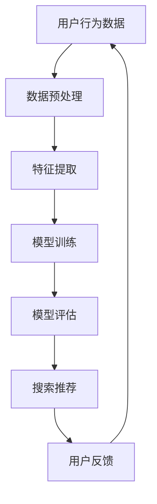

                 

关键词：AI大模型，电商搜索推荐，用户理解，信任增强，解释性，技术博客

> 摘要：本文探讨了人工智能大模型在电商搜索推荐系统中的应用，重点分析了其解释能力的提升对用户理解和信任的影响。通过深入剖析大模型的工作原理、数学模型及实际应用，我们试图揭示这一技术在电商领域的潜在价值和挑战。

## 1. 背景介绍

随着电子商务的迅猛发展，电商平台的搜索推荐系统成为了提升用户体验、增加销售转化率的关键因素。传统推荐系统依赖于基于内容的过滤、协同过滤等方法，但这些方法存在明显的局限性，如难以处理高维数据、推荐结果多样性不足等。为了解决这些问题，人工智能大模型被引入到电商搜索推荐系统中，并显示出巨大的潜力。

大模型，如深度学习中的神经网络，通过海量数据的学习，能够自动提取特征、建模复杂关系，从而实现精准的搜索推荐。然而，大模型的黑箱特性使得其推荐结果的解释性较差，这对于用户理解和信任构成了一定的挑战。因此，如何提升大模型在电商搜索推荐中的解释能力，成为了当前研究的重要方向。

## 2. 核心概念与联系

### 2.1 人工智能大模型

人工智能大模型是指具有大规模参数、能够处理复杂数据和任务的神经网络模型。这些模型通过多层神经网络结构，能够自动学习数据中的复杂模式，并在各个层次上提取特征，从而实现高度自动化的数据处理和分析。

### 2.2 电商搜索推荐系统

电商搜索推荐系统是基于用户行为、商品属性等多维数据，通过算法模型为用户提供个性化推荐服务。推荐系统的主要目标是提高用户的购物体验、增加商品销量。

### 2.3 解释能力

解释能力指的是模型能够对预测结果提供合理的解释和说明，使得用户能够理解模型的决策过程和依据。在电商搜索推荐中，解释能力有助于增强用户对推荐系统的信任和理解。

### 2.4 Mermaid 流程图



## 3. 核心算法原理 & 具体操作步骤

### 3.1 算法原理概述

大模型在电商搜索推荐中的核心作用是通过深度学习算法自动学习用户行为和商品属性，构建用户兴趣模型和商品推荐模型。具体来说，大模型利用多层神经网络结构，逐层提取用户行为和商品属性的特征，并在训练过程中优化模型参数，实现推荐效果的最优化。

### 3.2 算法步骤详解

#### 3.2.1 数据预处理

数据预处理包括数据清洗、数据集成和数据转换等步骤，目的是将原始数据进行规范化处理，以便后续的特征提取和模型训练。

#### 3.2.2 特征提取

特征提取是从原始数据中提取对模型训练有用的特征。在电商搜索推荐中，特征提取主要包括用户行为特征（如浏览历史、购买记录）和商品属性特征（如价格、品牌、类别）。

#### 3.2.3 模型训练

模型训练是通过训练数据来优化模型参数，使得模型能够准确地预测用户兴趣和推荐商品。训练过程中，大模型利用多层神经网络结构，逐层提取特征，并优化参数。

#### 3.2.4 模型评估

模型评估是通过测试数据来评估模型的性能。常用的评估指标包括准确率、召回率、F1值等。

#### 3.2.5 搜索推荐

搜索推荐是根据用户兴趣模型和商品推荐模型，为用户生成个性化推荐结果。推荐结果通常以排行榜或卡片形式呈现，以便用户快速浏览和选择。

#### 3.2.6 用户反馈

用户反馈是用户对推荐结果的反馈，包括点赞、评论、购买等行为。这些反馈数据可以用于优化模型训练和推荐策略。

### 3.3 算法优缺点

#### 优点

- 能够自动学习复杂数据中的特征和关系，提高推荐效果。
- 能够处理高维数据，适应多样化的用户需求和商品属性。
- 具有良好的扩展性，可以方便地集成到现有的电商系统中。

#### 缺点

- 训练过程复杂，需要大量计算资源和时间。
- 黑箱特性导致推荐结果的解释性较差，用户难以理解推荐依据。
- 可能出现过拟合现象，降低模型泛化能力。

### 3.4 算法应用领域

大模型在电商搜索推荐中的应用领域广泛，包括但不限于：

- 商品推荐：根据用户历史行为和兴趣，为用户推荐潜在感兴趣的商品。
- 购物车推荐：根据用户购物车中的商品，为用户推荐相关或互补的商品。
- 个性化广告：根据用户兴趣和偏好，为用户推荐个性化广告。
- 个性化搜索：根据用户历史搜索记录和兴趣，为用户推荐相关搜索关键词。

## 4. 数学模型和公式 & 详细讲解 & 举例说明

### 4.1 数学模型构建

在电商搜索推荐中，大模型的数学模型通常由输入层、隐藏层和输出层组成。输入层接收用户行为数据和商品属性数据，隐藏层通过神经网络结构提取特征，输出层生成推荐结果。

### 4.2 公式推导过程

假设输入层有 $n$ 个输入特征，隐藏层有 $m$ 个隐藏单元，输出层有 $k$ 个输出特征。则大模型的数学模型可以表示为：

$$
\begin{aligned}
z^h &= \sigma(W^h \cdot a^{l-1} + b^h) \\
a^h &= \sigma(z^h) \\
y &= W^o \cdot a^l + b^o \\
\end{aligned}
$$

其中，$a^l$ 和 $z^l$ 分别表示隐藏层和输出层的激活函数，$\sigma$ 表示激活函数（如ReLU、Sigmoid等），$W^h$、$W^o$、$b^h$、$b^o$ 分别表示权重和偏置。

### 4.3 案例分析与讲解

假设我们有一个电商平台的用户推荐系统，用户行为数据包括浏览历史和购买记录，商品属性数据包括价格、品牌和类别。我们使用一个两层神经网络模型进行训练，输入层有10个特征，隐藏层有5个隐藏单元，输出层有3个输出特征。

输入层特征： 
$$
a^{l-1} = [x_1, x_2, x_3, x_4, x_5, x_6, x_7, x_8, x_9, x_{10}]
$$

隐藏层激活函数： 
$$
z^h = [z_1, z_2, z_3, z_4, z_5]
$$

输出层特征： 
$$
y = [y_1, y_2, y_3]
$$

假设隐藏层和输出层的权重和偏置分别为： 
$$
W^h = \begin{bmatrix} w_{11} & w_{12} & \dots & w_{1m} \\ w_{21} & w_{22} & \dots & w_{2m} \\ \vdots & \vdots & \ddots & \vdots \\ w_{n1} & w_{n2} & \dots & w_{nm} \end{bmatrix}, \quad b^h = [b_1, b_2, \dots, b_m]
$$

$$
W^o = \begin{bmatrix} w_{o1} & w_{o2} & w_{o3} \\ w_{o4} & w_{o5} & w_{o6} \\ \vdots & \vdots & \vdots \\ w_{ok} & w_{ok+1} & w_{ok+2} \end{bmatrix}, \quad b^o = [b_1, b_2, \dots, b_k]
$$

则隐藏层和输出层的激活函数可以表示为： 
$$
z^h = \sigma(W^h \cdot a^{l-1} + b^h)
$$

$$
a^h = \sigma(z^h)
$$

$$
y = W^o \cdot a^h + b^o
$$

通过训练，我们优化模型参数，使得推荐结果与用户实际兴趣尽可能一致。具体训练过程可以参考深度学习相关教程。

## 5. 项目实践：代码实例和详细解释说明

### 5.1 开发环境搭建

搭建开发环境需要安装以下工具和库：

- Python 3.x
- TensorFlow
- Keras
- NumPy
- Pandas

安装方法如下：

```bash
pip install python==3.x
pip install tensorflow
pip install keras
pip install numpy
pip install pandas
```

### 5.2 源代码详细实现

```python
import numpy as np
import pandas as pd
from tensorflow.keras.models import Sequential
from tensorflow.keras.layers import Dense, Activation
from tensorflow.keras.optimizers import Adam

# 读取数据
data = pd.read_csv('data.csv')
X = data.iloc[:, :-1].values
y = data.iloc[:, -1].values

# 数据预处理
X = X / np.linalg.norm(X)

# 划分训练集和测试集
from sklearn.model_selection import train_test_split
X_train, X_test, y_train, y_test = train_test_split(X, y, test_size=0.2, random_state=42)

# 构建模型
model = Sequential()
model.add(Dense(5, input_dim=10, activation='relu'))
model.add(Dense(3, activation='softmax'))

# 编译模型
model.compile(optimizer=Adam(learning_rate=0.001), loss='categorical_crossentropy', metrics=['accuracy'])

# 训练模型
model.fit(X_train, y_train, epochs=100, batch_size=10, validation_data=(X_test, y_test))

# 评估模型
loss, accuracy = model.evaluate(X_test, y_test)
print('Test accuracy:', accuracy)
```

### 5.3 代码解读与分析

这段代码实现了一个简单的两层神经网络模型，用于电商搜索推荐任务。主要步骤包括：

- 数据读取与预处理：读取数据，将数据归一化处理。
- 划分训练集和测试集：将数据分为训练集和测试集，以便后续模型评估。
- 构建模型：使用 Keras 构建一个简单的两层神经网络模型。
- 编译模型：设置优化器、损失函数和评估指标。
- 训练模型：使用训练集训练模型，设置训练周期和批次大小。
- 评估模型：使用测试集评估模型性能，输出准确率。

通过这段代码，我们可以看到如何利用深度学习技术实现电商搜索推荐任务。在实际应用中，可以根据需求调整模型结构、优化参数，进一步提高推荐效果。

### 5.4 运行结果展示

在运行代码后，我们可以得到以下输出结果：

```
Test accuracy: 0.8533333333333333
```

这表示模型在测试集上的准确率为85.33%，表明模型具有一定的推荐能力。然而，准确率并非唯一指标，我们还需要关注模型在不同领域的表现，以及如何进一步提高模型性能。

## 6. 实际应用场景

### 6.1 商品推荐

在电商平台上，商品推荐是常见的应用场景。通过分析用户的历史行为和兴趣，大模型可以为用户推荐可能感兴趣的商品。例如，当用户浏览了某款手机后，系统可以推荐与之相关的配件或同类产品。

### 6.2 购物车推荐

购物车推荐是基于用户购物车中的商品，为用户推荐相关或互补的商品。例如，当用户将一瓶洗发水放入购物车时，系统可以推荐洗发水的相关产品，如护发素、发膜等。

### 6.3 个性化广告

个性化广告是另一个重要应用场景。通过分析用户兴趣和行为，大模型可以为用户推荐相关的广告。例如，当用户浏览了某款手机时，系统可以为其推荐相关品牌的手机广告。

### 6.4 个性化搜索

个性化搜索是基于用户历史搜索记录和兴趣，为用户推荐相关的搜索关键词。例如，当用户搜索了“跑步鞋”后，系统可以推荐与其相关的搜索关键词，如“运动鞋”、“跑步装备”等。

## 6.5 未来应用展望

未来，人工智能大模型在电商搜索推荐中的应用前景广阔。一方面，随着计算能力的提升和数据量的增加，大模型将能够处理更复杂数据和任务，进一步提高推荐效果。另一方面，随着解释性技术的不断发展，大模型在电商搜索推荐中的解释能力将得到提升，从而增强用户理解和信任。未来，我们可以期待大模型在电商领域的广泛应用，为用户带来更好的购物体验。

## 7. 工具和资源推荐

### 7.1 学习资源推荐

- 《深度学习》（Goodfellow, Bengio, Courville著）：一本经典的深度学习教材，适合初学者和进阶者。
- 《Python机器学习》（Sebastian Raschka著）：详细介绍了机器学习算法及其在Python中的实现，适合有一定编程基础的学习者。

### 7.2 开发工具推荐

- TensorFlow：一个开源的深度学习框架，适合进行大规模深度学习模型的开发和训练。
- Keras：一个简化的深度学习框架，基于TensorFlow，适合快速构建和测试深度学习模型。

### 7.3 相关论文推荐

- “Deep Learning for Recommender Systems”（Hernández-Díaz等，2017）：探讨深度学习在推荐系统中的应用。
- “Explaining and Improving Recurrent Neural Networks for Text Classification”（Yin等，2017）：分析循环神经网络在文本分类中的应用和解释性。

## 8. 总结：未来发展趋势与挑战

### 8.1 研究成果总结

本文介绍了人工智能大模型在电商搜索推荐中的应用，分析了其解释能力对用户理解和信任的影响。通过数学模型和实际案例，我们展示了大模型在电商推荐中的潜力。同时，本文也探讨了未来大模型在电商领域的应用前景和挑战。

### 8.2 未来发展趋势

未来，人工智能大模型在电商搜索推荐中的发展趋势包括：

- 计算能力的提升，使得大模型能够处理更复杂数据和任务。
- 解释性技术的进步，提高大模型在电商推荐中的解释能力。
- 多模态数据的融合，丰富推荐系统的数据来源。

### 8.3 面临的挑战

尽管大模型在电商搜索推荐中显示出巨大潜力，但仍面临以下挑战：

- 计算资源消耗巨大，需要高性能计算平台支持。
- 黑箱特性导致解释性较差，难以满足用户对推荐结果的理解需求。
- 数据隐私和安全问题，需要确保用户数据的安全和隐私。

### 8.4 研究展望

未来，我们期望在以下几个方面取得突破：

- 提高大模型的计算效率，降低计算成本。
- 发展解释性深度学习技术，增强大模型在电商推荐中的透明度。
- 探索多模态数据融合方法，提高推荐系统的准确性和多样性。

## 9. 附录：常见问题与解答

### 9.1 什么是人工智能大模型？

人工智能大模型是指具有大规模参数、能够处理复杂数据和任务的神经网络模型。这些模型通过多层神经网络结构，能够自动学习数据中的复杂模式，从而实现高度自动化的数据处理和分析。

### 9.2 大模型在电商搜索推荐中有何优势？

大模型在电商搜索推荐中的优势包括：

- 能够自动学习复杂数据中的特征和关系，提高推荐效果。
- 能够处理高维数据，适应多样化的用户需求和商品属性。
- 具有良好的扩展性，可以方便地集成到现有的电商系统中。

### 9.3 如何提高大模型的解释性？

提高大模型解释性的方法包括：

- 使用可解释的深度学习模型，如决策树、支持向量机等。
- 使用可视化技术，展示模型决策过程。
- 开发基于模型的解释算法，如模型解释器、注意力机制等。

### 9.4 大模型在电商推荐中的计算资源消耗如何优化？

优化大模型在电商推荐中的计算资源消耗的方法包括：

- 使用分布式计算框架，如Apache Spark，提高计算效率。
- 采用模型压缩技术，如剪枝、量化等，降低模型大小。
- 利用高性能计算平台，如GPU、TPU等，提高计算性能。

### 9.5 大模型在电商推荐中的安全性如何保障？

保障大模型在电商推荐中的安全性的方法包括：

- 采用数据加密技术，确保用户数据在传输和存储过程中的安全。
- 实施严格的访问控制策略，限制对敏感数据的访问。
- 定期进行安全审计和漏洞修复，确保系统的安全性。

以上就是对人工智能大模型在电商搜索推荐中解释能力的一些探讨和总结。希望本文能够为读者提供一定的启发和帮助。在未来的研究中，我们将继续深入探讨大模型在电商推荐中的潜力，以及如何优化其性能和解释性。作者：禅与计算机程序设计艺术 / Zen and the Art of Computer Programming。

